# 十八、Metasploit 扩展

本章将介绍 Metasploit 的扩展使用和核心开发后功能。在本章中，我们将重点介绍用于后利用的开箱即用方法，还将介绍一些繁琐的任务，如权限提升、以明文形式获取密码、查找有趣的信息等等。

在本章中，我们将涵盖并理解以下关键方面：

*   使用高级后期开发模块
*   使用自动化脚本加速渗透测试
*   特权升级
*   从内存中查找密码

现在让我们跳转到 Metasploit 的后期开发功能，并在下一节中从基础知识开始。

# 使用 Metasploit 进行后期开发的基础知识

在前面的章节中，我们已经介绍了许多开发后模块和脚本。在本章中，我们将重点介绍以前未包括的功能。因此，让我们在下一节中开始了解后期开发中使用的最基本命令。

# 基本的开发后命令

核心 MeterMeter 命令提供了基本的核心开发后功能，这些功能可通过 MeterMeter 在大多数已开发系统上使用。让我们从一些最基本的命令开始，这些命令有助于后期开发。

# 帮助菜单

我们可以随时参考帮助菜单，通过发出`help`或`?`来列出目标上可用的各种命令，如下图所示：

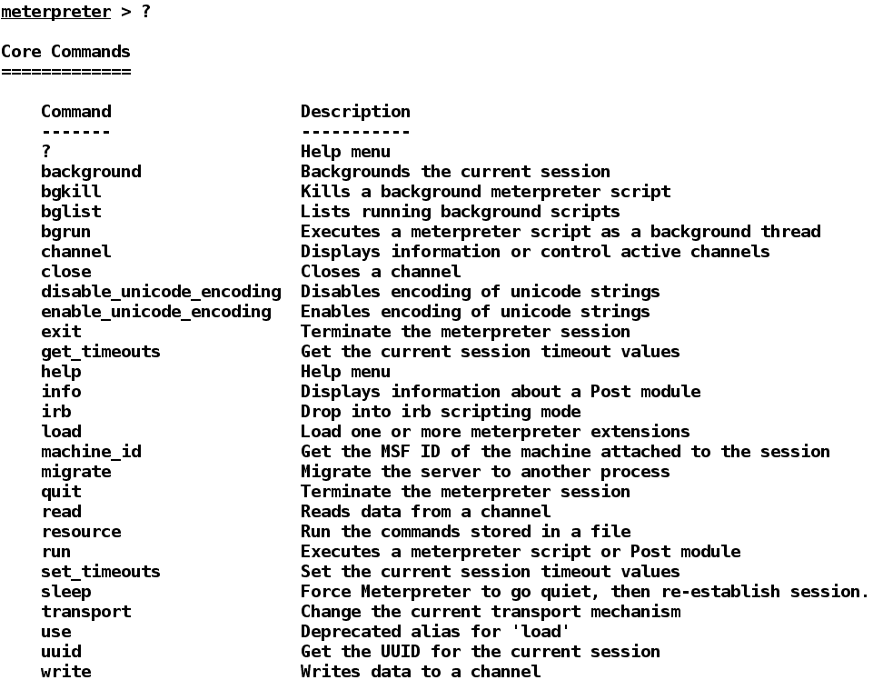

# 后台命令

在执行后利用时，我们可能会遇到需要执行其他任务的情况，例如测试不同的利用，或运行权限提升利用。在这种情况下，我们需要将当前的 MeterMeter 会话置于后台。我们可以通过发出`background`命令来实现，如下面的屏幕截图所示：

我们可以在前面的屏幕截图中看到，我们成功地将会话置于后台，并使用`sessions -i`命令和会话标识符（在前面的屏幕截图中为`1`）与会话重新交互。

# 从频道读

MeterMeter 通过许多通道与目标交互。在进行后期开发时，我们可能需要列出并读取特定频道的内容。我们可以按如下方式发出`channel`命令：

在前面的屏幕截图中，我们通过发出`channel -l`命令列出了所有可用的频道。我们可以通过发出`channel -r [channel-id]`来读取频道。通道子系统允许通过 MeterMeter 外壳读取、列出和写入作为通信子通道存在的所有逻辑通道。

# 文件操作命令

我们在前面的章节中介绍了一些文件操作。让我们修改一些文件操作命令，比如`pwd`。使用`pwd`命令，我们可以查看当前目录，如下图所示：

此外，我们可以使用`cd`命令浏览目标文件系统，并使用`mkdir`命令创建目录，如以下屏幕截图所示：

MeterMeter 外壳允许我们使用`upload`命令将文件上传到目标系统。让我们看看它是如何工作的：

我们可以通过发出`edit`命令和文件名来编辑目标上的任何文件，如图所示：

现在我们通过发出如下的`cat`命令来查看文件的内容：

我们可以使用`ls`命令列出目录中的所有文件，如下所示：

我们可以使用`rmdir`命令从目标中删除特定目录，使用`rm`命令删除文件，如下所示：

另外，我们可以使用`download`命令从目标下载文件，如下所示：

# 桌面命令

Metasploit 具有桌面命令功能，例如枚举桌面、使用网络摄像机拍照、从麦克风录制、流媒体摄像机等等。让我们看看这些功能：

可以使用`enumdesktops`和`getdesktop`获取与目标桌面相关的信息。`enumdesktop`命令列出所有可用的桌面，而`getdesktop`列出与当前桌面相关的信息。

# 截图和相机枚举

在拍摄屏幕截图、网络摄像头截图、运行实时流或键盘记录之前，测试人员必须获得事先许可。然而，我们可以通过使用`snapshot`命令拍摄快照来查看目标的桌面，如下所示：

查看保存的 JPEG 文件，我们有以下内容：

让我们看看是否可以列举摄像头，看看谁在系统上工作：

使用`webcam_list`命令，我们可以找到与目标相关联的摄像机数量。让我们使用`webcam_stream`命令对摄像机进行流式处理，如下所示：

发出上述命令将在浏览器中打开 web 摄影机流，如以下屏幕截图所示：

我们也可以选择快照而不是流式传输，通过发出如下的`webcam_snap`命令：

有时，我们需要倾听环境以进行监测。为此，我们可以使用`record_mic`命令，如下所示：

我们可以通过`-d`开关传递秒数，用`record_mic`命令设置捕获的持续时间。

另一个伟大的功能是找到空闲时间来确定使用时间，并在目标机器上的用户不太活跃时攻击系统。我们可以通过`idletime`命令来实现，如下图所示：

可以从目标获得的其他有趣信息是**键记录**。我们可以通过发出`keyscan_start`命令启动键盘嗅探器模块来转储键盘日志，如下所示：

几秒钟后，我们可以使用`keyscan_dump`命令转储密钥日志，如下所示：

在本节中，我们看到了许多命令。现在，让我们转到后期开发的高级部分。

# 使用 Metasploit 进行高级后期开发

在本节中，我们将使用从主要命令收集的信息来获得进一步的成功并访问目标的级别。

# 获取系统权限

如果我们闯入的应用是以管理员权限运行的，那么通过发出`getsystem`命令就可以轻松获得系统级权限，如下面的屏幕截图所示：

系统级权限提供最高级别的权限，能够在目标系统上执行几乎任何操作。

较新版本的 Windows 上的`getsystem`模块不太可靠。建议尝试本地权限提升方法和模块来提升。

# 使用 timestomp 更改访问、修改和创建时间

从私人组织到执法部门，Metasploit 无处不在。因此，在执行隐蔽操作时，强烈建议更改访问、修改或创建文件的时间。我们可以使用`timestomp`命令更改文件的时间和日期。在上一节中，我们创建了一个名为`creditcard.txt`的文件。让我们使用`timestomp`命令更改其时间属性，如下所示：

我们可以看到访问时间为`2016-06-19 23:23:15`。我们可以使用`-z`开关将其修改为`1999-11-26 15:15:25`，如上图所示。让我们看看文件是否被正确修改：

我们成功地更改了`creditcard.txt`文件的时间戳。我们还可以使用`-b`开关清空文件的所有时间细节，如下所示：

通过使用`timestomp,`我们还可以单独更改修改、访问和创建时间。

# 其他利用后模块

Metasploit 提供 250 多个开发后模块；然而，我们将只讨论几个有趣的问题，剩下的将留给您作为练习来讨论。

# 使用 Metasploit 收集无线 SSID

使用`wlan_bss_list`模块可以有效地发现目标系统周围的无线网络。该模块允许我们对目标周围的 Wi-Fi 网络的位置和其他必要信息进行指纹识别，如以下屏幕截图所示：

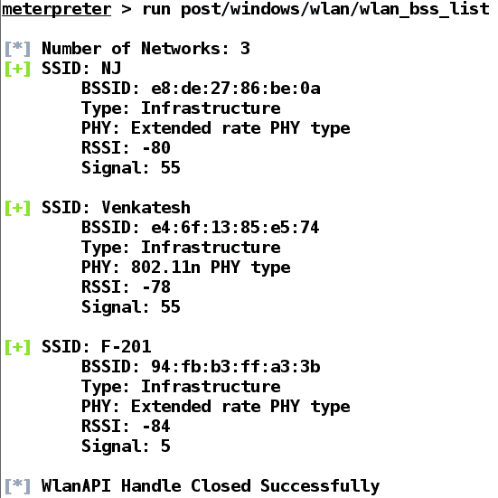

# 使用 Metasploit 收集 Wi-Fi 密码

与前面的模块类似，我们有`wlan_profile`模块，它从目标系统收集所有保存的 Wi-Fi 凭据。我们可以使用以下模块：

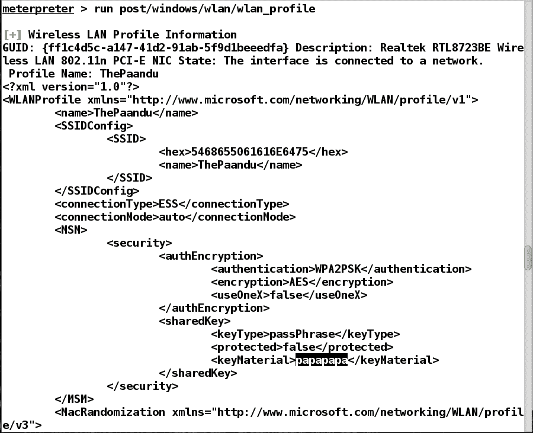

在前面的屏幕截图中，我们可以在`<name>`标签中看到网络名称，在`<keyMaterial>`标签中看到密码。

# 获取应用列表

Metasploit 为各种类型的应用提供凭证收割机；但是，为了确定目标上安装了哪些应用，我们需要使用`get_application_list`模块获取应用列表，如下所示：

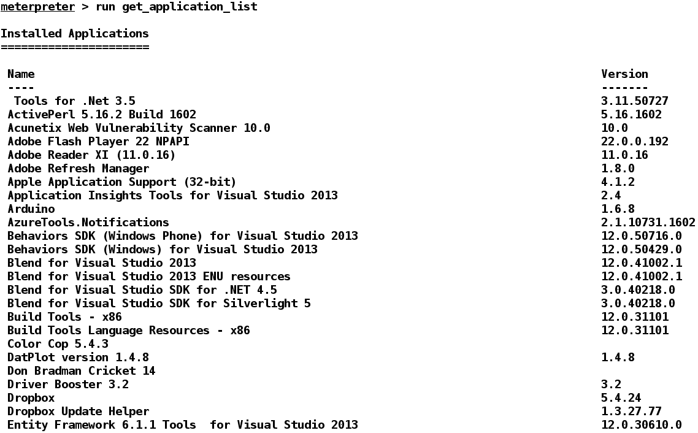

了解应用后，我们可以在目标上运行各种信息收集模块。

# 收集 Skype 密码

假设我们发现目标系统正在运行 Skype。Metasploit 提供了一个很好的模块，可以使用`skype`模块获取 Skype 密码：

# 收集 USB 历史

Metasploit 具有一个 USB 历史记录恢复模块，可确定目标系统上使用了哪些 USB 设备。在 USB 保护设置到位且仅允许特定设备连接的情况下，此模块非常方便。使用此模块，欺骗 USB 描述符和硬件 ID 变得容易得多。

有关欺骗 USB 描述符和绕过端点保护的更多信息，请参阅[https://www.slideshare.net/the_netlocksmith/defcon-2012-hacking-using-usb-devices](https://www.slideshare.net/the_netlocksmith/defcon-2012-hacking-using-usb-devices) 。

让我们看看如何使用该模块：

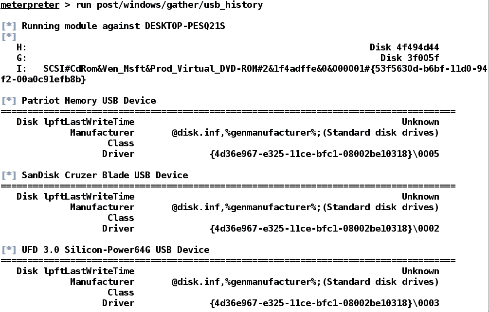

# 使用 Metasploit 搜索文件

Metasploit 提供了一个很酷的命令来搜索感兴趣的文件，这些文件可以进一步下载。我们可以使用`search`命令列出所有具有特定文件扩展名的文件，如`*.doc`、`*.xls`等，如下所示：

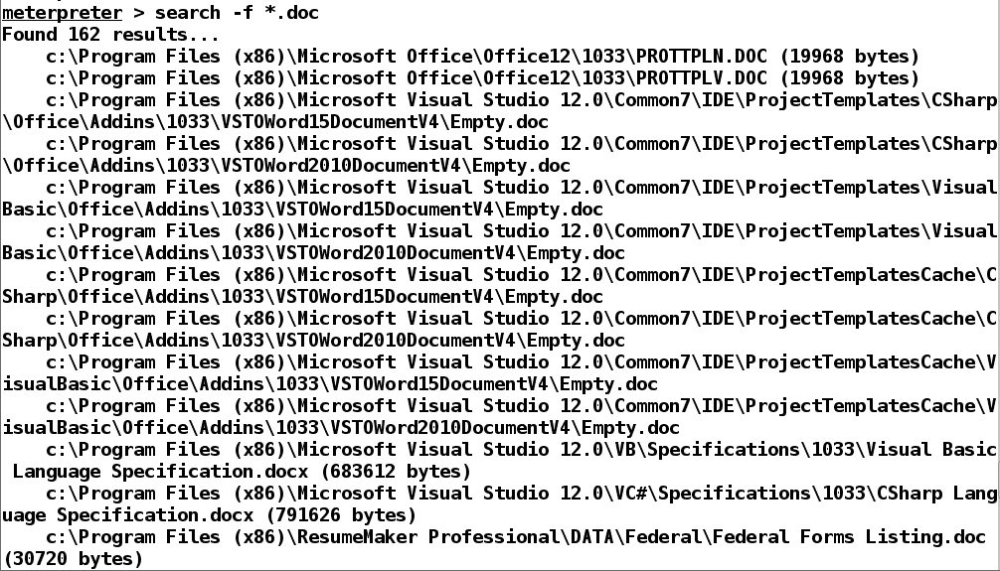

# 使用 clearev 命令从目标中擦除日志

可以使用`clearev`命令清除目标系统的所有日志：

但是，如果你不是执法人员，你不应该清除目标的日志，因为日志为蓝队提供了必要的信息，以加强他们的防御。Metasploit 中还存在另一个用于处理日志的优秀模块，称为`event_manager`，可以使用该模块，如以下屏幕截图所示：

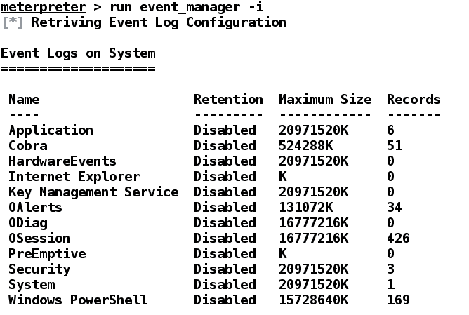

让我们在下一节中跳转到 Metasploit 的高级扩展功能。

# Metasploit 的高级扩展功能

在本章中，我们介绍了大量的后期开发。现在，让我们在本节中介绍 Metasploit 的一些高级功能。

# 使用 pushm 和 popm 命令

Metasploit 提供了两个伟大的命令，`pushm`和`popm`。`pushm`命令将当前模块推送到模块堆栈上，`popm`将推送到的模块从模块堆栈顶部弹出；但是，这不是进程可用的标准堆栈。相反，它是 Metasploit 对相同概念的利用，但在其他方面是不相关的。使用这些命令的优点是操作速度快，节省了大量时间和精力。

考虑一个场景，我们正在测试一个具有多个漏洞的内部服务器。我们在内部网络的每个系统上运行两个可利用的服务。为了在每台机器上利用这两个服务，我们需要在模块之间为这两个漏洞提供快速切换机制，而不需要保留选项。在这种情况下，我们可以使用`pushm`和`popm`命令。我们可以使用一个模块测试服务器的单个漏洞，然后将该模块推送到堆栈上并加载另一个模块。使用第二个模块完成任务后，我们可以使用`popm`命令从堆栈中弹出第一个模块，并且所有选项保持不变。

让我们通过以下屏幕截图了解更多有关该概念的信息：

在前面的屏幕截图中，我们可以看到我们使用`pushm`命令将`psexec`模块推到堆栈上，并加载了`exploit/multi/handler`模块。一旦我们完成了对`multi/handler`模块的操作，我们就可以使用`popm`命令从堆栈中重新加载`psexec`模块，如下图所示：

我们可以看到，`psexec`模块的所有选项与堆栈上的模块一起被保存。因此，我们不需要再次设置选项。

# 使用 reload、edit 和 reload_all 命令加快开发速度

在模块的开发阶段，我们可能需要对模块进行多次测试。每次在对新模块进行更改时关闭 Metasploit 都是一项乏味、烦人且耗时的任务。必须有一种机制使模块开发成为一项简单、简短、有趣的工作。幸运的是，Metasploit 提供了`reload`、`edit`和`reload_all`命令，这使得模块开发人员的生活相对简单。我们可以使用`edit`命令动态编辑任何 Metasploit 模块，并使用`reload`命令重新加载已编辑的模块，而无需关闭 Metasploit。如果在多个模块中进行了更改，我们可以使用`reload_all`命令一次重新加载所有 Metasploit 模块。

让我们看一个例子：

在前面的屏幕截图中，我们正在编辑来自`exploit/windows/ftp`目录的`freefloatftp_user.rb`漏洞，因为我们发出了`edit`命令。我们将有效负载大小从`444`更改为`448`，并保存了文件。接下来，我们需要发出`reload`命令来更新 Metasploit 中模块的源代码，如下图所示：

使用`reload`命令，我们消除了在处理新模块时重新启动 Metasploit 的需要。

`edit`命令启动 Metasploit 模块，以便在 vi 编辑器中进行编辑。在[了解更多有关 vi 编辑器命令的信息 http://www.tutorialspoint.com/unix/unix-vi-editor.htm](http://www.tutorialspoint.com/unix/unix-vi-editor.htm) 。

# 利用资源脚本

Metasploit 通过资源脚本提供自动化。通过自动设置所有内容，资源脚本消除了手动设置选项的任务，从而节省了设置模块选项和有效负载所需的时间。

创建资源脚本有两种方法：手动创建脚本或使用`makerc`命令。我建议使用`makerc`命令而不是手动脚本，因为它可以消除键入错误。`makerc`命令将之前发出的所有命令保存在一个文件中，该文件可与`resource`命令一起使用。让我们看一个例子：

我们可以在前面的屏幕截图中看到，我们通过设置相关的负载和选项（如`LHOST`和`LPORT`）启动了一个漏洞处理程序模块。发出`makerc`命令将系统地将所有这些命令保存到我们选择的文件中，在本例中为`multi_hand`。我们可以看到`makerc`成功地将最后六条命令保存到`multi_hand`资源文件中。让我们按如下方式使用资源脚本：

我们可以看到，只要在脚本后面发出`resource`命令，它就会自动复制我们保存的所有命令，从而消除了重复设置选项的任务。

# 在 Metasploit 中使用 AutoRunScript

Metasploit 提供了另一个使用`AutoRunScript`的强大功能。`AutoRunScript`选项可以通过发出`show advanced`命令来填充。`AutoRunScript`自动执行后期攻击，一旦获得目标访问权限，就会执行。我们可以通过发出`set AutoRunScript [script-name]`手动设置`AutoRunScript`选项，也可以在资源脚本本身中设置`AutoRunScript`选项，该脚本将自动开发和后期开发一起进行。

`AutoRunScript`还可以使用`multi_script`和`multi_console_command`模块运行多个后期开发脚本。让我们举一个例子，其中我们有两个脚本，一个用于自动利用，另一个用于自动后利用，如以下屏幕截图所示：

这是一个小型的攻击后脚本，可自动执行`checkvm`（用于检查目标是否在虚拟环境中运行的模块）和`migrate`（用于帮助从攻击过程迁移到更安全过程的模块）。让我们看一下利用漏洞脚本：

前面的资源脚本通过设置所有必需的参数来自动利用 HFS 文件服务器。我们还将`AutoRunScript`选项设置为`multi_console_command`选项，这允许执行多个利用后脚本。我们使用`-rc`开关将开发后脚本定义为`multi_console_command`，如前面的屏幕截图所示。

让我们运行开发脚本并在以下屏幕截图中分析其结果：

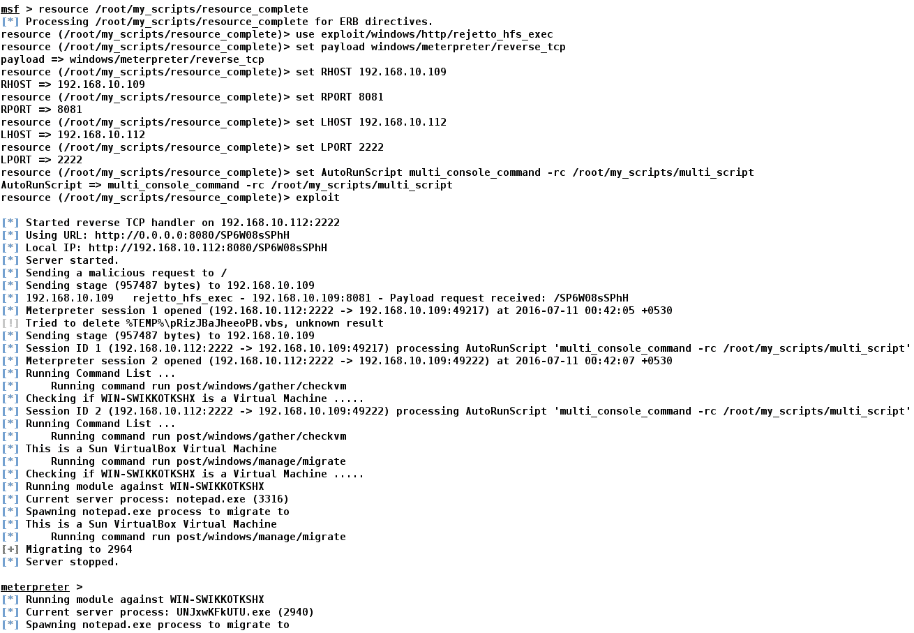

我们可以在前面的截图中看到，在攻击完成后不久，`checkvm`和`migrate`模块被执行，这表明目标是`Sun VirtualBox Virtual Machine`，流程被迁移到`notepad.exe`。脚本的成功执行可以在输出的以下剩余部分中看到：

我们成功迁移到`notepad.exe`流程；但是，如果`notepad.exe`有多个实例，则流程迁移也可能跳过其他流程。

# 在 AutoRunScript 选项中使用 multiscript 模块

我们也可以使用`multiscript`模块代替`multi_console_command`模块。让我们创建一个新的利用后脚本，如下所示：

正如我们在前面的屏幕截图中所看到的，我们创建了一个名为`multi_scr.rc`的新的攻击后脚本。我们需要对开发脚本进行更改以适应这些更改，如下所示：

我们只是将`multi_console_command`替换为`multiscript`，并更新了我们的后期开发脚本的路径，如前面的屏幕截图所示。让我们看看当我们运行`exploit`脚本时会发生什么：

我们可以看到，在获得对目标的访问权限后，`checkvm`模块执行，紧接着是`migrate`、`get_env`和`event_manager`命令，如下图所示：

`event_manager`模块显示来自目标系统的所有日志，因为我们在资源脚本中提供了`-i`开关和命令。`event_manager`命令的结果如下：

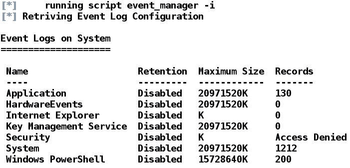

# 使用 Metasploit 的权限提升

在渗透测试过程中，我们经常会遇到访问受限的情况，如果我们运行`hashdump`等命令，可能会出现以下错误：

在这种情况下，如果我们尝试使用`getsystem`命令获取系统权限，我们会得到以下错误：

那么，在这种情况下我们该怎么办？解决方法是使用后期攻击升级权限，以实现最高级别的访问。以下演示是在 Windows Server 2008 SP1 操作系统上进行的，在该操作系统中，我们使用本地漏洞攻击绕过限制并获得对目标的完全访问权限：

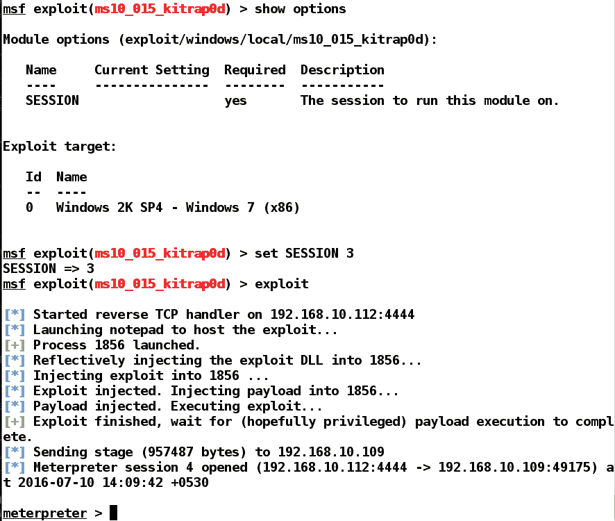

在前面的屏幕截图中，我们使用`exploit/windows/local/ms10_015_kitrap0d`漏洞提升权限，并获得最高级别的访问权限。让我们使用`getuid`命令检查访问级别：

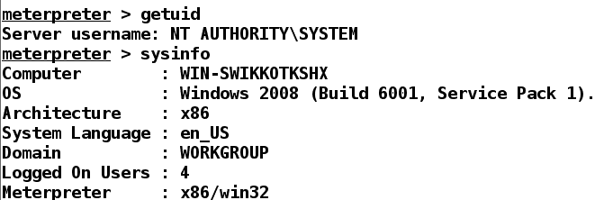

现在，我们可以看到我们拥有系统级访问权限，现在可以在目标上执行任何操作。

有关 KiTrap0D 漏洞的更多信息，请参阅[https://docs.microsoft.com/en-us/security-updates/SecurityBulletins/2010/ms10-015](https://docs.microsoft.com/en-us/security-updates/SecurityBulletins/2010/ms10-015) 。

现在让我们运行`hashdump`命令，检查它是否有效：

答对 了我们很容易就得到了哈希值。

# 使用 mimikatz 查找明文密码

**mimikatz**是 Metasploit 的优秀补充，可以从 lsass 服务恢复明文密码。我们已经通过使用 pass-the-hash 攻击使用了 hash；然而，有时也需要密码来节省时间，以及使用 HTTP 基本身份验证，这要求另一方知道密码而不是散列。

可以使用 Metasploit 中的`load mimikatz`命令加载 mimikatz。使用 mimikatz 模块提供的`kerberos`命令可以找到密码：

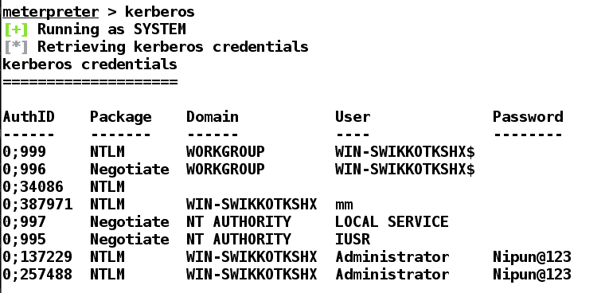

# 使用 Metasploit 嗅探流量

是的，Metasploit 确实提供了嗅探来自目标主机的流量的功能。我们不仅可以嗅探特定接口，还可以嗅探目标上的任何指定接口。要运行此模块，我们首先需要列出所有接口，并从中选择任何一个：

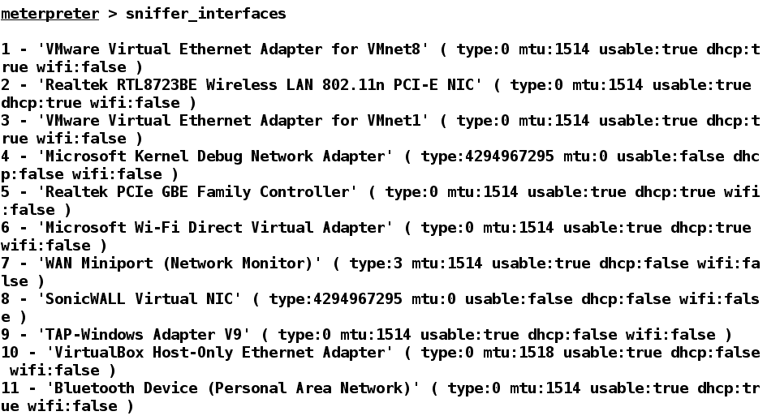

我们可以看到我们有多个接口。让我们在无线接口上开始嗅探，该接口被指定为`2`ID，如以下屏幕截图所示：

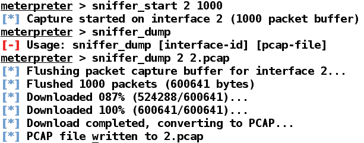

我们通过在无线接口上发出一个 ID 为`2`且`1000`数据包作为缓冲区大小的`sniffer_start`命令来启动嗅探器。我们可以看到，通过发出`sniffer_dump`命令，我们成功下载了 PCAP。让我们看看通过在 Wireshark 中启动捕获的 PCAP 文件收集了哪些数据。我们可以通过发出以下命令来执行此操作：

我们可以在 PCAP 文件中看到各种数据，包括 DNS 查询、HTTP 请求和明文密码：

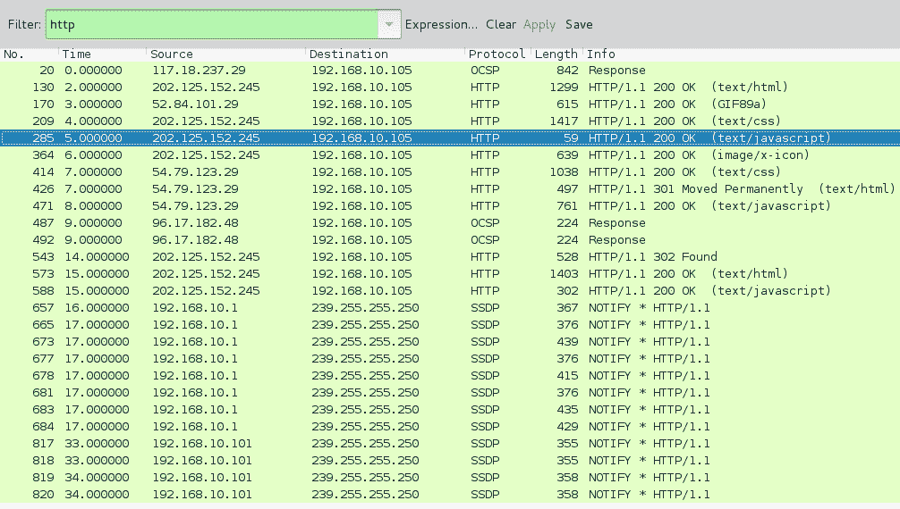

# 使用 Metasploit 的主机文件注入

我们可以通过注入主机文件对目标执行各种钓鱼攻击。我们可以为特定域向主机文件添加条目，从而轻松利用钓鱼攻击。

让我们看看如何使用 Metasploit 执行主机文件注入：

我们可以看到，我们使用了`SESSION 1`上的`post/windows/manage/inject_host`模块，并将条目插入到目标的主机文件中。让我们看看当目标打开[时会发生什么 https://www.yahoo.com/](https://www.yahoo.com/) ：

我们可以看到目标被重定向到我们的恶意服务器，该服务器可以轻松地托管钓鱼页面。

# 仿冒 Windows 登录密码

Metasploit 包含一个可以仿冒登录密码的模块。它生成一个登录弹出窗口，类似于可获取凭据的真实 Windows 弹出窗口，并且由于它冒充为合法登录，因此用户必须填写凭据，然后继续此正在进行的操作。我们可以通过运行`post/windows/gather/phish_login_pass`对用户登录进行钓鱼。当我们运行此模块时，假登录框会在目标位置弹出，如以下屏幕截图所示：

一旦目标公司填写凭证，我们将收到纯文本凭证，如以下屏幕截图所示：

瞧！我们轻而易举地拿到了证书。正如我们在本章中所看到的，Metasploit 通过使用独立工具（如 mimikatz 和本机脚本）为后期开发提供了大量强大的功能。

# 总结和练习

在本章中，我们详细介绍了后期开发。我们研究了从基本到高级的开发后场景。我们还研究了 Windows 环境中的特权升级以及一些其他高级技术。

以下是您应该自己尝试的练习：

*   为 Metasploit 中尚未出现的功能开发您自己的开发后模块
*   开发用于获取访问权限、维护访问权限和清除跟踪的自动化脚本
*   尝试使用至少一个针对基于 Linux 的操作系统的后期开发模块来帮助 Metasploit

在下一章中，我们将利用本章中介绍的大多数攻击后技巧来绕过目标系统的保护。我们将表演一些最前沿的 Metasploit 功夫，并尝试击败 AVs 和防火墙。