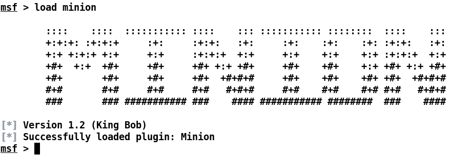
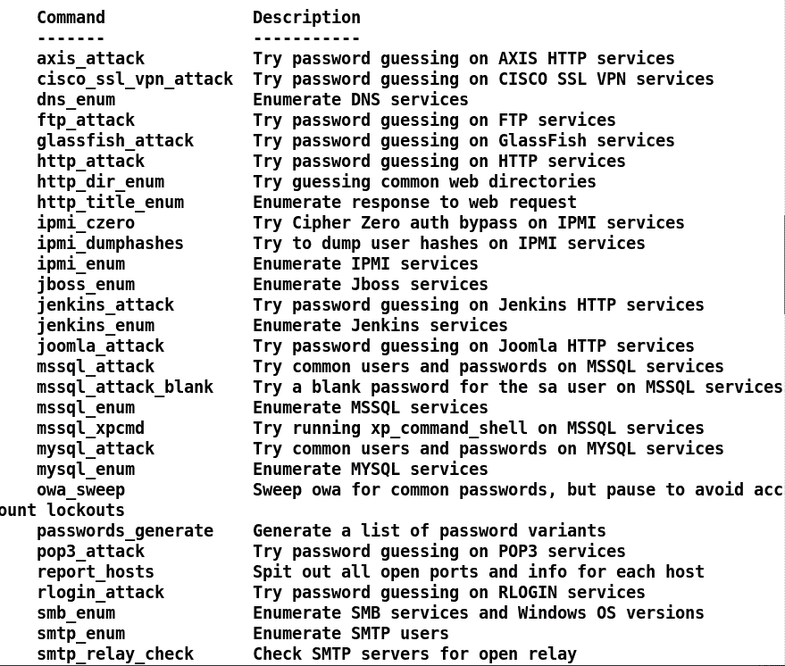
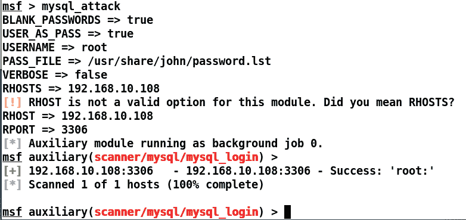
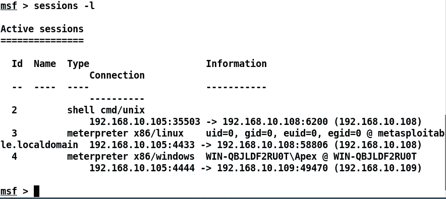
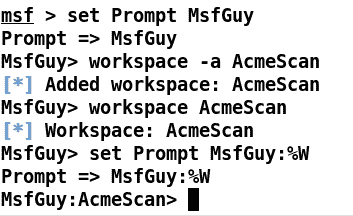
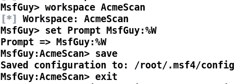
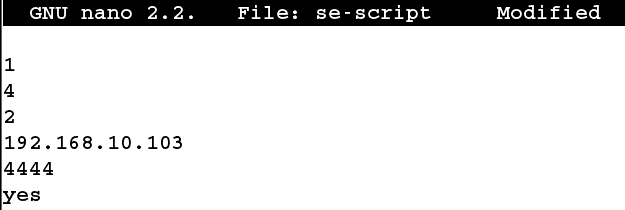
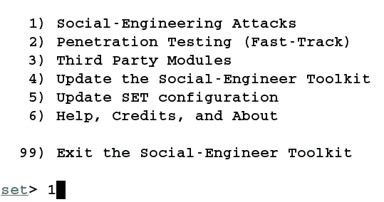

# 二十二、提示和技巧

在本书中，我们讨论了许多围绕 Metasploit 的技术和方法。从开发漏洞到编写 Armitage 脚本，我们涵盖了所有内容。然而，为了实现 Metasploit 的最佳实践，我们必须知道充分利用 Metasploit 框架的技巧和窍门。在本章中，我们将介绍一些帮助使用 Metasploit 进行渗透测试的快速技巧和脚本。在本章中，我们将介绍以下主题：

*   自动化脚本
*   第三方插件
*   备忘单
*   最佳做法
*   使用速记命令节省时间

所以，让我们深入研究这最后一章，学习一些很酷的技巧。

# 使用 Minion 脚本实现自动化

我在随机检查 GitHub 的自动化脚本时发现了这个脚本的精华。Minion 是 Metasploit 的插件，它可以非常方便地进行快速攻击和扫描。Metasploit 的`minion`插件可从[下载 https://github.com/T-S-A/Minion](https://github.com/T-S-A/Minion) 。

下载文件后，将其复制到`~/.msf4/plugins`目录，并启动`msfconsole`：

在前面的章节中，我们看到了如何使用 load 命令将插件快速加载到 Metasploit 中。类似地，让我们使用`load minion`命令加载`minion`插件，如前面的屏幕截图所示。成功加载后，切换到您正在使用的工作区，或者如果工作区中没有主机，则执行 Nmap 扫描：

由于`db_nmap`扫描填充了大量结果，让我们看看启用了哪些`minion`选项：

大量我们可以看到目标主机上有 MySQL 服务。下面我们使用`mysql_enum`命令：

哇！我们从不需要加载模块、填写任何选项或启动模块，因为`minion`插件为我们实现了自动化。我们可以看到目标主机的 MySQL 版本。下面我们使用`minion`中的 MySQL 攻击命令：

太神了 Minion 插件为我们实现了暴力攻击的自动化，成功登录目标，用户名为 root，密码为空。该脚本的美妙之处在于，您可以编辑和自定义它，并添加更多模块和命令，这也将帮助您开发 Metasploit 插件。

# 使用 connect 作为 Netcat

Metasploit 提供了一个名为`connect`的强大命令，以提供类似于 Netcat 实用程序的功能。假设一个系统外壳正在等待我们连接目标系统的某个端口，而我们不想从 Metasploit 控制台切换。我们可以使用`connect`命令连接目标，如下图所示：

我们可以看到，我们从 Metasploit 框架中初始化了与侦听器的连接，这可能有助于在尚未通过 Metasploit 获得初始访问权限的目标上进行反向连接。

# Shell 升级和后台会话

有时，我们不需要与受损主机进行动态交互。在这种情况下，我们可以指示 Metasploit 在使用`-z`开关利用服务时立即将新创建的会话置于后台，如下所示：

正如我们所看到的，我们打开了一个命令 shell，它总是希望有更好的控制访问，如 MeterMeter 提供的访问。在这种情况下，我们可以使用`-u`开关升级会话，如下图所示：

太神了我们刚刚把炮弹升级为米级炮弹，更好地控制了目标。

# 命名约定

在一个相当大的渗透测试场景中，我们可能会得到大量的系统和仪表外壳。在这种情况下，最好为所有壳命名，以便于识别。考虑下面的情景：

我们可以使用`-n`开关命名一个 shell，如下面的屏幕截图所示：

正如我们在前面的屏幕截图中所看到的那样，命名似乎更好、更容易记住。

# 更改提示并使用数据库变量

在你最喜欢的渗透测试框架上工作并得到提示有多酷？我想说，很简单。要在 Metasploit 中显示提示，只需将提示变量设置为您选择的任何变量。除此之外，假设您倾向于忘记当前使用的工作区，您可以使用带有数据库变量`%W`的提示符来轻松访问它，如以下屏幕截图所示：

此外，您始终可以执行以下屏幕截图所示的操作：

我们可以看到，我们使用`%D`显示当前本地工作目录，`%H`表示主机名，`%J`表示当前正在运行的作业数，`%L`表示本地 IP 地址（非常方便），`%S`表示我们拥有的会话数，`%T`表示时间戳，`%U`表示用户名，`%W`对于工作区。

# 在 Metasploit 中保存配置

大多数时候，我忘记切换到为特定扫描创建的工作区，结果合并到默认工作区。但是，使用 Metasploit 中的`save`命令可以避免此类问题。假设您已经移动了工作区，并自定义了提示和其他内容。您可以点击`save`命令保存配置。这意味着下次启动 Metasploit 时，您将使用留下的相同参数和工作空间着陆，如以下屏幕截图所示：

让我们启动 Metasploit，看看是否成功保存了上一次会话中的所有内容：

是的！所有内容都收集在配置文件中。从现在起，在切换工作区时不再有任何麻烦。

# 使用内联处理程序和重命名作业

Metasploit 提供了一种使用`handler`命令设置处理程序的快速方法，如以下屏幕截图所示：

我们可以看到，我们可以使用`-p`交换机定义有效负载，使用`-H`和`-P`交换机定义主机和端口。运行 handler 命令将快速生成一个作为后台作业的处理程序。说到后台作业，也可以使用`rename_job`命令重命名，如下图所示：

# 在多个仪表上运行命令

是的！我们可以使用带有`sessions`命令的`-c`开关在许多打开的 MeterMeter 会话上运行 MeterMeter 命令，如以下屏幕截图所示：

我们可以看到 Metasploit 智能地跳过了一个非 MeterMeter 会话，并使该命令在所有 MeterMeter 会话上运行，如前面的屏幕截图所示。

# 自动化社会工程工具包

**社会工程工具包**（**集**是一套基于 Python 的工具，针对渗透测试的人的方面。我们可以使用 SET 执行网络钓鱼攻击、涉及受害者重定向的网络劫持攻击（表示原始网站已移动到其他位置）、针对特定软件的基于文件格式的攻击（利用受害者的系统）以及许多其他攻击。使用 SET 最好的方法是菜单驱动的方法，它可以在短时间内设置快速利用向量。

现场教程可在以下网址找到：[https://www.social-engineer.org/framework/se-tools/computer-based/social-engineer-toolkit-set/](https://www.social-engineer.org/framework/se-tools/computer-based/social-engineer-toolkit-set/) 。

SET 在生成客户端攻击模板方面非常快。但是，我们可以使用自动化脚本使其更快。让我们看一个例子：

在前面的屏幕截图中，我们将`se-script`输入`seautomate`工具，从而生成有效负载并自动设置漏洞处理程序。让我们更详细地分析一下`se-script`：

您可能想知道脚本中的数字如何调用有效负载生成和利用处理程序设置过程。

正如我们前面讨论的，SET 是一个菜单驱动的工具。因此，脚本中的数字表示菜单选项的 ID。让我们把整个自动化过程分解成更小的步骤。

脚本中的第一个数字是`1`。因此，在处理`1`时选择`Social - Engineering Attacks`选项：

脚本中的下一个数字是`4`。因此选择了`Create a Payload and Listener`选项，如下图所示：

下一个数字是`2`，表示有效负载类型为`Windows Reverse_TCP Meterpreter`，如下图所示：

接下来，我们需要指定侦听器的 IP 地址，即脚本中的`192.168.10.103`。这可以手动可视化：

在下一个命令中，我们有`4444`，它是侦听器的端口号：

我们有`yes`作为脚本中的下一个命令。脚本中的`yes`表示侦听器的初始化：

一旦我们提供`yes`，控制权就转移到 Metasploit，漏洞反向处理程序将自动设置，如下图所示：

我们可以像前面讨论的那样，以类似的方式自动化 SET 中的任何攻击。在生成用于客户端开发的自定义有效负载时，SET 可以节省大量时间。然而，使用`seautomate`工具，我们实现了极快的速度。

# Metasploit 和渗透测试备忘单

您可以在以下链接找到 Metasploit 上的一些优秀备忘单：

*   [https://www.sans.org/security-resources/sec560/misc_tools_sheet_v1.pdf](https://www.sans.org/security-resources/sec560/misc_tools_sheet_v1.pdf)
*   [https://null-byte.wonderhowto.com/how-to/hack-like-pro-ultimate-command-cheat-sheet-for-metasploits-meterpreter-0149146/](https://null-byte.wonderhowto.com/how-to/hack-like-pro-ultimate-command-cheat-sheet-for-metasploits-meterpreter-0149146/)
*   [https://null-byte.wonderhowto.com/how-to/hack-like-pro-ultimate-list-hacking-scripts-for-metasploits-meterpreter-0149339/](https://null-byte.wonderhowto.com/how-to/hack-like-pro-ultimate-list-hacking-scripts-for-metasploits-meterpreter-0149339/)

有关渗透测试的更多信息，请参考 SANS 海报[https://www.sans.org/security-resources/posters/pen-testing](https://www.sans.org/security-resources/posters/pen-testing) 并参考[https://github.com/coreb1t/awesome-pentest-cheat-sheets](https://github.com/coreb1t/awesome-pentest-cheat-sheets) 关于渗透测试工具和技术的大部分备忘单。

# 进一步阅读

在这本书中，我们以一种实用的方式介绍了 Metasploit 和各种其他相关主题。我们涵盖了漏洞开发、模块开发、在 Metasploit 中移植漏洞、客户端攻击、基于服务的渗透测试、绕过技术、执法机构使用的技术以及 Armitage。我们还了解了 Ruby 编程的基础知识和 Armitage 的 Cortana。

阅读本书后，您可能会发现以下资源提供了有关这些主题的更多详细信息：

*   要学习 Ruby 编程，请参考：[http://ruby-doc.com/docs/ProgrammingRuby/](http://ruby-doc.com/docs/ProgrammingRuby/)
*   有关装配编程，请参阅：[https://github.com/jaspergould/awesome-asm](https://github.com/jaspergould/awesome-asm)
*   开发利用请参考：[https://www.corelan.be/](https://www.corelan.be/)
*   有关 Metasploit 开发，请参阅：[https://github.com/rapid7/metasploit-framework/wiki](https://github.com/rapid7/metasploit-framework/wiki)
*   关于基于 SCADA 的开发，请参考：[https://scadahacker.com/](https://scadahacker.com/)
*   有关 Metasploit 的深入攻击文档，请参阅：[https://www.offensive-security.com/metasploit-unleashed/](https://www.offensive-security.com/metasploit-unleashed/)
*   有关 Cortana 脚本的更多信息，请参阅：[http://www.fastandeasyhacking.com/download/cortana/cortana_tutorial.pdf](http://www.fastandeasyhacking.com/download/cortana/cortana_tutorial.pdf)
*   有关 Cortana 脚本资源，请参阅：[https://github.com/rsmudge/cortana-scripts](https://github.com/rsmudge/cortana-scripts)