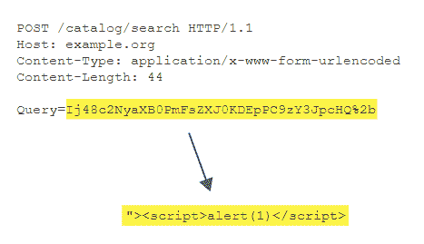
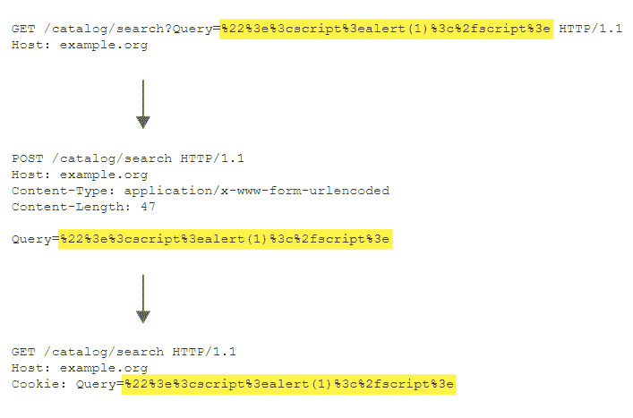

# 三、执行应用渗透测试

现在，我们已经了解了如何跨各种平台配置和设置我们的 Burp 代理，现在我们可以从应用 pentest 开始。在当今世界，执行五旬斋的背后有各种各样的目的；它可以是 bug 赏金，也可以是对客户的全面评估。最初的方法通常是相同的；然而，归根结底，这是一个巨大的差异。臭虫赏金猎人的目标是找到一个或一组如果被利用可能导致严重灾难的特定漏洞，以便他们能够获得赏金。

另一方面，对于一个完全成熟的 pentest 来说，pentester 的工作并不止于此。pentester 必须执行完整的。。。

# bug 赏金和客户发起的 pentest 之间的区别

在我们进入核心细节之前，让我们先了解以下两种心态：

*   **臭虫赏金五旬期心态**：
    *   其目的是发现具有影响的漏洞并获得良好的赏金
    *   不需要对应用进行完整的评估
    *   一只虫子就足以获得赏金
    *   未报告应用中的所有漏洞，仅报告已发现的漏洞
    *   没有特别的时间表；这可以在 pentester 方便的时候完成
*   **客户发起的 pentest 心态**：
    *   目的是确保所有应用流程和功能都经过测试
    *   整个应用需要审核的时间有限
    *   没有赏金或奖励
    *   需要确保扫描器发现的所有漏洞都得到验证和报告
    *   还需要通过了解所有的相互依赖关系来确定整个应用的范围，并确保端点得到良好的保护，因为有时后端应用（如支持）将不提供给 bug 赏金猎人，而是在客户端发起的评估中
*   **两种心态的共同点**：
    *   必须有头脑链接多个漏洞，并对基础应用造成严重影响
    *   另外，确保攻击者知道该特定应用的所有端点
    *   确定整个应用的存在范围并测试所有端点以发现缺陷

花点时间想想这两种方法之间的区别。我相信你会同意，在进行五旬斋时，需要有两种完全不同的心态。

# 开始渗透测试

如果应用渗透测试不符合以下要求，则通常称其为不完整：

*   遵循执行侦察的标准方法
*   枚举功能
*   测试单个参数
*   创建测试用例
*   执行非侵入性利用
*   提供关于该问题的报告
*   实施复制步骤、概念验证代码和可能的缓解措施

在我的职业生涯中，我曾在许多场合遇到过安全咨询公司或独立专业人士，他们运行的自动扫描仪只检测少数漏洞，几乎总是无法发现逻辑问题。然后利用这些漏洞进行半成品攻击。。。

# 类型和特征

Burp Suite 附带以下一套内置工具，以简化每个渗透测试仪的使用寿命：

*   **扫描仪**：帮助自动测试网站内容和漏洞。它有一个主动和被动模式，可由用户切换和配置。
*   **入侵者**：这允许用户在捕获的请求中进行某些更改，并且通过某些修改，用户可以通过在每个请求中传递不同的参数值来强制执行任务。
*   **中继器**：此功能允许用户在移动中修改报头值，并反复向应用服务器发送请求。
*   **合作者客户**：这是 Burp 提供的一个非常有趣的功能。它允许用户检查带外漏洞。这些都是非常热门的漏洞，因为它们不容易找到。
*   **Clickbandit**：此功能允许用户针对易受攻击的应用创建**clickjacking**页面。
*   **Sequencer**：Sequencer 功能允许用户分析应用 cookie 生成机制的随机性；它为用户提供了非常详细的会话随机性或可预测性分析。
*   **解码器**：这允许用户检查任何类型的编码，并允许用户解码以清除文本，反之亦然。
*   **比较器**：此功能允许用户比较两个或多个请求的响应，以找出它们之间的差异。

让我们看看下面的 BurpSuite 的低级示意图：

您可以在以下三个部分中看到刀具分离：

*   **侦察与分析**
*   **漏洞检测与利用**
*   **刀具配置**

上图为您提供了处理请求的非常好的方法。解析请求后，该工具将执行主动爬网和主动发现，并允许用户在侦察和分析阶段进行自定义发现。在此过程中，该工具会主动将所有信息放入 HTTP 历史记录和站点地图中，以供以后使用。一旦收集到这些信息，用户可以向中继器、入侵者或扫描程序发送任何特定请求。扫描器也可以提供整个网站的帖子抓取。

工具配置将允许用户管理认证、会话处理、任务调度和各种其他任务。代理是 Burp Suite 机制的核心。Burp Suite Scanner 是用于执行 pentest 的一体式自动化工具包。从发现内容到发现漏洞，它无所不能。还有更多的插件可以用来增强扫描结果。我们将在后面的章节中讨论这些插件。Burp 扫描仪主要包括以下两个部分：一个是内容爬网，另一个是审计：

*   **内容爬网**：Burp 爬虫几乎像真实用户一样在应用中导航；它提交输入、表单，还捕获链接并创建应用的完整站点地图。它显示找到的内容和未返回响应的内容。
*   **审计**：这是实际的扫描仪，它将模糊所有参数，以确定应用中是否存在漏洞。用户可以对其进行优化，以获得更好的性能

现在我们已经熟悉了 BurpSuite 的类型和特性，我们将研究爬行机制来对应用的内容进行编目。

# 爬行

我想在这里强调的是，Burp 有一种惊人的爬行机制，能够以尽可能接近的精度绘制站点结构。爬行似乎是一项简单的任务，但在现代动态应用中却并非如此。作为 pentesters，由于 URL 方案的实现，我们总是看到扫描仪在爬行阶段以巨大的循环运行，而且扫描似乎永远不会完成，尤其是在测试购物车时。当这样的事情发生时，真的很令人沮丧，因为那时你必须完全依靠手动策略。另一方面，Burp 有一个非常聪明的方法。Burp 爬虫模仿用户在浏览器上浏览应用的方式。它模拟用户点击、导航和输入提交。。。

# 为什么 BurpSuite 扫描仪？

现在我们已经对 Burp 爬虫的健壮性有了基本的了解，现在是时候了解为什么 Burp 扫描器是任何测试的首选扫描器了。大多数传统扫描仪通常会模糊输入字段，检查响应，并确定是否存在漏洞。但是，如果应用具有某些规则，例如，如果应用对每个请求都强制使用动态 CSRF，该怎么办？如果应用是一个非常动态的应用，根据状态为同一 URL/页面提供不同的内容，或者如果应用在格式错误的请求中使用户无效，该怎么办？不用担心，因为 Burp 已经以不同的方式处理了这一问题，并且理解了潜在的逻辑，使我们能够进行优化扫描。

# 审核员/扫描器

让我们继续了解 Burp 审核/扫描规则和机制。Burp 审计员主要分为以下三个核心类别：

*   被动相
*   活跃期
*   JavaScript 分析阶段

这允许 Burp 主动发现和利用存储的函数，并将其返回给用户以响应输入。通过以最佳方式处理频繁发生的问题和插入点，它还有助于避免重复。此外，它通过并行执行工作有效地利用了系统资源

Burp Auditor 报告了大量问题，广泛分为以下几类：

*   **被动**：这是一种非侵入式审计，纯粹根据正常用户收到的请求和响应进行分析。。。

# 理解插入点

Burp 扫描器是一种非常有效的扫描器，因为它针对不同的插入点。它的目标是输入字段和一组标题，如 cookie、referer、user agent 等。Burp Scanner 通过单独发送有效载荷来单独分析目标，以查看应用如何处理有效载荷。要更好地了解插入点，请执行以下操作：

Burp 还处理各种参数的数据编码。它了解正在使用的参数和任何编码（如果遵循）。一旦检测到编码，它就会通过对有效负载进行编码来模糊参数，如下面的屏幕截图所示。例如，对于标准输入，它传递一个正常有效载荷：

对于 JSON 参数，它使用不同的负载进行模糊化：

对于 XML，它传递不同的负载：

如果应用使用不同的编码，例如 base64，Burp 会自动尝试检测正在使用的编码，并相应地修改有效负载：

如果应用使用嵌套编码，Burp 会尝试检测此行为并相应地创建有效负载，以帮助测试漏洞：

正如我们前面所讨论的，Burp 通过尝试将参数作为`POST`、`GET`请求传递到不同的位置，将值添加到头中，并对其进行模糊化，从而操纵参数的位置。这样做是为了绕过 web 应用防火墙，并尝试将参数发送到特定的应用功能：

Burp 遵循这些不同的样式和机制来帮助对应用执行扫描。这里的核心问题是，如果设置了额外的安全性，它如何扫描和维护有效的会话？那么我们有好消息,；Burp Scanner 爬网到根节点的每个请求，然后根据应用的上下文测试该请求。

Burp Suite 在节点间遍历时满足以下条件：

*   直接测试 Cookie 中是否没有令牌、相同令牌或 CSRF
*   在单 CSRF 令牌和单次使用令牌的情况下，从根节点到请求路径的遍历

上图显示了启发式爬网；如果您需要到达 pentest 的特定请求，根节点还有三个其他请求页面，Burp 将遍历所有这些页面并到达目标页面，就像模拟真实世界的用户一样。这有什么帮助？这有助于测试使用每请求 CSRF 令牌的紧密应用。Burp 能够找出 CSRF 令牌的依赖关系，并通过从根目录遍历到目标请求，从响应中获取 CSRF 并将其添加到下一个请求来执行有效扫描，如下图所示：

您可能还想知道，如果应用超时，或者会话超时，或者即使会话无效，如何管理会话处理，对吗？Burp 管理一个时间表。它生成时间戳并验证会话是否仍然有效。一旦验证，它将设置一个标记并继续进行其他测试，然后，当遇到超时条件或无效会话时，它将返回到上一个标记并再次开始测试，以便为我们提供覆盖所有参数的准确 pentest 结果。从以下屏幕截图可以理解相同的参考：

综上所述，Scanner 执行以下操作：

*   它自动管理附加的安全设置并执行模糊处理，例如处理 CSRF 令牌类型
*   它管理编码并相应地编辑攻击有效载荷
*   它甚至通过双重编码有效载荷来执行嵌套模糊
*   它遵循基于快照的方法来执行扫描
*   它还确保将参数从`POST`模糊化为`GET`，甚至将参数推送到报头中以尝试执行有效负载

# 总结

这涵盖了 Burp Scanner 和 crawler 的完整基础工作，让我们完全了解该工具的工作原理，并在 web 应用的不同场景中执行扫描以给出准确的结果。现在，在下一章中，我们将从应用渗透测试所需的阶段开始。