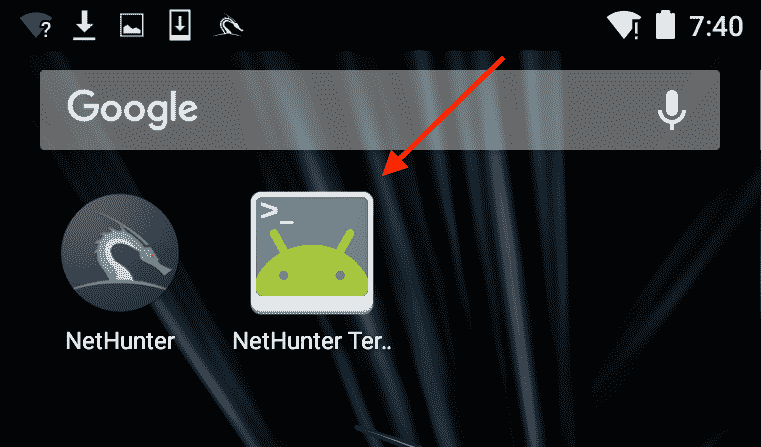
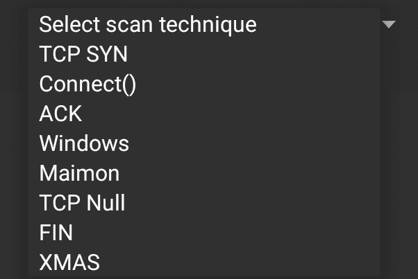
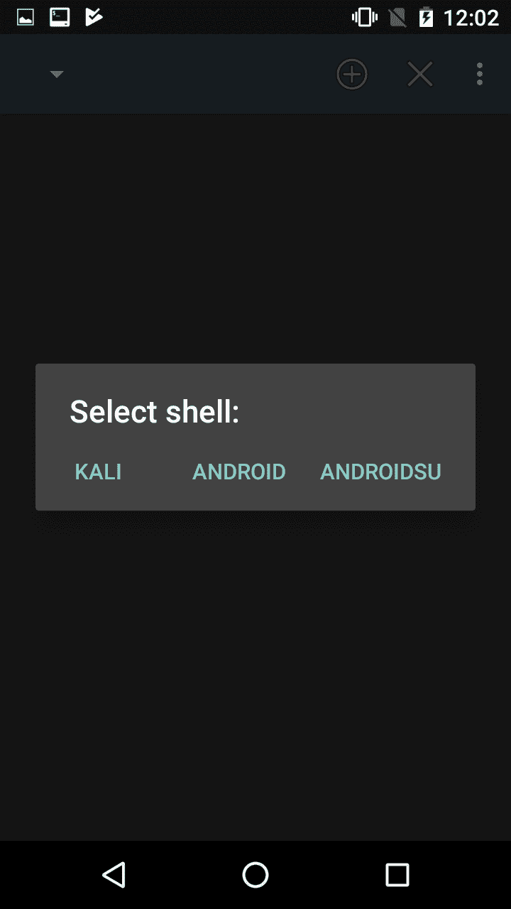
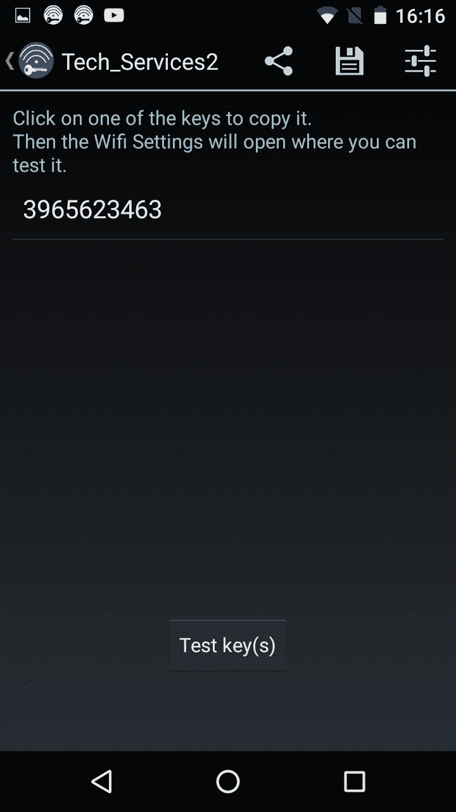
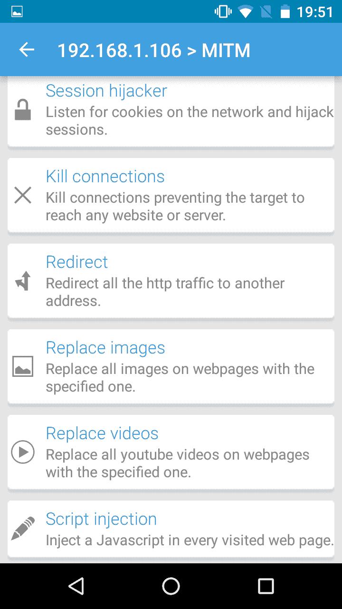
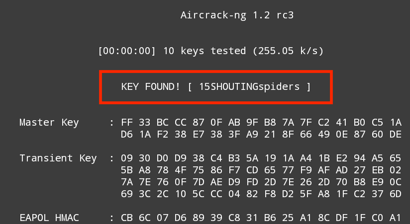
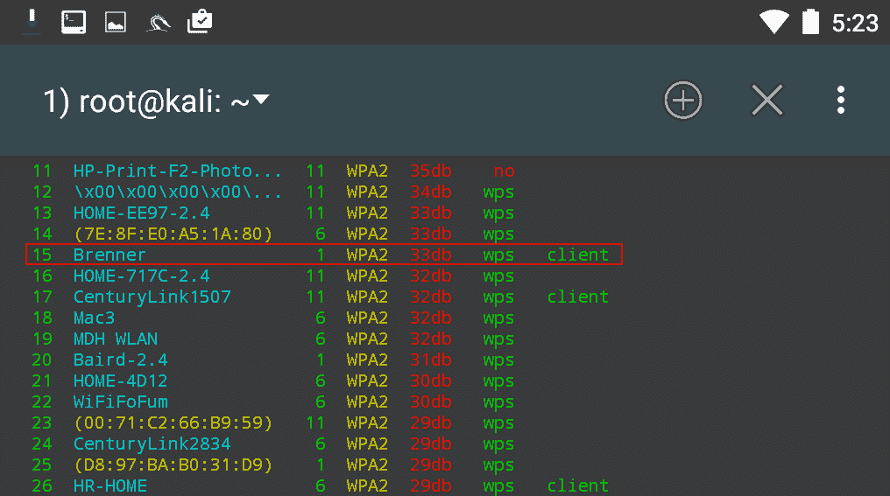
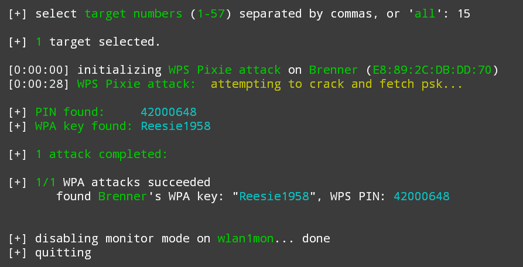
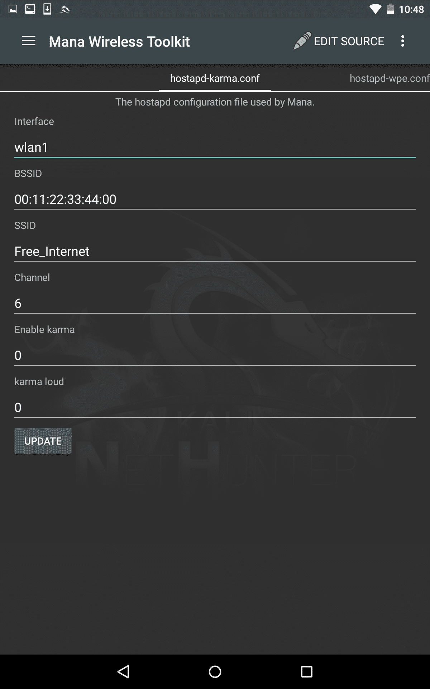
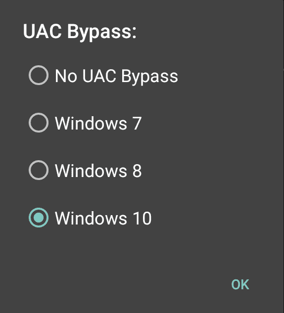

# 十二、将 Kali NetHunter 用于移动渗透测试

Kali NetHunter 专门设计用于在 Android 移动平台上运行，为渗透测试人员提供了更大程度的灵活性和移动性。

Kali NetHunter 拥有我们讨论过的许多工具，以及一些允许进行更多移动渗透测试的附加工具。在本章中，我们将讨论安装 Kali NetHunter 以及如何将关键工具付诸实施。最后，将讨论 NetHunter 平台相对于尝试使用更传统的 Kali Linux 方法具有显著优势的用例。

在本章中，我们将讨论以下内容：

*   Kali Linux NetHunter 概述
*   部署 NetHunter
*   安装 NetHunter 的概述
*   工具和技术
*   无线攻击
*   人机界面设备攻击

# 技术要求

在本章中，OnePlus One 和 Nexus 4 设备都用于运行 NetHunter。有关兼容设备的完整列表，请访问[https://github.com/offensive-security/kali-nethunter/wiki.](https://github.com/offensive-security/kali-nethunter/wiki.)

# 卡利网猎手

NetHunter 是第一款基于开源 Android 平台构建的移动渗透测试操作系统。这是进攻性安全部门和卡利社区成员宾基熊之间的合作发展。NetHunter 可以安装在以下 Google Nexus 设备上：Nexus 5、Nexus 6、Nexus 7、Nexus 9、Nexus 10 和 OnePlus 1。有关兼容设备的完整列表，请访问[https://github.com/offensive-security/kali-nethunter/wiki](https://github.com/offensive-security/kali-nethunter/wiki) 。攻击性安全提供了大量基于设备的 NetHunter 图像，在某些情况下，还包括生产年份。

# 部署

由于其规模，NetHunter 可以通过三种常规方式进行部署。其中每一个都利用 NetHunter 平台内的工具以及可以轻松获得的其他硬件。这些部署策略允许渗透测试人员测试各种环境中的各种安全措施。

# 网络部署

在前面的章节中，绝大多数都介绍了渗透测试仪用于测试远程或本地网络的工具和技术。这些工具需要通过物理连接访问这些网络。网络猎人也有同样的能力。利用 USB 安卓适配器和 USB 以太网适配器的组合，渗透测试仪可以直接连接到墙上的插孔，或者，如果能够访问网络硬件，可以直接连接到交换机。

这种部署策略对于那些想要在没有笔记本电脑的情况下偷偷进入某个区域的测试人员来说是很好的。通过使用 Nexus 智能手机甚至一个小型平板电脑，渗透测试仪可以连接到物理网络，破坏本地系统并在那里设置持久性，然后继续。当测试公共可用网络插孔周围的安全性时，这种方法也很有用。

# 无线部署

NetHunter 在一个便携包中包含了大量相同的工具。在某些渗透测试中，平板电脑或智能手机测试平台比笔记本电脑更容易在大型校园内移动，识别网络并捕获无线流量，以便日后破解。

要以这种方式部署 NetHunter，需要使用外部天线和 USB 到 Android 适配器。一旦连接，这些硬件工具就可以充分利用 NetHunter 的无线工具。

# 主机部署

NetHunter 平台相对于 Kali Linux 平台的一个优势是 Android 操作系统中的本机 USB 支持。这使渗透测试人员能够将 NetHunter 平台直接连接到笔记本电脑和台式机等主机。此功能允许渗透测试人员利用执行人机界面设备攻击的工具。在这些攻击中，渗透测试人员能够利用允许连接到主机设备的工具，模拟所谓的**人机界面设备**（**HIDs**）。HID 是通过 USB 连接到主机的键盘和鼠标等设备。

HID 攻击使用此功能强制主机系统执行命令或将有效负载脚本直接下载到系统。使此攻击更难阻止的是，如果事件中的数据丢失预防控制不允许 USB 存储设备连接，则允许使用 HID 设备。

# 安装 Kali NetHunter

一般来说，安装 NetHunter 的过程包括在设备上生根，将其恢复为出厂映像，然后将 Kali NetHunter 映像闪烁到设备上。你应该给自己一个小时来完成整个过程。这里介绍的是一个概述，这样您就有了一个收集必要工具和图像的良好起点。

以下是设备根目录、放置恢复映像以及最后安装 NetHunter 映像所需的一些资源：

*   在本地系统上安装 Android SDK 工具集。此信息可在[获取 https://developer.android.com/studio/index.html](https://developer.android.com/studio/index.html) 。
*   过程中将使用 TWRP 恢复图像；你可以在[找到它 https://twrp.me](https://twrp.me) 。 [](https://twrp.me) 

*   要从 Windows 中根目录设备，您需要特定的根目录工具包。Nexus 根目录信息可在[获取 http://www.wugfresh.com/nrt/](http://www.wugfresh.com/nrt/) 和 Oneplus 培根工具包可在[找到 http://www.wugfresh.com/brt/](http://www.wugfresh.com/brt/) 。有关使用 Windows 计算机安装 NetHunter 的指南，请访问 [https://github.com/offensive-security/kali-nethunter/wiki/Windows-install](https://github.com/offensive-security/kali-nethunter/wiki/Windows-install) 。
*   NetHunter 图像可在[上获得 https://www.offensive-security.com/kali-linux-nethunter-download/](https://www.offensive-security.com/kali-linux-nethunter-download/) 。

确保您按照正确的顺序仔细地遵循说明。在这个过程中没有匆忙。

# NetHunter 图标

在设备上安装 NetHunter 后，将有两个图标作为映像的一部分安装。您可以在应用菜单中找到这些。您将非常广泛地使用这些图标，因此我建议您将它们移动到顶级屏幕。第一个图标是 Kali NetHunter 菜单。此菜单包括渗透测试中常用的配置设置和工具。首先，单击 NetHunter 图标：


您将看到一个主屏幕，其中有一个工具列表，以及一些配置设置菜单。我们现在要检查的一个菜单是 Kali 服务菜单。此菜单允许您配置 NetHunter 上可用的不同服务，而无需使用命令行：


在该菜单中，您可以根据您的具体需求配置许多服务，使其在启动时启动或开关。我们在其他章节中介绍的两个特定服务包括 ApacheWeb 服务器和 Metasploit 服务。这两项都可以从该菜单启动：


除了菜单选项外，NetHunter 还有一个用于访问命令行的图标。要访问终端，请单击 NetHunter 终端：



这将打开命令提示符，它看起来像我们在前面章节中看到的标准界面：


右上角的三个垂直点将允许您访问允许您使用特殊键的选项、访问“帮助”菜单和设置首选项以及其他选项。此外，Kali NetHunter 还预装了黑客键盘。导航至平板电脑菜单中的应用页面。你会发现黑客键盘的图标。这个键盘更加用户友好，在使用命令行时非常有用。

# NetHunter 工具

因为它基于 Kali Linux 操作系统，所以我们在前面几章中探讨的许多工具都是 NetHunter 平台的一部分。因此，在贯入试验期间，可以使用相同的命令和技术。在下一节中，我们将介绍渗透测试中最常用的两个工具，并研究可作为单个 NetHunter 平台一部分的一些附加工具。

# Nmap

其中一个最常用的工具是 Nmap，我们已经详细介绍了它。虽然您可以在 NetHunter 的命令行上运行 Nmap，并具有与 Kali-Linux 相同的所有功能，但 NetHunter 的 Nmap 屏幕减少了输入这些命令所需的工作量。要访问 NMAP，请单击 NetHunter 图标，然后导航到 NMAP。这里我们有一个接口，允许我们输入单个 IP 地址、范围或 CIDR 符号。在这种情况下，我们将为路由器使用单个 IP 地址：


NetHunter 接口允许您设置 NMAP 扫描类型、操作系统检测、服务检测和对 IPv6 的支持。还可以设置特定的端口扫描选项。渗透测试人员可以将扫描设置为自己的规格，或选择 NMAP 应用选项来限制端口扫描：


通过单击选择定时模板，可以设置扫描定时。就像命令行版本的 NMAP 一样，扫描的时间可以根据情况进行调整。最后，还可以设置扫描类型。单击 Select scan Technicies（选择扫描技术）将显示可用扫描类型的选项。这包括 SYN 或 TCP 扫描等选项：



一旦扫描配置为运行，点击扫描按钮。NetHunter 将打开命令窗口并运行扫描：


NetHunter 附带的 GUI 非常适合运行这样的简单扫描。对于更详细的扫描或脚本的使用，您必须切换到命令行版本的 NMAP。

# 变质岩

我们在前几章中讨论过的众多强大的渗透测试工具之一是 Metasploit。Metasploit 框架包含在 NetHunter 中，其功能与 Kali Linux 完全相同。例如，让我们使用 NetHunter 平台尝试利用运行 Metasploitable 的目标系统中的后门漏洞。

首先，单击 NetHunter 终端图标，然后键入以下内容：

```
    # msfconsole
```

我们将利用 Metasploitable 中 IRC 守护进程中的后门漏洞。因此，我们将使用`unreal_ircd_3281_backdoor`漏洞。我们在命令行中输入以下内容：

```
    msf > use exploit/unix/irc/unreal_ircd_3281_backdoor
```

接下来，我们将远程主机设置为 Metasploitable 机器：

```
    msf >exploit(unreal_ircd_3281_backdoor) >set RHOST 192.168.0.182  
```

最后，我们运行这个漏洞。以下屏幕截图显示了上述命令的输出：


一旦攻击被触发，我们可以运行`whoami`命令并将其标识为根命令 shell。正如我们在本例中所看到的，NetHunter 在 Metasploit 框架方面具有与 Kali Linux 操作系统相同的功能。这允许渗透测试人员利用 NetHunter 平台在更小、更便携的平台上进行攻击。使用 Metasploit 框架的一个缺点是在平板电脑或手机上输入命令。

正如在 Kali Linux 中一样，NetHunter 还包括 Metasploit 的 Msfvenom 有效负载创建者。此 GUI 可用于生成用于 Metasploit 框架的自定义有效负载。要访问此工具，请单击 NetHunter 图标，然后导航到 Metasploit 负载生成器。您将进入以下菜单：


从这个菜单中，我们可以看到与 Kali Linux 版本 Msfvenom 相同的选项。此外，此 GUI 允许我们创建特定的有效负载，并将其保存到 SD 卡以供进一步使用。

NetHunter 中可以与 Metasploit 一起使用的另一个工具是 Searchsploit。此工具在[处查询漏洞数据库 https://www.exploit-db.com/](https://www.exploit-db.com/) 并允许用户搜索可与 Metasploit 中的漏洞一起使用的其他漏洞。

# MAC 转换器

在对目标无线网络执行攻击时，或者在您连接到物理网络的情况下，可能需要更改 NetHunter 平台的 MAC 地址。为了方便这一点，NetHunter 安装了 MAC 转换器。要访问 MAC Changer，请单击 NetHunter 图标，然后单击 MAC Changer。您将进入以下屏幕：


MAC Changer 允许您将主机名设置为您选择的主机名之一。将主机名设置为模仿目标组织的命名约定，允许您在网络上存在记录活动的系统时屏蔽活动。此外，MAC 转换器允许您设置 MAC 或允许工具为每个接口随机分配 MAC 地址。

# 第三方 Android 应用

在安装 NetHunter 的同时，通过浏览主菜单，您应该会注意到另外六个已安装的 Android 应用。

已安装的应用有**NetHunter 终端应用、DriveDroid、USB 键盘、Shodan、Router Keygen**和**CSLoit**。尽管这些第三方应用在 NetHunter 文档中被列为正在进行的工作，但我发现它们都可以工作。根据您的移动设备及其硬件，应用中的某些应用或功能可能无法工作。

# NetHunter 终端应用

与 Kali 和 NetHunter 中的终端非常相似，NetHunter 终端应用允许用户在各种类型的终端之间进行选择，包括 Kali 终端、Android 终端和 AndroidSU（根 Android）终端：



# 驾驶机器人

DriveDroid 允许您的 Android 设备模拟可引导闪存驱动器或 DVD。从 PC 引导时，设备本身可以用作可引导介质（如可引导闪存驱动器）。

DriveDroid 应用允许用户在创建可引导 Android 驱动器时从本地存储或下载的操作系统映像（`.iso`中进行选择。DriveDroid 也可以直接从位于[的 Google Play 商店下载 https://play.google.com/store/apps/details?id=com.softwarebakery.drivedroid &hl=en](https://play.google.com/store/apps/details?id=com.softwarebakery.drivedroid&hl=en)：


# USB 键盘

顾名思义，此功能允许使用 USB 键盘。使用此功能的能力可能取决于所使用的 Android 设备的型号。

# 肖丹

Shodan 工具，通常被称为黑客的搜索引擎，也为 NetHunter 用户提供了移动版本。使用 Shodan 应用还需要一个 API 密钥，如果您在[第 4 章](04.html)、*足迹和信息收集*中注册了一个帐户，那么您已经获得了该 API 密钥。访问[http://www.shodan.io](http://www.shodan.io) 并登录（或注册）在浏览器右上角查看您的 API 密钥。出现提示时，在移动设备上的 Shodan 应用中输入 API 密钥。

获取并输入代码后，您可以使用 Shodan 应用，使用方式与在浏览器中相同：


# 路由器生成机

Router Keygen 是支持 WEP 和 WPA 加密的路由器的密钥生成器。该应用首先扫描 Wi-Fi 网络，试图确定攻击是否受支持：


点击受支持的网络会生成可能用于连接路由器和网络的密钥：



路由器密钥也可以直接从位于[的谷歌 Play 商店下载 https://play.google.com/store/apps/details?id=io.github.routerkeygen &hl=en_US](https://play.google.com/store/apps/details?id=io.github.routerkeygen&hl=en_US)。

# 斯普洛伊特

CSLoit 应用允许轻松收集信息、会话劫持和**拒绝服务**（**DoS**）和**中间人**（**MitM**）攻击，只需点击一个按钮。启动时，cSploit 首先提示用户选择目标网络。然后向用户展示几个模块，如以下屏幕截图所示：



考虑到所有模块都可以从移动设备上运行，并且可以隐藏在渗透测试人员的身上，或者在电池持续时间内进行攻击时很容易隐藏，因此该工具相当令人印象深刻。

# 无线攻击

使用 NetHunter 平台的一个显著优势是其规模和谨慎的能力。如果您的任务是测试站点的无线安全性，同时尝试保持一定程度的隐蔽性，那么这是一个有用的优势。坐在目标位置的大厅里，打开笔记本电脑并连接外部天线可能会引起一些不必要的注意。相反，在 Nexus5 手机上部署 NetHunter 并在报纸或日程安排表后面隐藏一个独立的外部天线是保持低调的更好方式。NetHunter 平台在进行无线渗透测试方面的另一个关键优势是能够覆盖更广泛的领域，如校园环境，而无需在大型笔记本电脑上来回走动。

# 无线扫描

如前一章所述，识别无线目标网络是无线渗透测试的关键步骤。NetHunter 平台中包含的一些工具可以执行无线扫描和目标识别。还有一些第三方应用具有用户友好界面的额外好处，该界面通常可以收集关于可能的目标网络的相同或更详细的信息。

NetHunter 包括在[第 11 章](11.html)*、**无线渗透测试*中讨论过的 Aircrack ng 工具套件，并且从命令行以相同的方式工作。在这里，我们将打开一个命令 shell 并输入`airoddump-ng`以识别潜在的目标网络：


正如在 Kali Linux 操作系统中一样，我们能够确定正在广播的 BSSID、频道和 SSID。

# WPA/WPA2 开裂

如前所述，我们在[第 11 章](11.html)*【无线渗透测试*中检查的 Aircrack ng 工具套件包含在 NetHunter 中。这使我们能够在不修改命令或技术的情况下执行相同的攻击。此外，我们可以使用[第 11 章](https://cdp.packtpub.com/kali_linux_assuring_security_by_penetration_testing__fourth_edition/wp-admin/post.php?post=377&action=edit#post_343)*、无线渗透测试*中使用的相同天线以及外部适配器。以下破解是针对我们在[第 11 章](https://cdp.packtpub.com/kali_linux_assuring_security_by_penetration_testing__fourth_edition/wp-admin/post.php?post=377&action=edit#post_343)*、无线渗透测试*中讨论的具有相同 BSSID 的同一接入点进行的。所有这些都是通过 NetHunter 命令行完成的。

在下面的屏幕截图中，我们看到了`#airodump-ng -c 6 --bssid -w NetHunter`命令的输出：


Aircrack ng 能够抓取四向握手，就像 Kali Linux 版本一样。正如我们在[第 11 章](https://cdp.packtpub.com/kali_linux_assuring_security_by_penetration_testing__fourth_edition/wp-admin/post.php?post=377&action=edit#post_343)*【无线渗透测试*中所讨论的，我们可以进行这种四向握手，并使用预配置的列表反转密码。出于演示目的，预配置列表很短。

`#aircrack-ng -w wifipasscode.txt -b 44:94:FC:37:10:6E NetHunter-01.cap`命令产生以下输出：



就破解目标网络的密码而言，使用 NetHunter 键盘可能有点乏味，但这是可以做到的。此外，这种攻击在使用笔记本电脑和外部天线会引起过度注意的情况下非常有用。另一个有用的技术是使用 NetHunter 平台扫描和捕获握手，然后将捕获文件传输到您的 Kali Linux 平台并在那里运行破解程序。这将产生相同的结果，同时使渗透测试人员能够保持匿名。

# WPS 开裂

虽然在 NetHunter 键盘上键入命令可能会引起一些挫折，但 NetHunter 还使用了 Wifite 工具，我们在[第 11 章](https://cdp.packtpub.com/kali_linux_assuring_security_by_penetration_testing__fourth_edition/wp-admin/post.php?post=377&action=edit#post_343)*无线渗透测试*中介绍了该工具。这个工具让我们只需输入一个数字就可以进行攻击。打开一个 Kali 命令 shell，键入`wifite`命令，然后按 Enter 键。这将产生以下输出：


正如我们所看到的，NetHunter 的输出有一些细微的差别。有两个 WLAN 接口：内部无线接口和我们自己的外部天线。还有`P2P0`接口。这是 Android 操作系统的点对点无线接口。然后，我们通过输入数字`3`将 WLAN1 接口置于监控模式。

这将产生以下输出：



正如[第 11 章](https://cdp.packtpub.com/kali_linux_assuring_security_by_penetration_testing__fourth_edition/wp-admin/post.php?post=377&action=edit#post_343)*【无线渗透测试*中所述，我们看到的是我们之前测试过的相同网络。在我们停止扫描并输入数字`15`，然后*输入*之后，Wifite 运行与之前相同的攻击：



查看前面的屏幕截图，我们可以看到我们为无线网络 Brenner 提供了相同的 WPA 和 PIN。

# 邪恶 AP 攻击

**邪恶接入点**（**邪恶 AP**攻击是一种无线 MitM 攻击。在此攻击中，我们试图让一个或多个目标设备连接到我们设置的伪装为合法接入点的无线接入点。我们的目标，认为这是一个合法的网络，连接到它。进出客户端的流量在转发到下游合法接入点时被嗅探。来自合法接入点的任何流量也通过我们设置的 AP 路由，同样，我们能够嗅探该流量。

下图说明了这种攻击。左边是我们目标的笔记本电脑。中间是我们的 NetHunter 平台。右边是连接到互联网的合法接入点。当目标连接到我们的 NetHunter 平台时，我们能够在将流量转发到合法接入点之前嗅探流量。还将嗅探来自接入点的任何流量，然后将其转发到客户端：


这只是我们在过去讨论过的 MitM 攻击的一个变体。不同之处在于，我们不需要知道任何有关客户端或客户端所在网络的信息，因为我们将控制客户端使用的网络。这种攻击通常发生在使用免费无线互联网的公共区域，如机场、咖啡馆和酒店。

# 法力邪恶 AP

我们将在 NetHunter 平台中使用的工具是**Mana Wireless Toolkit**。从 NetHunter 图标导航到 Mana Wireless Toolkit。您进入的第一页是`hostapd-karma.conf`屏幕。

这允许我们配置邪恶 AP 无线接入点：



首先要考虑的是，您需要确保有两个无线接口可用。Android 无线接口（最有可能是 WLAN0）需要连接到具有互联网连接的接入点。这可以由您控制，也可以是我们所在地的免费无线互联网。WLAN1 接口将是我们的外部天线，它将提供假接入点。接下来，您可以将 BSSID 配置为模拟实际接入点的 MAC。此外，我们还可以将 SSID 配置为广播任何接入点标识。其他设置包括使用业力利用进行攻击。这是邪恶 AP 的变种。（更多信息请参见[https://insights.sei.cmu.edu/cert/2015/08/instant-karma-might-still-get-you.html.](https://insights.sei.cmu.edu/cert/2015/08/instant-karma-might-still-get-you.html.) ）我们可以保留默认设置。在这个场景中，我们将保留默认设置，并导航到三个垂直点并点击开始法力。

这将启动假接入点：


在上一个屏幕截图中，我们可以看到法力邪恶 AP 刷新缓存信息并设置新的访问点。如果我们切换到一个设备，我们可以看到无线接入点，免费互联网。此外，我们能够在不进行任何身份验证的情况下进行连接：


现在，在 NetHunter 平台上的另一个终端中，我们通过使用以下命令配置`tcpdump`捕获来配置数据包捕获：

```
    # tcpdump -I wlan1
```

这将产生以下结果：


当连接的设备接收和发送帧时，我们能够嗅探该流量。另一个可用的选项是以`.pcap`文件的形式捕获流量，然后将其卸载到 Wireshark 中查看。

这是在目标组织的公共区域进行的有用攻击。此攻击的另一个关键方面是多个目标设备可以连接。但是，需要注意的是，如果多个设备确实连接，则通信量可能会明显慢于目标。可以使用的另一种技术利用了此工具和许多移动设备中发现的漏洞。许多移动设备自动配置为连接到以前连接到网络的任何设备。这种自动连接不会查看无线接入点的 MAC 地址，而是查看正在广播的 SSID。在这个场景中，我们可以称我们的法力邪恶 AP 为在不同地点发现的普通 SSID。当人们经过时，他们的移动设备将自动连接，只要他们在范围内，他们就会通过我们的设备路由流量。

# 隐藏攻击

NetHunter 有几个内置工具，允许您配置 HID 攻击。在其中一个工具中，NetHunter 利用标准命令行连续执行多个命令。要访问 HID 攻击菜单，请单击 NetHunter，然后单击 HID 攻击。在 HID 攻击屏幕上，我们将看到两个选项。一种是 PowerSploit 攻击，另一种是 Windows CMD 攻击。在本节中，我们将详细介绍 Windows CMD 攻击。

在这个场景中，我们将使用 NetHunter 平台并将其连接到目标机器。我们的攻击将利用 HID 漏洞运行`ipconfig`命令，并使用`net user offsec NetHunter! / add`命令向系统添加用户`offsec`。

最后，我们将使用命令`net localgroup administrators offsec /add`将该用户帐户添加到本地管理员组：


接下来需要设置**用户账号控制**（**UAC**旁路。这允许 NetHunter 以管理员身份运行命令行。单击 UAC 旁路，将其配置为适当的 Windows 操作系统：


在这种情况下，我们试图对 Windows 10 操作系统进行 HID 攻击，因此我们将 UAC 旁路设置为 Windows 10：



配置 UAC 旁路后，将 USB 电缆插入目标机器。单击三个垂直点，然后单击执行攻击。

当攻击开始执行时，您将看到目标计算机以管理员身份打开命令提示符。然后，它将执行 NetHunter 中设置的命令。这里我们看到第一个命令`ipconfig`已经运行：


接下来，我们看到`offsec`用户已经输入了相关的密码。用户帐户现在已输入目标计算机上的本地管理员组：


如果您实际位于某个位置并观察打开的工作站，则此攻击非常有用。您可以配置许多不同的命令，然后只需将 NetHunter 平台连接到系统并执行即可。这可能包括使用 PowerShell 或其他脚本攻击的更复杂的攻击。

# 猎鸭者隐藏攻击

DuckHunter HID 攻击将 USB 橡皮 Ducky 脚本转换为 NetHunter HID 攻击，如前所述。USB Rubber Ducky 脚本可以从 Hak5 自己的 Darren Kitchen 的 GitHub 页面[下载 https://github.com/hak5darren](https://github.com/hak5darren) 并加载到转换选项卡中的 NetHunter HID 工具中。

有效载荷包括（但不限于）以下各项：

*   WiFi 密钥抓取器
*   具有持久性的反向 Shell
*   从活动文件系统检索 SAM 和 SYSYTEM
*   Netcat 反向外壳
*   OSX 本地 DNS 中毒
*   批雨刮器/驱动擦除器
*   Wifi 后门

# 总结

Kali NetHunter 平台具有与其规模相关的大量功能。渗透测试仪最明显的优点是，工具和技术在 Kali Linux 和 NetHunter 中基本相同，但有一些变化。这减少了学习一套新工具所需的时间，同时使渗透测试人员能够从手机或平板电脑上运行渗透测试。这使测试人员能够更接近目标组织，同时允许对他们的一些行为进行模糊处理。添加 HID 等攻击进一步允许渗透测试人员执行没有其他工具无法完成的攻击。NetHunter 是一个极好的平台，可以包含在渗透测试工具包中。

在下一章中，我们将继续讨论**支付卡行业数据安全标准**（**PCI DSS**，并讨论用于执行 PCI DSS 扫描的范围、调度、分段和各种工具。

# 问题

*   哪些版本的 OnePlus 和 Nexus 手机支持 Kali NetHunter？
*   NetHunter 是否需要移动设备上的 root 访问权限？
*   NetHunter 中包含哪些第三方 Android 应用？
*   路由器 Keygen 支持哪些类型的无线加密？
*   CSLoit 应用的一些功能是什么？
*   MitM 无线攻击工具的名称是什么？
*   猎鸭者隐藏攻击做什么？

# 进一步阅读

*   NetHunter 文档：[https://github.com/offensive-security/kali-nethunter/wiki](https://github.com/offensive-security/kali-nethunter/wiki)
*   在 Android 设备上安装 NetHunter:[https://www.androidauthority.com/how-to-install-kali-nethunter-android-896887/](https://www.androidauthority.com/how-to-install-kali-nethunter-android-896887/)
*   使用 NetHunter 进行 DNS 欺骗：[https://cyberarms.wordpress.com/category/nethunter-tutorial/](https://cyberarms.wordpress.com/category/nethunter-tutorial/)