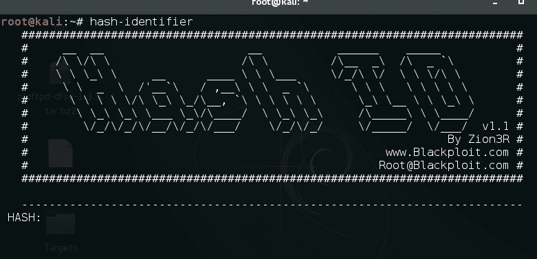
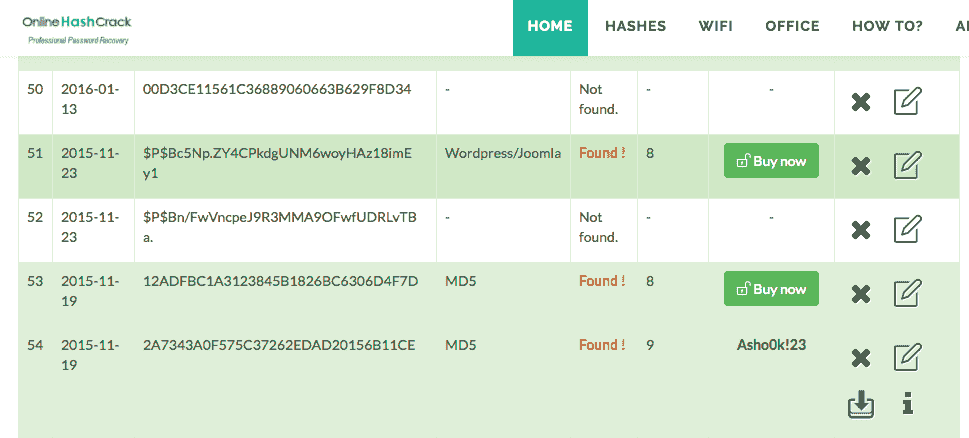
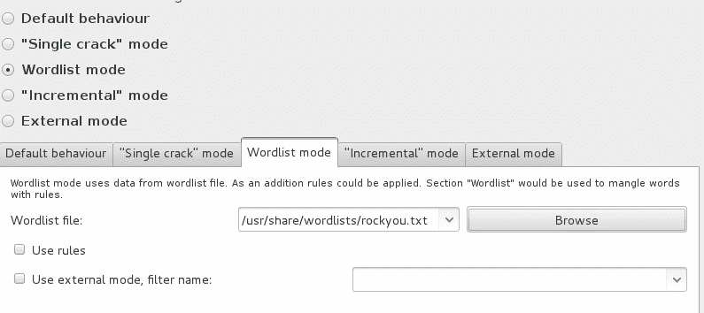
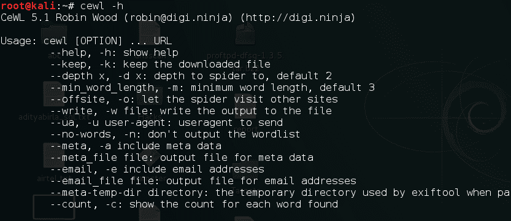

# 七、密码攻击——他们星运中的错误

在本章中，我们将介绍以下配方：

*   在野外识别不同类型的散列！
*   使用散列标识符
*   用 patator 开裂
*   在线破解散列
*   和开膛手约翰一起玩
*   约翰尼好极了！
*   使用 cewl
*   用 crunch 生成单词表

# 介绍

弱密码是一种众所周知的情况，在这种情况下，大多数公司都会受到威胁。很多人使用弱密码，可以强制使用，也可以获取明文。在本章中，我们将讨论破解在 webapp/网络上执行 pentest 活动期间获得的密码哈希的不同方法。

# 在野外识别不同类型的散列！

散列是由单向数学算法生成的，这意味着它们不能反转。打破僵局的唯一办法就是用暴力来对付他们。在本食谱中，您将学习如何识别一些不同类型的哈希。

# 怎么做。。。

以下是散列的类型。

# MD5

这是最常见的哈希类型。MD 代表**消息摘要**算法。可以使用以下观察结果来识别这些散列：

*   它们是十六进制的
*   长度为 32 个字符，128 位，例如，`21232f297a57a5a743894a0e4a801fc3`

# MySQL 小于 v4.1

在从 SQL 注入中提取数据时，我们可能会遇到这种散列。可以使用以下观察结果来识别这些散列：

*   它们也是十六进制的
*   长度为 16 个字符和 64 位，例如，`606727496645bcba`

# MD5（WordPress）

这在通过 WordPress 制作的网站上使用。可以使用以下观察结果来识别这些散列：

*   它们以`$P$`开头
*   它们包含字母数字字符
*   长度为 34 个字符，64 位，例如，`$P$9QGUsR07ob2qNMbmSCRh3Moi6ehJZR`

# MySQL 5

这在较新版本的 MySQL 中用于存储凭据。可以使用以下观察结果来识别这些散列：

*   它们都是帽子
*   它们总是以*星号*开头
*   长度为 41 个字符，例如，`*4ACFE3202A5FF5CF467898FC58AAB1D615029441`

# Base64 编码

Base64 很容易识别。转换是通过将八个八位字节编码为四个字符来完成的。检查 Base64 的最简单方法如下：

*   验证长度是否为 4 个字符的倍数
*   验证集合 A-Z、A-Z、0-9、+、/中的每个字符是否都存在，但末尾的填充除外，即 0、1 或 2，=字符，例如，`YW55IGNhcm5hbCBwbGVhc3VyZS4=`

# 还有更多。。。

下面是一篇文章，了解有关不同类型散列的更多信息：

[http://www.101hacker.com/2010/12/hashes-and-seeds-know-basics.html](http://www.101hacker.com/2010/12/hashes-and-seeds-know-basics.html)

# 使用散列标识符

在前面的配方中，您学习了如何识别一些常见的哈希类型。但也有其他哈希，在这个配方中，您将学习如何识别我们在 pentesting 项目中找到的其他哈希。

# 怎么做。。。

以下步骤演示了哈希标识符的使用：

1.  Kali 预装了一个名为 hash identifier 的工具。要启动该工具，请使用以下命令：

```
 hash-identifier
```

以下屏幕截图显示了前面命令的输出：



2.  现在我们需要做的就是粘贴我们在这里找到的哈希，它将显示类型：


# 用 patator 开裂

有时，我们可能有用户名，但我们想尝试暴力强制密码。Patator 是一个令人惊讶的工具，它允许我们强制执行多种类型的登录，甚至压缩密码。在本食谱中，我们将看到如何使用 patator 执行暴力攻击。

# 怎么做。。。

以下是使用 patator 的步骤：

1.  要查看所有选项，请使用以下命令：

```
 patator -h
```

以下屏幕截图显示了前面命令的输出：


2.  让我们尝试强制 FTP 登录：

```
 patator ftp_login
```

以下屏幕截图显示了前面命令的输出：


3.  我们现在可以设置`host`、`user`文件和`password`文件并运行模块：

```
 patator ftp_login host=192.168.36.16 user=ftp password=ftp
```

以下屏幕截图显示了前面命令的输出：


4.  我们可以看到访问权限已被授予，模块已停止。

# 在线破解散列

通常，当我们在 pentesting 时遇到散列时，最好在线检查散列：它是否已经被破解。在本食谱中，您将了解一些提供哈希破解服务的酷网站。

# 怎么做。。。

让我们来看看识别不同类型的散列。

# 哈希杀手

以下步骤演示 Hashkiller 的使用：

1.  Hashkiller 是一个很好的服务，我们可以在这里提交我们的哈希，如果它在过去已经被破解，它将向我们显示明文：


2.  过程简单；我们只需在网站上选择显示 Decrypter/Cracker 的选项，然后单击要破解的哈希类型：


3.  在打开的页面上，我们粘贴哈希，填写验证码，然后单击提交：


4.  如果散列存在，它将向我们显示纯文本；否则，我们将看到一条消息，说找不到任何哈希！：


# 疯子站

Crackstation 是一项免费服务，支持 MD2、MD5、NTLM 和 SHA1 破解。它使用自己的单词列表和查找表有效地从数据库中执行哈希的明文搜索：

1.  我们访问网站[https://crackstation.net/](https://crackstation.net/) ：


2.  我们粘贴要破解的哈希并填写验证码：


3.  如果找到散列，我们将看到明文；否则，我们会看到一条消息，表明未找到哈希：


4.  Crackstation 还提供其密码列表和查找表的下载链接，如果我们想使用 hashcat 等工具对密码进行离线破解，[https://crackstation.net/buy-crackstation-wordlist-password-cracking-dictionary.htm](https://crackstation.net/buy-crackstation-wordlist-password-cracking-dictionary.htm) ：


# 在线裂纹

这是一项免费服务，也是我最喜欢的服务之一。它支持 OSX、MD4、MD5、NTLM、WPA（2）以及强制执行 Word、Excel、PPT 保护的文档。它提供最多 8 个字符的免费密码，之后它会收取少量费用以显示已成功破解的密码：

1.  我们访问网站[http://onlinehashcrack.com/](http://onlinehashcrack.com/) ：


2.  在这里，我们可以提交我们的散列或用于破解的`.apt`文件以及我们希望接收通知的电子邮件地址：


3.  在我们收到的电子邮件中的唯一链接上，我们可以看到所有已破解或未在网站上找到的哈希的状态：



# 和开膛手约翰一起玩

网站和在线服务可能并不总是可用的，而且这些网站也可能没有我们找到的哈希的明文。在这种情况下，我们可以使用不同的离线工具来破解散列。

假设我们现在有了散列，并且已经确定了它的类型。在这个食谱中，我们将看到如何用开膛手约翰破解哈希。John 速度快，支持各种破解模式。它还能够自动检测哈希类型。

# 怎么做。。。

要了解开膛手约翰，请按照给定步骤进行操作：

1.  我们可以使用 help（`-h`命令）查看完整功能：

```
 john -h
```

以下屏幕截图显示了前面命令的输出：


2.  要破解密码，我们使用以下命令：

```
 john --format=raw-md5
        --wordlist=/usr/share/wordlists/rockyou.txt /root/demo_hash.txt
```

3.  我们将看到密码已成功破解！


# 还有更多。。。

有关更多信息，请参阅以下文章：

*   [http://pentestmonkey.net/cheat-sheet/john-the-ripper-hash-formats](http://pentestmonkey.net/cheat-sheet/john-the-ripper-hash-formats)

# 约翰尼好极了！

Johnny 是 John 的 GUI 客户端。因为它添加了一个用户界面，所以它变得更易于使用。

# 怎么做。。。

要了解 Johnny，请按照给定的步骤进行操作：

1.  你已经学会了在我们以前的食谱中使用约翰。我们将使用以下命令启动 Johnny：

```
 johnny
```

以下屏幕截图显示了前面命令的输出：


2.  我们通过点击打开密码文件选项来加载密码文件。我们的文件已加载：


3.  现在，我们转到选项并选择要执行的攻击类型：



4.  我们选择散列的格式：


5.  一旦完成，我们点击开始攻击，我们应该看到我们的密码时，它被破解。

# 使用 cewl

`cewl`是一个基于 ruby 的爬虫程序，它可以抓取 URL 并搜索可用于密码攻击的单词。在本食谱中，我们将了解如何利用它为我们带来好处。

# 怎么做。。。

以下是使用`cewl`的步骤：

1.  要查看`cewl`的所有选项，我们使用以下命令：

```
 cewl -h
```

以下屏幕截图显示了前面命令的输出：



2.  要对网站进行爬网，请使用以下命令：

```
 cewl -d 2 http://192.168.36.16/forum/
```

以下屏幕截图显示了前面命令的输出：


3.  我们将看到一个有趣的关键字列表，可用于将我们自己的字典设置为密码列表：


# 用 crunch 生成单词表

Crunch 是一个单词列表生成器。它使用排列和组合来生成所提供字符集的所有可能组合。

# 怎么做。。。

要了解 Crunch，请遵循给定的步骤：

1.  Crunch 与 Kali 一起预装，我们可以使用以下命令启动它：

```
 crunch -h
```


2.  如我们所见，生成一个最少两个字符、最多两个字符的密码列表很容易，只包含`abcdef`，我们可以使用以下命令：

```
 crunch 2 2 abcdef
```

我们可以看到已生成单词列表：


3.  要将其保存到文件中，我们可以使用`-o`开关。Crunch 还有一个包含预定义字符集的内置列表。可在`/usr/share/crunch/charset.lst`找到。

4.  要使用字符集，我们使用`-f`开关：

```
 crunch 2 2 -f /usr/share/crunch/charset.lst lalpha
```

以下屏幕截图显示了前面命令的输出：


5.  这将生成一个最小长度和最大长度为`2`的列表，其中包含小写字母。Crunch 还有一个`-t`开关，可用于创建特定模式的单词列表：
    *   `@`：这将插入小写字符
    *   `,`：这将插入大写字符
    *   `%`：这将插入数字
    *   `^`：这将插入符号
6.  开关`-b`可用于指定要创建的文件的大小：


7.  让我们尝试创建一个具有特定模式且大小为 1 MB 的列表：

```
 crunch 10 10 -t @@packt,,% -b 1mib -o START
```

8.  完成后，我们将在同一文件夹中看到使用该模式创建的文本文件列表：


9.  `-z`标志可用于创建单词列表并将其保存在压缩文件中。压缩是在移动中完成的：

```
 crunch 10 10 -t @@packt,,% -b 1mib -o START -z gzip
```

以下屏幕截图显示了前面命令的输出：

