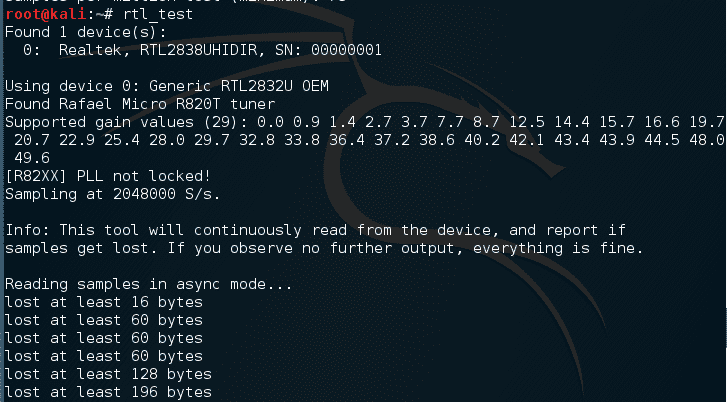
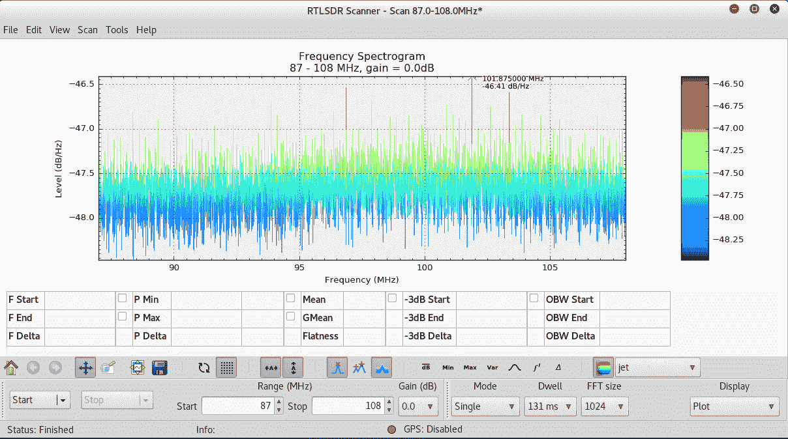
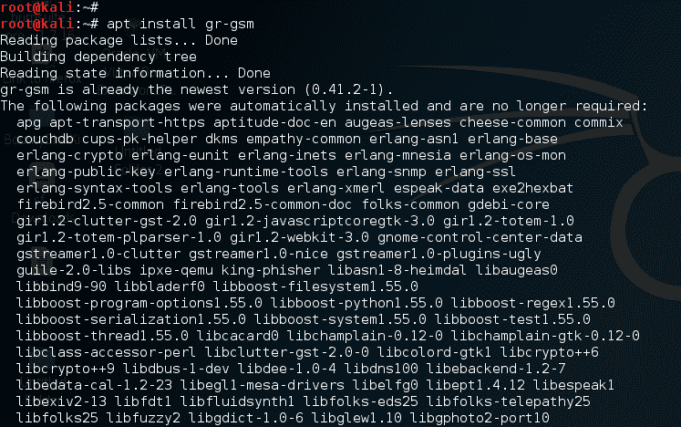

# 十、使用软件定义的无线电

在本章中，我们将介绍以下配方：

*   射频扫描仪简介
*   使用 RTLSDR 扫描仪进行实际操作
*   玩弄`gqrx`
*   GSM 分接振动装置
*   使用 Dump1090 解码 ADS-B 消息

# 介绍

术语软件无线电是指使用软件实现基于硬件的无线电组件，例如调制器、解调器和调谐器。在本章中，我们将介绍不同的方法，并探讨如何使用 RTLSDR 处理频率和通过它传输的数据的多种方法。

# 射频扫描仪

RTLSDR 是一种非常便宜（约 20 美元）的软件定义无线电，使用 DVB-T 电视调谐器加密狗。在本教程中，我们将介绍如何使用 Kali Linux 连接 RTLSDR 设备，以测试是否成功检测到它。

# 准备

我们需要一些硬件来制作这个食谱。可从亚马逊或[轻松购买 https://www.rtl-sdr.com/buy-rtl-sdr-dvb-t-dongles/](https://www.rtl-sdr.com/buy-rtl-sdr-dvb-t-dongles/) 。卡利已经为我们准备好了工具。

# 怎么做。。。

我们连接了我们的设备，它应该在 Kali Linux 中被检测到。这是常见的设备行为不准确。以下是运行测试的方法：

1.  我们将首先使用以下命令运行测试：

```
        rtl_test
```

以下屏幕截图显示了前面命令的输出：



2.  我们可能会看到一些数据包丢失。这是因为在只有 USB 2.0 的虚拟机设置中尝试了这一点。

3.  如果丢包较多，我们可以通过`rtl_test -s 10000000`设置较低的采样率进行测试：


4.  现在，我们都准备好进入下一个配方，并使用我们的设备。

# 使用 RTLSDR 扫描仪进行实际操作

RTLSDR 扫描仪是一种跨平台 GUI，可用于频谱分析。它将扫描给定的频率范围，并在频谱图中显示输出。

# 怎么做。。。

以下是运行`rtlsdr-scanner`的配方：

1.  我们将 RTLSDR 连接到系统，并使用以下命令启动扫描仪：

```
       rtlsdr-scanner
```

以下屏幕截图显示了前面命令的输出：


2.  我们应该看到一个新窗口打开，显示该工具的 GUI 界面；在这里，我们只需输入要执行扫描的频率范围，然后单击开始扫描：


3.  查看频率扫描需要一些时间，然后我们将以图形格式查看结果：



如果应用停止响应，建议您降低范围并选择 Single 作为模式，而不是 continuous。

# 玩 gqrx

`gqrx`工具是一个开源**软件定义无线电**（**SDR**）接收器，由 GNU 无线电和 Qt 图形工具包供电。

它有许多功能，例如：

*   发现连接到计算机的设备
*   处理 I/Q 数据
*   AM、SSB、CW、FM-N 和 FM-W（单声道和立体声）解调器
*   在 WAV 文件中录制和播放音频
*   记录和回放原始基带数据
*   UDP 上的流式音频输出

在本食谱中，我们将介绍`gqrx`和另一个工具 RTLSDR 的基础知识。

# 怎么做。。。

以下是使用`gqrx`的配方：

1.  我们可以使用以下命令安装`gqrx`：

```
        apt install gqrx  
```

2.  完成后，我们通过键入`gqrx`来运行该工具。
3.  我们从打开的窗口中的下拉菜单中选择设备，然后单击“确定”：


4.  现在 GQRX 应用打开，在 receiver 窗口的右侧，我们选择要查看的频率。然后我们转到文件并单击开始 DSP：


5.  现在我们看到一个瀑布，我们应该开始听到扬声器中的声音。我们甚至可以使用 Receiver Options（接收器选项）窗口中的 up（向上）和 down（向下）按钮更改正在收听的频率：


6.  我们将看一个汽车钥匙遥控器的例子，它用于锁定/解锁汽车。
7.  按下按钮几次后，我们将看到瀑布中的变化，显示信号的差异：


8.  我们可以在记录窗口中记录信号，然后保存它。这可以在以后解码，并使用收发器将其发送回汽车解锁。

9.  要捕获`443`MHz 的数据，我们可以使用以下命令：

```
        rtl_sdr -f 443M - | xxd
```

以下屏幕截图显示了前面命令的输出：


# 还有更多。。。

欲了解更多关于`gqrx`的信息，请访问以下博客：

*   [http://gqrx.dk/doc/practical-tricks-and-tips](http://gqrx.dk/doc/practical-tricks-and-tips)
*   [https://blog.compass-security.com/2016/09/software-defied-radio-sdr-and-decoding-on-off-keying-ook/](https://blog.compass-security.com/2016/09/software-defied-radio-sdr-and-decoding-on-off-keying-ook/)

# GSM 分接振动装置

RTLSDR 还允许我们使用名为`kal`或`kalibrate-rtl`的工具查看 GSM 流量。此工具可以在一个频带内扫描 GSM 基站。在本食谱中，我们将学习使用 kalibrate，然后确认`gqrx`中的通道。

# 怎么做。。。

以下是使用 kalibrate 的步骤：

1.  大多数国家使用 GSM900 频段。在美国是 850。我们将使用以下命令扫描 GSM 基站：

```
        kal -s GSM900 -g 40  
```

以下屏幕截图显示了前面命令的输出：


2.  几分钟后，它将向我们显示基站列表：


3.  我们注意到频率；在本例中，我们将使用`947.6 MHz`和偏移量。

4.  现在，我们打开 GQRX 并在 Receiver Options（接收器选项）窗口中输入它：


5.  我们可以从瀑布中看到，该设备能够完美地捕捉信号。

6.  现在我们将在数据包级别查看这些数据。我们将使用名为`gr-gsm`的工具。
7.  可使用 apt 安装`gr-gsm`进行安装：



8.  完成后，如果我们键入`grgsm_`并按下*Tab*键，我们将看到可供我们使用的不同工具的列表：


9.  首先，我们将使用`grgsm_livemon`实时监控 GSM 数据包。我们将打开终端并键入`grgsm_livemon`：


10.  在打开的新窗口中，我们将使用 kalibrate 切换到前面步骤中捕获的频率：


11.  我们可以通过在图形窗口上拖动和选择区域来放大特定范围。
12.  在新的终端窗口中，我们通过键入`wireshark`来启动 Wireshark。

13.  然后，我们将适配器设置为 Loopback:lo 并开始数据包捕获：


14.  接下来，我们添加过滤器`gsmtap`：


15.  我们应该在信息窗口中看到数据包。我们应该看到标签系统信息类型为 3 的数据包；让我们打开它：


16.  我们将看到系统信息，如移动国家代码、网络代码和位置区号：


17.  现在，通过这个配方，我们了解了 GSM 数据包是如何传输的。

# 还有更多。。。

以下是一些很棒的视频，让您更好地了解 GSM 嗅探：

*   [https://www.crazydanishhacker.com/category/gsm-sniffing-hacking/](https://www.crazydanishhacker.com/category/gsm-sniffing-hacking/)

# 使用 Dump1090 解码 ADS-B 消息

**ADS-B 代表**自动相关监视广播**。这是一个系统，飞机上的电子设备通过数字数据链路自动广播飞机的精确位置。**

 **如该工具的官方自述文件所述，Dump1090 是专为 RTLSDR 设备设计的 S 模式解码器。

其主要特点是：

*   弱消息的鲁棒解码。与其他流行的解码器相比，使用 mode1090，许多用户观察到范围有所改进。
*   网络支持-TCP30003 流（MSG5），原始数据包，HTTP。
*   嵌入式 HTTP 服务器，在谷歌地图上显示当前检测到的飞机。
*   使用 24 位 CRC 进行单位错误校正。
*   能够解码 DF11 和 DF17 消息。
*   能够解码 DF 格式，如 DF0、DF4、DF5、DF16、DF20 和 DF21，其中校验和通过使用 ICAO 地址强制校验和字段与 ICAO 地址异或，我们已经介绍过。
*   从文件中解码原始 IQ 样本（使用`--ifile`命令行开关）。
*   交互式 CLI 模式，其中当前检测到的飞机显示为列表，随着更多数据的到达而刷新。
*   CPR 坐标解码和速度轨迹计算。
*   TCP 服务器向连接的客户端发送数据流，并从连接的客户端接收原始数据（使用`--net`。

在本食谱中，我们将使用该工具以视觉方式查看空中交通。

# 怎么做。。。

以下是使用 Dump1090 的步骤：

1.  我们可以使用命令`git clone https://github.com/antirez/dump1090.git`从 Git repo 下载该工具：


2.  下载后，我们进入文件夹并运行`make`。
3.  我们现在应该有一个可执行文件。我们可以使用以下命令运行该工具：

```
        ./dump1090 --interactive -net
```

以下屏幕截图显示了前面命令的输出：


4.  再过几分钟，我们就可以看到航班了，打开`http://localhost:8080`浏览器，我们也可以看到地图上的航班。

# 还有更多。。。

更多信息可从[了解 https://www.rtl-sdr.com/adsb-aircraft-radar-with-rtl-sdr/](https://www.rtl-sdr.com/adsb-aircraft-radar-with-rtl-sdr/) 。**