# 一、开始——建立环境

在本章中，我们将介绍与首次使用 Kali Linux 相关的基本任务。食谱包括：

*   在云上安装 Kali Linux-Amazon AWS
*   在 Docker 上安装 Kali Linux
*   在 OnePlus 上安装 NetHunter
*   在虚拟机上安装 Kali Linux
*   定制 Kali Linux 以实现更快的软件包更新
*   定制 Kali Linux 以实现更快的操作
*   配置远程连接服务-HTTP、TFTP 和 SSH
*   配置 Nessus 和 Metasploit
*   配置第三方工具
*   在 Kali Linux 上安装 Docker

# 导言

Kali Linux 是对最流行的 Linux 渗透测试发行版 Backtrack 的彻底改进。Kali Linux 2.0 于 2015 年 8 月 11 日发布，是 Kali Linux 的改进版，具有全新的内核 4.0，基于 Debian 的 Jessie 版本，具有改进的硬件和无线驱动程序覆盖范围，支持多种桌面环境（GNOME、KDE、XFCE、MATE、e17、LXDE 和 i3wm）和工具，列表还有很多。

如果您正在从 Kali Linux 升级到 Kali Linux 2.0，那么有一个好消息。好消息是，现在我们有了一个滚动发行。例如，Kali Linux 内核不断更新。

Kali Linux 提供了渗透测试和安全评估所需的一切，而无需考虑为您的武库中的每个工具下载、安装和设置环境。Kali Linux 2.0 包括 300 多个安全工具。现在，您可以在一个地方安装、配置并随时使用世界各地的专业人员最喜欢的安全工具。

所有安全工具都经过逻辑分类并映射到测试人员，测试人员在评估目标时执行一系列步骤，例如侦察、扫描、利用、权限提升、维护访问和覆盖跟踪。

安全工具通常很昂贵，但 Kali Linux 是免费的。使用 Kali 的最大优点是它包含各种商业安全产品的开源或社区版本。

Kali Linux 2.0 现在支持比以往更多的硬件设备。由于基于 ARM 的系统变得越来越便宜和容易获得，在这些设备上运行 Kali Linux 现在可以使用 ARMEL 和 ARMHF 支持。目前，Kali Linux 可用于以下 ARM 设备：

*   树莓皮（树莓皮 2、树莓皮 A/B+和树莓皮 A/B+TFT）
*   CompuLab-利用和修剪切片
*   小猎犬骨黑
*   ODROID U2/X2
*   Chromebook-惠普、宏碁和三星
*   立体板 2
*   CuBox（CuBox 和 CuBox-i）
*   Nexus 5（Kali Nethunter）
*   Odroid（U2、XU 和 XU3）
*   乌斯巴莫里
*   暴动板
*   友好的
*   巴纳皮

# 在云上安装 Kali Linux-亚马逊 AWS

大约两年前，Kali Linux 已经在 Amazon EC2 市场上市。这对渗透测试人员来说是一个非常好的消息，因为他们可以在**亚马逊 AWS 基础设施**中设置自己的 Kali Linux 并用于渗透测试，而且它甚至有资格获得免费的 Tier，你可以使用它来设置你的 EC2 实例，只要你保持在指定的限制内，这很公平。

本配方中提供的步骤将帮助您在几分钟内安全地在 Amazon AWS EC2 控制台上设置运行 Kali Linux 的实例。

## 准备好了吗

对于此配方，您需要：

*   亚马逊 AWS 账户
*   如果要运行 Metasploit，则最小 2 GB RAM

## 怎么做。。。

为此配方执行以下步骤：

1.  Once you have the Amazon AWS account created, login to [https://aws.amazon.com](https://aws.amazon.com) and navigate to **Amazon Web Services** dashboard as shown in the following screenshot. Go to **EC2** | **Launch Instance**:

    

2.  You will need to select **Amazon Machine Image (AMI)** as shown in the following screenshot:

    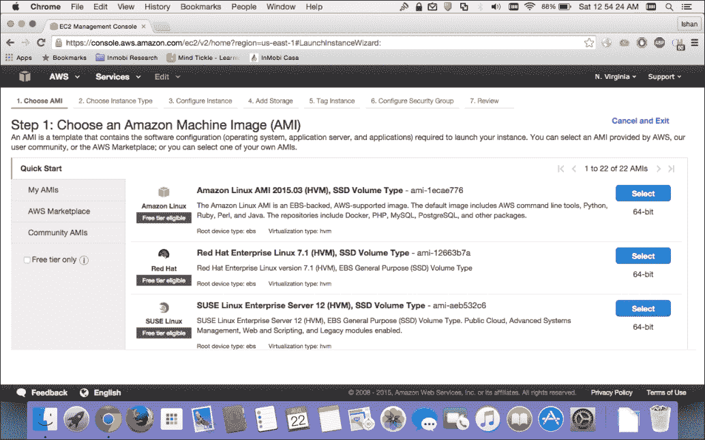

3.  Click on the **AWS Marketplace** option and search for Kali Linux on **AWS Marketplace** as shown in the following screenshot:

    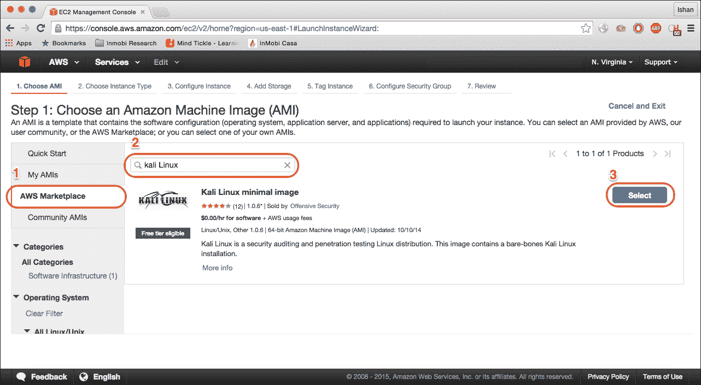

4.  Click on **Select** and then click on **Continue** as shown in the following screenshot:

    

5.  Now you are on the screen displayed in step 2\. Here you can select an instance type; be informed that only **t1.micro** and **t2.micro** will be eligible for free tier. However, running Metasploit requires minimum 2 GB RAM. For this you can opt for **t2.small** or**t2.medium** as per your budget as shown in the following screenshot:

    

6.  Click on **Review and Launch**. You will see a popup window asking you to use SSD as your boot volume. Select **Make general purpose (SSH)...(recommended)** and click on **Next**, as shown in the following screenshot:

    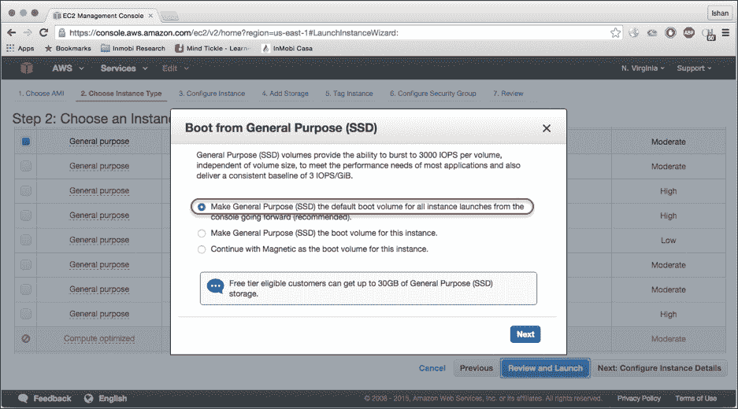

7.  You will be directly taken to step 7 for review, as shown in the following screenshot:

    

8.  You will first see the warning, which is to improve your instance security; click on **6\. Configure Security Group**, as shown in the following screenshot:

    

9.  Click on the **Source** listbox and select **My IP**, it will automatically detect your public IP range. Click on **Review and Launch**. Note that it would only work if you have a dedicated public IP. If you have a dynamic IP, you will need to login back to the AWS console and allow your updated IP address:

    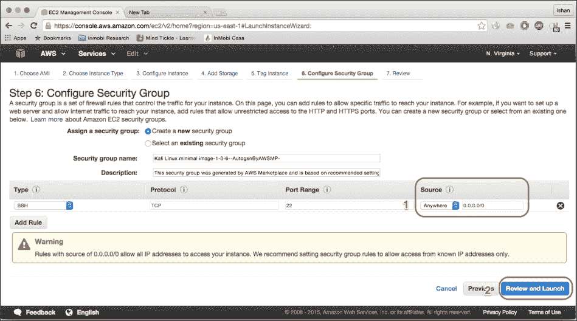

10.  As you can see, there is a warning that says you are not eligible for free usage tier since we have selected **m2.medium** for minimum 2GB RAM:

    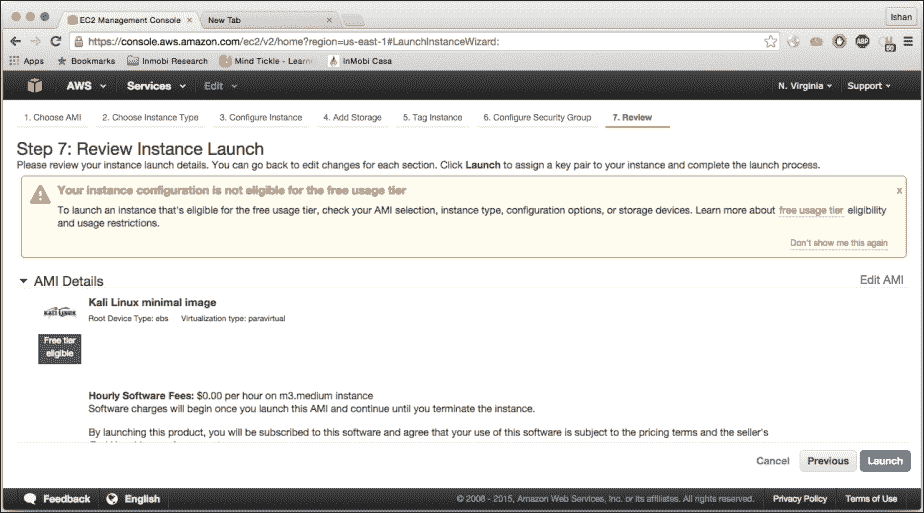

11.  Click on **Launch**; here you need to create a new key pair before and download it before you can proceed, as shown in the following screenshot:

    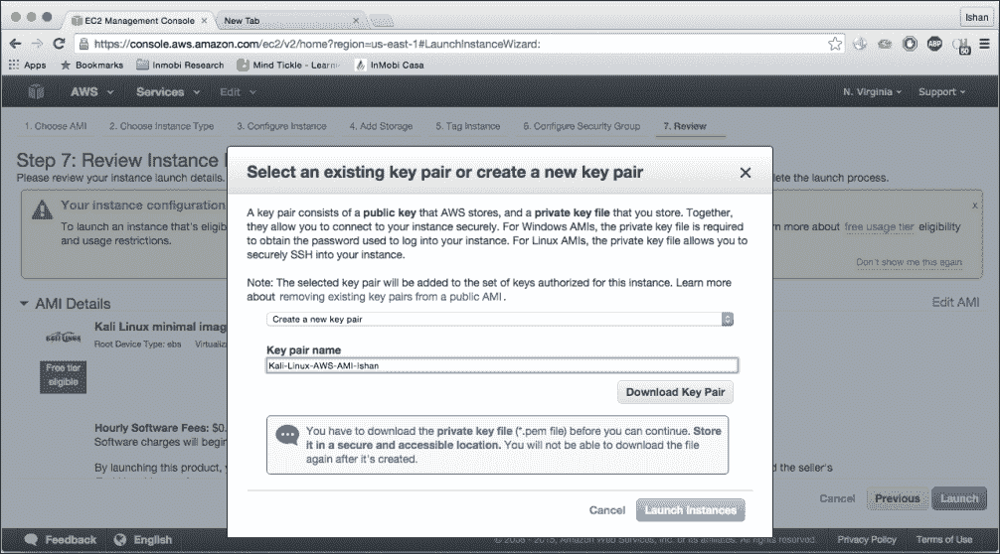

12.  Once you have downloaded the key pair, go ahead and click on **Launch Instances**, as shown in the following screenshot:

    

## 它是如何工作的。。。

EC2 中的**EC**代表**弹性计算**，简而言之，就是在云中搭建一个虚拟服务器。AmazonAWS 已经收集了所有流行的操作系统映像，您需要做的就是根据您的需求选择一个映像，然后是硬件需求。根据您选择的操作系统和硬件配置，AWS 将提供该硬件配置并安装该操作系统。您可以选择所需的存储类型，传统或 SSD，然后根据需要连接/解除连接硬盘驱动器。最重要的是，你只需为你想使用它的时间付费，当你停止 EC2 机器时，AWS 将释放这些资源并将其添加回其库存，这就是 AWS 的灵活性。现在，是时候快速回顾一下我们在这个食谱中所做的事情了。作为先决条件，您需要首先创建一个 AmazonAWS 帐户，这非常容易创建。然后，步骤 1 向您展示了如何选择 EC2。步骤 2 和 3 展示了如何搜索和选择 Kali Linux 的最小映像。在步骤 4 中，您将阅读 Kali Linux AMI 提供的所有内容、基本要求和用户登录信息。步骤 5 显示了如何根据需求和预算选择实例类型。在步骤 6 到步骤 7 中，您将通过简单向导选择要引导的默认推荐 SSD。步骤 8 显示了最后一页，其中包含警告和您应该注意或注意的要点。在步骤 9 中，您选择在 SSH 协议端口`22`上设置一个安全组，只允许您从属于您的特定 IP 范围访问。在步骤 10 中，将显示“审阅”页面，根据您的实例类型选择，该页面将通知您是否有资格获得免费层。在步骤 11 中，创建一个新的 SSH 密钥对并将其下载到本地计算机上。在步骤 12 中，最后单击 launch 启动实例。

## 还有更多。。。

在 AmazonAWS 基础设施中安装 KaliLinux，只需点击几下，就可以获得公共 IP 地址，这在外部渗透测试中非常有用。正如您所知，我们已经选择并安装了 Kali Linux 的最小映像，以便在 AWS 基础设施中使用，因此我们的安装默认情况下没有安装任何工具。

在下一个食谱中，我们将介绍如何在 AmazonAWS 上使用 SSH 和设置 KaliLinux。在本教程中，我们还将解决您在更新存储库、安装 Kali Linux 工具、设置 GUI 和安装所有需要使用的工具时可能遇到的一些问题。

# 在 Docker 上安装 Kali Linux

我认为在这里对 Docker 做一点介绍是合理的。Docker 是一种新的开源容器技术，于 2013 年 3 月发布，可自动在自给自足的软件容器中部署应用程序。Docker（构建在 Linux 容器之上）提供了一种更简单的方法，可以在一台机器上管理多个容器。可以将其视为一个虚拟机，但它更轻量级、更高效。

这样做的好处在于，您几乎可以在任何可以运行 Docker 的系统上安装 Kali Linux。比方说，你想在 Digital Ocean droplet 上运行 Kali，但它不允许你像在 Ubuntu 上那样直接派生出 Kali Linux。但现在，你只需在 digital ocean 上剥离 Ubuntu 或 centos，在其上安装 Docker，并提取 Kali Linux Docker 映像，就可以了。

由于 Docker 提供了另一个抽象层，因此从安全角度来看也是有益的。比方说，如果您正在运行承载应用程序的 apache 服务器，您只需为此创建一个 Docker 容器并运行它。即使您的应用程序遭到破坏，攻击者也只能在 Docker 映像中独立存在，并且无法伤害您的主机操作系统。

说到这里，现在在您的机器上安装 Docker，为了演示，我们将在 Mac 操作系统上安装 Docker。

## 准备好了吗

对于此配方，您需要以下内容：

*   连接到 Internet
*   已安装的 Virtualbox

## 怎么做。。。

为此配方执行以下步骤：

1.  要在 Mac 操作系统上安装 Docker，您需要从[下载并安装 Docker toolboxhttps://www.docker.com/docker-toolbox](https://www.docker.com/docker-toolbox) 。在 mac 上运行此安装程序时，您将设置 Docker 环境；工具箱将安装 Docker 客户端、计算机、Compose（仅限 Mac）、Kitematic 和 VirtualBox。
2.  Once the installation is done, go to **Applications** | **Docker** | **Docker Quickstart Terminal.app** or simply open the Launchpad and click on Docker Quickstart, When you double-click on the application, you will see the terminal window as shown in the following screenshot:

    

3.  To check whether your installation has succeeded, you can run the following command:

    ```
     docker run hello-world

    ```

    如果安装成功，您将看到以下输出：

    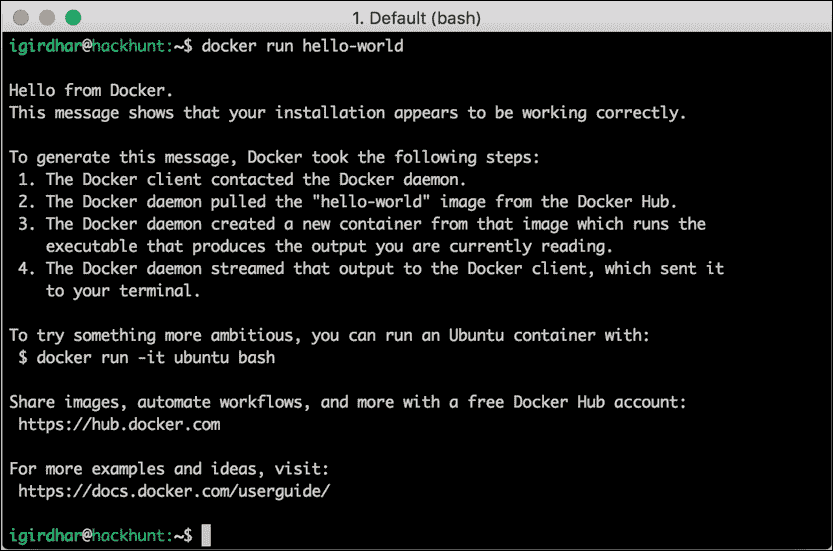

4.  Now, let's go to Docker hub ( [https://hub.docker.com](https://hub.docker.com) ) and search for `Kali Linux` image, as shown in the following screenshot:

    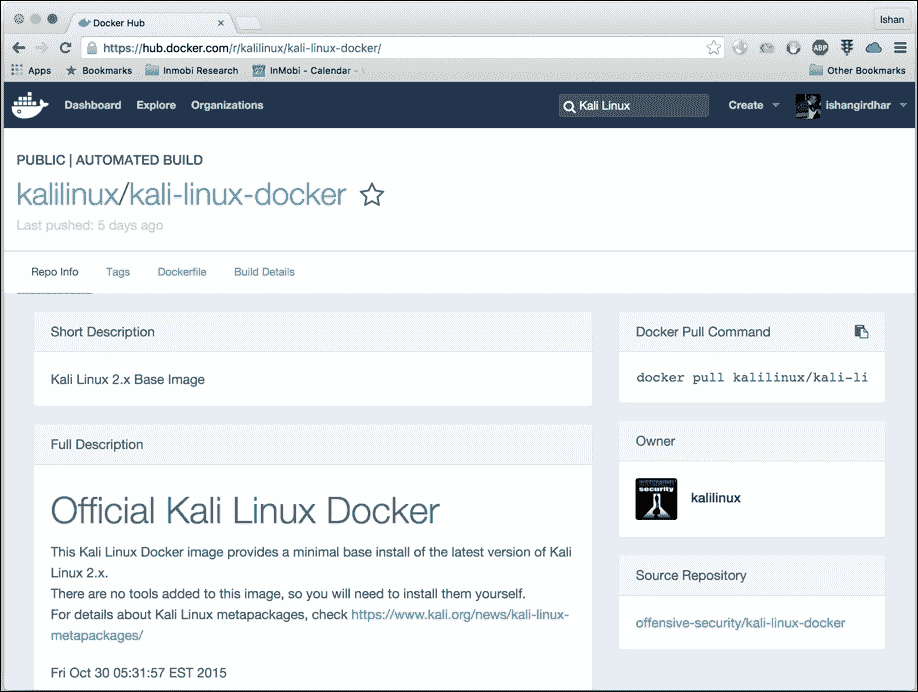

5.  正如你所见，官方卡利形象是可用的；我们将使用以下命令在 Docker 中拉取并运行它：

    ```
     docker pull kalilinux/kali-linux-docker
     docker run -t -i kalilinux/kali-linux-docker

    ```

6.  现在，您有了在 Docker 中运行的 Kali Linux 的最低基础版本；此图中没有添加任何工具，您可以根据需要安装，也可以参考[https://www.kali.org/news/kali-linux-metapackages/](https://www.kali.org/news/kali-linux-metapackages/) 。
7.  Let's say, you just want to run only Metasploit; for that you can search for `kali Metasploit` image on the hub and install the one with the highest number of pulls so far, as shown in the following screenshot:

    

8.  使用以下命令拉取图像；但在你这么做之前，请注意这不是一个官方形象。因此，您是否信任此图像由您自行决定：

    ```
     docker pull linuxkonsult/kali-metasploit

    ```

9.  Then, run the Docker image with the `docker run` command as shown:

    ```
    docker run -t -i linuxkonsult/kali-metasploit

    ```

    输出将如以下屏幕截图所示：

    

    一旦框架准备好，它就被解包并执行，它应该如下所示：

    

    正如您所看到的，您已经更新并运行了 Metasploit。但事实并非如此；在提交更改之前，您所做的所有更改都不是永久性的。一旦您提交了更改，您就可以从上次停止的地方重新开始。要提交更改，请打开另一个控制台窗口并键入以下命令：

    ```
          docker ps

    ```

10.  On running this command, you will see the following output, as shown in the following screenshot:

    

11.  To commit the changes, you need to enter the command in the following format:

    ```
          docker commit <docker-id> <docker-name>
    docker commit bd590456f320 admiring_pike

    ```

    成功提交后，您将看到以下输出：

    ```
    b4a7745de59f9e106029c49a508c2f55b36be0e9487dbd32f6b5c58b24fcb57

    ```

## 它是如何工作的。。。

在这个配方中，我们需要已经安装 Virtualbox 作为先决条件，我们下载并安装了 Docker 工具箱。安装 Docker toolbox 后，只需打开**Docker Quickstart Terminal.app**并拉取要运行的图像，即可从[中搜索所需图像 https://hub.docker.com](https://hub.docker.com) 并使用`docker run`命令运行。完成操作后，只需使用`docker commit`命令提交更改即可。

这里，我们使用了`-i`和`-t`开关。对于交互式进程（如 shell），您必须同时使用`-i``-t`才能为容器进程分配**电传打字机**（**TTY**）。`-i``-t`开关通常写为`-it`。

## 还有更多。。。

您可以在[了解更多关于 Docker 的信息 https://www.docker.com](https://www.docker.com) 。要搜索公共图像，您可以访问[https://hub.docker.com](https://hub.docker.com) 。要安装 Kali Linux 元软件包，您可以访问[https://www.kali.org/news/kali-linux-metapackages/](https://www.kali.org/news/kali-linux-metapackages/) 。

# 在 OnePlus 上安装 NetHunter

Kali Linux NetHunter 是第一个针对 nexus 和 one plus 设备的开源网络笔测试平台。在本章中，我们将看到如何在 One Plus One 上安装 Kali Linux NetHunter。

在开始之前，请确保在继续执行以下操作之前备份设备数据。

## 准备好了吗

为了开始这项工作，您需要以下内容：

*   一加一设备，64 GB
*   USB 电缆
*   任何 Windows 操作系统
*   NetHunter Windows 安装程序
*   主动 Internet 连接

## 怎么做。。。

为此配方执行以下步骤：

1.  Download the Kali NetHunter Windows Installer at [http://www.nethunter.com/download/](http://www.nethunter.com/download/) , you will see the following page:

    

2.  Install the downloaded setup, as shown in the following screenshot:

    

3.  Once the installation is complete, run the shortcut created on the desktop:

    

4.  Once the application loads, make sure you check for any updates. If there are none, click on the **Next** button:

    

5.  Now we will select the device for rooting. Our recipe sticks to OnePlus, so let's select the **ONEPLUSONE-BACON (A0001) - 64GB** option and click on **Next**:

    

6.  Now we will be prompted to install drivers, these are drivers for the laptop/PC to communicate with the mobile device over a USB connection. Click on **Install****Drivers...** to commence the installation process. Once the installation is done, click on **Test Drivers...** to make sure that the drivers are working correctly, as shown in the following screenshot:

    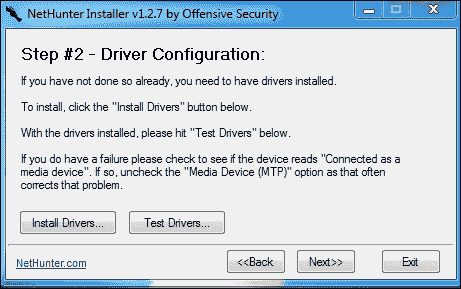

7.  Once the drivers are installed correctly, proceed by clicking on **Next** and now we will come across the installer configuration. Here, it is recommended to proceed with **Install Official Kali Linux NetHunter**. In case you have a custom NetHunter, proceed with the second option but be careful with the compatibility issues:

    

8.  Clicking on **Next**, we will be coming on the **Download Files** option where the application will determine the available packages with us and the missing files can be obtained with the help of the **Download + Update All File Dependencies** option. In case you get stuck or any file is not getting downloaded, you can simply Google the filename and download it and put it in the folder where the application was installed:

    

9.  Once all the dependencies are made available, make sure you do the following:

    

10.  After this has been done, we can proceed with unlocking the bootloader. Click on **Unlock Device Bootloader**. Make sure to back up all the important data from the device before you start from this point onwards:

    

11.  The phone will go in the **Fastboot** mode and proceed with its unlocking. Once that is done, proceed to the next step of flashing the stock ROM. This is a new ROM that will be mounted on your device to keep the compatibility with Kali Linux NetHunter. Click on **Flash Stock...** as shown in the following screenshot:

    

12.  Once the flash stock is done, proceed to the next step and click on **Flash Kali Linux + Root!**, as shown in the following screenshot:

    

    上一步将在您的设备中安装 Kali Linux NetHunter。一旦成功，设备将进入 TWRP 恢复模式。

13.  In the Recovery mode, click on **Reboot** and it will ask that Super user is not installed Swipe to install once the swipe is done the Kali linux will boot. Now, click on **SuperSU** and see whether it is working:

    

14.  Download **BusyBox** by Stephen (Stericson) and install, as shown in the following screenshot:

    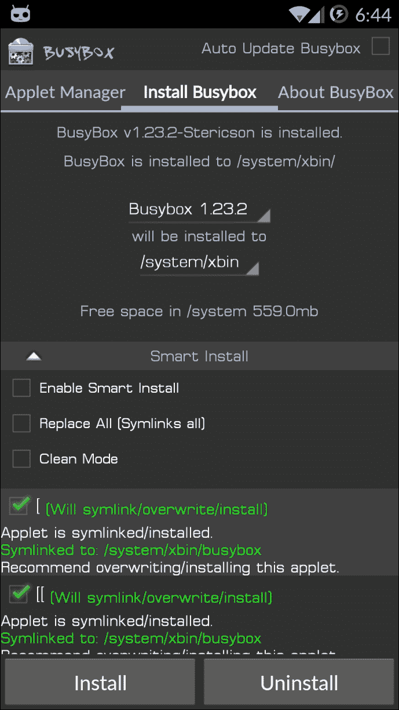

15.  Click on the icon called **NetHunter**, as shown in the following screenshot:

    

16.  Once you get the application running, you will be asked to grant root permissions. Click on **Grant** and commence to the Kali Launcher and then the terminal, as shown in the following screenshot:

    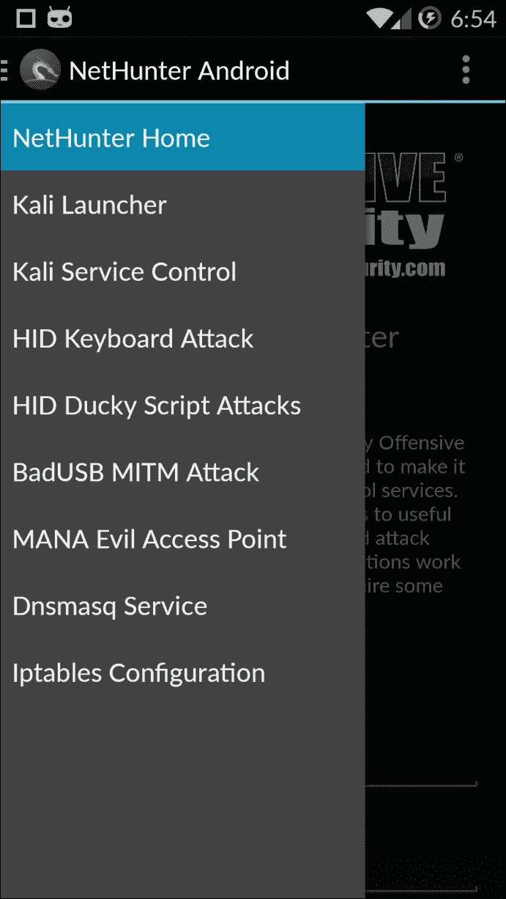

17.  Select the Kali terminal and launch **Metasploit**, as shown in the following screenshot:

    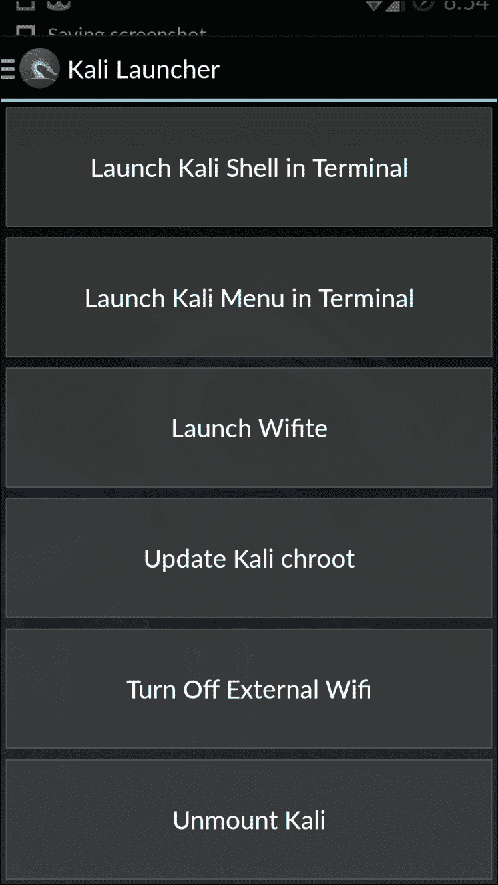

18.  Launch **msfconsole** on the device:

    

## 它是如何工作的。。。

在这个配方中，我们展示了如何安装 Kali Linux，它被称为 NetHunter。NetHunter 是一款 ARM，移植后可在非英特尔处理器上运行，该处理器基于您信任的 Kali Linux 和工具集。Kali Linux NetHunter 项目是一个针对 ARM 设备的开源 Android 渗透测试平台，由 Kali 社区成员**BinkyBear**和攻击性安全部门共同创建。

## 还有更多。。。

我们在设备上安装了 Kali NetHunter，现在我们可以从 OnePlus one 执行笔测试，这在红队训练、社会工程或物理安全评估期间非常有效。

更多相关信息请参见[http://www.nethunter.com](http://www.nethunter.com) 。

# 在虚拟机上安装 Kali Linux

在硬盘上安装 Kali Linux 是第一步。在物理硬盘或虚拟硬盘上安装 Kali Linux 的过程是完全相似的。因此，可以使用相同的步骤在物理机器上安装 Kali Linux。不用说，通过使用这种方法，只有 Kali Linux 2.0 将作为主要操作系统安装在硬盘上。

## 准备好了吗

在安装 Kali Linux 之前，您需要 Kali Linux 最新的 ISO 映像，可从[下载 https://www.kali.org/downloads/](https://www.kali.org/downloads/) 。

## 怎么做。。。

为此配方执行以下步骤：

1.  Open VMware on your macOS and press *command* + *N*, once the same is done we will see something like the following screenshot:

    

2.  Select **Install from disc or image** and click on **Continue**:

    

3.  Drag and drop the Kali Linux 2.0 ISO, which you have just downloaded, as shown in the following screenshot:

    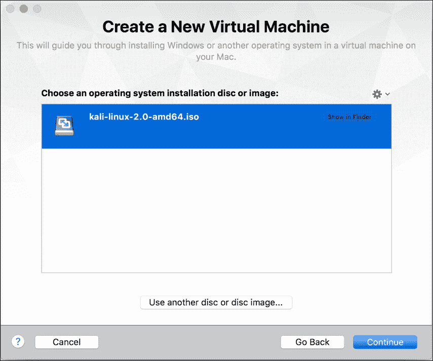

4.  Select **Debian 5 64bit** and click on **Continue**, as shown in the following screenshot:

    

5.  Click on **Customize Setting** and select the desired location to save your virtual machine:

    

6.  After saving, VMware opens **Debian settings**. Open **Processors & Memory** and increase the RAM size to 4 GB (or based on the memory available in your laptop). Remember that Metasploit requires minimum 2GB of RAM to run as a prerequisite:

    

7.  Close the window and click on **Start** and then click inside the window. The cursor control will go to **Guest VM**. Scroll down and select **Graphical install** as shown in the following screenshot:

    

8.  Select your preferred language and click on **Continue** (we chose **English**):

    

9.  Select your country (we chose **United States**):

    

10.  Select your keyboard configuration (we selected **American English**):

    

11.  Next, we need to configure the basic network services. Enter your preferred hostname (we named it `Intrusion-Exploitation`):

    

12.  Next, enter the domain name of your choice (we entered `kali.example.com`):

    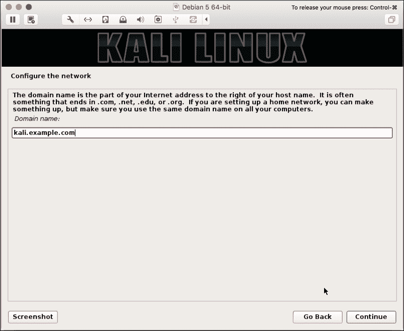

13.  The most important step is to enter your root password, and make sure you have a strong password, and that you don't forget it (use a combination of A-Z, a-z, 0-9, and special characters):

    

14.  In the next screen, you select your time zone (we chose **Eastern**):

    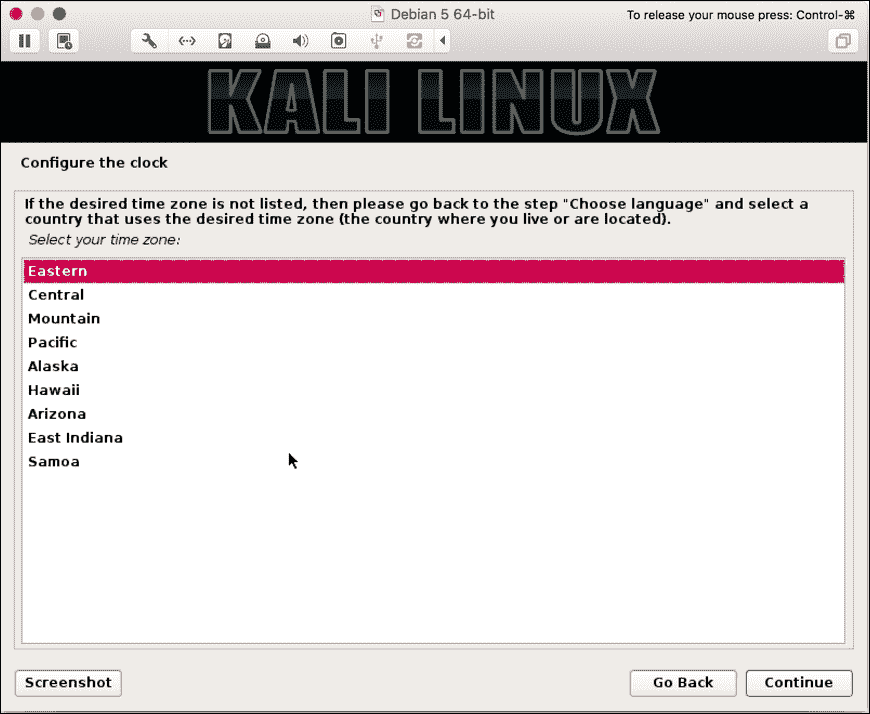

15.  Next, you will be shown four options to choose from; if you have a preferred way of partitioning disk, you can select **Manual**. However, for easy partitioning, we will be using **Guided - Use Entire Disk**:

    

16.  On the screen, you will be prompted that the entire disk space will be formatted, click on **Continue**:

    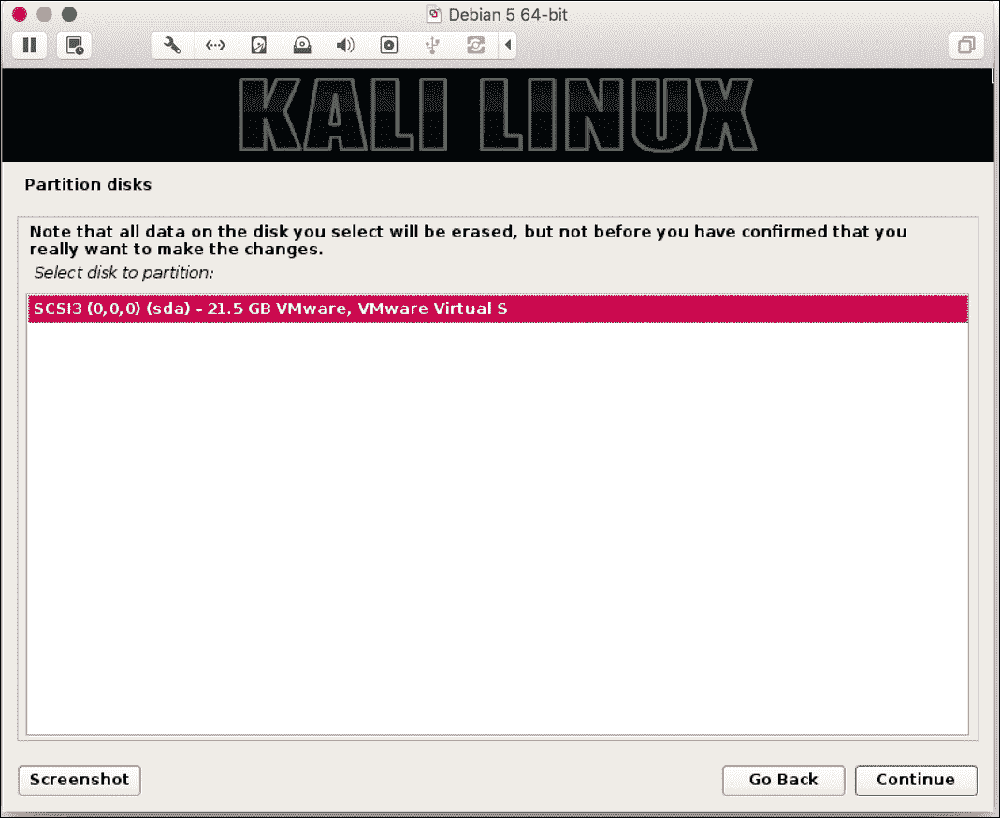

17.  Next, you will be shown three options. Since we are only going to use it for penetration testing and not as a server or main desktop operating system, it is safe to select **All files in one partition**:

    

18.  You will be shown a summary of changes to be made on your disk. Select **Finish Partitioning and write changes to the disk** and click on **Continue**:

    

19.  Select **Yes** and click on **Continue**:

    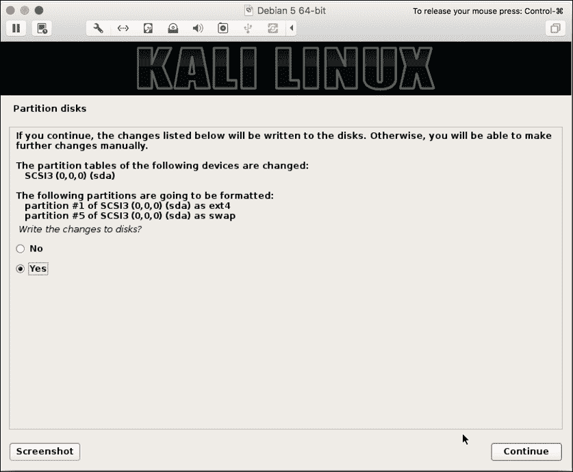

20.  Next, you will be asked to configure your package manager using a network mirror. It allows you to update your Kali tools collection as and when they are available, and, in our case, we selected **Yes**:

    

21.  Next, you can enter if you have any proxy server in your network. If not, you can simply skip and click on **Continue**:

    

22.  Finally, you will be asked to install GRUB Bootloader to/Dev/SDA- Master Boot Record; select **Yes** and click on **Continue**:

    

23.  Finally, you will be asked to manually enter the device or `/dev/sda`; select `/dev/sda` and click on **Continue**:

    

24.  如果您看到前面的屏幕，这意味着您已经完成了安装，直到完成 Kali 安装。祝贺点击**继续**，系统将重新启动，为您带来全新安装的 Kali Linux。

## 它是如何工作的。。。

在这个配方中，我们插入了 Kali Linux ISO 并开始了图形化安装。在图形化安装过程中，我们开始使用首选语言、键盘语言、国家/地区和时区进行配置。从第 5 步开始，我们输入了 Kali Linux 的主机名，在第 6 步，我们输入了 Kali Linux 的域名。

从步骤 9 到步骤 13，我们将硬盘分区配置为使用整个磁盘进行安装，并为所有文件夹创建一个分区，因为我们将仅将其用于渗透测试。一旦安装完成，从第 14 步开始，我们将 Kali 配置为使用网络镜像进行更快的更新，配置任何网络代理（如果需要）并最终安装 GRUB 引导加载程序。

# 定制 Kali Linux 以实现更快的软件包更新

Kali 包含 300 多个安全工具和系统二进制文件。安装 Kali Linux 之后，您需要做的第一件事是更新 Kali Linux，以获得最新的安全工具和功能集合。由于 Kali 基于 Debian Linux，因此可以使用`apt-get update`命令更新二进制文件和工具的存储库。

然而，在更新 Kali Linux 时，您会注意到无论您的互联网速度和带宽如何，更新都可能很慢。在此配方中，我们将向您展示如何更新包管理器引用的源文件，以便更快地更新包：

## 准备好了吗

对于此配方，您需要使用有效的 IP 地址连接到 Internet。

## 怎么做。。。

为此配方执行以下步骤：

1.  打开终端，用编辑器打开`sources.list`文件：

    ```
     vim /etc/apt/sources.list

    ```

2.  The default `sources.list` file looks like:

    ```
     #deb cdrom:[Debian GNU/Linux 7.0 _Kali_ - Official Snapshot i386       LIVE/INSTALL Binary 20140721-23:20]/ kali contrib main non-free
     deb http://http.kali.org/kali kali main non-free contrib
     deb-src http://http.kali.org/kali kali main non-free contrib
     ## Security updates
     deb http://security.kali.org/kali-security kali/updates main       contrib non-free

    ```

    您只需将`http`更改为`repo`，如下代码所示：

    ```
          #deb cdrom:[Debian GNU/Linux 7.0 _Kali_ - Official Snapshot i386       LIVE/INSTALL Binary 20140721-23:20]/ kali contrib main non-free
          deb http://repo.kali.org/kali kali main non-free contrib
          deb-src http://repo.kali.org/kali kali main non-free contrib
          ## Security updates
          deb http://security.kali.org/kali-security kali/updates main       contrib non-free

    ```

3.  进行以下更改，保存文件，按*Esc*键退出编辑器，然后键入`wq!`并按*回车*。
4.  现在，使用以下命令更新和升级您的 Kali；你会注意到速度上的差异：

    ```
          apt-get update && apt-get upgrade

    ```

## 它是如何工作的。。。

Kali Linux 在世界各地有多个不同的镜像。根据您的 IP 地址位置，它会自动选择离您位置最近的镜像。由于各种原因，这些后视镜可能会在一段时间内变慢。您可以在[找到距离您所在位置最近的镜像列表 http://http.kali.org/README.mirrorlist](http://http.kali.org/README.mirrorlist) 。`apt-get`命令从`/etc/apt/sources.list`获取更新服务器列表。对`sources.list`文件所做的更改确保我们的 Kali 连接到正确的服务器，并获得更快的更新。

# 定制 Kali Linux 以实现更快的操作

在审计和渗透测试期间，您将使用您的 Kali Linux。在这些关键的测试过程中，您需要对 Kali Linux 进行配置和定制，以获得尽可能高的速度。在本食谱中，我们将向您展示几种可用于优化 Kali Linux 体验的工具。

## 准备好了吗

对于此配方，您需要连接到 Internet。

## 怎么做。。。

为此配方执行以下步骤：

1.  Preload is a program written by Behdad Esfahbod, which runs as a daemon. This application closely observes the usage of frequently used applications and binaries and loads into memory when the system is idle. This results in faster start-up time because less data is fetched from the disk. You can read more about this application at [https://wiki.archlinux.org/index.php/Preload](https://wiki.archlinux.org/index.php/Preload) . To install the application, issue the following command on the terminal window:

    ```
          apt-get install preload

    ```

    Bleatbit 可以快速释放磁盘空间，并不知疲倦地保护您的隐私。释放缓存、删除 cookie、清除 Internet 历史记录、分解临时文件、删除日志，并丢弃您不知道存在的垃圾。您可以在[上阅读有关此应用程序的更多信息 http://bleachbit.sourceforge.net/](http://bleachbit.sourceforge.net/) 。

2.  要安装应用程序，请在终端窗口上发出以下命令：

    ```
          apt-get install bleachbit

    ```

3.  默认情况下，Kali 不会显示“启动”菜单中的所有应用程序和脚本。您安装的每个应用程序最终都会通过启动来减慢引导过程，即使它是必需的或不需要的。您可以安装引导管理器，并密切关注在引导过程中允许哪些服务和应用程序。您可以随时禁用不必要的服务和应用程序，以提高 Kali 的启动速度。

要安装应用程序，请在终端窗口上发出以下命令：

```
      apt-get install bum

```

## 它是如何工作的。。。

在这个配方中，我们使用了`apt-get`命令来安装基本的系统实用程序，它可以帮助我们在 pen 测试期间管理好我们的 Kali Linux 资源，使我们的 Kali Linux 进程和启动文件夹保持最佳性能。

# 配置远程连接服务-HTTP、TFTP 和 SSH

在渗透测试和审计期间，我们需要从 Kali Linux 在目标机器上交付有效负载。为此，我们将利用 HTTP、FTP 和 SSH 等基本网络服务。HTTP 和 SSH 等服务默认安装在 Kali Linux 中，但 Kali 不启用任何网络服务来最小化检测。

在此配方中，我们将向您展示如何安全地配置和开始运行服务：

## 准备好了吗

对于此配方，您需要使用有效的 IP 地址连接到 Internet。

## 怎么做。。。

为此配方执行以下步骤：

1.  Let's begin with starting an Apache webserver. To start the Apache service, use the following command:

    ```
          service apache2 start

    ```

    您可以通过使用浏览器浏览本地主机来验证服务是否正在运行，如以下屏幕截图所示：

    

2.  要启动 SSH 服务，需要生成 SSH 密钥。回到 Backtrack r5，您曾经使用`sshd-generate`命令生成 SSH 密钥，这在 Kali Linux 中不可用。使用默认 SSH 密钥存在安全风险，因此应生成新的 SSH 密钥。要生成 SSH 密钥，您可以删除或备份由 Kali Linux 生成的默认密钥：

    ```
          # cd /etc/ssh
          # mkdir default_kali_keys
          # mv ssh_host_* default_kali_keys/
          # cd /root/

    ```

3.  首先，我们需要通过发出以下命令删除 SSH 的运行级别：

    ```
          # update-rc.d -f ssh remove

    ```

4.  现在我们需要通过发出以下命令加载默认 SSH 运行级别：

    ```
          # update-rc.d -f ssh defaults

    ```

5.  重新生成密钥：

    ```
    # dpkg-reconfigure openssh-server 
          Creating SSH2 RSA key; this may take some time ...
          Creating SSH2 DSA key; this may take some time ...
          Creating SSH2 ECDSA key; this may take some time ...
          insserv: warning: current start runlevel(s) (empty) of script       `ssh' overrides LSB defaults (2 3 4 5).
          insserv: warning: current stop runlevel(s) (2 3 4 5) of script       `ssh' overrides LSB defaults (empty).

    ```

6.  You can check whether the SSH key hashes are different now:

    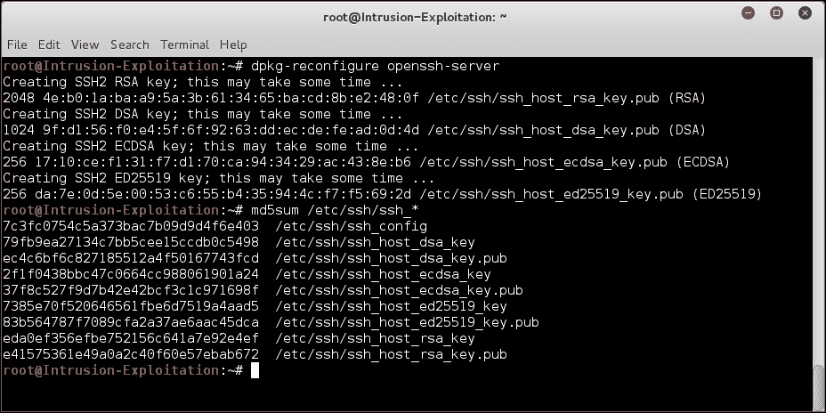

7.  使用以下命令启动 SSH 服务：

    ```
          service ssh start

    ```

8.  您可以使用`netstat`命令验证服务是否正在运行：

    ```
          netstat - antp | grep ssh

    ```

9.  使用以下命令启动 FTP 服务器：

    ```
          service pure-ftpd start

    ```

10.  要验证服务是否正在运行，请使用以下命令：

    ```
          netstat -ant | grep ftp

    ```

11.  To stop any service, you can use the following command:

    ```
          service <servicename> stop

    ```

    此处，`<servicename>`是终止所需服务的名称：

    ```
          service ssh stop

    ```

## 它是如何工作的。。。

在这个配方中，我们已经配置并启动了基本网络服务，我们将根据场景使用这些服务向受害者机器交付有效负载。我们已经启动了 HTTP 服务、FTP 服务，备份了默认 SSH 密钥并生成了新的 SSH 密钥，并启动了 SSH 服务。

# 配置 Nessus 和 Metasploit

在此配方中，我们将向您展示如何安装、配置和开始运行 Nessus 和 Metasploit。

## 准备好了吗

对于此配方，我们将下载 Nessus home feed 并注册有效许可证。

## 怎么做。。。

为此配方执行以下步骤：

1.  Open Firefox and go to [http://www.tenable.com/products/nessus/select-your-operating-system](http://www.tenable.com/products/nessus/select-your-operating-system) and select the home version. On the next page, select the operating system as **Debian 6 and 7** (as Kali is based on Debian Jessie) as shown in the following screenshot:

    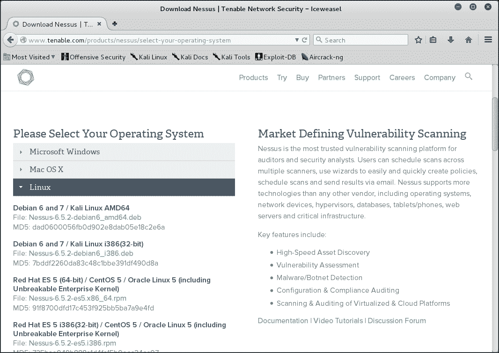

2.  要安装 Nessus，请在终端中打开以下命令并键入：

    ```
          dpkg -i Nessus-6.2.0-debian6_amd64.deb

    ```

3.  Now, your Nessus has been installed as shown in the following screenshot:

    

4.  安装完成后，使用以下命令启动 Nessus 服务：

    ```
          /etc/init.d/nessusd start

    ```

5.  Open the link `https://kali:8834` as shown in the following screenshot:

    

6.  By default, during installation, Nessus is configured for using self-signed certificates to encrypt the traffic between your browser and the Nessus server; therefore, you are seeing the page shown in the preceding screenshot. If you have downloaded the Nessus from a tenable website, you can consider it safe to click on **I understand the risk and accept the certificate** to continue and you will see the following page:

    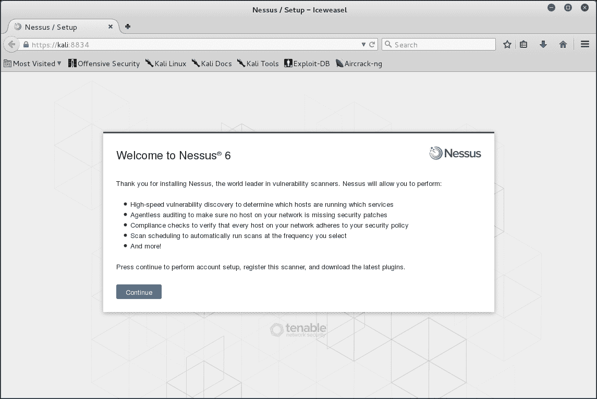

7.  Click on **Continue**, and you will be shown the initial account setup page, as shown in the following screenshot:

    

8.  Enter the username and password combination you want to create and click on **Continue**. On the next page, you will be required to enter the activation code as shown in the following screenshot:

    

9.  To obtain the activation, go to [http://www.tenable.com/products/nessus-home](http://www.tenable.com/products/nessus-home) and fill the form on the right-hand side of the page to receive the activation code. You will receive your activation code on your e-mail account. Copy the activation and enter it on this screen and continue:

    

    现在，激活已经完成，Nessus 将更新插件，该工具将准备好供您使用。

10.  我们现在已经把我们安排好了。那么，让我们设置 Metasploit。默认情况下，在操作系统安装期间安装 Metasploit。要调用，您需要启动以下服务：

    ```
          # service postgresql start
          [ ok ] Starting PostgreSQL 9.1 database server: main.
          root@Intrusion-Exploitation:~#
          root@Intrusion-Exploitation:~# msfconsole
          [ ok ] Starting Metasploit rpc server: prosvc.
          [ ok ] Starting Metasploit web server: thin.
          [ ok ] Starting Metasploit worker: worker.

    ```

11.  Metasploit will be started as shown in the following screenshot:

    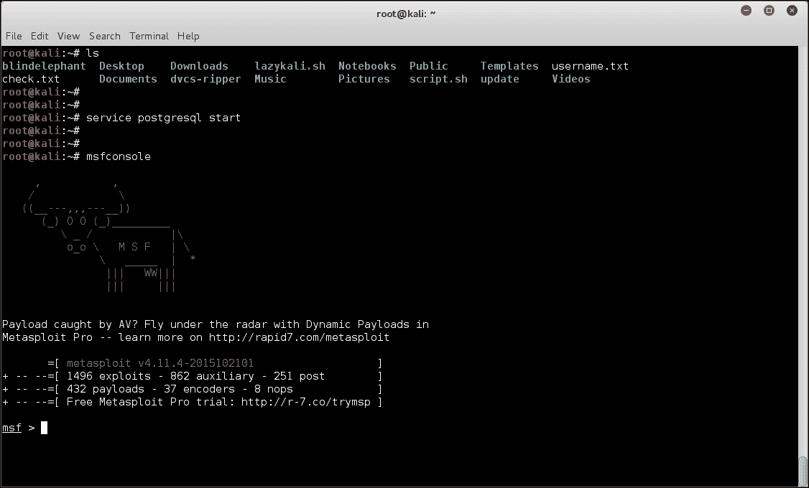

## 它是如何工作的。。。

在此配方中，我们下载了 Nessus home feed 并启动了服务。我们完成了基本的初始帐户设置，并输入了帐户激活密钥以激活 Nessus 的 home feed 版本，最后更新了插件。

后来，我们打开了 PostgreSQL 和 Metasploit 服务，最后，使用`msfconsole`启动了 Metasploit 实例。

## 还有更多。。。

Nessus 是漏洞扫描器，Metasploit 是 Rapid7 的一个攻击框架。然而，大多数网络环境只需要漏洞评估，而不需要深入利用。但是，如果在某些情况下需要，Metasploit 是可用的最佳框架之一。与 Nessus 类似，Rapid7 也推出了自己的漏洞扫描程序，名为**Nexpose**。Nexpose 可以配置为与 Metasploit 集成，这允许 Metasploit 使用 Nexpose 进行漏洞扫描，并根据 Nexpose 收集的信息选择漏洞利用，因此与使用 Nessus 和 Metasploit 相比，它提供了更好的体验。欲了解更多信息，请访问[http://www.rapid7.in/products/nexpose/](http://www.rapid7.in/products/nexpose/) 。

# 配置第三方工具

在这个配方中，我们将安装一些基本的第三方工具，它们是 Backtrack 5 的一部分，或者是笔测试工具箱的一个很好的补充。

## 准备好了吗

对于此配方，您需要连接到 Internet。

## 怎么做。。。

为此配方执行以下步骤：

1.  Lazy Kali is a Bash script that is created to automate the Kali updates and install all other third-party tools that you might require to make Kali as your default operating system. You can read more about this script at [https://code.google.com/p/lazykali/](https://code.google.com/p/lazykali/) .

    要下载并安装此脚本，请在终端窗口上发出以下命令：

    ```
          Wget https://www.lazykaligooglecode.com/files/lazykali.sh
          Give it executable permission and execute:
          chmod +x lazykali.sh
          sh lazykali

    ```

2.  When you run the `lazykali.sh` script, it shows you if the script is already installed, and if not, you can install it as shown in the following screenshot:

    

3.  After self-updating the script, continue and you will see the following screen:

    

4.  接下来，输入`6`安装额外的工具：
5.  然后，选择`Select All`。然后，它将安装后续配方中所需的所有工具。

## 它是如何工作的。。。

在这个配方中，我们下载了`lazykali.sh`脚本，我们用它来下载更多的第三方工具，我们将在我们的进一步配方中使用它。

# 在 Kali Linux 上安装 Docker

在本教程中，我们将介绍如何在 Kali Linux 上安装和设置 Docker。

## 准备好了吗

要逐步完成这一步骤，您需要在 Oracle Virtualbox 或 VMware 中运行 Kali Linux，以及 Internet 连接。不需要其他先决条件。

## 怎么做。。。

对于此配方，您需要执行以下步骤：

1.  在撰写本书时，Kali Linux 2.0 是基于 Debian Wheezy 的，因此这些步骤只适用于基于 Debian Wheezy 的 Kali Linux。将来，如果 Kali 更新，请检查 Docker 文档中安装 Docker 的最新步骤。
2.  在终端窗口中，在您喜爱的编辑器中打开`/etc/apt/sources.list.d/backports.list`。如果文件不存在，请创建它。
3.  删除所有现有条目，并为 Debian wheezy 上的 Backport 添加条目：

    ```
          deb http://http.debian.net/debian wheezy-backports main

    ```

4.  更新包信息并确保 APT 使用 HTTPS 方法工作，并且安装了 CA 证书：

    ```
     $ apt-get update
     $ apt-get install apt-transport-https ca-certificates

    ```

5.  添加 GPG 密钥：

    ```
          $ apt-key adv --keyserver hkp://p80.pool.sks-keyservers.net:80        --recv-keys 58118E89F3A912897C070ADBF76221572C52609D

    ```

6.  在您最喜欢的编辑器中打开`/etc/apt/sources.list.d/docker.list`。如果文件不存在，请创建它。
7.  删除所有现有条目，并为 Debian wheezy 上的 Backport 添加条目：

    ```
          $ deb https://apt.dockerproject.org/repo debian-wheezy main

    ```

8.  更新包信息并验证 APT 是否从正确的存储库中提取：

    ```
          $ apt-get update && apt-cache policy docker-engine

    ```

9.  安装 Docker:

    ```
          $ apt-get install docker-engine

    ```

10.  启动 Docker 守护程序：

    ```
          $ service docker start

    ```

11.  确认 Docker 安装正确：

    ```
          $ docker run hello-world

    ```

因为您已经在 Kali Linux 安装中以`root`身份登录，所以不需要使用`sudo`。但需要注意的是，`docker`守护进程始终以`root`用户身份运行，`docker`守护进程绑定到 Unix 套接字而不是 TCP 端口。默认情况下，该 Unix 套接字归用户`root`所有，因此，如果您不是以 root 用户身份登录，则需要将前面的命令与`sudo`一起使用。

## 它是如何工作的。。。

在这个配方中，我们添加了`docker`源列表，以便每次在系统上使用`apt-get update`命令时都可以获取 Docker 更新。然后，更新`apt-get`源代码并安装安装 Docker 所需的先决条件。我们添加了`GPG`键，以确保我们正在安装的任何更新都是有效的官方未更改包。在所有这些基本配置之后，我们运行了一个基本的`apt-cache`，以确保 APT 从正确的存储库获取 docker 引擎。最后，我们使用`apt-get`安装了`docker-engine`。