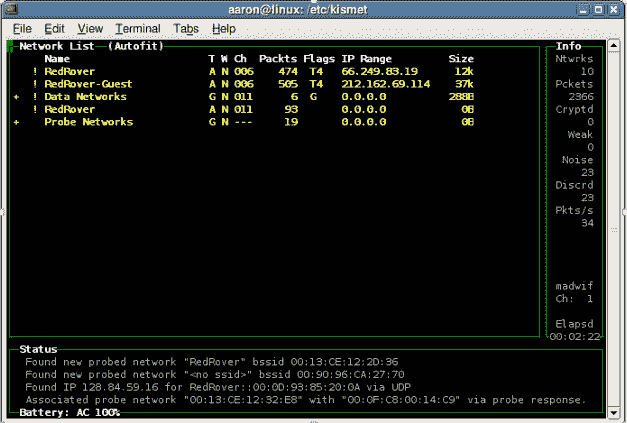
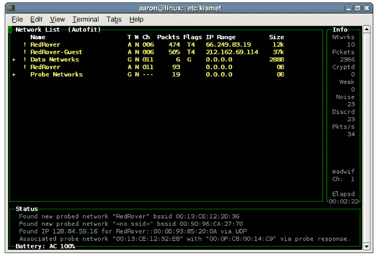

# 二、攻击访问控制

在本章中，我们将介绍以下配方：

*   与战争驾驶一起工作
*   绘制接入点地图并提高准确性
*   创建恶意访问点
*   利用 MAC 欺骗规避 MAC 过滤
*   识别滥交客户

# 介绍

使用无线网络时，可能使用的攻击类别之一是访问控制攻击。这类攻击的目的是通过规避访问控制措施来渗透和破坏无线网络。这些类型的访问控制措施包括 MAC 过滤、错误配置、恶意访问点等项，以及我们将在本章中讨论的其他项。

在我们走得太远之前，让我们更详细地了解访问控制，以便更清楚地理解我们在这一章中攻击的是什么。

访问控制过程涉及识别联合和授权。任何针对访问控制的攻击都将试图窃取凭据，或冒充用户或系统，以获取访问权限并执行未经授权或彻底的恶意活动。正是因为访问控制是一个常见的攻击目标，组织必须实施强大而适当的控制。

在无线网络上，访问控制可以采取多种不同的形式，每种形式都可以单独使用，也可以一起部署以形成更强健的解决方案。无线网络中使用的访问控制机制的一些示例包括：

*   **MAC 过滤**：这是一个将 MAC 地址输入接入点的过程，目的是允许或禁止持有这些 MAC 地址的设备进行访问。
*   **掩蔽 SSID**：网络管理员使用该技术来停止网络标识符的公开广播。
*   **接入点位置**：网络所有者可选择将其接入点放置在广播仅限于建筑物内某一地理区域的位置。这限制了恶意方或攻击方访问的信号量。

这只是一个简短的访问控制措施列表，可以将无线网络的访问权限限制在授权方。

一旦访问控制遭到破坏或颠覆，攻击者就可以继续深入目标网络。攻击者可以利用无线网络或连接到无线网络的设备中存在的缺陷或错误配置，甚至可能忽略或低估选项，绕过访问控制。

# 访问控制攻击的类型

访问控制攻击有多种形式，我们在本书的几页中并不能涵盖所有形式。但是，我们可以介绍这种类型攻击的许多常见形式。在我们开始探索每一种攻击之前，让我们首先列出本章将介绍的攻击：

*   战争驱动
*   流氓接入点
*   MAC 欺骗
*   特设协会
*   AP 配置错误
*   客户错误关联
*   未经授权的关联
*   滥交客户

记住，这些只是可用于针对无线网络上存在的访问控制的攻击类型中的一小部分；决不能将它们视为访问控制攻击的唯一类型。

# 与战争驾驶一起工作

用于目标访问控制的最早和最常用的攻击形式之一是一种称为战争驱动的技术。简单地说，这项技术就是使用支持无线的设备以及专用软件来检测或探测无线设备范围内的无线网络。

战争驱动之所以如此流行和有效，是因为许多计算机用户，无论是个人还是商业用户，多年来一直在部署`802.11`无线接入点，几乎不考虑安全性。允许用户漫游的无线网络的部署优先于采取措施保护其接入点和设备免受潜在攻击。

针对这种配置错误或不安全的无线网络部署，我们有一类攻击者参与这种行为，称为战争驾驶。参与这项活动的人将建造由硬件和软件组合而成的定制钻机，目的是在公共场所巡游，在某些情况下找到无线接入点和设备。这些人可能只是为了自己的目的定位和瞄准特定的网络，或者在某些情况下，他们甚至可能将这些信息共享到在线数据库或网站，任何访问者都可以在其中搜索这些访问点。

实际上，个人在探索其目标区域之前，通过启用其无线设备和软件来使用这种攻击。当攻击者选择探索其目标区域时，他们将使用自行车、汽车、摩托车、步行，甚至使用无线无人机等更新的方法。无论使用哪种方法，只要攻击方使用合理的方法探索其区域，他们就会发现大量无线设备和/或网络。一旦他们找到了这些无线网络，他们就可以浏览他们收集的信息，并确定哪个无线目标将是重点关注和渗透的目标。

在 Kali Linux 中，我们有许多工具可以方便地进行战争驾驶实践。发行版中对战争驱动有用的每一个工具都有自己的一套功能，这些功能在其他工具中可能存在，也可能不存在。在本书中，我们将重点介绍使用一种更流行的工具来执行战争驾驶，称为 Kismet。

战争驾驶不仅仅是一种形式，还有其他的亚类型属于这个术语。具体来说：

*   **战争飞行** ：与战争驾驶相同，但使用小型飞机或超轻型飞机
*   **战争气球** ：与战争飞行相同，但使用气球代替
*   **战争行走** ：这包括将检测设备放在背包或类似物品中，并穿过建筑物和其他设施

# 准备

要开始工作，您需要准备好以下各项：

*   能够进入监控模式的无线网卡
*   安装 Kismet 的 Kali Linux（默认 Kali 安装的一部分）

这里列出的项目是基本要求，如果需要，您可以轻松使用更多（或不同）组件。例如，如果您想要增强范围，您可以使用基于 USB 的无线网卡，该网卡可以连接外部天线，从而获得更好的接收效果。您也可以使用不同的无线应用程序而不是 Kismet 来完成此任务；然而，由于 Kismet 非常受欢迎，我们将在本食谱中使用它。

# 怎么做。。。

Kismet 是从无线接入点和设备中定位和提取有用信息的有效工具。

请注意：在命令行发出启动 Kismet 的命令之前，应确保如果您使用的是外部 Wi-Fi 适配器，则在发出该命令之前已对其进行了安装和配置。默认情况下，Kismet 应配置为使用物理系统上存在的无线适配器；但是，如果您选择使用外部适配器，则可能需要执行其他配置，以便 Kismet 自己配置和识别适配器。

在此配方中，我们将通过命令提示符启动 Kismet，但也可以从应用程序菜单的*无线攻击*部分启动。在任何一种情况下，启动 Kismet 都会产生与此处记录的步骤相同的结果：

1.  打开终端窗口。
2.  在命令提示下，输入命令`kismet`。
3.  现在，您将在半图形化环境中配置 Kismet。您将使用*选项卡*和*输入*键进行导航。
4.  如果看不到灰色字母行，请使用*选项卡*键高亮显示`No`。否则，请突出显示`Yes`。
5.  按一次*回车*键。
6.  按一次*回车*键，确认 Kismet 正在以 root 用户身份运行。
7.  按一次*回车*键，自动启动 Kismet 服务器。
8.  按一次*回车*键，确认您想要启动 Kismet 服务器。
9.  按*输入*键确认您可以`Add`捕获源：
10.  键入您使用`ifconfig`发现的无线接口的名称。如果您不记得了，您可以打开另一个控制台窗口，再次运行`ifconfig`命令以确定正确的界面（通常命名为以`wlan`开头的界面）。以下屏幕截图显示了界面输入屏幕：


Kismet 接口配置

以下是 Kismet 接口配置应遵循的步骤

一旦达到这一点，您将注意到设备将开始填充窗口。您将看到与每个设备相关的名称、频道、无线标准和其他信息。如果您等待的时间足够长，您会注意到将出现其他设备，并且列出的其他项目可能包含以前没有出现过的更多信息。

在查看 Kismet 窗口中显示的网络列表时，您可能会看到一些看起来稍有不同的条目。例如，请查看以下屏幕截图：



Kismet 主窗口显示检测到的无线客户端。

如果您查看窗口中的项目，您会注意到有一个`Probe Networks`条目。您可以在列表中移动此项目，并使用*+*或*-*打开或关闭选择。您将注意到，当您展开项目时，您将看到将显示一个项目列表。此列表记录了来自附近系统的探测请求。这些探测器由一个支持无线的系统发送，该系统正试图连接到它过去连接的网络。仔细分析 probe 请求下显示的网络名称可以揭示系统连接到的不同接入点的名称，并让您了解系统可能使用的方式或位置。请记住，只要设备与无线网络无关，许多操作系统就会发送这些探测。

还有其他软件包可以用来做 Kismet 正在做的事情；然而，Kismet 具有高度可定制和被动的优势。被动意味着软件不会从该区域的无线接入点向非法响应发送任何信息；相反，软件监听与接入点相关的连接和流量，以显示其存在并确定其名称。此外，软件包能够检测隐藏在其他类似软件包可能无法执行相同操作的地方的接入点。

# 绘制接入点地图并提高准确性

战争驱动的下一步是使用与接入点或设备本身有关的位置或地理数据来增强您正在收集的数据。在现代，通过使用**全球定位系统**（**GPS**技术）方便了这些数据的收集。现代 GPS 设备可以连接到笔记本电脑或笔记本电脑等系统，以便在某些情况下使用蓝牙、USB 甚至串行连接。如果您打算使用平板电脑或智能手机等移动设备执行战争驾驶，则您的设备很可能已经包含可用于绘制接入点地图的内置 GPS。

如果要使用外部 GPS 设备，请务必注意，并非所有这些设备都是相同的。一些设备能够在通电后很短的时间内获得卫星定位，而另一些设备可能需要两分钟甚至更长的时间才能在冷启动后获得卫星定位。影响 GPS 数据质量和准确性的另一个因素是 GPS 设备更新其位置的频率；有些人可能会更频繁地更新坐标。而其他人这样做的频率较低，可能会影响坐标的准确性。

实际上，所有 GPS 设备都可用于执行战争驾驶。唯一的要求是这些 GPS 设备能够向请求系统或软件提供当前且合理准确的 GPS 数据。

# 准备

要开始工作，您需要准备好以下各项：

*   能够进入监控模式的无线网卡
*   安装 Kismet 的 Kali Linux（默认 Kali 安装的一部分）
*   蓝牙或 USB GPS 设备

这里列出的项目是基本要求，如果需要，您可以轻松使用更多（或不同）组件。例如，如果您想要增强范围，您可以使用基于 USB 的无线网卡，该网卡可以连接外部天线，从而获得更好的接收效果。您还可以使用不同的无线应用程序（而不是 Kismet）来完成此任务；然而，由于 Kismet 非常受欢迎，我们将在本食谱中使用它。

# 怎么做。。。

为了让 Kismet 能够访问 GPS 数据，我们需要先进行一些设置。这是通过使用 GPSD 完成的。GPSD 实用程序用于从 GPS 返回信息，我们将在 Kismet 中使用：


可与 Kismet 配合使用的 USB GPS 设备

1.  首先，要使用`gpsd`，您很可能需要安装它，因为它通常不是作为 Kali 自己安装过程的一部分安装的。为了安装此服务以便使用，我们只需使用以下命令：

```
        apt-get install gpsd

```

2.  然后，我们需要安装第二个名为`gpsd-clients`的软件包，以帮助从 GPS 检索数据。我们通过发出以下命令来安装此软件包：

```
        apt-get install gpsd-clients

```

3.  安装后，您现在应该连接 GPS 硬件。我们可以通过发出以下命令来验证 GPS 加密狗是否存在：

```
        lsusb

```

4.  然后，验证无线适配器是否存在，并获取接口名称：

```
    ifconfig

```

5.  接下来，确保您的 GPS 适配器显示在`/dev/`目录中。要执行此操作，请使用以下命令：

```
        ls /dev/gps*

```

以下屏幕截图显示了前面的命令：


列出 GPS 设备的结果

6.  这也有助于您识别名称。在`/dev/`中识别路径后，将其作为参数传递给`gpsd`：

```
    gpsd /dev/gps[x]

```

7.  一旦您确定了`gps`的名称并成功地将其传递给`gpsd`流程，现在是时候转到 Kismet 并查看它是否检测到 GPS 了。为此，您将像以前一样启动 Kismet。

8.  进入 Kismet 后，使用 backtick/accent 按钮（```访问顶部的 Kismet 菜单。向右滚动至 Windows 菜单，然后选择 GPS 详细信息：


GPS 详细信息窗口

9.  如果您的 GPS 信号良好，您应该会看到一个窗口，显示类似于以下屏幕截图的内容：


Kismet 接收到的 GPS 信号

请记住，如果您不接收来自多个卫星的信号，您将无法获得可靠的位置信息。如果您无法从多个卫星接收到合适的信号，您应该尝试其他位置，移动并等待几分钟，看看是否可以重新获取信号。

5.  我们的下一步是将 Kismet 会话期间创建的`.netxml`文件转换为`csv`格式。为此，我们将使用一个名为`giskismet`的应用程序，它将允许我们将`netxml`转换为我们预期的`csv`格式。在我们做任何事情之前，我们需要安装`giskismet`；为此，我们执行以下步骤：

1.`apt-get update`。

2.`apt-get install giskismet`。

3.按*键进入*。

```
        giskismet ­-x Kismet-DATE.netxml ­-q "select * 
    from  wireless" ­-o wardrive.kml

```

一旦您将 Kismet 配置为使用 GPS 确定无线接入点和客户端的位置，您还可以使用它检测不受您控制但连接到网络的恶意接入点。为此，您需要知道获准连接到网络的接入点，然后使用 Kismet 调查该区域，并找到您无法识别且可能连接到网络的接入点。

使用从原始数据创建的 KML 文件，我们现在可以完成真正酷的部分，并将这些数据导入 Google Earth：

1.  使用浏览器打开 Google Earth。
2.  在左侧，单击我的位置。
3.  单击导入 KML 文件。
4.  选择要上载的文件的位置。
5.  选择并打开 KML 文件。该列表的预览将在 Google Earth 中打开。
6.  要在列表中保留这些位置，请单击“保存”。
7.  这些位置将保存到我的位置。

8.  下面的屏幕截图显示了 Google Earth 中显示的 KML 文件中的信息。


KML 数据合并到谷歌地球

# 创建恶意访问点

另一种破坏或规避无线网络访问控制的有效方法是创建所谓的恶意访问点。恶意接入点只是一个无线接入点，未经网络所有者或管理员的明确许可或授权就安装在网络上。实际上，恶意访问点可以由善意的员工、甚至恶意的一方（如不满的员工）或入侵者设置。

接入点可以有两种形式：一种是软接入点，另一种是硬接入点。

软接入点是通过软件创建的接入点，例如我们在 Kali 中使用的类型以及其他第三方应用程序。甚至可以说，智能手机上的软件通过 Wi-Fi 连接共享手机的互联网接入，从而为智能手机本身创造了一个软接入点。

硬接入点更简单，因为它采用硬件设备的形式，可以在计算机商店或大型零售商处购买。事实上，这是大多数人在考虑建立自己的无线网络时会想到的接入点类型。这些接入点来自许多不同的供应商，但它们都倾向于提供类似的功能，每个供应商都添加了各种增强功能。

# 准备

要开始工作，您需要准备好以下各项：

*   能够进入监控模式的无线网卡
*   安装 Kismet 的 Kali Linux（默认 Kali 安装的一部分）

这里列出的项目是基本要求，如果需要，您可以轻松使用更多（或不同）组件。例如，如果您想要增强范围，您可以使用基于 USB 的无线网卡，该网卡可以连接外部天线，从而获得更好的接收效果。

# 怎么做。。。

为了配置恶意访问点，我们需要执行几个步骤。所有这些步骤的目标是配置系统上的无线适配器以模拟接入点，并使用第二个适配器（最好是有线）连接到 internet。最终结果是适配器截获的通信量模仿接入点将通信量定向到有线适配器和互联网，并通过无线适配器将响应发送回请求客户端。

首先，让我们配置一个适配器以连接到 internet：

1.  打开终端窗口，运行[第一章](1.html)、*卡利 Linux 和无线网络*中的`ifconfig`命令。
2.  确定要用于连接到 internet 的有线或无线适配器以及要用作接入点的适配器。

3.  记下适配器名称（通常无线为`wlan`，有线为`eth`）以供参考，并跟踪哪个适配器是哪个。您需要确定哪个适配器将连接到 internet，哪个将作为访问点。
4.  您可以使用 Kali GUI 将一个适配器连接到 internet（在本例中，我们将此适配器命名为`eth0`。

我们流程的下一部分是启动无线适配器并将其配置为接入点的网关。我们可以通过执行以下操作来实现这一点。本例假设接口名为`wlan0`：

1.  通过执行以下命令，使用`ifconfig`命令为`wlan0`配置网关（在本例中，我们将网关设置为`10.0.0.1/24`，但可以设置为任何有效网关，前提是它不与现有地址范围或网关冲突）：

```
    Ifconfig wlan0 10.0.0.1/24 up

```

2.  一旦我们将`wlan0`配置为我们的网关，我们现在想要配置 DHCP 和 DNS 来为我们的客户机发出 IP 地址并执行名称解析。通过配置我们的恶意访问点向请求客户端发出 IP 地址，现在就可以为他们提供网关和 DNS 服务器的地址。当我们希望执行中间人攻击和嗅探攻击时，DNS 部分变得非常重要，因为它允许我们拦截名称查询并根据需要重定向它们。
3.  我们在此过程中的步骤是配置并执行`dnsmasq`。此实用程序将允许我们同时执行 DHCP 和 DNS 的角色。
4.  我们首先创建一个名为`dnsmasq.conf`的文件，通知`dnsmasq`应用程序如何工作。为此，您需要打开一个文本编辑器，如`gedit`或任何创建简单文本文件的工具。在此文件中，您将输入以下信息：

```
     interface=wlan0 
     dhcp-range=10.0.0.10,10.0.0.250,12h 
     dhcp-option=3,10.0.0.1 
     dhcp-option=6,10.0.0.1 
     server=8.8.8.8 
```

5.  完成后，将此信息保存到名为`dnsmasq.conf`的文件中。

您刚才创建的此文件的作用如下：

*   **接口**：说明在哪个接口上监听请求并分发地址。
*   **Dhcp 范围**：提供`dhcp`范围以及租用 IP 的小时数。
*   **Dhcp 选项**：这些是`dhcp`服务器。
*   **服务器**：这是您将向其转发查询的 DNS 服务器的地址。请记住，只要这个文件到位，我们正在配置的接入点就会将所有请求转发到`8.8.8.8`进行解析（在这种情况下，地址指向谷歌的一个免费 DNS 服务器）。如果我们不做任何其他事情，这个系统只会像其他任何接入点一样工作，而不会做任何特殊的事情。

如果我们希望拦截请求，我们需要创建一个称为`fakehosts.conf`的附加文件，该文件允许我们通知`dnsmasq`我们要拦截的查询：

1.  我们首先创建一个名为`fakehosts.conf`的文件，通知`dnsmasq`应用程序哪些请求将被拦截。
2.  要做到这一点，您需要打开一个文本编辑器，比如 gedit 或任何创建简单文本文件的东西，就像我们以前做的那样。在此文件中，您将输入以下信息：

```
      10.0.0.9 usatoday.com 
      10.0.0.9 zelda.com 

     Save this file as fakehosts.conf 
```

3.  这将导致`dnsmasq`DNS 服务器以`10.0.0.9`响应任何对这些地址的请求。在实际的攻击场景中，我们会输入我们控制的服务器的 IP 地址，这样当受害者访问它时，他们会提供信息，或者感染恶意软件，或者其他我们想要的东西。
4.  然后我们需要启动`dnsmasq`，如下所示：

```
    dnsmasq -C dnsmasq.conf -H fakehosts.conf

```

5.  这告诉`dnsmasq`使用`dnsmasq.conf`（`-C`进行自身配置，并参考`fakehosts.conf`了解被欺骗主机的信息。

6.  通过配置并成功启动`dnsmasq`（意味着没有返回错误），我们现在可以启动接入点本身。这意味着我们将启动一项服务，允许我们的无线适配器向任何愿意连接它的人宣传自己作为接入点。为此，我们需要运行一个名为`hostapd`的程序。
7.  为了运行`hostapd`，我们首先需要安装它；这是通过运行以下命令完成的：

```
         apt-get install hostapd
```

8.  接下来，就像`dnsmasq`一样，我们需要创建一个`conf`文件，告诉`hostapd.conf`如何工作；我们通过执行以下步骤来实现这一点：
    1.  打开一个文本编辑器。
    2.  在文件中输入以下内容：

```
          interface=wlan0 
          driver=nl80211 
          ssid=freewifi 
          channel=1 

```

9.  接下来，我们需要打开接入点；我们通过执行以下命令来实现这一点：

```
        hostapd ./hostapd.conf 

```

10.  这将打开接入点。您可能会看到关于更新失败的错误消息，但这是正常的，通常不会产生不良影响。
11.  接下来，我们需要通过将流量从`wlan0`定向到`eth0`来执行一些路由，本质上创建一个非常简单的 NAT 设置。为此，请发出以下命令：

```
 sysctl -w net.ipv4.ip_forward=1 
     iptables -P FORWARD ACCEPT 
     iptables --table nat -A POSTROUTING -o
       wlan0 -j MASQUERADE 
```

在这个阶段，你现在应该能够连接到免费的 Wi-Fi，获得 IP 地址，并开始使用互联网。

一旦您运行了 rogue 访问点，您就可以选择如何使用它来为连接它的人带来悲伤。例如，在接入点本身上运行数据包嗅探器（如 Wireshark）将允许您在流量通过接入点时捕获流量。这意味着，如果没有其他保护措施，连接到接入点的受害者可能会泄露重要数据，如登录凭据。

# 利用 MAC 欺骗规避 MAC 过滤

在你的探索过程中，有一种技术可能被用来阻止你的努力，这就是一种被称为 MAC 过滤的技术。简单地说，MAC 过滤是一种对策，它涉及将获准在网络上的设备的 MAC 地址列入白名单，或将不希望在网络上的设备列入黑名单。虽然这项技术极其罕见，而且在最小的网络上经常遇到，但它仍然是一种经常作为推荐的安全机制出现的对策。在这里，我们将探讨如何避免 MAC 过滤，并获得对网络的访问权。

在大多数消费级和商业级接入点中，不难找到 MAC 过滤选项。通常，此选项的名称为 MAC 过滤，或者它可能处于访问控制的一组设置下，甚至可能在某些访问点中被标记为已批准或已阻止的设备。不管它叫什么名字，它仍然执行相同的功能，即无线网络的管理员将选择从他们控制的无线设备收集所有 MAC 地址，并手动将每个 MAC 地址输入接入点，从而将它们列入白名单。另一方面，管理员可以选择使用黑名单，在黑名单中，他们将检测已连接或试图连接到无线网络的恶意设备，然后手动输入阻止它们的 MAC 地址。在任何一种情况下，该过程都可能相当繁琐和耗时，并且随着网络规模的增加以及对无线网络所做的更改的增加，该过程将变得更加复杂。

正如您可能从本节的名称中猜到的，有一种方法可以规避 MAC 过滤，这是通过一种非常简单有效的技术，称为 MAC 欺骗：


无线路由器中的 MAC 过滤选项

MAC 欺骗是一种改变网卡或适配器报告的 MAC 地址的技术。作为快速复习，您应该记得 MAC 地址（有时称为物理地址）是一个十六进制值，在生产时分配给每个网卡。部分由于设计原因，部分由于行业标准，这些地址是唯一的，因此任何两个网卡都不应具有相同的 MAC 地址。正是因为这个原因，MAC 过滤才能够正常工作。但是，通过使用 MAC 欺骗，我们可以更改正在报告的地址，从而输入我们希望从网络适配器报告的任何地址。实际上，这意味着，通过将我们的 MAC 地址更改为我们选择的地址之一，我们可以通过将我们的 MAC 地址更改为新的地址来规避黑名单，或者通过使用经批准的设备的 MAC 地址来规避白名单。

那么，让我们来看看我们是如何做到这一点的。

# 准备

要开始工作，您需要准备好以下各项：

*   能够进入监控模式的无线网卡
*   卡利 Linux
*   `airmon-ng`
*   `airodump-ng`
*   MAC 转换器

这里列出的项目是基本要求，如果需要，您可以轻松使用更多（或不同）组件。例如，如果您想要增强范围，您可以使用基于 USB 的无线网卡，该网卡可以连接外部天线，从而获得更好的接收效果。在此配方中，我们还将使用`aircrack-ng`套件的两个组件（我们将在本书中看到更多内容）来识别要攻击的客户端及其 MAC 地址。

# 怎么做。。。

以下是执行攻击的步骤：

1.  实施此类攻击的第一步是将您的 Wi-Fi 适配器切换到监视模式，这样我们就可以检测到检测流量及其相关 MAC 地址所需的信息。为此，我们运行以下命令：

```
        airmon-ng start wlan0

```

2.  在这种情况下，命令序列告诉 Kali 在`wlan0`接口上启动`airmon-ng`进程。此应用程序将以非常重要的监视模式启动界面。基本上，Wi-Fi 中的监控模式允许卡观察所有无线通信，而无需首先与任何接入点关联。
3.  完成后，我们现在希望看到所有连接到特定访问点的客户端。为此，我们只需使用以下命令序列：

```
       airodump-ng -i wlan0mon

```

请注意，我们使用的接口名称是`**wlan0mon**`而不是`**wlan0**`。这是因为当我们执行`**airmon-ng**`时，它将卡切换到监控模式，同时添加了一个新的接口`**wlan0mon**`。您可以通过简单运行`**ifconfig**`命令来查看这些接口名称。

4.  `airodump-ng`现在在终端底部显示所有已连接客户端的列表。第二列列出了已连接客户端的 MAC 地址，我们将对其进行欺骗，以便通过无线网络进行认证。当然，我们感兴趣的是一些非常具体的事情。请看`airdump-ng`运行中的下图：


空气泵正在运行。

5.  注意界面底部的三行。当我们仔细观察时，我们会看到这三个项目中的第一个显示了一个与任何访问点都没有关联的客户机，但下面两个项目显示了关联的客户机。要确定站点与哪个接入点关联，我们只需查看第一列条目，并将底部三行上接入点的 MAC 地址与顶部接入点的 MAC 地址进行匹配。我们甚至可以通过查看 MAC 对应的网络名称来确定该名称。还不错。

请注意，您可能会看到多个客户端连接到任何一个接入点，这是完全正常的。只要确保当您选择连接到接入点的站点的 MAC 地址时，您有正确的接入点，并且站点的 MAC 地址正确，这样您就不必多次重新运行`airodump`。

6.  一旦我们选择了一个网络并注意到与之相关的站点的 MAC 地址，我们现在就想在我们希望能够连接到目标的系统上伪造该地址。要做到这一点相当简单。
7.  首先，我们关闭`wlan0mon`接口，以便在接下来的步骤中使用无线网卡。为此，我们运行以下命令：

```
        Airmon-ng stop wlan0mon

```

8.  现在我们需要关闭要更改 MAC 地址的无线接口。为此，我们运行以下命令：

```
       ifconfig wlan0 down

```

9.  现在我们可以使用实用程序`macchanger`将 MAC 地址更改为前面提到的地址。要执行此操作，请执行以下命令：

```
       macchanger -m [New MAC Address] wlan0

```

10.  一旦命令成功完成，我们可以使用`ifconfig`将接口恢复：

```
         ifconfig wlan0 up

```

11.  现在我们已经将适配器的 MAC 地址更改为新的 MAC 地址，我们可以尝试通过网络进行认证，看看是否能够连接。如果我们能够选择网络并成功连接，那么我们做的一切都是正确的。如果没有，请将您伪造的 MAC 地址与您从`airodump`收集的 MAC 地址进行双重检查。此外，如果网络正在运行 WEP 或 WPA 等保护，您将无法连接。不过，别担心；如果你被难倒了，我们将在本书的后面部分处理这个细节。

# 识别滥交客户

在安全（或被认为是安全的）网络上设置了恶意接入点后，现在可能会出现大量破坏和其他危害。混乱的客户机是一个令人担忧的问题，因为这些客户机发送探测器，寻找他们过去可能连接的无线网络。事实上，他们参与了这个过程，这使得他们可能会意外地连接到网络，这是一个安全问题。

探测包是一种特殊类型的请求，它被发送出去，用于连接到先前关联的网络接入点。此数据包由智能手机、笔记本电脑和其他当前未连接到 Wi-Fi 网络的设备发送，用于定位和连接以前与 Wi-Fi 网络关联的网络。当发送此探测并识别出客户端以前关联的网络时，这两个网络将尝试重新关联，就像以前一样。

除其他配置和技术信息外，大多数设备将每 40 到 60 秒发送一次此请求，这使得使用这些设备跟踪人员的移动特别有用。我应该注意到，这些数据包中没有嵌入任何位置信息。我们只知道，如果我们收到来自某个设备的探测请求，它就在监控芯片的某个距离之内。

探测请求中嵌入的另一个有趣的信息是 SSID。未连接到任何网络的设备不仅会向公众发送探测请求帧，而且还会向特定的接入点（记忆设备）发送探测请求帧。
例如，当您在家时，假设您连接到名为 home 的家庭 Wi-Fi 网络。当您未连接到 HOME 时，将广播一个探测请求，其中嵌入 SSID HOME。因此，我们不仅可以判断某个设备与我们的 Wi-Fi 芯片之间的距离是否在一定范围内，我们现在还可以知道他们的设备与网络之间的距离。这是一个普遍受到批评的漏洞。然而，在我们的例子中，它在唯一地识别某人方面特别有用。

# 准备

要开始工作，您需要准备好以下各项：

*   能够进入监控模式的无线网卡
*   安装 Kismet 的 Kali Linux（默认 Kali 安装的一部分）

这里列出的项目是基本要求，如果需要，您可以轻松使用更多（或不同）组件。例如，如果您想要增强范围，您可以使用基于 USB 的无线网卡，该网卡可以连接外部天线，从而获得更好的接收效果。您还可以使用不同的无线应用程序（而不是 Kismet）来完成此任务；然而，由于 Kismet 非常受欢迎，我们将在本食谱中使用它。

# 怎么做。。。

Kismet 是从无线接入点和设备中定位和提取有用信息的有效工具。

请注意：在命令行发出启动 kismet 的命令之前，应确保如果使用的是外部 Wi-Fi 适配器，则在发出该命令之前已安装并配置该适配器。默认情况下，kismet 应配置为使用物理系统上存在的无线适配器；但是，如果您选择使用外部适配器，则可能需要执行其他配置，以便 kismet 自己配置和识别适配器。

在这个配方中，我们将通过从命令提示符启动 kismet 来启动它。但是，也可以从“应用程序”菜单的“无线攻击”部分启动。在任何一种情况下，启动 kismet 都会产生与此处记录的步骤相同的结果：

1.  打开终端窗口。
2.  在命令提示下，输入命令`kismet`。
3.  现在，您将在半图形化环境中配置 Kismet。您将使用*选项卡*和*输入*键进行导航。
4.  如果看不到灰色字母行，请使用*选项卡*键高亮显示`No`。否则，请突出显示`Yes`。
5.  按一次*回车*键。
6.  按下*回车*键一次，确认 Kismet 正在以 root 用户身份运行。
7.  按下*回车*键一次，自动启动 Kismet 服务器。
8.  按一下*输入*键，确认您想要启动 Kismet 服务器。
9.  按*输入*键，确认您可以访问`Add`捕获源。
10.  键入您使用`ifconfig`发现的无线接口的名称。如果您不记得了，您可以打开另一个控制台窗口，再次运行`ifconfig`命令以确定正确的界面（通常命名为以`wlan`开头的界面）。以下屏幕截图显示了界面输入屏幕：


Kismet 接口配置

以下是 Kismet 接口配置的步骤：

1.  按一次*Tab*键。
2.  在`Name`字段中输入无线接口的名称。
3.  按一次*Tab*键。
4.  再次按*Tab*键。
5.  按一次*回车*键。
6.  如果输入的名称正确，Kismet 应该能够识别指定的无线接口。它还将生成不需要的虚拟接口的名称，如`wlan0mon`、`wlan0monmon`和`wmaster0`。
7.  当外壳右下角显示`Close Console Window`时（Kismet 窗口），按键盘*键*一次，高亮显示`Close Console Window`。
8.  按一次*回车*键。
9.  无线接入点列表将显示在 shell 的左上象限（Kismet 窗口）。
10.  单击下拉菜单上的“视图”。
11.  点击活动监视器。

与之前一样，如果我们等待足够长的时间，我们将看到更多信息填充 Kismet 窗口，包括与探测网络相关的条目。与之前不同的是，我们想看看是否能够以某种方式使用它，我们可以：



kismet 窗口显示检测到的无线客户端。

如果您已在“探测网络”标题下识别出吸引您注意的网络，则您可以使用我们其他配方中的信息引诱受害者进行攻击。我们这样做的方式是创建一个恶意访问点，就像我们在前面的配方中所做的那样。这一次的不同之处在于，我们将使用我们希望锁定的探测网络的名称启动恶意访问点。如果一切顺利，客户端将最终连接到我们创建的访问点，然后我们可以开始嗅探流量或执行其他操作。