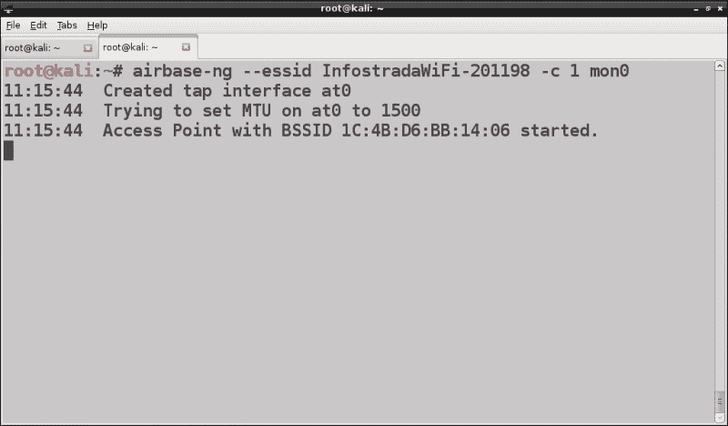
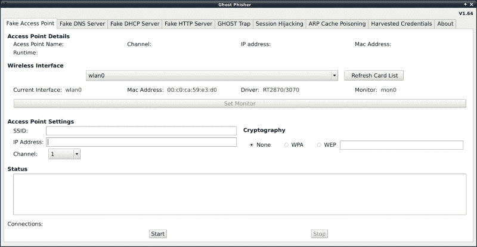
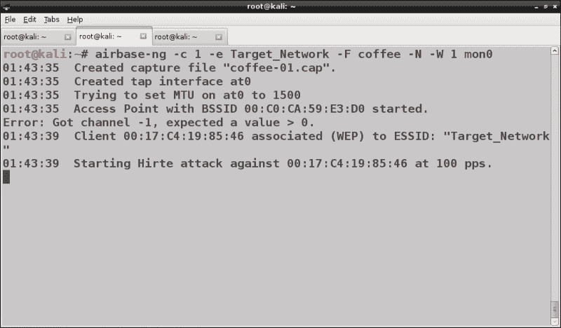
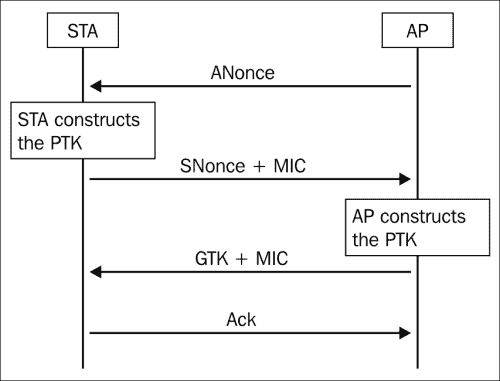

# 七、无线客户端攻击

到目前为止，我们已经介绍了针对 WEP 和 WPA/WPA2 协议、接入点和网络基础设施的攻击。在本章中，我们将处理针对客户端的攻击，无论客户端是否连接到 Wi-Fi 网络。本章将介绍以下主题：

*   蜜罐接入点和邪恶孪生攻击
*   中间人攻击
*   咖啡拿铁和黑铁攻击
*   在没有 AP 的情况下破解 WPA 密钥

# 蜜罐接入点和邪恶孪生攻击

在上一章中，我们已经看到了如何建立一个恶意接入点，它是本地有线网络的一部分。攻击者还可以设置一个对客户端来说似乎合法但未连接到本地网络的假 AP。这种 AP 被称为**蜜罐**AP，因为它能吸引客户与之联系。一个站在附近模仿真人的蜜罐 AP 可以用来进行所谓的**邪恶双胞胎**攻击。事实上，蜜罐 AP 欺骗真实 AP 的 SSID（以及最终的 MAC 地址），并在其发送的信标帧中对其进行宣传。无线客户端的操作系统通常跟踪客户端过去已连接的网络。客户机可以配置为在其范围内且信号足够强时自动连接到此类网络。因此，如果假 AP 比合法 AP 更接近客户端，因此其信号更强，则第一个*在后者的*上获胜，客户端连接到它。

客户端无法对 AP 进行身份验证，因为 802.11 管理帧没有加密签名。WEP 或 WPA-PSK 的使用用于对客户端进行身份验证，并在关联发生后对交换的数据进行加密，但不向客户端验证服务器。

即使是支持 WPA 企业的 AP 也可能容易受到这种攻击，因为客户端通常被配置为不检查身份验证服务器证书，正如我们在上一章中看到的那样。

此外，这些证书没有与网络 SSID 紧密绑定，攻击者可以设置其身份验证服务器并向客户端提供看似合法的证书。为此，攻击者可以注册一个类似于目标网络的域名，并从证书颁发机构处获得该域名的有效证书。

这种技术也被一种针对 WPA 企业网络的邪恶孪生攻击变体所使用，该攻击在研究论文中有描述，可在[中找到 http://seclab.ccs.neu.edu/static/publications/ndss2013wpa.pdf](http://seclab.ccs.neu.edu/static/publications/ndss2013wpa.pdf) 。

### 注

**多点攻击**

邪恶双生攻击的另一个有趣的变种是所谓的多点攻击，由 K.N.Gopinath 在 2007 年的 Defcon 15 会议上提出，在该攻击中使用了多个蜜罐 AP。相关白皮书和演示文稿幻灯片（以及音频和视频）可在[上获得 https://www.defcon.org/html/links/dc-archives/dc-15-archive.html#Gopinath](https://www.defcon.org/html/links/dc-archives/dc-15-archive.html#Gopinath) 。

在下一小节中，我们将看到如何设置蜜罐 AP 并使用 aircrack ng 套件执行邪恶的双重攻击。

## 实践中的邪恶双生攻击

在创建蜜罐 AP 之前，我们假设已经执行了侦察阶段，并按照[第 3 章](3.html "Chapter 3. WLAN Reconnaissance")、*WLAN 侦察*中说明的方法识别了 AP 和连接的客户端。

选择要模拟的目标 AP 后，我们将使用相同的 SSID 设置蜜罐 AP，在新的终端模拟器窗口中运行 airbase ng：

```
airbase-ng --essid InfostradaWiFi-201198 -c 1 mon0

```

回想一下，`--essid`选项定义了 AP 的 SSID，`-c`选项定义了 AP 使用的信道。



在`airodump-ng`输出窗口中，我们可以看到我们的两个 AP，具有相同的 SSID：


我们可以根据所使用的加密类型（伪 AP 使用开放式身份验证）、信道和其他字段（如所传输的信标和数据包）以及信号功率级别（`Pwr`来区分。`Pwr`字段的负值越低，表示信号电平越高。蜜罐 AP 的信号电平应该高于真正的 AP，以吸引客户连接到它。

如果当前没有客户端连接到合法 AP，我们需要等待客户端连接到假 AP，同时相信连接到真实 AP。

如果客户端已经连接，我们可以使用`aireplay-ng`工具强制其从网络上取消身份验证：

```
aireplay-ng --deauth 0 -a 08:7A:4C:83:0C:E0 -c 00:17:C4:19:85:46 -- ignore-negative-one mon0

```

此命令还可用于对目标客户端进行 DoS 攻击：


如果有更多的客户端连接，我们可以发送广播反认证数据包来断开所有客户端与网络的连接：

```
aireplay-ng --deauth 0 -a 08:7A:4C:83:0C:E0 mon0

```


在下面的截图中，我们可以看到客户端已经重新连接，这次连接到蜜罐 AP，这意味着我们成功地进行了攻击：


在下一节中，我们将看到如何对连接到蜜罐 AP 的客户端执行中间人攻击。

# 中间人攻击

**中间人**（**MITM**）攻击是一种攻击，攻击者将自己插入两个通信方之间，通常（但不一定）是客户端和服务器，并透明地转发交换的消息，使双方相信他们在直接交谈。

在我们的例子中，MITM 攻击是一个蜜罐软件 AP，它诱使客户端连接到它，相信它是合法的。通过这种方式，客户端发送和接收的所有网络流量都会通过假 AP，攻击者可以嗅探和操纵它，检索密码和敏感信息，更改数据，并劫持会话。

例如，攻击者可以使用 tcpdump、Wireshark 和**TTERCAP**等网络嗅探器窃听和嗅探流量。TTERCAP 不仅是一个嗅探器，而且是一个用于发起 MITM 攻击的工具，该攻击提供 GUI 并支持多种网络协议。更多信息请参见[附录](9.html "Appendix A. References")、*参考文献*或手册页（`man ettercap`。

典型的 MITM 攻击通过 ARP 缓存中毒、DNS 欺骗和会话劫持进行。例如，通过 DNS 欺骗，攻击者可以将用户重定向到克隆网站，并欺骗用户输入其凭据。

此外，如果攻击者利用 OpenSSL（[中的 CVE-2014-0224 等漏洞，TLS 加密的会话也会受到攻击 https://cve.mitre.org/cgi-bin/cvename.cgi?name=CVE-2014-0224](https://cve.mitre.org/cgi-bin/cvename.cgi?name=CVE-2014-0224)）或向客户出示假证书，尽管客户浏览器显示警告，但该证书仍被接受。

为了让蜜罐 AP 充当无线客户端与有线网络和/或互联网之间的路由器，我们必须创建一个桥接接口并启用 IP 转发，按照[第 6 章](6.html "Chapter 6. Attacking Access Points and the Infrastructure")、*攻击接入点和基础设施*中描述的相同过程，建立一个恶意 AP。

Kali Linux 提供了很多工具来进行 MITM 攻击，如`arpspoof`、`dnsspoof`、`ettercap`、`burp suite`、`urlsnarf`、`driftnet`、`webmitm`等。

还有一个针对 MITM 攻击的一体化图形程序，已经包含在 Kali Linux 中，**Ghost phisher**。

## 幽灵钓鱼者

Ghost phisher 是一个 GUI 程序，用 Python 编写，提供各种功能来执行 MITM 攻击，包括设置蜜罐 AP 和假网络服务（HTTP、DNS 和 DHCP）、会话劫持、ARP 中毒和密码获取。

该程序易于且使用直观。要启动它，我们在终端中执行 ghost phisher 命令。程序窗口分为不同的选项卡，每个选项卡用于不同的功能，每个选项卡包括顶部的配置部分和底部的状态部分。

要执行 MITM 攻击，我们可以执行以下步骤：

1.  The first tab window is relative to the fake AP setup. In the **Wireless Interface** section, we can select the interface we want to use and then put it in monitor mode by clicking on the **Set Monitor** button below:

    

2.  In the **Access Point Settings**, we assign the SSID, a valid private IP address (for example, 192.168.0.1), the channel and the type of encryption to the honeypot AP.

    然后点击**开始**按钮，AP 正在运行，如**状态**窗格所示：

    

3.  We then start the fake DHCP server with a class C network IP assignment range (in our case, 192.168.0.2 to 192.168.0.254), setting the IP of the AP (`192.168.0.1`) as the gateway and the fake DNS server. Thus, when a client connects to the AP, it is assigned an IP address in this range.

    

4.  We set up a fake HTTP server, which we use to host a cloned page of a legitimate website on which the client intends to login, for example, to access his/her online bank account. In this case, we can specify the web page to display to the client when it visits a fictitious site `www.exampleonlinebank.com`:

    

5.  Then, it is the time of the fake DNS server that resolves the client's queries for this particular domain to the IP address of our AP.

    

6.  Clicking on the **Add** button, the IP address of the fake AP (`192.168.0.1`) is used to resolve the target domain `www.exampleonlinebank.com`. We could also add other target domains to be resolved to this IP address as well as to IP addresses of the attacker-controlled hosts.

    

7.  When the client connects to the preceding website, it is presented with a fake login page, that resembles the one on the legitimate site:

    

8.  The credentials entered by the user are grabbed by the fake HTTP server and displayed in the **Harvested Credentials** tab window, as we can see in the following screenshot:

    

获取的凭证存储在`/usr/share/ghost-phisher/Ghost-Phisher-Database`下的 SQLite 数据库中。

此攻击的另一个示例可能是为 real AP web administration panel 设置假身份验证页面，以便连接到假 AP 的网络管理员重定向到此页面并显示身份验证凭据。

值得强调的是，如果未经网络所有者的书面和明确许可，这些攻击以及本书中描述的所有攻击都是非法的！

# 咖啡拿铁攻击

在[第 4 章](4.html "Chapter 4. WEP Cracking")*WEP 破解*中，我们介绍了如何在客户端连接到 AP 时破解 WEP 密钥，注入 ARP 请求包并捕获生成的流量以收集一致数量的 IVs，然后发起统计攻击来破解密钥。

两位无线安全研究人员 Vivek Ramachandran 和 MD Sohail Ahmad 在 Toorcon 2007 会议上提出了一种称为**Caffe Latte**的新攻击，该攻击允许您从客户端检索 WEP 密钥，即使客户端未连接且远离网络。

之所以给这次袭击取这个名字，是因为作者证明，完成袭击所需的时间（几乎）与在咖啡馆或餐馆（这类袭击的两个经典地点）喝一杯咖啡一样短！

要执行攻击，我们必须诱导隔离客户端生成足够的加密 WEP 数据包。Windows 等操作系统缓存 WEP 共享密钥以及**首选网络列表**（**PNL**中的相关网络详细信息，以自动连接到此类网络。

客户端在其 PNL 中为网络发送探测请求。如果我们嗅探这些探测请求，我们可以确定网络的 SSID，并使用相同的 SSID 设置一个假 AP，将探测响应发送回客户端。客户端与该 AP 关联，即使后者不知道密钥，因为 WEP 协议不希望 AP 向客户端进行身份验证。

一旦客户机被关联，就可以通过 DHCP 静态或动态地为其分配 IP 地址。如果 DHCP 服务器不存在或响应失败，Windows 将为客户端分配 169.254.0.0/16 子网范围内的 IP 地址。客户端开始发送一些免费的 ARP 数据包，这些数据包显然是用 WEP 密钥加密的。要破解密钥，我们需要强制客户端连续发送这些数据包，直到我们收集到必要的数字（PTW 攻击大约 80000）。这样做的一种技术是反复对客户端进行身份验证，但这需要相当长的时间。

Caffe-Latte 攻击提供了一种更有效的解决方案，可以捕获这些免费的 ARP 数据包，并翻转适当的位来修改数据包中固定位置的发送方 MAC 和 IP 地址。

免费的 ARP 被转换成 ARP 请求，并持续发送回客户端。这是可能的，因为 WEP 数据包的完整性没有受到加密保护，攻击者可以相应地修改有效负载和 CRC 以创建仍然有效的加密数据包。

这样，客户端将响应这些 ARP 请求并快速生成流量，从而加快密钥破解过程。有关咖啡拿铁攻击的更多详细信息，请参阅[附录](9.html "Appendix A. References")、*参考文献*中提供的链接。

现在，我们已经了解了攻击的理论，我们可以看看如何通过 aircrack ng 套件，特别是 ng 空军基地实现攻击。

我们将接口置于监视模式，并运行`airodump-ng mon0`来检测不在范围内的网络的探测请求。我们可以在 airodump ng 输出的右下部分看到这些探针：


一旦识别出目标网络 SSID，我们使用以下命令设置一个具有相同 SSID 的假 AP：

```
airbase-ng -c 1 -e Target_Network -F coffee -L -W 1 mon0

```

这里，`-L`选项用于 Caffe Latte 攻击，`-W 1`允许我们在信标帧中指定 WEP 协议，`-F`将捕获的数据包写入指定文件。

当客户端连接到假 AP 并开始发送免费 ARP 时，airbase ng 启动咖啡拿铁攻击。


当我们收集到足够数量的数据包时，我们可以运行 aircrack ng 破解 WEP 密钥：

```
aircrack-ng -e Target_Network coffee-01.cap

```

开发了一种优化的咖啡拿铁攻击，即 Hirte 攻击。

# 赫特袭击

Hirte 攻击扩展了 Caffe-Latte 攻击，因为它还允许使用任何 IP 数据包，而不仅仅是从客户端接收的免费 ARP 数据包。

通过位翻转这些数据包，我们生成 ARP 请求发送回客户端，然后执行攻击。与 Caffe Latte 的另一个区别是 Hirte 还使用数据包碎片向客户端发送 ARP 请求。

有关此次攻击的更多技术详细信息，请访问 Aircrack ng Wiki，网址为[http://www.aircrack-ng.org/doku.php?id=hirte](http://www.aircrack-ng.org/doku.php?id=hirte) 。

实际上，发动 Hirte 攻击与发动 Caffe Latte 攻击几乎完全相同；唯一的区别是使用了针对该攻击的`-N`选项，而不是`-L`选项：

```
airbase-ng -c 1 -e Target_Network -F hirte -N -W 1 mon0

```



对于那些喜欢使用图形化、自动化工具的人，Caffe Latte 和 Hirte 攻击都可以使用 Fern WiFi Cracker 执行，我们已经在[第 4 章](4.html "Chapter 4. WEP Cracking")、*WEP 破解*中介绍过。

这些攻击代表了停止使用 WEP 协议并采用 WPA2 的另一个原因（如果需要），尽管后者可能会受到类似的攻击。

# 在没有 AP 的情况下破解 WPA 密钥

Caffe Latte 和 Hirte 攻击允许我们在没有目标 AP 的情况下破解 WEP 密钥，攻击断开连接的客户端。

在本节中，我们将看到，在这种情况下，也可以破解 WPA 密钥。

回想[第 5 章](5.html "Chapter 5. WPA/WPA2 Cracking")、*WPA/WPA2 破解*，要破解一个 WPA 密钥，我们必须捕获一个 WPA 四向握手来检索运行破解过程所需的所有参数：a-nonce、S-nonce、客户端、AP MAC 地址和**MIC**（**消息完整性检查**。

值得注意的是，没有必要完成四向握手，因为所有这些参数都在前两个数据包中交换，并且 AP 不需要知道预共享密钥，如下图所示：



因此，我们可以使用以下命令使用 WPA 协议和目标网络的相同 SSID 设置蜜罐 AP：

```
airbase-ng -c 1 -e Target_Network -F wpa -z 2 -W 1 mon0

```

这里，`-z`选项代表 WPA，值`2`代表 TKIP 加密。

如果我们想设置 WPA2-CCMP AP，命令如下：

```
airbase-ng -c 1 -e Target_Network -F wpa -Z 4 -W 1 mon0

```

事实上，`-Z`选项意味着 WPA2 和`4`CCMP 加密。

在收集握手参数后，我们按照[第 5 章](5.html "Chapter 5. WPA/WPA2 Cracking")*WPA/WPA2 破解*中描述的相同程序，使用 aircrack ng 破解钥匙。

显然，这种攻击提供了另一个破解 WPA 密钥的机会，因为它针对的是孤立的客户端，不需要捕获与 AP 的真正四方握手。

破解 WPA 密钥通常不像破解 WEP 密钥那么容易，但如果使用弱预共享密钥，则可能变得简单；因此，有必要使用一个强大的 WPA 密钥！

# 总结

在本章中，我们分析了最常见的针对无线客户端的攻击，介绍了如何设置一个模拟合法的蜜罐 AP 并诱导客户端连接到它（邪恶孪生攻击）。我们还介绍了针对已连接客户端的 MITM 攻击，以及当客户端与网络隔离时恢复 WPA 和 WEP 密钥的攻击（Caffe-Latte 和 Hirte 攻击）。

下一章将介绍报告阶段，该阶段将展示如何编写智能有效的渗透测试报告。