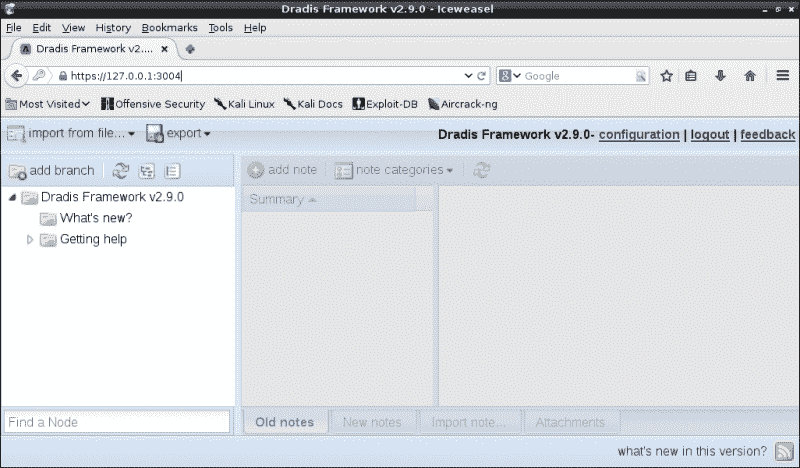

# 八、报告和结论

到目前为止，我们已经分析了无线渗透测试的规划、发现和攻击阶段。所有这些阶段对于取得准确可靠的结果同样重要，但需要在最后阶段即报告阶段完成。

在这一阶段，渗透测试产生的所有信息和发现将被收集并在提交给客户的报告中进行描述。

本章涵盖的主题如下：

*   报告写作的四个阶段
*   报告格式

在下一节中，我们将分析规划和撰写专业报告的过程。

# 报告写作的四个阶段

报告阶段的重要性往往被低估，被视为渗透测试中枯燥但必要的一部分。当然，发现和攻击阶段是核心和最激动人心的部分，正如渗透测试人员的技术技能应用于实践时一样。渗透测试人员可能非常熟练，可能会做得非常出色，但如果他们无法有效地向客户传达他们的成果，他们的工作（至少部分）是徒劳的。

撰写良好的报告是渗透测试人员的必备能力，几乎是一门艺术，而所有技能都可以通过实践来提高。

编写专业渗透测试报告的过程包括四个阶段：

*   报告规划
*   信息收集
*   撰写初稿
*   审查和定稿

## 报告策划

在第一个阶段，即报告规划阶段，我们定义了报告的目标、目标受众和内容，以及预计的撰写时间。定义目标意味着解释进行测试的原因以及从中获得的好处，帮助渗透测试人员和客户关注最重要的点。报告的目标受众通常由组织/公司的管理层和高管以及 IT 经理和员工组成，尤其是信息安全团队（如果存在于组织中）。根据受众类型，报告的布局和内容可分为两个主要部分：**执行摘要**和**技术报告**。我们将在后面的相关专门章节中介绍这两个方面。定义受众还意味着定义报告的分类和分发。一般来说，文档的分类确定了文档的保密级别，从而确定了允许阅读文档的人员。

分发是关于如何以安全的方式将其交付给合适的人。例如，如果我们必须通过电子邮件发送报告，建议使用公共加密工具（如 GnuPGP）在加密消息中发送报告。事实上，渗透测试报告包含关键信息，如果落入坏人之手，这些信息可用于攻击组织的网络和系统！

## 信息收集

在信息收集阶段，我们收集先前渗透测试阶段产生的所有结果和发现。

在渗透测试期间，必须记录和记录网络扫描和漏洞评估的结果、使用的工具和程序，并对实施的活动进行有意义的截图。

使用命令行工具时，最好将输出保存在文件中。例如，在发现阶段使用的 airodump ng 和 Kismet 都有以文本可读格式保存输出的选项，如 CSV 和 XML。

事实上，记录所有步骤也很重要，因为它们必须可由其他渗透测试人员重复，或者最终由客户 IT 人员自己重复。

## 文档工具

Kali Linux 中有一些工具可以帮助我们记录和记录渗透测试步骤。

一个是**KeepNote**，一个用 Python 编写的跨平台程序，它支持注释、富文本格式和文件附件的层次结构。以下是该程序的屏幕截图：

另一个有用的文档工具是**Dradis**，这是一个用于协作和信息共享的开源框架，专门用于安全评估。Dradis 是一个自包含的 web 应用程序，它提供了一个集中的信息存储库，在团队执行渗透测试时特别有用。

要执行 Dradis，请从应用程序菜单导航到**Kali Linux****报告工具****文档****Dradis**。

启动相关服务并打开连接到 URL`https://localhost:3004`的浏览器窗口，其中`3004`是 Dradis web 服务器正在侦听的默认端口。第一次运行程序时，需要设置我们将用于后续登录的密码：

当我们登录应用程序时，显示如下界面：

Dradis 还可以生成 HTML 和 Word 格式的简单报告，用于编写完整的报告。

对于更高级的报告功能，可以使用专业版本的 Dradis。

Linux 用户通常用于基于终端的工具，他们可能会发现使用 Vim 或 Emacs 之类的编辑器以及使用 Markdown 或 reStructuredText 之类的纯文本标记语言编写文档很舒服。这些标记语言提供了一种易于使用、干净且独立于格式的方法来生成可以轻松导出为不同格式的文档，例如 PDF 和 HTML。

## 撰写初稿

收集发现和攻击阶段的信息后，下一步是编写报告初稿。在此阶段，我们以结构化的方式组织所有收集的信息，并描述渗透测试期间执行的所有步骤。正如我们将在本章后面看到的那样，报告的编写应遵循一种格式。第一稿的撰写通常占所有报告撰写时间的 60%左右。

## 审核定稿

最后一个阶段，审查和定稿，是检查报告以纠正可能的错误和/或不准确，并专业地编辑报告以满足客户的要求和标准。

如果报告由单一渗透测试人员编写，建议同行评审；而如果它是由渗透测试团队编写的，则所有团队成员都应该对其进行审查。

# 报告格式

在本节中，我们将介绍用于生成专业渗透测试报告的典型格式。

在写报告之前，我们必须选择文件的外观；标题和文本、页边距、页眉和页脚内容等的字体和颜色。

报告通常以封面开始，封面包含报告名称和版本、日期、服务提供商和组织名称。服务提供商是渗透测试人员或渗透测试团队。在后一种情况下，最好包含所有团队成员的姓名。

在封面之后，如果报告长度超过几页，我们应该包括一个目录，列出报告的所有章节以及页码。

正如我们之前看到的，报告的内容可以分为两个主要部分：执行摘要和技术报告。

## 执行摘要

顾名思义，执行摘要是为客户组织的管理层/执行官编写的，面向的是非技术受众。

摘要应是渗透测试范围、目标和结果的高层次、简明概述，用清晰的语言表达，并应避免使用技术术语。

我们不需要提及所使用的工具和技术，但我们应该关注结果和状态，看看测试的网络是否安全；我们应该描述发现的问题如何影响信息的安全性，即机密性、完整性和可用性，以及应该采取什么措施来解决这些问题。

事实上，高管们对这些漏洞可能对他们的业务产生的影响更感兴趣，而不是了解他们的技术细节。

## 技术报告

技术报告将发送给 IT 经理和员工（通常是网络和系统管理员）以及信息安全经理和分析师（如果在组织中）。

技术报告一节通常首先描述进行测试所采用的方法，其中可能包括渗透测试人员拥有的认证、使用的软件类型（商业或开源）以及如何计算漏洞的风险评级。例如，评估漏洞严重性的自由开放标准是**通用漏洞评分系统**（**CVSS**）。

按照方法学部分，无线渗透测试报告通常包括检测到的网络和客户端的综合列表、按严重性分组的检测到的漏洞摘要，以及每个漏洞的详细描述。

此描述必须说明漏洞的来源、威胁级别和相关风险以及攻击者利用漏洞的可能性（概率）。描述用于发现它的工具和命令也很重要。

描述应以必须采取的补救措施结束。

在我们的案例中，最常见的漏洞可能是配置了开放式身份验证、WEP 或 WPA 弱密钥和启用 WPS、蜜罐和恶意访问点的无线网络。

建议按严重程度的降序显示漏洞，即首先暴露最关键的漏洞，以便更好地吸引客户对必须紧急解决的问题的注意。

在描述渗透测试的结果时，最好使用表格、图表和图表来呈现信息，以便更清晰、更直接地阅读。例如，如我们在[第 3 章](3.html "Chapter 3. WLAN Reconnaissance")、*WLAN 侦察*中所见，最好包含 Giskimet 生成的无线网络的图形地图。

技术报告可以以附录结尾，包括参考章节，作者引用外部来源（出版物、书籍、网站等），这可能有助于读者更好地理解报告的内容。

报告阶段并不总是随着报告的修订而结束，但也包括向客户展示和解释报告。事实上，即使是 IT 人员也可能不具备充分理解报告内容的技术技能、背景和/或专业知识，因此可能需要渗透测试人员进行一些解释。

在向管理人员演示报告时，使用幻灯片或动画演示可能非常有用，这些幻灯片或动画演示也可以通过基于云的软件（如 Prezi）实现。

在[附录](9.html "Appendix A. References")、*参考文献*中，有一些参考样本报告，其中一个特别涉及无线渗透测试（见参考文献 8.4）。

# 总结

在本章中，我们介绍了无线渗透测试的报告阶段，分析了从报告规划到审查和定稿的每个阶段，并描述了专业报告的典型格式。

本章还强调了有效地向客户传达渗透测试中所做工作的重要性，一份良好的书面报告当然是最好的方式！

# 结论

我们的无线渗透测试之旅已经结束。这是渗透测试的一个非常令人兴奋的分支，它正在迅速发展，并且在未来肯定会变得越来越重要，这要归功于无线网络的普及和移动设备的广泛增长。

学习和掌握 Kali Linux for wireless Perception testing 不仅为我们提供了一套非常好的工具，而且因为它们都是开源的，也让我们有机会深入了解它们的实现逻辑和执行的攻击。