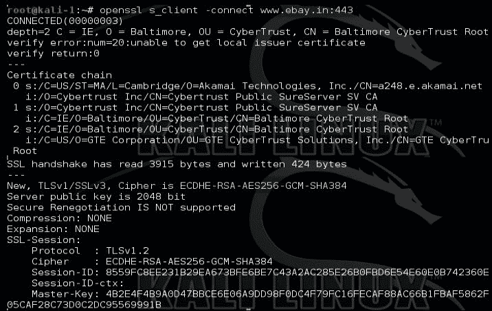
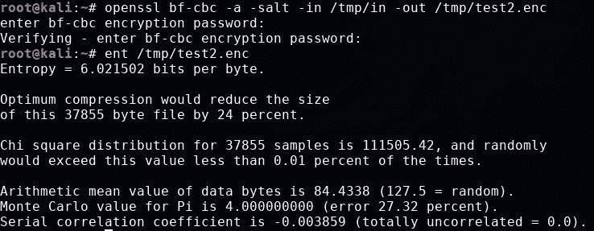
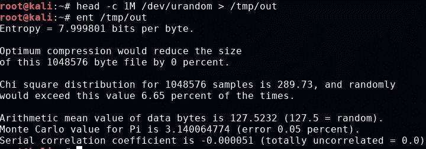
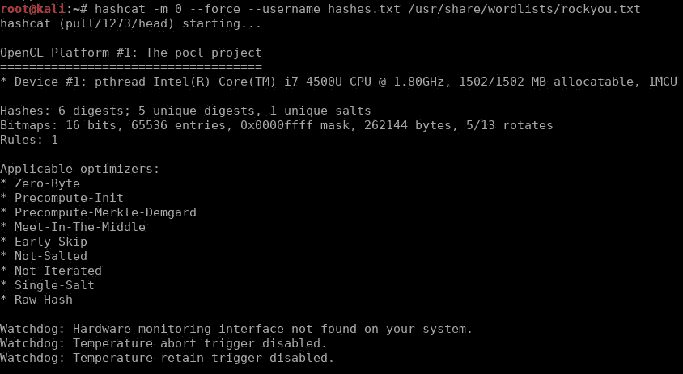

# 八、攻击加密实现中的缺陷

信息安全的主要目标之一是保护数据的机密性。在 web 应用中，目标是确保用户和应用之间交换的数据是安全的，并且对任何第三方都是隐藏的。当数据存储在服务器上时，还需要防止黑客攻击。**密码学**是通过保密文字或信息进行通信和解密的实践，用于保护数据的机密性和完整性。

目前的标准密码算法是由高度专业化的数学家和计算机科学家团队设计、测试和修正的。深入研究他们的工作超出了本书的范围；此外，试图发现这些算法中固有的漏洞并不是本书的目标。相反，我们将重点关注这些算法的某些实现，以及如何检测和利用实现失败，包括那些没有经过相同级别的设计和测试的自定义实现。

攻击者将试图找到不同的方法来破解加密层并公开明文数据。它们使用不同的技术，例如利用加密协议中的设计缺陷，或诱骗用户通过非加密通道发送数据，从而绕过加密本身。作为一名渗透测试人员，您需要了解这些技术，并能够识别缺少加密或有缺陷的实现，利用这些缺陷，并提出解决问题的建议。

在本章中，我们将分析密码学在 web 应用中的工作原理，并探讨在其实现中发现的一些最常见的问题。

# 密码学入门

首先，我们需要明确区分在谈论密码学时经常混淆的概念：加密、编码、模糊处理和散列：

*   **加密**：这是通过数学算法改变数据以使未经授权方无法理解的过程。授权方能够使用密钥将消息解密回明文。AES、DES、Blowfish 和 RSA 是众所周知的加密算法。
*   **编码**：这也会改变消息，但其主要目的是允许该消息由不同的系统处理。它不需要密钥，也不被认为是保护信息的适当方式。Base64 编码通常用于现代 web 应用中，以允许通过 HTTP 传输二进制数据。
*   **混淆**：通过转换消息，使原始消息更难阅读。JavaScript 代码混淆用于防止调试和/或保护知识产权，它最常用于 web 应用中。它不被认为是保护信息不受第三方影响的一种方式。
*   **散列**：散列函数是对固定长度的计算，一个表示消息内容的唯一数字。同一条消息必须始终产生相同的哈希值，并且没有两条消息可以共享哈希值。哈希函数在理论上是不可逆的，这意味着您无法从其哈希中恢复消息。由于此限制，它们可用作签名和完整性检查，但不用于存储需要在某个点恢复的信息。散列函数也广泛用于存储密码。常见的散列函数有 MD5、SHA1、SHA-512 和 bcrypt。

# 算法和模式

加密算法或密码是一种通过计算将明文转换成密文的算法。这些算法可大致分为以下两种不同的方式：

*   通过使用公钥和私钥或共享秘密，它们可以是**不对称**或**对称**
*   根据它们处理原始消息的方式，它们可以是**流**或**分组密码**

# 非对称加密与对称加密

**非对称加密**使用公私密钥的组合，比对称加密更安全。公钥与所有人共享，私钥单独存储。使用一个密钥加密的数据只能使用另一个密钥解密，这使得在更大范围内实现非常安全和高效。

**对称加密**另一方面，使用相同的密钥加密和解密数据，您需要找到一种安全的方法与另一方共享对称密钥。

一个经常被问到的问题是，为什么不使用公钥-私钥对来加密数据流，而是生成使用对称加密的会话密钥。公钥和私钥的组合是通过复杂的数学过程生成的，这是一项处理器密集且耗时的任务。因此，它仅用于对端点进行认证以及生成和保护会话密钥，然后在加密批量数据的对称加密中使用会话密钥。这两种加密技术的结合可以更快、更高效地加密数据。

以下是非对称加密算法的示例：

*   **Diffie-Hellman 密钥交换**：这是 1976 年开发的第一个非对称加密算法，在有限域中使用离散对数。它允许两个端点在不安全的介质上交换密钥，而无需事先了解对方。
*   **Rivest Shamir Adleman（RSA）**：这是应用最广泛的非对称算法。RSA 算法用于加密数据和签名，提供机密性和不可否认性。该算法使用一系列模块乘法来加密数据。
*   **椭圆曲线密码（ECC）**：这主要用于智能手机等手持设备，因为它的加密和解密过程需要较少的计算能力。ECC 功能类似于 RSA 功能。

# 对称加密算法

在**对称加密**中，使用共享密钥生成加密密钥。然后使用相同的密钥对数据进行加密和解密。这种加密数据的方法已经以各种形式使用了很多年。它提供了一种加密和解密数据的简单方法，因为密钥是相同的。对称加密很简单，也很容易实现，但它带来的挑战是以安全的方式与用户共享密钥。

对称算法的一些示例如下：

*   **数据加密标准（DES）**：该算法使用 DEA 密码。DEA 是一种使用 64 位密钥大小的分组密码；8 位用于错误检测，56 位用于实际密钥。考虑到当今计算机的计算能力，这种加密算法很容易被破解。
*   **三重 DES（3DES）**：该算法对每个块应用 DES 算法三次。它使用三个 56 位键。
*   **高级加密标准（AES）**：该标准于 1998 年首次发布，被认为比其他对称加密算法更安全。AES 使用 Rijndael 密码，该密码由两位比利时密码学家 Joan Daemen 和 Vincent Rijmen 开发。它取代了 DES 算法。它可以配置为使用最小大小为 128 位的可变密钥大小，最大大小为 256 位。
*   **Rivest Cipher 4（RC4）**：RC4 是一种广泛使用的流密码，其密钥大小为 40 到 2048 位。RC4 存在一些设计缺陷，使其容易受到攻击，尽管此类攻击可能无法实际执行，并且需要大量计算能力。RC4 已广泛应用于 SSL/TLS 协议中。然而，许多组织已经开始转向 AES 而不是 RC4。

# 流密码和分组密码

对称算法分为两大类：

*   **流密码：**该算法一次加密单个比特，因此需要更高的处理能力。它还需要大量的随机性，因为每个比特都要用唯一的密钥流进行加密。流密码更适合在硬件层实现，并用于加密流通信，如音频和视频，因为它可以快速加密和解密每一位。使用这种算法产生的密文与原始明文大小相同。
*   **分组密码：**采用该算法，将原始报文分为固定长度的分组，最后一个分组进行填充（扩展以满足所需长度）。然后根据所使用的模式独立处理每个块。我们将在后续章节中进一步讨论密码模式。分组密码产生的密文大小始终是块大小的倍数。

# 初始化向量

加密算法是*确定性*。这意味着相同的输入将始终产生相同的输出。这是一件好事，因为在解密时，您希望能够恢复加密的完全相同的消息。不幸的是，这使得加密更弱，因为它容易受到密码分析和已知文本攻击。

为了解决这个问题，实现了**初始化向量**（**IVs**。IV 是每次执行算法时都不同的额外信息。它通常通过异或操作来生成加密密钥或预处理明文。这样，如果两条消息使用相同的算法和相同的密钥加密，但使用不同的 IV，则生成的密文将不同。IVs 附加在密文上，因为接收者事先无法知道它们。

黄金法则，特别是对于流密码，是永远不要重复 IVs。无线网络中**有线等效隐私**（**WEP**）认证的 RC4 实现使用 24 位（3 字节）IV，允许在短时间内复制密钥流。通过使用相同的 IV 多次通过网络发送已知文本（如 DHCP 请求），攻击者可以恢复密钥流，并且可以使用多个密钥流/IV 对来恢复共享机密。

# 分组密码模式

**操作模式**是加密算法如何使用 IV 以及如何实现对每个明文块的加密。接下来，我们将讨论最常见的操作模式：

*   **电子码本（ECB）**：在这种操作模式下，不使用 IV，每个块都单独加密。因此，当包含相同信息的块产生相同的密文时，它们使分析和攻击更容易。
*   **密码块链接（CBC）**：在 CBC 模式下，按顺序对块进行加密；将 IV 应用于第一个块，每个块中产生的密文用作 IV 来加密下一个块。CBC 模式密码可能容易受到填充 oracle 攻击，如果攻击者可以恢复大量加密包，并且有办法知道包是否具有正确的填充（oracle），则可以使用对最后一个块的填充来恢复密钥流。
*   **计数器（CTR）**：如果正确实施，这可能是最方便、最安全的方法。块使用相同的 IV 加上每个块不同的计数器独立加密。这使得该模式能够并行处理消息的所有块，并且每个块具有不同的密文，即使明文相同。

# 散列函数

**散列函数**通常用于确保传输消息的完整性，并作为快速确定两条信息是否相同的标识符。哈希函数生成表示实际数据的固定长度值（哈希）。

散列函数适用于这些任务，因为根据定义，没有两条不同的信息具有相同的结果散列（冲突），并且原始信息不应该仅从散列中恢复（即，散列函数是不可逆的）。

一些最常见的哈希函数如下所示：

*   MD5（消息摘要 5）
*   SHA（安全哈希算法）版本 1 和 2
*   NT 和 NTLM，用于 Microsoft Windows 存储密码，基于 MD4

# 盐值

当用于存储密码等机密时，哈希容易受到字典和暴力攻击。捕获一组密码散列的攻击者在查找匹配项和发现明文密码时，可能会尝试使用已知常用密码的字典，对其进行散列，并将结果与捕获的散列进行比较。一旦找到散列密码对，使用相同密码的所有其他用户或帐户也将被发现，因为所有散列都是相同的。

**Salt 值**用于增加此任务的难度，方法是在要散列的信息中添加一个随机值，并导致使用不同的 Salt 对同一数据段进行散列，从而产生不同的散列。在我们之前假设的情况下，为一个散列恢复明文的攻击者不会自动恢复同一密码的所有其他实例。

与 IVs 一样，盐与散列一起存储和发送。

# SSL/TLS 上的安全通信

**安全套接字层**（**SSL**是一种加密协议，旨在保护网络上的通信安全。Netscape 在 1994 年开发了 SSL 协议。1999 年，**互联网工程任务组**（**IETF**发布了**传输层安全**（**TLS**协议），取代了 SSL 协议版本 3。SSL 现在被认为是不安全的，因为多年来发现了多个漏洞。POODLE 和 BEAST 漏洞暴露了 SSL 协议本身的缺陷，因此无法通过软件补丁修复，我们将在后面的章节中进一步讨论。IETF 宣布不推荐使用 SSL，并建议升级到 TLS 作为用于安全通信的协议。TLS 的最新版本是 1.2 版。我们始终建议您使用最新版本的 TLS，并避免使用旧版本或 SSL 协议从客户端进行连接。

大多数网站已经迁移到并开始使用 TLS 协议，但加密通信仍然通常被称为 SSL 连接。SSL/TLS 不仅提供机密性，而且有助于维护数据的完整性并实现不可否认性。

保护客户端和 web 应用之间的通信是 TLS/SSL 最常见的用途，它被称为“SSL 上的**HTTP**或**HTTPS**。TLS 还用于通过以下方式保护其他协议使用的通信信道：

*   邮件服务器使用它来加密两个邮件服务器之间以及客户端和邮件服务器之间的电子邮件
*   TLS 用于保护数据库服务器和 LDAP 认证服务器之间的通信
*   用于加密名为**SSL VPN**的**虚拟专用网**（**VPN**连接）
*   Windows 操作系统中的远程桌面服务使用 TLS 加密和验证连接到服务器的客户端

还有其他几个应用和实现，其中 TLS 用于保护双方之间的通信。在以下各节中，我们将 HTTPS 使用的协议称为 TLS，并将指定什么时候仅适用于 SSL 或 TLS。

# web 应用中的安全通信

TLS 使用公钥-私钥加密机制对数据进行加密，这有助于防止第三方监听通信。通过网络嗅探数据只会显示加密信息，如果不访问相应的密钥，加密信息就没有用处。

TLS 协议旨在保护 CIA 三合会机密性、完整性和可用性的三个方面：

*   **保密**：维护数据的隐私和保密性
*   **完整性**：维护数据的准确性和一致性，保证数据在传输过程中不被篡改
*   **可用性**：防止数据丢失，维护数据访问

Web 服务器管理员实施 TLS 以确保 Web 服务器和客户端之间共享的敏感用户信息是安全的。除了保护数据的机密性，TLS 还使用 TLS 证书和数字签名提供不可否认性。这就保证了信息确实是由声称发送信息的一方发送的。这类似于签名在我们日常生活中的工作方式。这些证书由称为**证书颁发机构**（**CA**的独立第三方签署、验证和颁发。以下列出了一些著名的证书颁发机构：

*   VeriSign
*   解冻
*   科摩多
*   迪吉塞特
*   委托
*   全球符号

如果攻击者试图伪造证书，浏览器将显示一条警告消息，通知用户正在使用无效证书加密数据。

数据完整性是通过使用散列算法计算消息摘要来实现的，散列算法附加到消息并在另一端进行验证。

# TLS 加密过程

加密是一个多步骤的过程，但它对最终用户来说是一种无缝体验。整个过程可以分为两部分：第一部分加密使用非对称加密技术，第二部分使用对称加密过程。下面介绍使用 SSL 加密和传输数据的主要步骤：

1.  客户端和服务器之间的握手是客户端显示 SSL/TLS 版本号及其支持的加密算法的初始步骤。
2.  服务器通过标识其支持的 SSL 版本和加密算法做出响应，并且双方就最高的共同价值达成一致。服务器还使用 SSL 证书进行响应。此证书包含服务器的公钥和有关服务器的常规信息。
3.  然后，客户端通过根据本地计算机上存储的根证书列表验证证书来验证服务器。客户端使用证书 CA 检查颁发给网站的签名证书是否存储在受信任的 CA 列表中。在 Internet Explorer 中，可以通过导航到工具| Internet 选项|内容|证书|受信任的根证书颁发机构来查看受信任的 CA 列表，如以下屏幕截图所示：


4.  使用握手期间共享的信息，客户端可以为会话生成预主密钥。然后，它用服务器的公钥加密该秘密，并将加密的预主密钥发送回服务器。
5.  服务器使用私钥解密预主密钥（因为它是用公钥加密的）。然后，服务器和客户端都使用一系列步骤从预主密钥生成会话密钥。此会话密钥在整个会话中加密数据，称为对称加密。散列也会被计算并附加到消息中，这有助于测试消息的完整性。

# 识别 SSL/TLS 的弱实现

正如您在上一节中了解到的，TLS 是各种加密算法的组合，打包为一个，以提供机密性、完整性和认证。在第一步中，当两个端点协商 SSL 连接时，它们标识它们支持的公共密码套件。这允许 SSL 支持各种各样的设备，这些设备可能没有硬件和软件来支持较新的密码。支持旧的加密算法有一个主要缺点。大多数较旧的密码套件很容易被密码分析员利用当今可用的计算能力在合理的时间内破解。

# OpenSSL 命令行工具

为了识别远程 web 服务器协商的密码套件，您可以使用 OpenSSL 命令行工具，该工具预装在所有主要 Linux 发行版上，并且也包含在 Kali Linux 中。该工具可以直接从 bashshell 测试 OpenSSL 库的各种功能，而无需编写任何代码。它还可用作故障排除工具。

OpenSSL 是 Linux 中用于实现 SSL 协议的著名库，**安全通道**（**Schannel**是 Windows 中 SSL 功能的提供者。

下面的示例使用`s_client`命令行选项，该选项使用 SSL/TLS 建立到远程服务器的连接。对于新手来说，该命令的输出很难解释，但它有助于识别服务器和客户端之间商定的 TLS/SSL 版本和密码套件：



OpenSSL 实用程序包含各种命令行选项，可用于使用特定的 SSL 版本和密码套件测试服务器。在以下示例中，我们尝试使用 TLS 版本 1.2 和弱算法 RC4 进行连接：

```
openssl s_client -tls1_2 -cipher 'ECDHE-RSA-AES256-SHA' -connect <target>:<port>  
```

下面的屏幕截图显示了命令的输出。由于客户端无法与`ECDHE-RSA-AES256-SHA`密码套件协商，握手失败，未选择密码：


在下面的屏幕截图中，我们试图与服务器协商弱加密算法。它失败了，因为谷歌正确地禁用了服务器上的弱密码套件：


要使用当前可用的计算能力找出容易破解的密码套件，请输入以下屏幕截图中显示的命令：


您经常会看到密码套件被写成**ECDHE-RSA-RC4-MD5**。格式分为以下几个部分：

*   **ECDHE**：这是一个密钥交换算法
*   **RSA**：这是一种认证算法
*   **RC4**：这是一种加密算法
*   **MD5**：这是一个哈希算法

有关 SSL 和 TLS 密码套件的全面列表，请参见[https://www.openssl.org/docs/apps/ciphers.html](https://www.openssl.org/docs/apps/ciphers.html) 。

# SSLScan

尽管 OpenSSL 命令行工具提供了许多选项来测试 SSL 配置，但该工具的输出对用户并不友好。该工具还需要对要测试的密码套件有相当多的了解。

Kali Linux 附带了许多工具，可以自动识别 SSL 错误配置、过时的协议版本以及弱密码套件和散列算法。其中一个工具是**SSLScan**，可以通过进入应用|信息收集| SSL 分析来访问该工具。

默认情况下，SSLScan 检查服务器是否易受犯罪和心脏出血漏洞的攻击。`-tls`选项将强制 SSLScan 仅使用 TLS 协议测试密码套件。输出以各种颜色分布，绿色表示密码套件是安全的，红色和黄色的部分试图吸引您的注意：


可以通过运行以下命令来识别客户端支持的密码套件。它将显示客户端支持的一长串密码：

```
sslscan -show-ciphers www.example.com:443  
```

如果要分析证书相关数据，请使用以下命令显示证书的详细信息：

```
sslscan --show-certificate --no-ciphersuites www.amazon.com:443  
```

命令的输出可以使用`-xml=<filename>`选项导出到 XML 文档中。

当支持的密码名称中指出`NULL`时，请注意。如果选择了`NULL`密码，SSL/TLS 握手将完成，浏览器将显示安全挂锁，但 HTTP 数据将以明文传输。

# 斯莱泽

Kali Linux 附带的另一个有趣的工具是 iSEC 合作伙伴发布的 SSLyze 工具，它有助于分析 SSL 配置。该工具位于 GitHub 上的[https://github.com/iSECPartners/sslyze](https://github.com/iSECPartners/sslyze) ，可以在 Kali Linux 的应用|信息收集| SSL 分析中找到。SSLyze 是用 Python 编写的。

该工具附带各种插件，有助于测试以下各项：

*   检查 SSL 的旧版本
*   分析密码组并识别弱密码
*   使用输入文件扫描多台服务器
*   正在检查会话恢复支持

使用`-regular`选项包括您可能感兴趣的所有常见选项，例如测试所有可用协议（SSL 版本 2 和 3 以及 TLS 1.0、1.1 和 1.2）、测试不安全的密码套件，以及确定是否启用了压缩。

在下面的示例中，服务器不支持压缩，并且容易受到 Heartbleed 的攻击。输出还列出了接受的密码套件：


# 使用 Nmap 测试 SSL 配置

Nmap 包含一个名为`ssl-enum-ciphers`的脚本，它可以识别服务器支持的密码套件，并根据其密码强度对其进行评级。它使用 SSLv3、TLS 1.1 和 TLS 1.2 进行多个连接。还有一些脚本可以识别已知的漏洞，如 Heartbleed 或 POODLE。

我们将针对目标运行 Nmap（bee box v1.6，[https://sourceforge.net/projects/bwapp/files/bee-box/](https://sourceforge.net/projects/bwapp/files/bee-box/) ）使用三个脚本：`ssl-enum-ciphers`，列出服务器允许的所有密码—`ssl-heartbleed`和`ssl-poodle`—以测试这些特定漏洞：


第一个屏幕截图显示了`ssl-enum-ciphers`的结果，显示了 SSLv3 允许的密码。在下一个屏幕截图中，`ssl-heartbleed`脚本显示服务器易受攻击：


此外，`ssl-poodle`脚本将服务器标识为易受贵宾犬攻击：


# 利用心血

心脏出血于 2014 年 4 月被发现。它包括 OpenSSL TLS 实现中的缓冲区过度读取情况；也就是说，可以从内存中读取比应该允许的更多的数据。这种情况允许攻击者以明文形式从 OpenSSL 服务器的内存中读取信息。这意味着不需要解密甚至拦截客户端和服务器之间的任何通信；您只需*询问*服务器内存中有什么，它就会用未加密的信息回答。

实际上，Heartbleed 可以通过任何支持 TLS 的未修补 OpenSSL 服务器（版本 1.0.1 至 1.0.1f 和 1.0.2-beta 至 1.0.2-beta1）进行攻击，通过攻击，它可以以明文形式从服务器内存读取高达 64 KB 的数据。这可以重复进行，并且不会在服务器上留下任何跟踪或日志。这意味着攻击者可以从服务器读取明文信息，例如服务器的私钥或加密证书、会话 cookie 或可能包含用户密码和其他敏感信息的 HTTPS 请求。更多关于心血的信息可以在其维基百科页面[上找到 https://en.wikipedia.org/wiki/Heartbleed](https://en.wikipedia.org/wiki/Heartbleed) 。

我们将使用 Metasploit 模块利用 bee box 中的 Heartbleed 漏洞进行攻击。首先，您需要打开 Metasploit 控制台并加载模块：

```
msfconsole
use auxiliary/scanner/ssl/openssl_heartbleed
```

使用`show options`命令，您可以看到模块运行所需的参数。

让我们设置要攻击的主机和端口并运行模块。请注意，通过在`RHOSTS`选项中输入以空格分隔的 IP 地址和主机名列表，此模块可以同时针对多台主机运行：

```
show options 
set RHOSTS 10.7.7.8 
set RPORT 8443 
run
```

以下执行的脚本显示服务器易受攻击：


然而，此处未提取相关信息。出了什么问题？

事实上，该模块从服务器的内存中提取了信息，但还有更多选项可供设置。您可以使用 Metasploit 的`show advanced`来显示模块的高级选项。要查看获得的信息，请将`VERBOSE`选项设置为`true`并再次运行：

```
set VERBOSE true
run
```

现在我们捕获了一些信息：


如果分析结果，您会发现，在本例中，服务器在内存中有一个密码更改请求，您可以看到以前和当前的密码以及用户的会话 cookie。

# 贵宾犬

**在降级的传统加密**（**贵宾犬**）上填充 Oracle，顾名思义，是一种填充 Oracle 攻击，滥用从 TLS 到 SSLv3 的降级过程。

填充 oracle 攻击需要 oracle 的存在，这意味着一种识别数据包填充是否正确的方法。这可以是服务器的一个*填充错误*响应。当攻击者更改有效消息的最后一个字节并且服务器以错误响应时，就会发生这种情况。当消息被更改并且没有导致错误时，该字节的值接受填充。与 IV 一起，这可以显示密钥流的一个字节，通过它，加密文本可以被解密。让我们记住，IVs 需要与包一起发送，以便收件人知道如何解密信息。这与盲目的 SQL 注入攻击非常相似。

要实现这一点，攻击者需要在客户机和服务器之间找到一个中间位置的人，并有一种机制使客户机发送恶意探测。最后一个要求可以通过让客户端打开一个包含执行该工作的 JavaScript 代码的页面来实现。

Kali Linux 不包括一个开箱即用的工具来利用 POODLE，但是有一个由 Thomas Patzke 在 GitHub 上提供的**概念证明**（**PoC**）来实现这一点：[https://github.com/thomaspatzke/POODLEAttack](https://github.com/thomaspatzke/POODLEAttack) 。读者可以将此 PoC 作为练习进行测试。

在 web 应用渗透测试的大部分时间里，您只需查看 SSLScan、SSLyze 或 Nmap 输出，就可以知道是否允许 SSLv3，这样服务器就容易受到 POODLE 攻击；此外，不需要更多的测试来证明这一事实，也不需要说服您的客户禁用已被取代近 20 年且最近宣布过时的协议。

尽管 POODLE 是 TLS 等加密协议的严重漏洞，但在现实场景中执行它的复杂性使得攻击者更有可能使用 SSL 剥离等技术（[https://www.blackhat.com/presentations/bh-dc-09/Marlinspike/BlackHat-DC-09-Marlinspike-Defeating-SSL.pdf](https://www.blackhat.com/presentations/bh-dc-09/Marlinspike/BlackHat-DC-09-Marlinspike-Defeating-SSL.pdf) ）强迫受害者浏览未加密的协议。

# 自定义加密协议

作为渗透测试人员，开发人员定制标准加密协议的实现或尝试创建自己的定制算法的应用并不少见。在这种情况下，您需要特别注意这些模块，因为它们可能包含一些缺陷，如果发布到生产环境中，这些缺陷可能会导致灾难性后果。

如前所述，加密算法是由专门从事密码学的信息安全专家和数学家通过多年的实验和测试创建的。对于单个开发人员或小型团队来说，设计一个加密功能强大的算法或改进经过密集测试的实现（如 OpenSSL 或已建立的编程语言加密库）是极不可能的。

# 识别加密和散列信息

遇到无法识别为明文的自定义加密实现或数据时，第一步是定义向其提交此类数据的过程。如果源代码易于访问，则此任务相当简单。在不可用的情况下，需要以多种方式分析数据。

# 散列算法

如果一个进程的结果总是相同的长度，而与提供的数据量无关，那么您可能面临一个哈希函数。要确定哪个函数，可以使用结果值的长度：

| **功能** | **长度** | **示例，哈希（“使用 Kali Linux 进行 Web 渗透测试”）** |
| MD5 | 16 字节 | `fbdcd5041c96ddbd82224270b57f11fc` |
| SHA-1 | 20 字节 | `e8dd62289bcff206905cf269c06692ef7c6938a0` |
| SHA-2（256） | 32 字节 | `dbb5195ef411019954650b6805bf66efc5fa5fef4f80a5f4afda702154ee07d3` |
| SHA-2（512） | 64 字节 | `6f0b5c34cbd9d66132b7d3a4484f1a9af02965904de38e3e3c4e66676d9``48f20bd0b5b3ebcac9fdbd2f89b76cfde5b0a0ad9c06bccbc662be420b877c080e8fe` |

请注意，前面的示例如何表示十六进制编码中的每个字节，使用两个十六进制数字表示每个字节的值（0-255）。为了澄清，MD5 散列中的 16 个字节是 fb-dc-d5-04-1c-96-dd-bd-82-22-42-70-b5-7f-11-fc。例如，第十一个字节（`42`是十进制值 66，即 ASCII 字母`B`。

此外，在 base64 编码中发现哈希也是很常见的。例如，上表中的 SHA-512 散列也可以如下所示：

```
bwtcNMvZ1mEyt9OkSE8amvApZZBN444+PE5mZ22UjyC9C1s+vKyf29L4m3bP3lsKCtnAa8y8ZivkILh3wIDo/g== 
```

Base64 是一种编码技术，用于仅使用一组可打印的 ASCII 字符表示二进制数据，其中 Base64 编码字节表示原始字节的 6 位，因此 3 个字节（24 位）可以在 Base64 中用 4 个 ASCII 可打印字节表示。

# 散列标识符

Kali Linux 包括一个名为`hash-identifier`的工具，它有一个很长的散列模式列表，对于确定所涉及的散列类型非常有用：


# 频率分析

判断一组数据是否加密、编码或模糊的一种非常有用的方法是分析数据中每个字符重复的频率。在明文信息中，例如一个字母，字母数字范围（32 到 126）中的 ASCII 字符的频率将比斜杠或不可打印字符的频率高得多，例如*转义*（27）或*删除*（127）键。

另一方面，一个加密文件对于 0 到 255 之间的每个字符的频率都非常相似。

这可以通过准备一组简单的文件进行比较来测试。让我们将一个纯文本文件与该文件的其他两个版本进行比较：一个是模糊的，另一个是加密的。首先创建一个纯文本文件。使用`dmesg`将内核消息发送到文件：

```
dmesg > /tmp/clear_text.txt  
```


您还可以应用一种称为**旋转**的模糊处理技术，该技术以循环方式围绕字母表将一个字母替换为另一个字母。我们将使用*ROT13*，旋转字母表中的 13 个位置（即`a`将变为`n`、`b`将变为`o`等等）。这可以通过编程或使用[等网站来实现 http://www.rot13.com/](http://www.rot13.com/) ：


接下来，使用带有 AES-256 算法和 CBC 模式的 OpenSSL 命令行实用程序加密明文文件：

```
openssl aes-256-cbc -a -salt -in /tmp/clear_text.txt -out /tmp/encrypted_text.txt  
```


如您所见，OpenSSL 的输出是 base64 编码的。在分析结果时，您需要考虑到这一点。

现在，如何对这些文件执行频率分析？我们将使用 Python 和 Matplotlib（[https://matplotlib.org/](https://matplotlib.org/) ）库，预先安装在 Kali Linux 中，以图形方式表示每个文件的字符频率。下面的脚本采用两个命令行参数，一个文件名和一个指示符，如果文件是 base64 编码的（`1`或`0`，则读取该文件，并在必要时对其进行解码。然后，它计算 ASCII 空间（0-255）中每个字符的重复次数，并绘制字符数：

```
import matplotlib.pyplot as plt 
import sys 
import base64 

if (len(sys.argv))<2: 
    print "Usage file_histogram.py <source_file> [1|0]" 

print "Reading " + sys.argv[1] + "... " 
s_file=open(sys.argv[1]) 

if sys.argv[2] == "1": 
    text=base64.b64decode(s_file.read()) 
else: 
    text=s_file.read() 

chars=[0]*256 
for line in text: 
    for c in line: 
        chars[ord(c)] = chars[ord(c)]+1 

s_file.close() 
p=plt.plot(chars) 
plt.show() 
```

当比较纯文本（左）和 ROT13（右）文件的频率时，您会发现没有大的区别，所有字符都集中在可打印范围内：


另一方面，当查看加密文件的绘图时，分布更加混乱：


# 熵分析

有助于将加密信息与明文或编码区分开来的一个明确特征是字符级数据中的随机性。**熵**是数据集随机性的统计度量。

在网络通信的情况下，文件是基于八位字节的使用来存储的，每个字符的最大熵级别是八。这意味着这些字节中的所有八位在样本中使用的次数相同。熵小于 6 可能表示样本未加密，但已模糊或编码，或者使用的加密算法可能容易受到密码分析的攻击。

在 Kali Linux 中，您可以使用`ent`计算文件的熵。它不是预安装的，但可以在`apt`存储库中找到：

```
apt-get update
apt-get install ent  
```

作为一个 PoC，让我们在一个明文样本上执行`ent`，例如，`dmesg`（内核消息缓冲区）的输出，它包含大量的文本，包括数字和符号：

```
dmesg > /tmp/in
ent /tmp/in
```


接下来，让我们加密相同的信息并计算熵。在本例中，我们将在 CBC 模式下使用河豚：

```
openssl bf-cbc -a -salt -in /tmp/in -out /tmp/test2.enc
ent /tmp/test
2.enc
```



熵增加了，但没有加密样本的熵高。这可能是因为样本有限（即，仅可打印 ASCII 字符）。让我们使用 Linux 内置的随机数生成器进行最后的测试：

```
head -c 1M /dev/urandom > /tmp/out
ent /tmp/out
```



理想情况下，强加密算法的熵值应该非常接近 8，这与随机数据无法区分。

# 识别加密算法

一旦我们完成了频率和熵分析，并且可以判断数据是加密的，我们就需要确定使用了哪种算法。一个简单的方法是比较一些加密消息的长度；考虑这些例子：

*   如果长度不能始终被 8 整除，那么您可能会面临一个流密码，其中最流行的是 RC4
*   AES 是一种分组密码，其输出长度始终可被 16 整除（128、192、256 等）
*   DES 也是一种分组密码；它的输出长度总是可以被 8 整除，但并不总是可以被 16 整除（因为它的密钥流是 56 位）

# 敏感数据存储和传输中的常见缺陷

作为渗透测试人员，在 web 应用中需要寻找的重要内容之一是它们如何存储和传输敏感信息。如果数据以明文传输或以这种方式存储，应用的所有者可能会面临严重的安全问题。

如果敏感信息（如密码或信用卡数据）以明文形式存储在数据库中，则利用 SQL 注入漏洞或通过任何其他方式访问服务器的攻击者将能够读取此类信息并直接从中获利。

有时，开发人员实施自己的模糊处理或加密机制，认为只有他们知道算法，没有有效密钥，其他人无法获得原始信息。尽管这可能会阻止偶尔的随机攻击者将该应用作为目标，但更专注的攻击者，或者能够从信息中获得足够利润的攻击者，会花时间理解算法并破坏它。

这些自定义加密算法通常涉及以下几种变体：

*   **异或**：在原始文本和其他一些文本之间执行按位异或操作，其作用类似于密钥，并重复足够多次以填充文本长度进行加密。这很容易破碎，如下所示：

```
      if text XOR key = ciphertext, then text XOR ciphertext = key 
```

*   **替换**：该算法涉及在所有文本中用一个字符替换另一个字符。这里，频率分析用于解密文本（例如，*e*是英语中最常见的字母，[https://en.wikipedia.org/wiki/Letter_frequency](https://en.wikipedia.org/wiki/Letter_frequency) ）或比较已知文本及其加密版本的频率以推断密钥。
*   **置乱**：这涉及到改变字符的位置。为了使信息能够恢复，需要以一致的方式进行。这意味着可以通过分析发现和逆转。

在应用中实现加密时的另一个常见错误是将加密密钥存储在不安全的位置，例如可以从 web 服务器的根目录或其他易于访问的位置下载的配置文件。加密密钥和密码通常在源文件中硬编码，甚至在客户端代码中也是如此。

今天的计算机比 10-20 年前的计算机功能强大得多。因此，根据现代 CPU 和 GPU，一些过去被认为加密能力强的算法可能在几小时或几天内被合理地破坏。发现使用 DES 加密的信息或使用 MD5 散列的密码并不少见，即使使用当前技术，这些算法可以在几分钟内破解。

最后，尽管最常见的缺陷（尤其是在加密存储中）可能是使用弱密码和密钥来保护信息。对近期泄密中发现的密码进行的分析告诉我们，使用最多的密码如下（参考[https://13639-presscdn-0-80-pagely.netdna-ssl.com/wp-content/uploads/2017/12/Top-100-Worst-Passwords-of-2017a.pdf](https://13639-presscdn-0-80-pagely.netdna-ssl.com/wp-content/uploads/2017/12/Top-100-Worst-Passwords-of-2017a.pdf) ：

1.  `123456`
2.  `password`
3.  `12345678`
4.  `qwerty`
5.  `12345`
6.  `123456789`
7.  `letmein`
8.  `1234567`
9.  `football`
10.  `iloveyou`
11.  `admin`
12.  `welcome`

# 使用离线破解工具

如果您能够从应用检索加密信息，则可能需要测试加密的强度以及密钥的有效性，以保护信息。为此，Kali Linux 包括两个最流行和最有效的离线破解工具：John the Ripper 和 Hashcat。

在[第 5 章](05.html#5SQFC0-d48f8b63a8cc440fbc92835fec01cc38)*检测和利用基于注入的缺陷*中，在*使用 SQL 注入提取数据*部分，我们提取了用户名和哈希列表。在这里，我们将使用开膛手 John（或者简单地说 John）和 Hashcat 来尝试检索与这些哈希对应的密码。

首先，以`username:hash`格式检索文件中的哈希和用户名，例如：

```
admin:5f4dcc3b5aa765d61d8327deb882cf99 
gordonb:e99a18c428cb38d5f260853678922e03 
1337:8d3533d75ae2c3966d7e0d4fcc69216b 
pablo:0d107d09f5bbe40cade3de5c71e9e9b7 
smithy:5f4dcc3b5aa765d61d8327deb882cf99 
user:ee11cbb19052e40b07aac0ca060c23ee 
```

# 用开膛手约翰

John the Ripper 预装在 Kali Linux 中，其使用非常简单。您只需键入`john`即可查看其基本用途：

```
john 
```


如果您仅使用命令和文件名作为参数，John 将尝试识别文件中使用的加密或哈希类型，尝试使用其默认字典进行字典攻击，然后进入暴力模式并尝试所有可能的字符组合。

让我们使用 Kali Linux 中包含的 RockYou 单词表进行字典攻击。在最新版本的 Kali Linux 中，这个列表是使用 GZIP 压缩的；因此，您需要对其进行解压缩：

```
cd /usr/share/wordlists/
gunzip rockyou.txt.gz
```


现在，您可以运行 John 来破解收集的哈希：

```
cd ~
john hashes.txt --format=Raw-MD5 --wordlist=/usr/share/wordlists/rockyou.txt  
```


请注意 format 参数的用法。如前所述，John 可以尝试猜测散列的格式。我们已经知道 DVWA 中使用的哈希算法，可以利用这些知识使攻击更加精确。

# 使用 Hashcat

在最新版本中，Hashcat 将其两个变体（基于 CPU 和 GPU）合并为一个，这就是它在 Kali Linux 中的表现。如果您在虚拟机中使用 Kali Linux，就像我们在本书中使用的版本一样，您可能无法使用 GPU 破解的全部功能，它利用了图形卡的并行处理。但是，Hashcat 仍将在 CPU 模式下工作。

要使用 Hashcat 中的 RockYou 字典破解文件，请发出以下命令：

```
hashcat -m 0 --force --username hashes.txt /usr/share/wordlists/rockyou.txt  
```

****

此处使用的参数如下所示：

*   `-m 0`：`0`（零）是 MD5 哈希算法的标识符
*   `--force`：此选项强制 Hashcat 运行，即使找不到 GPU 设备，这对在虚拟机内运行 Hashcat 很有用
*   `--username`：这告诉 Hashcat 输入文件不仅包含哈希，还包含用户名；它需要`username:hash`格式
*   第一个文件名总是要破解的文件，下一个文件名是要使用的字典

几秒钟后，您将看到结果：


要查看支持的所有选项和算法，请使用以下命令：

```
hashcat --help    
```

# 防止加密实现中的缺陷

对于 HTTPS 通信，禁用所有不推荐的协议，例如任何版本的 SSL，甚至 TLS 1.0 和 1.1。对于应用的目标用户，需要考虑最后两个问题，因为较旧的浏览器或系统可能不完全支持 TLS 1.2。此外，必须考虑禁用弱加密算法（如 DES 和 MD5 哈希）和模式（如 ECB）。

此外，应用的响应必须包括 cookie 中的安全标志和**HTTP 严格传输安全**（**HSTS**头，以防止 SSL 条带攻击。

有关 TLS 配置的更多信息，请参见[https://www.owasp.org/index.php/Transport_Layer_Protection_Cheat_Sheet](https://www.owasp.org/index.php/Transport_Layer_Protection_Cheat_Sheet) 。

密码绝对不能以明文形式存储，而且不建议使用加密算法来保护密码。相反，应该使用单向的盐渍散列函数。PBKDF2、bcrypt 和 SHA-512 是推荐的替代品。不鼓励使用 MD5，因为现代 GPU 每秒可以计算数百万个 MD5 哈希，这使得使用高端计算机在几小时或几天内破解任何少于十个字符的密码成为可能。OWASP 在[上也有关于这个主题的有用的备忘单 https://www.owasp.org/index.php/Password_Storage_Cheat_Sheet](https://www.owasp.org/index.php/Password_Storage_Cheat_Sheet) 。

要存储需要恢复的敏感信息，例如支付信息，请使用强加密算法。AES-256、河豚和 Twofish 是很好的替代品。如果非对称加密（如 RSA）是一种选择，您应该更喜欢（[https://www.owasp.org/index.php/Cryptographic_Storage_Cheat_Sheet](https://www.owasp.org/index.php/Cryptographic_Storage_Cheat_Sheet) ）。

避免使用自定义实现或创建自定义算法。依靠已经使用、测试和多次攻击的东西要好得多。

# 总结

在本章中，我们回顾了密码学的基本概念，如对称和非对称加密、流密码和分组密码、哈希、编码和模糊处理。您了解了 HTTPS 协议中安全通信的工作原理，以及如何识别其实现和配置中的漏洞。然后，我们检查了在敏感信息存储和自定义加密算法创建中发现的常见缺陷。

在本章结束时，我们对如何防止此类缺陷以及如何使 web 应用在传输和存储敏感信息时更加安全进行了评论。

在下一章中，我们将学习 AJAX 和 HTML5，以及它们从安全和渗透测试角度带来的挑战和机遇，特别是在客户端代码方面。