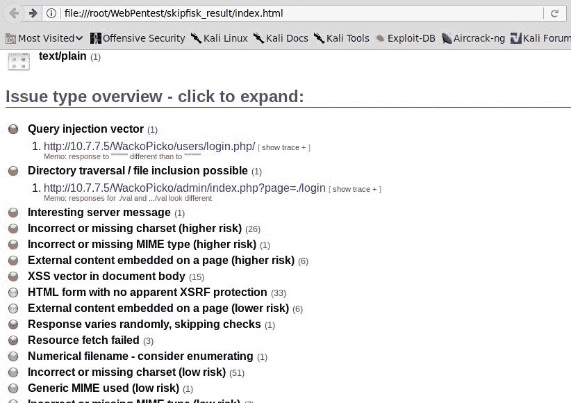
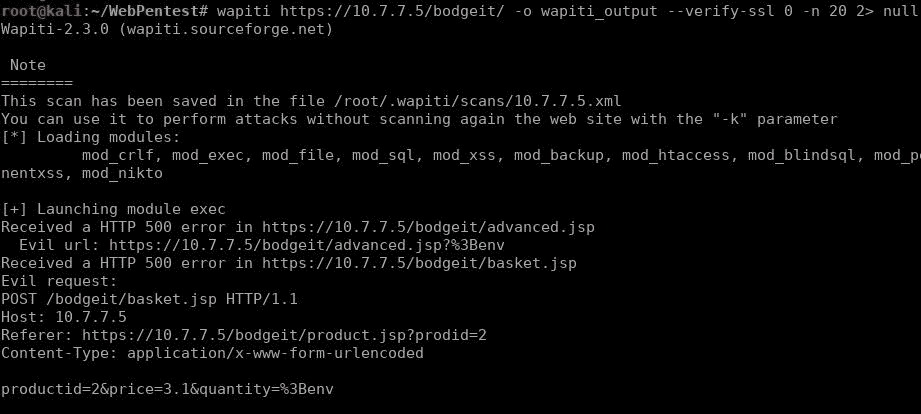
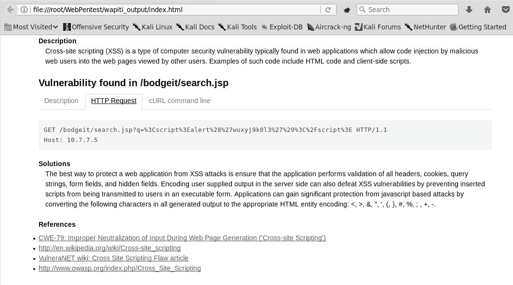
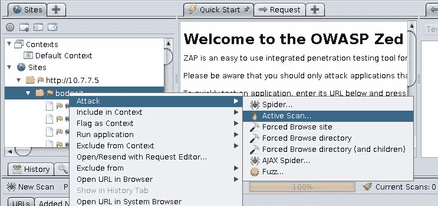
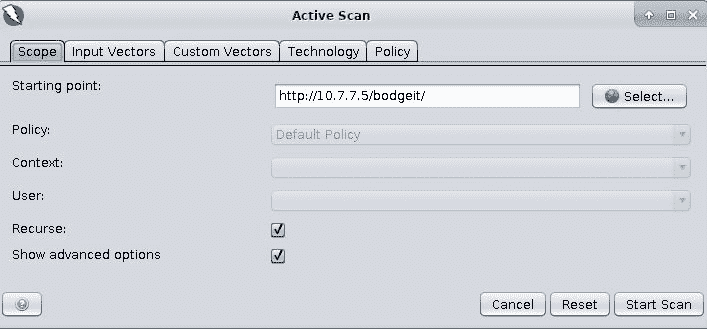
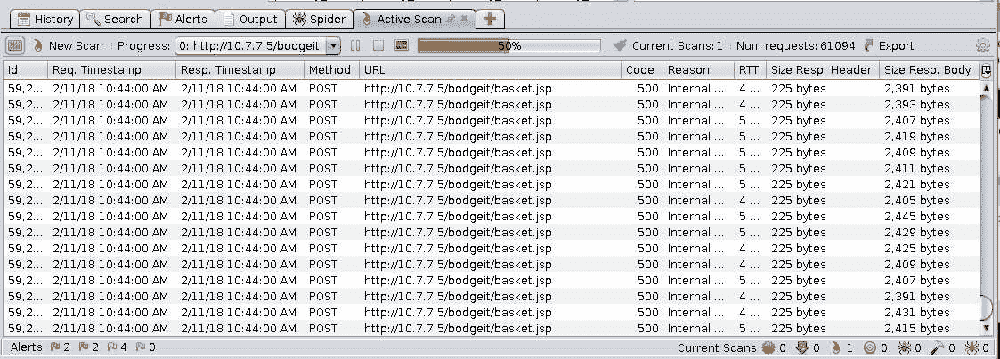
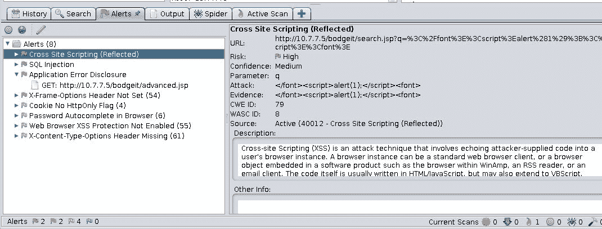
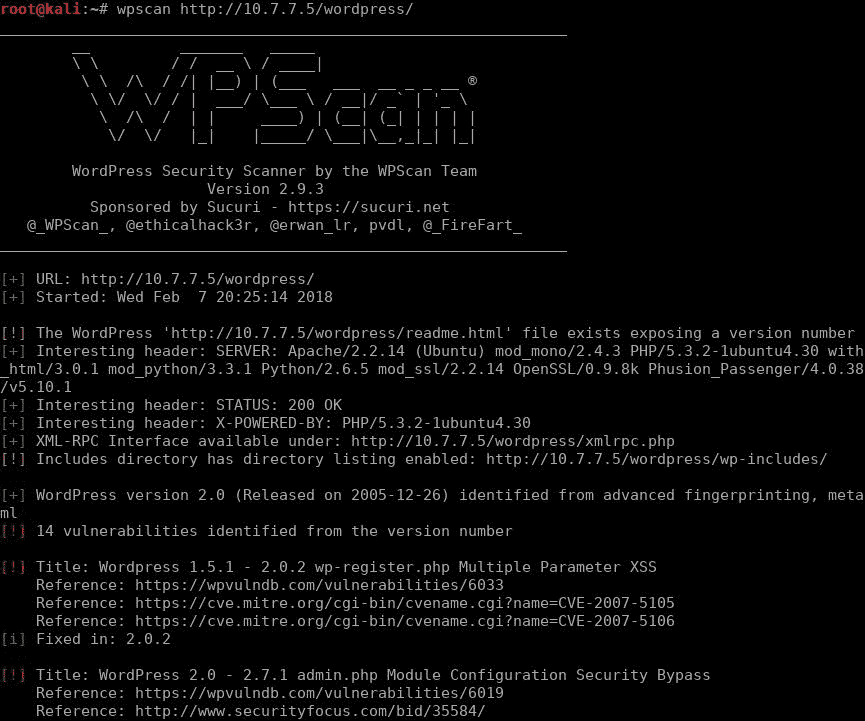
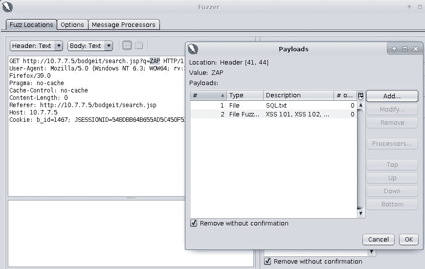

# 十一、在 Web 应用上使用自动扫描器

到目前为止，您已经了解了如何查找和利用 web 应用中的漏洞，主要是通过一次手动测试一个参数或一个请求。虽然这是发现安全缺陷的最佳方法，尤其是与应用内的信息流或业务逻辑和授权控制内的信息流相关的缺陷，但有时在专业渗透测试中，由于时间、范围或数量的原因，有些项目无法通过手动测试完全解决，这需要使用自动化工具来帮助加快发现漏洞的过程。

在本章中，我们将讨论在 Web 应用上使用自动漏洞扫描器时需要考虑的方面。您还将了解 Kali Linux 中包含的扫描器和模糊器以及如何使用它们。

# 使用自动扫描器前的注意事项

**Web 应用漏洞扫描器**的操作与其他类型的扫描器（如 OpenVAS 或 Nessus）略有不同。后者通常连接到主机上的端口，获取在这些端口上运行的服务的类型和版本，然后根据其漏洞数据库检查此信息。相反，web 应用扫描程序识别应用页面中的输入参数，并提交大量请求，探测每个参数上的不同有效负载。

以这种方式操作的结果是，自动扫描几乎肯定会在数据库中记录信息、生成活动日志、更改现有信息，如果应用具有删除或恢复功能，甚至可能会删除数据库。

以下是渗透测试人员在将 web 漏洞扫描器作为测试手段之前必须考虑的关键因素：

*   检查范围和项目文档，确保允许使用自动化工具。
*   在专门为此目的而设置的环境中执行测试（QA、开发或测试）。仅在客户明确要求下使用生产环境，并让他们知道存在损坏数据的固有风险。
*   更新该工具的插件和模块，使结果与最新漏洞披露和技术保持一致。
*   启动扫描前，检查扫描工具参数和范围。
*   将工具配置为最大日志记录级别。日志将被证明在发生任何事件以及验证调查结果和报告时非常有用。
*   请勿让扫描器无人看管。您不需要盯着进度条看，但应该经常检查扫描器的工作情况以及正在测试的服务器的状态。
*   不要依赖单一的工具，有时不同的工具在同一种测试中会得到不同的结果。当一个人遗漏了某些漏洞时，另一个人可能会发现它，但遗漏了其他一些漏洞。因此，如果您使用的是自动扫描器在测试范围内，使用不止一个，也考虑使用商业产品，如 BIPP 套件专业或 ACUNETX。

# Kali Linux 中的 Web 应用漏洞扫描程序

Kali Linux 包括多个用于自动扫描 web 应用漏洞的工具。我们已经研究了其中一些漏洞，特别是那些关注特定漏洞的漏洞，如用于 SQL 注入的 sqlmap 或用于跨站点脚本（XSS）的 XSSer。

接下来，我们将介绍下面列出的一些更通用的 web 漏洞扫描器的基本用法：

*   尼克托人
*   雪橇鱼
*   马鹿
*   OWASP-ZAP

# 尼克托人

作为一款长期经典之作，**Nikto**可能是世界上使用最广泛、最知名的 web 漏洞扫描器。尽管其扫描操作不是很深入，其结果也有点一般（大体上与过时的软件版本、易受攻击组件的使用或通过分析响应头检测到的错误配置有关），Nikto 仍然是一个非常有用的工具，因为它有广泛的测试集，而且破坏东西的可能性很低。

Nikto 是一个命令行工具。在下面的屏幕截图中，`nikto`与我们要扫描的主机或 URL 的参数`-h`一起使用，`-o`指定输出文件。文件的扩展名决定了报告的格式。其他常用格式有`.csv`（用于逗号分隔的文件）和`.txt`（用于文本文件）：

有关与`nikto`一起使用的更多详细信息和其他选项，请使用`-H`选项运行它，以获得全面帮助。


现在让我们看看上一次扫描的报告是什么样子的：


根据这两个屏幕截图，您可以看到 Nikto 识别了服务器版本和响应标题中的一些问题。特别地，IP 地址揭示了缺少一些保护头，例如`X-Frame-Options`和`X-XSS-Protection`，并且会话 cookie 不包括`HttpOnly`标志。这意味着可以通过脚本代码检索它。

# 雪橇鱼

**Skipfish**是一种非常快速的扫描器，可以帮助识别以下漏洞：

*   跨站点脚本
*   SQL 注入
*   命令注入
*   XML/XPath 注入
*   目录遍历和文件包含
*   目录列表

根据其谷歌*代码*页面（[http://code.google.com/p/skipfish/](http://code.google.com/p/skipfish/) ：

Skipfish 是一种主动的 web 应用安全侦察工具。它通过执行递归爬网和基于词典的探测，为目标站点准备交互式站点地图。然后，使用大量活动（但希望是无中断的）安全检查的输出对生成的映射进行注释。该工具生成的最终报告旨在作为专业 Web 应用安全评估的基础。

Skipfish 的使用非常简单。您只需要提供要扫描的 URL 作为参数。或者，您可以添加输出文件并微调扫描。要在测试 VM 中的 WackoPicko 应用上运行 Skipfish 并生成 HTML 报告，请使用以下命令：

```
skipfish -o WebPentest/skipfish_result -I WackoPicko http://10.7.7.5/WackoPicko/  
```

`-o`选项表示要存储报告的目录。`-I`选项告诉 Skipfish 只扫描包含字符串`WackoPicko`的 URL，不包括 VM 中的其余应用。最后一个参数是要开始扫描的 URL。

启动命令时，会出现一个信息屏幕。您可以按任意键或等待 60 秒以开始扫描。扫描开始后，将显示以下状态屏幕：


扫描完成后，将显示如下摘要屏幕：


此外，扫描完成后，报告将在指定文件夹中准备就绪。以下屏幕截图显示了 Skipfish 报告的外观：



该报告显示了 Skipfish 识别的漏洞，其风险从高风险（红点）到低风险（橙点）依次排列。例如，Skipfish 在登录页面 QueryInjectionVector 中发现了一个 SQL 注入漏洞，被扫描程序评为高风险。它还发现了一个目录遍历或文件包含，以及一个可能被评为中等的 XSS 漏洞。

# 马鹿

**马鹿**是一款主动维护、基于命令行工具的 web 漏洞扫描器。马鹿版本 3.0 于 2018 年 1 月发布（[http://wapiti.sourceforge.net/](http://wapiti.sourceforge.net/) ；但是，Kali Linux 仍然包括以前的版本（2.3.0）。根据 Wapiti 网站，该工具包括用于检测以下漏洞的模块：

*   文件披露（本地和远程包括/要求，`fopen`、`readfile`…）

*   数据库注入（PHP/JSP/ASP SQL 注入和 XPath 注入）
*   XSS（跨站点脚本）注入（反射和永久）
*   命令执行检测（`eval()`、`system()`、`passtru()`…）
*   CRLF 注入（HTTP 响应拆分、会话固定…）
*   XXE（XML 外部实体）注入
*   使用已知的潜在危险文件（感谢 Nikto 数据库）
*   可绕过的弱`.htaccess`配置
*   存在提供敏感信息的备份文件（源代码泄漏）
*   Shellshock（又名 Bash bug）

要启动马鹿，您需要在命令行中发出`launch`命令，然后是要扫描的 URL 和选项。

在下面的屏幕截图中，Wapiti 在易受攻击的 VM 上的 HTTPS 站点上运行 BodgeIt，并在`wapiti_output`目录中生成报告（选项`-o`。您可以跳过 SSL 证书验证，因为测试 VM 具有自签名证书。马鹿会在没有扫描的情况下停止，所以使用`--verify-ssl 0`来绕过这种验证。同一请求发送的变体不应超过 50 个（T3 选项）。这样做是为了防止循环。最后，`2> null`用于防止标准错误输出使屏幕过满，因为扫描器会发出多个具有非预期值的请求，马鹿可能会非常冗长：

```
wapiti https://10.7.7.5/bodgeit/ -o wapiti_output --verify-ssl 0 -n 20 2>null 
```

然后，您将在屏幕上看到以下输出：



扫描需要一些时间。完成后，打开指定目录下的`index.html`文件查看结果。以下是马鹿如何报告漏洞的示例：



马皮蒂的报告非常详细，其中包括对每个发现的描述、用于触发潜在漏洞的请求、建议的解决方案，以及获取有关这些发现的更多信息的参考资料。在前面的屏幕截图中，您可以看到它在 BodgeIt 的搜索页面中找到了 XSS。

# OWASP-ZAP 扫描器

在 OWASP-ZAP 的许多功能中，有一个活动的漏洞扫描程序。在这种情况下，*active*表示扫描程序主动向服务器发送精心编制的请求，而不是被动扫描程序，被动扫描程序在正常浏览应用时仅分析 web 服务器通过代理发送的请求和响应。

要使用扫描器，您需要右键单击要扫描的站点或目录，然后选择攻击|活动扫描…：



活动扫描器不会在选定目标上执行任何爬行或爬行操作。因此，建议您在设置代理时手动浏览目标站点，或者在扫描目录或主机之前运行 spider。

在“活动扫描”对话框中，可以选择目标、是否希望扫描是递归的，如果启用高级选项，则可以选择扫描策略、攻击向量、目标技术和其他选项：



单击开始扫描后，活动扫描选项卡将获得焦点，扫描进度和请求日志将显示在其中：



扫描结果将记录在“警报”选项卡中：



此外，使用主菜单中的 Report，可以将结果导出为多种格式，如 HTML、XML、Markdown 或 JSON。以下屏幕截图显示了 HTML 报告的外观：


OWASP-ZAP 还按风险级别对扫描结果进行排序，其中包括对发现的问题、使用的有效负载、解决方案建议和参考的详细描述。

Burp Suite 在其专业版本中，也有一个活动扫描器，可以提供非常准确的结果和低误报率。

# 内容管理系统扫描器

**内容管理系统**（**CMSs**）如 WordPress、Joomla 或 Drupal 是用于创建网站的框架，几乎不需要或不需要编程。它们结合了第三方插件，以简化登录和会话管理、搜索等任务，甚至包括完整的购物车模块。

因此，CMS 不仅在其自身代码中，而且在其包含的插件中都容易受到攻击。后者不受一致的质量控制，通常由独立程序员在业余时间制作，根据自己的时间表发布更新和补丁。

因此，我们现在将介绍一些最流行的 CMS 漏洞扫描程序。

# WPScan

**WPScan**顾名思义，是一款专注于 WordPress CMS 的漏洞扫描器。它将识别 WordPress 和已安装插件的版本号，然后将它们与已知漏洞数据库进行匹配，以识别可能的安全风险。

以下屏幕截图显示了 WPScan 的基本用法，只需添加目标 URL 作为参数：



第一次运行时，您可能需要使用`--update`选项更新数据库。

# 乔姆斯坎

**JoomScan**是 Kali Linux 中包含的 Joomla 站点的漏洞扫描程序。要使用它，您只需添加`-u`选项，后跟站点的 URL，如下所示：

```
joomscan -u http://10.7.7.5/joomla  
```

JoomScan 首先通过检测 Joomla 版本和插件尝试对服务器进行指纹识别，如以下屏幕截图所示：


之后，JoomScan 将显示与检测到的配置或已安装插件相关的漏洞：


# CMSmap

**CMSmap**未包含在 Kali Linux 中，但可以通过其 Git 存储库轻松安装，如下所示：

```
git clone https://github.com/Dionach/CMSmap.git 
```

CMSmap 扫描 WordPress、Joomla 或 Drupal 站点中的漏洞。它能够自动检测站点使用的 CMS。它是一个命令行工具，您需要使用`-t`选项来指定目标站点。CMSmap 显示其发现的漏洞，前面是其确定的严重性等级指标：`[I]`表示信息性，`[L]`表示低，`[M]`表示中等，`[H]`表示高，如以下屏幕截图所示：


屏幕截图中使用的`--noedb`选项可防止 WordPress 在漏洞数据库（[中）中查找已识别漏洞的漏洞 https://www.exploit-db.com/](https://www.exploit-db.com/) ），因为我们的 Kali Linux 虚拟机没有连接到互联网。尝试连接到外部服务器将导致错误和延迟，无法获得结果。

# 模糊 web 应用

**模糊化**是一种测试机制，通过其常规输入向软件实现发送精心编制（或随机，取决于模糊化的类型）的数据。实现可以是 web 应用、胖客户端或在服务器上运行的进程。它是一种以自动化方式注入数据的黑盒测试技术。虽然模糊主要用于安全测试，但它也可以用于功能测试。

从前面的定义可以看出，模糊化与任何漏洞扫描都是一样的。是的，模糊是漏洞扫描过程的一部分，它还可以涉及对 web 应用的指纹和抓取以及对响应的分析，以确定是否存在漏洞。

有时，我们需要将模糊部分从扫描过程中取出并单独执行，以便由我们而不是扫描器来确定测试输入并分析测试结果。通过这种方式，我们可以更好地控制将哪些参数发送到服务器的测试值。

# 使用 OWASP-ZAP 模糊器

**OWASP-ZAP fuzzer**可以从站点地图、代理历史记录或请求面板运行，方法是右键单击要模糊的请求并选择攻击|模糊…，如以下屏幕截图所示：


完成此操作后，将出现“模糊化”对话框，您可以在其中选择插入点；也就是说，在请求中，您希望尝试不同的值以分析服务器的响应。在以下示例中，我们从 OWASP BWA vulnerable 虚拟机中选择 BodgeIt 搜索中的`q`参数值：



请注意，已经添加了两个有效负载列表。要做到这一点，请选择要模糊的文本，在本例中为`q`的值，然后单击添加。。。在右侧（在“模糊位置”选项卡中），将显示“有效载荷”对话框。然后点击添加。。。在该对话框中。您将从文件`/usr/share/wfuzz/wordlist/injections/SQL.txt`中获取第一个有效负载列表。

此文件包含有助于识别 SQL 注入漏洞的模糊字符串。在有效负载类型中选择文件，单击选择…，然后浏览到要加载的文件，如下面的屏幕截图所示。然后单击 Add 将该列表添加到 fuzzer：


接下来，使用第二个有效负载测试 XSS。这次您将使用文件模糊器作为类型。这是 OWASP-ZAP 开箱即用的模糊字符串集合。从这些模糊器中，从 JbroFuzz | XSS 中选择一些 XSS 列表：


可在 OWASP-ZAP 中使用的模糊字符串的其他选项如下：

*   **空/空**：此选项提交原值（无变化）
*   **Numberzz**：此选项生成一系列数字，允许您定义起始值、结束值和增量
*   **Regex**：此选项生成与给定正则表达式匹配的已定义数量的字符串
*   **脚本**：此选项允许您使用脚本（从工具|选项…|脚本加载）生成有效负载
*   **字符串**：此选项显示手动提供的字符串的简单列表

一旦选择了所有插入点及其相应的模糊输入，就可以通过单击“启动模糊器”启动模糊器。Fuzzer 选项卡将显示在底部面板中。

在下一个屏幕截图中，您可以看到模糊结果。“状态”列显示该工具所做的初步诊断，指出此类请求导致可利用漏洞的可能性。请注意示例中反映的单词。这意味着由 fuzzer 发送的字符串已由服务器作为响应的一部分返回。我们知道这是 XSS 的字符串指示符：


为了进一步探索从 Fuzzer 选项卡中显示的结果中发现可利用漏洞的可能性，您可以选择任何请求及其头和体。相应的响应将显示在中央面板的相关部分中。响应将突出显示*可疑*字符串。通过这种方式，您可以第一眼看出是否存在漏洞，以及该特定测试用例是否值得深入研究。如果是这种情况，您可以右键单击请求并选择“使用请求编辑器打开/重新发送”，以启动请求编辑器并操作和重新发送请求。

进一步调查可能导致攻击的请求的另一种方法是在浏览器中重播该请求，以便查看其行为以及服务器如何响应。为此，右键单击请求，选择“在浏览器中打开 URL”，然后选择首选浏览器。这将打开浏览器并使其提交所选请求：


# 打嗝入侵者

在前面的章节中，您已经将入侵者用于各种任务，并且您知道它的功能和灵活性。现在，我们将使用它模糊 BodgeIt 登录页面，查找 SQL 注入漏洞。您需要做的第一件事是从代理历史记录向入侵者发送有效的登录请求。这是通过右键单击请求并选择 Send to 入侵者来完成的。

进入入侵者后，您将清除所有插入点并在用户名值中添加一个，如以下屏幕截图所示：


下一步是设置有效载荷。要执行此操作，请转到“有效载荷”选项卡，单击“载荷…”。。。要加载文件，请转到`/usr/share/wfuzz/wordlist/injections/SQL.txt`：


接下来，为了更容易识别感兴趣的请求，您将添加一些匹配规则，以便在请求导致错误或包含感兴趣的单词时可以从攻击对话框中辨别。将以下术语添加到选项中的 Grep-Match 部分：

*   `error`：当您想知道输入何时触发错误时，添加此选项将非常有用，因为基本 SQL 注入在更改查询语法时会显示错误消息
*   `SQL`：如果错误消息不包含单词`error`，您想知道输入何时触发包含单词`SQL`的响应
*   `table`：当您希望读取包含表名的 SQL 详细错误消息时添加
*   `select`：如果有 SQL 语句泄露，则添加此项

前面的术语列表决不是响应匹配的最佳列表。它仅用于演示目的。在实际场景中，首先手动分析应用给出的实际响应，然后选择与该上下文和正在查找的漏洞相匹配的术语。以下屏幕截图显示了示例匹配列表的外观：


一旦配置了所有攻击参数，就可以开始攻击了。`error`不需要太多时间就能开始比赛。您可以看到`table`与每个响应都匹配，所以这不是一个好的选择。`SQL`和`select`没有匹配，至少在最初的回答中是这样。如果您选择已选中`error`的响应之一，您将看到消息系统错误。在页面顶部，当有效负载包含一个报价时，似乎会触发。

这可能是 SQL 注入的一个指标，值得进一步深入研究：


若要查看在任何 Burp Suite 组件的每个请求或响应中从浏览器执行此请求时的行为，可以右键单击并选择“在浏览器中请求”。您可以选择是要原始会话（发送请求的会话 cookies）还是当前会话（浏览器当前拥有的会话 cookies）：


当您从 Burp Suite 向浏览器发送请求时，您会得到一个以`http://burp/repeat/`开头的 URL，您需要将该 URL 复制并粘贴到要在其上重播请求的浏览器中。Burp Suite 不像 ZAP 那样启动浏览器：


下面的屏幕截图显示了示例中的请求如何显示在浏览器中。看起来肯定是系统错误。消息不应该存在，您应该更深入地查看该请求，并手动尝试变体以获得 SQL 注入：


# 扫描后动作

可悲的是，提供渗透测试服务的公司最终只进行漏洞扫描、定制和调整其报告，而没有手动测试阶段，也没有验证扫描器发现的所谓漏洞是否为实际漏洞，这种情况比应该的情况更为普遍。这不仅无法为客户提供任何价值，客户可以自行下载漏洞扫描程序并对其应用运行它，而且还损害了公司对安全服务和安全公司的看法，使那些提供优质服务的人更难以具有竞争力的价格在市场上定位这些服务。

在扫描器生成扫描报告后，您不能仅仅获取该报告并说您发现了*X*和*Y*漏洞。由于扫描器总是会产生误报（即，报告不存在的漏洞）和误报（如扫描器遗漏的漏洞），因此您还必须进行手动测试，以便能够发现并报告自动化工具未涵盖的漏洞，例如授权问题或业务逻辑绕过或滥用等，以便您可以验证扫描程序报告的所有发现都是实际的漏洞。

# 总结

在本章中，我们讨论了在 web 应用渗透测试中使用自动漏洞扫描程序、在测试生产环境时使用自动工具所带来的风险，以及在使用这些工具之前需要考虑的事项。

接下来，我们继续使用 Kali Linux 中包含的一些扫描器，如 Nikto、Skipfish、Wapiti 和 OWASP-ZAP。我们还讨论了用于内容管理系统的专用扫描器，如 WordPress、Joomla 和 Drupal。我们将模糊化作为一种独立于扫描的技术来讨论。我们使用 OWASP-ZAP fuzzer 和 Burp 入侵者在单个输入上测试多个输入。

最后，我们讨论了自动扫描或模糊处理完成后需要完成的一些任务。您需要验证扫描器的结果以消除所有误报，并且需要手动测试应用，因为存在自动扫描器无法发现的漏洞。

有了这一章，我们就到了书的结尾。渗透测试是一个永恒的研究领域。渗透测试人员需要跟上技术的步伐，尽管方法发生了变化，但您不应该忘记旧的方法，因为今天的组织在使用过时的框架的同时又与一流的技术共存，这种情况并不少见。

本书概述了 web 渗透测试、其方法和技术，以帮助您识别、利用和修复 web 应用中最常见的漏洞。你需要继续你的旅程，从不同的来源学习更多，研究，实践，然后再实践更多。此外，了解其他领域（如开发、网络和操作系统）也是有利的，因为它允许您将应用置于其环境的上下文中，并更好地评估其真正带来的风险。

除了本书中提到的有价值的应用和其他可用的类似应用外，还有公开的 bug 赏金程序，如 HackerOne（[https://www.hackerone.com/](https://www.hackerone.com/) 和 BugCrowd（[https://www.bugcrowd.com/](https://www.bugcrowd.com/) ，对于没有经验的测试人员来说，这是一个很好的方法，通过在所有者的授权下测试实际应用，并有机会因发现漏洞而获得报酬，从而获得经验。

我希望您，亲爱的读者，已经发现这本书对您的目的很有趣和有用，无论是为了学习 web 应用安全以改进您的开发过程，追求渗透测试职业，还是作为一名经验丰富的渗透测试人员，以提高您的技能和扩展您的测试武库。谢谢你读这本书。