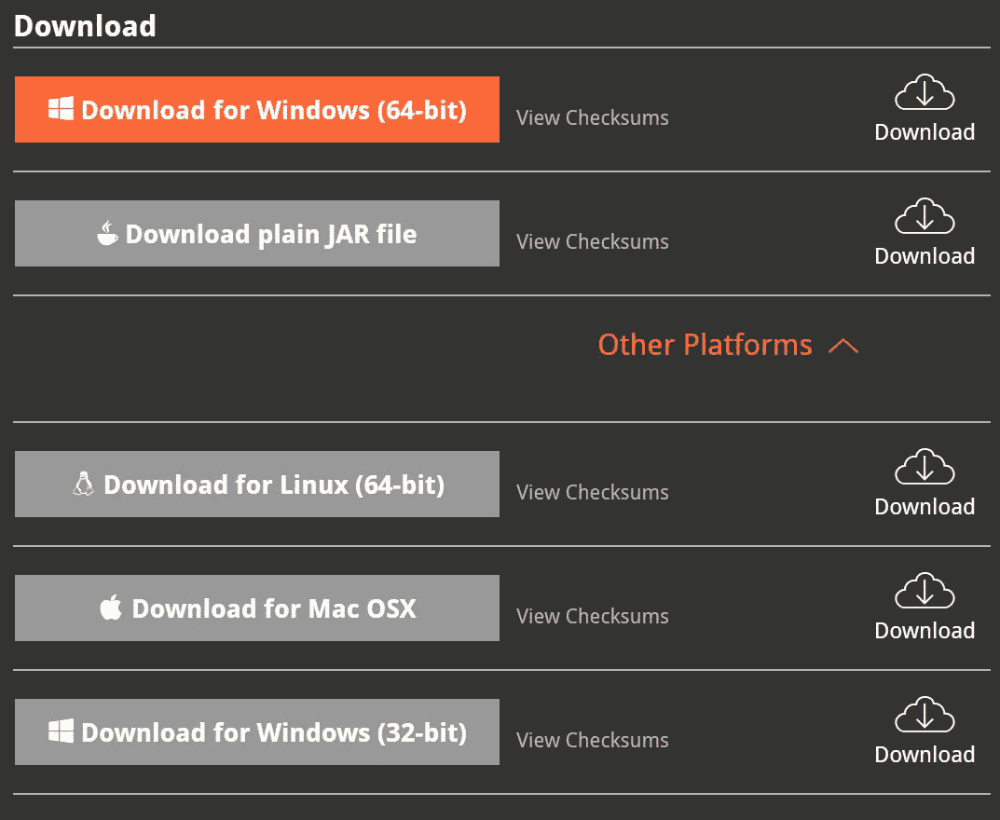
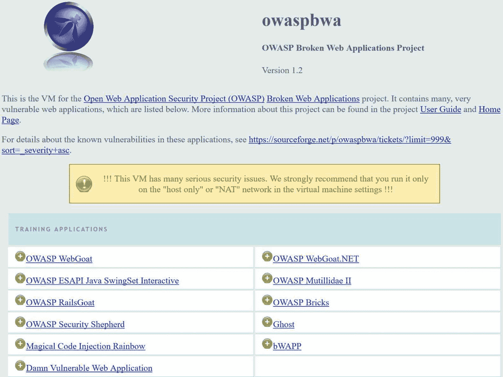
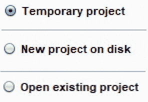
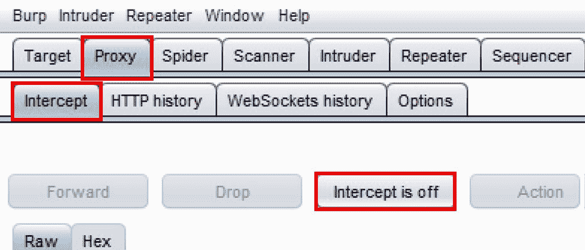
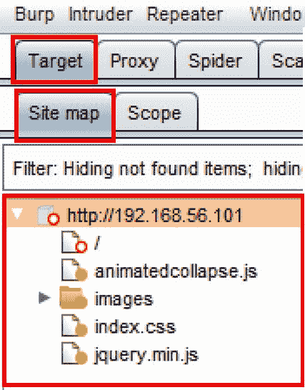

# 打嗝套件入门

在本章中，我们将介绍以下配方：

*   下载打嗝（社区、专业）
*   建立 web 应用程序测试实验室
*   在命令行或可执行文件上启动打嗝
*   使用 Burp 侦听 HTTP 流量

# 介绍

本章提供了继续阅读本书中材料所需的设置说明。从下载打嗝开始，详细信息包括可用的两个主要打嗝版本及其区别特征。

要使用 Burp 套件，渗透测试仪需要一个目标应用程序。本章包括下载和安装包含在**虚拟机**（**虚拟机**中的 OWASP 应用程序的说明。此类应用程序将在本书中作为目标易受攻击的 web 应用程序使用。

本章还包括配置 web 浏览器以使用**Burp 代理侦听器**。需要此侦听器来捕获 Burp 和目标 web 应用程序之间的 HTTP 流量。侦听器的默认设置包括一个**互联网协议**（**IP**）地址、`127.0.0.1`和端口号`8080`。

最后，本章总结了开始打嗝的选项。这包括如何在命令行开始打嗝，也包括可选的无头模式和使用可执行文件。

# 下载打嗝（社区、专业）

学习本书中包含的技术的第一步是下载 Burp 套件。此处提供下载页面（[https://portswigger.net/burp/](https://portswigger.net/burp/) ）。您需要决定从以下站点下载哪个版本的 Burp 套件：

*   职业的
*   社区
*   企业（不包括在内）

现在被称为*社区*的东西曾经被标为*免费版*。你可能会在互联网上看到这两个词，但它们是同一个词。在撰写本文时，专业版售价为 399 美元。

为了帮助您做出决定，让我们将两者进行比较。社区版提供了本书中使用的许多功能，但不是全部。例如，社区不包括任何扫描功能。此外，社区版本在使用入侵者功能时还包含一些强制的线程限制。社区版本中没有内置的有效负载，不过您可以加载自己的自定义有效负载。最后，一些需要专业人士的打嗝扩展显然在社区版中不起作用。

专业版启用了所有功能，包括被动和主动扫描仪。没有强制节流。**PortSwigger**（即编写和维护 Burp 套件的公司名称）提供了几个用于模糊和暴力强制的内置有效载荷。使用扫描仪相关 API 调用的 Burp 扩展在专业版本中也是可行的。

在本书中，我们将使用专业版，这意味着社区版中提供了许多功能。但是，当本书中的某个功能特定于专业版时，会有一个特殊的图标指示这一点。使用的图标如下所示：

# 准备

要一起开始我们的冒险，请访问[https://portswigger.net/burp](https://portswigger.net/burp) 下载您想要使用的打嗝套件版本。该页面提供了一个滑块，如下所示，该滑块突出显示了 Professional 和 Community 的功能，允许您进行比较：

许多读者可能会选择社区版，以便在购买之前熟悉产品。

如果您选择购买或试用专业版，您需要填写表格或付款，随后将向您发送电子邮件确认。创建帐户后，您可以登录并从我们帐户中提供的链接执行下载。

# 软件工具要求

要完成此配方，您需要以下内容：

*   Oracle Java（[https://www.java.com/en/download/](https://www.java.com/en/download/) ）
*   打嗝代理社区或专业人员（[https://portswigger.net/burp/](https://portswigger.net/burp/) ）
*   Firefox 浏览器（[https://www.mozilla.org/en-US/firefox/new/](https://www.mozilla.org/en-US/firefox/new/) ）

# 怎么做。。。

在决定了所需的版本之后，您有两个安装选项，包括可执行文件或普通 JAR 文件。可执行文件仅在 Windows 中可用，并提供 32 位或 64 位两种版本。普通 JAR 文件可用于 Windows、macOS 和 Linux。

Windows 可执行文件是自包含的，将在程序列表中创建图标。但是，普通 JAR 文件要求您的平台具有 Java（[https://www.java.com/en/download/](https://www.java.com/en/download/) ）预装。您可以选择 Java 的当前版本（JRE 或 JDK），因此可以自由选择最新版本：

# 建立 web 应用程序测试实验室

**已损坏的 Web 应用程序**（**BWA**是一个 OWASP 项目，它提供了一个独立的 VM，其中包含具有已知漏洞的各种应用程序。该虚拟机中的应用程序使学生能够了解 web 应用程序的安全性，练习和观察 web 攻击，并利用 Burp 等渗透工具。

为了遵循本书所示的方法，我们将使用 OWASP 的 BWAVM。撰写本文时，可从[下载 OWASP BWA VMhttps://sourceforge.net/projects/owaspbwa/files/](https://sourceforge.net/projects/owaspbwa/files/) 。

# 准备

我们将下载 OWASP BWA VM 以及支持工具，以创建我们的 web 应用程序 pentesting lab。

# 软件工具要求

要完成此配方，您需要以下内容：

*   Oracle VirtualBox（[https://www.virtualbox.org/wiki/Downloads](https://www.virtualbox.org/wiki/Downloads) ）
    *   选择特定于您的平台的可执行文件
*   Mozilla Firefox 浏览器**[https://www.mozilla.org/en-US/firefox/new/](https://www.mozilla.org/en-US/firefox/new/)**
***   7-Zip 文件归档器（[https://www.7-zip.org/download.html](https://www.7-zip.org/download.html) ）*   OWASP BWA VM（[https://sourceforge.net/projects/owaspbwa/files/](https://sourceforge.net/projects/owaspbwa/files/) ）*   打嗝代理社区或专业人员（[https://portswigger.net/burp/](https://portswigger.net/burp/) ）*   Oracle Java（[https://www.java.com/en/download/](https://www.java.com/en/download/) ）**

 **# 怎么做。。。

对于此配方，您需要下载 OWASP BWA VM，并通过执行以下步骤进行安装：

1.  单击前面提供的 OWASP BWA VM 链接下载最新版本，并解压缩文件`OWASP_Broken_Web_Apps_VM_1.2.7z`。
2.  您将看到几个文件的列表，如下所示：

3.  显示的所有文件扩展名都表示可以将 VM 导入 Oracle VirtualBox 或 VMware Player/工作站。为了在本书中设置 web 应用程序测试实验室，我们将使用 Oracle VirtualBox。
4.  记下`OWASP Broken Web Apps-cl1.vmdk`文件。打开 VirtualBox 管理器（即 Oracle VM VirtualBox 程序）。
5.  在 VirtualBox Manager 屏幕中，从顶部菜单中选择机器|新建**，然后键入机器名称`OWASP BWA`。**
***   将类型设置为 Linux，版本设置为 Ubuntu（64 位），然后单击下一步，如下所示：**

 **

7.  下一个屏幕允许您调整 RAM 或按建议离开。单击下一步。
8.  在下一个屏幕上，选择使用现有虚拟硬盘文件。
9.  使用右侧的文件夹图标从提取的列表中选择`OWASP Broken Web Apps-cl1.vmdk`文件，点击创建，如下所示：

10.  您的虚拟机现在已加载到 VirtualBox 管理器中。让我们做一些小的调整。突出显示**OWASP BWA**条目，并从顶部菜单中选择设置。
11.  在左侧窗格中选择网络部分，并更改为仅主机适配器。单击“确定”。

12.  现在让我们启动虚拟机。右键单击，然后选择开始|正常开始。

13.  等待 Linux 系统完全启动，这可能需要几分钟。引导过程完成后，您将看到以下屏幕。但是，显示的 IP 地址与您的计算机不同：

14.  此屏幕上显示的信息标识了可以访问 VM 上运行的易受攻击 web 应用程序的 URL。例如，在前面的屏幕截图中，URL 是`http://192.168.56.101/`。系统会提示您管理 VM，但此时无需登录。
15.  在主机系统上打开 Firefox 浏览器，而不是在 VM 中。在主机上使用 Firefox 浏览器，输入提供的 URL（例如，`http://192.168.56.101/`），其中 IP 地址特定于您的主机。

16.  在浏览器中，将显示一个索引页，其中包含指向易受攻击 web 应用程序的链接。本书将以这些应用程序为目标：

# 工作原理

利用由 OWASP 创建的定制虚拟机，我们可以快速建立一个 web 应用程序测试实验室，其中包含有目的的易受攻击应用程序，我们可以将其作为本书中练习的法律目标。

# 在命令行或作为可执行文件启动打嗝

对于非 Windows 用户或选择普通 JAR 文件选项的 Windows 用户，每次他们希望运行时，您都会在命令行上启动 Burp。因此，您将需要一个特定的 Java 命令来执行此操作。

在某些情况下，例如自动脚本编写，您可能希望在命令行中将 Burp 作为 shell 脚本中的行项目调用。此外，您可能希望在没有被称为**无头模式**的**图形用户界面**（**GUI**的情况下运行 Burp。本节介绍如何执行这些任务。

# 怎么做。。。

我们将回顾启动 Burp Suite 产品所需的命令和操作：

1.  从下载的`.exe`文件运行安装程序后，双击桌面上的图标或从程序列表中选择，在 Windows 中启动 Burp：

当使用普通 JAR 文件时，可执行文件`java`后面跟着选项`–jar`，后面跟着下载 JAR 文件的名称。

2.  使用普通 JAR 文件（必须首先安装 Java）在命令行（最小）启动 Burp：

如果希望对堆大小设置（即为程序分配的内存量）进行更多控制，可以修改`java`命令。

3.  `java`可执行文件后面跟着`–jar`，后面跟着内存分配。在这种情况下，为**读访问存储器**（**RAM**）分配 2GB（即`2g`），后跟 JAR 文件的名称。如果出现一个错误，导致无法分配那么多内存，只需将内存量降低到 1024MB（即`1024m`）。
4.  使用普通 JAR 文件在命令行（优化）启动 Burp（必须首先安装 Java）：

5.  可以在命令行启动打嗝，并在无头模式下运行。无头模式意味着在没有 GUI 的情况下运行 Burp。

在本书中，我们不会在 headless 模式下运行 Burp，因为我们是通过 GUI 学习的。但是，您将来可能需要这些信息，这就是为什么在这里提供这些信息的原因。

6.  在命令行启动 Burp，以无头模式运行普通 JAR 文件（必须首先安装 Java）：

注意参数`-Djava.awt.headless=true`紧跟在`-jar`选项之后，在 JAR 文件名之前的位置。

7.  如果成功，您应该看到以下内容：

按*Ctrl*+*C*或*Ctrl*+*Z*停止该过程。

8.  可以向 headless mode 命令提供配置文件，用于自定义代理侦听器所在的端口号和 IP 地址。

有关此主题的更多信息，请参阅 PortSwigger 的支持页面：[https://support.portswigger.net/customer/portal/questions/16805563-burp-command-line](https://support.portswigger.net/customer/portal/questions/16805563-burp-command-line) 。

9.  在描述的每个启动场景中，您都应该看到一个**启动屏幕**。启动屏幕标签将匹配您决定下载的任何版本，无论是专业版还是社区版。
10.  可能会提示您更新版本；如果你愿意，请随意这样做。Burp 中不断添加新功能以帮助您发现漏洞，因此升级应用程序是一个好主意。选择立即更新**，**如果适用。
11.  接下来，将显示一个对话框，询问项目文件和配置：

12.  如果您使用的是社区版，则只能创建临时项目。如果您使用的是 Professional edition，请在磁盘上创建一个新项目，并将其保存在适当的位置以供查找。单击下一步。

13.  随后的启动屏幕询问您要使用的配置。在这一点上，我们还没有，所以选择使用打嗝默认值。在阅读本书的过程中，您可能希望保存配置设置并在将来从此初始屏幕加载它们，如下所示：

14.  最后，我们准备单击开始打嗝。

# 它是如何工作的。。。

使用普通 JAR 文件或 Windows 可执行文件，您可以启动 Burp 来启动代理侦听器以捕获 HTTP 流量。Burp 提供临时或永久项目文件来保存在套件中执行的活动。

# 使用 Burp 侦听 HTTP 流量

Burp 被描述为拦截代理。这意味着 Burp 位于用户的 web 浏览器和应用程序的 web 服务器之间，拦截或捕获它们之间的所有流量。这种行为通常被称为**代理服务**。

渗透测试人员使用拦截代理来捕获 web 浏览器和 web 应用程序之间的流量，以便进行分析和操作。例如，测试人员可以暂停任何 HTTP 请求，从而允许在将请求发送到 web 服务器之前篡改参数。

拦截代理，例如 Burp，允许测试人员拦截 HTTP 请求和 HTTP 响应。这允许测试人员在不同条件下观察 web 应用程序的行为。而且，正如我们将看到的，有时候，这些行为与最初的开发人员所期望的完全不同。

要查看 Burp 套件的运行情况，我们需要配置 Firefox 浏览器的网络设置，以指向正在运行的 Burp 实例。这使 Burp 能够捕获在浏览器和目标 web 应用程序之间流动的所有 HTTP 流量。

# 准备

我们将配置 Firefox 浏览器，以允许 Burp 监听浏览器和 OWASP BWA VM 之间的所有 HTTP 流量。这将允许 Burp 中的代理服务捕获流量以进行测试。

有关说明，请访问 PortSwigger，网址为（[https://support.portswigger.net/customer/portal/articles/1783066-configuring-firefox-to-work-with-burp](https://support.portswigger.net/customer/portal/articles/1783066-configuring-firefox-to-work-with-burp) ），我们也将在下面的配方中逐步完成这个过程。

# 怎么做。。。

以下是使用 Burp 监听所有 HTTP 通信的步骤：

1.  打开 Firefox 浏览器并转到“选项”。
2.  在常规选项卡中，向下滚动到网络代理部分，然后单击设置。
3.  在连接设置中，选择手动代理配置，输入端口为`8080`的`127.0.0.1`IP 地址。选中“将此代理服务器用于所有协议”复选框：

4.  确保文本框的“无代理”为空，如以下屏幕截图所示，然后单击“确定”：

5.  在后台运行 OWASP BWA 虚拟机并使用 Firefox 浏览到特定于您的机器的 URL（即 VirtualBox 中 Linux 虚拟机上显示的 IP 地址）的情况下，单击重新加载按钮（圆圈中的箭头）以查看在 Burp 中捕获的流量。

6.  如果您没有看到任何流量，请检查代理拦截是否阻止了请求。如果按下了标记为 Intercept is on 的按钮，如以下屏幕截图所示，则再次单击该按钮以禁用拦截。进行此操作后，交通应自由流入 Burp，如下所示：

在以下情况下，代理|截取按钮被禁用：

7.  如果一切正常，您将在目标站点地图选项卡上看到与以下屏幕截图类似的流量。当然，您的 IP 地址会有所不同，您的站点地图中可能会显示更多的项目。祝贺你现在有打嗝听你所有的浏览器流量！

# 它是如何工作的。。。

Burp 代理服务正在`127.0.0.1`端口`8080`上侦听。这些设置中的任何一个都可以更改为侦听备用 IP 地址或端口号。但是，为了便于学习，我们将使用默认设置。****