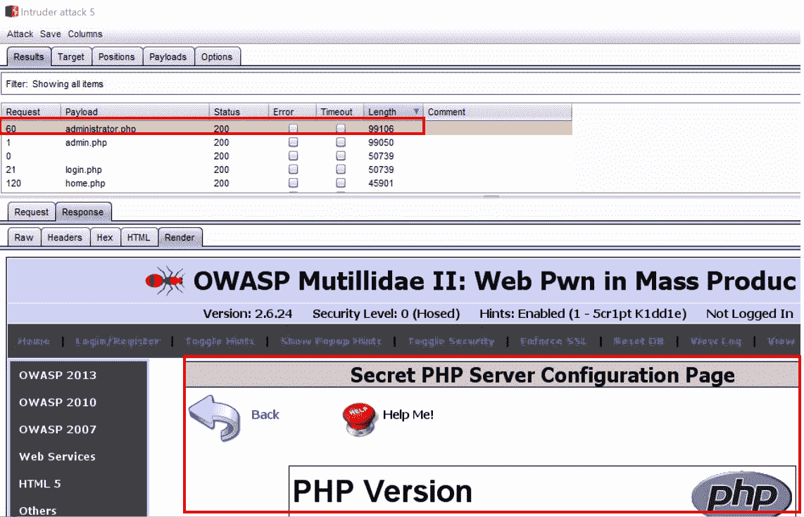
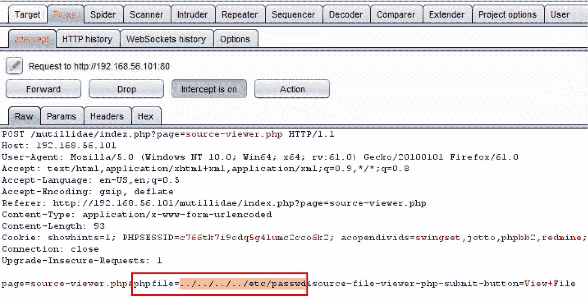

# 五、评估授权检查

在本章中，我们将介绍以下配方：

*   目录遍历测试
*   **本地文件测试包括**（**LFI**）
*   **远程文件测试包括**（**RFI**）
*   权限提升测试
*   测试不安全的直接对象引用

# 介绍

本章介绍授权的基础知识，包括应用程序如何使用角色确定用户功能的说明。Web 渗透测试涉及关键评估，以确定应用程序验证分配给给定角色的功能的效果如何，我们将学习如何使用 Burp 执行此类测试。

# 软件需求

要完成本章中的食谱，您需要以下内容：

*   OWASP 断开的 web 应用程序（VM）
    *   多天线链路
*   Burp代理社区或专业人员（[https://portswigger.net/burp/](https://portswigger.net/burp/) ）

*   Firefox 浏览器配置为允许 Burp 代理流量（[https://www.mozilla.org/en-US/firefox/new/](https://www.mozilla.org/en-US/firefox/new/) ）
*   来自 GitHub（[的`wfuzz`单词列表存储库 https://github.com/xmendez/wfuzz](https://github.com/xmendez/wfuzz)

# 目录遍历测试

目录遍历攻击是指试图发现或强制浏览未经授权的网页，这些网页通常是为应用程序管理员设计的。如果应用程序未正确配置 web 文档根目录，并且未对访问的每个页面进行正确的授权检查，则可能存在目录遍历漏洞。在特定情况下，这种弱点可能导致系统命令注入攻击或攻击者执行任意代码的能力。

# 准备

使用 OWASP Mutillidae II 作为我们的目标应用程序，让我们确定它是否包含任何目录遍历漏洞。

# 怎么做。。。

确保 Burp 和 OWASP BWA VM 正在运行，并且在用于查看 OWASP BWA 应用程序的 Firefox 浏览器中配置了 Burp。

1.  在 OWASP BWA 登录页中，单击指向 OWASP Mutillidae II 应用程序的链接。
2.  在 OWASP Mutillidae II 的登录屏幕上打开 Firefox 浏览器。在顶部菜单中，点击**登录**。
3.  在**代理****HTTP 历史记录**表中查找刚才执行的请求。寻找`login.php`页面的呼叫。突出显示该消息，将光标移动到**请求**选项卡的**原始**选项卡中，右键单击，然后单击**发送给入侵者**：

4.  切换到**入侵者****位置**选项卡，点击右侧**清除$**按钮，清除所有Burp定义的有效载荷标记。

5.  突出显示`page`参数（`login.php`中当前存储的值，并使用**添加§**按钮在其周围放置有效负载标记：

6.  继续进入**入侵者****有效载荷**选项卡，从`wfuzz`存储库中选择以下单词列表：`admin-panels.txt`**。**GitHub 存储库中单词列表的位置遵循以下文件夹结构：`wfuzz`/`wordlist`/`general`/`admin-panels.txt`。

7.  点击**入侵者****有效载荷****选项卡**有效载荷选项【简单列表】**部分的**加载**按钮，将显示一个弹出窗口，提示输入您的单词列表的位置。**
***   浏览到您从 GitHub 下载`wfuzz`存储库的位置。继续搜索`wfuzz`文件夹结构（`wfuzz`/`wordlist`/`general`/），直到找到`admin-panels.txt`文件，然后点击****打开**选择文件：****

 ****

9.  滚动到底部，取消选中（默认为选中）选项**URL 编码这些字符**：

10.  您现在已准备好开始攻击。点击**入侵者**|**位置**页面右上角**开始攻击**按钮：

将显示“攻击结果”表。允许攻击完成。`admin-panels.txt`单词列表中有 137 个有效负载。在**长度**列上按升序到降序排序，以查看哪个有效负载击中了网页。

11.  请注意具有较大响应长度的有效负载。这看起来很有希望！也许我们偶然发现一些管理页面可能包含指纹信息或未经授权的访问：

12.  选择列表中长度最大的第一页**administrator.php**。从攻击结果表中，查看**响应****呈现**选项卡，注意页面显示 PHP 版本和系统信息：

# 它是如何工作的。。。

甚至不用登录，我们就可以强制浏览到 web 应用程序中未映射的区域。术语*未映射*表示应用程序本身没有与此秘密配置页面的直接链接。然而，使用 Burp 入侵者和包含常见管理文件名的单词列表，我们能够使用目录遍历攻击发现页面。

# 测试本地文件包括（LFI）

Web 服务器通过配置设置控制对特权文件和资源的访问。特权文件包括只能由系统管理员访问的文件。例如，类 UNIX 平台上的`/etc/passwd`文件或 Windows 系统上的`boot.ini`文件。

**LFI**攻击是试图使用目录遍历攻击访问特权文件。LFI 攻击包括不同的类型，包括**点斜杠攻击**（**/**）、**目录暴力强制**、**目录****爬升**或**回溯**等。

# 准备

使用 OWASP Mutillidae II 作为我们的目标应用程序，让我们确定它是否包含任何 LFI 漏洞。

# 怎么做。。。

确保 Burp 和 OWASP BWA VM 正在运行，并且在用于查看 OWASP BWA 应用程序的 Firefox 浏览器中配置了 Burp。

1.  在 OWASP BWA 登录页中，单击指向 OWASP Mutillidae II 应用程序的链接。
2.  打开 Firefox 浏览器，进入 OWASP Mutillidae II 的登录屏幕。在顶部菜单中，点击**登录**。
3.  在**代理****HTTP 历史记录**表中查找刚才执行的请求。寻找`login.php`页面的呼叫。突出显示该消息，将光标移动到**请求**选项卡的**原始**选项卡中，右键单击，然后**发送给入侵者**。
4.  切换到**入侵者****位置**选项卡，点击右侧**清除§**按钮清除所有Burp定义的有效载荷标记。
5.  突出显示`page`参数（`login.php`中当前存储的值，并使用右侧的**添加§**按钮在其周围放置有效负载标记。

6.  继续进入**入侵者**|**有效载荷**选项卡。从`wfuzz`存储库中选择以下单词列表：`Traversal.txt`**。**GitHub 存储库中单词列表的位置遵循以下文件夹结构：`wfuzz`/`wordlist`/`injections`/`Traversal.txt`。

7.  点击**入侵者****有效载荷**选项卡**有效载荷选项【简单列表】**部分的**加载**按钮。将显示一个弹出窗口，提示输入单词列表的位置。
8.  浏览到您从 GitHub 下载`wfuzz`存储库的位置。继续搜索`wfuzz`文件夹结构，直到找到`admin-panels.txt`文件。选择文件，点击**打开**：

9.  滚动到底部，取消选中（默认为选中）选项**URL 编码这些字符**。
10.  您现在已准备好开始攻击。点击**入侵者**|**位置**页面右上角的**开始攻击**按钮。

11.  将显示“攻击结果”表。允许攻击完成。在**长度**列上从升序到降序排序，以查看哪个有效负载击中了网页。注意长度较大的有效载荷；也许我们未经授权访问了系统配置文件！

12.  在列表中选择请求#2。从攻击结果表中，查看**响应****呈现**选项卡，注意页面显示了来自系统的主机文件！

13.  继续向下滚动攻击结果表中的请求列表。查看请求 6，然后查看**响应****呈现**选项卡，注意页面显示了来自系统的`/etc/passwd`文件！

# 它是如何工作的。。。

由于文件权限保护不力，并且缺少应用程序授权检查，攻击者能够读取系统上包含敏感信息的特权本地文件。

# 测试远程文件包含（RFI）

**远程文件包含**（**RFI**是一种试图访问外部 URL 和远程文件的攻击。由于参数操纵和缺少服务器端检查，可能会发生攻击。这些疏忽允许参数更改将用户重定向到未经适当数据验证的白名单或消毒的位置。

# 准备

使用 OWASP Mutillidae II 作为我们的目标应用程序，让我们确定它是否包含任何 RFI 漏洞。

# 怎么做。。。

确保 Burp 和 OWASP BWA VM 正在运行，并且在用于查看 OWASP BWA 应用程序的 Firefox 浏览器中配置了 Burp。

1.  在 OWASP BWA 登录页中，单击指向 OWASP Mutillidae II 应用程序的链接。
2.  打开 Firefox 浏览器，进入 OWASP Mutillidae II 的登录屏幕。在顶部菜单中，点击**登录**。
3.  在**代理****HTTP 历史记录**表中查找刚才执行的请求。查找对`login.php`页面的调用：

4.  记下决定要加载页面的`page`参数：

让我们看看是否可以通过提供应用程序外部的 URL 来利用此参数。出于演示目的，我们将使用我们在 OWASP BWA VM 中控制的 URL。但是，在野外，此 URL 将由攻击者控制。

5.  切换到**代理****截取**选项卡，按下**截取在**按钮。
6.  返回 Firefox 浏览器，重新加载登录页面。请求被暂停并包含在**代理****拦截**选项卡中：

7.  现在，让我们将`page`参数的值从`login.php`处理为应用程序外部的 URL。让我们使用**GetBoo**应用程序的登录页面。您的 URL 将特定于您机器的 IP 地址，因此请进行相应调整。新的 URL 将是`http://<your_IP_address>/getboo/`
8.  将`login.php`值替换为`http://<your_IP_address>/getboo/`，点击**前进**按钮：

9.  现在再次按下**截取开启**按钮，将截取按钮切换至**关闭（截取关闭）**。
10.  返回 Firefox 浏览器，注意加载的页面是 Mutillidae 应用程序上下文中的**GetBoo**索引页面！

# 它是如何工作的。。。

`page`参数不包括适当的数据验证，以确保提供给它的值被列入白名单或包含在规定的可接受值列表中。通过利用这个弱点，我们能够为这个参数指定值，这是不允许的。

# 权限提升测试

应用程序中的开发人员代码必须包括对分配角色的授权检查，以确保授权用户无法将其角色提升到更高的权限。这种权限提升攻击是通过修改所分配角色的值并用另一个值替换该值而发生的。如果攻击成功，用户将获得对资源或功能的未经授权的访问权限，这些资源或功能通常仅限于管理员或更强大的帐户。

# 准备

使用 OWASP Mutillidae II 作为我们的目标应用程序，John，让我们以普通用户身份登录，并确定是否可以将角色升级到管理员。

# 怎么做。。。

确保 Burp 和 OWASP BWA VM 正在运行，并且在用于查看 OWASP BWA 应用程序的 Firefox 浏览器中配置了 Burp。

1.  在 OWASP BWA 登录页中，单击指向 OWASP Mutillidae II 应用程序的链接。
2.  打开 Firefox 浏览器，进入 OWASP Mutillidae II 的登录屏幕。在顶部菜单中，点击**登录**。
3.  在登录屏幕上，使用以下凭据登录：用户名：`john`和密码：`monkey`。

4.  切换到 Burp 的**代理**|**HTTP 历史记录**选项卡。通过`john`登录，找到您刚刚提出的`POST`及后续`GET`请求：

5.  查看清单中的`GET`请求；注意，**cookie:**行上显示的 cookie 名称/值对。

最感兴趣的名称/值对包括`username=john`和`uid=3`。如果我们试图将这些值操纵到另一个角色上呢？

6.  让我们尝试将存储在 cookie 中的参数`username`和`uid`操作为不同的角色。我们将使用 Burp 的**代理****拦截**来帮助我们执行此攻击。
7.  切换到**代理****截取**选项卡，按下**截取在**按钮。返回 Firefox 浏览器并重新加载登录页面。

8.  请求在**代理****拦截**选项卡中暂停。暂停时，将分配给用户名的值从`john`更改为`admin`。另外，将分配给`uid`的值从`3`更改为`1`*：*

9.  点击**前进**按钮，再次按下**截取开启**按钮，将截取按钮切换至**关闭（截取关闭）**。
10.  返回 Firefox 浏览器，注意我们现在以管理员身份登录！我们能够将我们的权限从普通用户升级为管理员，因为开发人员没有对分配的角色执行任何授权检查：

# 它是如何工作的。。。

有几个应用程序问题与此配方中显示的权限提升攻击相关。任何与帐户设置（即角色分配）相关的操作都只能由管理员允许。如果没有适当的检查，用户可以尝试升级其配置的角色。本配方中举例说明的另一个问题是顺序用户 ID 号（例如，`uid=3`）。由于这个数字很容易猜测，而且大多数应用程序都是从管理员帐户开始的，因此将数字从`3`更改为`1`似乎是与管理员帐户关联的可能猜测。

# 测试不安全的直接对象引用（IDOR）

允许基于用户提供的输入对系统上的文件或资源进行未经授权的直接访问被称为**不安全的直接对象引用**（**IDOR**。此漏洞允许绕过对此类文件或资源进行的授权检查。IDOR 是未经检查的用户提供的输入的结果，用于检索对象，而无需在应用程序代码中执行授权检查。

# 准备

使用 OWASP Mutillidae II 作为我们的目标应用程序，让我们操纵`phpfile`参数的值，以确定是否可以调用系统上的直接对象引用，例如`/etc/passwd`文件。

# 怎么做。。。

1.  从 Mutillidae 菜单中，选择**OWASP 2013****A4–不安全的直接对象引用****源查看器**：

2.  从**源代码查看器**页面，使用下拉框（`upload-file.php`中选择的默认文件，点击**查看文件**按钮，查看按钮下方显示的文件内容：

3.  切换到 Burp 的**代理**|**HTTP 历史记录**选项卡。查找您在查看`upload-file.php`文件时发出的`POST`请求。注意带要显示的文件值的`phpfile`参数。如果我们将此参数的值更改为其他值，会发生什么情况？

4.  让我们通过操纵提供给`phpfile`参数的值来执行 IDOR 攻击，以引用系统上的文件。例如，让我们尝试通过 Burp 的**代理****拦截**功能将`upload-file.php`值更改为`../../../../etc/passwd`。
5.  要执行此攻击，请执行以下步骤。
    1.  切换到**代理****截取**选项卡，按下**截取在**按钮。
    2.  返回 Firefox 浏览器并重新加载登录页面。请求被暂停并包含在**代理****拦截**选项卡中。

6.  点击**前进**按钮。现在再次按下**截取打开**按钮，将截取按钮切换至**关闭（截取关闭）**。

7.  返回 Firefox 浏览器。请注意，我们现在可以看到`/etc/passwd`文件的内容了！

# 它是如何工作的。。。

由于对应用程序代码中的`phpfile`参数缺乏适当的授权检查，我们可以查看系统上的特权文件。开发人员和系统管理员在泄露敏感文件和资源之前提供访问控制和检查。当缺少这些访问控制时，可能存在 IDOR 漏洞。****