# 评估业务逻辑

在本章中，我们将介绍以下配方：

*   测试业务逻辑数据验证
*   无限制文件上载–绕过弱验证
*   执行进程定时攻击
*   规避工作流的测试
*   上传恶意文件–多语言文字

# 介绍

本章介绍了**业务逻辑测试**的基础知识，包括对该领域中一些常见测试的解释。Web 渗透测试涉及对业务逻辑的关键评估，以确定应用程序的设计在多大程度上执行完整性检查，特别是在连续的应用程序功能步骤中，我们将学习如何使用 Burp 执行此类测试。

# 软件工具要求

要完成本章中的食谱，您需要以下内容：

*   OWASP 断开的 Web 应用程序（VM）
*   多天线链路
*   打嗝代理社区或专业人员（[https://portswigger.net/burp/](https://portswigger.net/burp/) ）

# 测试业务逻辑数据验证

业务逻辑数据验证错误是由于缺少服务器端检查而发生的，尤其是在购物车签出等一系列事件中。如果存在设计缺陷，例如线程问题，则这些缺陷可能允许攻击者在购买购物车之前修改或更改其内容或价格，以降低支付的价格。

# 准备

使用**OWASP WebGoat**应用程序和 Burp，我们将利用一个业务逻辑设计缺陷，以非常便宜的价格购买许多大票项目。

# 怎么做。。。

1.  确保**owaspbwa**虚拟机正在运行。从 VM 的初始登录页选择 OWASP WebGoat 应用程序。登录页将配置为特定于您的计算机的 IP 地址：


2.  单击 OWASP WebGoat 链接后，系统将提示您输入一些登录凭据。使用这些凭据：用户名：`guest`密码：`guest`。

3.  认证完成后，点击**启动 WebGoat**按钮，进入应用练习：

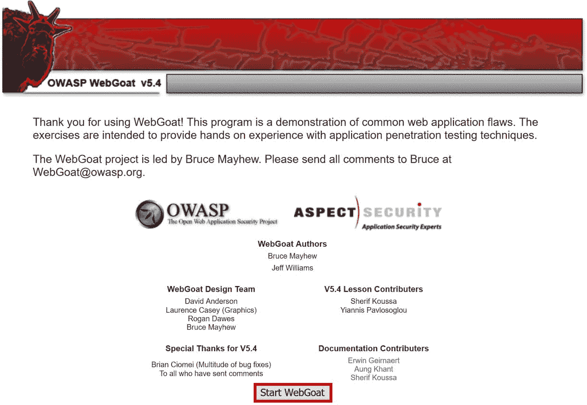

4.  点击左侧菜单中的**并发****购物车并发漏洞**：

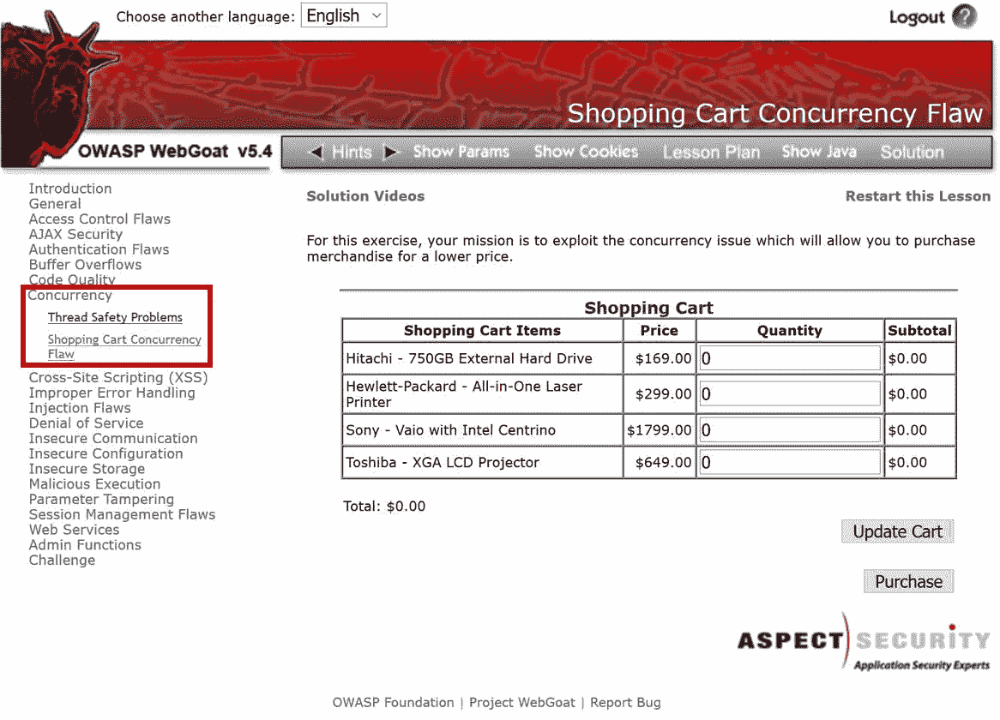

这个练习解释了购物车设计中的一个线程问题，它允许我们以更低的价格购买物品。让我们利用设计缺陷！

5.  将`1`添加到`Sony - Vaio with Intel Centrino`项的`Quantity`框中。单击“更新购物车”按钮：


6.  切换到 Burp Proxy | HTTP 历史记录选项卡。找到购物车请求，右键单击，然后单击发送到中继器：

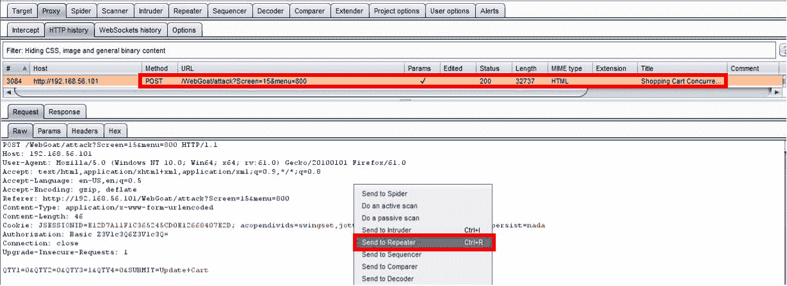

7.  在 Burp 的 Repeater 选项卡内，将`QTY3`参数从`1`更改为`10`：


8.  停留在 Burp Repeater 中，在请求窗格中，右键单击并选择当前浏览器会话中的浏览器**中的**请求：****

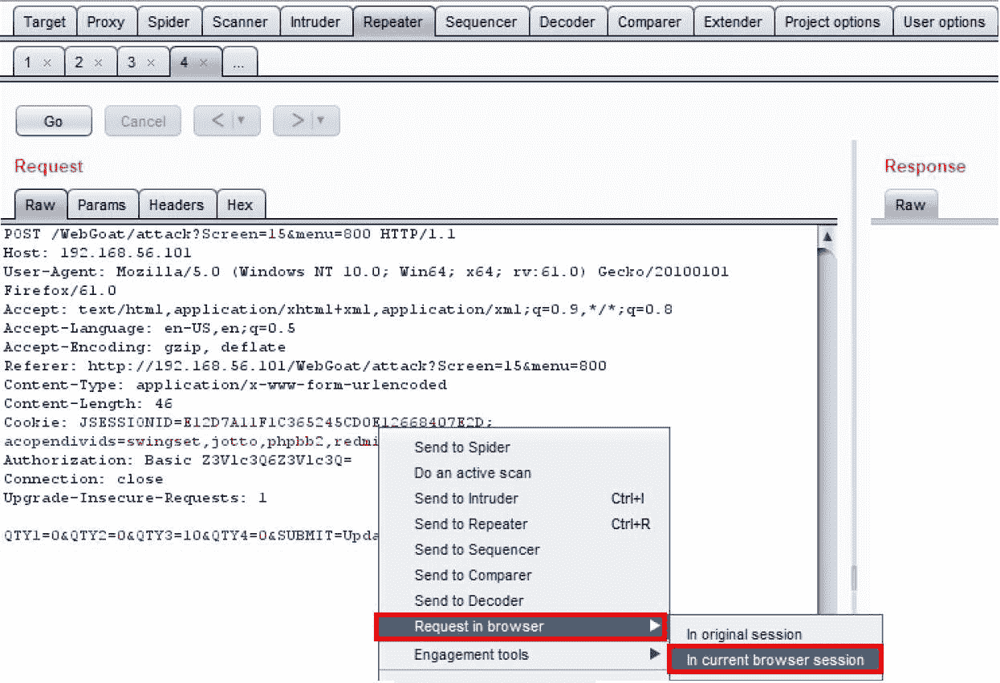

9.  一个弹出窗口显示修改后的请求。点击**复制**按钮：

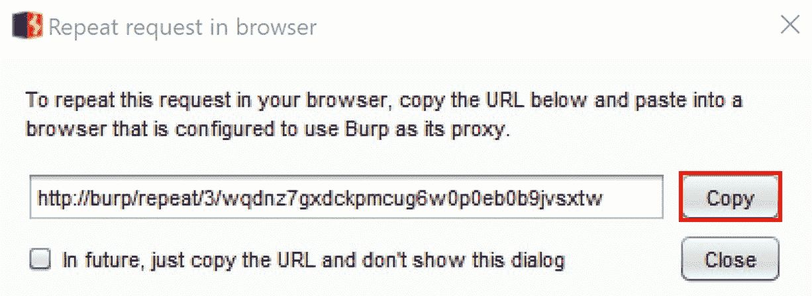

10.  使用包含购物车的相同 Firefox 浏览器，打开一个新选项卡并粘贴到您在上一步复制到剪贴板的 URL 中：


11.  按*输入*键查看重新提交的请求，修改数量为`10`：


12.  切换到包含您购物车的原始标签页（原始数量为`1`的购物车）。单击“购买”按钮：


13.  在下一个屏幕上，单击确认按钮之前，切换到第二个选项卡，并再次更新购物车，但这次使用我们的新数量`10`，并单击更新购物车：


14.  返回到第一个选项卡，然后单击确认按钮：


请注意，我们能够以一台的价格购买 10 台索尼 Vaio 笔记本电脑！


# 它是如何工作的。。。

线程安全问题可能会产生意外的结果。对于许多语言，开发人员必须了解如何将变量和方法声明为线程安全的。未隔离的线程（如此配方中显示的购物车内容）可能会导致用户获得产品的意外折扣。

# 无限制文件上载–绕过弱验证

许多应用程序允许出于各种原因上载文件。服务器端的业务逻辑必须包括检查可接受的文件；这被称为**白名单**。如果此类检查较弱或仅针对文件属性的一个方面（例如，仅针对文件扩展名），则攻击者可以利用这些弱点上载可能在服务器上可执行的意外文件类型。

# 准备

使用**该死的易受攻击的 Web 应用程序**（**DVWA**应用程序）和 Burp，我们将利用文件上传页面中的业务逻辑设计漏洞进行攻击。

# 怎么做。。。

1.  确保 owaspbwa 虚拟机正在运行。从虚拟机的初始登录页选择 DVWA。登录页将配置为特定于您的计算机的 IP 地址。
2.  在登录页面，使用以下凭据：用户名：`user`；密码：`user`。
3.  从左侧菜单中选择 DVWA 安全选项。将默认设置“低”更改为“中”，然后单击“提交”：


4.  从左侧菜单中选择上载页面：

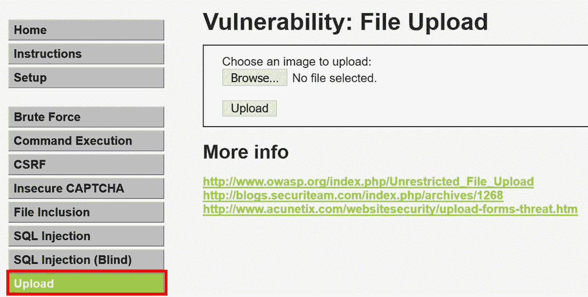

5.  注意：该页面指示用户仅上载图像。如果尝试 JPG 图像以外的其他类型的文件，我们会在左上角收到一条错误消息：


6.  在本地计算机上，创建除 JPG 以外的任何类型的文件。例如，创建一个名为`malicious_spreadsheet.xlsx`的 Microsoft Excel 文件。本配方不需要任何内容。
7.  切换到 Burp 的代理|拦截选项卡。在 Intercept（截取）按钮打开时打开 Interceptor（截取）。
8.  返回 Firefox，使用浏览按钮在系统上找到`malicious_spreadsheet.xlsx`文件，然后单击上载按钮：


9.  当请求在 Burp 的代理截取器中暂停时，将**内容类型**从`application/vnd.openxmlformats-officedocument.spreadsheet.sheet`改为`image/jpeg`。
    *   这是原件：


10.  单击“前进”按钮。现在单击切换按钮关闭拦截器，以关闭拦截器。
11.  注意文件上传成功！我们能够绕过薄弱的数据验证检查，上传除图像以外的文件：


# 它是如何工作的。。。

由于服务器端检查薄弱，我们可以轻松绕过仅限图像的限制，上传我们选择的文件类型。应用程序代码只检查与`image/jpeg`匹配的内容类型，这很容易通过截取代理（如 Burp）进行修改。开发人员需要在应用程序代码中同时将内容类型和文件扩展名列为白名单，以防止此类攻击的发生。

# 执行进程定时攻击

通过监视应用程序完成任务所需的时间，攻击者可以收集或推断有关应用程序编码方式的信息。例如，使用有效凭据的登录进程接收响应的速度比给定无效凭据的同一登录进程快。响应时间的延迟会泄漏与系统进程相关的信息。攻击者可以使用响应时间执行帐户枚举，并根据响应时间确定有效用户名。

# 准备

对于此配方，您需要来自`wfuzz`的`common_pass.txt`单词列表：

*   [https://github.com/xmendez/wfuzz](https://github.com/xmendez/wfuzz)
    *   路径：`wordlists``other``common_pass.txt`

使用 OWASP Mutillidae II，我们将根据强制登录的响应时间确定应用程序是否提供信息泄漏。

# 怎么做。。。

确保 Burp 正在运行，同时确保 owaspbwa VM 正在运行，并且在用于查看 owaspbwa 应用程序的 Firefox 浏览器中配置了 Burp。

1.  在 OWASP BWA 登录页中，单击指向 OWASP Mutillidae II 应用程序的链接。
2.  打开 Firefox 浏览器至 OWASP Mutillidae II 的主页（URL:`http://<your_VM_assigned_IP_address>/mutillidae/`）。
3.  进入登录页面，使用用户名`ed`和密码`pentest`登录。
4.  切换到 Burp 的 Proxy | HTTP history 选项卡，找到刚才执行的登录，右键单击，然后选择 Send to Intranter:


5.  转到入侵者位置选项卡，使用右侧的清除§按钮清除所有有效负载标记：


6.  选择密码字段并单击添加§**按钮，将有效负载标记环绕该字段：**

 **

7.  同时，移除`PHPSESSID`标记。删除此标记中的值（等号后面的内容）并将其保留为空。此步骤非常重要，因为如果您碰巧在请求中留下此令牌，您将无法看到计时的差异，因为应用程序会认为您已经登录：


8.  转到入侵者|有效载荷选项卡。在有效负载选项[简单列表]中，我们将使用包含常用密码的`wfuzz`中的`wordlist`添加一些无效值：`wfuzz``wordlists``other``common_pass.txt`：

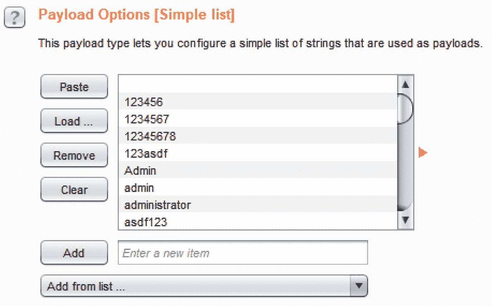

9.  滚动至底部，取消选中`Payload Encoding`复选框：


10.  单击开始攻击按钮。此时会出现一个攻击结果表。让攻击完成。从攻击结果表中，选择列并检查收到的响应。检查响应已完成，以将以下列添加到攻击结果表：


11.  分析提供的结果。虽然不是每个响应都很明显，但请注意使用无效密码时的延迟，例如`administrator`。`Response received`定时为`156`，而`Response completed`定时为`166`。但是，`pentest`（仅`302`）的有效密码会立即收到响应：`50`（已收到）和`50`（已完成）：


# 它是如何工作的。。。

当处理错误消息或无效编码路径的时间超过有效编码路径的时间时，可能会发生信息泄漏。开发人员必须确保业务逻辑不会将此类线索泄露给攻击者。

# 规避工作流程的测试

购物车到支付网关的交互必须由 web 应用渗透测试人员进行测试，以确保工作流程不会无序执行。除非首先在服务器端检查购物车内容的验证，否则不得付款。如果此支票丢失，攻击者可以在实际购买之前更改价格、数量或两者。

# 准备

使用 OWASP WebGoat 应用程序和 Burp，我们将利用一个业务逻辑设计缺陷，在购买之前没有服务器端验证。

# 怎么做。。。

1.  确保 owaspbwa 虚拟机正在运行。从 VM 的初始登录页选择 OWASP WebGoat 应用程序。登录页将配置为特定于您的计算机的 IP 地址。
2.  单击 OWASP WebGoat 链接后，系统将提示您输入登录凭据。使用这些凭证：用户名：`guest`；密码：`guest`。
3.  验证后，单击 Start WebGoat 按钮访问应用程序练习。
4.  从左侧菜单中单击 AJAX 安全性|不安全的客户端存储。您将看到一个购物车：


5.  切换到 Burp 的**代理**|**HTTP 历史记录**选项卡，点击过滤按钮，确保您的 MIME 类型过滤部分包含脚本。如果未选中脚本，请确保立即选中它：

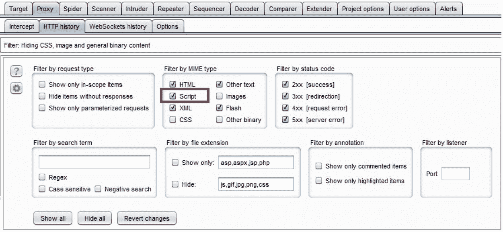

6.  使用 WebGoat 返回 Firefox 浏览器，并为`Hewlett-Packard - Pavilion Notebook with Intel Centrino`项指定`2`数量：


7.  切换回 Burp 的**代理****HTTP 历史记录**选项卡，并注意与您对数量所做更改相关的 JavaScript（`*.js`文件。注意一个名为`clientSideValiation.js`*的脚本。*确认状态码为`200`而非`304`（未修改）。只有*200*状态码会显示脚本的源代码：


8.  选择`clientSideValidation.js`文件并在响应选项卡中查看其源代码。
9.  请注意，优惠券代码是在 JavaScript 文件中硬编码的。但是，按字面意思使用，它们将不起作用：


10.  继续查看源代码，注意 JavaScript 文件中有一个`decrypt`函数。我们可以通过这个函数发送一个优惠券代码来测试它。让我们在 Firefox 浏览器中尝试此测试：

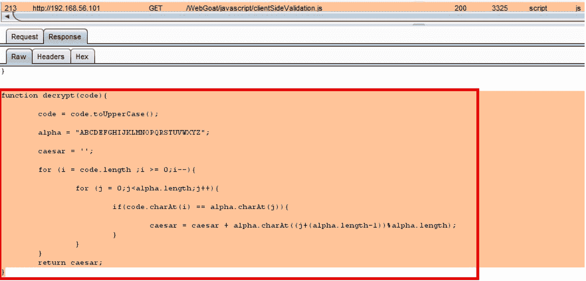

11.  在浏览器中，调出开发者工具（*F12*并进入控制台选项卡。将以下命令粘贴到控制台中（查看`>>`提示符）：

```
decrypt('emph');
```

12.  您可以使用此命令对数组中声明的任何优惠券代码调用`decrypt`函数：


13.  按*进入*后，您会看到优惠券代码被解密为`GOLD`字：


14.  在“输入优惠券代码”框中输入单词`GOLD`。请注意，现在的金额要少得多。接下来，单击“购买”按钮：


15.  我们收到关于第 1 阶段完成的确认。现在，让我们尝试免费购买：


16.  切换到 Burp 的**代理****截取**选项卡，并使用**截取按钮**打开截取按钮打开截取。
17.  返回 Firefox 并按下**购买**按钮。暂停请求时，将$1599.99 金额修改为$0.00。查找`GRANDTOT`参数以帮助您找到要更改的总计：


18.  点击**前进**按钮。现在单击切换按钮关闭拦截器，以关闭拦截器。
19.  您应该会收到一条成功消息。请注意，现在收费总额为 0.00 美元：

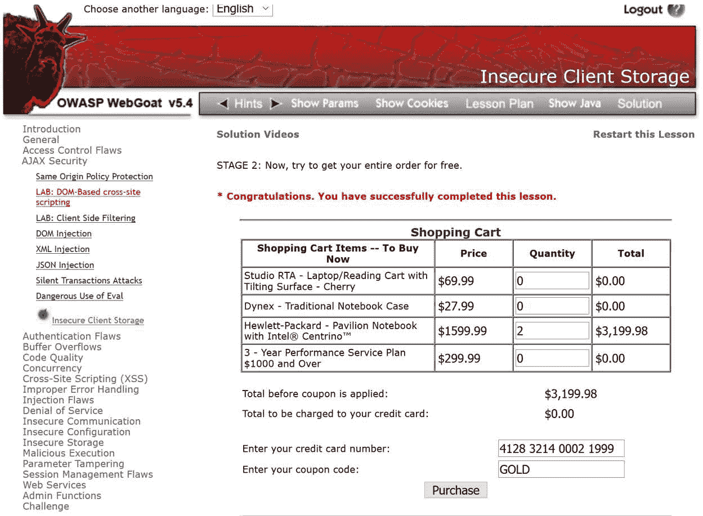

# 它是如何工作的。。。

由于在向信用卡收费之前，没有对优惠券代码和总金额进行服务器端检查，因此我们能够绕过指定的价格，并设置自己的价格。

# 上传恶意文件–多语言文字

**Polyglot**是一个使用多种语言的术语。如果我们将这一概念带入黑客攻击，则意味着通过使用不同的语言作为执行点来创建一个 Ty2 T2 跨站点脚本脚本 Ty3Ty[AuthT4[XSS-Outt5]）攻击向量。例如，攻击者可以构造有效图像并将 JavaScript 嵌入其中。JavaScript 负载的位置通常位于图像的注释部分。一旦图像加载到浏览器中，XSS 内容就可以执行，具体取决于 web 服务器声明的内容类型的严格程度以及浏览器对内容类型的解释。

# 准备

*   从 PortSwigger 博客页面下载包含跨站点脚本漏洞的 JPG 文件：[https://portswigger.net/blog/bypassing-csp-using-polyglot-jpegs](https://portswigger.net/blog/bypassing-csp-using-polyglot-jpegs)
    *   这里有一个指向 polyglot 图像的直接链接：[http://portswigger-labs.net/polyglot/jpeg/xss.jpg](http://portswigger-labs.net/polyglot/jpeg/xss.jpg)
*   使用 OWASP WebGoat 文件上载功能，我们将在包含 XSS 负载的应用程序中植入一个映像。

# 怎么做。。。

1.  确保 owaspbwa 虚拟机正在运行。从 VM 的初始登录页选择 OWASP WebGoat 应用程序。登录页将配置为特定于您的计算机的 IP 地址。
2.  单击 OWASP WebGoat 链接后，系统将提示您输入登录凭据。使用这些凭证：用户名：`guest`*；*密码：`guest`*。*
3.  验证后，单击 Start WebGoat 按钮访问应用程序练习。

4.  点击左侧菜单**恶意执行****恶意文件执行**。您将看到一个文件上载功能页面。说明中指出，仅允许上载图像：

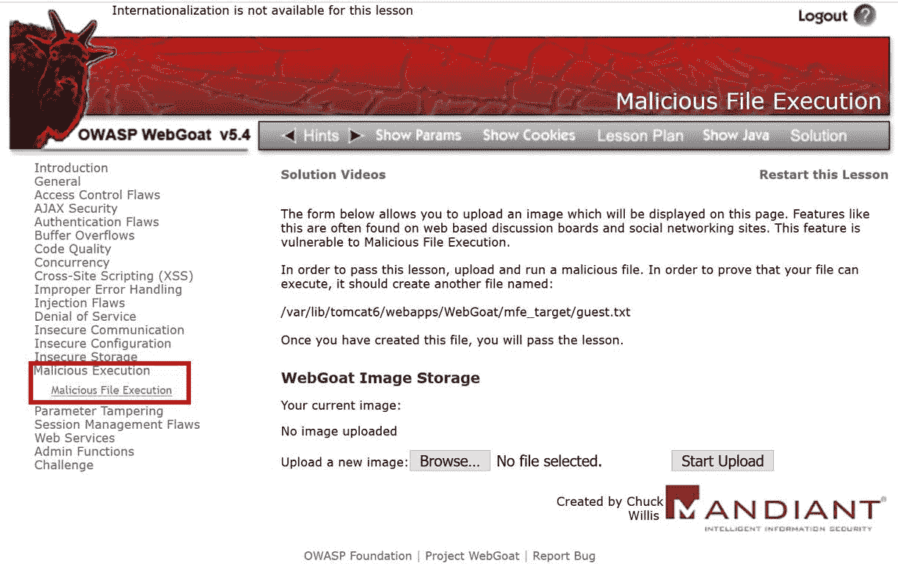

5.  浏览至保存`xss.jpg`图像的位置，该图像是从本食谱开头提到的 PortSwigger 博客页面下载的。
6.  下面的屏幕截图显示了图像的外观。如您所见，很难检测映像中包含的任何 XSS 漏洞。它隐藏在普通视图中。

7.  点击**浏览**按钮，选择`xss.jpg`文件：


8.  切换到 Burp 的**代理****选项**。确保您正在捕获**客户端响应**，并启用以下设置。这将允许我们捕获修改或拦截的 HTTP 响应：

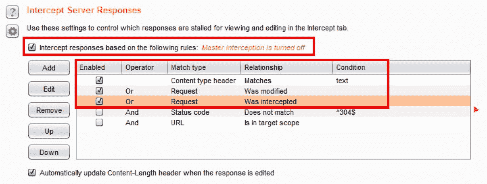

9.  切换到 Burp 的**代理****拦截**选项卡。在 Intercept（截取）按钮打开时打开 Interceptor（截取）。
10.  返回 Firefox 浏览器，点击**开始上传**按钮。消息应该在 Burp 的拦截器中暂停。


11.  当请求暂停时，在截取窗口内，在底部的搜索框中键入`Burp rocks`。你应该在图像中间看到一个匹配项。这是我们的多语言有效载荷。它是一个映像，但在映像的注释中包含一个隐藏的 XSS 脚本：


12.  点击**前进**按钮。现在单击切换按钮关闭拦截器，以关闭拦截器。
13.  使用记事本或您喜爱的文本编辑器，创建一个名为`poly.jsp`的新文件，并在该文件中写入以下代码：


14.  返回**恶意文件执行**页面，浏览到您创建的`poly.jsp`文件，点击**开始上传**按钮。`poly.jsp`是一个 Java 服务器页面文件，可在此 web 服务器上执行。按照说明，我们必须在提供的路径中创建一个`guest.txt`文件。此代码在 JSP scriptlet 标记代码中创建该文件：


15.  右键单击无法识别的图像，选择**复制图像位置**。
16.  在与 WebGoat 相同的 Firefox 浏览器中打开一个新选项卡，并将图像位置粘贴到新选项卡中。按*回车*执行脚本，并给脚本几秒钟的时间在后台运行，然后进入下一步。

17.  翻回到第一个选项卡*F5*刷新页面，您应该会收到成功完成的消息。如果脚本运行缓慢，请再次尝试上传上传页面上的`poly.jsp`。应显示成功消息：


# 它是如何工作的。。。

由于不受限制的文件上载漏洞，我们可以上载恶意文件，如 polyglot，而不需要从 web 服务器检测。许多网站允许上传图像，因此开发者必须确保这些图像中没有 XSS 有效载荷。这方面的保护可以采用幻数检查或特殊代理服务器屏蔽所有上传的形式。

# 还有更多。。。

要了解更多关于 Polyglot 的信息，请参阅 Portswigger 博客：[https://portswigger.net/blog/bypassing-csp-using-polyglot-jpegs](https://portswigger.net/blog/bypassing-csp-using-polyglot-jpegs) 。**