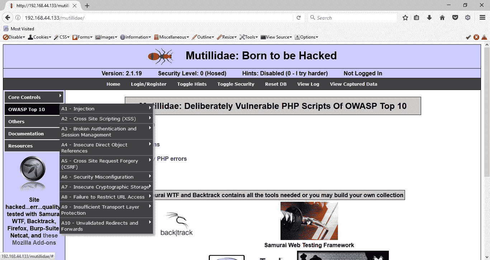
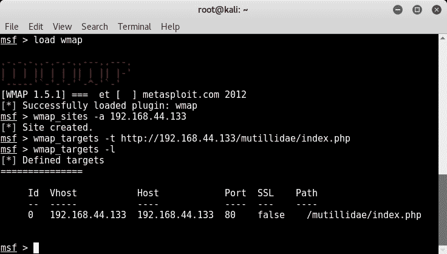
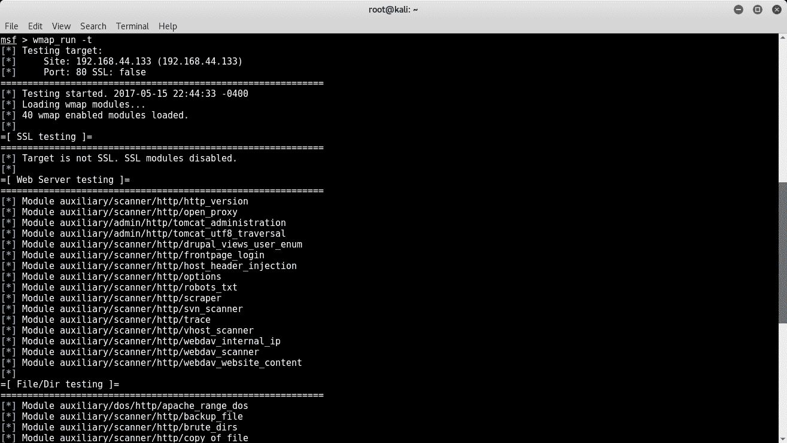
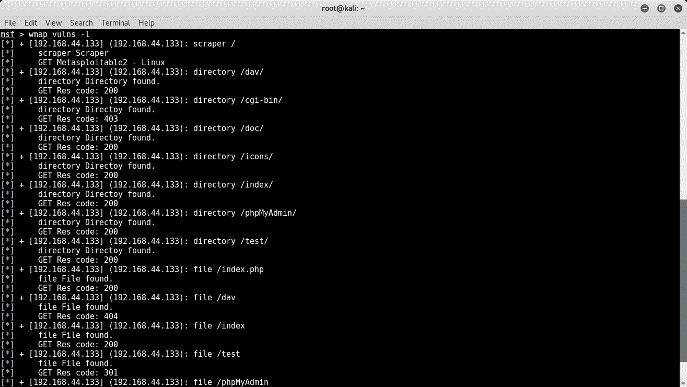
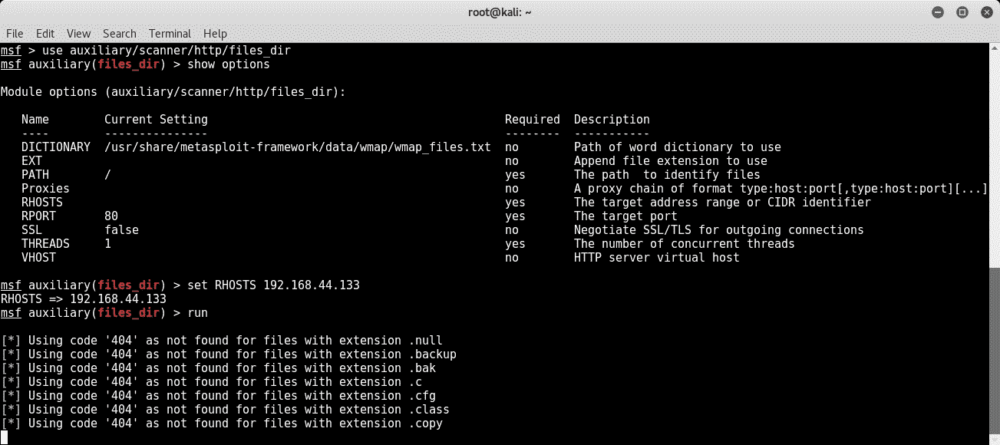
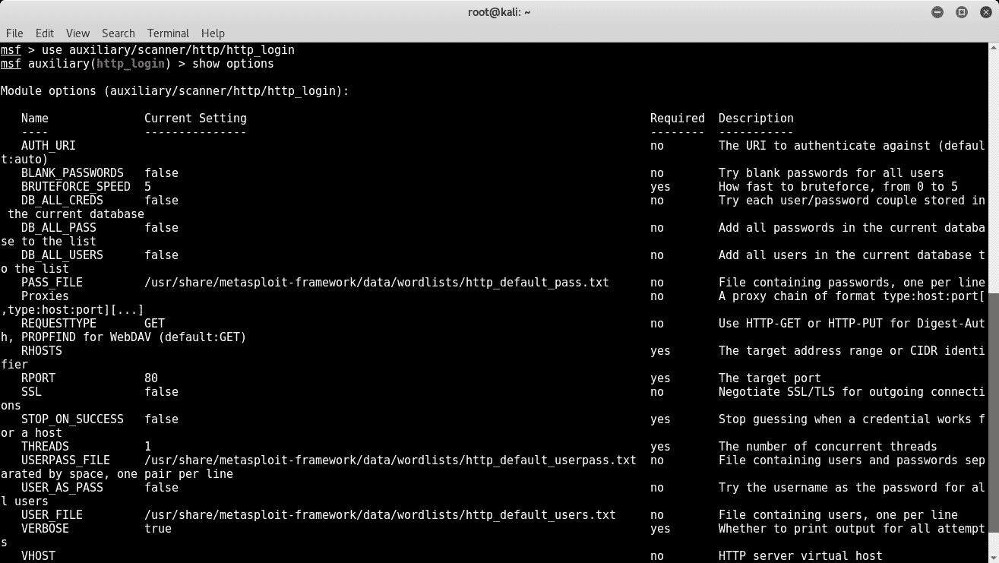

# 七、使用 Metasploit 扫描 Web 应用

在前一章中，我们概述了如何使用 Metasploit 发起欺骗性客户端攻击。在本章中，您将学习 Metasploit 框架的各种功能，这些功能可用于发现 web 应用中的漏洞。在本章中，我们将介绍以下主题：

*   设置易受攻击的 web 应用
*   使用 WMAP 扫描 Web 应用漏洞
*   web 应用枚举和扫描的 Metasploit 辅助模块

# 设置易受攻击的应用

在我们开始探索 Metasploit 框架提供的各种 web 应用扫描功能之前，我们需要建立一个测试应用环境，在这个环境中我们可以启动测试。如前几章所述，*Metasploitable 2*是一个故意设置为易受攻击的 Linux 发行版。它还包含故意设置为易受攻击的 web 应用，我们可以利用它来练习使用 Metasploit 的 web 扫描模块。

为了让易受攻击的测试应用启动并运行，只需引导到`metasploitable 2`；Linux，并从任何 web 浏览器远程访问它，如以下屏幕截图所示：

默认情况下，metasploitable 2 发行版上运行两个不同的易受攻击的应用，Mutillidae 和**该死的易受攻击 Web 应用**（**DVWA**）。可打开易受攻击的应用进行进一步测试，如以下屏幕截图所示：

# 使用 WMAP 扫描 Web 应用

WMAP 是一个功能强大的 web 应用漏洞扫描器，可在 Kali Linux 中使用。它以插件的形式集成到 Metasploit 框架中。为了使用 WMAP，我们首先需要在 Metasploit 框架中加载并启动插件，如以下屏幕截图所示：

一旦`wmap`插件加载到 Metasploit 框架中，下一步就是为我们的扫描创建一个新的站点或工作区。创建站点后，我们需要添加要扫描的目标 URL，如以下屏幕截图所示：

现在我们已经创建了一个新站点并定义了我们的目标，我们需要检查哪些 WMAP 模块将适用于我们的目标。例如，如果我们的目标没有启用 SSL，那么针对该目标运行 SSL 相关测试就没有意义了。这可以使用`wmap_run -t`命令完成，如以下屏幕截图所示：

现在我们已经列举了适用于针对易受攻击的应用进行测试的模块，我们可以继续实际的测试执行。这可以通过使用`wmap_run -e`命令来完成，如以下屏幕截图所示：

在目标应用上成功执行测试后，漏洞（如果发现）存储在 Metasploit 的内部数据库中。然后可以使用`wmap_vulns -l`命令列出漏洞，如以下屏幕截图所示：

# 用于 Web 应用枚举和扫描的 Metasploit 辅助工具

我们已经在[第 4 章](07.html)、*使用 Metasploit*收集信息中看到了 Metasploit 框架中用于枚举 HTTP 服务的一些辅助模块。接下来，我们将探讨一些可有效用于枚举和扫描 web 应用的附加辅助模块：

*   **证书**：此模块可用于枚举目标 web 应用上的证书是活动的还是过期的。其辅助模块名称为`auxiliary/scanner/http/cert`，其使用如下图所示：

要配置的参数如下所示：

*   **RHOSTS:**待扫描目标的 IP 地址或 IP 范围

还可以通过指定包含目标 IP 地址列表的文件（例如 set RHOSTS`/root/targets.lst`，在多个目标上同时运行模块。

*   `dir_scanner`：此模块检查目标 web 服务器上是否存在各种目录。这些目录可以显示一些有趣的信息，例如配置文件和数据库备份。其辅助模块名称为`auxiliary/scanner/http/dir_scanner`，如下图所示：

要配置的参数如下所示：

*   **RHOSTS**：被扫描目标的 IP 地址或 IP 范围
*   `enum_wayback`：[http://www.archive.org](http://www.archive.org) 存储任何给定网站的所有历史版本和数据。它就像一台时间机器，可以向你展示一个特定网站多年前的样子。这对于目标枚举非常有用。`enum_wayback`模块查询[http://www.archive.org](http://www.archive.org) ，获取目标网站的历史版本

其辅助模块名称为`auxiliary/scanner/http/enum_wayback`，如下图所示：

要配置的参数如下所示：

*   **RHOSTS**：需要查询存档的目标域名
*   `files_dir`：此模块搜索目标是否存在可能在不知不觉中留在 web 服务器上的任何文件。这些文件包括源代码、备份文件、配置文件、归档文件和密码文件。其辅助模块名称为`auxiliary/scanner/http/files_dir`，下面的屏幕截图显示了如何使用它：

要配置的参数如下所示：

*   **RHOSTS**：被扫描目标的 IP 地址或 IP 范围

*   `http_login`：如果在目标系统上启用了基于 HTTP 的身份验证，则该模块将尝试强制执行该身份验证。它使用 Metasploit 框架中可用的默认用户名和密码字典。其辅助模块名称为`auxiliary/scanner/http/http_login`，下面的屏幕截图显示了如何使用它：

要配置的参数如下所示：

*   **RHOSTS**：被扫描目标的 IP 地址或 IP 范围
*   `options`**此模块检查目标 web 服务器上是否启用了`TRACE`和`HEAD`等各种`HTTP`方法。这些方法通常不需要，攻击者可以使用攻击向量来绘制。其辅助模块名称为`auxiliary/scanner/http/options`，下面的屏幕截图显示了如何使用它：**

 **

要配置的参数如下所示：

*   **RHOSTS**：被扫描目标的 IP 地址或 IP 范围
*   `http_version`**此模块枚举目标并返回 web 服务器和底层操作系统的确切版本。然后可以使用版本信息发起特定的攻击。其辅助模块名称为`auxiliary/scanner/http/http_version`，下面的屏幕截图显示了如何使用它：**

 **

要配置的参数如下所示：

*   **RHOSTS**：被扫描目标的 IP 地址或 IP 范围

# 总结

在本章中，我们探讨了 Metasploit 框架的各种特性，这些特性可用于 web 应用安全扫描。继续下一章，您将学习各种技术，这些技术可用于隐藏我们的有效负载，使其不受防病毒程序的攻击，并在破坏系统后清除我们的跟踪。

# 练习

查找并利用以下易受攻击应用中的漏洞：

*   DVWA
*   水蚤科
*   OWASP 网络山羊****