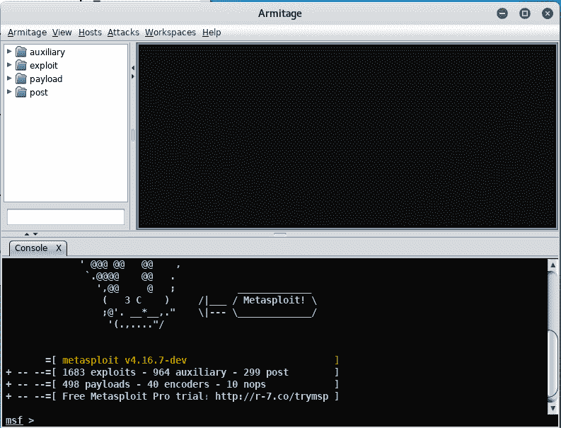
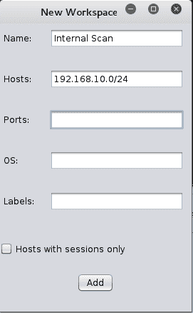
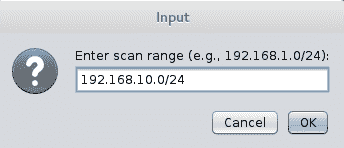
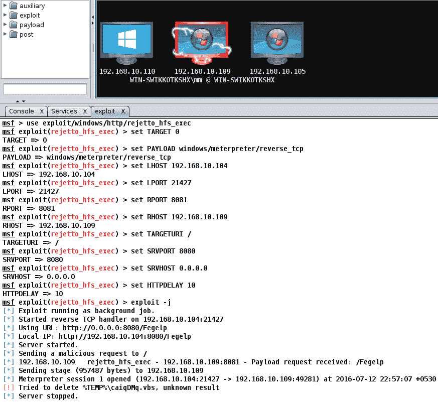
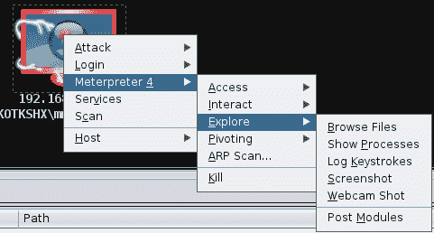
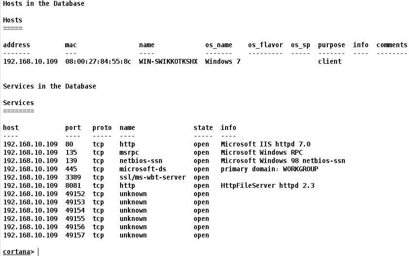
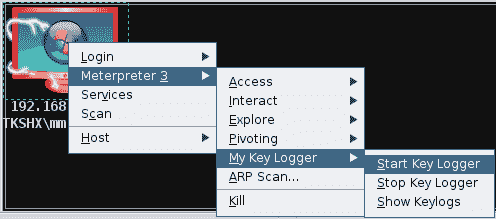
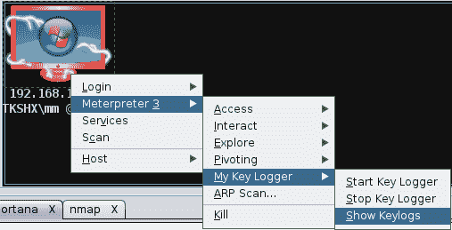
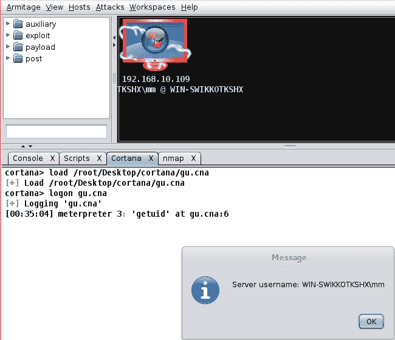

# 用阿米蒂奇想象

在上一章中，我们介绍了 Metasploit 如何帮助执法机构。让我们继续使用一个很棒的工具，它不仅可以加快开发速度，还可以为测试团队提供广泛的红队环境。

**Armitage**是一个 GUI 工具，充当 Metasploit 的攻击管理器。Armitage 可视化 Metasploit 操作，并推荐漏洞利用。Armitage 能够为 Metasploit 提供共享访问和团队管理。

在本章中，我们将介绍阿米蒂奇及其特点。我们还将研究如何使用这个支持 GUI 的 Metasploit 工具进行渗透测试。在本章的后半部分，我们将研究 Armitage 的 Cortana 脚本。

在本章中，我们将介绍以下要点：

*   用 Armitage 进行渗透测试
*   扫描网络和主机管理
*   使用阿米蒂奇进行后期开发
*   使用团队服务器的红色团队
*   Cortana 脚本的基础知识
*   在 Armitage 中使用 Cortana 脚本进行攻击

因此，让我们从这个伟大的视觉界面开始我们的渗透测试之旅。

# 阿米蒂奇的基本原理

Armitage 是一个攻击管理器工具，可以图形化地自动化 Metasploit。Armitage 是用 Java 构建的，由 Raphael Mudge 创建。它是一个跨平台的工具，可以在 Linux 和 Windows 操作系统上运行。

# 开始

在本章中，我们将在 Kali Linux 中使用 Armitage。要启动 Armitage，请执行以下步骤：

1.  打开一个终端，输入`armitage`命令，如下图所示：


2.  单击弹出框中的“连接”按钮以设置连接。
3.  要运行`armitage`命令，Metasploit 的**远程过程调用**（**RPC**服务器应该正在运行。只要我们单击上一个弹出窗口中的 Connect 按钮，就会出现一个新的弹出窗口，询问我们是否要启动 Metasploit 的 RPC 服务器。单击是，如以下屏幕截图所示：


4.  启动并运行 Metasploit RPC 服务器需要一点时间。在这个过程中，我们将一次又一次地看到诸如连接被拒绝之类的消息。这些错误是由于 Armitage 对连接进行检查，并测试连接是否建立。我们可以看到这些错误，如以下屏幕截图所示：


启动 Armitage 时需要记住的一些要点如下：

*   确保您是 root 用户
*   对于 Kali Linux 用户，如果未安装 Armitage，请使用`apt-get install armitage`命令进行安装

如果 Armitage 找不到数据库文件，请确保 Metasploit 数据库已初始化并正在运行。可以使用`msfdb init`命令初始化数据库，并使用`msfdb start`命令启动数据库。

# 浏览用户界面

如果正确建立连接，我们将看到 Armitage 接口面板。它将类似于以下屏幕截图：



Armitage 的界面非常简单，它主要包含三个不同的窗格，如前面的屏幕截图所示。让我们看看这三个窗格应该做什么：

*   左上角的第一个窗格包含对 Metasploit 提供的所有不同模块的引用：辅助模块、漏洞利用模块、有效负载模块和 post 模块。我们可以浏览并双击一个模块来立即启动它。此外，就在第一个窗格之后，有一个小输入框，我们可以使用它立即搜索模块，而无需探索层次结构。
*   第二个窗格显示网络中存在的所有主机。此窗格通常以图形格式显示主机。例如，它将运行 Windows 的系统显示为带有 Windows 徽标的监视器。类似地，Linux 的 Linux 徽标和 MAC 上运行的其他系统的其他徽标也会显示出来，以此类推。它还将显示带有打印机符号的打印机，这是 Armitage 的一项出色功能，因为它可以帮助我们识别网络上的设备。
*   第三个窗格显示执行的所有操作、利用后流程、扫描流程、Metasploit 控制台以及利用后模块的结果。

# 管理工作区

正如我们在前几章中已经看到的，工作区用于维护各种攻击配置文件，而无需合并结果。假设我们在一个范围内工作，出于某种原因，我们需要停止测试并测试另一个范围。在本例中，我们将创建一个新的工作区，并使用该工作区测试新的范围，以保持结果的整洁和有序。但是，在这个工作区中完成工作后，我们可以切换到另一个工作区。切换工作区将自动加载工作区中的所有相关数据。此功能将有助于使所有扫描的数据保持独立，防止不同扫描的数据合并。

要创建新的工作空间，请导航到“工作空间”选项卡，然后单击“管理”。这将向我们显示“工作空间”选项卡，如以下屏幕截图所示：


Armitage 的第三个窗格中将打开一个新选项卡，这将有助于显示有关工作空间的所有信息。我们将不会看到此处列出的任何内容，因为我们尚未创建任何工作区。

因此，让我们通过单击 Add 来创建一个工作区，如以下屏幕截图所示：



我们可以添加任何名称的工作区。假设我们添加了一个内部范围`192.168.10.0/24`。让我们看看添加范围后“工作空间”选项卡的外观：


通过选择所需的工作区并单击激活按钮，我们可以随时在工作区之间切换。

# 扫描网络和主机管理

Armitage 有一个名为 Hosts 的单独选项卡，用于管理和扫描主机。我们可以通过单击主机选项卡中的导入主机，通过文件将主机导入到 Armitage，也可以通过单击主机选项卡中的添加主机选项手动添加主机。

Armitage 还提供了扫描主机的选项。有两种扫描类型：**Nmap 扫描**和**MSF 扫描**。MSF 扫描使用 Metasploit 中的各种端口和服务扫描模块，而 Nmap 扫描使用流行的端口扫描工具，即**网络映射器**（**Nmap**）。

让我们通过从主机选项卡中选择 MSF 扫描选项来扫描网络。但是，单击 MSF 扫描后，Armitage 将显示一个弹出窗口，询问目标范围，如以下屏幕截图所示：



一旦我们进入目标范围，Metasploit 将开始扫描网络以识别端口、服务和操作系统。我们可以在界面的第三个窗格中查看扫描详细信息，如下所示：


扫描完成后，目标网络上的每台主机将以代表主机操作系统的图标形式出现在界面的第二个窗格中，如以下屏幕截图所示：


在前面的屏幕截图中，我们有一个 Windows Server 2008、Windows Server 2012 和一个 Windows 10 系统。让我们看看目标上正在运行哪些服务。

# 建立漏洞模型

让我们通过右键单击所需的主机并单击服务来查看目标范围内的主机上正在运行哪些服务。结果应类似于以下屏幕截图：


我们可以看到许多服务在`192.168.10.109`主机上运行，如 Microsoft IIS httpd 7.0、Microsoft Windows RPC、HttpFileServer httpd 2.3 等。让我们通过指示 Armitage 为这些服务查找匹配的漏洞利用，以其中一个服务为目标。

# 找到匹配项

我们可以通过选择主机，然后浏览“攻击”选项卡并单击“查找攻击”选项来查找目标的匹配攻击。“查找攻击”选项将利用数据库与目标主机上运行的服务相匹配。Armitage 在将所有服务与漏洞利用数据库匹配后生成一个弹出窗口，如以下屏幕截图所示：


单击 OK 之后，我们将能够注意到，每当我们右键单击主机时，菜单上就会出现一个名为 Attack 的新选项。攻击子菜单将显示我们可以在目标主机上启动的所有匹配攻击模块。

# 阿米蒂奇剥削

当主机可以使用攻击菜单后，我们都准备攻击目标。让我们使用攻击菜单中的 Rejetto HttpFileServer 远程命令执行漏洞攻击 HttpFileServer httpd 2.3。单击“利用漏洞”选项将显示一个新的弹出窗口，其中显示所有设置。让我们按如下方式设置所有必需的选项：


设置所有选项后，单击 Launch 以针对目标运行漏洞利用模块。启动`exploit`模块后，我们可以在界面的第三个窗格中看到正在对目标进行的攻击，如下图所示：



我们可以看到 MeterMeter 的启动，这意味着成功利用了目标。此外，目标主机的图标变为具有红色闪电的系统图标。

# 使用阿米蒂奇进行后期开发

Armitage 使后期开发与单击按钮一样简单。要执行利用后模块，请右键单击被利用的主机并选择 MeterMeter 4，如下所示：


选择 MeterMeter 将在部分中显示所有开发后模块。如果我们想提升权限或获得系统级访问权限，我们将导航到访问子菜单，并根据需要单击相应的按钮。

Interact 子菜单将提供获取命令提示符、另一个 MeterMeter 等的选项。Explore 子菜单将提供浏览文件、显示进程、记录击键、屏幕截图、网络摄像头截图和 Post 模块等选项，用于启动此子菜单中不存在的其他 Post 剥削模块。

这显示在以下屏幕截图中：



让我们通过单击浏览文件来运行一个简单的利用后模块，如以下屏幕截图所示：


通过单击相应的按钮，我们可以轻松地在目标系统上上载、下载和查看所需的任何文件。这就是阿米蒂奇的美；它远离命令，并以图形格式显示所有内容。

这就结束了我们对 Armitage 的远程攻击。

# 与 Armitage 团队服务器的红色团队合作

对于大型渗透测试环境，通常需要红队合作，在红队合作中，一组渗透测试人员可以共同处理一个项目，以便产生更好的结果。Armitage 提供了一个团队服务器，可用于高效地与渗透测试团队成员共享操作。我们可以使用`teamserver`命令和可访问的 IP 地址以及我们选择的密码快速启动团队服务器，如以下屏幕截图所示：


我们可以看到，我们已经在 IP 地址`192.168.10.107`上启动了团队服务器的一个实例，并使用密码黑客进行身份验证。我们可以看到，在成功初始化时，我们拥有需要在团队成员之间传播的凭据详细信息。现在，让我们通过使用`armitage`命令从命令行初始化 Armitage 并输入连接详细信息来连接到这个团队服务器，如下面的屏幕截图所示：


一旦成功建立连接，我们将看到类似于以下内容的屏幕：


我们可以看到指纹与团队服务器提供的指纹相同。让我们选择“是”继续：


我们可以选择一个昵称加入团队服务器。让我们按“确定”以连接：


我们可以看到，我们已成功地从本地阿米蒂奇实例连接到团队服务器。此外，所有连接的用户都可以通过事件日志窗口相互聊天。考虑到我们有另一个用户加入了团队服务器：


我们可以看到两个不同的用户通过各自的实例相互交谈和连接。让我们初始化端口扫描，看看会发生什么：


我们可以看到，用户`Nipun`启动了端口扫描，并立即为其他用户填充了端口扫描，他可以查看目标。考虑到{ T1 T1 增加测试的主机并利用它：


我们可以看到，用户`Kislay`也可以查看扫描的所有活动。但是，对于用户`Kislay`访问流量计，他需要切换到控制台空间，输入`sessions`命令，后跟标识符，如下图所示：


我们可以看到，与使用 Metasploit 的单个实例相比，Armitage 使我们能够在团队环境中更高效地工作。让我们看看如何在下一节编写 Armitage 脚本。

# 脚本阿米蒂奇

Cortana 是一种脚本语言，用于在 Armitage 中创建攻击向量。渗透测试人员使用 Cortana 进行红队和虚拟克隆攻击向量，使它们像机器人一样行动。然而，红色团队是一个独立的团队，它向组织提出挑战，以提高其效率和安全性。

Cortana 通过使用脚本语言使用 Metasploit 的远程过程客户端。它在控制 Metasploit 的操作和自动管理数据库方面提供了灵活性。

此外，Cortana 脚本在特定事件发生时自动执行渗透测试仪的响应。假设我们正在 100 个系统的网络上执行渗透测试，其中 29 个系统运行在 Windows Server 2012 上，另一个系统运行在 Linux 操作系统上，我们需要一种机制来自动利用每个 Windows Server 2012 系统，该系统在端口`8081`上运行 HttpFileServer httpd 2.3 使用 Rejetto HTTPFileServer 远程命令执行漏洞。

我们可以快速开发一个简单的脚本，使整个任务自动化，并节省大量时间。自动执行此任务的脚本将在每个系统出现在网络上时利用`rejetto_hfs_exec`漏洞进行攻击，并对它们执行预定的攻击后功能。

# Cortana 的基本原理

使用 Cortana 编写基本攻击脚本将有助于我们更广泛地理解 Cortana。那么，让我们来看一个示例脚本，它自动利用 Windows 操作系统的端口`8081`进行攻击：

```
on service_add_8081 { 
      println("Hacking a Host running $1 (" . host_os($1) . ")"); 
      if (host_os($1) eq "Windows 7") { 
              exploit("windows/http/rejetto_hfs_exec", $1, %(RPORT => "8081")); 
      } 
} 
```

当 Nmap 或 MSF 扫描发现端口`8081`打开时，将执行前面的脚本。脚本将检查目标是否在 Windows 7 系统上运行，Cortana 将在该系统上使用端口`8081`上的`rejetto_hfs_exec`漏洞自动攻击主机。

在前面的脚本中，`$1`指定主机的 IP 地址。`print_ln`打印出字符串和变量。`host_os`是 Cortana 中返回主机操作系统的函数。`exploit`功能在`$1`参数指定的地址启动漏洞利用模块，`%`表示当服务在不同端口上运行或需要其他详细信息时，可以为漏洞利用设置选项。`service_add_8081`指定在特定客户端上发现端口`8081`打开时触发的事件。

让我们保存前面提到的脚本，并通过导航到 Armitage 选项卡并单击脚本将此脚本加载到 Armitage 中：


要针对目标运行脚本，请执行以下步骤：

1.  单击“加载”按钮将 Cortana 脚本加载到 Armitage 中：


2.  选择脚本并单击“打开”。该操作将永远将脚本加载到 Armitage 中：


3.  转到 Cortana 控制台并键入`help`命令，列出 Cortana 在处理脚本时可以使用的各种选项。
4.  接下来，为了查看 Cortana 脚本运行时执行的各种操作，我们将使用后面跟着脚本名称的`logon`命令。`logon`命令将为脚本提供日志功能，并记录脚本执行的每个操作，如以下屏幕截图所示：


5.  现在，让我们通过浏览主机选项卡并从 Nmap 子菜单中选择密集扫描来执行目标的密集扫描。
6.  如我们所见，我们发现一台主机的端口`8081`处于打开状态。让我们回到`Cortana`控制台，看看是否发生了一些活动：


7.  猛敲 Cortana 已经通过在目标主机上自动启动漏洞攻击来接管主机。

正如我们所见，Cortana 通过自动执行操作使渗透测试对我们来说非常容易。在接下来的几节中，我们将研究如何使用 Cortana 自动化后期开发和处理 Metasploit 的进一步操作。

# 控制变质岩

Cortana 可以很好地控制 Metasploit 功能。我们可以使用 Cortana 向 Metasploit 发送任何命令。让我们看一个示例脚本，以帮助我们了解有关从 Cortana 控制 Metasploit 函数的更多信息：

```
cmd_async("hosts"); 
cmd_async("services"); 
on console_hosts { 
println("Hosts in the Database"); 
println(" $3 "); 
} 
on console_services { 
println("Services in the Database"); 
println(" $3 "); 
} 
```

在前面的脚本中，`cmd_async`命令向 Metasploit 发送`hosts`和`services`命令，并确保它们被执行。此外，`console_*`功能用于打印`cmd_async`发送的命令的输出。Metasploit 将执行这些命令；但是，为了打印输出，我们需要定义`console_*`函数。另外，`$3`是保存 Metasploit 执行的命令输出的参数。加载`ready.cna`脚本后，打开 Cortana 控制台查看输出：



显然，命令的输出显示在前面的屏幕截图中，这结束了我们当前的讨论。但是，有关 Cortana 脚本和通过 Armitage 控制 Metasploit 的更多信息，请访问：[http://www.fastandeasyhacking.com/download/cortana/cortana_tutorial.pdf](http://www.fastandeasyhacking.com/download/cortana/cortana_tutorial.pdf) 。

# 使用 Cortana 进行后期开发

使用 Cortana 进行后期开发也很简单。Cortana 的内置功能可以使后期开发变得容易处理。让我们使用以下示例脚本来理解这一点：

```
on heartbeat_15s { 
local('$sid'); 
foreach $sid (session_ids()) { 
if (-iswinmeterpreter $sid && -isready $sid) {   
m_cmd($sid, "getuid"); 
m_cmd($sid, "getpid"); 
on meterpreter_getuid { 
println(" $3 "); 
} 
on meterpreter_getpid { 
println(" $3 "); 
} 
} 
} 
} 
```

在前面的脚本中，我们使用了一个名为`heartbeat_15s`的函数。此函数每隔`15`秒重复执行一次。因此，它被称为**心跳**功能。

`local`函数将表示`$sid`是当前函数的本地函数。下一个`foreach`语句是一个循环，它在每个打开的会话上跳跃。`if`语句将检查会话类型是否为 Windows MeterMeter，以及它是否准备好交互和接受命令。

`m_cmd`函数向 MeterMeter 会话发送命令，参数包括会话 ID`$sid,`和要执行的命令。接下来，我们用`meterpreter_*`定义一个函数，其中`*`表示发送到 MeterMeter 会话的命令。此函数将打印`sent`命令的输出，正如我们在上一个练习中对`console_hosts`和`console_services`所做的那样。

让我们运行此脚本并分析结果，如以下屏幕截图所示：


一旦加载脚本，每隔`15`秒就会显示目标的用户 ID 和当前进程 ID。

有关 Cortana 中的后期开发、脚本和功能的更多信息，请参阅[http://www.fastandeasyhacking.com/download/cortana/cortana_tutorial.pdf](http://www.fastandeasyhacking.com/download/cortana/cortana_tutorial.pdf) 。

# 在 Cortana 中构建自定义菜单

Cortana 还提供了一个出色的输出，用于在获得 MeterMeter 会话和其他类型的会话后构建附加到主机的自定义弹出菜单。让我们使用 Cortana 构建一个自定义键盘记录器菜单，并通过分析以下脚本了解其工作原理：

```
popup meterpreter_bottom { 
menu "&My Key Logger" { 
item "&Start Key Logger" { 
m_cmd($1, "keyscan_start"); 
} 
item "&Stop Key Logger" { 
m_cmd($1, "keyscan_stop"); 
} 
item "&Show Keylogs" { 
m_cmd($1, "keyscan_dump"); 
} 
on meterpreter_keyscan_start { 
println(" $3 "); 
} 
on meterpreter_keyscan_stop { 
println(" $3 "); 
} 
on meterpreter_keyscan_dump { 
println(" $3 "); 
} 
} 
}
```

前面的示例显示如何在 MeterMeter 子菜单中创建弹出窗口。但是，只有当我们能够利用目标主机并成功获得 MeterMeter 外壳时，此弹出窗口才可用。

`popup`关键字将表示弹出窗口的创建。`meterpreter_bottom`功能将表示，每当用户右键单击被攻击主机并选择`Meterpreter`选项时，Armitage 将在底部显示此菜单。`item`关键字指定菜单中的各种项目。`m_cmd`命令是将 MeterMeter 命令及其各自的会话 ID 发送到 Metasploit 的命令。

因此，在前面的脚本中，我们有三项：启动键盘记录程序、停止键盘记录程序和显示键盘记录程序。它们分别用于启动键记录、停止键记录和显示日志中存在的数据。我们还声明了三个函数，它们将处理发送到 MeterMeter 的命令的输出。让我们将此脚本加载到 Cortana 中，利用该主机，右键单击受损主机，将显示以下菜单：



我们可以看到，每当我们右键单击被攻击的主机并浏览 MeterMeter 3 菜单时，我们都会在所有菜单的底部看到一个名为 My Key Logger 的新菜单。此菜单将包含我们在脚本中声明的所有项。每当我们从此菜单中选择一个选项时，相应的命令就会运行并在 Cortana 控制台上显示其输出。让我们选择第一个选项，启动键盘记录器。等待几秒钟，让目标键入内容，然后从菜单中单击第三个选项 ShowKeyLogs，如以下屏幕截图所示：



单击 ShowKeyLogs 选项后，我们将在 Cortana 控制台中看到在受损主机上工作的人员键入的字符，如以下屏幕截图所示：


# 使用接口

Cortana 在使用接口时还提供了灵活的方法。Cortana 提供了创建快捷方式、表格、切换选项卡和各种其他操作的选项和功能。假设我们想要添加自定义功能，例如当我们从键盘上按*F1*键时；Cortana 显示目标主机的`UID`。让我们看一个脚本示例，它将使我们能够实现此功能：

```
bind F1 { 
$sid ="3"; 
spawn(&gu, \$sid);   
}  
sub gu{   
m_cmd($sid,"getuid"); 
on meterpreter_getuid { 
show_message( " $3 "); 
} 
} 
```

上一个脚本将添加一个快捷键`F1`，按下该快捷键时将显示目标系统的`UID`。脚本中的`bind`关键字表示功能与*F1*键的绑定。接下来，我们将`$sid`变量的值定义为`3`（这是我们将与之交互的会话 ID 的值）。

`spawn`函数将创建 Cortana 的新实例，执行`gu`函数，并将值`$sid`安装到新实例的全局范围。`gu`功能将向仪表发送`getuid`命令。`meterpreter_getuid`命令将处理`getuid`命令的输出。

`show_message`命令将显示一条消息，显示`getuid`命令的输出。让我们将脚本加载到 Armitage 中，然后按*F1*键检查当前脚本是否正确执行：



猛敲我们很容易得到目标系统的`UID`，即 WIN SWIKKOTKSHXmm。关于使用 Armitage 编写 Cortana 脚本的讨论到此结束。

有关 Cortana 脚本及其各种功能的更多信息，请参阅：[http://www.fastandeasyhacking.com/download/cortana/cortana_tutorial.pdf](http://www.fastandeasyhacking.com/download/cortana/cortana_tutorial.pdf) 。

# 总结

在本章中，我们详细介绍了 Armitage 及其多种功能。我们首先查看了界面并构建了工作区。我们还看到了如何利用 Armitage 的主机。我们研究了远程以及客户端开发和后期开发。此外，我们跳进 Cortana 并讨论了它的基本原理，使用它来控制 Metasploit，编写开发后脚本、自定义菜单和接口。