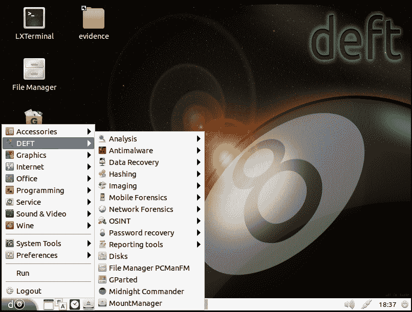
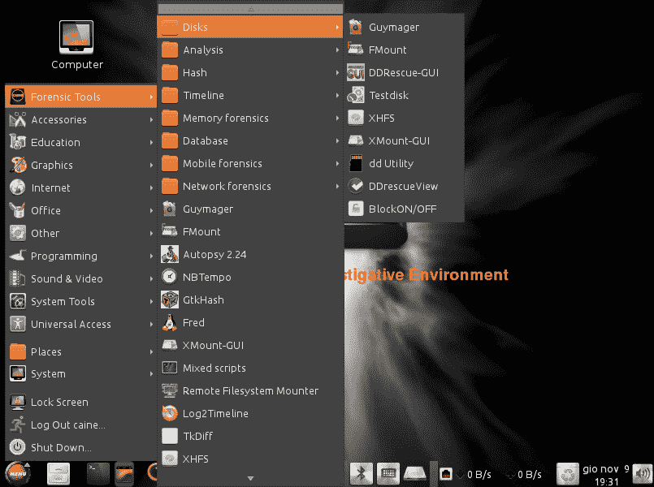
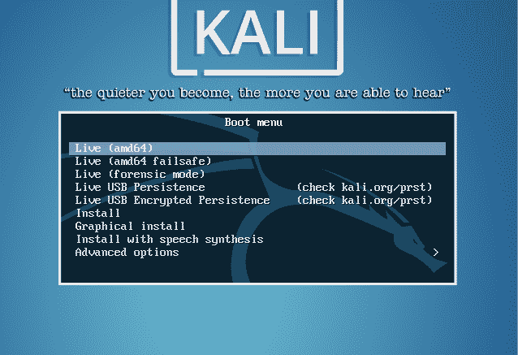
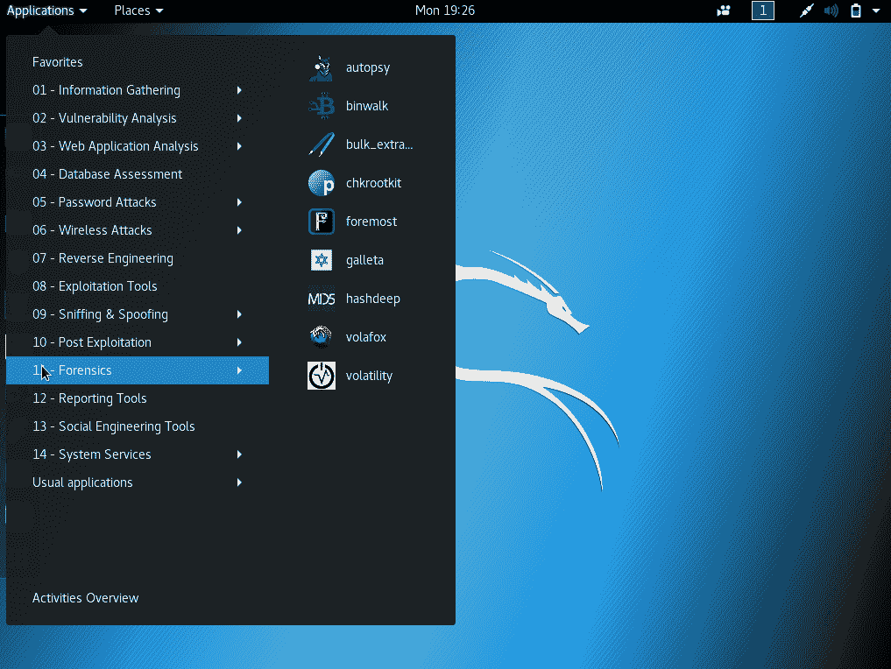

# 一、数字取证导论

数字取证已经吸引了我超过 13 年的注意力。自从我有了第一台电脑（谢谢，妈妈和爸爸），我就一直在想，当我从巨大的 2GB 硬盘上删除我的文件，或者把文件移到一张不显眼的 3.5 英寸软盘上（最大容量为 1.44MB）时，会发生什么事。

我很快了解到，硬盘驱动器和软盘驱动器并没有我如此自信地相信的数字不朽。可悲的是，许多文件、文档和由您用 Microsoft Paint 创建的无价之宝真的在数字来世中丢失了，再也找不到了。叹气世界永远不会知道。

直到几年后，我在浏览神奇的**万维网**（**WWW**）时，在我闪电般的 42 Kbps 拨号上网连接（由我非常昂贵的 USRobotics 拨号调制解调器实现）上，才看到一篇关于文件恢复和相关工具的文章，每次我尝试连接到互联网领域时，它都唱着科技之神的曲调。这一过程涉及到一种隐秘的忍者般的技能，即使是黑人行动团队也会嫉妒，因为这样做时我的父母不会注意到，因为这会阻止他们使用电话线拨打或接听电话。（向亲爱的母亲、父亲和姐姐致歉）。

上一篇关于数据恢复的文章远没有今天广泛使用的许多伟大的同行评议论文、期刊和数字取证书籍那么详细和充实。作为该领域的新手（也称为 noob），我确实学到了很多关于文件系统、数据和元数据、存储度量以及各种存储介质工作原理的基础知识。

正是在这个时候，尽管我读过 Linux 操作系统及其各种发行版（或发行版），但我开始理解 Linux 发行版为什么在数据恢复和取证中很受欢迎。

这时，我又通过拨号连接勇敢地下载了 Auditor 和 Slax Linux 发行版。仅仅下载这些操作系统是一项了不起的壮举，这让我感觉非常有成就感，因为我不知道如何安装它们，更不用说实际使用它们了。在那些日子里，简易安装和 GUI 仍在大力开发中，用户友好，或者在我的情况下，用户不友好，就像当时一样（主要是因为我缺乏经验，缺乏推荐的硬件，也缺乏在线论坛、博客和 YouTube 等资源，我还不知道这些）。我将在[第 2 章](02.html)*安装 Kali Linux*中详细解释 Auditor 和 Slax 操作系统，包括它们在臭名昭著的回溯中的作用，现在是 Kali Linux 操作系统。

随着时间的推移，我研究了在各种平台上为 Windows、Macintosh 和许多 Linux 发行版找到的许多工具。我发现数字取证中使用的许多工具可以安装在不同的 Linux 发行版或版本中，并且这些工具中的许多都得到了良好的维护，不断地开发，并被该领域的同行广泛接受。Kali Linux 是一个 Linux 发行版或版本，但在我们进一步讨论之前，让我解释一下 Linux 发行版或版本的概念。考虑一下你最喜欢的饮料：这种饮料可以有多种口味，有些不含甜味剂或糖，颜色不同，大小也不相同。不管有什么变化，它仍然是构成饮料核心的基本成分。通过这种方式，我们也有 Linux，然后是不同类型和种类的 Linux。一些更流行的 Linux 发行版和版本包括 RedHat、CentOS、Ubuntu、Mint、Knoppix，当然还有 Kali Linux。更多关于 Kali Linux 的信息将在[第 2 章](02.html)*安装 Kali Linux*中讨论。

在这本书中，我们采用了一种非常结构化的数字取证方法，就像我们在法医学中一样。我们首先走进数字取证的世界，它的历史，一些用于取证的工具和操作系统，并立即向您介绍证据保存所涉及的概念。

我们开始吧。让我们开始吧！

本章介绍了数字取证科学的各个方面

我们将在本章中介绍的主题包括：

*   什么是数字取证？
*   数字取证方法。
*   数字取证的简史。
*   随着技术的进步，对数字取证的需求越来越大。
*   反取证：对数字取证的威胁
*   数字取证领域可用的商业工具。
*   开源工具。
*   具有用于数字取证的内置工具的操作系统。
*   需要在调查中使用多种取证工具，以提供强有力的完整性证明。

# 什么是数字取证？

在本章中，我想介绍的第一件事是对数字取证及其适当实践和程序的理解。在某个时候，您可能会看到一些书籍、博客，甚至视频，展示了数字取证的各个方面和使用的不同工具。理解法医学本身是一门科学非常重要，它涉及到大量记录在案的最佳实践和方法，以努力揭示事物是否存在。

数字取证包括保存、获取、记录、分析和解释所发现的各种存储介质类型的证据。它不仅限于笔记本电脑、台式机、平板电脑和移动设备，还扩展到通过公共或专用网络传输的传输中的数据。

在大多数情况下，数字取证涉及使用调查员可用的各种方法和工具发现和/或恢复数据。数字取证调查包括但不限于：

*   **数据恢复**：调查和恢复可能已被删除、更改为不同文件扩展名甚至隐藏的数据。
*   **身份盗窃**：许多欺诈活动，从盗用信用卡到伪造社交媒体档案，通常都涉及某种身份盗窃。
*   **恶意软件和勒索软件调查**：迄今为止，通过特洛伊木马和蠕虫在网络和互联网上传播的勒索软件是对公司、军事组织和个人的一些最大威胁。恶意软件也可以通过移动设备和智能设备传播。
*   **网络和互联网调查**：调查**DoS**（称为**拒绝服务**）和**DDoS**（称为**分布式 DoS**）攻击，并跟踪访问的设备，包括打印机和文件。
*   **邮件调查**：调查来源和 IP 来源、附件内容和地理位置信息都可以进行调查。
*   **企业间谍**：许多公司正从印刷拷贝转向云和传统磁盘媒体。因此，数字足迹总是落在后面；是否应访问或传输敏感信息？
*   **儿童色情调查**：可悲的是，现实是，儿童在互联网和深网中被广泛利用。通过使用技术和高技能的法医分析员，可以通过分析互联网流量、浏览器历史记录、支付交易、电子邮件记录和图像来进行调查，从而打倒利用漏洞的团伙。

# 数字取证方法

铭记取证是一门科学，数字取证需要遵循适当的最佳实践和程序，努力一次又一次地产生相同的结果，提供证据、保存和可复制的完整性证明；如果被要求这样做。

尽管许多人可能不会进行数字取证以作为法庭上的证据，但最好的做法是以可被法庭接受和呈现的方式进行。坚持数字取证和事件响应专业组织制定的最佳实践的主要目的是在调查期间保持证据的完整性。如果调查人员的工作必须由另一方或对方审查和批评，则调查人员发现的结果必须能够重新生成，从而证明调查的完整性。这样做的目的是确保您的方法可以重复，并且，如果对其进行剖析或仔细检查，会一次又一次地产生相同的结果。无论使用何种工具，所使用的方法（包括调查的程序和结果）应始终允许维护数据的完整性。

本书中展示的最佳实践，确保原始证据不被篡改，或在现场或生产环境中调查设备和数据的情况下，证明在调查过程中采取了必要步骤，以避免不必要的篡改证据，从而维护了证据的完整性。对于那些完全不熟悉调查的人，我建议你熟悉一些专业团体广泛采用的各种实践和方法。

因此，存在着若干准则和方法，应当采用或至少遵循这些准则和方法，以确保检查和调查在法医学上是可靠的。

本章中提到的两个最佳实践文件是：

*   ACPO 的数字证据良好实践指南
*   SWGDE 的计算机取证最佳实践。

**首席警官协会**于 2012 年成立，被称为 ACPO，现为**国家警察局长委员会**或 NPCO，该协会以 PDF 文件形式发布了一份名为*ACPO 数字证据良好实践指南*的文件在进行数字取证调查时的最佳实践中，尤其是在证据获取方面。随后，英格兰、威尔士和北爱尔兰的执法机构采纳并遵守了《ACPO 数字证据良好实践指南》，并可在[上完整下载该指南 https://www.7safe.com/docs/default-source/default-document-library/acpo_guidelines_computer_evidence_v4_web.pdf](https://www.7safe.com/docs/default-source/default-document-library/acpo_guidelines_computer_evidence_v4_web.pdf) 。

**数字证据科学工作组**（**SWGDE**于 2014 年 9 月发布了另一份关于数字取证最佳实践的有用且较新的文件。SWGDE 由联邦犯罪实验室主任小组于 1998 年成立，主要成员和贡献者包括 FBI、DEA、NASA 和国防部计算机取证实验室。尽管本文件详细说明了正式计算机取证实验室环境中的程序和实践，但这些实践仍然适用于目前不在或无法进入此类环境的人员进行的非实验室调查。

*SWGDE 计算机取证最佳实践*阐明了以下章节中涉及的许多主题，包括：

*   证据收集和获取
*   调查通电和断电的设备
*   证据处理
*   分析和报告

全文可在[上公开获取 https://www.swgde.org/documents/Current%20Documents/SWGDE%20Best%20Practices%20for%20Computer%20Forensics](https://www.swgde.org/documents/Current%20Documents/SWGDE%20Best%20Practices%20for%20Computer%20Forensics) 。

# 数字取证简史

*虽然法医学本身（包括第一次记录的指纹）已经存在了 100 多年，但数字法医学是一个年轻得多的领域，因为它涉及到数字世界，主要是在 20 世纪 80 年代个人电脑问世后流行起来的。*

 *出于比较的目的，试图掌握数字取证的概念仍然是比较新的，认为第一个真正的法医学实验室是由联邦调查局于 1932 制定的。

数字法医调查中最早使用的一些工具大约在 1984 年在 FBI 实验室开发，由 FBI 专门的**推车**（**计算机分析和响应团队**）牵头开展法医调查，该团队负责协助数字调查。

数字取证作为其自己的领域在 20 世纪 90 年代有了长足的发展，几家执法机构和部门负责人合作，甚至定期开会讨论他们的专业知识。

最早的正式会议之一是 1993 年由联邦调查局主办的。这项活动的主要焦点被称为**国际计算机证据执法会议**，旨在解决有关数字取证和证据获取的正式标准和程序的需要。

其中许多会议的结果是成立了处理数字取证标准和最佳实践的机构。例如，SWGDE 由**联邦犯罪实验室主任**于 1998 年成立。SWGDE 负责制定广泛采用的计算机证据最佳实践（本章后面将讨论）。SWGDE 还与其他组织合作，如非常受欢迎的**美国犯罪实验室主任协会**（**ASCLDs**），该协会成立于 1973 年，此后一直致力于与法医学相关的最佳实践、程序和培训的持续发展。

然而，直到 21 世纪初，联邦调查局才成立了一个正式的**地区计算机法医实验室**（**RCFL**。2002 年，成立了**国家项目办公室**（**NPO**），作为中央机构，主要协调和支持 RCFL 执法部门之间的工作。

从那时起，我们看到了几个机构，如 FBI、CIA、NSA 和 GCHQ，每个机构都有自己的完整的网络犯罪部门、完整的数字取证实验室、专门的现场和现场代理，努力合作，以承担可能不亚于**Sisyphean**的任务，当考虑到技术的快速发展和更容易访问互联网甚至黑暗的网络时。

随着技术的进步，数字取证工具必须定期更新，不仅在打击网络犯罪方面，而且在追究责任和检索丢失数据方面。自从软盘、磁盘驱动器和拨号上网时代以来，我们已经走过了漫长的道路，现在 SD 卡、固态驱动器和千兆速度的光纤互联网连接已经出现。

# 技术进步对数字取证的需求

你们中的一些人可能还很年轻，还记得 Windows95、3.x 甚至**DOS**（**磁盘操作系统**的时代。如今，智能手表、计算器和许多物联网设备都比第一代个人电脑和服务器快得多。在 1995 年，经常会遇到 4 GB 到 10 GB 之间的硬盘驱动器，而今天，您可以轻松购买容量为 2 TB 及以上的驱动器。

还考虑到当今各种类型的存储介质，包括闪存驱动器、SD 卡、CD、DVD、Blu ray 盘、混合和固态驱动器，与旧的软盘相比，它们最紧凑和有效的仅存储了 1.44 英寸的 3 英寸磁盘上的数据。虽然在后面的章节中会详细讨论，但我们现在有许多选项，不仅可以存储数据，还可以丢失和隐藏数据。

随着技术的进步，人们对编程语言、普通和高级操作系统以及数字设备的知识和利用也有了更深入的了解。这还转化为更为用户友好的界面，可以完成许多与 CLI 相同的任务，主要由高级用户使用。本质上，今天的简单 GUI，加上搜索引擎上的大量资源，可以使某些任务（如隐藏数据）比以前容易得多。

考虑到处理器的速度，加上大量的 RAM（包括也可以充当 RAM 的设备），隐藏大量数据在今天也变得简单了，远远超过了近五年前的速度。图形卡也必须提到并加以考虑，因为越来越多的移动设备配备了功能强大的高端板载 NVIDIA 和 ATI 卡，它们也有自己的独立 RAM，有助于这一过程。考虑到所有这些因素，戈登·摩尔（Gordon E.Moore）在 20 世纪 70 年代提出的计算能力每两年翻一番的观点（通常称为摩尔定律）得到了支持。 

然而，NVIDIA 首席执行官黄延森（Jensen Huang）最近表示，由于 GPU 的性能、技术进步和处理人工智能的能力，随着 GPU（图形处理单元）最终将取代 CPU，摩尔定律正在消亡。英特尔首席执行官布莱恩·克扎尼奇也反映了黄光裕的声明。

综上所述，现在有几种实施网络犯罪的途径，包括恶意软件和勒索软件分发、DoS 和 DDoS 攻击、间谍活动、勒索、身份盗窃、数据盗窃、，非法在线活动和交易以及大量其他恶意活动。许多此类活动都是匿名的，因为它们发生在互联网上，并且经常使用隐藏的 IP 地址和公共网络等进行，使相关机构在确定地点和逮捕嫌疑人方面的调查更加困难。

由于网络犯罪是一个如此巨大的行业，执法官员和机构的反应必须在其研究、开发、情报和培训部门同样令人印象深刻，如果他们想在数字世界中展开一场看似永无止境的战斗的话。

数字取证不仅适用于存储媒体，还适用于网络和互联网连接、移动设备、物联网设备，以及实际上可以存储、访问或传输数据的任何设备。因此，根据手头的任务，我们可以使用各种各样的工具，包括商业工具和开源工具。

# 数字取证领域可用的商业工具

尽管本书重点介绍了 Kali Linux 操作系统中的工具，但重要的是要了解我们可以使用的商用工具，其中许多工具在确定偏好之前可以作为试用版或演示版下载。

由于本书主要关注开源工具，我只想提及一些更受欢迎的商业工具及其主页。这些工具仅按字母顺序列出，不反映任何评级、评论或作者的个人偏好：

*   EnCase®法医：[https://www.guidancesoftware.com/encase-forensic](https://www.guidancesoftware.com/encase-forensic)
*   F-响应：[https://www.f-response.com/](https://www.f-response.com/)
*   法医工具包：[http://accessdata.com/products-services/forensic-toolkit-ftk](http://accessdata.com/products-services/forensic-toolkit-ftk)
*   螺旋企业：[http://www.e-fense.com/h3-enterprise.php](http://www.e-fense.com/h3-enterprise.php)
*   磁铁公理：[https://www.magnetforensics.com/computer-forensics/](https://www.magnetforensics.com/computer-forensics/)
*   X-Ways 取证：[http://www.x-ways.net/forensics/index-m.html](http://www.x-ways.net/forensics/index-m.html)

许多可用的商业工具都支持以下功能，还提供了一些专有功能，包括：

*   写块
*   逐位或位流拷贝和磁盘克隆/证据克隆
*   取证可靠的证据获取
*   使用散列保存证据
*   文件恢复（隐藏和删除）
*   现场和远程获取证据
*   RAM 和交换/分页文件分析
*   图像安装（支持多种格式）
*   高级数据和元数据（关于数据的数据）搜索和筛选
*   文件和扇区的书签
*   散列和密码破解
*   自动报告生成

商业工具的主要优点是，它们通常是自动化的，实际上是一套工具，几乎总是可以执行整个调查，从开始到结束，只需点击几下。我必须提到的另一个优点是对购买许可证时提供的工具的支持。这些工具的开发人员还雇佣研发团队，以确保对其当前和新产品进行持续的测试和审查。

# 用于数字取证的操作系统和开源工具

正如有几种商业工具可供使用一样，也有许多开源工具可供研究人员使用，无论是业余的还是专业的。这些工具中有许多是基于 Linux 的，可以在几个免费的法医发行版上找到。

选择工具时通常出现的主要问题通常是基于商业和开源。无论是使用商业工具还是开源工具，最终结果都应该是一样的，原始证据的保存和完整性是主要的优先事项。

预算始终是一个问题，一些商业工具（尽可能强大、准确、方便用户）可能会花费数千美元。

开源工具可以在各种开源许可证下自由使用，不应该仅仅因为它们没有企业开发人员和研究人员的支持而被排除在外。许多开源工具都受到了法医学界的广泛审查，可能会受到更多的审查，因为它们更广泛地向公众提供，并且内置于非专有代码中。

尽管本书的重点是在 Kali Linux 中发现的取证工具，我们将在本节末尾及以后开始研究这些工具，但以下是一些比较流行的开源取证发行版或发行版。

以下各节中提到的每个发行版都可以在许多地方免费获得，但出于安全原因，我们将从其主页提供直接链接。本节介绍的操作系统仅按字母顺序列出，不反映任何评级、评论，甚至不反映作者的个人偏好。

# 数字证据和取证工具包 Linux

**数字证据和取证工具包**（**DEFT**）Linux 有完整版本和称为**DEFT Zero**的较轻版本。出于取证目的，您可能希望下载完整版本作为零版本，不支持移动取证和密码破解功能。

*   **首页**：[http://www.deftlinux.net/about/](http://www.deftlinux.net/about/)
*   **基于**：Ubuntu 桌面
*   **分布类型**：取证和事件响应

与此列表中提到的其他发行版一样，如下面的屏幕截图所示，DEFT 也是一个功能完全的**实时响应**取证工具，可在无法关闭机器的情况下随时使用，还允许动态分析 RAM 和交换文件：

从 DEFT Linux DVD、可引导闪存或其他介质引导时，用户将看到各种选项，包括将 DEFT Linux 安装到硬盘的选项，或通过选择 DEFT Linux 8 live 选项将其用作实时响应工具或操作系统，如下所示：

在前面的屏幕截图中，可以看到，在 DEFT Linux 8 中有几个取证类别，如反恶意软件、数据恢复、哈希、成像、移动取证和网络取证、密码恢复和报告工具。在每一个类别中都存在着由不同的开发人员创建的多个工具，让研究人员可以从中进行选择。

有关本次发布时**数字证据取证工具包**（**DEFT**）Linux 操作系统中包含的功能和软件包的完整列表，请访问以下链接：

[http://www.deftlinux.net/package-list/](http://www.deftlinux.net/package-list/)

# 计算机辅助侦查环境

**计算机辅助调查环境**（**凯恩**）是一种实时响应可引导 CD/DVD，具有安全模式、文本模式、实时系统或 RAM 引导选项，如下所示：

*   **首页**：[http://www.caine-live.net/](http://www.caine-live.net/)
*   **基于**：GNU Linux。
*   **分布类型**：取证和事件响应

选择启动选项后，CAINE 最值得注意的功能之一是找到写入阻止程序功能的简单方法，该功能被视为并标记为 BlockON/OFF 图标，如以下屏幕截图所示。激活此功能可防止凯恩操作系统将数据写入证据机或驱动器：

法医工具是凯恩列出的第一个菜单。与灵巧的 Linux 一样，菜单中有几个类别，如下面的屏幕截图所示，其中有几个在开源取证中使用的比较流行的工具。除了类别之外，还有一些更为知名的工具的直接链接，如**Guymager**和**Autopsy**，这两个工具将在后面的章节中详细介绍：

有关本次发布时 CAINE 中包含的功能和软件包的完整列表，请访问以下链接：

[http://www.caine-live.net/page11/page11.html](http://www.caine-live.net/page11/page11.html)

# 卡利 Linux

最后，我们将看到这个可爱的宝石，Kali Linux，在下一章和本书中详细讨论了它的安装到高级取证的使用。

*   **首页**：[https://www.kali.org/](https://www.kali.org/)
*   **基于**：Debian
*   **分布类型**：渗透测试、取证、反取证

Kali Linux 是以 BackTrack 的名义创建的渗透测试或笔测试发行版，然后在 2015 年演变为 Kali Linux。这个强大的工具是渗透测试人员和全球安全爱好者的首选工具。作为**认证道德黑客**（**CEH**课程的**认证 EC 委员会讲师**（**CEI**），该操作系统因其众多令人印象深刻的捆绑式安全程序而成为该课程的明星，从扫描和侦察工具到高级利用工具和报告工具。

与上述工具一样，Kali Linux 也可以用作实时响应取证工具，因为它包含了进行全面调查所需的许多工具。然而，Kali 也可以作为一个完整的操作系统使用，因为它可以完全安装到硬盘或闪存驱动器上，并且还包含一些提高生产率和娱乐性的工具。它具有许多成功使用硬件、图形和网络所需的驱动程序，并且在 32 位和 64 位系统上以最少的资源平稳运行；它也可以安装在某些移动设备上，如**Nexus**和**OnePlus**手机和平板电脑。

除了多功能性之外，在从 live CD/DVD 或闪存驱动器引导时，调查人员还可以选择多个选项，包括 live（法医模式），该模式可以保持证据驱动器完好无损，并且不会通过禁用闪存驱动器和其他存储介质的任何自动安装对其进行篡改，在整个调查过程中保证原始证据的完整性。

当从 DVD 或闪存驱动器引导到 Kali Linux 时，用户首先会看到实时环境和安装选项。从列表中选择第三个选项将使我们进入实时（法医模式），如以下屏幕截图所示：

启动 Kali Live（法医模式）后，调查员将看到与在 Kali 中使用任何 GUI 时完全相同的主屏幕，如以下屏幕截图所示：

点击应用程序可以在左上角找到 Kali 菜单。这会将用户带到菜单列表，其中显示了下方的取证类别，如 11-取证。下面的屏幕截图介绍了 Kali 中可用的一些法医工具，我们将在本书后面使用这些工具：

应该注意的是，列出的工具并不是 Kali 中唯一可用的工具。还有一些其他工具可以通过终端启动，我们将在后面的章节中看到。

还值得注意的是，当它处于取证模式时，Kali 不仅不会篡改原始证据驱动器，而且也不会将数据写入交换文件，最近访问并存储在内存中的重要数据可能位于交换文件中。

以下屏幕截图显示了使用侧边栏菜单列表中的最后一个图标访问“法医工具”菜单的另一视图（类似于正方形中的九个点）：

有关本次发布时 Kali Linux 操作系统中包含的功能和软件包的完整列表，请访问以下链接：

[https://tools.kali.org/tools-listing](https://tools.kali.org/tools-listing)

在提到的三个法医发行版中，Kali 可以作为实时响应法医工具运行，但也可以作为一个完整的操作系统使用，就像 Windows、Mac 和 Android 一样，因为它包含多个用于生产和日常使用的内置工具。Kali 可以安装在硬盘上，这意味着可以定期下载和更新其他几个工具，从而可以连续访问所有 IT 安全和取证工具，允许用户在使用工具时保存进度，如果用户决定将机器用作完整的操作系统，则不必太担心重新启动机器。

使用这些开源的取证操作系统，比如 Kali，给我们提供了一系列工具供选择和使用。发行版中的每个类别中都有许多用于执行相同任务的工具。这很好，因为我们的发现应该能够使用不同的工具进行复制。在调查人员的工作可能受到批评，案件和证据的完整性受到质疑和审查的情况下，这一点尤其好；正确使用多种工具将产生一致的结果。

# 数字调查中对多种取证工具的需求

证据的保存至关重要。正确使用商业和开源工具将产生结果；然而，对于可靠的取证结果，有时最好使用多个工具并产生相同的结果。

使用多种工具的另一个原因可能是成本。我们中的一些人可能有一个庞大的预算，而其他人可能有一个有限的一个或根本没有。商业工具可能成本高昂，特别是由于研发、测试、广告和其他因素。开放源码工具虽然经过社区测试，但可能没有商业工具那样的可用资源和资金。

*那么，我们如何知道选择哪些工具呢？*

数字取证通常非常耗时，这也是您可能希望使用证据的多个法医副本的原因之一。通过这种方式，您可以同时使用不同的工具来加速调查。虽然快速工具可能是件好事，但我们也应该质疑工具的可靠性和准确性。

**国家标准与技术研究所**（**NIST**）已经开发了一个**计算机取证工具测试**（**CFTT**）计划，该计划测试数字取证工具，并将所有发现提供给公众。有几种工具是根据它们的特定功能选择的，并被归入测试类别，如磁盘成像、雕刻和文件恢复。每个类别都有一个正式的测试计划和测试策略以及验证报告，再次向公众提供。

有关 CFTT 计划的更多信息，请访问[https://www.cftt.nist.gov/disk_imaging.htm](https://www.cftt.nist.gov/disk_imaging.htm) 。本书中涉及的许多工具的测试和验证报告可在[中找到 https://www.dhs.gov/science-and-technology/nist-cftt-reports](https://www.dhs.gov/science-and-technology/nist-cftt-reports) 。

为了加强使用多种工具维护调查和发现完整性的重要性，本书第三节和第四节将演示多种工具。

# 反取证：对数字取证的威胁

尽管我们希望数字取证中涉及的任务尽可能简单，但我们确实遇到了一些情况，使得调查和取证调查员的生活变得不那么简单，有时甚至充满压力。想要隐藏信息、掩盖行踪的人，甚至那些有恶意意图或实际参与网络犯罪的人，往往会采用各种方法试图挫败法医调查员的企图，以期阻碍或中止调查。

最近，我们在网上看到了几起重大的数字漏洞，尤其是从 2011 年起。据称，这些攻击中有许多来自或被称为臭名昭著的黑客组织，如 LulzSec、Anonymous、Lizard Squad 和其他许多组织，包括个人和黑客行动主义者（出于特定原因或原因进行黑客攻击的人，他们不太担心在监狱中度过时光）。其中一些黑客和攻击不仅摧毁了几个主要的网络和机构，而且直接和间接造成数百万损失；因此，公众对这些公司失去信心，导致损失进一步增加。

这些大胆、创造性和公开的攻击见证了许多其他新团体的出现，他们从过去违反匿名和其他组织的错误中吸取了教训。社交媒体和地下通信渠道很快成为志同道合的黑客和黑客行动主义者之间最简单的通信形式。随着互联网和万维网变得越来越容易访问，这也见证了不仅 IP 之间的竞争，也见证了私人公司和企业之间的竞争，这导致几乎每一条街道上都有免费的无线热点，无论大小企业。

几乎每家咖啡店都有互联网接入，这使得任何拥有智能手机、平板电脑、笔记本电脑或其他设备的人都可以获得几乎未经认证的互联网接入。这使他们能够访问黑客网站和门户，同时能够下载工具、上传恶意软件、发送受感染的电子邮件，甚至进行攻击。

# 加密

除此之外，还提供了更多用户友好的工具，以帮助掩盖**公开可识别信息**（**PII**），或任何有助于在法医调查期间发现网络犯罪嫌疑人的信息。用于数据加密和匿名的工具，如 IP 地址屏蔽，任何人都可以轻松获得，其中大多数工具过去和现在都越来越方便用户。

还应注意的是，许多 Wi-Fi 热点本身可能非常危险，因为这些热点可以很容易地设置为拦截任何可能连接到 Wi-Fi 并输入此类信息的用户的个人数据，如登录和密码信息以及 PII（如社会安全号码、出生日期信息和电话号码）。

加密过程在通信双方之间提供保密性，并使用技术，就像我们使用锁和钥匙保护个人和私人财产一样。要打开锁，必须有特定的匹配钥匙。同样，在数字世界中，数据使用加密算法加密或锁定，并且必须使用相同的密钥解密或解锁数据。还有另一种情况，一个密钥可用于加密或锁定数据，另一个密钥用于解密数据。两种非常流行的加密工具是 TrueCrypt 和 VeraCrypt。

这两种加密工具使用非常高的加密方法，使数据非常保密。取证的主要障碍可能是获取解密密钥以解密或解锁对数据的访问。

TrueCrypt 和 VeraCrypt 不仅加密文件，还加密文件夹、分区和整个驱动器！

# 在线和离线匿名

尤其是加密，会使调查变得相当困难，但匿名的概念也增加了维护调查中发现的真实来源的准确性的复杂性。与加密一样，存在几种适用于所有操作系统平台（如 Windows、Mac、Linux 和 Android）的免费开源工具，它们试图并且通常成功地掩盖隐藏某人的数字足迹。此数字示意图通常通过其 IP 地址和**MAC**（**媒体访问控制**地址）来识别设备。这两个数字地址可以分别与一个人的全名和家庭地址进行比较，而不必深入到网络方面。

尽管一个人的 IP 地址可以根据其私人网络（家庭和工作）和公共网络（互联网）访问而改变，但 MAC 地址保持不变。然而，出于隐私和匿名的目的，也可以免费使用各种工具来欺骗或伪造一个人的 IP 和 MAC 地址。除此之外，用户还可以使用一个通过在线服务器和设备路由数据的系统，使得跟踪发送数据的来源变得非常困难。这个系统被称为代理链接，它确实隐藏了一些用户的身份。

Tor 浏览器就是一个很好的例子；它使用洋葱路由和全球范围内的多个代理将数据从一个代理路由到另一个代理，这使得跟踪源非常困难，但并非不可能。你可以把代理链看作是一场接力赛，但不是让四个人，一个人把接力棒传给另一个人，而是在全球数百台代理设备之间传递数据。

# 总结

祝贺你做到了第一章的结尾。在我们进入第二章之前，让我们先看看刚才讨论的内容。

我们看到数字法医学仍然是一个相对较新的领域，尽管法医学已经存在了很长一段时间，早在 20 世纪初。尽管数字取证可能从 21 世纪初才出现，但作为一门科学，我们有一些最佳实践、程序和标准，如 ACPO 和 SWGDE 制定的那些，需要遵守。无论是作为业余还是专业数字法医调查员，在进行调查时，这些工具都能保持调查结果和实际证据的准确性和完整性。

提到的一些商业工具是 EnCase、FTK 和磁铁取证。许多可用的开源工具都是为基于 Linux 的发行版提供的，可以单独下载，但许多工具在某些取证和安全操作系统或发行版中很容易获得。其中一些发行版是灵巧的 Linux、CAINE，当然还有 Kali Linux；所有这些都可以通过提供的链接免费下载。

我希望这篇数字取证的介绍能给你带来信息和乐趣。现在，我们已经获得了法医学的基础，让我们深入了解卡利 Linux，因为我们了解如何下载、安装和更新 KALI 在 OrthT0.第 2 章 AUTT1 中，OUTT2 安装 KALILINUX TUR3 T3。下一页见。*