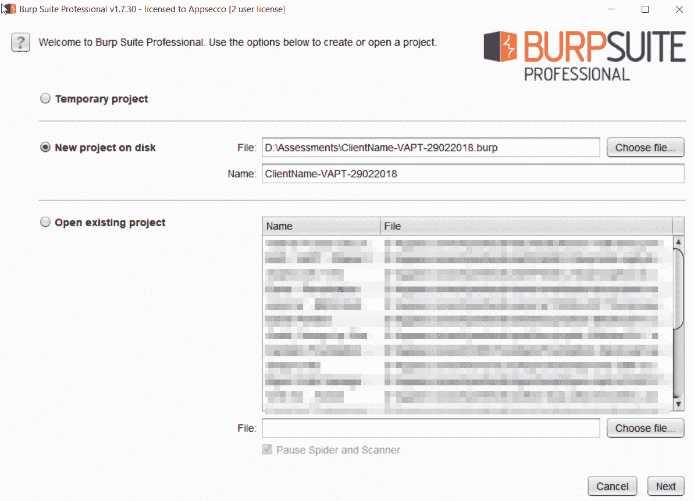
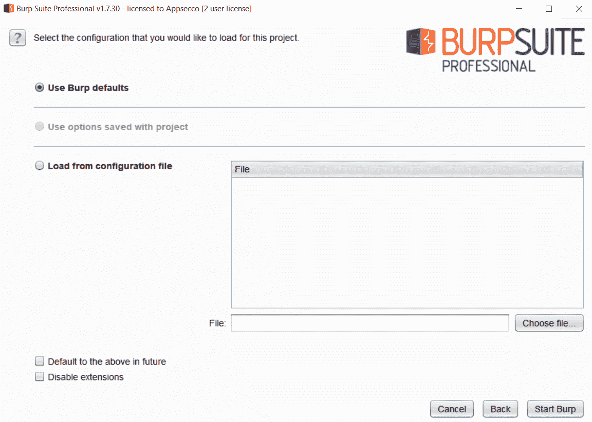
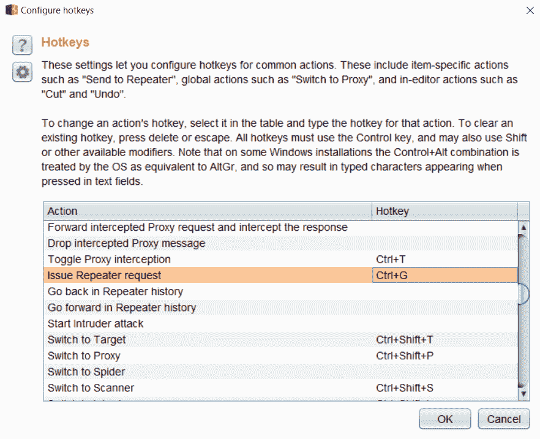

# 一、配置 BurpSuite

在开始应用渗透测试之前，必须准备好用于攻击最终应用的系统。这涉及到将 BurpSuite 配置为各种客户端和流量源的拦截代理。

与目标范围一样，减少我们收集的数据中的噪音也很重要。我们将使用目标白名单技术，并使用 Burp 目标特性来过滤和减少测试现代应用可能带来的混乱。

Burp，或 Burp Suite，是一种用于测试 web 应用安全缺陷的图形工具。该工具是用 Java 编写的，由 Dafydd Stuttard 以 PortSwigger 的名义创建。BurpSuite 现在由他的公司 PortSwigger 积极开发。。。

# 了解 BurpSuite

可从 PortSwigger 网站[下载所有主要操作系统的 Burphttps://portswigger.net/burp](https://portswigger.net/burp) 。对于 Windows 系统，x64 位和 x32 位安装程序都可用。如果您想将 Burp 作为一个可移植的应用运行，还可以使用一个独立的 JavaJAR 文件。



启动 BurpSuite 时，系统将提示您提供设置，以便在开始使用该工具之前设置 Burp 项目。

三个可用选项如下：

*   临时项目：如果要使用 Burp 进行快速检查或执行不需要保存的任务，请选择此选项。选择此选项并单击“下一步”后，您可以立即开始。
*   磁盘上的新项目：对于执行良好的渗透测试，能够记录和检索作为测试一部分的请求和响应日志非常重要。此选项允许您在磁盘上创建一个文件，该文件将存储开始测试时在 Burp 中设置的所有配置数据、请求和响应以及代理信息。可以提供描述性名称，以便将来加载此文件。一个好的经验法则是创建一个提供项目本身信息的名称。**ClientName TypeOfTest ddmmyyyyy**是一个好名字。
*   打开现有项目：此选项允许您加载以前使用“磁盘上新建项目”选项创建的任何现有项目文件。您可以选择暂停 spider 和 scanner 模块，以便在非活动攻击状态下加载项目。

单击“下一步”将进入一个页面，在该页面中，您可以选择之前的任何保存配置或继续使用 Burp 默认值。您还可以选择在 Burp 开始时禁用扩展。



单击开始 Burp 以继续。

# 设置代理侦听器

使用 BIP 作为应用渗透测试的工具，它必须被设置为一个中间的人 T1（St2）。MITM 代理位于客户机和服务器之间，允许用户篡改或删除通过的消息。在其最简单的形式中，Burp Suite 是 HTTP（S）流量的 MITM 代理。


默认情况下，Burp 将在`127.0.0.1`本地主机 IP 上的端口`8080`上侦听。但是，可以很容易地将其更改为系统上任何可用 IP 地址上的任意空闲端口。要执行此操作，请执行以下步骤：

1.  导航到代理|选项选项卡。
2.  在代理侦听器下，确认在。。。

# 管理多个代理侦听器

如果需要，BurpSuite 可以提供多个代理侦听器接口。这仅仅意味着 Burp 可以同时在不同的端口和不同的 IP 地址上启动侦听器，每个端口都有自己的配置和设置。

例如，如果您正在测试的厚客户端应用具有多个组件，其中一些组件可以配置为使用代理，而另一些组件则不能，或者如果其通信端口是硬编码的，或者如果需要捕获来自基于网络的浏览器或服务的流量，则多个代理侦听器，每个都具有自己的配置，可以创建。


如果需要，只需取消选中接口名称旁边的复选框，即可禁用代理侦听器。接下来，我们将了解非代理感知客户端的工作。

# 使用非代理感知客户端

在此上下文中，非代理感知客户机是一个发出 HTTP 请求但无法轻松配置代理选项或根本不支持代理的客户机。

非代理感知客户端的常见示例是厚客户端应用或不使用浏览器代理选项的浏览器插件。Burp 对不可见代理的支持允许非代理感知的客户端直接连接到代理侦听器。这允许 Burp 根据目标映射拦截和修改流量。

在体系结构上，这是通过为非代理感知客户端与之通信的远程目标设置本地 DNS 条目来实现的。可以在本地主机文件中创建此 DNS 条目，如下所示：

```
127.0.0.1 example.org
```

客户。。。

# 在 BurpSuite 中创建目标作用域

目标范围设置可在目标范围选项卡下找到。这允许您为当前正在执行的渗透测试配置范围内目标。

将项目添加到目标范围允许您在整个 Burp 过程中影响功能的行为。例如，您可以执行以下操作：

*   可以将显示过滤器设置为仅显示范围中的项。这在 Target | Site map（目标站点地图）和 Proxy | History（代理历史）下提供，在处理使用大量第三方代码的应用时非常有用。
*   Spider 模块仅限于范围内目标。
*   您可以将代理配置为仅截获范围内项目的请求和响应。
*   在 Burp 的专业版本中，您甚至可以自动启动范围内项目的漏洞扫描。

添加范围项基本上有两种方法。第一种也是推荐的方法是从代理历史记录中获取目标。为此，采取以下方法：

1.  设置浏览器并 Burp，以便彼此交谈。
2.  在 Burp 中关闭拦截模式并浏览应用。

从主页开始浏览每个链接；登录到认证区域并注销；提交每份表格；导航到`robots.txt`中列出的每个路径，以及应用站点地图中的每个链接（如果可用）；并且，如果适用，可以作为不同的用户（具有相同或不同的权限级别）访问应用。

执行此操作将填充应用的站点地图，如目标|站点地图选项卡下所示，如以下屏幕截图所示：


在站点地图选项卡中填充目标和 URL 后，您可以右键单击任何项目并将该项目添加到范围中。这可以通过目标站点地图或代理历史选项卡来完成。


第二种方法是直接向 Target | Scope 选项卡添加项。选中“使用高级范围控制”以启用用于范围添加的旧接口，这允许对范围条目进行更精细的控制。

让我们举一个例子，创建一个虚拟渗透测试的范围。假设范围内的应用在`http://mutillidae-testing.cxm/`。通过使用 Target | Scope 选项卡，我们可以通过设置以下内容将此应用以及所有将来的 URL 添加到作用域中：

*   协议：HTTP
*   主机或 IP 范围：`mutillidae-testing.cxm`
*   端口：`^80$`
*   档案：`^*`


这将把应用和端口`80`上的任何 URL 以及 HTTP 协议添加到作用域中。

您还可以通过 Target | scope 页面上的 load（加载）按钮加载包含需要在作用域中的 URL 列表的文件。此列表必须是用换行符分隔的 URL/目标。加载大型文件可能需要一段时间，Burp 可能会暂时冻结，但在加载和解析文件后会恢复工作。

# 处理目标排除

正如我们可以在 Burp 中将项目添加到范围中一样，我们也可以添加需要显式设置在范围之外的项目。这与范围内项目一样，可以通过两种方法添加。第一种是通过右键单击上下文菜单中的“代理历史记录”选项卡：


第二个来自范围排除部分中的目标范围选项卡。例如，如果要排除`/javascript`下的所有子目录和文件，则可以应用以下选项：

*   协议：HTTP
*   主机或 IP 范围：`mutillidae-testing.cxm`
*   端口：`^80$`
*   档案：`^/javascript/.*`

这将排除…上`/javascript/`目录下的所有 URL。。。

# 开始前的快速设置

本节重点介绍了在开始测试之前可以启用/设置/配置的五种快速设置，以立即提高效率：

*   **启用服务器响应拦截**：默认情况下，Burp 未配置为拦截服务器响应。但是，可以使用代理选项下的拦截服务器响应选项启用此功能。在请求|被修改和请求|被截获时启用响应截获。


*   **启用取消隐藏表单字段并选择突出显示未隐藏字段选项**：可在代理选项响应修改面板下找到。这在浏览存储或使用隐藏 HTML 表单字段来做出应用决策的应用时非常有用。


隐藏字段在页面上可见，并突出显示，允许您在需要时直接在页面中编辑内容。


*   **启用“如果超出范围，则不将项目发送到代理历史记录或其他 Burp 工具”选项**：该选项可在“代理”|选项|杂项”下找到。启用时，此选项可防止 Burp 向代理历史记录和其他 Burp 工具（如扫描仪和目标）发送超出范围的请求和响应。这些请求和响应会被发送和接收，但不会记录在 Burp 的任何功能集中。


*   **设置键盘快捷键以发出中继器请求**：这是一个非常有用的设置，可以在使用 Burp 的中继器模块时避免使用鼠标点击 Go 按钮。Burp 已经允许使用*Ctrl*+*R*通过代理历史选项卡将项目发送到中继器。通过*Ctrl*+*Shift*+*R*可以切换到中继器窗口。添加一个使用 Repeater 发送请求的快捷方式，完成了从代理历史记录中选择项目并向前发送所需的按键链。



*   **调度保存状态操作**：Burp 有一个任务调度程序，可以为某些任务调用，例如恢复和暂停扫描和爬升。您可以通过项目选项|杂项|计划任务访问任务计划程序。
*   任务调度器支持的关键操作之一是自动保存状态。选择“保存状态”，然后单击“下一步”：


# 总结

在本章中，我们学习了如何准备 Burp Suite 应用。我们将 BurpSuite 配置为各种客户端和流量源的拦截代理。在下一章中，我们将学习如何配置客户端和设置移动设备。