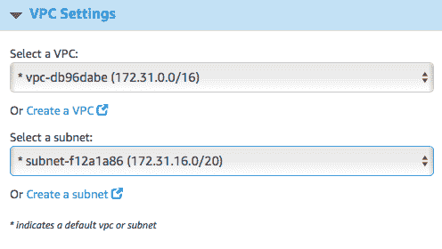
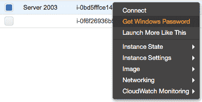
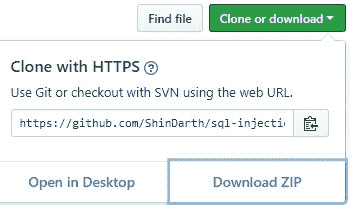
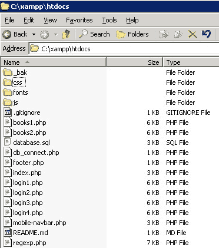

# 在 AWS 上建立 Pentesting 实验室

本章旨在帮助无法直接访问渗透测试目标的渗透测试人员在 AWS 内建立易受攻击的实验室环境。该实验室将允许测试人员在 Kali 中使用多种工具，使用 Metasploit 和基本扫描以及漏洞评估来实践各种攻击技术。本章重点介绍在 AWS 上设置易受攻击的 Linux 虚拟机和通用 Windows 虚拟机，将它们放在同一网络上。

在本章中，我们将介绍以下主题：

*   建立个人测试实验室，在云上进行黑客攻击
*   配置和保护虚拟实验室以防止意外访问

# 技术要求

在本章中，我们将使用以下工具：

*   该死的易受攻击的 Web 应用程序
*   **非常安全的文件传输协议守护程序**（**vsftpd**版本）2.3.4

# 设置易受攻击的 Ubuntu 实例

作为我们将要创建的两台易受攻击的机器中的第一台，易受攻击的 Ubuntu 实例将包含一个易受攻击的 FTP 服务以及一些其他服务。

# 设置 Ubuntu EC2 实例

在云中设置易受攻击实验室的第一步是提供一个运行易受攻击操作系统的实例。为此，我们可以使用 Ubuntu LTS 版本。这可以从 AWS 市场访问，以便快速部署。

为此，我们将使用 Ubuntu 16.04：


单击 Continue to Subscribe 按钮后，系统会提示我们配置要启动的实例。由于这是一个非常标准的图像，我们将继续使用默认设置，区域和专有网络设置除外。

对于区域，可以使用离您最近的 AWS 区域。但是，请记住，您在 AWS 上创建的所有其他实例都需要托管在同一地区，否则它们不能是同一网络的一部分。

对于 VPC，请确保记下用于设置此实例的 VPC 和子网 ID。我们需要将它们重新用于实验室中的所有其他主机。在这种情况下，我将使用以下方法：



需要注意的是，VPC ID 和子网 ID 对于每个人都是唯一的。完成后，我们可以通过单击 1-Click 按钮启动来继续部署 EC2 实例。

完成后，下一步是使用以下命令 SSH 到新创建的 VM 中：

```
ssh -i <pem file> <IP address of the instance>
```

连接后，运行以下命令：

```
sudo apt-get update && sudo apt-get dist-upgrade
```

这些命令将更新存储库列表和实例上安装的所有包，因此我们不必处理任何旧包。

# 在 Ubuntu 上安装易受攻击的服务

对于这个 Ubuntu 主机，我们将安装一个易受攻击的 FTP 服务器版本`vsftpd`。发现此 FTP 软件的 2.3.4 版存在后门。在本章中，我们将安装这个后门版本，然后将尝试使用我们将在下一章中设置的 pentesting box 来识别它，最后我们将利用它。

为了让事情变得更简单，`vsftpd 2.3.4`的后门版本被归档在 GitHub 上。我们将使用该代码库安装易受攻击的软件。首先，我们需要克隆`git`存储库：

```
git clone https://github.com/nikdubois/vsftpd-2.3.4-infected.git
```

接下来，我们需要安装用于设置主构建环境的软件包。为此，我们运行以下程序：

```
sudo apt-get install build-essential
```

现在，我们将`cd`放入`vsftpd`文件夹，从源代码构建它。然而，在这样做之前，我们需要对`Makefile`做一个小的修改。需要添加`-lcrypt`值作为链接器标志：


完成后，保存文件并运行`make`。

如果一切顺利，我们将在同一文件夹中看到一个`vsftpd`二进制文件：


接下来，我们需要在安装`vsftpd`之前设置一些先决条件。也就是说，我们需要添加一个名为`nobody`的用户和一个名为`empty`的文件夹。为此，请运行以下命令：

```
useradd nobody
mkdir /usr/share/empty
```

完成后，我们可以通过执行以下命令来运行安装：

```
sudo cp vsftpd /usr/local/sbin/vsftpd
sudo cp vsftpd.8 /usr/local/man/man8
sudo cp vsftpd.conf.5 /usr/local/man/man5
sudo cp vsftpd.conf /etc
```

完成后，我们需要执行`vsftpd`二进制文件以确认是否可以连接到`localhost`：


下一步是设置对 FTP 服务器的匿名访问。为此，我们需要运行以下命令：

```
mkdir /var/ftp/
useradd -d /var/ftp ftp
chown root:root /var/ftp chmod og-w /var/ftp

```

最后，通过对`/etc/vsftpd.conf`进行以下更改来启用对`vsftpd`服务器的本地登录：


# 设置易受攻击的 Windows 实例

通过设置脆弱的 Linux 服务器，我们现在通过 Windows Server（即运行脆弱的 Web 应用程序）设置攻击向量。该应用程序应提供两个环境，没有实际测试环境的读者可以尝试使用。

# 设置易受攻击的 Windows 服务器实例

对于此实验室主机，我们将使用 AWS Marketplace 中的 Server 2003 实例：


配置步骤与我们之前设置 Linux 实例的步骤几乎相同。应注意 VPC 设置与我们在上一个实例中使用的类似。这将允许我们稍后将虚拟机配置为位于同一网络上。

在验证 VPC 设置和区域后，我们将继续像前面一样启动该实例。最后，我们设置了我们一直使用的密钥对，我们可以继续使用了。一旦实例启动，我们需要遵循稍微不同的过程来远程访问 Windows 实例。由于**远程桌面协议**（**RDP**）不支持基于证书的身份验证，我们需要提供私钥进行解密并获取登录所使用的密码。只需右键单击实例并选择 Get Windows Password（获取 Windows 密码）：



在以下屏幕上，我们需要上载先前下载的私钥：


完成后，只需单击 Decrypt Password（解密密码）即可为我们提供密码，我们可以使用该密码将 RDP 发送到 Windows server 实例中。完成后，只需启动远程桌面并使用显示的凭据连接到 IP 地址。

登录后，下一步是在 Windows 服务器上设置 XAMPP，以便在服务器上托管易受攻击的网站。但在我们继续之前，我们需要在服务器上安装最新版本的 Firefox，因为 Windows server 2003 附带的 Internet Explorer 版本非常旧，不支持某些网站配置。要下载 XAMPP，只需访问[https://www.apachefriends.org/download.html](https://www.apachefriends.org/download.html) 并下载为 XP 和 Windows Server 2003 构建的版本：


请注意，您需要向下滚动并下载正确版本的 XAMPP：


最后，我们需要遵循默认的安装过程，我们将安装一个 PHP、Apache 和 MySQL 的工作安装，以及一些管理网站所需的实用程序

# 在 Windows 上配置易受攻击的 web 应用程序

在本节中，我们将为 pentesting 实验室设置一个极易受攻击的 web 应用程序。首先，让我们通过访问`C:\xampp\htdocs`来清除 XAMPP 托管文件夹。

创建一个名为`_bak`的新文件夹，并将所有现有文件剪切粘贴到该文件夹中。现在，让我们下载易受攻击网站的源代码。为此，我们将使用 GitHub 上提供的众多易受攻击的 PHP 示例之一：[https://github.com/ShinDarth/sql-injection-demo/](https://github.com/ShinDarth/sql-injection-demo/) 。

获取文件的最快方法是直接下载 ZIP 文件：



下载源代码

下载后，只需将 ZIP 文件的内容复制到`C:\xampp\htdocs`文件夹中即可。如果操作正确，文件结构应该是这样的：



文件结构

完成后，下一步是为应用程序创建数据库并将数据导入其中。为此，您需要访问 phpMyAdmin 接口，该接口可在`http://127.0.0.1/phpmyadmin`访问。在此之后，选择“最近”下的“新建”选项：


在这里，我们创建了一个名为`sqli`的新数据库：


接下来，要将数据导入到新创建的数据库中，我们进入导入选项卡并浏览到刚才提取到`htdocs`文件夹中的`database.sql`文件：


单击 Go 后，我们将看到一条成功消息。现在，如果我们在浏览器中浏览到`http://127.0.0.1`，我们将能够访问易受攻击的网站：


祝贺您，您已在 Windows 服务器上成功配置了易受攻击的 web 应用程序！下一步将是在我们的 VPC 内设置网络规则，以便从其他 EC2 实例访问易受攻击的主机。

# 在实验室内配置安全组

现在我们已经设置了两个易受攻击的服务器，下一步是配置网络，以便外部人员无法访问我们的 web 应用程序，同时，其他实验室机器可以相互通信。

# 配置安全组

我们最初将所有 EC2 实例都设置在同一个 VPC 上。这意味着 EC2 实例将位于同一子网上，并且能够通过内部 IP 地址相互通信。但是，AWS 不希望允许同一 VPC 上的所有 4096 个地址相互通信。因此，默认安全组不允许 EC2 实例之间的通信。

要允许从 Ubuntu 实例到 Windows 实例的连接（您可以对 Kali 实例重复这些步骤，将在下一章中进行设置），第一步是获取 Ubuntu 主机的私有 IP 地址：


显示专用 IP 的描述选项卡

接下来，我们需要修改第一个 Windows 实例的安全组规则。这非常简单，只需单击摘要窗格中的安全组名称即可进入安全组屏幕：


安全组屏幕

现在，我们只需单击 Edit 按钮并添加允许来自 Kali Linux 实例的所有流量的规则：


完成后，只需保存此配置。为了确认 Kali 现在可以与 Windows 服务器通信，让我们运行一个`curl`命令，查看站点是否可以访问：

```
curl -vL 172.31.26.219
```

请确保将 IP 地址替换为 Windows 的 IP 地址。如果一切顺利，应该有一堆 JavaScript 作为响应：


在下一章中，一旦设置了 Kali PentestBox，就可以使用前面的步骤将 Ubuntu 和 Windows 服务器实例上的 Kali Linux IP 地址列为白名单，这样我们就可以开始攻击实验室环境了！

# 总结

在本章中，我们建立了一个实验室，可以证明它对初学者渗透测试人员非常有用，因为他们无法访问测试环境或亲自接触实验室。在我们的实验室中，我们建立了一个运行有漏洞服务的 Ubuntu 主机，我们还建立了一个运行有漏洞 web 应用程序的 Windows 服务器主机。这代表了任何环境中攻击的两个最大表面区域。此外，我们还经历了在目前已设置的各种实例之间建立网络连接的过程。通过这些步骤，用户可以在云中设置任何操作系统实例，设置安全组以配置网络，并防止未经授权的访问。

在下一章中，我们将介绍如何设置 Kali PentestBox，使用它我们可以对已设置的两个易受攻击的 EC2 实例执行扫描、枚举和利用。

# 进一步阅读

*   漏洞和漏洞数据库：[https://www.rapid7.com/db/modules/exploit/unix/ftp/vsftpd_234_backdoor](https://www.rapid7.com/db/modules/exploit/unix/ftp/vsftpd_234_backdoor)
*   亚马逊虚拟私有云（用户指南）：[https://docs.aws.amazon.com/AmazonVPC/latest/UserGuide/VPC_Introduction.html](https://docs.aws.amazon.com/AmazonVPC/latest/UserGuide/VPC_Introduction.html)