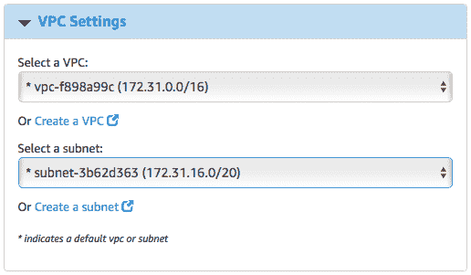
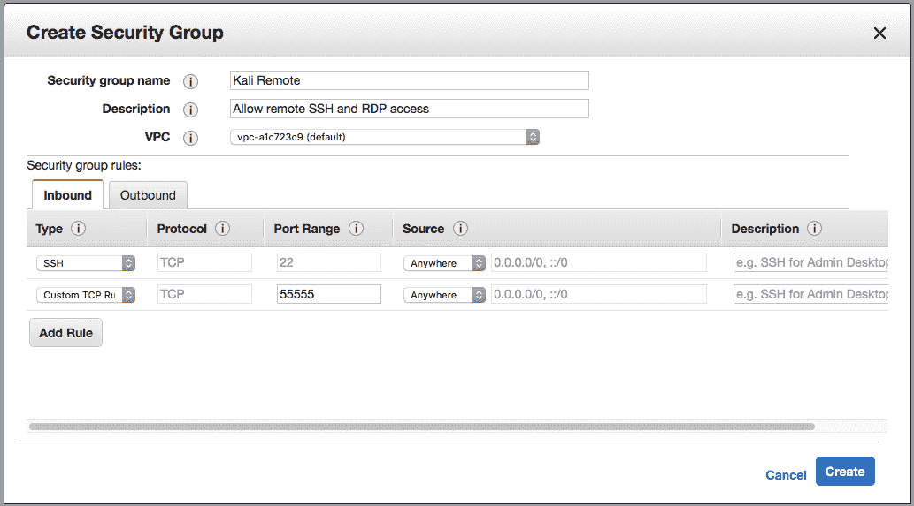
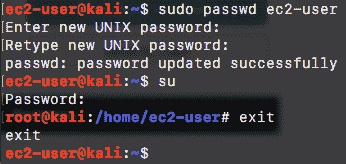
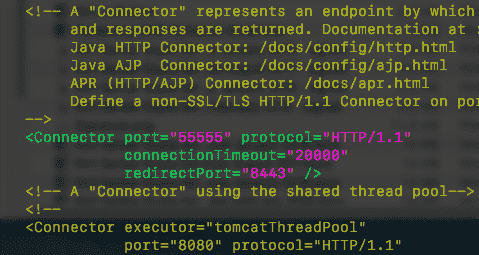
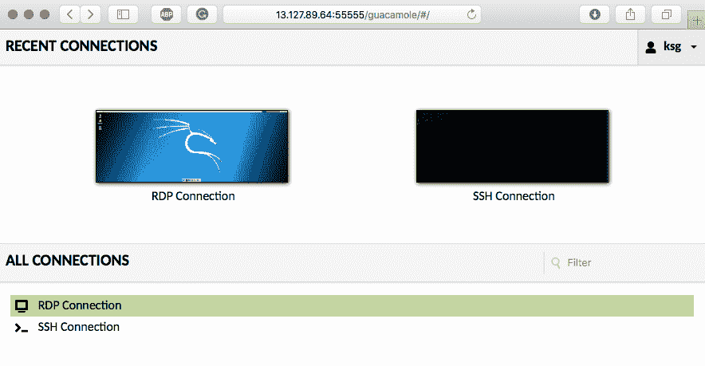

# 在云上设置 Kali PentestBox

有一个现成的**亚马逊机器映像**（**AMI**），在亚马逊市场上运行 Kali Linux。这意味着渗透测试人员可以在 Amazon 云上快速设置 Kali Linux 实例，并随时访问该实例进行任何类型的渗透测试。本章重点介绍如何创建一个 AmazonEC2 实例，使用 KaliLinuxAMI 进行设置，并通过多种方式配置对此主机的远程访问。一旦设置，渗透测试人员可以远程访问属于 AWS 帐户的**虚拟私有云**（**VPC**），并使用 Kali 在该 VPC 内和任何远程主机上执行测试。

在本章中，我们将了解以下内容：

*   如何在 Amazon 云上运行 Kali Linux
*   通过 SSH 远程访问 Kali
*   通过无客户端 RDP 远程访问 Kali

# 技术要求

在本章中，我们将使用以下工具：

*   AWS EC2 实例
*   卡利 Linux
*   阿帕奇鳄梨酱（[https://guacamole.apache.org](https://guacamole.apache.org) ）
*   SSH 客户端和浏览器

# 在 AWS EC2 上设置 Kali Linux

在本节中，我们将介绍在云上设置虚拟渗透测试机的第一步，以及设置对它的远程访问以在移动中执行渗透测试。渗透测试机将与[第 1 章](01.html)、*在 AWS*上设立渗透测试实验室中设立的渗透测试实验室齐头并进，允许您在这些主机上执行渗透测试和利用。

# Kali Linux AMI

AWS 提供了一个引人入胜的功能，允许在亚马逊云上快速部署**虚拟机**（**虚拟机**）-**亚马逊机器映像**（**AMIs**）。它们充当模板，允许用户在 AWS 上快速设置新的 VM，而无需像在传统 VM 上那样手动配置硬件和软件。然而，这里最有用的特性是 AMI 允许您完全绕过 OS 安装过程。因此，决定需要什么操作系统以及在云上获得一个功能完整的虚拟机所需的总时间减少到几分钟和几次点击。

Kali Linux AMI 是最近添加到 AWS 商店的，我们将利用它在 Amazon 云上快速设置我们的 Kali VM。使用现成的 AMI 设置 Kali 实例非常简单，我们从 AWS 市场访问 Kali Linux AMI 开始：


上一个屏幕截图显示了以下信息：

*   我们正在使用的 AMI 版本（2018.1）
*   在默认实例中运行此操作的典型总价
*   AMI 的概述和详细信息

值得注意的是，Kali Linux 的默认推荐实例大小为 t2.medium，如定价信息中所示：


进一步往下看，我们可以看到 t2.medium 实例的大小由两个 CPU 虚拟内核和 4GiB RAM 组成，这对于我们的设置来说已经足够了：


一旦我们确认正在根据我们的要求设置映像，我们就可以继续并单击 Continue to Subscribe 选项继续我们的实例。

# 配置 Kali Linux 实例

在上一节中，我们确认了我们将使用的 AMI 以及我们将用于启动 Kali 机器的机器的规格。一旦被选中，是时候启动我们的机器了。

这就把我们带到了 EC2 页面上的发布。其中包含一些需要设置的选项：

*   **我们将****使用的 AMI 版本**：通常建议使用市场上最新版本的 AMI。通常，这不是 Kali Linux 默认选择的选项。在撰写本文时，最新版本为 2018.1，构建日期为 2018 年 2 月，如下所示：


自 2019.1 发布以来，现在您需要下载最新版本的 Kali linux

*   **我们将部署实例**的区域：如[第 1 章](01.html)中所述，在 AWS 上建立一个 Pentesting Lab，我们需要将该区域设置为地理上最接近当前位置的数据中心。
*   **EC2 实例大小**：**在上一步已经验证过。在本书后面的章节中，我们将更深入地研究各种实例类型和大小。**
***   **专有网络设置**：**专有网络和子网设置需要设置为使用[第一章](01.html)、*在 AWS*上设置渗透测试实验室时使用的专有网络。这将使我们的黑客箱与我们先前设置的易受攻击的机器位于同一网络上。该设置应与上一章中配置的内容相匹配：****

 ****

*   **安全组**：之前我们设置安全组的方式是，未经授权的外部人员无法访问实例。但是，在这种情况下，我们需要允许远程访问我们的 Kali 实例。因此，我们需要将 SSH 和 Guacamole 远程访问端口转发到一个新的安全组：



*   **密钥对**：**我们可以使用[第 1 章](01.html)、*在 AWS*上建立测试实验室时创建的相同密钥对。**

 **有了这些设置，我们就可以开始了，只需单击一次启动即可启动实例：


AWS 随后将启动 Kali 机器并为其分配公共 IP。但是，我们需要能够访问这台机器。在下一节中，我们将看到如何使用 OpenSSH 访问 Kali 机器。

# 为远程 SSH 访问配置 OpenSSH

AWS 已经通过使用公钥的`ec2-user`帐户为他们的 Kali AMI 设置了默认形式的 SSH 访问。然而，这对于通过移动设备访问并不方便。对于希望使用 root 权限直接从移动应用程序方便地 SSH 到其 Kali 实例的用户，以下部分将介绍整个过程。但是，应该注意的是，使用具有 PKI 身份验证的有限用户帐户是通过 SSH 进行连接的最安全的方式，如果优先保护实例，则不建议使用具有密码的根帐户。

# 设置根用户密码和用户密码

在 Kali Linux 实例上配置 root SSH 的第一步是设置 root 密码。根帐户通常没有为使用具有`sudo`权限的`ec2-user`帐户的`ec2`实例设置密码。但是，由于我们正在设置来自移动 SSH 应用程序的 SSH 访问，因此需要进行设置。然而，应该注意的是，这是随着卡利实例的安全立场的降低而来的。

更改根密码只需在 SSH 终端上运行`sudo passwd`即可：


同样，通过 SSH 运行`sudo passwd ec2-user`也可以更改当前用户的密码：



这将有助于从不支持身份验证密钥的 SSH 客户端应用程序中以`ec2-user`的形式进行 SSH 加密。但是，在我们能够以 root 身份 SSH 到 Kali 实例之前，还有另一个步骤。

# 在 SSH 上启用 root 和密码身份验证

作为一种增强的安全措施，OpenSSH 服务器在默认情况下禁用了 root 登录。启用这是一个简单的过程，涉及编辑配置文件`/etc/ssh/sshd_config`：


这其中的关键部分是两个条目：

*   permitrotlogin：如果您想以 root 用户身份登录，可以将其设置为`yes`
*   PasswordAuthentication：需要设置为`yes`而不是默认的`no`才能使用密码登录。

完成更改后，需要重新启动 ssh 服务：

```
sudo service ssh restart
```

这样，我们的 Kali 机器就可以在云端启动并运行，并且可以通过 SSH 使用密码进行访问。但是，SSH 只提供一个命令行界面。

在下一节中，我们将了解如何设置远程桌面服务以获得对 Kali 机器的 GUI 访问。

# 为远程访问设置鳄梨酱

ApacheGuacamole 是一种无客户端远程访问解决方案，允许您使用浏览器远程访问 Kali Linux 实例。这将允许您在移动设备上随时随地访问 PentestBox，而无需担心远程访问带来的其他复杂问题。访问此类服务器的传统方式是通过 SSH，但当从移动设备访问时，这将无法提供 GUI。

# 强化和安装先决条件

设置对 VM 的远程访问可能是一件危险的事情，因此建议我们安装并设置防火墙和 IP 黑名单服务，以防止互联网上的暴力强迫攻击和类似攻击。我们将安装的服务为`ufw`和`fail2ban`。它们很容易设置：

1.  您只需运行以下命令：

```
sudo apt-get install ufw fail2ban
```

2.  一旦我们安装了`ufw`防火墙，我们需要允许将用于远程访问的两个端口：`22`用于 SSH，`55555`用于鳄梨酱。因此，我们需要运行以下命令：

```
sudo ufw allow 22
sudo ufw allow 55555
```

3.  完成后，我们需要重新启动`ufw`服务：


4.  接下来，我们需要安装 ApacheGuacamole 的先决条件。可以通过执行以下命令来执行此操作：

```
sudo apt-get install build-essential htop libcairo2-dev libjpeg-dev libpng-dev libossp-uuid-dev tomcat8 freerdp2-dev libpango1.0-dev libssh2-1-dev libtelnet-dev libvncserver-dev libpulse-dev libssl-dev libvorbis-dev
```

5.  安装后，我们需要修改 Apache Tomcat 的配置以侦听端口`55555`（在我们的安全组中设置），而不是默认的`8080`。为此，我们需要运行以下命令：

```
sudo nano /etc/tomcat8/server.xml
```

6.  在此文件中，`Connector port`需要从`8080`更改为`55555`，如下图所示：



7.  接下来，我们需要在 Kali 实例上设置 RDP 服务。这可以通过使用以下命令安装`xrdp`轻松实现：

```
sudo apt install xrdp
```

8.  接下来，我们需要允许所有用户访问 RDP 服务（X 会话）。这需要编辑文件：

```
sudo nano /etc/X11/Xwrapper.config
```

9.  在此文件中，编辑`allowed_users`到`anybody`的值：

```
allowed_users=anybody
```

10.  最后，我们需要设置`xrdp`服务自动启动，`enable`服务：

```
sudo update-rc.d xrdp enable
sudo systemctl enable xrdp-sesman.service
sudo service xrdp start
sudo service xrdp-sesman start
```

11.  完成此步骤后，我们必须从[下载 Apache Guacamole 服务器的源代码 https://guacamole.apche.org/releases/](https://guacamole.apache.org/releases/) 。

请记住，您需要下载最新的`guacamole-server.tar.gz`和`guacamole.war`文件。撰写本文时，最新版本为`0.9.14`，我们可以使用以下命令下载：

```
wget http://mirrors.estointernet.in/apache/guacamole/1.0.0/source/guacamole-server-1.0.0.tar.gz
wget http://mirrors.estointernet.in/apache/guacamole/1.0.0/binary/guacamole-1.0.0.wa
```

12.  下载这些文件后，我们需要通过执行以下代码来提取源代码：

```
tar xvf guacamole-server.tar.gz
```

13.  进入解压目录后，我们必须构建并安装包。这可以通过执行以下代码来实现：

```
CFLAGS="-Wno-error" ./configure --with-init-dir=/etc/init.d
make -j4
sudo make install
sudo ldconfig
sudo update-rc.d guacd defaults
```

14.  一旦成功运行，就安装了鳄梨酱。但是，需要进行进一步的配置，以便完全设置远程访问。

# 为 SSH 和 RDP 访问配置鳄梨酱

鳄梨酱的默认配置目录是`/etc/guacamole`。需要正确创建名为`guacamole.properties`的文件才能正常工作。我们可能希望在配置目录中放置一些其他目录，但当前设置不需要这些目录。

1.  鳄梨酱属性文件应包含有关`guacamole proxy`地址的信息：

```
# Hostname and port of guacamole proxy
guacd-hostname: localhost
guacd-port:     4822
```

2.  除此之外，我们还需要在同一目录中另一个名为`user-mapping.xml`的文件，其中包含 Guacamole 将使用的用户名和密码列表：

```
<user-mapping> <authorize username="USERNAME" password="PASSWORD">
 <connection name="RDP Connection"> <protocol>rdp</protocol> <param name="hostname">localhost</param> <param name="port">3389</param>
 </connection>
 <connection name="SSH Connection"> <protocol>ssh</protocol> <param name="hostname">localhost</param> <param name="port">22</param>
 </connection> </authorize>
</user-mapping>
```

3.  完成后，是时候部署我们先前下载的 war 文件了。我们需要将其移动到`tomcat8/webapps`文件夹中，以便自动部署：

```
mv guacamole-0.9.14.war /var/lib/tomcat8/webapps/guacamole.war
```

4.  现在，我们只需重新启动`guacd`和`tomcat8`服务即可启动并运行 Apache Guacamole！为此，请使用以下命令：

```
sudo service guacd restart
sudo service tomcat8 restart
```

5.  最后一个配置步骤是将身份验证信息复制到 Guacamole 客户机目录中。这是通过执行以下代码来完成的：

```
mkdir /usr/share/tomcat8/.guacamole
ln -s /etc/guacamole/guacamole.properties /usr/share/tomcat8/.guacamole
```

6.  现在，如果我们将浏览器指向`ipaddr:55555/guacamole`，我们将能够访问鳄梨酱！我们将看到以下屏幕：


7.  我们必须使用在`user-mapping.xml`文件中设置的相同凭据登录。
8.  成功登录后，只需选择访问服务器的技术：



恭喜你，你已经成功地在云上设置了 Kali PentestBox，并且可以使用浏览器从任何地方远程访问它！

# 总结

读完本章后，您将能够在 Amazon 云上成功设置 Kali Linux PentestBox，这将有助于您在接下来的章节中进行练习。我们学习了如何通过 SSH、RDP 和 ApacheGuacamole 设置对云实例的远程访问。本章还重点介绍了有关云实例强化的某些信息，这些信息将帮助您更好地理解本书中与 EC2 服务相关的几个高级安全概念。

在下一章中，我们将使用本章中设置的 PentestBox，完成 pentesting 实验室（我们在第一章中设置）的自动和手动 pentests 的步骤。

# 问题

1.  使用鳄梨酱进行远程访问比使用`tightvnc`这样的服务有什么好处？
2.  使用当前设置，任何知道 IP 地址的人都可以轻松访问鳄梨酱接口。有没有办法保护服务器不受这种访问？
3.  在编写鳄梨酱的过程中添加的`-Wno-error`标志的目的是什么？
4.  为什么默认的`sshd_config`将 permitrotlogin 值设置为`no`？
5.  为什么 AWS 禁用基于密码的登录？
6.  我们可以使用 SSH 隧道来提高此设置的安全性吗？

# 进一步阅读

*   SSH 隧道：[https://www.ssh.com/ssh/tunneling/](https://www.ssh.com/ssh/tunneling/)
*   SSH 中的 PKI:[https://www.ssh.com/pki/](https://www.ssh.com/pki/)
*   代理鳄梨酱：[https://guacamole.apache.org/doc/gug/proxying-guacamole.html](https://guacamole.apache.org/doc/gug/proxying-guacamole.html)******