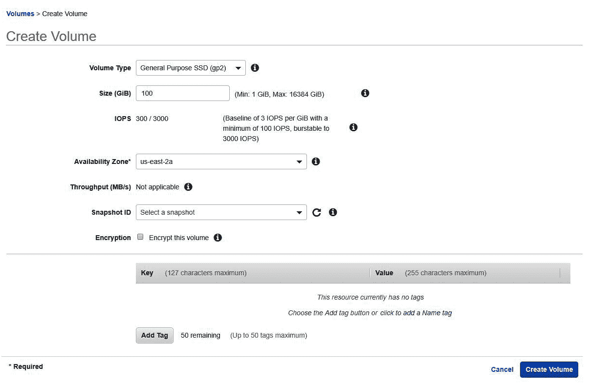
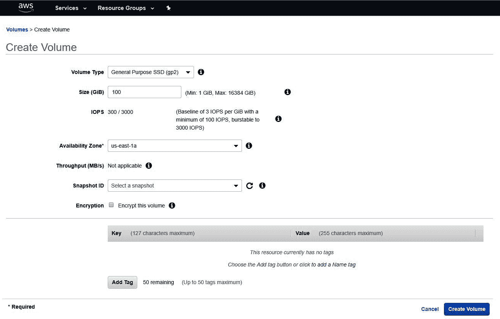
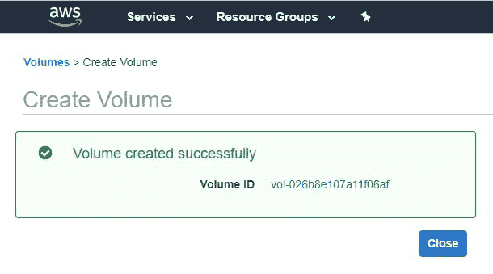

# 弹性块存储和快照-检索已删除的数据

本章向您介绍了通过 AWS 提供的不同类型的存储选项，扩展了[第 3 章](03.html)、*使用 Kali Linux*在云上进行开发所涵盖的信息。在这里，我们重点创建独立的**弹性块存储**（**EBS**卷），从多个 EC2 实例连接和分离，并装载分离的卷以从以前的 EC2 实例和 EBS 快照检索数据。本章还介绍了从 EBS 卷中删除数据的法医检索。这突出了针对 AWS 基础架构的攻击后流程的一个非常重要的部分，因为检查 EBS 卷和快照是访问密码等敏感数据的一种非常简单的方法。

在本章中，我们将介绍以下内容：

*   从 EC2 实例创建、附加和分离新 EBS 卷
*   加密 EBS 卷
*   在 EC2 实例中装载 EBS 卷以进行数据检索
*   从 EBS 卷提取已删除数据以查找敏感信息

# 技术要求

本章将使用以下工具：

*   侦探工具包（TSK）

# EBS 卷类型和加密

EBS 存储可大致分为两种不同的存储类型：**固态驱动器**（**SSD**）和**硬盘驱动器**（**硬盘驱动器**）：

*   SSD 支持的卷针对涉及频繁读/写操作且 I/O 大小较小的事务性工作负载进行了优化，其中主要性能属性为每秒**I/O 操作数**（**IOPS**。

*   HDD 支持的卷针对大型流式工作负载进行了优化，其中吞吐量（以 MiB/s 为单位）是比 IOPS 更好的性能指标。

EBS 有四种主要的存储类型，每种类型都适用于特定的用例：

*   **通用 SSD（GP2）卷**：**这些是经济高效的存储解决方案，适用于各种工作负载的通用用途。这些卷可以在较长时间内维持 3000 IOPS，最低为 100 IOPS，最高为 10000 IOPS。GP2 卷提供了非常低的延迟级别，可以以每 GB 3 IOPS 的速度扩展。一个 GP2 卷可以分配 1 GB 到 16 TB 的空间。**
***   **配置的 IOPS SSD（IO1）卷**：这些卷比 GP2 卷快得多，提供的性能也高得多。IO1 卷可以维持 100 到 32000 IOPS，是 GP2 的三倍多。这种类型的存储设计用于 I/O 密集型操作，如数据库。AWS 还允许您在创建 AWS 可以一致交付的 IO1 卷时指定 IOPS 速率。IO1 卷可以在最小 4 GB 到最大 16 TB 之间进行配置。*   **吞吐量优化 HDD（ST1）**：**ST1 是一种基于磁盘而非 SSD 的低成本存储解决方案。这些卷不能用作可引导卷；相反，它们最适合存储频繁访问的数据，如日志处理和数据仓库。这些卷的范围只能从最小 1 GB 到最大 1 TB。*****   **冷硬盘（SC1）**：虽然 SC1 卷与 ST1 卷类似，但其设计不用于保存频繁访问的数据。这些也是低成本的磁性存储卷，不能用作可引导卷。与 ST1 类似，这些卷的范围只能从最小 1 GB 到最大 1 TB。****

 ****# 从 EC2 实例创建、附加和分离新 EBS 卷

在本教程中，我们将学习如何创建、连接 EBS 卷并将其装载到 Ubuntu EC2 实例。然后，我们将创建和删除一些文件，分离这些文件，然后尝试提取删除的数据：

1.  转到 EC2 卷并创建一个新卷。在本练习中，我们将创建一个 8 GB 的附加卷大小：



如果希望对卷进行加密（这是可选的），请执行以下步骤：

2.  选择创建的卷，单击鼠标右键，然后选择“附加卷”选项。
3.  从实例文本框中选择 Ubuntu 实例：


4.  **将 shell**（**SSH**）保护到您的 Ubuntu 实例中，并使用以下命令列出可用磁盘：

```
lsblk
```

这将列出连接到实例的磁盘。在本例中，我们可以看到一个名为`/dev/xvdf`的设备。

5.  使用以下命令检查卷是否有任何数据：

```
sudo file -s /dev/xvdf
```

如果前面的命令输出显示`/dev/xvdf: data`，则表示您的卷为空。

6.  现在我们必须将卷格式化到`ext4`文件系统。要执行此操作，请发出以下命令：

```
sudo mkfs -t ext4 /dev/xvdf
```

7.  接下来，我们将创建一个目录来装载新的`ext4`卷。在这里，我们使用的名称是`newvolume`：

```
sudo mkdir /newvolume
```

8.  最后，我们使用以下命令将卷装载到`newvolume`目录：

```
sudo mount /dev/xvdf /newvolume/
```

9.  您可以进入`newvolume`目录，检查磁盘空间以确认卷装载：

```
cd /newvolume
df -h .
```

10.  一旦连接了卷，我们就可以向其中写入数据。我们将创建一个`data.txt`文件并向其中写入一些数据。然后将删除此文件，稍后我们将尝试使用 TSK 恢复该文件：

```
sudo touch data.txt
sudo chmod 666 data.txt
echo "Hello World" > data.txt
```

11.  现在删除该文件，稍后将恢复该文件：

```
sudo rm -rf data.txt
```

12.  是时候分离该卷了。我们将首先卸载卷；移出文件夹并发出以下命令：

```
sudo umount -d /dev/xvdf
```

现在，让我们将卷与 EC2 实例分离：

1.  在`https://console.aws.amazon.com/ec2/`打开亚马逊 EC2 控制台。
2.  在导航窗格中，选择“卷”。
3.  选择一个卷并选择操作|分离卷：


4.  在确认对话框中，选择是。

因此，我们已经成功地从 EC2 实例中分离了该卷。

# 从 EBS 卷中提取已删除的数据

在我们的下一个活动中，我们将学习如何将卷连接到 Kali 机器，然后使用取证来恢复删除的数据。在开始实际操作之前，让我们先了解什么是取证，以及数据恢复是如何工作的。

**法医数据分析**（**FDA**属于数字法医学范畴，是一种恢复和分析数据的方法，以了解数据是如何创建的，并在网络犯罪和欺诈案件中获取数字尘埃。数据恢复可以在一系列设备上执行，包括移动设备、存储设备和服务器。所涉及的技术包括数据解密和日志的反向工程二进制分析

在数据恢复方面，我们面临两种类型的数据；也就是说，持久性数据（写入驱动器且易于访问）和易失性数据（是临时的，丢失的概率很高）。那么，我们如何从驱动器中恢复数据呢？为了理解这一点，我们首先需要知道什么是文件系统以及数据是如何存储在驱动器中的。

文件系统是**操作系统**（**操作系统**用于组织数据的数据结构和算法的组合。每个操作系统都有不同类型的文件系统来组织和跟踪数据。让我们来看看最受欢迎的 OSES 使用的典型文件系统：

*   **Windows**：通常使用**新技术文件系统**（**NTFS**）；其他支持的文件系统有**文件分配表**（**FAT**）/FAT32 和**弹性文件系统**（**参考文献**）
*   **Linux**：支持多种类型的文件系统，如**扩展文件系统**（**XFS**）、Ext2/3/4、ReiserFS 和**日志文件系统**（**JFS**）/JFS2
*   **macOS**：早期型号的苹果设备使用**分层文件系统加**（**HFS+**文件系统；自 macOS High Sierra 之后，它被更改为**苹果文件系统**（**APFS**）
*   **BSD/Solaris/Unix**：**Unix 文件系统**（**UFS**）/UFS2

在本演示中，我们使用的是 Linux 操作系统，它通常使用文件系统的**扩展**（**扩展**系列）。那么，在 Linux 文件系统中如何存储和检索数据呢？文件在文件系统中被视为一系列字节。所有文件都使用名为**索引节点**（**索引节点**的数据结构存储。每个文件都分配了一个唯一的`inode`编号。每个目录都有一个表，用于将文件名映射到其`inode`编号。索引节点包含指向文件磁盘块的指针。当我们访问目录中的文件时，操作系统会查找目录表并获取给定文件名的`inode`。inode 还包含其他属性，例如所有者和权限。

您可以通过`ls -l -i`命令查看目录中文件的`inode`编号

在删除数据时，Ext4 文件系统会清理文件节点，然后用新释放的空间更新数据结构。这意味着只有文件的元数据被删除，而文件本身仍然存在于磁盘中。这一点至关重要，因为我们将使用索引节点来计算和计算已删除文件的位置。

有了这一点，让我们来看看如何通过计算 iNoDE 来恢复数据。

与我们之前所做的类似，转到 EC2 |卷并选择我们从 Ubuntu 机器上分离的卷：

1.  选择“连接”，然后将其连接到您的 Kali 机器：


2.  连接卷后，使用`lsblk`标识分区；图像将为`/dev/xvdf`：

```
sudo lsblk
```

使用 TSK（取证框架），让我们尝试恢复`data.txt`文件。

3.  检查映像上的文件系统：

```
sudo mmls /dev/xvdf
```

4.  使用 Linux 分区的起始扇区地址列出文件：

```
sudo fls -o <OFFSET> /dev/xvdf
```

您可以从`0`偏移开始，然后相应地计算后续的`inode`数字。

5.  获取文件的`inode`编号：

```
sudo fls -o <OFFSET> /dev/xvdf <inode of data.txt>
```

6.  使用`icat`恢复我们删除的文件：

```
sudo icat -o <OFFSET> -r /dev/xvdf <inode-file-to-recover> > /tmp/data
```

如果您打印`/tmp/data`的内容，您会发现`"Hello World"`与我们之前写的一样。

# EBS 卷上的完整磁盘加密

数据加密是通过亚马逊的 KMS 实现的，通过强制执行强大的加密标准以及管理和保护密钥本身。使用 AES 256 位加密算法对数据进行加密，该算法被认为是数据加密的最佳标准之一。亚马逊还确保这些标准完全符合 1996 年**HIPAA**、**支付卡行业**（**PCI**）和**国家标准与技术研究所**（**NIST**的要求

对以下对象执行加密：

*   卷内静止的数据
*   从卷创建的所有快照
*   所有磁盘 I/O

那么，数据是如何加密的呢？AWS 使用 CMK 加密 EBS 卷。默认情况下，AWS 的每个区域都包含 CMK。可以使用包含的 CMK 对数据进行加密，或者用户可以使用 AWS KMS 创建新的 CMK。AWS 使用 CMK 为每个存储卷分配一个数据密钥。当卷连接到 EC2 实例时，数据密钥用于加密所有静止数据。数据密钥的副本也会加密并存储在卷中。EC2 实例上的数据加密可以无缝进行，并且在加密或解密数据时几乎不会产生延迟。

所有类型的 EBS 卷都支持完整磁盘加密。但是，并非所有 EC2 实例都支持加密卷。

只有以下 EC2 实例支持 EBS 加密：

*   **通用**：A1、M3、M4、M5、M5d、T2、T3
*   **计算优化**：C3、C4、C5、C5d、C5n
*   **内存优化**：cr1.8XL、R3、R4、R5、R5d、X1、X1e 和 z1d
*   **存储优化**：D2、h1.2xlarge、h1.4xlarge、I2 和 I3
*   **加速计算**：F1、G2、G3、P2、P3
*   **裸金属**：i3.金属，m5.金属，m5d.金属，r5.金属，r5d.金属，u-6tb1.金属，u-9tb1.金属，u-12tb1.金属，z1d.金属

默认情况下，加密存储卷的任何快照都是加密的，从此类快照创建的任何卷也默认是加密的。您可以同时将加密和未加密的存储卷附加到 EC2 实例。

# 创建加密卷

让我们来看看如何加密 EBS 卷：

1.  转到 AWSEC2 页面，确保 Ubuntu 服务器正在运行。
2.  是时候创建一个新的 EBS 存储卷了。在左侧，找到弹性块存储并单击卷：


3.  单击创建卷并输入以下详细信息：



4.  选中标有“加密”的框。您可以选择内置主密钥 aws/ebs，也可以从 KMS 服务创建自己的主密钥：


5.  选择主密钥并创建卷。成功创建卷后，您可以单击关闭按钮：



# 附加和装载加密卷

创建卷后，我们会将该卷连接到我们的 Ubuntu EC2 实例：

1.  转到 EBS |卷，选中我们刚刚创建的卷的复选框。
2.  单击操作并选择附加卷：


3.  在弹出部分，选择要附加到的 Ubuntu EC2 实例，然后选择附加：


4.  SSH 进入 Ubuntu 实例并检查我们附加的卷；然后发出以下命令：

```
lsblk
```

与前面一样，这将列出连接到实例的磁盘。在本例中，我们可以再次看到名为`/dev/xvdf`的设备。

5.  让我们再次将卷格式化为`ext4`：

```
sudo mkfs -t ext4 /dev/xvdf
```

6.  然后将卷装入文件夹：

```
sudo mount /dev/xvdf /newvolume/
```

7.  让我们创建另一个数据文件；我们稍后将删除此文件并再次尝试恢复它：

```
sudo touch data.txt
sudo chmod 666 data.txt
echo "Hello World" > data.txt
```

8.  现在，让我们删除该文件：

```
sudo rm -rf data.txt
```

9.  然后按如下方式卸载驱动器：

```
sudo umount -d /dev/xvdf
```

10.  最后，在 AWS 的 EC2 仪表板上，转到 EBS 卷。
11.  选择加密驱动器，单击操作，然后单击分离卷：


12.  最后，在弹出窗口中，选择是，分离：


我们有一个加密的 EBS 卷，其中包含写入然后删除的数据。接下来，我们将看看是否可以再次检索数据。

# 从加密卷检索数据

现在，让我们看看是否可以从加密卷检索数据：

1.  转到 EBS 卷并选择加密卷。

2.  单击“附加卷”；这一次，在弹出警报中，将卷连接到我们的 Kali 机器：


3.  一旦卷被连接，SSH 就会进入 Kali 机器。发出以下命令以标识卷：

```
lsblk
```

使用 TSK（取证框架），让我们尝试恢复`data.txt`文件。

4.  检查映像上的文件系统：

```
sudo mmls /dev/xvdf
```

5.  使用 Linux 分区的起始扇区地址列出文件：

```
sudo fls -o <OFFSET> /dev/xvdf
```

您可以从`0`偏移开始，然后相应地计算后续的`inode`数字。

6.  获取文件的`inode`编号：

```
sudo fls -o <OFFSET> /dev/xvdf <inode of data.txt>
```

由于驱动器已完全加密，因此在发出此命令时，不会返回任何值。因此，由于您没有`inode`号码，因此无法从驱动器中检索任何数据。

因此，我们似乎可以使用全磁盘加密防止恢复已删除的数据。

# 总结

在本章中，我们了解了 EC2 实例可用的不同存储类型以及它们的使用时间。我们还学习了数据加密和 Amazon 的 KMS。我们介绍了如何使用 EBS 块存储为 EC2 实例创建附加存储，并将其装载到 EC2 实例以供使用。此外，我们还了解了如何使用 TSK 通过内存分析从 EBS 存储卷恢复丢失的数据。

为了保护数据的安全，我们学习了如何使用 EBS 卷加密，使用 AWS KMS 对静态数据进行加密。我们还了解了完整磁盘加密如何阻止某人检索敏感数据。

这就把我们带到了本章的结尾。在下一章中，我们将学习 S3 存储以及如何识别易受攻击的 S3 存储桶。我们还将看到 S3 bucket kicking 是如何完成的，以及如何利用易受攻击的 S3 bucket。

# 进一步阅读

*   **侦查包**：[https://www.sleuthkit.org/sleuthkit/docs.php](https://www.sleuthkit.org/sleuthkit/docs.php)

*   **存储**：[https://docs.aws.amazon.com/AWSEC2/latest/UserGuide/Storage.html](https://docs.aws.amazon.com/AWSEC2/latest/UserGuide/Storage.html)

*   **亚马逊 EBS 加密**：[https://docs.aws.amazon.com/AWSEC2/latest/UserGuide/EBSEncryption.html](https://docs.aws.amazon.com/AWSEC2/latest/UserGuide/EBSEncryption.html)****