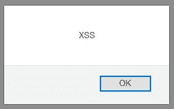
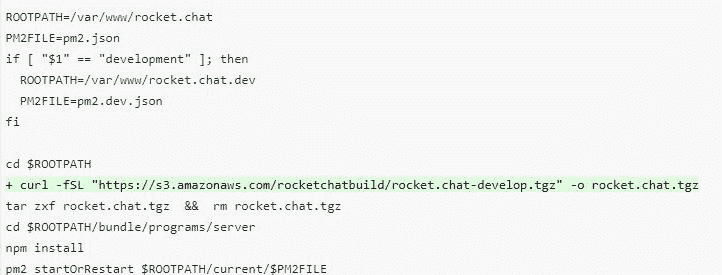

# 利用允许的 S3 存储桶获取乐趣和利润

利用 S3 存储桶并不仅仅是读取敏感信息。例如，S3 存储桶中包含的 JavaScript 可以被后门化，以影响加载受感染 JavaScript 的 web 应用程序的所有用户。

本章将介绍如何利用易受攻击的 S3 bucket 来识别 web 应用程序正在加载的 JS 文件，并对其进行后门攻击，以获得泛用户妥协。除此之外，还着重于识别敏感凭据和存储在易受攻击的 S3 存储桶中的其他数据机密，并使用它们在连接的应用程序中实现进一步的妥协。

在本章中，我们将介绍以下主题：

*   从公开的 S3 存储桶中提取敏感数据
*   将恶意代码注入 S3 存储桶
*   后门 S3 存储桶用于持久访问

# 从公开的 S3 存储桶中提取敏感数据

在前面的[第 7 章](07.html)*中【识别易受攻击的 S3 bucket】*中，我们学习了如何通过公开创建易受攻击的 bucket。在本章中，我们将学习如何识别易受攻击的 bucket，并尝试从每个 bucket 中提取数据。

因此，一旦桶被设置好，我们将尝试从一个局外人的角度攻击脆弱的桶。为了实现这一点，我们将使用`AWSBucketDump`工具。它是一个非常方便的工具，用于识别易受攻击的 S3 存储桶。`AWSBucketDump`工具可在 GitHub 页面[上找到 https://github.com/jordanpotti/AWSBucketDump](https://github.com/jordanpotti/AWSBucketDump) 。

让我们看看如何使用`AWSBucketDump`提取敏感数据：

1.  Git 克隆工具并`cd`将其放入文件夹：

```
git clone https://github.com/jordanpotti/AWSBucketDump
cd AWSBucketDump
```

接下来，我们必须配置该工具，以使用字典来强制执行并查找易受攻击的 S3 存储桶。

2.  在任何文本编辑器中打开`BucketNames.txt`文件。此文件包含一个有限的单词列表，用于标识打开的存储桶。然而，你可以使用更大的词表来增加你的成功机会。
3.  出于演示目的，我们将在单词列表中添加`bucket`关键字。

这里的单词非常常见，那么我们如何识别特定于目标组织的 bucket 呢？我们将添加组织名称作为这些单词的前缀。由于我们的 bucket 名为`kirit-bucket`，我们将在单词列表中的每个单词前面添加`kirit`**作为前缀。为此，我们将使用`vim`使我们的工作更容易。**

 **4.  打开`vim`中的`BucketNames.txt`文件：

```
vim BucketNames.txt
```

5.  要在`vim`内为每个单词添加前缀，请发出以下命令：

```
:%s/^/kirit-/g
or :%s/^/<<prefix>>/g 
```

6.  使用以下命令保存文本文件：

```
:wq
```

7.  创建一个空文件：

```
touch found.txt
```

8.  在运行`AWSBucketDump`之前，我们需要确保满足所有 Python 依赖项。为此，有一个文本文件`requirements.txt`，其中包含所有必需 Python 模块的列表。我们只需要安装它们。使用以下命令：

```
sudo pip install -r requirements.txt
```

9.  现在，是运行`AWSBucketDump`的时候了。发出以下命令：

```
python AWSBucketDump.py -D -l BucketNames.txt -g interesting_Keywords.txt
```

脚本将接收单词列表，然后尝试使用暴力并查找公共 S3 存储桶。然后，将使用`interesting_Keywords.txt`中的关键字搜索列出的任何打开的存储桶中的对象。

从脚本输出可以看出`AWSBucketDump`找到了打开的 bucket：


在下一节中，我们将看到如何后门攻击易受攻击的 S3 存储桶并注入恶意代码。

# 将恶意代码注入 S3 存储桶

如果 web 应用程序从已公开可写的 S3 存储桶获取其内容，会发生什么情况？让我们考虑一个场景，其中有一个 Web 应用程序，它从 S3 桶中加载其所有内容（图像、脚本等）。顺便说一句，如果这个 bucket 已经向世界公开，攻击者可以将他的恶意`.js`文件上传到 S3 bucket，然后由 web 应用程序呈现。

为了演示，我们将设置一个非常基本的 HTML 页面，链接到托管在 S3 bucket 上的 JavaScript 文件：

```
<!DOCTYPE html>
 <html >
 <head>
<!--Link JavaScript---->
 <script type="text/javascript" src="https://s3.us-east-2.amazonaws.com/kirit-bucket/vulnscript.js"></script>
 <!--Vulnerable JavaScript-->
</head>
 <body><!-- Your web--></body>
 </html>
```

如您所见，页面调用托管在 S3（[上的`.js`文件 https://s3.us-east-2.amazonaws.com/kirit-bucket/vulnscript.js](https://s3.us-east-2.amazonaws.com/kirit-bucket/vulnscript.js) ）。我们已经找到了如何识别易受攻击的 S3 存储桶。如果这个 bucket 也有漏洞，我们可以上传自己的恶意`vulnscript.js`文件

下次加载网页时，会自动运行我们的恶意`.js`脚本：

1.  首先创建一个会弹出警报的恶意`.js`脚本，类似于`XSS`攻击。对于本演示，我们将使用以下 Javascript 代码：

```
alert("XSS")
```

2.  将其放入一个文件中，并使用与前面 HTML 代码中标识的文件相同的名称保存它。
3.  在上一章中，我们学习了如何使用 AWS CLI 上载文件。同样，将您的`js`文件上传到易受攻击的 bucket：

```
aws s3 cp vulnscript.js s3://kirit-bucket/vulnscript.js --acl public-read
```

4.  现在，再次访问 web 应用程序，它将加载并呈现易受攻击的脚本。您应该会收到一个典型的 XSS 弹出警报：



在下一节中，我们将看到如何对 S3 bucket 进行后门操作，以危害用户机器。

# 后门 S3 存储桶用于持久访问

S3 铲斗有时可能无人认领。也就是说，可能存在向不存在的 S3 存储桶发出请求的应用程序和/或脚本。

为了演示这种场景，让我们假设一个 S3 bucket URL*（*[http://s3bucket](http://storage.example.com.s3-website.ap-south-1.amazonaws.com/) *[example.com.s3-website.ap-south-1.amazonaws.com](http://example.com.s3-website.ap-south-1.amazonaws.com/)）。*

 *此 URL 可能绑定到子域（例如，[https://data.example.net](https://storage.example.net/) ）属于组织，以混淆 AWS S3 URL。这是通过添加备用域名（CNAMEs）实现的。

但是，随着时间的推移，bucket 会绑定到 URL[https://data.example.net](https://data.example.net) 可能被删除，但 CNAMEs 记录将保留。因此，攻击者可以创建一个与无人认领的存储桶同名的 S3 存储桶，并上传恶意文件以供服务。当受害者访问 URL 时，他将收到恶意内容。

如何识别此漏洞？

1.  查找一个错误页面，该页面包含消息 404 未找到且包含`NoSuchBucket`消息。为此，我们可以枚举特定主机的子域，并查找表示未找到 bucket 的错误页面，如以下屏幕截图所示：


2.  一旦找到了这样一个无人认领的 bucket，就在具有 URL 的同一区域创建一个具有相同名称的 S3 bucket
3.  在新创建的 S3 存储桶上部署恶意内容。

当站点的任何用户尝试访问易受攻击的 URL 时，攻击者的 bucket 中的恶意内容会呈现在受害者的站点上。攻击者可以将恶意软件上载到 bucket 中，然后将其提供给用户。

让我们假设一个场景，其中应用程序正在调用无人认领的 S3 存储桶。应用程序请求安装程序文件，下载它们，然后执行脚本。如果该存储桶无人认领，攻击者可以劫持该存储桶并上传恶意软件，从而为其提供持久访问

一个这样的案例研究可以在[的 HackerOne bug 赏金计划中找到 https://hackerone.com/reports/399166](https://hackerone.com/reports/399166) 。

如我们所见，脚本从 S3 存储桶中获取一个`.tgz`文件，提取它，然后在受害者的设备上执行该文件。攻击者可以利用此漏洞将持久后门上载到 S3 存储桶：



当受害者运行脚本时，它将下载包含恶意脚本的`.tgz`文件，将其解压缩，然后在受害者的计算机上执行恶意软件。

但是，需要注意的是，这种漏洞高度依赖于调用无人认领的 S3 存储桶的脚本

# 总结

在上一章的继续中，我们了解了如何利用易受攻击的 S3 存储桶。我们了解了`AWSBucketDump`以及如何使用它从易受攻击的 S3 存储桶中转储数据。此外，我们还了解了如何利用无人认领的 S3 存储桶，以及如何在易受攻击和/或无人认领的 S3 存储桶中后门并注入恶意代码。

在下一章中，我们将学习如何测试 AWS Lambda。我们将研究如何利用易受攻击的 Lambda 实例，并学习 pots 利用方法，例如从受损的 AWS Lambda 进行旋转。

# 进一步阅读

*   [https://aws.amazon.com/premiumsupport/knowledge-center/secure-s3-resources/](https://aws.amazon.com/premiumsupport/knowledge-center/secure-s3-resources/)
*   [https://github.com/jordanpotti/AWSBucketDump](https://github.com/jordanpotti/AWSBucketDump)
*   [https://hackerone.com/reports/172549](https://hackerone.com/reports/172549)***