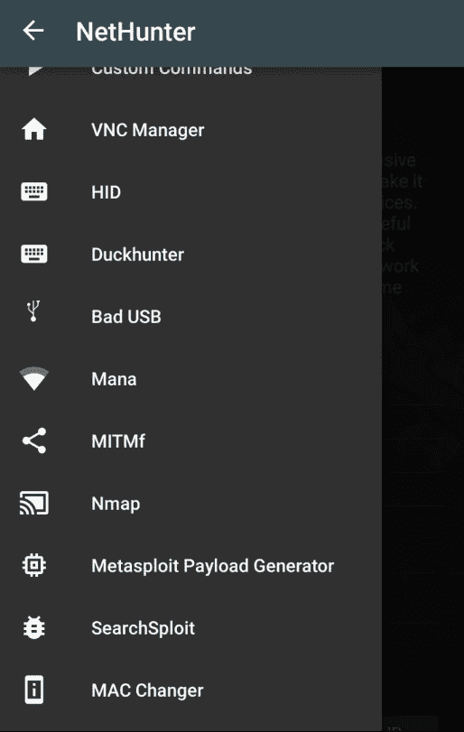
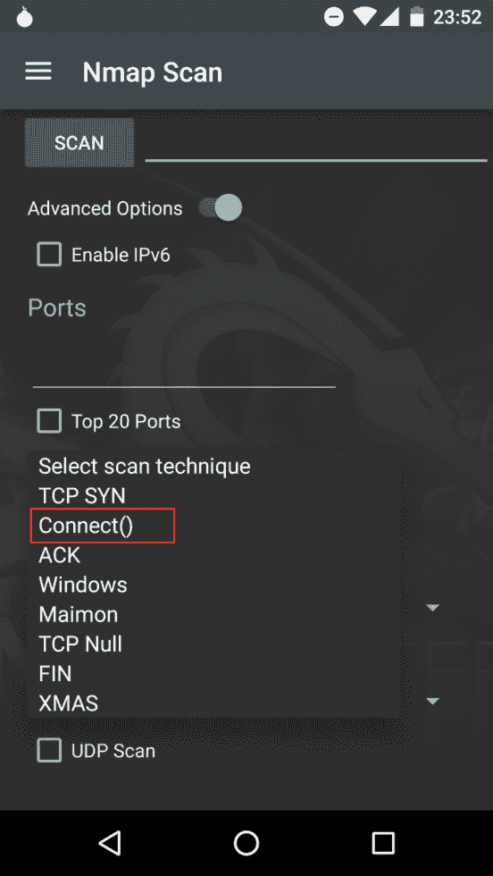
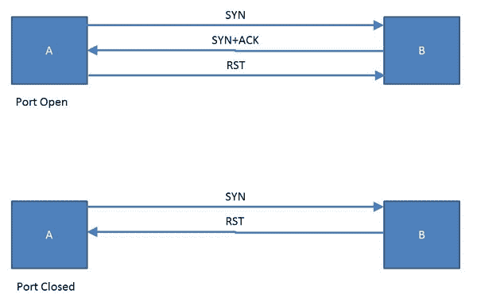
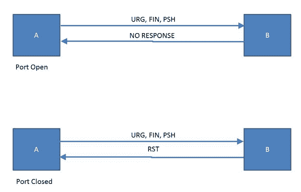
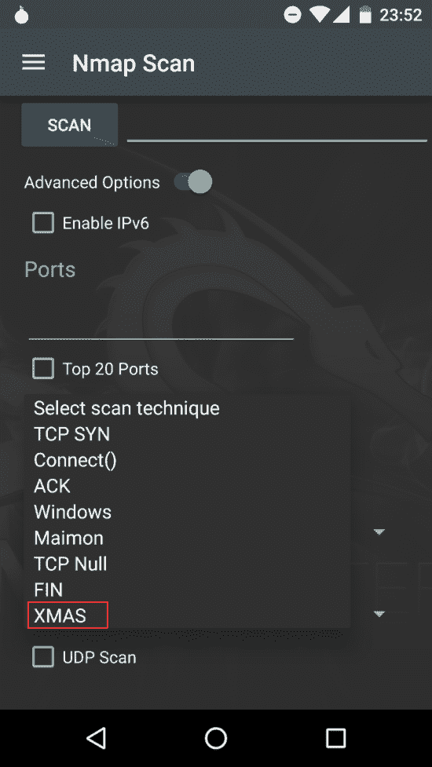
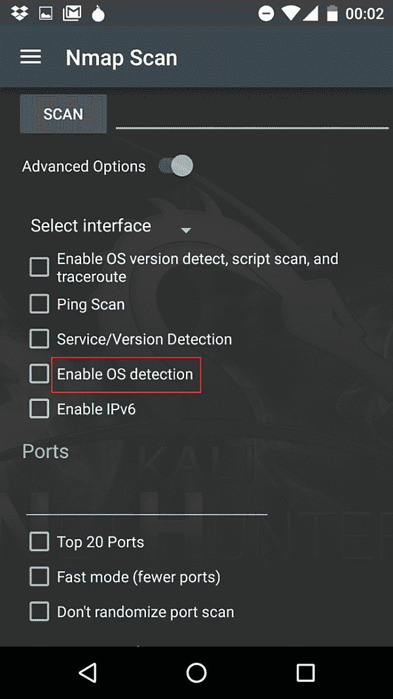
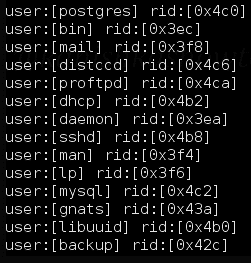

# 扫描和枚举工具

在本章中，我们将讨论概述和扫描技术。如果我们回想一下[第 2 章](02.html)*中的【理解 Pentesting 过程的阶段】*，扫描是黑客攻击的第二阶段。什么是扫描？它使渗透测试仪能够识别网络中在线/在线的设备，并识别开放和关闭的服务端口、服务版本和漏洞；这些只是它的一些好处。Nmap 和 hping3 是两种著名的扫描工具。

此外，渗透测试人员通常需要提取信息以快速识别目标系统上的攻击点。信息可以是网络共享、来自设备、用户和组的路由表以及 DNS 记录。这种提取信息的方法称为枚举。用于枚举的两个功能强大且易于使用的工具是 nbtstat、nbtscan、enum4linux 和 nslookup。

在本章中，我们将探讨以下主题：

*   确定主机是启动还是关闭
*   使用 Nmap
*   端口扫描
*   抢旗
*   使用 NetHunter 进行枚举
*   与 SMB 合作

# 技术要求

为了完成本章，您需要安装 Kali NetHunter。关于在 Android 设备上设置 Kali NetHunter，请参见[第 1 章](01.html)、*Kali NetHunter 简介*中的详细说明。

# 扫描

当我们想使用 NetHunter 本地和外部的工具对收集到的信息采取行动时，我们通常从一系列扫描开始。为了探测目标，我们将使用一系列设计用于执行不同类型扫描的工具，每个工具都设计用于根据特定标准对信息进行分组。这些扫描将帮助我们找到有效的目标主机、网络结构、运行的服务和漏洞。扫描过程进一步细化和处理我们从[第 3 章](03.html)、*情报收集工具*中获得的信息，让您更好地了解目标，并帮助您选择更好地执行枚举过程的区域（更多信息请参见*使用 NetHunter*节进行枚举）。

扫描可以帮助我们收集以下重要信息，这些信息将在以后的开发过程中被证明是有用的：

*   系统的 IP 地址
*   开放式和封闭式端口
*   操作系统及其版本
*   谁是信息
*   软件版本
*   MAC 地址

# 进行扫描

那么，我们所说的**扫描**是什么意思？让我们把这个过程分解一下。为了更好地理解，请参阅*端口扫描*部分。在本章中，我们将进一步了解使用 Nmap 工具和各种扫描技术进行扫描的实际情况。进行扫描需要执行以下步骤：

*   分析一系列 IP 地址以定位实时系统，也就是说，目标设备将通过 ICMP 回音重播响应 ping 扫描。如果在目标上禁用了 ICMP，使用 Nmap，我们可以发送探测以检测目标是否会响应，Nmap 分析响应以帮助我们确定系统是否在线。这个阶段帮助我们避免扫描不在线的 IP 地址，因此无法扫描
*   接下来，我们进行端口扫描，以特定的 IP 地址为目标，并对其进行探测，以确定哪些端口处于打开或关闭状态，这些端口稍后将用于提取信息。

*   更仔细地探测打开的端口，以确定服务或应用程序是否在该端口上实际运行，如果是，可以提取哪些信息。这个过程类似于给一家公司打电话，打一个分机，然后听语音邮件，看看它是否提供了分机上的人的信息。
*   在打开的端口上执行漏洞扫描，以识别可能提供系统入口点的弱点。请注意，此扫描会发现弱点，但不会利用它们。

对你的扫描要有创意；尝试新的工具和组合以获得不同的结果。NetHunter 提供了许多扫描工具，还可以运行许多其他工具，其中许多工具可以免费下载和安装。虽然许多专业人士、网站和书籍都会专注于使用一种特定的扫描仪，但请毫不犹豫地尝试其他扫描仪。

# 扫描结果疑难解答

如果你没有把清单上的所有东西都记下来怎么办？在大多数情况下，您应该能够很容易地获得 IP 地址、WHOIS 信息等等。但是，如果您发现缺乏实质性或有用的信息，您可能希望返回到收集阶段，看看您是否忽略了任何内容，或者您需要采取不同的方法收集信息。收集大量信息将使您的评估更加准确，从而在扫描阶段获得回报。

# 确定主机是启动还是关闭

如果您要尝试进入一个系统，首先需要有一个要检查和探索的目标，这需要找出哪些主机是在线的或活动的，哪些不是。

# 练习-使用 ping

在本练习中，我们将使用`ping`实用程序检查活动目标：

1.  在 Windows 或 Linux 中的终端上打开命令提示符。
2.  平`-c <number of pings> <target IP or hostname>`。
3.  按*键进入*。
4.  查看结果。

如果省略了`-c`，则命令将继续 ping 提供的主机名或地址，直到您按*Ctrl*+*C*为止。

如果您收到来自目标的成功回复，则认为主机处于活动状态。如果收到请求超时消息，这意味着两件事之一：目标脱机或目标已禁用 ICMP 响应。系统管理员通常出于安全原因禁用 ICMP 回复；如果一个脚本 kiddie 正在尝试 ping 扫描，他们会认为目标离线，然后继续。然而，熟练的渗透测试人员会使用另一种方法来确定目标的真实状态。

使用 ping 实用程序有两种主要方法：使用 ping 后跟目标 IP 地址或主机名。如果您 ping 一个主机名而没有得到任何响应，则您的 DNS 设置可能有问题。如果 DNS 设置准确，则所创建的目标实际上已关闭。因此，最好使用 IP 地址 ping。

好的，让我们再做一个练习，看看 nmap，这是一个您将非常熟悉的实用程序。

让我们探索一种使用名为 nmap 的新工具执行 ping 的不同方法。

# 使用 Nmap

Nmap（网络映射器）就像所有网络扫描仪中的国王。Nmap 可能具有一些功能，例如使渗透测试仪能够扫描打开的端口、确定服务及其版本、检测目标操作系统和版本，以及检测网络嗅探器和漏洞。

NetHunter 为我们提供了几个执行扫描的选项，但在这里，我们将重点讨论最强大和最知名的一个，称为 nmap。由于 Nmap 的灵活性、强大性、易用性和可扩展性，它已被证明是大多数主要操作系统中非常流行的端口扫描实用程序。多年来，许多渗透测试人员以及网络管理员都开始依赖软件应用程序。如果您以前从未使用过它，那么在我们在 NetHunter 中使用它之后，您可能会发现自己更加依赖它。

NetHunter 预装了 nmap，就像本书中介绍的所有工具一样。在本节中，我建议您从命令行或 NetHunter 应用程序打开 nmap。

如果您在使用 Kali Linux 或在 Microsoft Windows 上使用 nmap 时熟悉 nmap，您会发现打开终端可以发出与以前完全相同的命令。

# 练习–使用 Nmap 执行 Ping 扫描

在本练习中，我们将在本地子网上执行 ping 扫描，以检查任何活动主机设备：

1.  在 NetHunter 中，点击应用程序右上角的三条水平线，打开终端或通过 NetHunter 应用程序访问 Nmap：



NetHunter 应用程序中的 Nmap

2.  从 nmap 菜单中选择以下选项：


注意 Ping 扫描选项，只需点击它即可启用扫描类型

3.  输入 IP 地址（即`192.168.1.1`）或 IP 地址范围（即`192.168.1.1-130`）。
4.  点击**扫描**按钮，打开终端窗口，显示正在执行的命令和结果：

。

扫描完成后，结果将在屏幕上填充。

如果扫描未执行，您可能必须选择一个界面，以便扫描操作。如果是这种情况，请从接口下拉列表中选择接口（即`wlan0`），如 nmap 窗口中所述：


显示界面下拉窗口

# 端口扫描

确定实时系统后，是时候检查目标上是否存在任何打开的端口了。

那么，什么是港口？首先，假设网络上的每台主机都有一个唯一的地址，称为 IP 地址。此地址是分配给主机的唯一编号，以区别于网络上的其他主机。

当然，我们还需要关注信息何时从一个系统发送到另一个系统，以及计算机如何知道如何接受这些信息。答案是港口。我将使用`192.168.1.4`IP 地址作为我们的目标系统：

```
192.168.1.4:80 
```

那么，一个系统上有多少个端口可用？有 65535 个端口号。一些网络服务使用 TCP 端口确保其数据传送到收件人，而其他网络服务使用 UDP 进行快速通信，但不保证像 TCP 那样的快速传送。我们使用的端口范围如下：

*   众所周知的端口范围从`1`-`1024`不等。这些端口是最常用的，例如 HTTP 通信的端口`80`，默认情况下，所有 web 服务器都打开了端口`80`。。
*   注册端口来自`1025`-`49151`。这些端口是为特定的供应商和应用程序使用而分配和保留的。
*   动态端口来自`49152`-`65535`。这些端口在通信期间临时使用。

**数据包**是在正常网络通信期间传输的一段信息。一个数据包就像一个包含发送者和接收者地址信息的信封，在中，数据包就像一个信封，是要传递的消息。

下表显示了一些较常见的端口，但这里列出的端口还有很多：


一些常见端口的示例

在我们之前的讨论中，我们讨论了 TCP/IP 套件中促进通信的一些细节，特别是 TCP 和 UDP。**传输控制协议****TCP**和**用户数据报协议****UDP**都存在于 OSI 参考模型和 TCP/IP 协议套件的传输层中。这些协议的目的是提供一种将数据从一个设备传送到另一个设备的机制。

请记住，三方握手是通过 TCP 协议进行的，而不是 UDP

在 TCP 三方握手过程中，会发生以下操作：

1.  A 向 B 发送**SYN**数据包以启动会话。
2.  B 以**SYN+ACK 响应。**B 将以 ACK 响应，并发送 SYN 以尝试建立连接。
3.  A 将回复**确认**确认。下图显示了 TCP 三方握手：


TCP 三次握手

TCP 为每个段提供序列编号。这确保了接收设备能够按顺序重新组合接收的比特片段并重建数据。

UDP 与 TCP 有点不同。UDP 在网络上发送消息，不提供任何形式的传递保证，也不提供任何序列号。因此，有时会以无序的方式接收消息。

我们需要扩展关于旗帜的知识，其中一些我们已经遇到过。在每个数据包内设置标志，以通知接收器数据包的特征以及应如何处理数据包。

下表显示了各种标志：

| **名称** | **说明** |
| SYN | 用于启动会话 |
| 阿克 | 用于确认消息 |
| 乌尔格 | 意味着高度优先 |
| PSH | 立即发送所有数据 |
| 鳍 | 通知远程设备正常结束会话 |
| RST | 重置数据包用于重置连接。 |

所以，让我们把我们对标志和端口的知识放在一起做一些端口扫描。正如我们前面所了解的，端口是连接信息并将信息传输到系统（如 web 流量）的一种方式。通过端口扫描，我们试图确定哪些端口是“打开”的，哪些是“关闭”的。那么这意味着什么呢？简单地说，如果一个服务端口是开放的，它可以在上面接收传入的流量；然而，如果一个港口关闭，它就像一扇锁着的门，任何车辆都不允许进入。

您想了解每次扫描的优缺点。每次扫描都有优点也有缺点；这取决于你是否知道利弊，这样你就可以确定使用其中一个的最佳时间。

# 完全打开/TCP 连接扫描

在所有的扫描中，完全开放扫描非常容易可视化和理解，正如我们已经看到的那样。在目标系统上执行任何端口扫描之前，完全打开扫描建立 TCP 三方握手，目的是确定其状态（如果打开和关闭）。

这种类型的扫描能够快速确定端口是打开还是关闭，因为它与目标建立了 TCP 三方握手。

当发起人不再希望与目标通信时，发起人将发送一个 TCP FIN 数据包，让目标知道它希望正常结束会话：


关闭和打开端口响应

如果目标设备上的端口打开，则目标设备将使用 ACK 数据包进行响应。如果端口关闭，则发送 RST 数据包。

要执行完全连接扫描，请从 NetHunter 应用程序的 nmap 窗口中的列表中选择**connect（）**，然后输入目标 IP 地址：



TCP-SYN 选项

# 隐形扫描

**隐形扫描**（有时称为半开放式扫描）与完全开放式扫描非常相似，只是有一个细微的区别，可以减少受害者设备上的可疑性。主要区别在于不会发生完整的 TCP 三方握手。查看下面的图，启动器（设备 A）将向设备 B 发送一个 TCP SYN 数据包，以确定端口是否打开。如果端口打开，设备 B 将向启动器（设备 a）发送 SYN/ACK 数据包。接下来，设备 A 将发送 RST 以终止连接。如果端口关闭，设备 B 将发送 RST 数据包：



隐形扫描显示打开和关闭的服务端口

使用这种扫描的好处是减少了被检测到的机会。

要执行隐形扫描，请从 NetHunter 应用程序的 nmap 窗口中的列表中选择（**TCP SYN**，然后输入目标 IP 地址：


TCP-SYN 的选择

# 圣诞节扫描

在本次扫描中，**ACK**、**SYN**、**URG**、**RST**和**FIN**标志在同一数据包上同时设置。这样做的问题是，由于设置了所有标志，目标系统可能难以解释其接收到的数据包。下图显示了这个过程：



圣诞树扫描

要执行圣诞节扫描，请从 NetHunter 应用程序的 nmap 窗口中的列表中选择**圣诞节**，然后输入目标 IP 地址：



从下拉列表中选择圣诞节扫描

# 鳍扫描

**FIN 扫描**是指攻击者发送仅启用 FIN 标志的数据包。如果攻击者向目标发送 FIN 数据包，则表示攻击者正在请求终止连接，但没有建立要关闭的连接。这会混淆目标。如果目标没有响应，则表示端口已打开。如果目标用 RST 数据包答复，则目标上的端口将关闭。下图说明了此过程：


FIN 扫描检测关闭和打开的端口

要执行 FIN 扫描，请在 NetHunter 应用程序的 nmap 窗口的列表中选择**FIN**，然后输入目标 IP 地址：


从下拉列表中选择 FIN 扫描

# 空扫描

在空扫描中，攻击者向目标发送数据包，而不在其中设置任何标志。再一次，目标会感到困惑，不会做出回应。这将指示目标上的端口已打开。但是，如果目标用一个**RST**数据包进行响应，这意味着设备**上的端口关闭。**下图说明了该过程：


要执行空扫描，请在 NetHunter 应用程序的 nmap 窗口的列表中选择**TCP 空**并输入目标 IP 地址：


从下拉列表中选择 TCP 空扫描

# 确认扫描

另一种有趣的扫描方法是在数据包内启用 ACK 标志。该技术用于确定可由网络安全设备（例如防火墙）执行的任何形式的过滤。

虽然我们还没有谈到防火墙，但我们将在稍后讨论。但是，就目前而言，我们将说防火墙执行从一个网络到另一个网络（例如，从 internet 到本地 intranet）的流量过滤

在渗透测试期间，我们可能在组织的外部网络上，如互联网。大多数组织在其周界、互联网和局域网（LAN）之间部署防火墙，以帮助防止任何威胁进入或离开其网络。

我们可以使用 ACK 扫描来帮助我们确定我们的目标组织是否有防火墙。要执行确认扫描，请从 NetHunter 应用程序的 nmap 窗口中的列表中选择**确认**，然后输入目标 IP 地址：


从下拉列表中选择确认扫描

# 调整和调整

当然，到目前为止，我们对 nmap 所做的只是冰山一角。Nmap 允许高度定制扫描。让我们看看几个选项。

要执行空扫描，请在 NetHunter 应用程序的 nmap 窗口的列表中选择**空**并输入目标 IP 地址：


Kali NetHunter 上的 Nmap 应用程序中提供的菜单和选项

在这一行中，您可以以不同的方式输入要扫描的端口，例如范围；我们使用`-p`开关指示我们正在扫描特定端口，然后使用端口`21`、`22`和`45`以及目标的 IP 地址进行跟踪：

```
21,22,45  
```

另一个选项是扫描一系列端口，例如端口`1`到`100`：

```
1-100 
```

要扫描特定端口并检测操作系统和服务吗？Nmap 将向目标设备发送一系列 TCP 和 UDP 数据报；每个响应都经过仔细分析。结果将与 Nmap OS 数据库进行比较，该数据库包含 2600 多个 OS 指纹。有关使用 Nmap 检测操作系统的更多信息，请参见[https://nmap.org/book/man-os-detection.html](https://nmap.org/book/man-os-detection.html) 。

在 Nmap 窗口的框中勾选，如下图所示：



操作系统检测选项

有比这里显示的更多的开关，但是要知道，您可以组合开关来进一步优化扫描，以获得更好、更高效的结果。

# UDP 扫描

在本节中，我们将讨论 UDP 扫描的概念及其对渗透测试人员的好处。我们需要了解的第一件事是，当遇到打开或关闭的端口时，UDP 扫描会发生什么。该答案显示在以下表中：

| **端口状态** | **结果** |
| 打开 | 没有回应 |
| 关闭 | 返回的 ICMP 端口不可访问消息 |

在 Nmap 中执行基于 UDP 的扫描很容易。为此，我们从 Nmap 窗口中选择 UDP 扫描选项，如以下屏幕截图所示：


UDP 扫描选项

但是，这些类型的扫描值得尝试，因为众所周知，网络管理员对 UDP 扫描的关注程度较低，因为他们认为 UDP 扫描存在性能问题，例如对攻击者没有吸引力。

# 抢旗

横幅抓取是一种识别系统上运行的服务的技术。例如，假设您对目标进行了基本端口扫描，发现端口 80 已打开，这意味着有一个 web 服务器提供 HTTP 服务。但是，如果我们想要确定/检索 web 服务器平台（IIS、Apache 或 Nginx）及其版本号，我们必须执行横幅抓取。

# 使用 Telnet 抓取横幅的练习

在本练习中，我们将使用 Telnet 确定目标系统上 web 服务器的类型。我们将能够看到它是 IIS、Apache 还是 Nginx。开始吧：

1.  打开命令控制台。
2.  在控制台上，输入以下命令：

```
telnet <target IP address> 80
```

3.  按*键进入*。
4.  输入`GET/ http/1.0`命令。
5.  按*键进入*。
6.  查看结果。

您的结果可能因您的目标而异，但是，结果的格式与以下类似：

```
HTTP/1.1 200 OK 
Date: Mon, 30 January 2017 22:10:40 EST 
Server: Apache/2.0.46 (Unix) (Red Hat/Linux) Last-Modified: Mon, 25 December 2016 11:20:14 PST ETag: "1986-69b-123a4bc6" 
Accept-Ranges: bytes 
Content-Length: 1110 
Connection: close 
Content-Type: text/html 
```

查看输出，您会注意到，在标记为 server 的行中，有关于服务器类型的信息，即在 UNIX 或 Red Hat/Linux 上运行的 Apache/2.0.46。这些看似无害的信息对于以后针对 web 服务器或操作系统的操作非常有用，因为我们在这两方面都有一些信息。

# 练习–使用 nmap 抓取横幅

现在，我们将使用 NMap tp 帮助我们检索目标设备的横幅：

1.  打开命令控制台。
2.  在控制台上，输入以下命令：

```
Nmap  -sV <target IP address or hostname> 
```

3.  按*键进入*。
4.  查看结果。

您将注意到，与 telnet 的结果相比，这些结果有些缩写，但它们提供了在开放端口上运行的服务的基本信息。如果需要更深入的结果，可以按如下方式更改命令：

*   **更积极的服务检测**：`nmap -sV --version-intensity 5 <target IP address or hostname>`
*   **打火机抓旗检测**：`nmap -sV --version-intensity 0 <target IP address or hostname>`

版本强度使用 0 到 9 之间的值。较少的用户使用的探测往往在更广泛的公共服务上更有效。更多的人使用很少或有时有用的探测。但是，使用更高的数字将增加完成扫描所需的时间，但会增加正确识别服务的机会。

还有另外一种使用 nmap 获取服务详细信息的方式，就是使用以下命令：

```
Nmap -A <IP address> 
```

这是前面提到的一种检测操作系统和服务的方法，但这里也应该再次提到。

# 使用 NetHunter 进行枚举

一旦从扫描中收集到信息（例如打开的端口和有关运行服务的信息），就可以转到枚举。在这个过程中，您可以期望获得更多的信息，以便以后采取行动。如果你幸运并且得分很高，你可能会发现自己拥有诸如用户帐户、设备主机名、网络共享和服务等信息。同样值得注意的是，你正在增加你的可视性，同时也增加了被发现的可能性，因此你希望在行动中尽可能轻地行走，并被测量。

以下是在枚举过程中收集的一些信息列表：

*   网络共享
*   用户和组
*   运行服务及其横幅
*   DNS 记录

# 枚举 DNS

由于 DNS 是您将遇到的任何网络上的核心服务，因此它将出现在您的潜在目标列表中是有意义的。DNS 对于 pentester 来说是一个有价值的信息源，因为可以在那里发现信息。记住，DNS 负责将主机名解析为 IP 地址，反之亦然，分别称为正向和反向查找。该服务在许多网络中起着重要作用，因为它简化了管理，并使它能够通过名称而不是 IP 来记住主机。该服务也是目录服务正常运行的一部分，例如 Microsoft 的 Active directory 产品和其他产品。DNS 中包含的有关主机和服务的信息使其成为 pentester 的诱人目标。幸运的是，NetHunter 提供了一些工具来使用该服务。

让我们看看一个非常有效和简单的工具，DNSenum，来让这个过程继续下去。创建**DNSenum**是为了从目标域收集信息。收集的信息以 DNS 记录的形式出现，其中包括 IP 地址和主机名等信息。此外，该工具还可以收集目标的主机地址，以及尝试从为域提供服务的 DNS 服务器进行区域传输。

要使用该工具，您需要通过执行`dnsenum`命令在终端窗口运行它，但是您需要选择使用哪些开关来定制结果。

例如，让我们对`www.setset.com`域运行一个基本查询，并将结果输出到名为`dns.xml`的文件中：

```
dnsenum -o dns.xml test.com 
or 
dnsenum -o <filename.xml> <domain_name> 
```

此命令完成后，我们可以在文本编辑器或用于读取 XML 文件的应用程序中打开生成的 XML 文件。返回并写入文件的结果将包括以下内容：

*   主机地址
*   名称服务器
*   邮件服务器
*   尝试和成功的区域传输

其中一条更有用的信息与区域传输有关。如果区域传输成功，您可以期待从 DNS 提取的记录列表，其中将包含有关主机、服务和存储在名称服务器中的其他项的信息。但是，在您第一次尝试区域传输之前，请意识到在大多数现代环境中，不允许来自未知主机的区域传输请求。为什么会这样？首先，端口`53`TCP 必须打开，DNS 必须存在，才能成功连接到系统。其次，大多数 DNS 服务器已配置为默认情况下拒绝向未经授权的方进行区域传输的请求。即使虽然可能不成功，但仍然值得尝试，值得让德纳森努力。

另一个可以执行相同类型功能的工具是 DNSrecon。此实用程序可以执行 DNSenum 没有执行的附加步骤，即检索 SRV 或服务记录以及其他一些记录。**SRV**是最有趣的记录，因为它被许多应用程序使用，如微软的 Active Directory，以及即时消息、电话应用程序和语音/视频服务等服务。这种类型的记录可以让 pentester 定位和识别许多有用的项目。

要使用 DNSrecon 执行基本操作，请在命令行中发出以下命令：

```
dnsrecon -d <domain_name> 
```

# 枚举 SMTP

**SMTP**是一种用于传输消息的协议，常用于邮件服务器和邮件客户端。自 1982 年首次引入该议定书以来，该议定书的简单性和可靠性导致了它的广泛采用和一些修订。

在消息传递系统的上下文中，SMTP 有两种不同的使用方式。对于邮件服务器，该协议用于将邮件从一台服务器传输到另一台服务器，直到邮件到达收件人邮箱所在的服务器，以便以后检索。在邮件客户端，该协议用于向邮件服务器发送消息，并利用其他协议从服务器检索消息。

对于 pentesters，SMTP 可以代表有价值的信息源，特别是用户名和电子邮件地址。我们将在这里使用的技术旨在查询 SMTP 服务并检索用户名和域名。你可能没有意识到这一点，但你总是在你的电子邮件地址中以两部分的形式看到这些信息；在`@`前面的部分是用户名，后面是域名。

这种格式在用户名遵循某种模式的环境中是标准的，例如名字点姓氏或其变体。例如，`@`符号前的名称为 john.doe。

那个么，我们如何使用 NetHunter 中的工具从 SMTP 中提取电子邮件地址信息呢？好的，这一切都是从邮件交换开始的，或 MX，我们可以从 DNS 枚举中获得的记录。

根据您使用的工具，结果在屏幕上的显示可能略有不同，但您要查找的是一条记录（在某些情况下是一条或多条记录），该记录在 MX 处被专门标记。一旦找到这些，您将查找分配给它们的 IP 地址。如果您有多台 MX 服务器，您将希望看到哪台服务器的优先级最低，因为这将是域的主服务器。如果主进程不工作，请转到下一个最高优先级，以便以后尝试枚举。

在实践中，我们通常选择首选项编号最低的服务器，这是本例中的第一条记录。MX 首选项编号用于 SMTP 的正常操作，以指示应首先使用哪个服务器。数字越小，优先级越高，因此设置了 MX 首选项的两条记录，一条设置为值`1`，另一条设置为`50`，将导致先尝试 1，然后尝试`50`。虽然我们可以使用其中一个，但按照邮件路由服务使用它们的相同顺序使用它们是有意义的。一旦我们有了这个，我们就可以转到结果的第二部分，并将注意力集中在这些行上。

# 练习–使用 NMAP 枚举

一旦您拥有 MX 记录的 IP 地址，我们就可以开始提取信息（或尝试提取）。一种方法是使用 nmap 工具及其内置的脚本功能。我们可以通过在控制台输入以下命令来完成此操作：

```
nmap -script smtp-enum-users.nse 65.54.254.145 
```

如果仔细查看该命令，可以看到添加了`-script`开关，该开关指示 nmap 工具运行 NSE 脚本。nmap 的 NSE 组件代表 nmap 脚本引擎，它允许创建自定义脚本、使用预装脚本或从第三方获取脚本。在本例中，选择的脚本是预安装的，并从 SMTP 服务器提取名称。

警告一句：许多公司不再托管他们的电子邮件服务器，而是选择将它们转移到第三方提供商，如谷歌或微软。如果您看到 MX 记录指向客户端以外的域名，请不要以这些服务器为目标。虽然这些工具可以工作，并为您提供信息，但您可能没有权限渗透这些服务器，因为它们属于第三方。在这些情况下，客户不能允许您对这些资产进行 pentest，因为他们不拥有这些资产。与托管提供商核实，以评估这些资产的安全性以及如何获得其许可。

# 练习–使用 smtp 用户枚举

我们可以使用的第二个工具是`smtp-user-enum`，它是一个 Perl 脚本，设计用于通过 SMTP 和其他任务确定用户名。要运行`smtp-user-enum`，请打开终端并发出带有所需开关的`smtp-user-enum`命令。让我们看一下脚本命令的一些示例。

下面的示例使用与 nmap 之前相同的服务器地址（为了清楚起见，我在这里用`<IP>`标记而不是完整地址标注了地址）：

```
smtp-user-enum -M VRFY -U names.txt -t <IP>  
smtp-user-enum -M EXPN -U names.txt -t <IP>  
smtp-user-enum -M RCPT -U names.txt -t <IP>  
```

您应该注意到，通过这些命令，我们有一系列开关；让我们来看一下这三个用户的命令。首先，`-U`通知脚本您希望它使用`names.txt`文件中包含的用户列表。下一个开关是`-t`，它将脚本的信息传递给它将要针对的服务器。最后，`-M`告诉实用程序它在哪种模式下运行。让我们仔细看看这三种模式：

*   **VRFY**（默认）：此模式通过观察 SMTP 服务器返回的响应，在返回有效和无效用户名时，简单地验证用户名列表。
*   **EXPN**：此模式选择采用用户名，如果存在，则将其展开，以“用户名”的形式显示全名 username@domain".
*   **RCPT**：运行此命令时，将使用预期用户的全名（电子邮件地址）。如果用户存在，服务器将以代码 250 响应，否则返回代码 550。请注意，许多 SMTP 服务器倾向于禁用 VRFY 和 EXPN 命令，因此 RCPT 可能是最佳选项。

那么，为什么要使用 SMTP 命令从 SMTP 服务器提取和验证信息呢？简单地说，使用此方法是从运行 SMTP 的目标中提取有效用户名列表的多种方法之一。每一个经过验证的用户名都会立即提供反馈，表明我们发现了一个活动帐户，这应该在以后的操作中加以注意。

# 与中小企业合作

**服务器消息块（SMB）**主要用于提供计算机、服务器和其他网络设备（如打印机）之间的网络和文件共享。但是，SMB 是通用 Internet 文件系统（CIFS）的前身。

# 练习–使用 enum4linux

enum4linux 是 NetHunter 附带的一个工具，对于从支持 SMB 的系统中提取信息非常有用。使用 SMB 的系统将主要是 Windows，但也可以是支持 Samba 的系统，如 Linux 和 UNIX。

该工具提供了几个重要功能：

*   RID 自行车
*   用户列表
*   列出组成员资格
*   列出网络共享
*   检测主机是在工作组中还是在域中
*   识别远程计算机的操作系统

如果已对目标执行端口扫描，并发现以下任何端口打开，则可能需要尝试使用此工具：

*   TCP 端口`445`
*   UDP 端口`137`、`138`&TCP 端口`137`、`139`（TCP/IP 上的 NetBIOS）

要执行工具以检索用户列表，请发出以下命令：

```
enum4linux -U <target IP> 
```

结果如下所示：



从 enum4linux 返回的用户列表

为了搜索可用股份，我们可以发布以下信息：

```
enum4linux -S <target IP> 
```

以下屏幕截图显示了该命令的结果：


enum4linux 中-S 开关的结果

如果您想获得更详细的信息，可以使用`-d`开关：

```
 enum4linux -S -d <target IP> 
```

但是，如果您想在一个命令中检索所有信息，只需使用以下命令即可。

```
enum4linux <target IP> 
```

需要整理的信息很多，但幸运的是`enum4linux`呈现得很好，让您可以浏览来寻找有用的信息。

请注意，`enum4linux`显示有关打印机、密码策略、域或工作组成员身份以及许多其他项目的信息。所显示的信息将因系统设置和目标环境而异。

在 Windows 2000 及更高版本的系统中，使用此工具进行扫描的结果将根据两项而有所不同：防火墙设置和注册表设置。

首先，如果在 Windows 系统上启用或禁用防火墙，您将得到不同的结果。其次，如果系统已将`RestrictAnonymous`注册表设置设置为 1 或 2（可以设置为 0、1 或 2），则某些信息将无法访问。

还有一件事：如果系统所有者只是简单地禁用 SMB 服务和 NetBIOS，则此实用程序将无法工作。

# 练习-使用 acccheck

如果您已从运行`enum4linux`中检索到用户信息，现在可以尝试基本密码破解。此时可使用的工具称为`acccheck`，非常适合破解与 SMB 协议相关的密码。虽然我们要等到以后才会进行更高级的密码破解，但现在至少可以尝试一个基本的密码破解。

在本例中，我将目标用户的用户名为`user`；我可以通过发出以下命令来执行此操作：

```
acccheck -v -t <IP address> -u user -P /usr/share/dirb/wordlists/common.txt 
```

在此命令中，开关向我们显示以下内容：

*   `-v`用于详细说明
*   `-t`针对目标 IP
*   `-u`后跟指定的用户名
*   `-P`用于包含要尝试的密码列表的文本文件

在 NetHunter Linux 中，密码字典通常位于`usr/share/dirb`目录中。在本例中，我使用了 common.txt 文件，该文件列出了常用密码以及这些密码的变体。

一旦执行，此命令将继续尝试针对目标系统上的用户帐户输入密码，直到它遍历文件中的所有名称或找到匹配项为止。

在某些情况下，目标系统上的“帐户锁定”设置可能会阻止您，该设置用于在多次尝试失败后锁定帐户。

# 练习–使用 SMBmap

让我们关注一下使用 enum4linux 检索到的共享。可以使用 smbmap 进一步检查这些共享（如果返回了有关共享的信息）。SMBMap 允许您列出共享驱动器和权限，提供上传和下载功能，甚至可以执行远程命令。

但是，让我们看看使用 SMBMAP 来标识共享的权限。我们可以通过使用 smbmap 这样做：

1.  打开终端窗口。
2.  输入`smbmap -H <IP address>`命令。
3.  按*键进入*。

这将显示目标系统上的共享列表及其各自的权限。请记住，您查看这些内容时没有远程系统的用户名或密码，因此您可能看不到所有内容。如果我们想使用或试图使用一组凭据来查看更多内容，我们可以这样做。让我们使用`user`作为用户名，`user`作为密码（根据我们在 acccheck 尝试中收到的信息）。

在这里，我们将对这些凭证使用前面的命令。

```
smbmap -u user -p user -H <IP address>
```

根据帐户的权限，您可能会看到更多信息。您可以确定，`-u`和`-p`标志用于定义在执行命令期间使用的用户名和密码。让我们进一步向该命令添加更多内容：

```
smbmap -r -u user -p user -H <IP address>
```

在最后一个示例中，`-r`开关显示有关每个共享、其在磁盘上的位置以及分配给它的权限的详细信息。同样，您用来执行此命令的帐户将决定显示多少信息。

# 总结

扫描和随后的目标枚举是破坏系统的一个重要步骤。通过此过程，您将了解环境、哪些端口是开放的以及可以从这些端口后面的服务中提取哪些内容。这些信息将帮助你更好、更准确地规划下一步行动。

当扫描将通知您活动目标的位置以及哪些端口保持打开状态时，枚举将让您进入下一步，尝试提取有用且有意义的信息。使用 nmap、nslookup 和 smtp 用户枚举等工具，可以显示用户、组和其他有关主机及其周围网络的信息。

在下一章中，我们将探索通过发现漏洞来访问目标系统。

# 进一步阅读

有关本章所涵盖主题的更多信息，请查看以下链接：

*   [https://tools.kali.org/](https://tools.kali.org/)