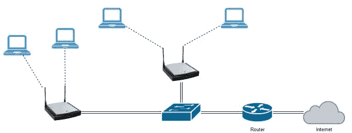
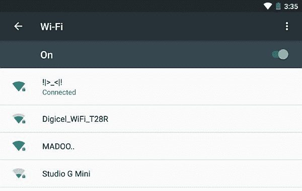
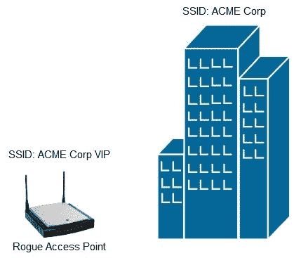
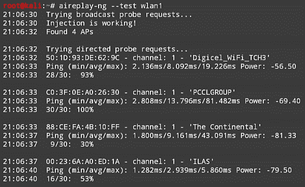
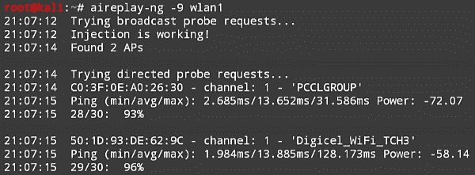
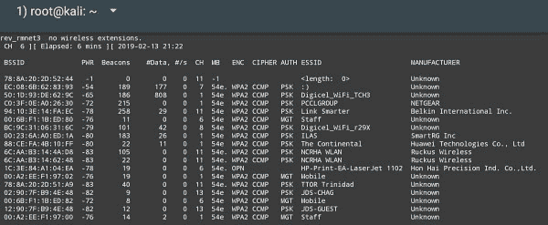
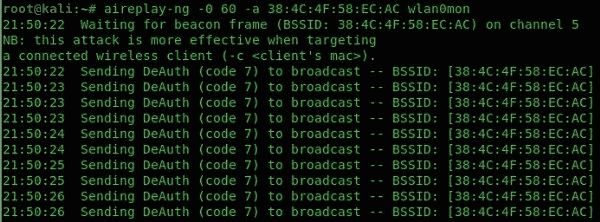
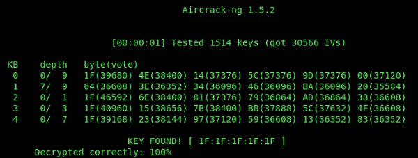

# 以无线设备和网络为目标

十年前，世界上没有那么多的移动设备。那时，只有笔记本电脑使用无线网络技术，直到智能手机产业开始。现代企业正在采用**自带设备**（**BYOD**）概念，企业允许员工将个人移动设备（如智能手机、平板电脑或笔记本电脑）安全连接到企业网络，因为这将提高整体生产率。

随着越来越多的移动设备被引入企业网络，这就产生了一些安全问题，并威胁到企业无线和有线网络基础设施的安全态势。此外，无线网络设备上的配置，例如**接入点**（**AP**）或无线路由器，可能不符合公司标准。有时，网络管理员可能忘记应用安全配置，或者只是使用默认设置在生产网络中部署设备。

在本章中，我们将了解以下主题：

*   无线网络的类型
*   无线标准
*   无线认证模式
*   无线加密标准
*   无线威胁
*   无线攻击
*   蓝牙黑客

在无线联网开始之前，每个设备都需要一根物理电缆，将设备的**网络接口卡**（**NIC**）连接到网络交换机，以与其他设备通信并共享资源。使用有线网络的主要限制是终端设备，如计算机或服务器，受到网络电缆长度的限制。与大多数类别（CAT）电缆一样，如 CAT 5、5e 和 6，最大电缆长度为 100 米。此外，对于某些用户来说，不得不用很长的电缆四处移动的不便有时太令人沮丧了。

使用无线信道的 IEEE 802.11 标准的创建为现代无线网络铺平了道路。

以下是使用 IEEE 802.11 无线网络的一些优点：

*   它消除了将电缆连接到每个终端设备的需要
*   它为难以铺设网络电缆的区域提供网络连接
*   它允许设备在接入点（AP）或无线路由器的区域内漫游

然而，使用无线网络可能会产生一些问题。以下是使用 IEEE 802.11 的一些缺点：

*   由于存在安全漏洞，可能会破坏无线加密
*   无线网络的带宽通常低于有线网络
*   来自其他无线电发射装置的干扰
*   信号在远处减弱

# 无线网络拓扑

在本节中，我们将讨论各种类型的无线网络拓扑。在攻击无线网络之前，渗透测试人员应该了解无线网络设计以及客户端如何互连。

# 独立基本服务集

在**独立基本业务集**（**IBSS**中，本设计/拓扑中没有 AP 或无线路由器。每个客户端设备通过 IEEE 802.11 标准与其他设备建立连接。这就是所谓的自组织网络：


# 基本服务集

在**基本服务器集**（**BSS**设计中，所有客户端通过无线路由器或 AP 进行互联。无线路由器或 AP 负责在客户端和有线网络之间移动网络流量。这种类型的拓扑也称为基础设施模式：


# 扩展服务集

**扩展业务集**（**ESS**模式）与 BSS 非常相似。在 ESS 中，有多个 AP 或无线路由器连接到同一有线网络。这种设计有助于将无线信号扩展到整个建筑物或建筑群，允许用户访问网络内的资源，同时用户可以漫游：



# 无线标准

**电气和电子工程师协会****电气和电子工程师协会**（**IEEE**）在计算和 IT 行业制定了许多标准。网络和安全领域的专业人士知道的一个非常流行的标准是 IEEE 802.11 标准，该标准概述了无线通信如何在 2.4 GHz 和 5 GHz 频率上运行。普通消费者知道这项技术的另一个名字：Wi-Fi。

下表概述了 IEEE 802.11 标准的不同变化及其工作频率和最大带宽容量：


如果您的目标是在 5 GHz 频率上运行的无线网络，并且您的无线网络适配器使用的是仅在 2.4 GHz 上运行的标准频率，则您将无法成功地对目标网络执行任何攻击。

# 服务集标识

**服务集标识符**（**SSID**）是最常见的无线网络名称，笔记本电脑、智能手机和其他移动设备都可以看到它。SSID 用于帮助我们区分特定网络与其他网络。AP 或无线路由器通过广播消息持续播发其 SSID，而客户端（如笔记本电脑）则捕获这些广播消息（更好地称为信标）以获取其包含的 SSID。

SSID 通常是人类可读的文本或最大长度为 32 字节的字符。以下是安卓平板电脑发现的 SSID 示例：



# 无线认证模式

在无线网络上，通常有三种不同的方式可以将客户端设备验证到无线路由器或接入点：

*   开放式身份验证
*   共享密钥身份验证
*   集中认证

开放式认证系统非常简单。无线路由器或 AP 没有配置密码，只是将其 SSID 广播给附近的每个人。希望连接的客户端可以自由连接，无需在访问无线网络之前提供任何类型的凭据或身份。使用开放身份验证的一个例子是在公共区域和场所（如咖啡店）提供免费热点服务。

在共享密钥认证系统中，无线路由器或 AP 配置有预共享密钥（PSK）。此方法仅允许客户端在能够提供正确密钥的情况下连接到无线网络。没有相应密钥的客户端将被拒绝访问。这种方法在家庭网络中最常见。

在集中式身份验证中，集中式身份验证服务器用于管理网络用户帐户、权限和记帐。无线路由器或 AP 没有配置密钥，而是与集中认证系统通信以查询无线网络上的每次登录尝试。让我们设想一个用户想要将其笔记本电脑连接到无线网络，因此他们选择适当的 SSID 并尝试连接。无线路由器向用户发送登录请求。提示用户输入其网络用户凭据；然后，无线路由器将登录凭据发送到身份验证服务器进行验证。如果获得批准，身份验证服务器将通知无线路由器允许访问并向用户分配某些权限。如果账号无效，认证服务器会通知无线路由器不要授予网络访问权。这种方法通常出现在公司网络中：


Both **Remote Authentication Dial-In User Service (RADIUS)** and **Terminal Access Controller Access-Control System Plus (TACACS+)** are examples of centralized authentication servers.

# 无线加密标准

作为渗透测试人员，了解各种类型的无线加密及其标准非常重要。

# 有线等效隐私

**有线等效隐私**（**WEP**标准）是在 IEEE 802.11 网络中实施的第一个加密标准。它设计用于在接入点和客户端之间的所有无线通信期间提供数据保密性。WEP 使用**RC4**加密密码/算法确保传输过程中的机密性；然而，WEP 加密标准使用**24 位初始化向量（IV）**。在本例中，IV 用于为 RC4 加密算法创建密码流。

以下是 WEP 的各种关键尺寸：

*   64 位 WEP 使用 40 位密钥
*   128 位 WEP 使用 104 位密钥
*   256 位 WEP 使用 232 位密钥

多年来，WEP 因其设计缺陷而闻名，在应用于 IEEE 802.11 网络时被视为安全漏洞。

# 受 Wi-Fi 保护的访问

**Wi-Fi 保护接入**（**WPA**）是为 IEEE 802.11 网络设计的另一种加密标准，是 WEP 标准的继承者。WPA 使用**临时密钥完整性协议**（**TKIP**），该协议使用**RC4**密码（每包 128 位）进行数据加密（保密性）。然而，TKIP 通过简单地增加**初始化向量**（**IVs**的大小）并混合它们的功能，缓解了 WEP 的漏洞。**128 位****临时密钥**与客户端设备的**媒体访问控制**（**MAC**地址）和 IVs 相结合，创建密钥流，然后用于数据加密。

# 受 Wi-Fi 保护的访问 2

**Wi-Fi 保护接入 2**（**WPA2**是 IEEE 802.11 无线网络 WPA 加密标准的继承者。本标准采用**高级加密标准**（**AES**），优于 RC4 加密密码套件。AES 对数据报块提供了更强的加密，以确保数据的机密性。此外，WPA2 采用**计数器模式，密码分组链接消息认证码协议**（**CCMP**），优于 TKIP。CCMP 通过使用 128 位密钥与 AES 一起提供机密性来处理数据加密，AES 创建 128 位数据块

有关无线安全标准的更多信息，请访问 Wi-Fi 联盟网站[https://www.wi-fi.org/discover-wi-fi/security](https://www.wi-fi.org/discover-wi-fi/security) 。

# 无线威胁

以下是使用无线网络时的安全威胁：

*   **流氓接入点**：渗透测试人员有时需要检查公司无线网络的安全态势和员工的安全意识。**流氓接入点**是渗透测试人员使用 SSID 设置*假*接入点，诱骗用户建立连接的地方。想象一下，在一个流氓接入点上创建一个 SSID，将其命名为*公司 XYZ VIP access*，然后将其打开。很多看到这个名字的人会认为这个无线网络上有特殊的资源。此技术将允许 pentester 轻松嗅探流量并获取敏感的数据：



*   **邪恶孪生兄弟**：**邪恶孪生兄弟**的设置有点类似于流氓接入点的配置。但是，对于邪恶孪生兄弟，渗透测试人员使用与实际组织相同的 SSID 在公司网络中部署接入点。当用户连接时，他们将能够访问本地资源，而不会意识到他们已连接到未经授权的访问点。这将允许 pentester 轻松拦截和嗅探流量。

*   **AP 和客户端 MAC 欺骗**：渗透测试人员可以记录接入点和相关客户端的 MAC 地址。捕获此信息将允许渗透测试仪模拟接入点，诱骗受害者连接到或使用客户端的 MAC 地址建立到接入点的连接，并启用 MAC 过滤功能。
*   **反身份验证攻击**：渗透测试人员向接入点发送精心编制的数据包，目的是在接入点与其连接的客户端设备之间建立解除关联。简言之：反身份验证攻击将导致接入点关闭一个或多个客户端。此攻击还具有以下好处：
    *   发现隐藏的 SSID。这是通过监视客户端设备发送的探测及其与接入点的关联来实现的。
    *   捕获用于破解无线网络密码的 WPA2 握手。

# 无线攻击

对于以下大多数攻击，我们将使用 aircrack ng 工具套件帮助我们实现目标。

**Aircrack-ng** can be found at [www.aircrack-ng.org](http://www.aircrack-ng.org).

# 练习–检查无线网卡是否支持注入

确定无线 NIC 是否支持数据包注入的一种快速简便的方法是使用`aireplay-ng`工具。使用`aireplay --test <*interface*>`命令将测试数据包注入。

下面的是使用该命令的演示。如您所见，我们的卡支持数据包注入：



此外，可以使用`-9`参数代替`--test`。



如果仔细查看输出，您将看到每个接入点的数据包丢失率。

# 练习-检测接入点及其制造商

我们可以检测 Kali NetHunter 设备范围内的每个接入点。我们将能够确定以下各项：

*   接入点的 MAC 地址或 BSSID
*   通过显示 PWR 值来确定其信号额定值
*   其加密标准、密码、认证方法
*   网络或 ESSID 的名称

要开始，请确保无线网络适配器处于监视模式。在启用监控模式之前，我们需要确保没有任何流程会妨碍此流程。因此，我们使用以下命令终止任何此类进程：

```
airmon-ng check kill
```

现在我们可以使用以下命令将我们的网络适配器配置为监控模式：

```
airmon-ng start wlan1
```

您的设备将开始捕获空中的信标和探测器：


按下键盘上的*A*键，您可以循环使用各种过滤器。这些过滤器包括仅查看访问点、仅查看客户端、仅查看访问点和客户端，最后，仅查看访问点、客户端和确认消息。

让我们确定可以帮助研究供应商特定产品已知漏洞的产品制造商。使用**airodump ng**工具识别特定厂商的接入点，我们可以使用`airodump-ng <*interface*> --manufacturer`命令：



# 练习–发现接入点的 WPS 版本

在本练习中，我们将在 Kali NetHunter 上的**airodump ng**工具中使用其他参数。使用`--bssid`语法指定目标的接入点，并`–c`告知我们的无线网络适配器在特定信道上侦听，将帮助我们监控特定的无线网络。我们将使用`--wps`来表示目标接入点的 WPS 模式和版本：

```
airodump-ng --bssid <bssid value> -c <channel number> <monitoring interface> --wps 
```

运行前面的命令后，我们将获得以下输出：


在执行我们的命令时，我们得到以下结果：


我们可以看到这个接入点启用了 WPS，并且正在使用版本 2。

# 练习–取消身份验证攻击

取消身份验证攻击只是试图将所有关联/连接的客户端从访问点上敲下。在本练习中，我们将使用**aireplay ng**工具帮助我们完成任务：

1.  确保您的无线 NIC 处于监视模式。
2.  使用**airodump ng**获取目标的 BSSID。
3.  使用`aireplay -0 0 –a <*target's BSSID*> <*monitoring interface*>`命令向目标接入点发送连续的 deauth 帧流。结果将使所有连接的客户端脱离网络：



aireplay ng 工具支持多种攻击模式。以下截图摘自 aireplay ng 的*手册*页：


# 练习–取消对特定客户端的身份验证

如果您的目标是无线网络上的特定客户机，我们可以使用以下命令将 deauth 帧发送到接入点，但只能关闭指定的客户机。

使用`airodump-ng --bssid <*target's BSSID*> -c <*channel #*> <*monitor interface*>`命令主动监视目标网络：


如您所见，有几个站点（客户端）与接入点相关联。让我们尝试解除客户端关联：

```
aireplay-ng -0 0 -a <target's bssid> -c <client's mac addr> wlan1mon
```

*   `-0`表示我们正在执行反身份验证攻击。
*   `0`详细说明了持续攻击。如果使用`2`，则表示只向目标发送 2 条 deauth 消息。
*   `-c`允许您指定一个特定的站（客户端设备）进行反认证。如果缺少此参数，则攻击将取消对与访问点关联的所有客户端的身份验证。

运行上述命令后，我们将获得以下屏幕截图：


# 练习-检测取消身份验证攻击

在本书的前面，我们研究了使用一种叫做**tcpdump**的神奇工具来捕获网络流量。使用此工具的另一大好处是检测取消身份验证攻击。由于攻击发生在无线电波上，我们将能够看到它并确定其目标。

为此，我们可以使用`tcpdump -n -e -s0 -vvv -i wlan0 | grep DeAuth`命令。

*   `-n`不解析 IP 地址的说明
*   `-e`表示打印 IEEE 802.11 和以太网流量类型的 MAC 地址
*   `-v`表示详细程度
*   `-i`指定接口

运行前面的命令后，我们将获得以下输出：


前面屏幕截图中显示的 BSSID 表示受害者接入点。如果这是你的接入点，这表明你正成为黑客的目标。

# 练习-发现隐藏的 SSID

许多组织倾向于禁用其 SSID 在接入点上的广播。十多年前，我们认为这是无线网络的安全配置。然而，通过先进的渗透测试工具和技术，pentester 或安全审计员可以在几分钟内发现任何隐藏的 SSID。作为渗透测试人员，如果目标的无线网络对移动设备隐藏，那么你的工作就是发现它。您需要执行以下步骤：

1.  在无线网络适配器上启用监视模式。
2.  使用`airodump-ng <*monitoring interface*>`命令显示附近的所有 ESSID。请注意，有一个网络的名称为`<length: 6>`，格式不同寻常。这表示接入点已禁用 SSID 广播：


3.  监视此特定的访问点，以确定是否存在任何关联或连接的客户端。使用以下命令：

```
airodump-ng --bssid 68:7F:74:01:28:E1 -c 6 wlan0mon
```

运行前面的命令后，我们将获得以下输出：


正如我们所看到的，目前有一个客户端已连接。

4.  创建一个简短的取消身份验证攻击，以强制客户端在断开连接时重新连接。在下面的屏幕截图中，我们将仅使用 20 帧向目标接入点发送取消身份验证攻击：


在我们的反身份验证攻击进行到一半时，客户端暂时断开连接，并发出探测以查找`dd-wrt`网络。重新建立连接后，airodump ng 将探测器信息（由站点/客户端发送）与 ESSID 和 BSSID 信息进行匹配。如我们所见，SSID/ESSID 已被披露：


# 练习-破解 WEP 和 WPA

破解 WEP 和 WPA 的第一步是从目标无线网络捕获足够的数据。我建议您使用`airodump-ng`捕获至少 15000 个数据帧。我们可以使用以下命令离线捕获和存储数据：

```
airodump-ng --bssid <*target access point*> -c <*channel*> wlan0mon –w <*output file*>
```

使用`–w`参数将允许`airodump-ng`将其数据写入指定文件。我们将捕获足够的帧，直到获得 WPA 握手：


如您所见，我们能够捕获 WPA 握手。为了增加客户端必须重新身份验证的可能性，您可以尝试使用反身份验证攻击；这将确保客户端在身份验证过程中提供密钥。

使用`aircrack-ng <*file name*>`命令验证无线接入点 ESSID、BSSID 以及是否获得握手：


我们的下一步是尝试从捕获的数据中恢复预共享密钥（PSK）。我们将使用带有密码字典文件的**aircrack ng**。要在 Kali NetHunter 或 Kali Linux 中快速找到预构建的字典文件，请使用以下命令`locate`：

```
locate password.lst
```

运行前面的命令后，我们将获得以下输出：


现在是恢复预共享密钥（PSK）的时候了；让我们使用以下命令：

`aircrack-ng dd-wrt-01.cap –w /usr/share/metasploit-framework/data/wordlists/password.lst`

在键盘上点击*回车*后，**机组 ng**将尝试字典攻击：


如您所见，预共享密钥（PSK）已成功获取。

# 破解 WEP 加密

破解 WEP 密码短语类似于破解 WPA/WPA2。在本小节中，我们将演示此方法：

1.  要执行前面提到的数据包捕获，我们可以再次使用以下命令：

```
airodump-ng --bssid <target access point> -c <channel> wlan0mon –w <output file>
```

我建议您至少捕获 15000 个数据帧，并确保获得握手。

2.  获得握手后，请确保.cap 文件已脱机保存。使用`ls -l *cap`命令查看我们目录中的所有.cap 文件：


我们可以看到有两个捕获文件。对于我们的练习，我们将使用`ptw.cap`文件。

3.  让我们尝试一些 WEP 破解技术。要启动`aircrack-ng`，请使用以下命令：

```
aircrack-ng ptw.cap
```

点击*输入*后，`aircrack-ng`将尝试恢复 WEP 密钥：



如你所见，我们找到了钥匙。

# 蓝牙黑客

与 IEEE 802.11 网络上的无线黑客行为类似，蓝牙黑客行为也存在于 IEEE 802.15 网络上。正如我们所知，通过创建一个特殊网络，可以在短距离内建立蓝牙连接：


以下是各种类型的蓝牙攻击的简短列表：

*   **蓝牙劫持**：这允许恶意用户通过连接到另一个支持蓝牙的设备的蓝牙发送未经请求的消息。
*   **Bluesnarfing**：当攻击者能够访问另一个支持蓝牙的设备上的信息时。信息可能包括受害者的电子邮件、地址簿详细信息、或短信。
*   **蓝牙化**：在寻找支持蓝牙的设备时，战争驱动的概念。
*   **Bluebugging**：这是指攻击者能够控制受害者的蓝牙设备。这使得攻击者能够监听电话并从受害者的设备发送消息。

# 总结

在本章中，我们讨论了各种无线拓扑，因为渗透测试人员在攻击阶段之前和期间了解地形非常重要。我们介绍了当前的无线认证模式和加密标准，并分析了它们的相似性和差异。此外，我们还深入讨论了无线威胁，并探讨了各种渗透测试攻击。最后，我们介绍了各种蓝牙攻击。

在下一章中，我们将讨论避免检测。在渗透测试中，您将了解各种隐身方法。