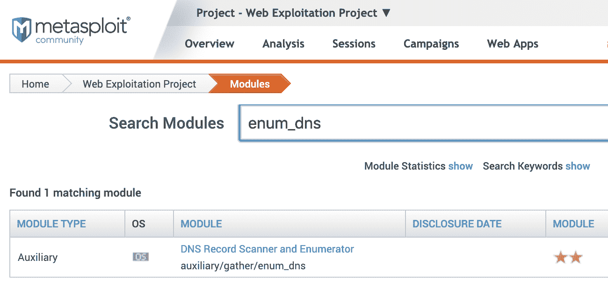
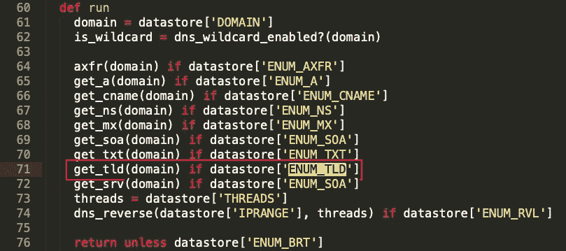
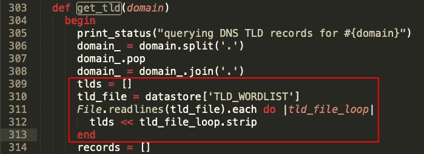
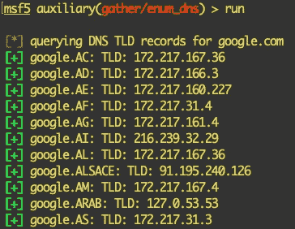
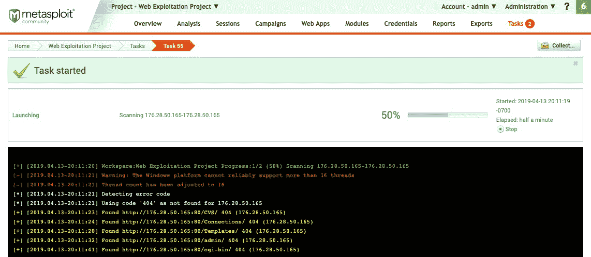
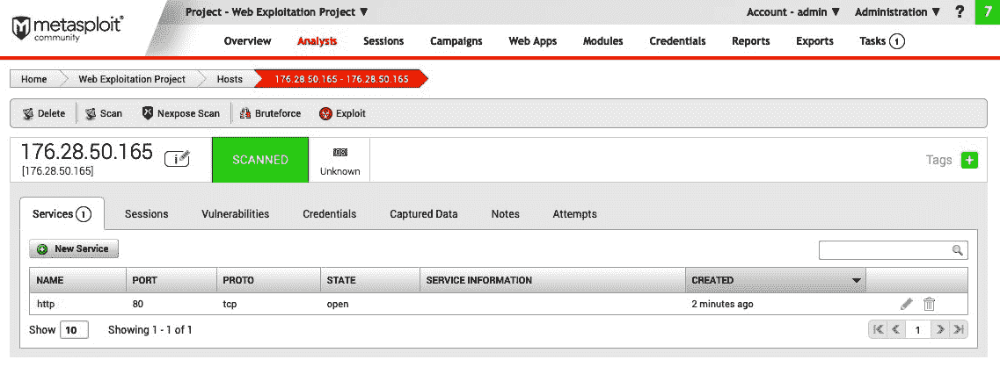
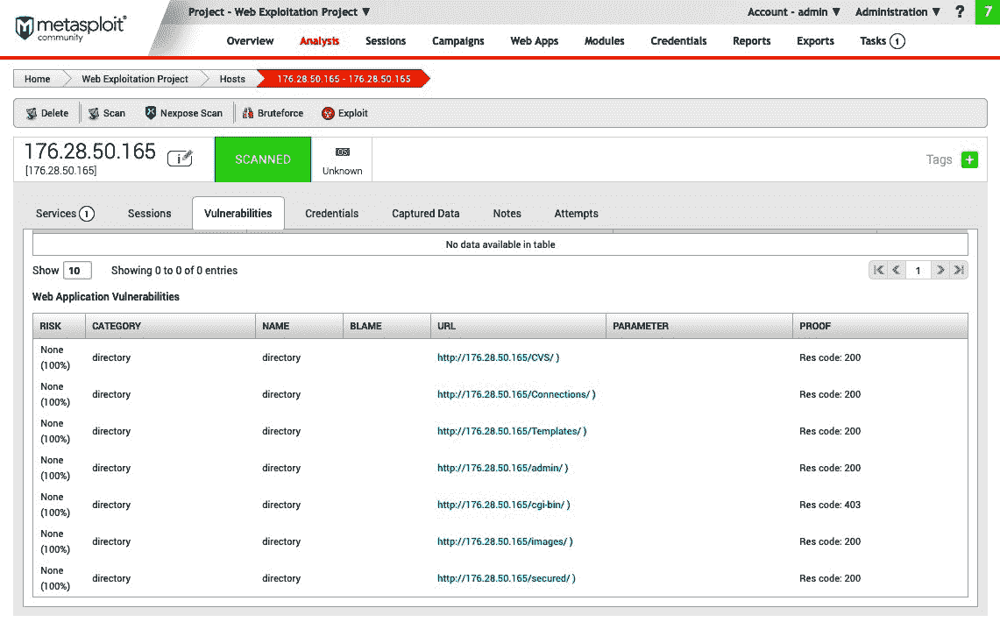
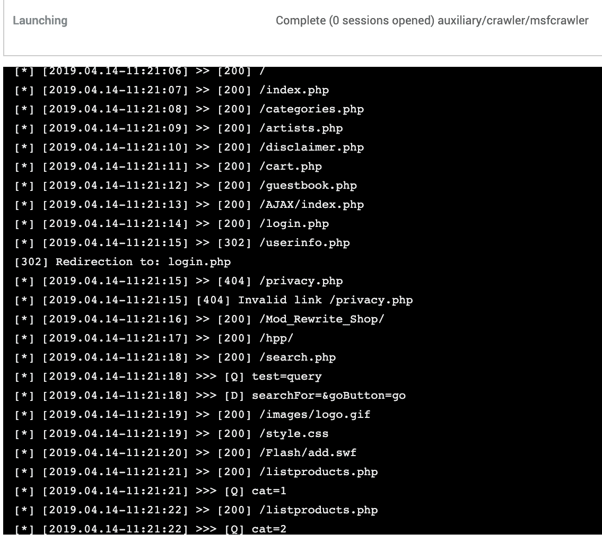
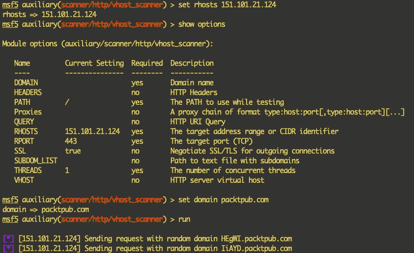

# 使用 Metasploit 的 Web 应用程序枚举

枚举是足迹的子集，属于**渗透测试执行标准**（**PTES**情报收集的第二阶段。执行枚举的主要优点是找到攻击端点，从中我们可以发起攻击或启动伪攻击负载，以确认漏洞是否存在于同一端点中。在大多数渗透测试案例中，测试人员花费大约 60-70%的时间查找信息。测试人员使用此信息来识别一些新的漏洞。枚举越好，渗透测试的结果越好。在本章中，我们将介绍以下主题：

*   枚举简介
*   DNS 枚举
*   枚举文件
*   用 Metasploit 爬行和刮削

# 技术要求

以下是本章的先决条件：

*   Metasploit**社区版**（**CE**已安装 web 界面）
*   *基于 nix 的系统或 Microsoft Windows 系统
*   建议使用枚举列表的通用词列表

# 枚举简介

在枚举过程中，我们从初始足迹/侦察中检索到的所有信息将首次被使用。对于 web 应用程序的测试，我们需要非常了解枚举过程。侦察和枚举的效果越好，我们发现 web 应用程序中的漏洞就越快、越容易。使用枚举，我们可以找到以下内容：

*   隐藏的文件和目录
*   备份和配置文件
*   子域和虚拟主机

让我们首先看看 DNS 枚举以及如何使用 Metasploit 枚举 DNS。

# DNS 枚举

Metasploit 还可用于使用`dns_enum`辅助工具从 DNS 记录中获取有关主机的信息。此脚本使用 DNS 查询获取**MX**（**邮件交换器**）、**SOA**（**权限启动**）和**SRV**（**服务**记录等信息。它可以在网络内部或外部使用。有时，DNS 服务被配置为可供公众访问；在这种情况下，我们可以使用`dns_enum`查找内部网络主机、MAC 地址和 IP 地址。在本节中，我们将了解`dns_enum`的用法：

1.  我们可以使用模块搜索选项中的`enum_dns`关键字来查找辅助项：



2.  单击模块名称将重定向到选项页面，如以下屏幕截图所示：


在这里，我们可以设置目标详细信息，例如我们正在使用的 DNS 服务器、域名以及我们希望脚本获取哪些记录。

3.  单击 Run Module（运行模块）将创建一个新任务，其中将显示输出，如以下屏幕截图所示：


现在，让我们看看如何进一步改进，以满足我们的需求，并使模块获得更多的结果。

# 再接再厉——编辑源代码

Metasploit 中的`enum_dns`模块有点过时（我们可以查看 TLD 单词列表以获取更新）。因此，让我们定制模块以满足我们的需要。其想法是为`enum_dns`提供**顶级****级域**（**TLD**）词表，并对条目进行解析和检查以查询记录。查看辅助设备的源代码，我们可以看到它寻找的 TLD 没有最近发布的新 TLD：


这可以在`modules/auxiliary/gather/enum.dns.rb`文件的*第 302 行*中看到，也可以通过访问以下链接在线访问：

[https://github.com/rapid7/metasploit-framework/blob/f41a90a5828c72f34f9510d911ce176c9d776f47/modules/auxiliary/gather/enum_dns.rb#L302](https://github.com/rapid7/metasploit-framework/blob/f41a90a5828c72f34f9510d911ce176c9d776f47/modules/auxiliary/gather/enum_dns.rb#L302)

从前面的源代码中，我们可以看到 TLD 存储在`tlds[]`数组中。让我们通过执行以下步骤来编辑代码以更新 TLD。更新的 TLD 列表可从**互联网分配号码管理局**（**IANA**网站：[找到 http://data.iana.org/TLD/tlds-alpha-by-domain.txt](http://data.iana.org/TLD/tlds-alpha-by-domain.txt) ：

1.  从前面的 URL 下载 TLD 文件并删除第一行，从`#`开始：


2.  在修改 Metasploit 模块之前，使用以下命令备份`enum_dns.rb`文件：

```
cp /usr/local/share/metasploit-framework/modules/auxiliary/gather/enum_dns.rb enum_db.rb.bak
```

请注意，Metasploit 框架安装在`/usr/local/share`目录中。在本例中，我们将文件命名为`enum_dns.rb.bak`。

3.  现在，在您选择的任何文本编辑器中打开`enum_dns.rb`文件，并转到第 29 行：


4.  让我们在代码中添加另一个寄存器条目，以便向 Metasploit 模块提供 TLD 字列表：


在此模块中，默认情况下禁用 TLD 枚举。正如我们从前面的屏幕截图中看到的，`ENUM_TLD`选项将通过在设置为`TRUE`时用 IANA TLD 列表（旧列表）替换 TLD 来执行 TLD 扩展。

5.  让我们搜索`ENUM_TLD`字符串以查找`function()`，启用 TLD 枚举选项时将调用该字符串。

从下面的截图可以看出，如果`ENUM_TLD`设置为`TRUE`，则会调用`get_tld()`函数：



6.  现在我们来看一下`get_tld()`函数：


7.  现在，让我们添加一个代码部分，它将加载最新的 TLD 单词列表并将其保存在`tlds[]`数组中。请注意，我们已经从前面的屏幕截图中清空了 TLD 阵列：



我们在这里做了什么？下表说明了上一个屏幕截图中使用的函数和代码结构：

| **代码** | **说明** |
| `tlds = []` | 这声明了一个数组。 |
| `tld_file = datastore['TLD_WORDLIST']` | 这会将单词列表文件名（带位置）保存在`tld_file`变量中。 |
| `File.readlines(tld_file).each do &#124;tld_file_loop&#124;` | 这将逐行读取 TLD 单词列表。 |
| `tlds << tld_file_loop.strip` | 这将从每行中剥离出`\n`，并将其保存在`tlds[]`数组中。 |

8.  现在，保存文件并在 msfconsole 中执行`reload`命令，在框架中重新加载模块：


9.  现在我们使用定制的`enum_dns`模块，执行`show options`：


正如我们在前面的屏幕截图中所看到的，我们已经将域名设置为`google.com`以查找 Google 的 TLD。我们还将`TLD_WORDLIST`选项设置为更新的 TLD 单词列表。让我们执行它：



答对 了更新后的 Metasploit 模块现在向我们展示了 TLD，它们提供给模块本身。现在让我们进入下一节，我们将使用 Metasploit 枚举文件和目录。

# 枚举文件

枚举文件和目录是 pentest 活动中最重要的步骤之一。服务器端的一个小错误配置可能会导致我们找到以下文件：

*   隐藏文件
*   备份文件
*   配置文件
*   重复文件
*   包含丰富信息的文件，例如凭据文件、密码备份、错误日志、访问日志和调试跟踪

这些文件中包含的信息可以帮助我们计划对组织的进一步攻击。

以下是 Metasploit 框架中提供的一些辅助工具，可以帮助我们收集信息：

*   `dir_scanner`
*   `brute_dirs`
*   `prev_dir_same_name_file`
*   `dir_listing`
*   `copy_of_file`
*   `Backup_file`

以下是上述辅助设备的一些示例：

1.  我们可以使用 HTTP 目录扫描模块查找目录列表以及隐藏目录。我们可以使用`dir_scanner`关键字查找模块，如下图所示：


2.  单击模块名称将带我们进入选项页面，在那里我们可以指定目标 IP/域名和端口号，如以下屏幕截图所示：


3.  单击运行模块将创建一个新任务，我们可以在任务窗口中看到输出：



前面的屏幕截图显示了脚本发现的不同目录。

4.  扫描完成后，我们还可以在“主机”选项卡中查看目录列表：



5.  我们转到“分析”选项卡并选择执行扫描的主机。

6.  单击漏洞选项卡将向我们显示辅助设备找到的所有目录的列表，如以下屏幕截图所示。同样，我们可以使用本节开头列出的其他模块执行进一步的枚举：



在下一节中，我们将学习使用 web 辅助工具进行爬行和抓取。

# 用 Metasploit 爬行和刮削

Metasploit 还允许我们使用辅助设备爬行和刮网。当我们想通过定义的模式从网站的源代码中获取一些东西时，抓取是很有用的。它可以为我们提供诸如评论中提到的目录、开发人员电子邮件以及在后台进行的 API 调用等信息：

1.  对于爬网，我们可以使用`crawl`关键字查找模块：


2.  我们将使用`msfcrawler`。单击模块将重定向到选项页面，在该页面中定义目标、端口和深度。然后，单击运行模块：


3.  将创建一个新任务，我们将看到任务窗口中的页面列表：



4.  同样，我们可以使用 HTTP 刮取模块`auxiliary/scanner/http/scraper`刮取网页：


模式字段是一个正则表达式，我们定义它来查找所需的任何元素。在我们的例子中，我们想要抓取[上脚本标记内的所有内容 https://prod.packtpub.com/](https://prod.packtpub.com/) 网站，所以我们的模式是`<script \ type=\"text\/javascript\" \ src=\"(.*)\"><\/script>)`。

运行该模块将创建一个新任务，辅助程序将提取脚本标记中列出的所有数据，如以下屏幕截图所示：


接下来，让我们扫描虚拟主机。

# 扫描虚拟主机

Metasploit 还允许我们扫描在同一 IP 上配置的虚拟主机。虚拟主机是在一台服务器上托管多个域，每个域名都配置了不同的服务。它允许单个服务器共享资源：

1.  我们将为这个模块使用 Metasploit 控制台。要搜索`vhost`模块，我们可以使用`vhost_scanner`关键字：


2.  我们设置了`rhosts`和`domain`。在我们的案例中，我们使用了`packtpub.com`域和`151.101.21.124`IP：



3.  我们通过输入`run`来运行模块。辅助设备将扫描并打印所有找到的`vhosts`：


此辅助工具还可用于内部网络，以查找托管在同一服务器上但配置有不同域的不同内部应用程序。

# 总结

在本章中，我们介绍了枚举，它是五旬期生命周期中最重要的部分。我们首先使用 Metasploit 模块枚举 DNS，然后继续枚举文件和目录。最后，我们研究了爬行模块和`vhost`查找模块。

在下一章中，我们将学习如何使用 web 应用程序扫描工具或 WMAP。WMAP 是一个 Metasploit 插件，用于在目标 web 应用程序上执行漏洞扫描

# 问题

1.  我们可以使用自定义字典进行文件和目录枚举吗？

2.  我们是否可以定制 Metasploit 负载以一次性自动化所有枚举？

3.  我们真的需要提供一个用于抓取 HTTP 页面的正则表达式吗？

# 进一步阅读

以下是一些可供进一步阅读的 URL：

*   [https://www.offensive-security.com/metasploit-unleashed/](https://www.offensive-security.com/metasploit-unleashed/)
*   [https://resources.infosecinstitute.com/what-is-enumeration/](https://resources.infosecinstitute.com/what-is-enumeration/)