# 八、渗透测试 CMS——WordPress

CMS 代表内容管理系统—用于管理和修改数字内容的系统。它支持多个用户、作者和订阅者的协作。互联网上使用了很多 CMSE，其中一些主要的是 WordPress、Joomla、PHPNuke 和**AEM**（**Adobe 体验管理器**）。在本章中，我们将研究一个著名的 CMS，WordPress。我们将了解如何在此 CMS 上执行渗透测试。

本章将介绍以下主题：

*   WordPress 体系结构简介
*   使用 Metasploit 进行 WordPress 侦察和枚举
*   WordPress 的漏洞扫描
*   WordPress 开发
*   自定义 Metasploit 漏洞

# 技术要求

以下是本章的先决条件：

*   Metasploit 框架
*   已安装 WordPress CMS
*   已配置数据库服务器（建议使用 MySQL）
*   Linux 命令的基本知识

# WordPress 简介

WordPress 是一个开源 CMS，前端使用 PHP，后端使用 MySQL。它主要用于写博客，但也支持论坛、媒体画廊和在线商店。WordPress 于 2003 年 5 月 27 日由其创始人 Matt Mullenweg 和 Mike Little 发布。它还包括一个插件架构和模板系统。WordPress 插件架构允许用户扩展其网站或博客的功能。截至 2019 年 2 月，WordPress.org 拥有 54402 个免费插件和 1500 多个高级插件。WordPress 用户还可以自由创建和开发自己的自定义主题，只要他们遵循 WordPress 标准。

在研究 WordPress 枚举和利用之前，让我们先了解运行 WordPress 的体系结构。

# WordPress 架构

WordPress 架构可分为四个主要部分：

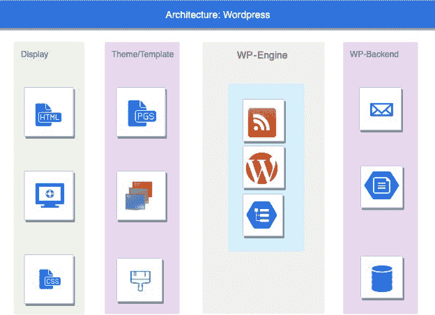

让我们看一下各个部分：

*   **显示**：包含用户可见的 HTML、CSS 和 JavaScript 文件。
*   **主题/模板**：包括表单、主题文件、不同的 WordPress 页面，以及评论、页眉、页脚和错误页面等部分。
*   **WP 引擎**：该引擎负责整个 CMS 的核心功能，如 RSS 提要、与数据库通信、设置、文件管理、媒体管理、缓存等。
*   **WP 后端**：包括数据库、PHP 邮件 cron 作业和文件系统。

现在，让我们看看目录结构。

# 文件/目录结构

浏览 WordPress 目录将为我们提供一个文件/文件夹结构，如以下屏幕截图所示：


让我们快速浏览一下这些文件夹和文件。

# 基本文件夹

让我们将其称为根目录。此目录包含三个文件夹，分别为`wp-admin`、`wp-content`和`wp-includes`，以及一组 PHP 文件，其中最重要的一个是`wp-config.php`。

基本文件夹包含 WordPress 核心操作所需的所有其他 PHP 文件和类。

# 可湿性粉剂包括

wp includes 文件夹包含前端使用的以及 Wordpress 核心所需的所有其他 PHP 文件和类。

# wp 管理员

此文件夹包含 WordPress 仪表板的文件，该仪表板用于执行所有管理任务，如撰写文章、调整评论以及安装插件和主题。仅允许注册用户访问仪表板。

# 可湿性粉剂含量

`wp-content`文件夹包含所有用户上传的数据，并再次分为三个子文件夹：

*   `themes`
*   `plugins`
*   `uploads`

`themes`目录包含我们 WordPress 网站上安装的所有主题。默认情况下，WordPress 有两个主题：212 和 213。

类似地，`plugins`文件夹用于存储我们 WordPress 网站上安装的所有插件。自我们启动网站以来，我们上传的所有图像（和其他媒体文件）都将存储在`uploads`目录中。它们按天、月和年分类。

现在您已经基本了解了 WordPress 的体系结构和文件/目录结构，让我们开始笔测试。

# WordPress 侦察和枚举

在您开始利用 WordPress 的任何插件/主题/核心漏洞之前，第一步是确认该站点是否位于 WordPress 上。至于检测 WordPress 本身，检测 WordPress CMS 安装的方法有多种：

*   在 HTML 页面源中搜索`wp-content`字符串。
*   查找 WordPress 安装时返回的`/wp-trackback.php`或`/wp-links-opml.php`文件名。

*   您也可以尝试`/wp-admin/admin-ajax.php`和`/wp-login.php`。
*   查找静态文件，如`readme.html`和`/wp-includes/js/colorpicker.js`。

一旦确认站点正在 WordPress 上运行，下一步就是要知道目标服务器上运行的是哪个版本的 WordPress。要实现这一点，您需要知道检测其版本号的不同方法。为什么是版本号？因为基于目标服务器上安装的 WordPress 版本，您可以测试基于插件或 WordPress 核心的漏洞利用，这些漏洞可能公开，也可能不公开。

# 版本检测

每个 WordPress 安装都有一个版本号。在最新的 WordPress 版本中，默认情况下隐藏了版本号，但我们仍然可以枚举版本。在本节中，您将学习一些识别正在运行哪个版本的 WordPress 的方法。

最常见的侦察技术有`Readme.html`、元生成器、提要（RDF、Atom 和 RSS）、插件和主题（JS 和 CSS 版本）以及散列匹配。

# 自述文件

这是最简单的技巧。我们所要做的就是访问`readme.html`页面，它在中间披露了版本号。该文件的最初目的是向 CMS 的首次用户提供有关如何继续安装和使用 WordPress 的信息。安装和设置完成后，应将其删除。使用任何工具（包括 Metasploit）时，在执行任何类型的攻击之前，请始终检查 WordPress 安装的版本号。

所以，确保您知道要测试的版本。您可以在以下屏幕截图中看到`readme.html`的示例：


接下来，我们将研究元生成器。

# 元生成器

具有`generator`名称属性的元标记通常被描述为用于生成文档/网页的软件。确切的版本号在 meta 标签的`content`属性中公开。基于 WordPress 的网站通常在其源代码中有此标记，如以下屏幕截图所示：


接下来，我们将看到如何通过 JavaScript 和 CSS 文件获得该版本。

# 通过 JavaScript 和 CSS 文件获取版本

另一种查找版本号的方法是查看以下文件的源代码。以下文件请求 JS 和 CSS 文件：

*   `wp-admin/install.php`
*   `wp-admin/upgrade.php`
*   `wp-login.php`

它们在其`ver`参数中披露了确切的版本号，如以下屏幕截图所示：


接下来，我们将看到如何通过提要获取版本。

# 通过提要获取版本

有时，版本信息也可能在网站的提要中披露。以下文件路径可用于披露版本信息：

*   `/index.php/feed/`
*   `/index.php/feed/rss/`
*   `/index.php/feed/rss2/`
*   `/index.php/comments/feed/`
*   `/index.php/feed/rdf/`（文件在本地下载）
*   `/index.php/feed/atom/`
*   `/?feed=atom`
*   `/?feed=rss`

*   `/?feed=rss2`
*   `/?feed=rdf`

以下屏幕截图显示了通过提要披露的版本：

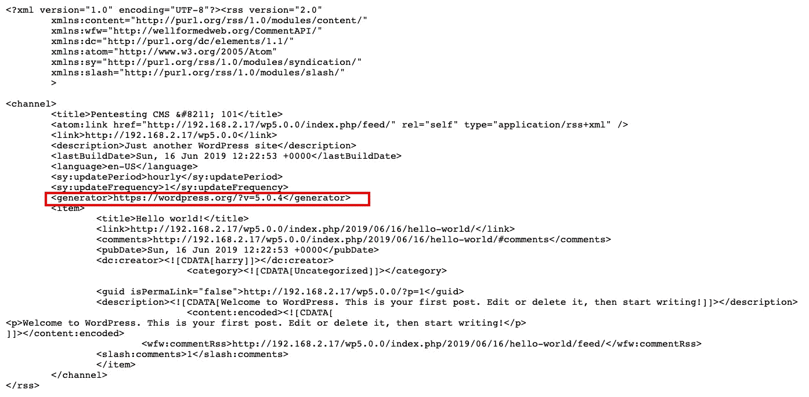

接下来，我们将研究 OPML。

# 使用大纲处理器标记语言（OPML）

OPML 是用于大纲的 XML 格式（定义为*树，其中每个节点包含一组具有字符串值*的命名属性）。以下文件允许 WordPress 从其他网站导入链接，只要它们是 OPML 格式，但访问此文件也会披露版本信息（在 HTML 注释标记之间），如以下屏幕截图所示：

```
/wp-links-opml.php
```

这可以在以下屏幕截图中看到：


接下来，我们将研究高级指纹识别。

# 独特/高级指纹识别

这是对 WordPress 提取指纹的另一种方法，可以找出确切的版本。顾名思义，这项技术非常独特。这是通过计算静态文件的哈希值并将其与 WordPress 不同版本中相同静态文件的哈希值进行比较来完成的。可以通过执行以下命令来执行此操作：


要比较散列，请参阅以下 GitHub 存储库，位于：[https://github.com/philipjohn/exploit-scanner-hashes](https://github.com/philipjohn/exploit-scanner-hashes) 。

# 使用 Metasploit 进行 WordPress 侦察

Metasploit 有一个扫描模块，用于 WordPress 获取版本号`wordpress_scanner`。

让我们设置此模块的选项：


一切就绪后，让我们运行它：


这是一个非常简单的扫描仪，它尝试使用前面提到的技术查找版本号。

现在我们有了版本号，您可以参考以下关于如何枚举和利用 WordPress 漏洞的案例研究。详细解释了给出的漏洞。

# 使用 Metasploit 的 WordPress 枚举

以下是可以集中枚举时间的攻击面：

*   保护用户名
*   主题
*   插件

使用 Metasploit 模块`auxiliary/scanner/http/wordpress_login_enum`，执行以下步骤：

1.  您可以尝试强制使用用户名，也可以枚举用户名：


2.  让我们将选项设置为仅枚举用户名并运行模块：


3.  您现在可以使用字典尝试暴力强制。模块的默认选项使其能够执行暴力攻击：


4.  现在让我们设置选项。我们已设置从前面的枚举方法中找到的用户名：


5.  对于密码字典，使用`set PASS_FILE <file>`命令并运行模块：

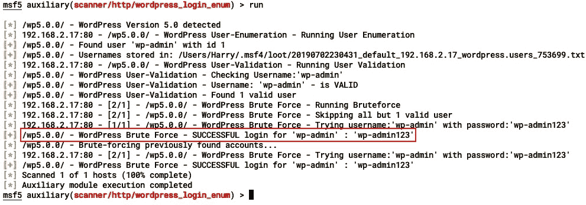

在下一节中，我们将介绍漏洞评估扫描。

# WordPress 的漏洞评估

Metasploit 没有可以执行漏洞评估扫描的模块。但是，您可以编写一个 Metasploit 模块，作为第三方工具（如 WPscan）的包装器，该工具可用于漏洞评估扫描。

我们已经编写了一个自定义 Metasploit 模块，它在执行时将运行 WPscan、解析输出并打印输出。虽然模块只是一个粗略的包装代码，但您可以根据需要进一步修改它。以下是自定义 Metasploit 模块的示例代码：

1.  我们将首先添加所需的库，如下所示：

```
require 'open3'
require 'fileutils'
require 'json'
require 'pp'
```

2.  然后，我们添加 Metasploit`Auxiliary`类：

```
class MetasploitModule < Msf::Auxiliary
 include Msf::Auxiliary::Report
```

3.  我们定义了模块的信息部分：

```
def initialize
 super(
 'Name' => 'Metasploit WordPress Scanner (WPscan)',
 'Description' => 'Runs wpscan via Metasploit',
 'Author' => [ 'Harpreet Singh', 'Himanshu Sharma' ]
 )
```

4.  在这里，我们将为模块添加`options`部分，使用该部分我们可以为测试添加目标 URL：

```
register_options(
 [
     OptString.new('TARGET_URL', [true, 'The target URL to be scanned using wpscan'])
 ]
 )
 end
```

5.  接下来，我们定义将存储用户选项`TARGET_URL`的`target_url`方法：

```
def target_url
 datastore['TARGET_URL']
end
```

6.  我们还定义了`find_wpscan_path`方法，在系统中查找`wpscan`文件：

```
def find_wpscan_path
 Rex::FileUtils.find_full_path("wpscan")
end
```

7.  接下来，我们添加辅助模块执行方式`run`，并检查`wpscan`是否安装在系统上：

```
def run
 wpscan = find_wpscan_path
 if wpscan.nil?
 print_error("Please install wpscan gem via: gem install wpscan")
 end
```

如果找到`wpscan`，模块将首先创建一个带有随机字符的临时文件：

```
tmp_file_name = Rex::Text.rand_text_alpha(10)
```

8.  以下是`wpscan`执行块。此处将创建一个带有用户选项的`wpscan`流程：

```
cmd = [ wpscan, "--url", target_url, "-o", "#{tmp_file_name}", "-f", "json", "--force" ]
 ::IO.popen(cmd, "rb") do |fd|
     print_status("Running WPscan on #{target_url}")
     print_line("\t\t\t\t(This may take some time)\n")
     fd.each_line do |line|
         print_status("Output: #{line.strip}")
     end
 end
```

执行完成后，模块将读取包含`wpscan`输出的临时文件：

```
json = File.read("/tmp/#{tmp_file_name}")
```

9.  现在，我们添加将解析 JSON 输出的代码块：

```
obj = JSON.parse(json)
 i = 0
 print_line("\n")
 print_status("-------------------------------------")
 print_status("Looking for some Interesting Findings")
 print_status("-------------------------------------")
 obj = obj.compact
```

这里，我们在 JSON 输出中寻找`interesting_findings`数组。我们将使用此数组打印 WordPress 目标站点中发现的漏洞的详细信息：

```

 while (i <= obj['interesting_findings'].length) do
     if obj['interesting_findings'][i]['type'] == 'headers' && !(obj['interesting_findings'][i].nil?)
         obj['interesting_findings'][i]['interesting_entries'].each { |x|                     print_good("Found Some Interesting Enteries via Header detection: #{x}")}
         i += 1
     elsif obj['interesting_findings'][i]['type'] == 'robots_txt' && (!obj['interesting_findings'][i].nil?)
         obj['interesting_findings'][i]['interesting_entries'].each { |x| print_good("Found Some Interesting Enteries via robots.txt: #{x}")}
         i += 1
     else
         break
     end
 end
```

10.  通过在 JSON 输出中查找并解析`version`数组，我们添加了用于检查 WordPress 版本的代码块：

```
 print_line("\n")
 print_status("--------------------------------------")
 print_status("Looking for the WordPress version now")
 print_status("--------------------------------------")
 if !(obj['version'].nil?)
     print_good("Found WordPress version: " + obj['version']['number'] + " via " + obj['version']['found_by'])
 else
     print_error("Version not found")
 end
```

我们解析`wpscan`发现的漏洞总数并打印（包括引用和 CVE 链接）：

```
 print_status "#{obj['version']['vulnerabilities'].count} vulnerabilities identified:"
 obj['version']['vulnerabilities'].each do |x|
 print_error("\tTitle: #{x['title']}")
 print_line("\tFixed in: #{x['fixed_in']}")
 print_line("\tReferences:")
 x['references'].each do |ref|
 if ref[0].include?'cve'
     print_line("\t\t- https://cve.mitre.org/cgi-bin/cvename.cgi?name=#{ref[1][0]}")
 elsif ref[0].include?'url'
     ref[1].each do |e|
     print_line("\t\t- #{e}")
 end
 elsif ref[0].include?'wpvulndb'
     print_line("\t\t- https://wpvulndb.com/vulnerabilities/#{ref[1][0]}")
 end
 end
 print_line("\n")
 end
```

11.  我们使用`wpscan`添加用于检查已安装主题的代码块：

```
 print_line("\n")
 print_status("------------------------------------------")
 print_status("Checking for installed themes in WordPress")
 print_status("------------------------------------------")
 if !(obj['main_theme'].nil?)
     print_good("Theme found: " + "\"" + obj['main_theme']['slug'] + "\"" + " via " + obj['main_theme']['found_by'] + " with version: " + obj['main_theme']['version']['number'])
 else
     print_error("Theme not found")
 end
```

我们还添加了使用`wpscan`枚举已安装插件的代码块：

```
 print_line("\n")
 print_status("---------------------------------")
 print_status("Enumerating installed plugins now")
 print_status("---------------------------------")
 if !(obj['plugins'].nil?)
     obj['plugins'].each do |x|
     if !x[1]['version'].nil?
         print_good "Plugin Found: #{x[0]}"
         print_status "\tPlugin Installed Version: #{x[1]['version']['number']}"
         if x[1]['version']['number'] < x[1]['latest_version']
             print_warning "\tThe version is out of date, the latest version is #{x[1]['latest_version']}"
         elsif x[1]['version']['number'] == x[1]['latest_version']
             print_status "\tLatest Version: #{x[1]['version']['number']} (up to date)"
         else
             print_status "\tPlugin Location: #{x[1]['location']}"
         end 
    else
     print_good "Plugin Found: #{x[0]}, Version: No version found"
 end
```

12.  然后，我们添加代码块以查找已安装插件中发现的漏洞，并根据 CVE 和参考 URL（包括`exploit-db`URL）进行映射：

```
 if x[1]['vulnerabilities'].count > 0
     print_status "#{x[1]['vulnerabilities'].count} vulnerabilities identified:"
 x[1]['vulnerabilities'].each do |b|
     print_error("\tTitle: #{b['title']}")
     print_line("\tFixed in: #{b['fixed_in']}")
     print_line("\tReferences:")
     b['references'].each do |ref2|
     if ref2[0].include?'cve'
         print_line("\t\t- https://cve.mitre.org/cgi-bin/cvename.cgi?name=#{ref2[1][0]}")
     elsif ref2[0].include?'url'
         ref2[1].each do |f|
         print_line("\t\t- #{f}")
     end
 elsif ref2[0].include?'exploitdb'
     print_line("\t\t- https://www.exploit-db.com/exploits/#{ref2[1][0]}/")
 elsif ref2[0].include?'wpvulndb'
     print_line("\t\t- https://wpvulndb.com/vulnerabilities/#{ref2[1][0]}")
 end
 end
 print_line("\n")
 end

 end
 end
 else
     print_error "No plugin found\n"
 end
```

13.  完成所有操作后，删除此模块创建的临时文件：

```
File.delete("/tmp/#{tmp_file_name}") if File.exist?("/tmp/#{tmp_file_name}")
 end
end
```

以下是 WPscan 辅助模块的完整代码：

```
require 'open3'
require 'fileutils'
require 'json'
require 'pp'
class MetasploitModule < Msf::Auxiliary
 include Msf::Auxiliary::Report

 def initialize
 super(
 'Name' => 'Metasploit WordPress Scanner (WPscan)',
 'Description' => 'Runs wpscan via Metasploit',
 'Author' => [ 'Harpreet Singh', 'Himanshu Sharma' ]
 )

 register_options(
 [
     OptString.new('TARGET_URL', [true, 'The target URL to be scanned using wpscan'])
 ]
 )
 end

 def target_url
     datastore['TARGET_URL']
 end

 def find_wpscan_path
     Rex::FileUtils.find_full_path("wpscan")
 end

 def run
     wpscan = find_wpscan_path
     if wpscan.nil?
         print_error("Please install wpscan gem via: gem install wpscan")
     end
     tmp_file_name = Rex::Text.rand_text_alpha(10)
     cmd = [ wpscan, "--url", target_url, "-o", "#{tmp_file_name}", "-f", "json", "--force" ]
     ::IO.popen(cmd, "rb") do |fd|
         print_status("Running WPscan on #{target_url}")
         print_line("\t\t\t\t(This may take some time)\n")
         fd.each_line do |line|
             print_status("Output: #{line.strip}")
         end
 end

 json = File.read("/tmp/#{tmp_file_name}")
 obj = JSON.parse(json)
 i = 0
 print_line("\n")
 print_status("-------------------------------------")
 print_status("Looking for some Interesting Findings")
 print_status("-------------------------------------")
 obj = obj.compact
 while (i <= obj['interesting_findings'].length) do
     if obj['interesting_findings'][i]['type'] == 'headers' && !(obj['interesting_findings'][i].nil?)
         obj['interesting_findings'][i]['interesting_entries'].each { |x| print_good("Found Some Interesting Enteries via Header detection: #{x}")}
         i += 1
     elsif obj['interesting_findings'][i]['type'] == 'robots_txt' && (!obj['interesting_findings'][i].nil?)
         obj['interesting_findings'][i]['interesting_entries'].each { |x| print_good("Found Some Interesting Enteries via robots.txt: #{x}")}
         i += 1
     else
         break
     end
 end

 print_line("\n")
 print_status("--------------------------------------")
 print_status("Looking for the WordPress version now")
 print_status("--------------------------------------")
 if !(obj['version'].nil?)
     print_good("Found WordPress version: " + obj['version']['number'] + " via " + obj['version']['found_by'])
 else
     print_error("Version not found")
 end
 print_status "#{obj['version']['vulnerabilities'].count} vulnerabilities identified:"
 obj['version']['vulnerabilities'].each do |x|
 print_error("\tTitle: #{x['title']}")
 print_line("\tFixed in: #{x['fixed_in']}")
 print_line("\tReferences:")
 x['references'].each do |ref|
 if ref[0].include?'cve'
     print_line("\t\t- https://cve.mitre.org/cgi-bin/cvename.cgi?name=#{ref[1][0]}")
 elsif ref[0].include?'url'
     ref[1].each do |e|
     print_line("\t\t- #{e}")
 end
 elsif ref[0].include?'wpvulndb'
     print_line("\t\t- https://wpvulndb.com/vulnerabilities/#{ref[1][0]}")
 end
 end
 print_line("\n")
 end
 print_line("\n")

 print_status("------------------------------------------")
 print_status("Checking for installed themes in WordPress")
 print_status("------------------------------------------")
 if !(obj['main_theme'].nil?)
     print_good("Theme found: " + "\"" + obj['main_theme']['slug'] + "\"" + " via " + obj['main_theme']['found_by'] + " with version: " + obj['main_theme']['version']['number'])
 else
     print_error("Theme not found")
 end
 print_line("\n")
 print_status("---------------------------------")
 print_status("Enumerating installed plugins now")
 print_status("---------------------------------")
 if !(obj['plugins'].nil?)
     obj['plugins'].each do |x|
 if !x[1]['version'].nil?
     print_good "Plugin Found: #{x[0]}"
     print_status "\tPlugin Installed Version: #{x[1]['version']['number']}"
     if x[1]['version']['number'] < x[1]['latest_version']
         print_warning "\tThe version is out of date, the latest version is #{x[1]['latest_version']}"
     elsif x[1]['version']['number'] == x[1]['latest_version']
         print_status "\tLatest Version: #{x[1]['version']['number']} (up to date)"
     else
         print_status "\tPlugin Location: #{x[1]['location']}"
     end 
 else
     print_good "Plugin Found: #{x[0]}, Version: No version found"
 end
 if x[1]['vulnerabilities'].count > 0
     print_status "#{x[1]['vulnerabilities'].count} vulnerabilities identified:"
 x[1]['vulnerabilities'].each do |b|
     print_error("\tTitle: #{b['title']}")
     print_line("\tFixed in: #{b['fixed_in']}")
     print_line("\tReferences:")
     b['references'].each do |ref2|
     if ref2[0].include?'cve'
         print_line("\t\t- https://cve.mitre.org/cgi-bin/cvename.cgi?name=#{ref2[1][0]}")
     elsif ref2[0].include?'url'
         ref2[1].each do |f|
             print_line("\t\t- #{f}")
         end
     elsif ref2[0].include?'exploitdb'
         print_line("\t\t- https://www.exploit-db.com/exploits/#{ref2[1][0]}/")
     elsif ref2[0].include?'wpvulndb'
         print_line("\t\t- https://wpvulndb.com/vulnerabilities/#{ref2[1][0]}")
     end
 end

 print_line("\n")
 end
 end
 end
 else
     print_error "No plugin found\n"
 end
 File.delete("/tmp/#{tmp_file_name}") if File.exist?("/tmp/#{tmp_file_name}")
 end
end
```

以下是运行我们刚刚创建的自定义模块的步骤：

1.  将模块复制到`<path_to_metasploit>/modules/auxiliary/scanner/wpscan.rb`并启动 Metasploit：


2.  设置选项并运行模块：


该模块还解析插件信息：

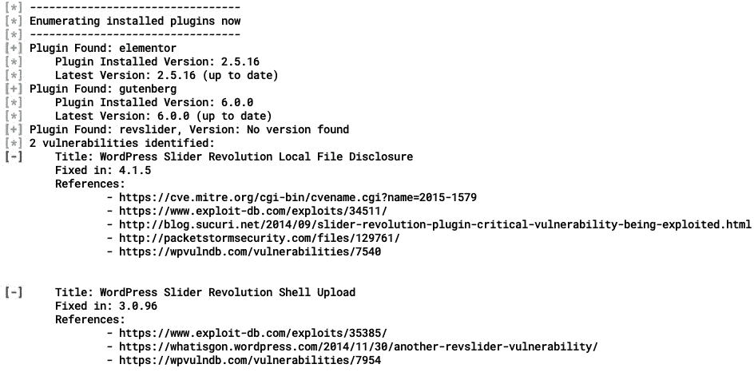

此模块不会将信息保存在数据库中，因此如果您愿意，可以对其进行自定义。此模块的唯一目的是枚举插件、主题和 WordPress 版本，并查找漏洞。在下一节中，我们将介绍剥削。

# WordPress 攻击第 1 部分–WordPress 任意文件删除

现在，您已经了解了如何识别 WordPress 版本，让我们详细了解一些利用 WordPress 的方法。我们还将讨论利用过程是如何工作的。

我们首先来看一下*WordPress 任意文件删除*漏洞。此漏洞允许任何经过身份验证的用户从服务器上删除文件。攻击者可以使用此命令执行命令。让我们看看这个漏洞是如何工作的，以及如何实现命令执行。

以下屏幕截图显示了在本地主机上运行的 WordPress 博客：


该漏洞实际上是一个二阶文件删除，我们上传并编辑一个图像，然后将文件路径放入元数据中。当图像被删除时，WordPress 调用 unlink 函数自动删除包含文件路径的元数据，因此它也被删除。让我们看看基本的漏洞流。

# 漏洞流程与分析

我们将深入挖掘此漏洞的根本原因。请看`wp-admin/post.php`文件的以下屏幕截图。此处，未初始化的输入取自用户并存储在`$newmeta`：


在`wp-includes/post.php`文件中，相同的输入被传递到`wp_update_attachment_metadata()`以作为序列化值`meta_key`存储在数据库中：

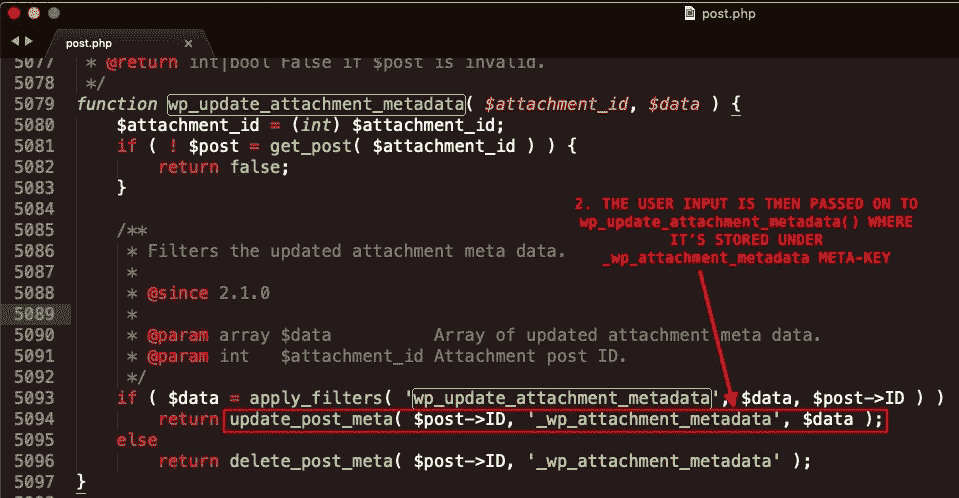

当用户点击删除媒体按钮时，以下代码要求从数据库输入并将其存储在`$thumbfile`中。然后，调用 unlink 函数来删除指定的文件。thumb 链接元数据被删除，因为它包含指向`wp-config`的路径：

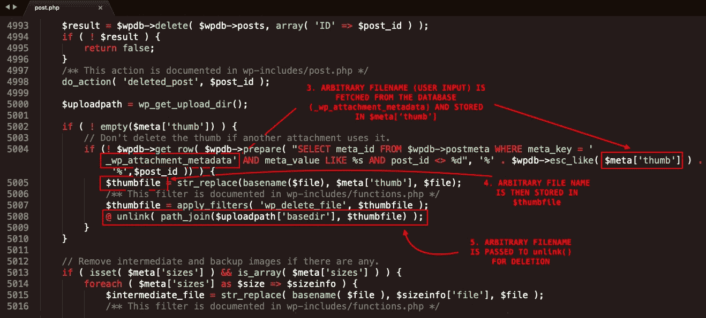

接下来，我们将使用 Metasploit 攻击该漏洞。

# 使用 Metasploit 利用该漏洞

Metasploit 有一个内置的漏洞利用模块，可以删除服务器上的任意文件。我们将使用`wp-config`文件的一个示例，稍后我们将讨论如何利用此漏洞将外壳上传到服务器：

1.  要使用该模块，我们在 msfconsole 中运行以下命令。
2.  使用`auxiliary/scanner/http/wp_arbitrary_file_deletion`：


如前面的屏幕截图所示，我们输入 RHOST、WordPress 用户名和密码以及配置文件的路径。在我们运行漏洞攻击之前，让我们再看看 WordPress 数据库`wp_postmeta`表中的当前条目，如以下屏幕截图所示：


服务器上目前也存在`wp-config.php`文件：


执行模块时，Metasploit 使用 WordPress 对其进行身份验证，并将`.gif`文件上传到服务器上：


查看`wp_postmeta`表的条目，我们再次看到附件现在存在，并且附件的元数据以序列化格式存储。元数据包含文件名、宽度、高度和 EXIF 标题等详细信息：


接下来，该漏洞将尝试编辑附件并将 thumb 参数设置为我们要删除的文件的路径：


这会给出一个`302`响应，我们被重定向回 post 页面：


让我们看看在这个请求之后数据库是如何更新的。再次查看`wp_postmeta`表，我们将看到两个新字符串被添加到序列化的`meta_value`列中。这些值是配置文件的缩略图和路径：


攻击的下一步是删除上传的附件，这将强制调用`unlink()`函数，导致删除配置文件：

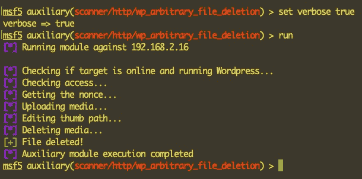

接下来想到的问题是：**删除配置文件如何让我们在服务器上远程执行代码**（**RCE****？**

删除`wp-config.php`文件后，WordPress 会将站点重定向到`setup-config.php`，即默认的安装启动页面，如下图所示：

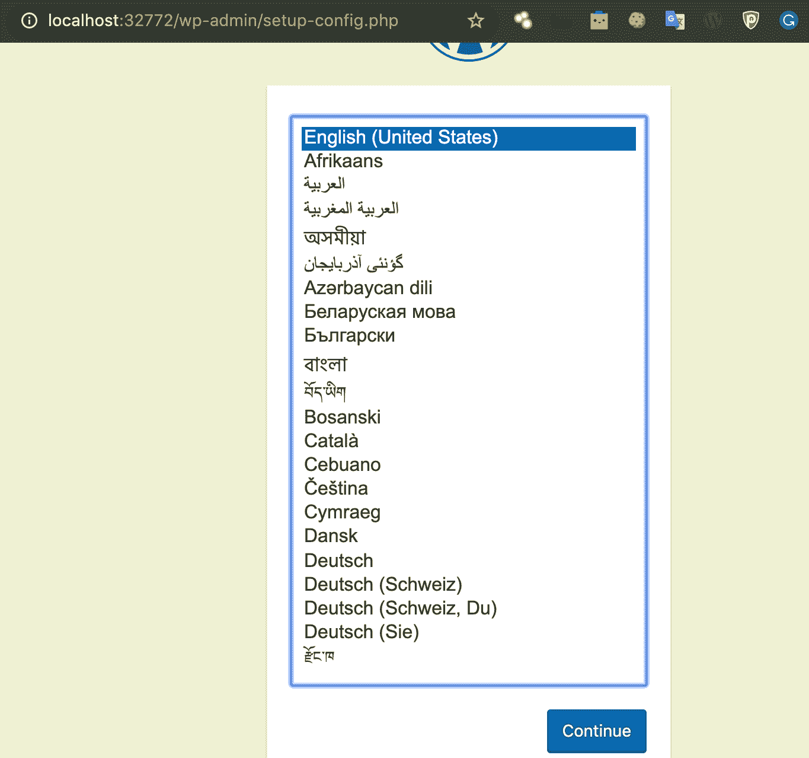

我们的想法是在我们自己的服务器上创建一个数据库，并使用我们的数据库再次设置 WordPress。

下面的屏幕截图显示了在我们自己的服务器上创建 MySQL 数据库的 SQL 命令。WordPress 需要能够访问此服务器，因此我们必须确保 MySQL 正在运行，并且允许远程登录：


现在，我们单击 continue 并提供数据库连接详细信息，如下所示：


完成后，下一步是创建要登录的 WordPress 用户：


我们现在可以使用刚刚创建的 WordPress 用户登录。服务器上的 WordPress 实例现在已连接并配置了我们自己的数据库：

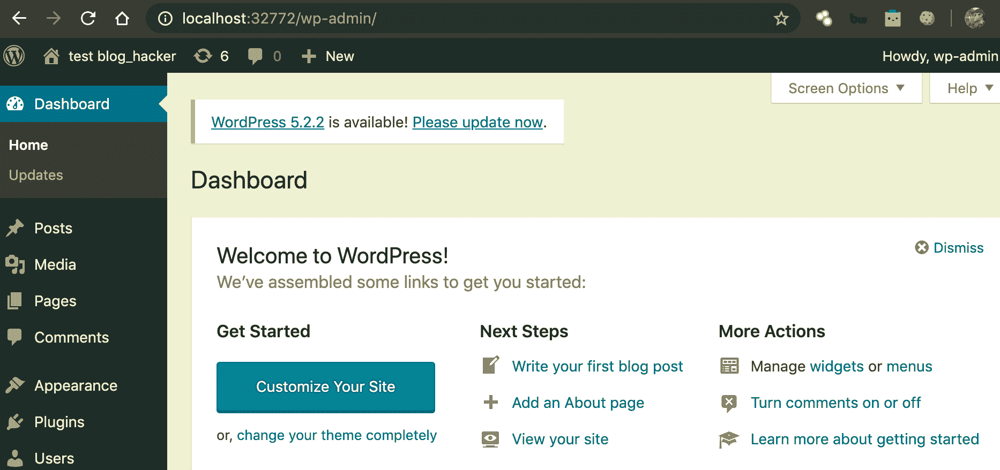

由于我们拥有 WordPress CMS 的管理员权限，我们可以使用 Metasploit 模块在站点上上传 shell。这可以使用以下漏洞实现：

```
use exploit/unix/webapp/wp_admin_shell_upload
```

以下屏幕截图显示了前面命令的输出：


让我们设置此漏洞利用的选项，如下所示：


现在，让我们执行模块并等待神奇的结果：


我们现在可以在服务器上访问 MeterMeter。因此，实现了 RCE：


这是一个相当直接的利用。然后可以进一步破解散列以访问管理面板，或者一旦我们获得明文密码，我们就可以使用 WordPress shell 上传模块在盒子上获得一个计量表。在下一节中，我们将查看 Google 地图插件中未经验证的 SQL 注入。

# WordPress 攻击第 2 部分-未经验证的 SQL 注入

让我们看看另一个 SQL 注入案例，它是在 WordPress Google 地图插件中发现的。Metasploit 已经有一个内置的利用模块，可以从数据库中提取`wp_users`表：

```
auxiliary/admin/http/wp_google_maps_sqli
```

在运行模块之前，让我们先看看插件的源代码，并了解问题所在。

# 漏洞流程与分析

查看`class.rest-api.php`的源代码，我们可以看到用户输入作为名为`fields`的`get`参数传递到`explode`函数中。`explode`功能用于*将指定字符串拆分成段*：

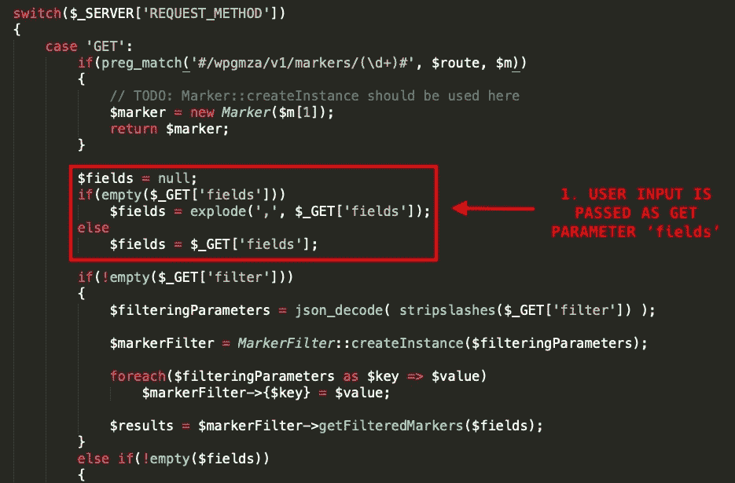

然后，将输入存储在`$imploded`变量中，使用`implode()`组合返回，并直接传递到`SELECT`查询中，如图所示：


`$imploded`变量是此处的注入点。也可以使用 Metasploit 模块利用此漏洞。

# 使用 Metasploit 利用该漏洞

针对目标运行漏洞攻击将为我们提供存储在`wp_users`表中的数据，如下所示：


接下来，我们将了解 WordPress 开发的第三部分也是最后一部分。

# WordPress 开发第 3 部分–WordPress 5.0.0 远程代码执行

在本节中，我们将了解存在于 WordPress 5.0.0 及以下版本中的 RCE 漏洞。此漏洞利用链接两个不同的漏洞来实现代码执行（路径遍历和本地文件包含）。Metasploit 已经有了用于此攻击的模块。

# 漏洞流程与分析

第一个漏洞是 CVE-2019-8942，它覆盖了`post`元条目：

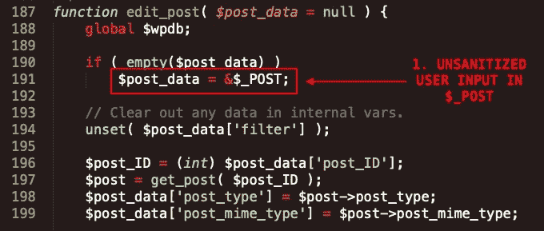

然后，未初始化的用户输入被传递到`wp_update_post()`，它不会检查不允许的`post`元字段：

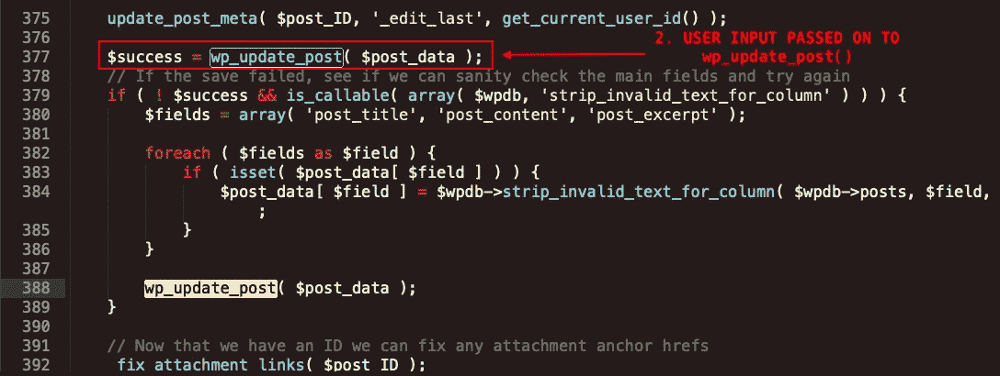

攻击者可以覆盖其恶意文件的`_wp_attached_file`post 元密钥。目前，我们已经开发了 CVE-2019-8942。现在我们已经控制了可以在 post 元条目中覆盖的内容，让我们利用下一个漏洞 CVE-2019-8943，一个路径遍历漏洞。使用此漏洞，我们可以将上载的恶意文件的路径从以前利用的漏洞（CVE-2019-8942）更改为我们选择的 RCE 路径。

`wp_crop_image()`函数调用`get_attached_file()`函数时不进行任何文件路径验证。因此，上传到服务器上的恶意图像文件将在调用`wp_crop_image()`函数时（图像裁剪时）传递给`get_attached_file()`函数：


我们可以利用此漏洞更改上载恶意文件的路径，并将图像的裁剪版本保存在默认主题目录中，即`wp-content/themes/<default_theme>/<cropped-image>.jpg`：


正如我们在前面的屏幕截图中所看到的，恶意图像被保存到默认的主题文件夹中。现在我们的恶意映像已经就位，我们可以请求 post，以便执行我们的 PHP 负载，从而导致 RCE。

# 使用 Metasploit 利用该漏洞

可以使用以下命令在 Metasploit 控制台中选择模块：

```
use exploit/multi/http/wp_crop_rce
```

以下屏幕截图显示了前面命令的输出：

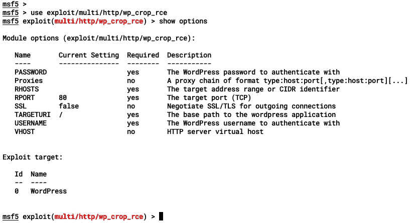

我们设置所需的选项，如下面的屏幕截图所示。我们需要 WordPress 博客上的低权限帐户，因为此漏洞需要身份验证以及上传和编辑媒体的权限：


利用分为几个步骤。Metasploit 模块做的第一步是检查提供的`targeturi`是否正确：

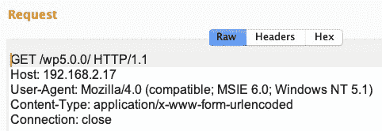

获取 200 HTTP 响应码后，确认`targeturi`路径：


模块继续执行下一步身份验证。此步骤将使用模块使用的用户名和密码。在使用 WordPress 站点进行身份验证时，模块还请求重定向到不存在的页面：


HTTP 响应将重定向（302）到不存在的页面。这样做只是为了从服务器获取会话 cookie。此步骤之后的所有操作都是使用以下 cookies 完成的：


让我们确认数据库状态：

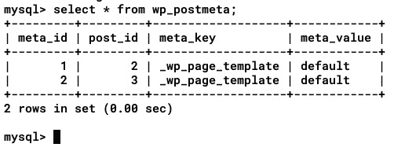

现在从服务器检索会话，在下一步中，模块请求`media-new.php`页面。此页面负责将媒体上传至 WordPress 网站：


这里的目标是上传一个图像，其中嵌入了我们的有效负载：


然后，该模块上传嵌入了我们有效载荷的图像：


正如我们在前面的屏幕截图中所看到的，嵌入在图像中的有效载荷是`<?=`$_GET[0]`;?>`。我们使用这种压缩负载的原因是我们没有太多的空间来执行负载。另外，请注意，负载嵌入在扫描头之后的两个不同位置和 EXIF 元数据中。它被嵌入两次的原因是为了确保有效负载得到执行。

WordPress 支持两种 PHP 图像编辑扩展：**GD****库**和**Imagick**。GD 库压缩图像并剥离所有 EXIF 元数据。Imagick 不会删除任何 EXIF 元数据。这就是模块嵌入有效负载两次的原因。

上载时的路径和 post 元数据存储在数据库中：


上载恶意图像后，将为该图像分配一个 ID，并在响应中显示其完整路径：


该模块检查 WordPress 站点是否易受 CVE-2019-8942 和 CVE-2019-8943 攻击。它通过以下步骤执行此操作：

1.  它通过查询所有附件来确认图像是否已上载。
2.  它确保以 400 x 300 的大小保存恶意图像。（这将有助于完成假作物。）

3.  在编辑恶意图像时获取更新的`wp_nonce`和更新的文件名。
4.  检查图像的 POST 元数据条目是否可以从`.jpg`覆盖到`.jpg?/x`。如果更改，则表明 WordPress 站点易受 CVE-2019-8942 攻击。
5.  它裁剪图像（此处为假裁剪），以检查 WordPress 站点是否易受路径遍历漏洞 CVE-2019-8943 的攻击。
6.  一旦模块确认该漏洞，就会通过将 POST 元数据从`.jpg`覆盖到`.jpg?/../../../../themes/#{@current_theme}/#`{`@shell_name`来利用 CVE-2019-8942：


以下屏幕截图显示了`meta_value`列的更新值：

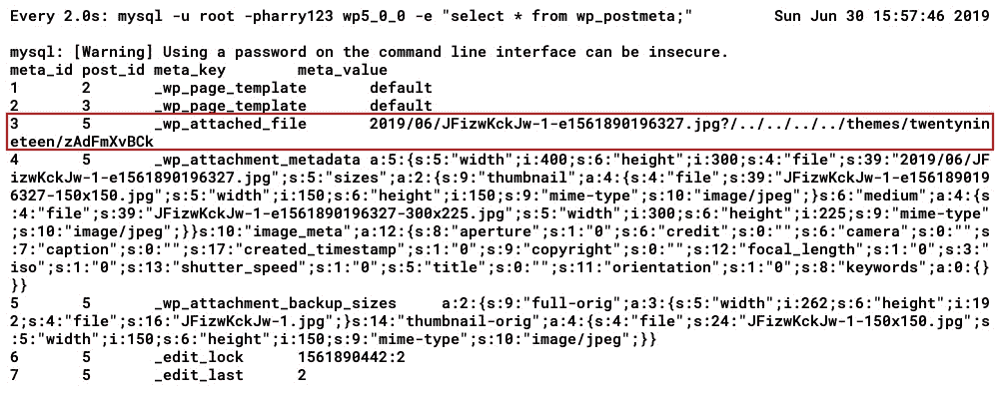

我们还可以在下面的屏幕截图中看到默认模板已更改为`cropped-zAdFmXvBCk.jpg`：


然后，该模块请求带有 post ID 的默认模板，并在`0`参数后面附加要为 RCE 执行的命令：


命令的输出如下所示：

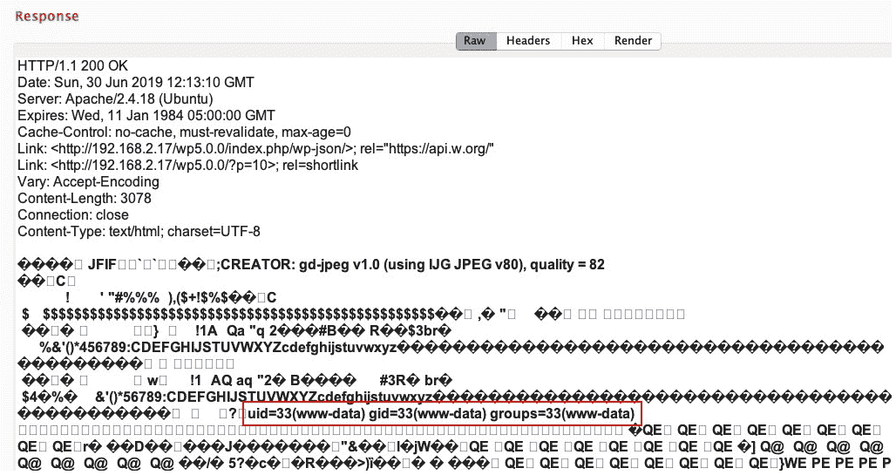

接下来，模块执行以下操作：

1.  它确认系统中是否存在 Base64 程序。
2.  它将 PHP MeterMeter 转换为 Base64，并使用`echo <base64_of _PHP_meterpreter> | base64 -d > shell.php`将其上载到服务器。
3.  它请求上传的 PHP shell 获取 MeterMeter 访问权限。
4.  以下屏幕截图显示了写入 PHP 文件的 Base64 编码的 MeterMeter 代码：


以下屏幕截图显示了从服务器成功连接的 MeterMeter：


在下一节中，我们将定制 Metasploit 漏洞。

# 更进一步–定制 Metasploit 漏洞

对于我们在上一节中使用的 Metasploit 模块，`exploit/multi/http/wp_crop_rce`，我们需要设置用户名和密码以使模块正常工作。但是如果在进行身份验证时有一个 reCAPTCHA 呢？模块肯定会失败，因为模块没有获得会话 cookie 的解决方法：

1.  让我们修改模块，使其与`COOKIE`数据存储一起工作：


我们可以在以下屏幕截图中看到更新的模块选项：


2.  让我们为`COOKIE`数据存储定义一个函数：


3.  我们还需要根据响应代码验证 cookie。那么，让我们定义一个`validate_cookie()`函数；这将使用 200 HTTP 响应代码验证 cookie：

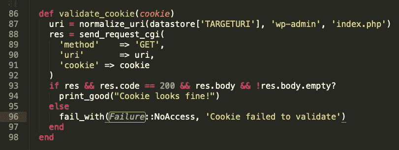

4.  现在，在`exploit()`函数中，让我们包含一个`fail-safe fail_with()`方法，以确保如果用户名或密码丢失，攻击将失败。如果未设置 cookie，也将执行此操作：


5.  如果用户名和密码丢失，模块将尝试使用`COOKIE`。让我们更新模块并为其设置`COOKIE`选项：


6.  现在，让我们运行模块，看看神奇的发生：

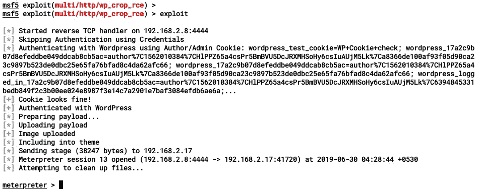

我们已经有了使用`COOKIE`的计量器！

# 总结

在本章中，我们首先讨论 WordPress 的体系结构，然后讨论目录结构。接下来，我们学习了如何执行 WordPress 的手动和自动侦察。稍后，我们查看了一些利用漏洞的示例，并手动以及使用 Metasploit 模块对整个利用漏洞的过程进行了逐步演练。

在下一章中，我们将学习如何在基于 Joomla 的**内容管理系统**（**CMS**上执行渗透测试。

# 问题

1.  所有版本的 WordPress 的侦察步骤是否相同？

2.  我找到了一个`wp-admin`目录，但该目录本身无法访问。在这种情况下我能做什么？

3.  WordPress 可以免费下载吗？

# 进一步阅读

以下链接可用于了解有关 WordPress 的攻击方法和最新发布的漏洞的更多信息：

*   [https://wpvulndb.com/](https://wpvulndb.com/)
*   [https://wpsites.net/wordpress-tips/3-most-common-ways-wordpress-sites-are-exploited/](https://wpsites.net/wordpress-tips/3-most-common-ways-wordpress-sites-are-exploited/)
*   [https://www.exploit-db.com/docs/english/45556-wordpress-penetration-testing-using-wpscan-and-metasploit.pdf?rss](https://www.exploit-db.com/docs/english/45556-wordpress-penetration-testing-using-wpscan-and-metasploit.pdf?rss)