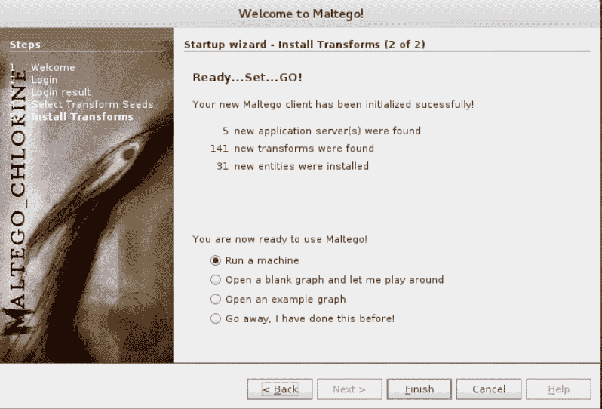
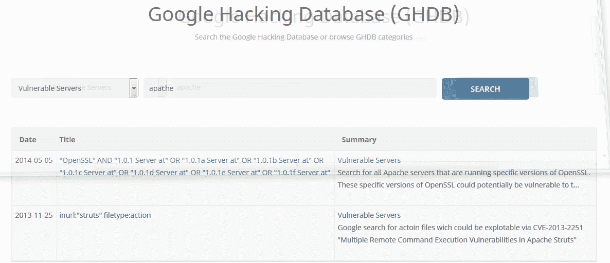
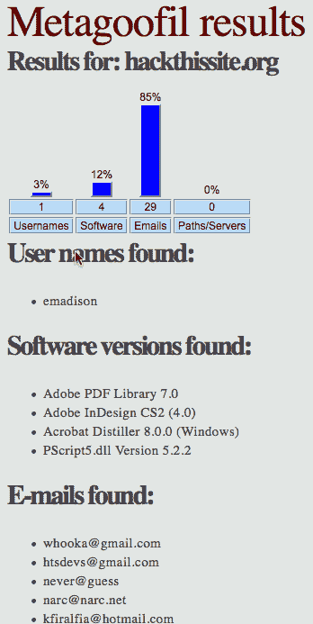
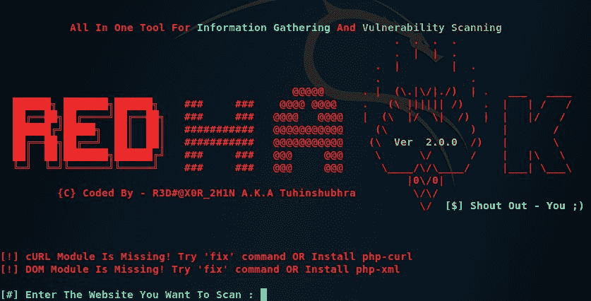
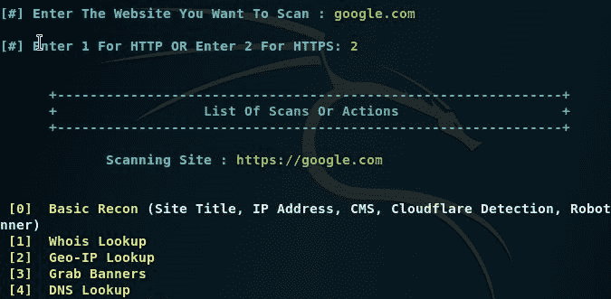

# 四、足迹和信息收集

在本章中，我们将讨论渗透测试的信息收集阶段。我们将描述信息收集的定义和目的。我们还将描述 Kali Linux 中可用于信息收集的几个工具。阅读本章后，我们希望读者能够更好地理解信息收集阶段，并能够在渗透测试期间进行信息收集。

信息收集是我们渗透测试过程（Kali Linux 测试过程）的第二阶段，如[第 3 章](03.html)、*渗透测试方法*中的 Kali Linux 测试方法部分所述。在这一阶段，我们会尽可能多地收集有关目标的信息，例如关于**域名系统**（**DNS**）主机名、IP 地址、使用的技术和配置、用户名组织、文档、应用代码、密码重置信息、联系信息、，等等在信息收集过程中，收集的每一条信息都被认为是重要的。

根据所使用的方法，信息收集可分为两种方式：主动信息收集和被动信息收集。在主动信息收集方法中，我们通过向目标网络引入网络流量来收集信息，而在被动信息收集方法中，我们通过利用第三方服务（如谷歌搜索引擎）来收集关于目标网络的信息。稍后我们将讨论这个问题。

记住，两种方法都比不上另一种；各有所长。在被动扫描中，您收集的信息较少，但您的行动将是隐蔽的；而在主动扫描中，您获得的信息较多，但某些设备可能会捕捉到您的行动。在渗透测试项目期间，为确保所收集信息的完整性，该阶段可能会进行多次。您也可以与您的笔测试客户讨论他们想要的方法。

在本章中，我们将使用被动和主动的信息收集方法来更好地了解目标。

我们将在本章中讨论以下主题：

*   可用于收集目标域信息的公共网站
*   域名注册信息
*   DNS 分析
*   路线信息
*   搜索引擎利用率

# 公开来源情报

通常与信息收集相关的一个关键术语是**开源智能**（**OSIT**）。军事和情报组织将其情报来源分为多种类型。真正的间谍活动涉及间谍之间的互动，通常被称为**人类智能**（**HUMINT**）。为了破解加密而捕获无线电信号称为**信号智能**（**SIGINT**。虽然渗透测试仪不可能与其中任何一个接口，但信息收集阶段是 OSIT。OSIT 是从没有安全控制措施防止其泄露的来源获取的信息。它们通常是目标组织在日常运营中共享的公共记录或信息。

为了使这些信息对渗透测试人员有用，他们需要特定的知识和工具来查找这些信息。信息收集阶段在很大程度上依赖于这些信息。此外，简单地向组织展示他们正在泄漏的 OSIT 可能会让他们知道需要在哪些方面提高安全性。正如我们将在本章中看到的，对于那些知道去哪里寻找的人来说，有大量的信息是可见的。

# 利用公共资源

在 internet 上，有几种公共资源可用于收集有关目标域的信息。使用这些资源的好处是，您的网络流量不会直接发送到目标域，因此您的活动不会记录在目标域日志文件中。

以下是可以使用的资源：

| 不 | 资源 URL | 描述 |
| 1. | [http://www.archive.org](http://www.archive.org) | 这包含网站的存档。 |
| 2. | [http://www.domaintools.com/](http://www.domaintools.com/) | 这包含域名智能。 |
| 3. | [http://www.alexa.com/](http://www.alexa.com/) | 这包含有关网站的信息数据库。 |
| 4. | [http://serversniff.net/](http://serversniff.net/) | 这是免费的**瑞士军刀**用于联网、服务器检查和路由。 |
| 5. | [http://centralops.net/](http://centralops.net/) | 它包含免费的在线网络实用程序，如域、电子邮件、浏览器、ping、traceroute 和 Whois。 |
| 6. | [http://www.robtex.com](http://www.robtex.com) | 这允许您搜索域和网络信息。 |
| 7. | [http://www.pipl.com/](http://www.pipl.com/) | 这允许您在 internet 上按姓名、城市、州和国家搜索人员。 |
| 8. | [http://wink.com/](http://wink.com/) | 这是一个免费的搜索引擎，允许您通过姓名、电话号码、电子邮件、网站、照片等查找联系人。 |
| 9 | [http://www.isearch.com/](http://www.isearch.com/) | 这是一个免费的搜索引擎，允许您通过姓名、电话号码和电子邮件地址查找用户。 |
| 10 | [http://www.tineye.com](http://www.tineye.com) | TinEye 是一个反向图像搜索引擎。我们可以使用 TinEye 找出图像的来源、使用方式、是否存在图像的修改版本，或者找到更高分辨率的版本。 |
| 11 | [http://www.sec.gov/edgar.shtml](http://www.sec.gov/edgar.shtml) | 这可用于在证券交易委员会中搜索有关上市公司的信息。 |

由于使用方便，您只需要一个 internet 连接和一个 web 浏览器，我们建议您在使用 Kali Linux 提供的工具之前先利用这些公共资源。

为了保护域名不被滥用，我们更改了示例中使用的域名。我们将使用几个域名，例如来自 IANA 的`example.com`和免费黑客测试站点[https://www.hackthissite.org/](https://www.hackthissite.org/) 同样，出于说明目的。

# 查询域名注册信息

知道目标域名后，首先要查询该域名的`Whois`数据库，查找域名注册信息。`Whois`数据库将提供有关 DNS 服务器的信息和域的联系信息。

`Whois`是用于搜索互联网注册、注册域名数据库、IP 和自治系统的协议。本协议在 RFC 3912（[中规定 https://www.ietf.org/rfc/rfc3912.txt](https://www.ietf.org/rfc/rfc3912.txt) 。

默认情况下，Kali Linux 已经附带了一个`whois`客户端。要查找域的`Whois`信息，只需键入以下命令：

```
    # whois example.com

```

以下是`Whois`信息的结果：

```
    Domain Name: EXAMPLE.COM
       Registrar: RESERVED-INTERNET ASSIGNED NUMBERS AUTHORITY
    Sponsoring Registrar IANA ID: 376
       Whois Server: whois.iana.org
       Referral URL: http://res-dom.iana.org
       Name Server: A.IANA-SERVERS.NET
       Name Server: B.IANA-SERVERS.NET
       Updated Date: 14-aug-2015
       Creation Date: 14-aug-1995
       Expiration Date: 13-aug-2016
    >>> Last update of whois database: Wed, 03 Feb 2016 01:29:37 GMT <<<

```

从前面的`Whois`结果中，我们可以得到一个域的 DNS 服务器和联系人的信息。该信息将在渗透测试的后期阶段有用。

除了使用命令行`Whois`客户端外，还可以通过以下网站收集`Whois`信息，这些网站提供`whois`客户端：

*   [www.whois.net](http://www.whois.net)
*   [www.internic.net/whois.html](http://www.internic.net/whois.html)

您还可以转到相应域的顶级域注册器：

*   **美国**：[www.arin.net/whois/](http://www.arin.net/whois/)
*   **欧洲**：[www.db.crime.net/whois](http://www.db.ripe.net/whois)
*   **亚太地区**：[www.apnic.net/apnic-info/whois_search 2](http://www.apnic.net/apnic-info/whois_search2)

注意：要使用顶级域名注册器`whois`，域名需要通过自己的系统注册。例如，如果您使用`ARIN WHOIS`，它只在`ARIN WHOIS`数据库中搜索，不会在`RIPE`和`APNIC Whois`数据库中搜索。

从`Whois`数据库获取信息后，接下来我们要收集目标域的 DNS 条目信息。

# 分析 DNS 记录

使用 DNS 记录类别中的工具的目的是收集有关 DNS 服务器和目标域的相应记录的信息。

以下是几种常见的 DNS 记录类型：

| 不 | 记录类型 | 描述 |
| 1. | SOA | 这是权限记录的开始。 |
| 2. | NS | 这是名称服务器记录。 |
| 3. | A. | 这是 IPv4 地址记录。 |
| 4. | MX | 这是邮件交换记录。 |
| 5. | PTR | 这是指针记录。 |
| 6. | AAAA | 这是 IPv6 地址记录。 |
| 7. | CNAME | 这是规范名称的缩写。它用作另一个规范域名的别名。 |

例如，在渗透测试业务中，客户可能会要求您找出其域中可用的所有主机和 IP 地址。您仅有的信息是组织的域名。我们将介绍几种常见的工具，它们可以在您遇到这种情况时为您提供帮助。

# 主办

在获得 DNS 服务器信息后，下一步是查找主机名的 IP 地址。为了帮助我们解决这一问题，我们可以使用以下主机命令行工具从 DNS 服务器查找主机的 IP 地址：

```
    # host hackthissite.org 
```

默认情况下，`host`命令将查找域的`A`、`AAAA`和`MX`记录。要查询任何记录，只需为命令提供`-a`选项：

```
    # host -a hackthissite.org
    Trying "hackthissite.org"
    ;; ->>HEADER<<- opcode: QUERY, status: NOERROR, id: 32115
    ;; flags: qr rd ra; QUERY: 1, ANSWER: 12, AUTHORITY: 0, ADDITIONAL: 0
    ;; QUESTION SECTION:
    ;hackthissite.org.    IN  ANY
    ;; ANSWER SECTION:
    hackthissite.org.  5  IN  A  198.148.81.135
    hackthissite.org.  5  IN  A  198.148.81.139
    hackthissite.org.  5  IN  A  198.148.81.137
    hackthissite.org.  5  IN  A  198.148.81.136
    hackthissite.org.  5  IN  A  198.148.81.138
    hackthissite.org.  5  IN  NS  ns1.hackthissite.org.
    hackthissite.org.  5  IN  NS  c.ns.buddyns.com.
    hackthissite.org.  5  IN  NS  f.ns.buddyns.com.
    hackthissite.org.  5  IN  NS  e.ns.buddyns.com.
    hackthissite.org.  5  IN  NS  ns2.hackthissite.org.
    hackthissite.org.  5  IN  NS  b.ns.buddyns.com.
    hackthissite.org.  5  IN  NS  d.ns.buddyns.com.
    Received 244 bytes from 172.16.43.2#53 in 34 ms  
```

`host`命令通过查询 Kali Linux 系统的`/etc/resolv.conf`文件中列出的 DNS 服务器来查找这些记录。如果要使用其他 DNS 服务器，只需提供 DNS 服务器地址作为最后一个命令行选项。

如果您在`host`中提供域名作为命令行选项，则该方法称为正向查找，但如果您将 IP 地址作为`host`命令的命令行选项，则该方法称为反向查找。

尝试对以下 IP 地址执行反向查找：

```
    host 23.23.144.81 
```

您可以从该命令中获得哪些信息？

`host`工具也可用于进行 DNS 区域传输。通过这种机制，我们可以收集有关域中可用主机名的信息。

DNS 区域传输是用于将 DNS 数据库从主 DNS 服务器复制到另一个 DNS 服务器（通常称为从属 DNS 服务器）的机制。如果没有此机制，管理员必须分别更新每个 DNS 服务器。必须向域的权威 DNS 服务器发出 DNS 区域传输查询。

由于 DNS 区域传输可以收集的信息的性质，目前，很少找到允许区域传输到任意区域传输请求的 DNS 服务器。

如果您发现 DNS 服务器允许区域传输而不限制谁可以进行区域传输，这意味着 DNS 服务器配置不正确。

# 挖掘

除了`host`命令外，您还可以使用`dig`命令进行 DNS 查询。与`host`相比`dig`的优势在于其输出的灵活性和清晰性。使用`dig`，您可以要求系统处理来自文件的查找请求列表。

让我们用`dig`来询问[http://hackthissite.org](http://hackthissite.org) 域。

`dig`命令不提供域名以外的任何选项，只返回一个域的 A 记录。要请求任何其他 DNS 记录类型，我们可以在命令行中提供 type 选项：

```
    # dig hackthissite.org
    ; <<>> DiG 9.9.5-9+deb8u5-Debian <<>> hackthissite.org
    ;; global options: +cmd
    ;; Got answer:
    ;; ->>HEADER<<- opcode: QUERY, status: NOERROR, id: 44321
    ;; flags: qr rd ra; QUERY: 1, ANSWER: 5, AUTHORITY: 0, ADDITIONAL: 1
    ;; OPT PSEUDOSECTION:
    ; EDNS: version: 0, flags:; MBZ: 0005 , udp: 4096
    ;; QUESTION SECTION:
    ;hackthissite.org.    IN  A
    ;; ANSWER SECTION:
    hackthissite.org.  5  IN  A  198.148.81.139
    hackthissite.org.  5  IN  A  198.148.81.137
    hackthissite.org.  5  IN  A  198.148.81.138
    hackthissite.org.  5  IN  A  198.148.81.135
    hackthissite.org.  5  IN  A  198.148.81.136
    ;; Query time: 80 msec
    ;; SERVER: 172.16.43.2#53(172.16.43.2)
    ;; WHEN: Tue Feb 02 18:16:06 PST 2016
    ;; MSG SIZE  rcvd: 125

```

从结果可以看出，`dig`输出现在返回`A`的 DNS 记录。

# 德米特里

**Deepmagic 信息采集工具****DMitry**是一款集多功能于一体的信息采集工具。它可用于收集以下信息：

*   主机使用 IP 地址或域名的`Whois`记录
*   来自[的主机信息 https://www.netcraft.com/](https://www.netcraft.com/)
*   目标域中的子域

*   目标域的电子邮件地址
*   通过执行端口扫描打开、筛选或关闭目标计算机上的端口列表

尽管可以使用多个 Kali Linux 工具获得这些信息，但是使用单个工具收集所有信息并将报告保存到一个文件中是非常方便的。

我们认为该工具更适合归入 DNS 分析，而不是*路由分析*部分，因为其功能更多的是 DNS 分析，而不是路由分析。

要从 Kali Linux 菜单访问`DMitry`，请导航至应用|信息收集| dmitry，或者您可以使用控制台并键入以下命令：

```
    # dmitry
```

例如，让我们对目标主机执行以下操作：

*   执行`Whois`查找
*   从[获取信息 https://www.netcraft.com/](https://www.netcraft.com/)
*   搜索所有可能的子域
*   搜索所有可能的电子邮件地址

执行上述操作的命令如下：

```
    # dmitry -iwnse hackthissite.org 
```

以下是上述命令的简要结果：

```
    Deepmagic Information Gathering Tool
    "There be some deep magic going on"
    HostIP:198.148.81.138
    HostName:hackthissite.org
    Gathered Inet-whois information for 198.148.81.138
    ---------------------------------
    inetnum:        198.147.161.0 - 198.148.176.255
    netname:        NON-RIPE-NCC-MANAGED-ADDRESS-BLOCK
    descr:          IPv4 address block not managed by the RIPE NCC

    remarks:        http://www.iana.org/assignments/ipv4-recovered-address-space/ipv4-recovered-address-space.xhtml
    remarks:
    remarks:        -----------------------------------------------------
    country:        EU # Country is really world wide
    admin-c:        IANA1-RIPE
    tech-c:         IANA1-RIPE
    status:         ALLOCATED UNSPECIFIED
    mnt-by:         RIPE-NCC-HM-MNT
    mnt-lower:      RIPE-NCC-HM-MNT
    mnt-routes:     RIPE-NCC-RPSL-MNT
    created:        2011-07-11T12:36:59Z
    last-modified:  2015-10-29T15:18:41Z
    source:         RIPE
    role:           Internet Assigned Numbers Authority
    address:        see http://www.iana.org.
    admin-c:        IANA1-RIPE
    tech-c:         IANA1-RIPE
    nic-hdl:        IANA1-RIPE
    remarks:        For more information on IANA services
    remarks:        go to IANA web site at http://www.iana.org.
    mnt-by:         RIPE-NCC-MNT
    created:        1970-01-01T00:00:00Z
    last-modified:  2001-09-22T09:31:27Z
    source:         RIPE # Filtered
    % This query was served by the RIPE Database Query Service version 1.85.1 (DB-2)

```

我们也可以使用`dmitry`通过提供以下命令来执行简单的端口扫描：

```
    # dmitry -p hackthissite.org -f -b
```

上述命令的结果如下所示：

```
    Deepmagic Information Gathering Tool
    "There be some deep magic going on"
    HostIP:198.148.81.135
    HostName:hackthissite.org
    Gathered TCP Port information for 198.148.81.135
    ---------------------------------
     Port    State
    ...
    14/tcp    filtered
    15/tcp    filtered
    16/tcp    filtered
    17/tcp    filtered
    18/tcp    filtered
    19/tcp    filtered
    20/tcp    filtered
    21/tcp    filtered
    22/tcp    open
    >> SSH-2.0-OpenSSH_5.8p1_hpn13v10 FreeBSD-20110102
    23/tcp    filtered
    24/tcp    filtered
    25/tcp    filtered
    26/tcp    filtered
    ...
    79/tcp    filtered
    80/tcp    open
    Portscan Finished: Scanned 150 ports, 69 ports were in state closed
    All scans completed, exiting

```

从前面的命令中，我们发现目标主机正在使用设备进行数据包过滤。它只允许 SSH 端口`22`和 web 服务器常用的端口`80`的传入连接。令人感兴趣的是指出了 SSH 安装的类型，从而可以进一步研究 OpenSSH 安装可能存在的漏洞。

# 马尔蒂戈

Maltego 是一个开源的情报和取证应用。它允许您挖掘和收集信息，并以有意义的方式表示信息。Maltego 中的“开源”一词意味着它从开源资源中收集信息。收集信息后，Maltego 允许您识别所收集信息之间的关键关系。

Maltego 是一种能够以图形方式显示数据之间链接的工具，因此它可以更容易地查看信息片段之间的公共方面。

Maltego 允许您列举以下互联网基础设施信息：

*   域名
*   DNS 名称
*   `Whois`信息
*   网络块
*   IP 地址

它还可用于收集有关人员的以下信息：

*   与此人相关的公司和组织
*   与此人相关的电子邮件地址
*   与此人相关的网站

*   与个人相关的社交网络
*   与此人相关的电话号码
*   社交媒体信息

默认情况下，Kali Linux 附带 Maltego 3.6.1 Kali Linux 版本。以下是社区版本的限制：

*   非商业用途
*   每个变换最多 12 个结果
*   您需要在我们的网站上注册才能使用该客户端
*   API 密钥每隔几天过期一次
*   在与所有社区用户共享的（较慢的）服务器上运行
*   客户端和服务器之间的通信未加密
*   直到下一个主要版本才更新
*   没有最终用户支持
*   服务器端没有转换的更新

Maltego 中有 70 多个变换可用。“转换”一词指的是 Maltego 的信息收集阶段。一个转换意味着 Maltego 只会进行一个阶段的信息收集。

要从 Kali Linux 菜单访问 Maltego，请导航至应用|信息收集| Maltego。桌面上还有一个开始图标，或者您可以使用控制台键入以下命令：

```
    # maltego
```

您将看到 Maltego 欢迎屏幕。几秒钟后，您将看到以下 Maltego 启动向导，该向导将帮助您首次设置 Maltego 客户端。

单击“下一步”继续进入下一个窗口并输入您的登录详细信息。（如果您没有登录详细信息，请单击此处注册以创建帐户。）

登录后，输入您的个人详细信息（姓名和电子邮件地址）。

然后需要选择变换种子，如以下屏幕截图所示：


Maltego 客户端将连接到 Maltego 服务器以获取转换。如果 Maltego 已成功初始化，您将看到以下屏幕截图：



这意味着您的 Maltego 客户端初始化已成功完成。现在您可以使用 Maltego 客户端。

在使用 Maltego 客户端之前，让我们先看看 Maltego 接口：


马尔特戈界面

在前面屏幕截图的左上方，您将看到调色板窗口。在**调色板**窗口中，您可以选择要收集信息的实体类型。Maltego 将实体分为六组，如下所示：

*   **手机、相机等设备**
*   **基础设施**如：DNS 名称、域、IPv4 地址、MX 记录、NS 记录、netblock、URL 和网站
*   地球上的**位置**
*   **渗透测试**
*   个人信息，如别名、文档、电子邮件地址、图像、人物、电话号码和短语
*   社交网络，如 Facebook 对象、Twitter 实体、Facebook 从属关系和 Twitter 从属关系

在前面屏幕截图的中上部，您将看到不同的视图：

*   主视图
*   气泡视图
*   实体列表

视图用于从大型图表中提取不明显的信息，在这些图表中，分析师无法通过手动检查数据来查看清晰的关系。主视图是您大部分时间工作的地方。在气泡视图中，节点显示为气泡，而在“图元列表”选项卡中，节点仅以文本格式列出。

在视图旁边，您将看到不同的布局算法。Maltego 支持以下四种布局算法：

*   块布局：这是默认布局，在挖掘期间使用。
*   分层布局：分层布局与主机的根和后续分支一起工作。这提供了一个分支结构，允许父/子关系的可视化。
*   中心布局：中心布局采用最中心的节点，然后以图形方式表示节点周围的传入链接。这在检查所有链接到一个中心节点的多个节点时非常有用。
*   有机布局：有机布局以最小化距离的方式显示节点，使查看者能够更好地全面了解节点及其关系。

在对 Maltego 客户端用户界面进行简要描述之后，是时候采取行动了。

假设您想收集有关域的信息。我们将在本例中使用`example.com`域。我们将在以下部分探讨如何做到这一点：

1.  创建一个新图形（*Ctrl*+*T*）并转到调色板选项卡。
2.  选择 Infrastructure，然后单击 Domain。
3.  将其拖到主窗口。如果成功，您将在主窗口中看到一个名为`paterva.com`的域。

4.  双击名称并将其更改为您的目标域，如`example.com`，如下图所示：


MaltegoKali Linux

5.  如果右键单击`domain`名称，您将看到可以对域名进行的所有转换：
    *   来自域的 DNS
    *   域名所有者的详细信息
    *   来自域的电子邮件地址
    *   域中的文件和文档
    *   其他转换，如对个人、电话号码和网站的转换
    *   所有变换

6.  让我们从域变换（运行变换|其他变换|域变换|域变换）中选择域变换名称模式。以下屏幕截图显示了结果：


MaltegoKali Linux

域名转换 DNS 后，我们得到了与`example.com`域名相关的网址（[www.example.com](http://www.example.com)上的信息。

您可以对目标域运行其他转换。

如果要更改域，需要先保存当前图形。要保存图表，请执行以下步骤：

1.  单击 Maltego 图标，然后选择 Save。
2.  图形将以 Maltego 图形文件格式保存（`.mtgx`。要更改域，只需双击现有域并更改域名。

接下来，我们将描述几种可用于获取路由信息的工具。

# 获取网络路由信息

网络路由信息在许多方面对渗透测试人员有用。首先，他们可以识别渗透测试仪机器和目标之间的不同设备。渗透测试仪还可以收集有关网络如何运行以及目标和测试仪机器之间的流量如何路由的信息。最后，渗透测试人员还可以确定测试人员和目标之间是否存在中间屏障，如防火墙或代理服务器。

Kali Linux 有许多提供网络路由信息的工具。

# tcptraceroute

在 Linux 发行版中找到的`traceroute`命令的补充是`tcptraceroute`工具。正常的`traceroute`命令向目标房屋发送 UDP 或 ICMP 回送请求数据包，并将**生存时间**（**TTL**设置为 1。对于到达的每个主机，该 TTL 增加一个，直到数据包到达目标主机。`traceroute`与`tcptraceroute`工具的主要区别在于`tcptraceroute`工具使用 TCP SYN 数据包发送到目标主机。

使用`tcptraceroute`的主要优点是当您有可能在测试机器和目标之间遇到防火墙时。防火墙通常配置为过滤掉与`traceroute`命令相关的 ICMP 和 UDP 通信。因此，`traceroute`信息对您没有用处。使用`tcptraceroute`可以在特定端口上使用 TCP 连接，防火墙将允许您通过该端口，从而允许您枚举通过防火墙的网络路由路径。

`tcptraceroute`命令利用 TCP 三方握手来确定是否允许补丁通过防火墙。如果端口打开，您将收到 SYN/ACK 数据包。如果端口关闭，您将收到 RST 数据包。要启动`tcptraceroute`，请在命令行中键入以下内容：

```
    # tcptraceroute
```

此命令将显示与该命令相关的不同功能。

最简单的用法是对域运行命令。对于本演示，我们将运行`traceroute`命令来跟踪到域`example.com`的网络路由：

```
    # traceroute www.example.com  
```

`traceroute`的编辑输出如下：

```
    traceroute to www.example.com (192.168.10.100), 30 hops max, 40 byte packets
     1  192.168.1.1 (192.168.1.1)  8.382 ms  12.681 ms  24.169 ms
     2  1.static.192.168.xx.xx.isp (192.168.2.1)  47.276 ms  61.215 ms  61.057 ms
     3  * * *
     4  74.subnet192.168.xx.xx.isp (192.168.4.1)  68.794 ms  76.895 ms  94.154 ms
     5  isp2 (192.168.5.1)  122.919 ms  124.968 ms  132.380 ms
    ...
    15  * * *
    ...
    30  * * *

```

如您所见，有几个步骤被指示，其他步骤显示为`***`。如果我们在 hop 15 之前查看输出，我们会发现没有可用的信息。这表示测试机和主机`example.com`域之间存在过滤设备。

为了对抗这种过滤，我们将尝试使用`tcptraceroute`命令确定路由。我们知道`example.com`有一个 web 服务器，我们将设置命令来尝试 TCP 端口`80`，即 HTTP 端口。命令如下：

```
    # tcptraceroute www.example.com  
```

结果如下：

```
    Selected device eth0, address 192.168.1.107, port 41884 for outgoing packets
    Tracing the path to www.example.com (192.168.10.100) on TCP port 80 (www),                 30 hops max
     1  192.168.1.1  55.332 ms  6.087 ms  3.256 ms
     2  1.static.192.168.xx.xx.isp (192.168.2.1)    66.497 ms  50.436                 ms  85.326 ms
     3  * * *
     4  74.subnet192.168.xx.xx.isp (192.168.4.1)  56.252 ms  28.041 ms  34.607 ms
     5  isp2 (192.168.5.1)  51.160 ms  54.382 ms  150.168 ms
     6  192.168.6.1  106.216 ms  105.319 ms  130.462 ms
     7  192.168.7.1  140.752 ms  254.555 ms  106.610 ms
    ...
    14  192.168.14.1  453.829 ms  404.907 ms  420.745 ms
    15  192.168.15.1 615.886 ms  474.649 ms  432.609 ms
    16  192.168.16.1 [open]  521.673 ms  474.778 ms  820.607 ms

```

正如我们从`tcptraceroute`输出中看到的，请求已经到达了我们的目标系统，并且给了我们请求到达目标所需的跳数。

# tctrace

另一个同样使用 TCP 握手的工具是`tctrace`。与`tcptraceroute`非常相似，`tctrace`向特定主机发送 SYN 数据包，如果回复为 SYN/ACK，则端口打开。RST 数据包表示关闭的端口。

要启动`tctrace`，请输入以下命令：

```
    # tctrace -i<device> -d<targethost> 
```

`-i <device>`为目标上的网络接口，`-d <target host>`为目标。

对于本例，我们将针对`www.example.com`域运行`tctrace`：

```
    # tctrace -i eth0 -d www.example.com

```

获得以下输出：

```
     1(1)   [172.16.43.1]
     2(1)   [172.16.44.1]
     3(all)  Timeout
     4(3)   [172.16.46.1]
     5(1)   [172.16.47.1]
     6(1)   [172.16.48.1]
     7(1)   []
    ...
    14(1)   [172.16.56.1]
    15(1)   [172.16.57.1]
    16(1)   [198.148.81.137] (reached; open)

```

# 利用搜索引擎

除了路由和域信息，Kali Linux 还有其他工具可以为渗透测试人员提供大量 OSIT。这些工具充当搜索引擎，能够为电子邮件地址、文档和域信息挑选各种资源，如谷歌或社交网站。使用这些工具的优点之一是，它们不直接搜索网站，而是使用其他搜索引擎提供 OSIT。这限制了渗透测试仪在目标系统上的指纹。

其中一些工具内置于 Kali Linux 中，其他工具必须安装。以下各节提供了一个很好的工具子集，这些工具将帮助您收集绝大多数信息。

# 简单邮件

`SimplyEmail`不仅可以获取电子邮件地址和其他信息，还可以在域中搜索文本、Word 或 Excel 电子表格等文档。此外，还可以使用各种不同的网站和搜索引擎。这些包括 Reddit、Pastebin 和 CanaryBin。最好的特性之一是该工具以 HTML 格式创建报告，这在您准备报告时非常方便。

`theharvester` is also a handy tool to aggregate email addresses and other information that a target may leak.

`SimplyEmail`是一个 Python 脚本，有许多模块。安装它相当容易。

使用以下步骤安装`SimplyEmail`：

1.  导航到位于[的 GitHub 站点 https://github.com/killswitch-GUI/SimplyEmail](https://github.com/killswitch-GUI/SimplyEmail)
2.  输入以下代码：

```
curl -s https://raw.githubusercontent.com/killswitch-GUI/SimplyEmail/master/setup/oneline-setup.sh | bash
```

3.  启动脚本完成后，可以执行脚本。

可通过键入以下内容访问“帮助”菜单：

```
      #./SimplyEmail.py -h

    Current Version: v1.0 | Website: CyberSyndicates.com
     ============================================================
     Twitter: @real_slacker007 |  Twitter: @Killswitch_gui
     ============================================================
    [-s] [-v] 

```

电子邮件枚举是笔测试员或红队成员所经历的许多操作的一个重要阶段。有很多应用可以进行电子邮件枚举，但我想要一种简单而有效的方法来获取`Recon-Ng`提供的内容和`theharvester`（您可能想要运行`-h`：

```
    optional arguments:
      -all                 Use all non API methods to obtain Emails
      -e company.com       Set required email addr user, ex ale@email.com
      -l                   List the current Modules Loaded
      -t           html / flickr / google
                           Test individual module (For Linting)
      -s                   Set this to enable 'No-Scope' of the email parsing
      -v                    Set this switch for verbose output of modules

```

要开始搜索，请键入以下内容：

```
    #./SimplyEmail -all -e example.com

```

然后脚本运行。请注意，如果没有信息，则返回中会有错误。这并不意味着您犯了错误，而是说没有搜索结果。工具运行时，您将在屏幕上看到以下输出：

```
    [*] Starting: PasteBin Search for Emails
    [*] Starting: Google PDF Search for Emails
    [*] Starting: Exalead DOCX Search for Emails
    [*] Starting: Exalead XLSX Search for Emails
    [*] Starting: HTML Scrape of Taget Website
    [*] Starting: Exalead Search for Emails
    [*] Starting: Searching PGP
    [*] Starting: OnionStagram Search For Instagram Users
    [*] HTML Scrape of Taget Website has completed with no Email(s)
    [*] Starting: RedditPost Search for Emails
    [*] OnionStagram Search For Instagram Users: Gathered 23 Email(s)!
    [*] Starting: Ask Search for Emails

```

搜索完成后，您将收到验证电子邮件地址的请求。此验证过程可能需要一些时间，但在您希望对特定个人进行社会工程或网络钓鱼的目标攻击中，这可能是谨慎的。一个简单的`Y/N`就足够了：

```
    [*] Email reconnaissance has been completed:
        Email verification will allow you to use common methods
        to attempt to enumerate if the email is valid.
        This grabs the MX records, sorts and attempts to check
        if the SMTP server sends a code other than 250 for known bad addresses

     [>] Would you like to verify email(s)?:

```

验证问题之后，最后一个问题是报告生成阶段：

```
    [*] Email reconnaissance has been completed:
       File Location:     /root/Desktop/SimplyEmail
       Unique Emails Found:    246
       Raw Email File:    Email_List.txt
       HTML Email File:    Email_List.html
       Domain Performed:    example.com
    [>] Would you like to launch the HTML report?: 

```

报告输出是一个 HTML 文件，其中包含已执行的搜索类型和已找到的数据。如果你擅长 HTML，你甚至可以在这份报告上打上自己的商标，并将其包含在最终的笔试报告中。

# 谷歌黑客数据库（GHDB）

**谷歌黑客数据库**（**GHDB**可在[找到 https://www.exploit-db.com/google-hacking-database/](https://www.exploit-db.com/google-hacking-database/) 并允许用户使用定制的高级查询，这些查询可能会显示异常信息，否则不会显示在[上的典型结果列表中 https://www.google.com/](https://www.google.com/) 。

GHDB 最初是由 Johnny Long 开发的，Johnny Long 是慈善黑客组织的创始人，但现在由 Kali Linux 的制造商 Approval Security 维护和托管。GHDB 使用 Googledorks，Googledorks 是用于搜索字符串（如 inurl、filetype、allintext、site、cache）的谷歌运营商，也可以使用`+`、`-`、`*`等运营商。如果使用得当，Google Dorks 有时会泄露有趣甚至敏感的信息，如错误消息、易受攻击的服务器和网站、敏感文件和登录页面。当然，这些信息中的大部分无法通过普通谷歌搜索获得，这导致谷歌被用作信息收集和黑客数据库工具。

GHDB 使用起来非常简单。它允许用户从各种类别中进行选择，而不是键入短语和谷歌搜索引擎。在页面下方，它列出了许多带有搜索查询的类别，以及指向指向谷歌搜索的查询的链接，因此即使是初学者也非常容易使用。

例如，我从类别列表中选择了易受攻击的服务器，只需在搜索字段中输入`apache`，然后单击搜索：



列出的结果可以点击，也可以复制粘贴到谷歌上，以尝试收集更多信息。

下面的屏幕截图显示了谷歌的搜索结果。请注意，有 16600 个结果，但并非所有结果都会产生有关易受攻击服务器的有趣信息：


出于道德和法律目的，您只能将 GHDB 用于信息收集目的，因为它与您所在州和国家的法律有关。

# 美他古非

`Metagoogil`是一种利用谷歌搜索引擎从目标域中可用的文档中获取元数据的工具。目前，它支持以下文档类型：

*   Word 文档（`.docx`、`.doc`）
*   电子表格文件（`.xlsx`、`.xls`、`.ods`）
*   演示文件（`.pptx`、`.ppt`、`.odp`）
*   PDF 文件（`.pdf`

`Metagoogil`通过执行以下操作来工作：

*   使用 Google 搜索引擎在目标域中搜索所有上述文件类型
*   下载找到的所有文档并将其保存到本地磁盘
*   从下载的文档中提取元数据
*   将结果保存到 HTML 文件中

可以找到的元数据包括以下内容：

*   保护用户名
*   软件版本
*   服务器或计算机名称

这些信息可在以后的渗透测试阶段使用。`Metagoogil`不是标准 Kali Linux v 2.0 发行版的一部分。要安装，只需使用`apt-get`命令：

```
    # apt-get install metagoofil
```

安装程序包完成后，您可以从命令行访问 Metagoofil：

```
    # metagoofil
```

这将在屏幕上显示简单的使用说明和示例。作为`Metagoogil`用法的一个示例，我们将从目标域（`-d hackthissite.org`）收集所有文档和 PDF 文档（`-t`、`.doc`、`.pdf`），并将它们保存到名为`test`（`-o test`的目录中。我们将每种文件类型的搜索限制为`20`文件（`-l 20`），仅下载五个文件（`-n 5`）。生成的报表将保存到`test.html`（`-f test.html`。我们发出以下命令：

```
    # metagoofil -d example.com -l 20 -t doc,pdf -n 5 -f test.html -o test  
```

该命令的修订结果如下：

```
    [-] Starting online search...

    [-] Searching for doc files, with a limit of 20
      Searching 100 results...
    Results: 5 files found
    Starting to download 5 of them:
    ----------------------------------------

    [1/5] /webhp?hl=en [x] Error downloading /webhp?hl=en
    [2/5] /intl/en/ads [x] Error downloading /intl/en/ads
    [3/5] /services [x] Error downloading /services
    [4/5] /intl/en/policies/privacy/
    [5/5] /intl/en/policies/terms/

    [-] Searching for pdf files, with a limit of 20
      Searching 100 results...
    Results: 25 files found
    Starting to download 5 of them:
    ----------------------------------------

    [1/5] /webhp?hl=en [x] Error downloading /webhp?hl=en
    [2/5] https://mirror.hackthissite.org/hackthiszine/hackthiszine3.pdf
    [3/5] https://mirror.hackthissite.org/hackthiszine/hackthiszine12_print.pdf
    [4/5] https://mirror.hackthissite.org/hackthiszine/hackthiszine12.pdf
    [5/5] https://mirror.hackthissite.org/hackthiszine/hackthiszine4.pdf
    processing

    [+] List of users found:
    --------------------------
    emadison

    [+] List of software found:
    -----------------------------
    Adobe PDF Library 7.0
    Adobe InDesign CS2 (4.0)
    Acrobat Distiller 8.0.0 (Windows)
    PScript5.dll Version 5.2.2

    [+] List of paths and servers found:
    ---------------------------------------

    [+] List of e-mails found:
    ----------------------------
    whooka@gmail.com
    htsdevs@gmail.com
    never@guess
    narc@narc.net
    kfiralfia@hotmail.com
    user@localhost
    user@remotehost.
    user@remotehost.com
    security@lists.
    recipient@provider.com
    subscribe@lists.hackbloc.org
    staff@hackbloc.org
    johndoe@yahoo.com
    staff@hackbloc.org
    johndoe@yahoo.com
    subscribe@lists.hackbloc.org
    htsdevs@gmail.com
    hackbloc@gmail.com
    webmaster@www.ndcp.edu.phpass
    webmaster@www.ndcp.edu.phwebmaster@www.ndcp.edu.ph
    [webmaster@ndcp
    [root@ndcp
    D[root@ndcp
    window...[root@ndcp
    .[root@ndcp
    goods[root@ndcp
    liberation_asusual@ya-
    pjames_e@yahoo.com.au

```

从前面的结果可以看出，我们从收集的文档中获得了很多信息，例如用户名和路径信息。我们可以使用获得的用户名来查找用户名中的模式，并对其发起暴力密码攻击。但是，请注意，对帐户进行暴力密码攻击可能会有锁定用户帐户的风险。路径信息可用于猜测目标使用的操作系统。我们没有亲自去域名网站就获得了所有这些信息。

`Metagoogil`还可以生成报告格式的信息。以下屏幕截图以 HTML 显示生成的报告：



在生成的报告中，我们从目标域获取有关用户名、软件版本、电子邮件地址和服务器信息的信息。

# 自动示意图和信息收集工具

在本节中，我们将介绍完全自动化的工具，特别是两个，它们由几个功能组成，能够完成前面提到的许多单独工具中包含的任务。这些工具可通过[免费使用 https://github.com/](https://github.com/) 并在 Kali Linux 2018.2（可能还有更早的版本）中工作。

# 德夫洛伊特

Devploit 3.6 被列为信息收集工具，由 Joker25000 开发，可在[上获得 https://github.com/joker25000/Devploit](https://github.com/joker25000/Devploit) 。

要使用 Devsploit，我们首先将其克隆到 Kali Linux 机器上，然后在提供选项时运行所选的工具。克隆只需要做一次；此后每次使用 Devploit 时，只需浏览到 Devploit 目录。

打开一个新的终端，使用`cd`命令切换到您选择的目录。（您也可以使用`ls`命令列出目录的内容，并确保您位于正确的目录中。）

使用`git clone`命令，通过键入以下命令将 Devploit 克隆到您的计算机上：

```
git clone https://github.com/joker25000/Devploit.git
```


如果从 GitHub 网页复制 URL，请确保在终端的 URL 末尾包含`.git`。

按*输入*将 Devploit 克隆到 Kali 上：


在终端中，通过键入`cd`Devploit 切换到桌面上的 Devploit 目录，然后使用`ls`命令查看目录内容。你应该看到`Devploit.py`和`README.me`等文件。

通过键入`chmod +x install`为文件可执行文件授予安装权限，然后通过键入`./install`启动 Devploit。

确保您正在 Devploit 目录中运行上述命令。

安装 Devploit 后，打开一个新的终端并键入 Devploit，如以下屏幕截图所示：


有 19 个选项可用于使用 Devploit 自动收集信息：


要执行 DNS 查找，请输入`1`，然后输入域名，如[www.google.com](http://www.google.com)：


要查找有关域或 IP 的基本地理信息，请选择选项 3 并按 enter 键，然后按 IP 或域名：


确保熟悉可用的选项。

# 红鹰 v2

红鹰 2 版是另一个用于侦察和数据收集的深度、多功能信息收集套件。

在新终端中，切换到桌面（或您选择的目录）并通过输入[克隆 Red Hawk v2https://github.com/th3justhacker/RED_HAWK](https://github.com/th3justhacker/RED_HAWK) ：


成功解包所有对象后，通过键入`cd RED_HAWK`将目录更改为`RED_HAWK`目录。使用`ls`命令验证`rhawk.php`是否存在：


要启动红鹰，请键入`php rhawk.php`并按*键进入*。如果成功，应显示以下屏幕：



进入您的网站并选择 HTTP 或 HTTPS。然后，从可用选项中进行选择。例如，为 Whois 查找键入一：



`https://www.google.com/`的 Whois 查找信息显示如下：


[选项`[3] Grab Banners`的结果 https://www.google.com/](https://www.google.com/) 如下：


[Google.com](https://www.google.com/?gws_rd=ssl)的 MX 查找（选项`13`）给出以下输出：


用户可以使用多个选项，包括选项`[A]`，它可以扫描所有内容。

# 使用 Shodan 查找与 internet 连接的设备

[Shodan.io](http://shodan.io)上的 Shodan 搜索引擎不是一般的搜索引擎。Shodan 通过使用基本查询字符串和特定查询字符串，可以返回连接到 internet 的易受攻击系统的搜索。

该网站由约翰·马瑟利（John Matherly）开发，已经使用了不到十年，现在已经成为互联网上指纹识别的宝贵工具。考虑到我们生活在**物联网**（**物联网**）的时代，现在越来越多的设备可以通过互联网访问，但其中许多设备并没有像应该的那样被锁定，有时不仅容易受到黑客的攻击，而且容易受到好奇者的攻击。

Shodan 扫描公共端口并执行横幅抓取，作为其示意图过程的一部分，然后显示可通过 web 访问的设备，包括路由器和网络设备、网络摄像头和监控设备、交通摄像头、服务器和 SCADA 系统，以及更多感兴趣的设备。

在结果列表中，单击单个结果通常会返回设备上打开的端口和服务的列表，并允许生成报告。

出于隐私和法律目的，我选择不使用 Shodan 结果的截图。

要使用 Shodan，请首先访问网站[www.Shodan.io](https://www.shodan.io/)：


您会注意到，您可以免费使用该服务，但如果不注册，您将只能查看一页返回的结果。注册是免费的，允许您查看搜索引擎显示的返回结果/结果的前两页。您还可以订阅付费订阅，以便访问所有结果。

# Shodan 中的搜索查询

以下是 Shodan 中的搜索查询：

*   **搜索字段中可以指定网络摄像头、CCTV、Cisco、Fortinet、交通信号、冰箱等**关键字
*   **端口号**也可以根据服务指定，如`3389`（远程桌面）。
*   **操作系统版本：**操作系统和版本也可以与国家代码一起指定

*   **还可以指定国家名称**以及关键字和端口号
*   也可以使用**短语**和组合关键字，包括常用搜索短语，如默认密码、登录失败等。

在 Shodan 网站的顶部菜单中，有一个探索选项。此选项显示各种类别和流行搜索的链接。工业控制系统和数据库属于特色类别，最受欢迎的搜索条目包括网络摄像头、摄像头、网络摄像头和默认密码。

单击网络摄像头类别，甚至在搜索字段中输入 server:SQ-WEBCAM，可以为不同国家的网络摄像头生成多个结果。例如，常见的搜索查询 WebcanXPm 也会生成可通过互联网访问的摄像头结果，其中许多摄像头允许远程用户进行平移、倾斜和缩放。

由于法律限制，请确保您不会根据您所在州或国家的法律访问受限制的设备和使用 Shodan。

# 从目标发现开始

在我们从第三方来源（如搜索引擎）收集了有关目标网络的信息后，下一步是发现目标机器。该过程的目的如下：

*   找出目标网络中的哪台机器可用。如果目标机器不可用，我们将不会在该机器上继续渗透测试过程，并将移动到下一台机器。
*   查找目标计算机使用的底层操作系统。

在漏洞映射过程中，收集上述信息将有助于我们。

我们可以利用 Kali Linux 中提供的工具进行目标发现过程。信息收集菜单中提供了其中一些工具。必须从命令行使用其他命令。对于其中的每一个，都提供了命令。

在本章中，我们将仅描述每个类别中的几个重要工具。这些工具是根据其功能、受欢迎程度和工具开发活动来选择的。

在本章中，Metasploitable 2 的安装被用作目标系统。每个命令都可以在该操作系统上尝试。

# 蓝雷 IP 定位器

打开一个新的终端并切换到您选择的目录。对于这个例子，我使用了桌面。

通过键入`git clone https://github.com/th3sha10wbr04rs/Blue-Thunder-IP-Locator-.git`从 GitHub 克隆 Blue Thunder IP 定位器：


成功克隆后，将目录更改为 Blue Thunder IP 定位器目录。

如 GitHub 页面所述，[https://github.com/th3sha10wbr04rs/Blue-Thunder-IP-Locator-](https://github.com/th3sha10wbr04rs/Blue-Thunder-IP-Locator-) ，通过输入以下内容安装并更新`perl libs`：`apt-get install liblocal-lib-perl`。

如果在运行前面的命令时遇到错误，请输入`Dpkg –-configure –a`命令，然后重试前面的命令：


在整个过程中，您可能会收到各种选项的提示。提示时按`Y`（是）。

接下来，键入`apt-get install libjson-perl`，后跟`apt-get upgrade libjson-perl`。

我们还需要通过键入`chmod +x blue_thunder.pl`确保 Blue Thunder 具有适当的可执行权限：


Blue Thunder IP 定位器需要从 Mechanize 到能够运行的某些 Perl 依赖项。特别需要`Ruby-mechanize`库来实现与网站的自动交互。

建议在运行 Blur Thunder 之前运行下面列出的命令。（请确保导航回根目录。）

类型`apt-get install libhttp-daemon-ssl perl`：


使用前面的命令，如果无法找到`libhttp-daemon-ssl`包，则可以。继续执行下一个命令。

类型`Apt-cache search WWW::Mechanize`：


最后，运行以下命令`apt-get install libwww-mechanize-perl`：


现在，所有依赖项都已安装和/或更新，我们可以运行 Blue Thunder IP 定位器。

在终端中，导航到 Blue Thunder IP Locator 目录，输入`perl blue_thunder.pl`命令，然后按*回车*：


要查找深入的地理位置信息，请键入`perl iplocation.pl`，后跟主机、IP 或域的名称（在 Blue Thunder IP Locator 目录中）。

例如，要查找关于[Google.com](https://www.google.com/?gws_rd=ssl)的地理位置信息，请键入`perl blue-thunder.pl www.google.com`：


注意，输出包括关于目标`ISP`、`Country`、`Latitude`、`Longitude`等的信息，如前一屏幕截图所示。`Latitude`和`Longitude`坐标也可以插入谷歌地图，以获取方向和位置细节。

# 总结

本章向您介绍了信息收集阶段。这通常是渗透测试过程中的第一阶段。在此阶段，您将尽可能多地收集有关目标组织的信息。在了解了目标组织之后，当我们想要攻击目标时，它将变得更容易。伟大的中国战略家孙子非常简洁地阐述了 OSIT 和信息收集的总体意图：

“知己知彼，百战不殆。”

这句话在渗透测试中再正确不过了。

我们描述了 Kali Linux 中包含的几个可用于信息收集的工具。我们首先列出了几个可用于收集目标组织信息的公共网站。接下来，我们描述了如何使用工具来收集域注册信息。然后，我们描述了可用于获取 DNS 信息的工具。后来，我们探索了收集路由信息的工具。在本章的最后部分，我们介绍了自动化工具，包括令人印象深刻的黑客搜索引擎 Shodan。

在下一章中，我们将讨论如何通过扫描发现目标，以及如何逃避检测。

# 问题

现在让我们试着回答一些问题：

1.  这个缩写代表什么
2.  可以使用哪些工具查询域注册信息
3.  A 记录代表什么
4.  什么工具利用谷歌搜索引擎为目标域中的文档收集元数据？
5.  哪两种是自动信息收集工具
6.  可以使用什么工具在 internet 上查找有关设备的信息

# 进一步阅读

您还可以在以下参考链接中找到有关讨论主题的更多信息：

*   OSIT 资源：[http://osintframework.com/](http://osintframework.com/)

*   Maltego 用户指南和文档：[https://www.paterva.com/web7/docs.php](https://www.paterva.com/web7/docs.php)
*   谷歌备忘单：[http://www.googleguide.com/print/adv_op_ref.pdf](http://www.googleguide.com/print/adv_op_ref.pdf)
*   渗透测试仪用 Shodan:[https://www.defcon.oimg/defcon-18/dc-18-presentations/Schearer/DEFCON-18-Schearer-SHODAN.pdf](https://www.defcon.oimg/defcon-18/dc-18-presentations/Schearer/DEFCON-18-Schearer-SHODAN.pdf)