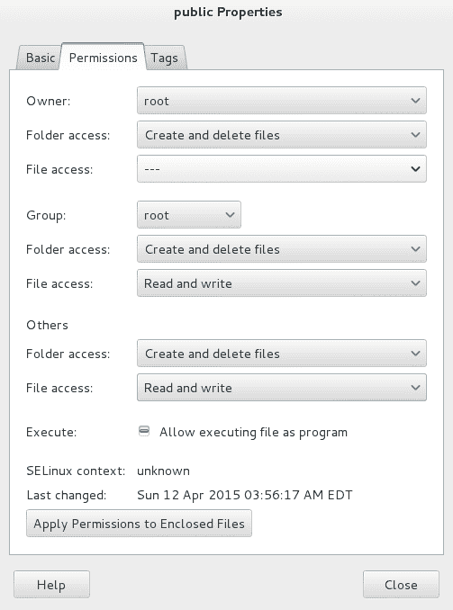
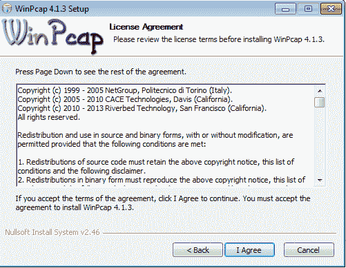
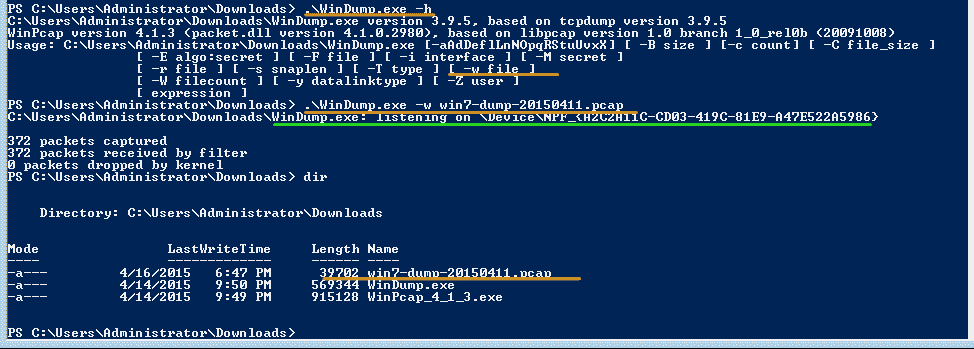
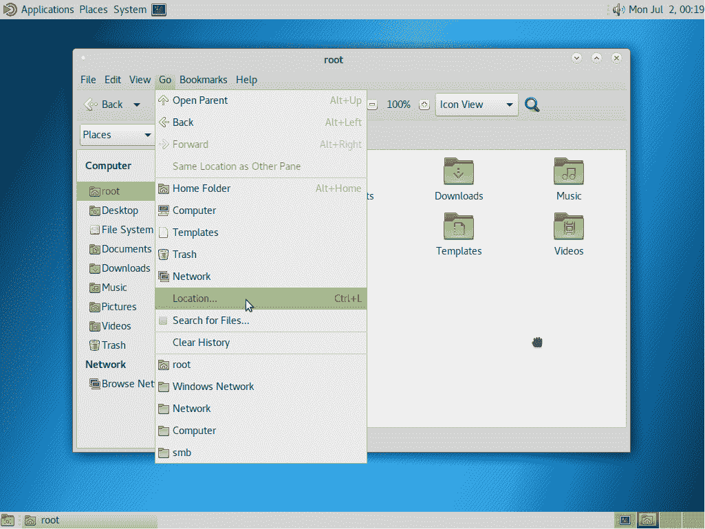
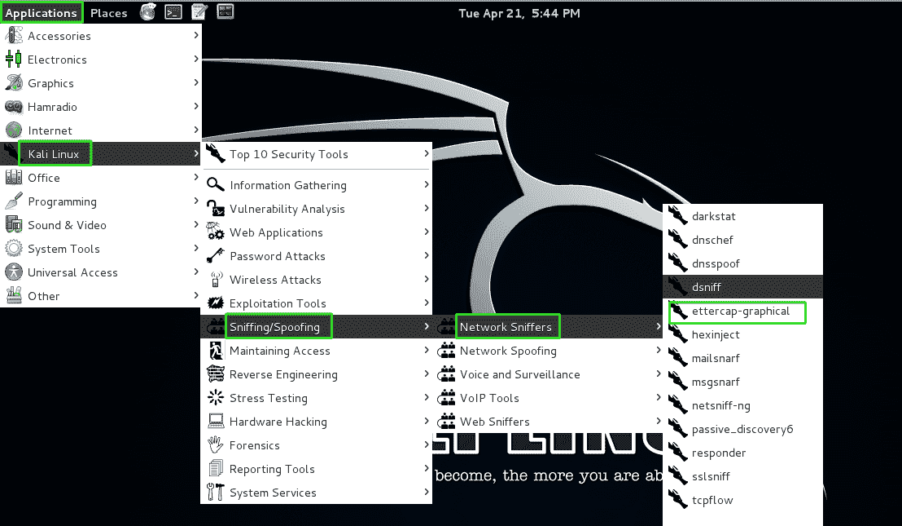
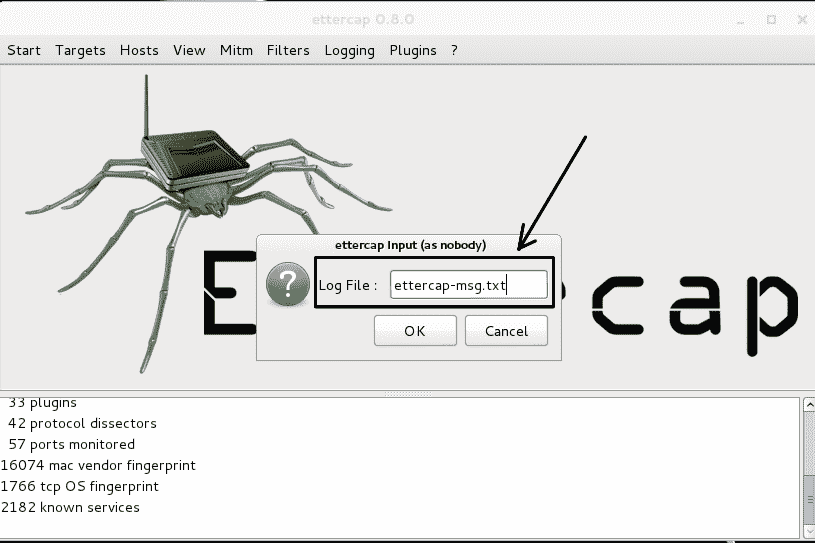
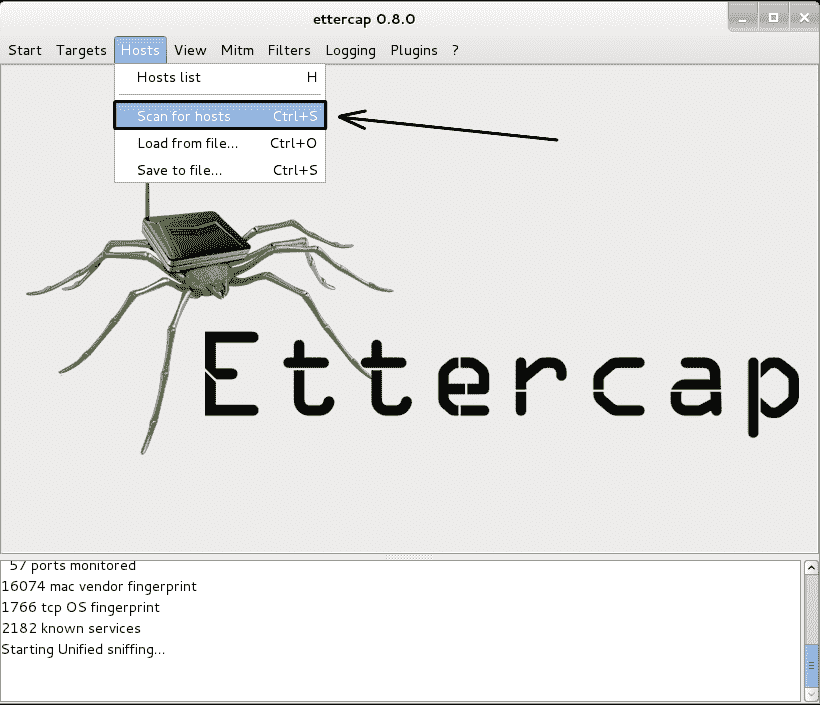
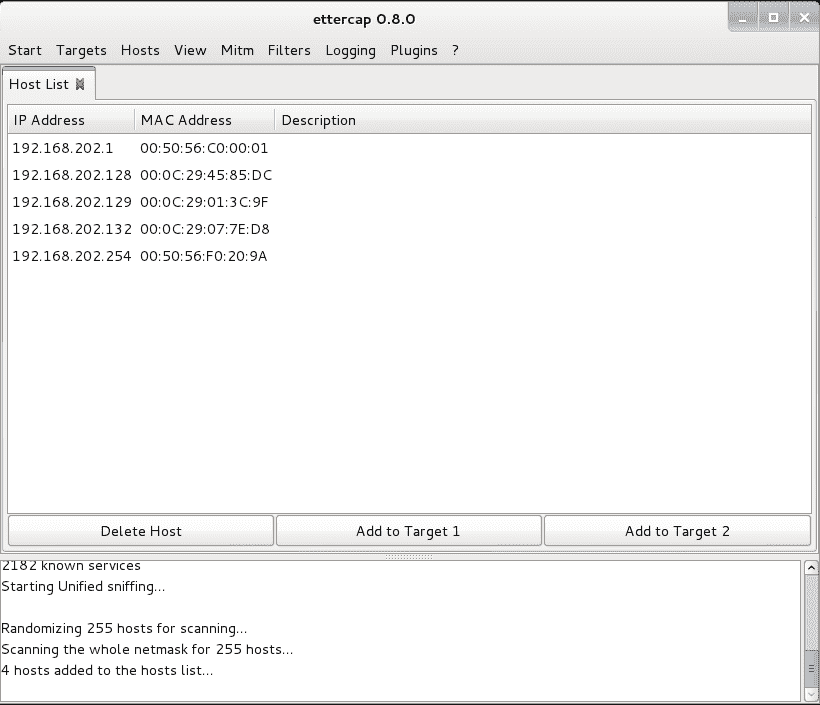
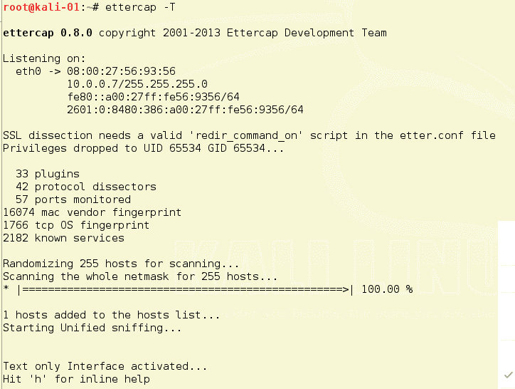

# 嗅探和欺骗

网络嗅探帮助你了解哪些用户正在使用你可以利用的服务，而胡 T0。IP 欺骗可以用来毒害系统的 DNS 或 ARP 缓存，以便所有的流量都发送给中间的人（例如，你指定的主机）。嗅探和欺骗通常用于网络中的 Windows 端点，您需要了解坏人将要使用的技术：

*   **嗅探网络流量**：嗅探网络流量的工具很多，但它们的工作原理相同。捕获您的**网络接口卡**（**NIC**可读取的数据包。有数百种协议和数千个 TCP/IP 端口。可以肯定地说，您不必了解所有这些，但您可能会了解几十个。
*   **欺骗网络流量**：TCP/IP 系统信任。网络工作方式的基本假设包括对可信度的期望。当一个犯罪分子决定对网络数据包的组合方式耍花招时会发生什么？这是欺骗。例如，当一个 ICMP 数据包被广播到大量主机，但原始 IP 地址被伪造为指向特定的目标主机时，发送广播数据包的所有主机都会向受害者发送一个意外的确认。这是一个*蓝精灵攻击*，它将受害者的机器绑起来。Smurf 攻击是众多拒绝服务攻击之一。

在本章中，我们将学习以下主题：

*   嗅探和欺骗网络流量
*   嗅探网络流量
*   欺骗网络流量

# 技术要求

在本章中，您将需要至少两台运行的 Windows 机器（实际机器或虚拟机器）和您的 Kali 机器。

# 嗅探和欺骗网络流量

你很可能已经注意到了 Kali Linux 的座右铭：*你越安静，就越能听到*。这是嗅探网络流量的核心。你静静地倾听网络流量，复制每一个数据包。每一包都很重要，否则它就不在那里了。戴上安全帽想一想。你明白为什么明文发送密码这么糟糕吗？嗯，Telnet、FTP 和 HTTP 等协议以明文形式发送密码，而不是加密哈希。任何数据包嗅探器都会捕捉到这些密码，不需要天才就可以搜索数据包捕捉中的密码等术语。没有必要破解一个散列；就在那里。你只需凭空拿出他们的明文密码，就能给经理或客户留下深刻印象。坏人使用同样的技术闯入网络，窃取金钱和秘密。

在复制的数据包中可以找到的不仅仅是密码。数据包嗅探器不仅对目的有用。在网络上查找攻击者时，它们可能很有用。你不能躲避包嗅探器。数据包嗅探器对于网络诊断也很有用。例如，网络运行缓慢可能是由于服务器的 NIC 正在消亡，无法与任何人通信，或者是由于失控的进程将其他许多 NIC 与响应捆绑在一起。

如果嗅探正在侦听网络，则网络上存在欺骗。你所做的是让攻击机器对网络撒谎，假装是其他人。使用下面介绍的一些工具以及网络上攻击机器上的两个网卡，您甚至可以将流量传递到真实主机上，并捕获进出两台机器的所有流量。这是一次**中间人**（**MitM**攻击。在 pentesting 的大多数情况下，您实际上只需要对密码进行哈希运算，而不需要进行完整的 MitM 攻击。仅仅是欺骗而不传递流量将在 NetBIOS 的 ARP 广播中暴露密码哈希。

黑客提示：
高级黑客实验室：如果你计划在你的网络上运行完整的 MitM 攻击，除了安装了 Kali Linux 的笔记本电脑外，你还需要一台至少带有两个 NIC 的主机。您的 MitM 主机可以是虚拟或物理服务器。

# 嗅探网络流量

在这里，我们将学习卡利标志的含义，*你变得越安静，你能听到的*越多，从网络中被动获得的信息也越多。

# 命令

tcpdump 是一个简单的命令行嗅探工具，可以在大多数路由器、防火墙和 Linux/UNIX 系统上找到。还有一个版本可以在 micoOLAP 制作的 Windows 上运行，可以在[上找到 http://www.microolap.com/products/network/tcpdump/](http://www.microolap.com/products/network/tcpdump/) 。这不是免费的，但有试用版。这个版本的好处在于它是一个简单的可执行文件，可以上传到系统中使用，而无需安装额外的驱动程序。它可以在有外壳访问权限的破裂系统上启动。您的 shell 必须具有系统或管理员级别的工作权限，因为如果没有管理权限，NIC 将不会在混杂模式下运行。另一个数据包转储工具是**Windump.exe**，可从[获得 http://www.winpcap.org/windump/install/](http://www.winpcap.org/windump/install/) ，在这里您还可以找到**WinPcap.exe**，您需要在机器上运行 tcpdump 或 WinDump。

在 Linux/UNIX 系统和路由器（如 Cisco 或 Juniper）上，它可能默认安装。如果您在 Linux 系统上找不到它，那么它就存在于每个分发存储库中。

tcpdump 最好不是用于收集数据以进行实时检查，而是用于将数据捕获到文件中以供以后使用 Wireshark 等工具查看。由于 tcpdump 的体积小、可移植性好，并且可以从命令行使用，因此它非常适合此任务。

在下面的屏幕截图中，我们看到`tcpdump`运行时没有保存到文件；注意，当数据包通过接口时，我们可以看到它们。

我们正在运行的命令是：

```
tcpdump -v -i vmnet1  
```

`-v`将应用程序置于详细模式。`-i vmnet1`命令应用程序只捕获`vmnet1`接口上的数据包。点击*输入*键，tcpdump 将开始捕获数据包并将其显示在屏幕上。要停止捕获，请点击*Ctrl*+*C*。

现在，在这种模式下，数据传输速度太快，无法用于任何实际用途，特别是在大型网络上，因此接下来我们将把数据保存到一个文件中，以便我们可以在空闲时使用更好的查看工具查看数据：


现在，我们将运行以下命令并将输出通过管道传输到一个`.pcap`文件。请注意，屏幕上没有您之前看到的输出。数据现在将进入文件，而不是屏幕。运行以下命令：

```
tcpdump -v -i vmnet1 -w kalibook-cap-20150411.pcap  
```

请注意，我们正在向命令中添加`-w kalibook-cap-20150411.pcap`。`-w`标志告诉应用程序将数据写入名为`kalibook-cap-20150411.pcap`的文件。该文件应该有一个描述性的名称，我还包括在文件名的日期。如果您不时地执行此测试，并且没有从系统中删除这些文件，那么同一系统中的几个文件可能会混淆。`.pcap`是业界用于包文件的标准文件扩展名，代表**包捕获文件**。可以使用文件传输方法将此文件移动到另一台计算机：


请注意，此捕获是在名为**Wander**的机器上完成的。Wander 是我们网络的防火墙，它是捕获网络流量的最佳场所。现在，我们将把它转移到我们的卡利盒，以检查数据包。

首先，在我们的 Kali 机器上，我们需要启动 SSH 服务。正如我们之前所说的，Kali 包括您在任何 Linux 服务器上都可以找到的所有网络服务，但是出于安全考虑，所有服务在默认情况下都是关闭的，必须手动启动才能使用。我们将使用以下命令启动 SSH：

```
service ssh start  
```


我们可以看到 SSH 服务启动，通过运行`netstat -tl`命令，我们可以看到 SSH 服务监听所有接口。我们现在将把文件从防火墙传输到 Kali。

在 Kali 上，运行以下命令：

```
ifconfig 
```

这将显示您的 IP 地址：


现在，通过运行以下命令，从防火墙将文件传输到 Kali：

```
scp kalibook-cap-20150411.pcap root@192.168.202.129:kalibook/kalibook-cap-20150411.pcap  
```

通过键入`yes`接受密钥警告，然后在提示时输入 root 密码。

我在演示中发出嘘声，并试图将其发送到错误的目录。没有`workspace`目录。如果您看到这种类型的错误，这很可能就是原因。请注意，我已将此文件直接发送到 Kali 框上的项目目录：


完成后，不要忘记关闭 SSH：

```
service ssh stop  
```

这对内置 SSH 的系统很好，但是 Windows 呢？大多数人似乎都在使用`putty.exe`，但你的破解服务器系统不太可能安装 putty。我们会回到过去的好日子。大多数 Windows 系统都附带 FTP 命令行实用程序。有时，有安全意识的系统管理员会从机器上删除`ftp.exe`，这会阻止这种类型的文件传输。通常是供你使用的。如果不存在，请转至[http://www.coreftp.com/](http://www.coreftp.com/) 下载核心 FTP。他们有一个适用于此应用程序的免费版本，您还可以获得更多功能的付费许可证。

我们现在将把`tcpdump`实用程序转移到我们破解的 Windows 机器上，以捕获一些数据包。

首先，我们需要在 Kali 上设置 FTP 服务，以便来回传输。为此，我们将使用我们的朋友 Metasploit。Metasploit 为此提供了易于使用的 FTP 服务。我们需要一个文件夹从以下位置工作：

1.  在 Kali box 上打开桌面上的计算机。
2.  单击左侧列表中的主页链接。

3.  在文件夹区域中单击鼠标右键，然后选择“创建新文件夹”。
4.  将其命名为`public`，然后右键单击该文件夹并转到属性。
5.  单击“权限”选项卡，授予组和其他人读/写权限以及创建和删除文件的能力，如以下屏幕截图所示：



6.  如果使用命令行，则。通过`mkdir public`创建目录。
7.  然后键入以下命令：

```
chmod 777 public
```

现在将`NDIS driver`和`tcpdump.exe`复制到`public`文件夹中。如果目标网络上可能正在使用反病毒和/或 IDS/IPS 系统，则需要重命名 tcpdump 文件。我已将名称更改为`tdpdump.jpg`。`microolap_pssdk6_driver_for_ndis6_x86_v6.1.0.6363.msi`驱动程序文件正常通过 OK。

现在通过进入应用程序| Kali Linux |系统服务| community/pro start 启动服务，在 Kali 盒上启动 Metasploit。一旦服务启动，打开终端窗口并键入`msfpro`。

Metasploit 将启动。Metasploit 运行后，进入项目的工作区。我的工作区名为`kali-book-int-20150300`：

```
workspace kali-book-int-20150300  
```

现在我们将配置 FTP 服务器并启动它。要加载 FTP 服务器，请键入以下命令：

```
use auxiliary/server/ftp
 show options  
```

您将看到以下配置选项：


我们需要更改`FTPROOT`设置类型：

```
set FTPROOT /root/public
show options  
```

通过再次运行`show options`命令，我们可以检查我们的配置。我们准备好出发了。键入以下命令：

```
run  
```

您将看到以下内容：


您可以通过运行以下命令查看服务：

```
netstat-tl      
```


现在，让我们将文件复制到我们的 Windows 机器上，并捕获一些美味的数据包！我们将在 Windows 上使用 WinDump 进行此过程。

# WinDump（Windows tcpdump）

WinDump 是 Windows 的 tcpdump。它是开源的，并且在 BSD 许可证下。您可以在[下载 https://www.winpcap.org/windump/](https://www.winpcap.org/windump/) 。

您还需要 WinPcap 驱动程序，因此请确保也从站点获取它们。

WinDump 将从命令行、PowerShell 或远程 shell 工作。与 tcpdump 一样，它将写入一个文件，您可以下载该文件进行脱机查看。

现在让我们把文件复制到我们的 Windows 机器上。从命令行、powershell 或被利用的远程 Shell 登录到 Kali 上的 FTP 服务器。我的卡利盒子在`192.168.202.129`：

```
ftp 192.168.202.129  
```

系统将要求输入用户名。只需点击*进入*。它还将要求输入密码。只需再次点击*进入*即可登录。然后键入以下命令：

```
dir  
```

这将显示目录的内容：


正如前面的截图所示，我们看到了我们的`WinPcap`驱动程序和我们毫不掩饰的`WinDump.exe`。要下载它们，只需键入以下命令：

```
get WinPcap_4_1_3.exe  
```

然后键入以下命令：

```
get WinDump.exe  
```

我们有档案了。现在按如下方式注销：

```
quit  
```

如我们所见，通过键入以下命令，我们现在可以在本地获得文件：

```
dir  
```

我们还可以在 Metasploit 中看到在 Kali 上从正在运行的实例传输的文件：


现在通过 RDP 或从 Metasploit 启动 VNC 会话登录到您的 pwned Windows 计算机。从桌面，转到下载文件的文件夹，双击`WinPcap.exe`文件，如下图所示：


接下来，您将获得 windows 许可证。单击我同意并继续：



下一个屏幕开始实际安装驱动程序。确保选中该复选框以自动运行。如果您必须返回，这将是一个很大的帮助：


完成此操作后，您就可以捕获一些数据包了。

启动命令行窗口或 powershell，并转到您拥有 WinDump 的目录。我们把它放在`Downloads`文件夹中。运行以下命令：

```
.\WinDump.exe  
```

很快，您将开始看到数据包通过接口。您在屏幕上看到的内容取决于您的系统与网络的通信量。正如您所知，这是太多的数据，无法尝试实时理解。此外，在此模式下，您只看到数据包的报头信息，而不是完整的数据包及其信息。在下面的屏幕截图中，黄色下划线显示正在运行的命令，绿色下划线显示正在运行的界面上侦听。在那之后，你会看到包进来了。

现在，让我们将捕获内容转储到一个文件中，这样我们就可以通过运行以下命令来查看我们拥有的内容：


```
.\WinDump.exe -w Win7-dump-20150411.pcap  
```

-`w`文件告诉 WinDump 写入文件`Win7-dump-20150411.pcap`。正如您在下面的屏幕截图中所看到的，如果您忘记了 write 标志，那么使用`-h`标志运行 WinDump 会有所帮助。运行一段时间后，点击*Ctrl*+*C*停止捕捉。您现在可以看到，我们有一个包含捕获的数据包的文件：



捕获后，我们需要将文件发送回 Kali 以分析数据包。

Windows 文件共享适用于此。如果打印机和文件共享未打开，请启用它以共享文件并返回到 Kali 框。

黑客提示：
如果网络管理员运行 Tripwire 等设备以检查配置更改，或者设置 ArcSight 以标记管理用户记录的操作，则此过程可能会引发警报。

Kali 在所有桌面环境中的文件管理器中都内置了 SMB 文件共享和 NetBIOS 发现功能。您可以从文件管理器映射到 SMB 共享。在下面的演示中，我们使用的是 MATE 桌面。在其文件管理器中，您可以通过转到|位置来映射 SMB 共享。。。在菜单栏中：



这将为您提供一个 Go-To:地址栏。因为我们将使用 SMB 协议，所以我们将使用前缀`smb://`。还可以使用此方法映射其他服务类型共享，例如 SSH、FTP 和 NFS 共享。要连接到受害者机器并复制文件，请键入`smb://10.0.2.101/C$`。

然后点击*回车*键。这映射到隐藏的`C$`共享：


点击*进入*后，您将获得一个登录框。要登录到共享，只需添加您拥有的 Windows 凭据，然后单击“连接”按钮。现在您将看到系统上的共享目录。向下钻取文件夹并转到包捕获所在的目录。对我们来说，它将是`Users\Administrator\Downloads`：


现在我们已经找到了文件所在的位置，再次单击计算机图标，打开另一个文件管理器窗口，然后转到项目的证据目录。然后将文件拖放到 Kali 的驱动器上：


现在我们准备读取一些捕获的数据包。

# 钢丝鲨

**Wireshark**是数据包嗅探和分析网络数据包的行业实际标准。它不仅适用于 TCP/IP，而且也适用于几乎所有其他已知的协议和标准。每个著名的操作系统都有 Wireshark 版本。要在 Windows 上运行 Wireshark，您需要本章前面的 WinPcap 驱动程序。在 Linux/UNIX 和 OSX 上，驱动程序通常已经存在。Wireshark 预装在 Kali 上。

Wireshark 是一个极其复杂的应用程序。有很多关于它的使用的书。我建议你买一个，并学习这个工具的深入使用。这里我们将只介绍基本内容。

如果你仔细想想，互联网是什么？有些人指着他们的网络浏览器说有互联网。系统管理员可能会给您一个关于通过网络传输数据的服务器和设备的详细答案。每个人的答案都是正确的，但仍然没有准确地回答问题。互联网是信息包。没有数据包，信息就没有出路。大多数人没有意识到 TCP/IP 是两个独立工作的不同协议套件。首先是 IP，然后是 TCP 和 UDP，它们运行在 IP 之上。然后所有这些都在互联网框架上运行。

我们马上回 Wireshark。首先，我们需要了解什么是数据包。

# 包裹

让我们看一个包。下面只是从捕获的数据流中提取的一个信息包。请记住：这只是一包！

哦，这里有一点历史。如果您查看数据包的结构和旧电报消息的结构，您会注意到结构是相同的。是的，包基本上是电报。另外，记住摩尔斯电码基本上是一种四位二进制语言。

注意，首先我们有**帧**。该框架包含有关您可以看到的数据包的基本信息。Wireshark 捕获了线路上的字节。这还保持了在接收时用于重新组装数据包的数据包的定时：

```
Frame 9: 188 bytes on wire (1504 bits), 188 bytes captured (1504 bits) 
  Encapsulation type: Ethernet (1) 
  Arrival Time: Apr 12, 2015 01:43:27.374355000 EDT 
  [Time shift for this packet: 0.000000000 seconds] 
  Epoch Time: 1428817407.374355000 seconds 
  [Time delta from previous captured frame: 0.002915000 seconds] 
  [Time delta from previous displayed frame: 0.002915000 seconds] 
  [Time since reference or first frame: 9.430852000 seconds] 
  Frame Number: 9 
  Frame Length: 188 bytes (1504 bits) 
  Capture Length: 188 bytes (1504 bits) 
  [Frame is marked: False] 
  [Frame is ignored: False] 
  [Protocols in frame: eth:ip:tcp:nbss:smb] 
  [Coloring Rule Name: SMB] 
  [Coloring Rule String: smb || nbss || nbns || nbipx || ipxsap || 
       netbios]
```

接下来，我们有您的数据包的 IP 部分。我们看到它包含源接口和目标接口的 MAC 地址。你的 MAC 地址是你真正的机器地址。堆栈的 IP 部分进行路由，以便两个 MAC 地址可以找到对方：

```
Ethernet II, Src: Vmware_07:7e:d8 (00:0c:29:07:7e:d8), Dst: Vmware_45:85:dc (00:0c:29:45:85:dc) 
  Destination: Vmware_45:85:dc (00:0c:29:45:85:dc) 
    Address: Vmware_45:85:dc (00:0c:29:45:85:dc) 
    .... ..0\. .... .... .... .... = LG bit: Globally unique address (factory default) 
    .... ...0 .... .... .... .... = IG bit: Individual address (unicast) 
  Source: Vmware_07:7e:d8 (00:0c:29:07:7e:d8) 
    Address: Vmware_07:7e:d8 (00:0c:29:07:7e:d8) 
    .... ..0\. .... .... .... .... = LG bit: Globally unique address (factory default) 
    .... ...0 .... .... .... .... = IG bit: Individual address (unicast) 
  Type: IP (0x0800) 
Internet Protocol Version 4, Src: 192.168.202.130 (192.168.202.130), Dst: 192.168.202.128 (192.168.202.128) 
  Version: 4 
  Header length: 20 bytes 
  Differentiated Services Field: 0x00 (DSCP 0x00: Default; ECN: 0x00: Not-ECT (Not ECN-Capable Transport)) 
  Total Length: 174 
  Identification: 0x033f (831) 
  Flags: 0x02 (Don't Fragment) 
  Fragment offset: 0 
  Time to live: 128 
  Protocol: TCP (6) 
  Header checksum: 0xe0b6 [correct] 
    [Good: True] 
    [Bad: False] 
  Source: 192.168.202.130 (192.168.202.130) 
  Destination: 192.168.202.128 (192.168.202.128) 
  [Source GeoIP: Unknown] 
  [Destination GeoIP: Unknown] 
```

数据包的下一部分是 TCP 进入的地方，它设置要使用的 TCP 或 UDP 协议的类型以及为数据包传输分配的源端口和目标端口。此数据包是从客户端计算机（源）发送的。从前面的 IP 部分，我们看到客户端 IP 地址是`192.168.202.130`。我们看到客户的端口：`49161`。此数据包正在发送到端口`445`的`192.168.202.128`（目的地）。这是 TCP，返回的流量包括一个返回路由。我们可以通过`Destination port`信息判断这是某种类型的 SMB 流量：

```
Transmission Control Protocol, Src Port: 49161 (49161), Dst Port: microsoft-ds (445), Seq: 101, Ack: 61, Len: 134 
  Source port: 49161 (49161) 
  Destination port: microsoft-ds (445) 
  [Stream index: 0] 
  Sequence number: 101  (relative sequence number) 
  [Next sequence number: 235  (relative sequence number)] 
  Acknowledgment number: 61  (relative ack number) 
  Header length: 20 bytes 
  Flags: 0x018 (PSH, ACK) 
    000\. .... .... = Reserved: Not set 
    ...0 .... .... = Nonce: Not set 
    .... 0... .... = Congestion Window Reduced (CWR): Not set 
    .... .0.. .... = ECN-Echo: Not set 
    .... ..0\. .... = Urgent: Not set 
    .... ...1 .... = Acknowledgment: Set 
    .... .... 1... = Push: Set 
    .... .... .0.. = Reset: Not set 
    .... .... ..0\. = Syn: Not set 
    .... .... ...0 = Fin: Not set 
```

在数据包信息中，0 表示否，1 表示是。

```
  Window size value: 63725 
  [Calculated window size: 63725] 
  [Window size scaling factor: -1 (unknown)] 
  Checksum: 0xf5d8 [validation disabled] 
  [SEQ/ACK analysis] 
    [This is an ACK to the segment in frame: 8] 
    [The RTT to ACK the segment was: 0.002915000 seconds] 
    [Bytes in flight: 134] 
```

我们看到这是一个使用 SMB 协议的 NetBIOS 会话：

```
NetBIOS Session Service 
  Message Type: Session message (0x00) 
  Length: 130 
SMB (Server Message Block Protocol) 
  SMB Header 
    Server Component: SMB 
    [Response in: 10] 
    SMB Command: NT Create AndX (0xa2) 
    NT Status: STATUS_SUCCESS (0x00000000) 
    Flags: 0x18 
    Flags2: 0xc807 
    Process ID High: 0 
    Signature: 0000000000000000 
    Reserved: 0000 
    Tree ID: 2049 
    Process ID: 2108 
    User ID: 2048 
    Multiplex ID: 689 
  NT Create AndX Request (0xa2) 
    [FID: 0x4007] 
    Word Count (WCT): 24 
    AndXCommand: No further commands (0xff) 
    Reserved: 00 
    AndXOffset: 57054 
    Reserved: 00 
    File Name Len: 44 
    Create Flags: 0x00000016 
    Root FID: 0x00000000 
```

接下来，我们可以访问我们请求的数据。我们现在可以看到这个包与访问文件有关。完成此请求的用户具有以下权限来查看请求的文件。我们可以从前面的代码中看到，为文件请求提供了成功状态。

```
    Access Mask: 0x00020089 
      0... .... .... .... .... .... .... .... = Generic Read: Generic read is NOT set 
      .0.. .... .... .... .... .... .... .... = Generic Write: Generic write is NOT set 
      ..0\. .... .... .... .... .... .... .... = Generic Execute: Generic execute is NOT set 
      ...0 .... .... .... .... .... .... .... = Generic All: Generic all is NOT set 
      .... ..0\. .... .... .... .... .... .... = Maximum Allowed: Maximum allowed is NOT set 
      .... ...0 .... .... .... .... .... .... = System Security: System security is NOT set 
      .... .... ...0 .... .... .... .... .... = Synchronize: Can NOT wait on handle to synchronize on completion of I/O 
      .... .... .... 0... .... .... .... .... = Write Owner: Can NOT write owner (take ownership) 
      .... .... .... .0.. .... .... .... .... = Write DAC: Owner may NOT write to the DAC 
      .... .... .... ..1\. .... .... .... .... = Read Control: READ ACCESS to owner, group and ACL of the SID 
      .... .... .... ...0 .... .... .... .... = Delete: NO delete access 
      .... .... .... .... .... ...0 .... .... = Write Attributes: NO write attributes access 
      .... .... .... .... .... .... 1... .... = Read Attributes: READ ATTRIBUTES access 
      .... .... .... .... .... .... .0.. .... = Delete Child: NO delete child access 
      .... .... .... .... .... .... ..0\. .... = Execute: NO execute access 
      .... .... .... .... .... .... ...0 .... = Write EA: NO write extended attributes access 
      .... .... .... .... .... .... .... 1... = Read EA: READ EXTENDED ATTRIBUTES access 
      .... .... .... .... .... .... .... .0.. = Append: NO append access 
      .... .... .... .... .... .... .... ..0\. = Write: NO write access 
      .... .... .... .... .... .... .... ...1 = Read: READ access 
    Allocation Size: 0 
    File Attributes: 0x00000000 
    Share Access: 0x00000007 SHARE_DELETE SHARE_WRITE SHARE_READ 
    Disposition: Open (if file exists open it, else fail) (1) 
    Create Options: 0x00000044 
    Impersonation: Impersonation (2) 
    Security Flags: 0x03 
    Byte Count (BCC): 47 
    File Name: \My Videos\desktop.ini 
```

前面的所有代码都是让一台计算机知道另一台计算机上存在一个名为`\My Videos\desktop.ini`的文件。发送了 47 字节的信息。现在，这不是实际的文件，只是一个文件列表。基本上，这就是使文件图标出现在窗口管理器中的数据包。只发送一点点数据确实需要很多：

```
No.   Time    Source        Destination      Protocol Length Info 
   10 9.431187  192.168.202.128    192.168.202.130    SMB   193  NT Create AndX Response, FID: 0x4007 
```

现在我们了解了一些关于数据包的知识，让我们回到 Wireshark。

# 与 Wireshark 合作

让我们打开它，打开我们的捕获。首先，进入应用程序| Kali Linux |十大安全工具| wireshark。当它启动时，它将向您发出有关以 root 身份运行的警告。只需点击这些。如果愿意，请选中该框，表示您不想再次看到这些。当您与 Kali 合作时，您将始终以`root`的身份工作。

另一个警告：千万不要在生产 Linux 机器上这样做。除了卡利，不要以`root`身份登录和运行任何地方。Wolf 在他的 Kali Linux 测试盒中添加了一个标准用户和`sudo`，只有在他实际运行测试时，它才会以`root`的形式运行。


警告后，窗口将打开。正如我们所看到的，我们有一个非常好的界面。您可以做的不仅仅是读取捕获。您可以从列出的本地接口捕获数据包。在右侧，您将看到联机帮助部分。如果你迷路了，需要帮助，那就是你要去的地方。您将在网上找到大量帮助：


让我们打开我们的捕获。单击文件|打开，您将获得一个文件菜单。导航到文件所在的位置，然后单击“打开”：


现在捕获打开，所有捕获的数据都列在顶部屏幕中。每个列表都是一个数据包。您看到的是数据包的头信息、其源、目的地和协议类型。

通过点击顶部屏幕中的一个数据包，该数据包的全部信息将在中间屏幕中。这将是我们之前分解数据包时看到的信息。这就是您将看到这些信息的地方。实际上，这是人类可读的数据包。在底部屏幕中，我们有机器语言中的实际原始数据包。通过点击中间屏幕上的信息线，WiReSARK 将以蓝色显示机器语言的字符串，显示该代码在包上的位置：


查看第一个屏幕，我们可以看到总体流量。我们看到一台机器发出 DHCPv6 请求呼叫，却没有从任何地方得到响应。嗯，这个网络上的 IPv6 必须关闭。接下来，我们将看到`192.168.202.128`和`192.168.202.130`之间来回的通信量。仅从标题中，我们可以看到此传输是针对使用 SMB 的`192.168.202.128`上的文件信息。我们可以通过查看标题得知`.130`上的用户可以访问`.128`：


那么好东西在哪里呢？在下面的屏幕截图中，我们有一个`SMB NTLMSSP`数据包，我们甚至可以看到这是针对标头中的帐户`IVEBEENHAD\Administrator`的。通过选择数据包，我们可以深入数据包并找到密码的 NTLM 哈希值。这一点可以单独用于可以传递散列的利用工具中。您还可以将此散列值引入脱机密码破解工具，如 John the Ripper 或 Hydra。请注意，您还可以在底部屏幕中看到原始数据包信息中的值：


Wireshark 最好的功能之一是**搜索**功能。这个函数的细节对于一本书来说已经足够了。您可以使用表达式生成表达式。。。过滤器字段右侧的按钮。从简单的过滤器，如`ip != 10.0.0.232`（将所有流量分割到您的 Kali box），或通过在过滤器字段中输入 SMTP 来检查意外的 SMTP 流量，当您学习最需要的过滤器时，您将获得无穷的乐趣。在线帮助将解释很多内容，与所有优秀的知识库一样，它也将提出新的问题：


# 欺骗网络流量

互联网上的欺骗有几种定义：

*   **电子邮件欺骗**：最常见的定义是使用假电子邮件地址伪装成不同的人。这在尝试**钓鱼攻击**时效果很好，受害者收到一封据称来自其银行或零售店的电子邮件。
*   **域欺骗**：可以欺骗一个域，在其中毒害网络或单个工作站上的路由表。其工作原理是，用户在其浏览器的地址栏中键入的域未对齐，指向错误的 IP 地址。当受害者进入[时 http://bankarmenia.com/](http://bankarmenia.com/) 他们最终进入了一个看起来与亚美尼亚银行网站一模一样的钓鱼网站，但事实并非如此。这用于从用户处收集凭据以进行盗窃。
*   **域名错误欺骗**：黑客为热门网站购买有常见错误的域名，如`https://www.yaahoo.com/`。他们建立了一个类似于[的网站 https://www.yahoo.com/](https://www.yahoo.com/) ，并从所有拼写错误中获益。
*   **IP 欺骗**：为了伪装成不同的机器，或为了隐藏数据包的来源而创建精心制作的数据包。

# 伊特怪


可爱的标志和非常暴露。是的，那是蜘蛛背上的无线路由器。Ettercap 有一些很好的无线网络插件。我们现在不报道无线，但这是需要知道的。eTerCap 可以嗅探和捕获数据，比如 tcpdump 和 Wireshark，但它也可以欺骗网络流量，捕获感兴趣的信息，并将其传输到文件。图形界面可在应用程序| Kali Linux |嗅探/欺骗|网络嗅探器| eTerCap graphical 上找到，它将启动 eTerCap：



以下屏幕截图显示了 eTerCap 的图形界面。我们首先通过选择 Sniff | Unified Sniff 开始统一嗅探。。。在菜单栏中：


我们现在被问到使用哪个接口。通常，如果需要，它将是默认值。通过下拉框，您可以选择系统上的任何界面。单击“确定”：

警告
当使用 SSH 隧道时，如果从远程机器使用，Ettercap 将断开隧道连接。他们似乎玩得不好。


您将注意到，一旦配置了统一嗅探，菜单栏就发生了更改。

首先，我们需要记录消息。转到日志记录|记录用户消息。。。在菜单栏中：


将为您提供一个窗口，用于为消息输出命名文件。给它一个文件名，然后单击“确定”：



接下来，我们需要开始嗅探流量。去开始|开始嗅探。这里发生的是由 tcpdump 和 Wireshark 执行的相同功能。目前，eTerCap 只是被动地捕获数据包。在开始嗅探之前，您可以在日志菜单下设置 Ettercap，以保存所有捕获的数据包，供以后检查。您只需将捕获保存到一个`.pcap`文件，就像在 tcpdump 和 Wireshark 中一样。

通常，仅保存用户消息的输出就足以进行 pentesting。当 pentesting 时，您主要关注密码和登录凭据。消息日志将捕获这些。有时，为了进行一些额外的侦察，您可以加入保存整个捕获：


一旦嗅探开始，我们需要扫描主机。转到主机|在菜单栏中扫描主机。这将扫描本地网络以查找可用的主机。注意，还有一个从文件加载的选项。。。。您可以选择此选项并从文本文件加载主机 IP 地址列表。在大型网络上，如果您只想欺骗文件服务器和域控制器的通信量，而不想欺骗工作站，这是一个很好的选择。这将减少网络流量。ARP 欺骗可以产生大量流量。如果这是一个大型网络，则此流量会减慢网络速度。如果您在秘密测试，流量会让您被抓到：



在下面的屏幕截图中，我们看到了从扫描中获取的主机列表。由于这是一个小型网络，我们将欺骗所有主机。我们看到有五台主机列出了完整的 MAC 地址。请记住，其中之一是试验机：



我们准备给水下毒，看看浮上来的是什么。转到 Mitm | Arp 中毒。。。点击：


然后，您将获得一个窗口来设置要执行的中毒类型。选择嗅探远程连接。然后单击“确定”：


以下屏幕显示正在进行的 DNS 中毒：


中毒完成后，数据将通过 Ettercap 界面发送，该界面显示管理用户及其 NTLM 密码散列。这是足够的信息，可以开始与开膛手 John 或 Hashcat 进行密码哈希运算。

黑客提示：
即使管理员密码失败，也要破解。管理员用户可能忘记了他们登录的机器，而失败的密码可能在系统中的其他地方起作用。


在大多数安全策略中，Windows 系统被设置为在用户五次或六次尝试后拒绝连接。此策略保护用户帐户免受暴力密码攻击或密码猜测攻击。这将停止暴力强制密码，但正如您所看到的，此策略对此类攻击没有影响。您已经拥有管理员密码，因此可以第一次登录。

Ettercap 的一个重要特性是，它还可以在命令行下使用 Ncurses 界面工作。在使用 SSH 从远程系统工作时，这非常好。使用*Tab*键和箭头键在菜单中移动，*Enter*键进行选择。

# 命令行上的 TTERCAP

在许多情况下，您将无法使用 eTerCap 的图形界面。当您从一台有漏洞的 Linux 机器发起攻击时，您可能会发现它根本没有图形桌面。在这种情况下，可以使用 Ettercap curses 版本或纯文本版本。在使用 SSH 从远程系统工作时，这非常好。使用*Tab*键和箭头键在菜单中移动，*Enter*键选择：


要从命令行启动 Ettercap，需要向命令添加一些标志；与大多数 Linux 命令一样，您可以使用`ettercap -help`获取标志及其含义的列表。对于基本用途，可以使用以下命令：

```
root@kalibook :~# ettercap -C -m ettercap-msg.txt   
```

`-C`标志在 Ncurses 模式下启动 Ettercap。我已经包含了`-m ettercap-mgs.txt`标志，用于将消息输出管道输出到`ettercap-msg.txt file`。如果要保存整个捕获，请添加`-w ettercap-capture.pcap`。这将保存完整的捕获，以便您可以在需要时将其拉入 Wireshark。我发现使用命令行标志保存输出更容易。

以下屏幕截图显示了基于 CLI 的 Curses 界面。


下一个屏幕截图显示了基于 CLI 的纯文本界面：



# 总结

在本章中，您将了解如何使用 tcpdump、WinDump 和 Wireshark 嗅探网络，以及如何筛选协议和 IP 地址。接下来，你就可以使用 eTerCap 玩欺骗和 ARP 中毒了。

在我们的下一章中，我们将使用从 ARP 欺骗中获得的信息积极地与我们的目标交战，并学习如何破解在线和离线密码。

# 进一步阅读

*   有关 Wireshark 的更多信息，请访问其文档网站的以下链接：[https://www.wireshark.org/docs/](https://www.wireshark.org/docs/)
*   有关 tcpdump 的更多信息，请访问其网站的以下链接：[http://www.tcpdump.org/#documentation](http://www.tcpdump.org/#documentation)
*   有关 eTerCap 的更多信息，请访问其网站的以下链接：[https://www.ettercap-project.org/](https://www.ettercap-project.org/)