# 十、逆向工程与压力测试

如果你想知道恶意软件将如何运行，实现这一目标的最简单方法是让它在你的网络中肆虐，并在野外跟踪其行为。这不是您想要了解恶意软件行为的方式。您可能很容易错过一些您的网络环境无法执行的内容，然后您必须从网络中的所有计算机中删除恶意软件。Kali 有一些选定的工具可以帮助您完成这项工作。本章还介绍了 Windows 服务器或应用程序的压力测试。如果你想知道 DDoS 会让你的服务器崩溃多少，这是一个好主意。本章是如何开发抗脆弱、自我修复的 Windows 网络的开始。

我们将在本章中学习以下主题：

*   设置测试环境
*   逆向工程理论
*   使用布尔逻辑
*   实践逆向工程
*   压力测试你的 Windows 机器

与 Kali Linux 1.x 中的工具相比，Kali Linux 2.0 中提供的反向工程工具有一些变化。一些工具已经从菜单结构中消失，如果您愿意，您可以使用[第 6 章](06.html)、*NetBIOS 名称服务和 LLMNR–过时但仍然致命的*的最后一节将它们放回原处。有些工具根本没有包含在 Kali Linux 2 中，尽管这里和那里都有它们的踪迹。下表显示了这些更改。

显示完整路径的工具根本不在默认的 Kali 2.0 菜单中，而 Metasploit 框架工具套件的一部分 NASM 外壳也不在 Kali 1.x 菜单中。

下表显示了 Kali 1.x 和 2.0 中工具之间的差异：

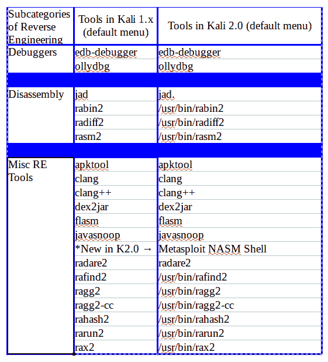

# 技术要求

对于本章，您将需要以下内容：

*   正在运行的 Kali-Linux 机器
*   Windows 操作系统的运行副本（可以是 VM）

# 设置测试环境

开发测试环境需要测试所针对的所有 Windows 操作系统的虚拟机示例。例如，应用程序开发人员可能正在运行非常旧的浏览器/操作系统测试机器，以查看运行仿古硬件的客户会遇到什么问题。在本例中，我们运行的是 Windows XP、Windows 7 和 Windows 10。我们正在使用 Oracle VirtualBox 进行桌面虚拟化，但如果您更喜欢使用 VMWare，请改用它。重要的是要使用可以与主网络隔离的机器，以防恶意软件按其应有的方式运行，并试图感染周围的机器。

# 正在创建受害者计算机

如果已经为其他目的设置了 Windows 虚拟机，则可以克隆它们（可能是最安全的选项）或从快照运行它们（这是最快的设置方式）。这些机器在您构建之后不应该能够访问主网络，您可能应该将它们设置为仅与内部网络通信。

# 测试您的测试环境

1.  带上你的卡利
2.  确保您的 Kali 实例可以与 internet 对话，以便于获取更新
3.  确保您的 Kali 实例可以与主机通信
4.  启动目标 Windows 实例
5.  确保您的 Windows 受害者无法联系 internet 或您的专用以太网 LAN，以避免恶意软件的意外传播

我们测试网络上的三个虚拟机位于 Oracle VirtualBox 内的仅主机网络上。DHCP 由主机`192.168.56.100`提供，三台测试网络机分别为`101`、`102`、`103`，如下图：

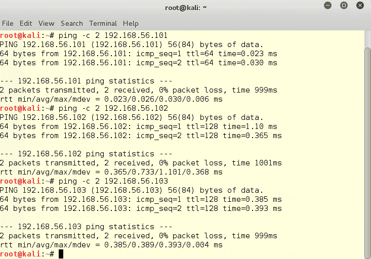

# 逆向工程理论

出于某种原因，理论让 IT 专业人士感到恐慌。这并不是真正的保证，因为理论是所有故障排除的基础。这可能是你在 X 年的艰苦尝试和错误中学到的公理。在定性研究领域，这被字面上称为**扎根理论研究方法**。逆向工程的基本理论是，输出推断应用程序的内部行为。当你面对一个恶意软件时，你将从以下几个方面开始做出工作假设：

*   先前的知识，从回忆起与被认为类似的恶意软件的交互
*   概括与被测恶意软件交互的感知结果

**Hacker tip**:
It is probably not useful to label an application in an *a priori* manner. It may mask data to apply the *if it walks like a duck and quacks like a duck, it is probably a duck* axiom to the application. Especially with malware, it is likely that the design includes some deceptive features that are expected to set you off on the wrong track. Consider the trojans and rootkits that remove other trojans and rootkits as their first task. They are cleaning up your environment, but, are they really your friend?

恶意软件应用程序旨在提供输入输出，但了解输出和输入并不能真正让您了解输出是如何实现的。输出可以用几种不同的方式生成，您可能会发现开发人员选择如何创建应用程序很重要。

# 逆向工程的一般理论

这一理论由 Lee 和 Johnson Laird 于 2013 年在《认知心理学杂志》上发表，对信息安全从业者很有用，因为它以布尔系统表示。布尔系统是一个逻辑门。条件要么为真，要么为假。问题的一个非常常见的定义可能如下：

“任何要进行反向工程的系统都包含有限数量的组件，这些组件一起工作，产生系统行为。其中一些组件是可变的，也就是说，它们可能处于影响系统性能的多个不同状态，例如，数码相机上允许播放或播放的设置。”擦除照片。系统的其他组件不会发生变化，例如，从开关到灯泡的导线。系统有许多来自用户的不同输入和随后的输出，它们由有限数量的互连组件介导。在某些系统中，组件可能具有无限数量特定状态的 ber，例如，不同的电压。但是，为了逆向工程的目的，我们假设所有可变组件都可以被视为具有有限数量的不同状态，也就是说，系统作为一个整体相当于一个有限状态自动机。换句话说，模拟系统可以数字化，就像在数字相机中一样 as、CDs 和其他以前的模拟设备。我们还假设设备是确定性的，尽管非确定性有限状态设备总是可以被确定性设备模拟。”
（Lee&Johnson Laird，2013）

逆向工程理论及其在布尔系统中的应用。*认知心理学杂志，25（4）*365-389。[http://doi.org/10.1080/20445911.2013.782033](http://doi.org/10.1080/20445911.2013.782033) 。

Lee 和 Johnson-Laird 模型仅对可能的内部条件使用布尔内部模型，以揭示所注意到的行为。因为不可能测试无限多的输入，所以只测试可能的输入和输出的子集更有用。我们可以从一个简单的例子开始，例如，这里的例子：

*   如果恶意软件降落在苹果平台上，并被设计为利用 Windows 漏洞进行攻击，则很可能根本无法运行（开关 1）
*   如果它降落在 Windows 计算机上，但针对的是 XP 版本的漏洞，它可能会测试该操作系统版本，如果它发现自己在 Windows Server 2012 上，则什么也不做（开关 2）
*   如果它恰好是 Windows XP，但已针对所查找的漏洞进行了修补，则它也可能什么都不做（开关 3）
*   如果它降落在一台 Windows XP 计算机上，而该计算机上包含了该备受追捧的未修补漏洞，则会丢弃其有效负载

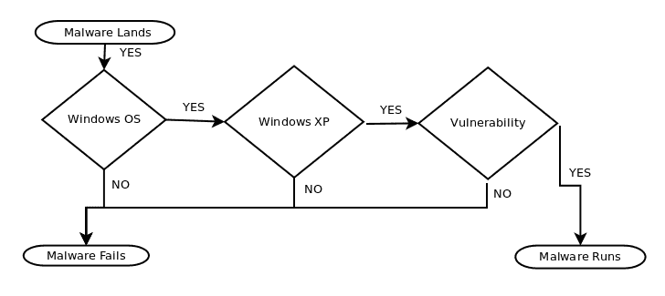

# 使用布尔逻辑

计算机程序由**数据结构**组成，利用条件和决策产生所需的输出。这里我们将使用 Python 表示法，因为它很简单，您以前可能见过它。基本数据结构如下所示。

*   迭代器，如 while 循环和 for 循环。迭代器循环次数与它被告知的次数相同，每次循环时都运行其他命令。

*   决策点，如 if 结构和案例结构。前面的图是一组嵌套的 if 结构。

| **布尔运算符** |
| --- |
| **符号** | **说明** | **示例** |
| --- | --- | --- |
| X==Y | X 等于 Y。这并不总是一个数值集。 | “shirts”=“hats”的计算结果为 FALSE。“shirts”==“shirts”的计算结果为 TRUE。1==11 的计算结果为 FALSE。11==11 的计算结果为 TRUE。 |
| X！=Y | X 不等于 Y。 | “衬衫”！=“hats”的计算结果为 TRUE。“衬衫”！=“衬衫”的计算结果为假。1 != 11 的计算结果为真。11 != 11 的计算结果为假。 |
| X<=Y | X 小于或等于 Y。 | “衬衫”<=“帽子”的计算结果为 FALSE。“shirts”<=“shirts”的计算结果为 TRUE。（正在计算字符数。）1<=11 计算为真。11<=11 计算为真。 |
| X>=Y | X 大于或等于 Y。 | “shirts”>=“hats”的计算结果为 TRUE。“shirts”>=“shirts”的计算结果为 TRUE。（正在计算字符数。）1<=11 计算为真。11<=11 计算为真。 |
| X | X 小于 Y。 | “衬衫”“shirts”（正在计算字符数。）1<11 计算为真。11<11 计算为 FALSE。 |
| X>Y | X 大于 Y。 | “衬衫”>“帽子”的计算结果为 TRUE。“shirts”>“shirts”的计算结果为 FALSE。（正在计算字符数。）1>11 的计算结果为 FALSE。11>11 的计算结果为 FALSE。 |

下表显示了逻辑操作中用于连接更复杂条件的元素的布尔变量。您可能希望具有以下限制条件：

*   X 和 Y 都是真的
*   X 和 Y 都是假的
*   X 或 Y 都是真的
*   除了 X 什么都可以
*   任何事都不可能

| **布尔变量** |
| --- |
| **变量** | **说明** | **示例** |
| --- | --- | --- |
| 和 | 生成一个布尔比较，该比较仅在所有元素都为真时才为真。 | `if ((1 == 1) and (2 == 2))`计算结果为 TRUE，因为所有元素都为 TRUE。`if ((1 == 1) and (2 > 2))`计算结果为 FALSE，因为只有一个元素为 true。`if ((1 < 1) and (2 > 2))`计算结果为 FALSE，因为没有元素计算结果为 true。 |
| 或 | 如果任何元素为真，则生成布尔比较。 | `if ((1 == 1) or (2 == 2))`计算结果为 TRUE，因为所有元素都为 TRUE。`if ((1 == 1) or (2 > 2))`计算结果为 FALSE，因为只有一个元素为 true。`if ((1 < 1) or (2 > 2))`计算结果为 FALSE，因为没有元素计算结果为 true。 |
| 不 | 生成一个布尔比较，该比较仅在所有元素都不为真时才为真。 | `X = 2``if not (X == 3)`计算为 TRUE，因为 X 不是 3。`X = 3``if not (X == 3)`计算为 FALSE，因为 X 是 3。 |

下面的代码正在针对 NOT 布尔变量测试`X`的两个条件。您可能已经开始了解如何从许多不同的内部编码选择中提取输出。攻击者或原始攻击者可能通过多种条件中的任何一种来测试条件，因此您必须考虑获得输出的所有方法：

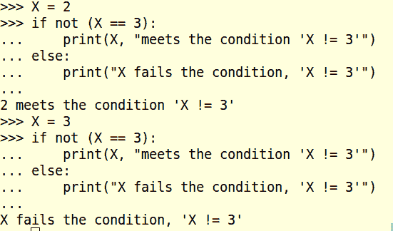

# 查看 while 循环结构

`while`循环由真/假选择点显式启动和停止。这些可能看起来非常复杂，但它们解决了单一条件下的有限测试集：

```
X = 0 
Y = 20 
while (X != Y): print (X), X = X + 1 
```

这个 Python 3 循环将反复打印`X`的值，直到它达到 10，然后停止。如果我们说`while X < Y`，它的工作原理将完全相同，因为循环结构在增加时正在测试`X`。一个更复杂的循环，使用一个随机数作为 incrementor 元素，可能会持续更长的时间（或者不会），然后随机命中一个相当于`Y`的值`X`：


很明显，程序每次都在测试循环条件。下面是一个使用该随机`X`值的示例。首先选择`X`值，然后运行`print (X)`命令两次。因为`X`在第一行中只设置了一次，所以在两个打印命令中没有改变。当`X`的值被重置时，它打印了一个不同的值。条件是`X`不等于`Y`。我们将`Y`的值设置为几行，因此不需要重置它来运行此示例。`X`只返回一次的原因是第二次通过时，`X`被随机设置为`11`。从随机抽奖中被设置为`11`的几率是 11 分之一，这比你赢得强力球彩票的几率大得多：


如果我们再次运行循环，它可能会运行更多次，因为它会随机避免一个与`Y`相等的值`X`。同样，它不会打印`X = 11`的值，因为`while`循环条件排除了这一点：

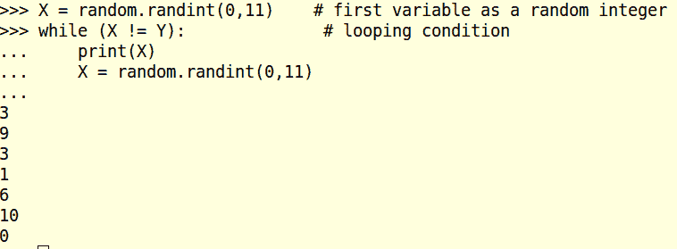

# 回顾 for 循环结构

`for`循环不需要递增，因为它将范围构建到条件中，这与`while`循环不同，后者只包含一个极限，超过该极限循环将无法运行。使用 Python 表示法，下面的代码显示了如果以`X`值`0`和 1 到 11 的范围开始，会发生什么。`X`的预设值对于`for`循环迭代并不重要。它将所有值应用于其测试的`X`：


我们从`X`设置为`100`开始，但`for`循环根据自身条件取`X`值：

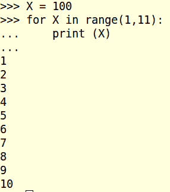

如果您确实希望`X`保持不变，可以将其用作不同范围的基础，如下所示：

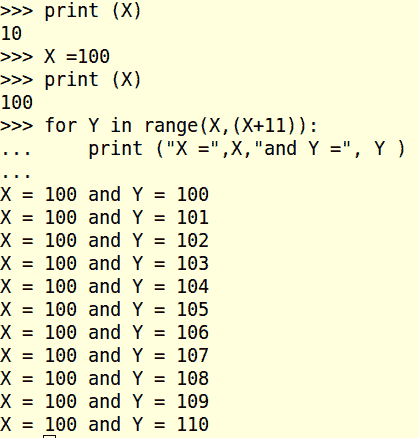

# 理解决策点

`if`结构是一个二元决定：是或否。墙上的灯开关是 if 结构的一个物理示例。如果开关处于一个位置，则指示灯点亮；如果开关处于另一个位置，则指示灯熄灭：


案例结构是一种决策结构，有多个正确答案，多个是，而不是一个否。这方面的一个例子可能是一个带有三种口味巧克力、草莓和香草的冰淇淋分配器。如果你不想要冰激凌，你甚至不去接近机器。您有三个选择，它们都是正确的：


# 实践逆向工程

由于知道输入和输出不能保证为您提供要进行反向工程的应用程序的内部构造的真实情况，因此让我们来看一些来自 Kali Linux 的有用实用程序，它们可能会使反向工程变得更简单。我们将介绍三个调试器、一个反汇编工具和一个杂项反向工程工具。

我们将展示两个基于 Linux 的调试器**Valgrind**和**EDB 调试器**的使用情况和输出，然后展示仅 Windows 调试器**OllyDbg**的类似输出。

反汇编程序是**JAD**，它是一个 Java 反编译程序：


# 使用调试器

什么是调试？创造这一术语的荣誉常常被错误地归因于格雷斯·霍珀上将，当时她的团队成员发现一只物理的（但已死亡的）飞蛾卡在哈佛大学 Mark II 计算机的继电器中。这个术语实际上可能来自托马斯·爱迪生（Thomas Edison），正如他所提到的，并将其定义为*小错误和困难*。在软件开发中，错误通常是逻辑错误，而不是代码中的印刷错误。输入错误通常会阻止代码编译，因此它们不会离开开发人员的实验室。逻辑错误不会阻止程序编译，但它们可能会导致输出失败或程序启动时出现意外行为。另一个经常与**bug**同义的词是**缺陷**。**项目中的技术债务**是指项目中未修复的缺陷数量。不同的项目经理对未修复的 bug 有不同的容忍度。许多恶意软件包在其发布的版本中都有一些显示停止错误，但最近一些更复杂的恶意软件包似乎技术债务非常低。

调试器允许您逐步观察应用程序的行为。您可以看到哪些内容被放入内存，进行了哪些系统调用，以及应用程序如何提取和释放内存。我们使用调试器的主要原因是检查我们可以访问源代码的程序的行为。原因是，我们最有可能调试的程序是在我们自己的研讨会上编写的代码。这并不完全构成一个代码安全审计，但它可以帮助发现程序在哪里泄漏内存，以及它清理已用内存的效果如何。如果以这种方式启动，许多程序会在命令行上显示状态报告，这些是内部调试信息。这可以在应用程序发布后进行清理，但在大多数用例中，最终用户从未看到过任何内容。

# 使用 Valgrind 调试器

程序通常从可用的总 RAM 中保留内存。我们发现在命令行上调试有用的一个程序是`valgrind`，它不在默认的 Kali 安装中。当我们发现需要进行初步调试时，我们会添加它。例如，曾经有一个版本的[http://www.openoffice.org/ 免费的开源 office 套件](http://www.openoffice.org/)在 Linux 中有一个允许安装的 bug，但未能运行该程序。它只是在最初的启动屏幕显示时突然出现。运行以下命令表明它正在查找一个不存在的文件。我们不只是发送一个 bug 报告，并希望将一个解决方案作为补丁添加到源代码中，而是将缺少的文件作为一个空白文本文件添加。这允许 OpenOffice 启动。OpenOffice 开发人员后来添加了一个补丁，删除了这个 bug，但我们不必等待。以下是在文本编辑器`gedit`上运行测试的命令行代码，作为`valgrind`的一个示例：

```
valgrind -v --log-file="gedit-test.txt" gedit  
```

当程序被封装在调试器中时，启动程序需要更长的时间，并且整个输出都将进入指定的日志文件。一旦程序打开，您可以通过在命令行上按*Ctrl*+*C*关闭程序，或者如果被测应用程序有 GUI 界面，您可以关闭窗口，并且`valgrind`会在看到被测应用程序关闭后关闭。

在本例中，调试器有 600 多行输出，您需要使用更友好的调试器来查找更多有用的信息。请记住，gedit 是一个非常成熟的程序，每次我们使用它编辑文本文件时，它都能完美地工作，在打开 gedit、键入几个字符和关闭而不保存新文档的不苛刻用例中，它仍然有`valgrind`指出的 24 个内存错误：


# 使用 EDB 调试器

EDB 调试器是名为 Olly 调试器的 Windows 应用程序的一个版本。EDB 调试器具有以下功能：

*   开发人员称之为直观的 GUI 界面
*   标准调试操作（步进/步过/运行/中断）
*   更不寻常的条件断点
*   作为插件实现的调试核心（您可以插入替换核心插件）
*   某些平台可能有几个可用的调试 API，在这种情况下，您可能有一个插件来实现其中的任何一个
*   基础教学分析
*   查看/转储内存区域
*   有效地址检查
*   “数据转储”视图是选项卡式的，允许您同时打开多个内存视图，以便快速切换
*   它允许导入和生成符号映射
*   具有扩展可用性的插件

EDB Debugger 设计用于调试 Linux 应用程序，我们将使用 EDB Debugger 查看同一个应用程序 gedit。GUI 界面显示以下内容：

*   正在测试的应用程序和标题栏中的进程 ID
*   内存位置
*   命令
*   通用二进制命令映射
*   书签：代码中的兴趣点
*   为数据预留的寄存器（特别是 2/3 中的标记行）
*   数据转储：内存位置和内容
*   内存堆栈数据

可以在以下屏幕截图中看到 GUI：


# EDB 调试器符号映射器

EDB 调试器可以通过以下命令行条目为您提供符号映射：

```
edb --symbols /usr/bin/gedit > gedit.map 
```

符号表映射程序中的函数、行或变量。对于 gedit，符号表如下所示：

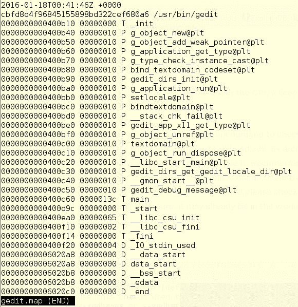

# 运行 OllyDbg

如果您正在运行 64 位版本的 Kali Linux 2.0，则首先需要更新 Kali。它缺少 32 位的 wine 基础设施，wine 甚至不想在没有它的情况下启动。幸运的是，Kali Linux 提供了一条有用的错误消息。您只需复制错误消息的引用部分并运行它：


OllyDbg GUI 窗口看起来确实很像 EDB 调试器，尽管它在图形上有点难看。我们正在研究`notepad.exe`，它是一个仅限 Windows 的编辑器，类似于 gedit 的精简版。该窗口分为以下几个部分：

*   正在标题栏中测试的应用程序
*   内存位置
*   符号映射
*   命令
*   登记册
*   数据转储：内存位置和内容
*   内存堆栈数据

打开可执行文件（EXE、PIF 或 COM）时，将显示整个正在运行的程序：

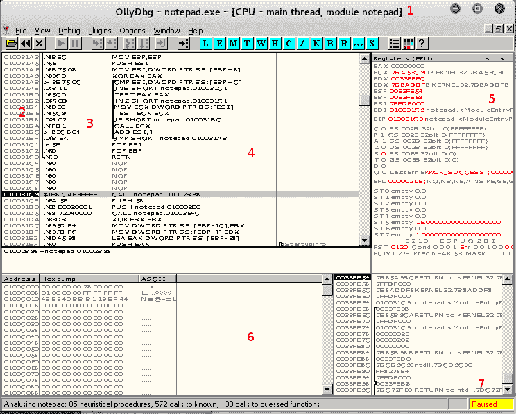

您可以选择在目标 Windows 计算机上运行 OllyDbg，通过将文件夹复制到闪存驱动器并将闪存驱动器带到受感染的计算机上来查看正在进行的感染。您也可以将 Kali Linux 安装到可引导闪存驱动器上，正如我们在[第 1 章](01.html)*中提到的，选择您的发行版*，并直接在受感染的机器上运行 Kali。

# 反汇编程序简介

反汇编程序获取已编译的二进制代码并显示汇编代码。这与调试器可以显示的内容类似。

# 运行 JAD

JAD 是 Kali Linux 附带的 Java 反编译器，它似乎是分析来自网页的潜在危险 Java 小程序的有用工具。它最大的问题是自 2011 年以来一直没有维护人员，因此很难找到，除了在 Kali 存储库和 Tomas Varaneckas 的博客页面上，*Jad 反编译器下载镜像*（[http://varaneckas.com/jad/](http://varaneckas.com/jad/) ）。

以下是 JAD 帮助文件中的一个页面，您可以从主菜单或在命令行中键入`jad`来访问该页面：

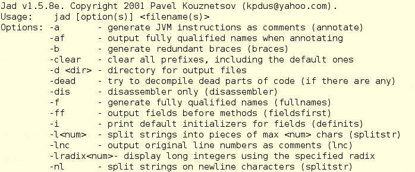

关于使用`jad`的简单示例，我们为您创建了一个 Java 类。以下三个插图是对以下内容的说明

1.  原始源代码（并非始终可用）
2.  运行`jad`
3.  反编译源

下面是一个小 Java 类的源代码：


应用程序正在运行。我们展示了使用内联帮助（键入问号而不是其中一个字母选项）来显示可用详细程度的结果。然后我们选择了`a`，并且`jad`重写了源代码。当您只有已编译的类时，这不会是一个问题：


最后，这里是反编译的源代码：


# 使用 Capstone 创建自己的反汇编代码

Capstone 反编译引擎维护良好，并且有一个简单的 API。基本的 Capstone 库是 Kali Linux 上的默认库，您可以使用熟悉的任何语言构建自己的前端。我们正在使用 Python，因为它是我们的脚本语言。使用`aptitude search <keyword>`命令结构，您可以确保您拥有可用的包，并且可以查看包的状态。在这种情况下，您可以看到第一列中的`p`表示有可用的包，`i`表示已安装。第二列中的`A`显示该软件包是自动安装的，可能是其他软件包的依赖项。我们选择`install libcapstone-dev`作为我们在 Kali 实例上使用的 64 位体系结构，以防我们想要定制 Capstone 的行为。使用“顶石”不需要这样做：


下面是一个基于[示例的简单反汇编程序脚本 http://www.capstone-engine.org/lang_python.html](http://www.capstone-engine.org/lang_python.html) 。这可以自动化得多，但为了本例的目的，十六进制代码被硬编码到脚本中：


# 一些杂项逆向工程工具

在 Kali Linux 1.x 菜单中列出了一大类杂项反向工程工具，但在 Kali Linux 2.0 菜单中没有分类。我们将向您展示一套由 Radare2 领导的集成工具，而不是随机挑选其中的几个。

# 运行雷达 2

您可以通过单击反向工程下的菜单链接启动 Radare2。现在您可能更熟悉命令行，因此您可能希望直接在命令行中打开它。通过键入键盘快捷键*Alt*+*F2*打开命令行启动器。然后，以下命令在新的终端窗口中打开程序的帮助文件：

```
bash -c "radare2 -h" #  this makes sure that you are opening the bash 
 shell  
                     #  rather than some other possible default shell  
                     #  like the dash shell 
```

让我们为您分解此命令：

*   `bash`打开一个 Bash shell。
*   `-c`指示 dash 读取命令字符串，该字符串以双引号跟随，而不是等待键盘的标准输入。
*   `radare2`是我们正在打开的应用程序。
*   `-h`是在终端窗口中打开帮助文件（如果存在）的选项。`--help`是该选项的长形式（几乎每个 Linux 命令行工具都有这些选项）。

Radare2 是一种高级命令行十六进制编辑器、反汇编程序和调试器。雷达 2（[http://radare.org](http://radare.org) 表示 Radare2 是一种便携式倒车框架，具有以下特点：

*   分解（并组装）许多不同的体系结构
*   使用本地和远程调试器（gdb、rap、webui、r2pipe、winedbg 和 windbg）进行调试
*   在 Linux、*BSD、Windows、OSX、Android、iOS、Solaris 和俳句上运行
*   对文件系统和数据进行取证
*   用 Python、JavaScript、Go 等编写脚本
*   支持使用嵌入式 web 服务器进行协作分析
*   可视化几种文件类型的数据结构
*   修补程序以发现新功能或修复漏洞
*   使用强大的分析功能加快反转速度
*   软件开发中的辅助工具


Radare2 是与十个插件和其他几个应用程序集成的框架的尖端。为了保持 PG 评级，我们模糊了最后一个插件名称：


# Radare2 工具套件的其他成员

我们将在以下部分讨论 Radare2 工具套件的其他成员。

# 运行 rasm2

rasm2`/usr/bin/rasm2`是一个用于多种体系结构的命令行汇编/反汇编程序，例如 Intel x86 和 x86-64、MIPS、ARM、PowerPC、Java 和 MSIL。当 JAD 不再可用时，这可能是您拆卸的目标：

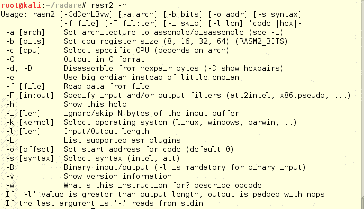

# 运行 rahash2

RAHASH2 是一个基于块的散列工具，它支持许多算法，例如 MD4、MD5、CRC16、CRC32、Sh1、Sh256、Sha38、Sh512、PAR、XOR、XORION、MOD255、HAMDIST 和熵。您可以使用`rahash2`检查文件、内存转储和磁盘的完整性并跟踪其更改：


以下是测试小文件的 sha256 哈希的示例：


# 运行半径 2

radiff2 是一个二进制实用程序，它使用各种算法来比较文件。它支持二进制文件的字节级或增量比较，以及代码分析比较，以发现`radare`代码分析产生的代码块中的更改。下面是一个在几秒钟内比较`/var/log/message`日志两种状态的测试。这是位级别的比较，用于随机变化：

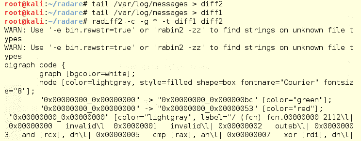

# 运行 rafind2

rafind2 设计用于搜索文件中的模式。在下面的示例中，`rafind2 -s "string searched" <file>`显示了我们在搜索已知存在且已知不存在的字符串时可以看到的内容：


# 运行 rax2

rax2 是命令行的数学表达式计算器。您可以执行许多转换操作，包括用于在浮点值、十六进制表示、十六进制对字符串到 ASCII、八进制到整数等之间进行基转换的操作。它还支持 endianness 设置，如果未提供任何参数，则可以用作交互式 shell：


以下是一些使用 rax2 的转换示例：

*   十进制到十六进制
*   十六进制到十进制
*   八进制到十六进制
*   散列两个字符串
*   散列单个字符串


# 压力测试窗口

接下来，让我们看看一些工具，它们会让你的 Windows 机器大哭一场。对一个系统进行压力测试可以告诉你你的机器和网络将承载多少负载。这里有一个你也可以做的小实验。在 Windows 机器上设置一个服务，在 Linux 机器上设置相同类型的服务，看看哪一个可以更好地处理负载。你会对结果感到惊讶。结果可能会让你问*为什么我会首先使用 Windows？*

**Hacker's tip**:
Use Linux as your daily driver OS—I do!

# 处理否认

**ATK6-Denial6**是一款 IPv6 网络压力测试仪，它将数据包发送到目标主机，并将数据包提交给目标主机。这是 ATK6-Denial6 的帮助文件：


以下屏幕截图是易受攻击的 Windows 7 目标计算机的`nmap -A`读数。我们想知道它是否有开放的端口，以及它们是哪些端口。我们可以看到，`139`、`445`、`2869`、`5357`和`10243`端口是开放的。此工具的最大问题是测试网络是 IPv4：

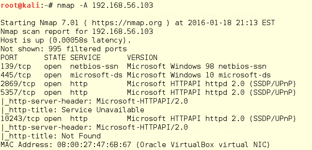

让我们找到一个可以攻击 IPv4 网络的工具。

# 围攻网络

围城是一个网络压力测试仪。Sakege 是一个多线程 HTTP 负载测试和基准测试实用程序。它的设计目的是让 web 开发人员在压力下测量代码的性能。它允许您使用可配置数量的并发模拟用户访问 web 服务器。

正是这些用户将 web 服务器*置于围攻*之下。绩效指标包括以下内容，在每次运行结束时进行量化和报告：

*   经过的时间
*   传输的数据总量
*   服务器响应时间
*   交易率
*   吞吐量
*   并发性
*   正常返回计数

它们的意义和意义将在后面讨论。围城基本上有三种运作模式：

*   回归（被轰炸调用时）
*   网络模拟
*   蛮力

使用围城的格式如下：

*   `siege [options]`
*   `siege [options] [url]`
*   `siege -g [url]`


围城模拟了 15 名用户在 Windows7 目标机器上访问该网站。总的来说，演出并没有那么糟糕。在四分钟半的时间里，该网站有 8072 次点击。Windows 7 目标系统保持了 100%的可用性，响应时间超过 1/100 秒。

# 配置攻城引擎

如果我们把围攻人数增加到 10000 人，你认为会发生什么？配置为`at /usr/bin/siege.config`。当我们在命令行上运行它时，它告诉我们在`/root/siegerc`上已经有一个本地配置文件，所以让我们来看一下：


要编辑`/root/.siegerc`，我们可以使用命令行或 Run Launcher（*Alt*+*F2*输入我们最喜欢的文本编辑器的名称。在这里，我们将使用 gedit，所以输入 gedit`/root/.siegerc`。或者，我们可以在`Usual Applications`/`Accessories`文件夹中找到 gedit，打开文件打开对话框，打开隐藏文件，然后在`/root`目录中找到`.siegerc`。您可能已经开始了解 Linux 管理员如此喜欢命令行的原因。

在配置文件的`162`行，您将找到并发用户的数量。当前默认值为`15`，但我们将其更改为 10000。让我们看看能不能搞定这个孩子：


在强制关闭 Kali 实例之后，让我们用更少的围攻者来尝试它。并发用户数量越多，您的 Kali 机器上使用的 RAM 也越多：


使用 625 名围攻者，我们在不撞坏试验机的情况下获得了可靠的结果。在这期间，我们测试了 5000、2500 和 1250 台，但它们都使机器崩溃。如果你有乐趣，你可以测试更高的数字，比如 940、1090 等等。测试机上可用的资源将决定你可以雇佣多少围攻者。

# 总结

对于复杂应用程序的实际代码，不太可能通过逆向工程获得明确的答案，因为有许多方法可以通过循环或选择结构实现相同的输出。通过测试几个输入，更容易得到输入可能处理的统计列表。通过查看**EDB 调试器**或**OllyDbg**的汇编代码输出，您可能会获得更多详细信息。您可能已经注意到，Linux 和 Windows 应用程序的汇编代码基本相同。诸如 C 和 C++之类的高级语言只是获取汇编代码的方法，可以容易地转换成机器代码，告诉机器该做什么。

压力测试您的 Windows 主机归结为检查它们在短时间内在任何开放端口上接收许多输入的能力。记住，当压力测试时，你会在网络上制造大量噪音，任何配置正确的入侵检测工具都会注意到你的攻击。您还可能使目标计算机脱离网络，因此您最好在开始测试之前通知管理层。

由于这是最后一章，我们希望您喜欢这本书，我们希望您已经学到了一些东西，以便更好地理解 Windows 操作系统的渗透测试和利用。

谢谢你读这本书。

# 进一步阅读

*   **更多关于 Radare2 工具套件的阅读**：[https://rada.re/r/](https://rada.re/r/)
*   **雷达 2 备忘单**：[https://github.com/pwntester/cheatsheets/blob/master/radare2.md](https://github.com/pwntester/cheatsheets/blob/master/radare2.md)
*   **有关 EDB 调试器的详细信息**：[https://github.com/eteran/edb-debugger](https://github.com/eteran/edb-debugger) 和[http://codef00.com/projects](http://codef00.com/projects)
*   **有关 OllyDbg**[的更多信息 http://www.ollydbg.de/](http://www.ollydbg.de/)
*   **更多关于顶石**：[http://www.capstone-engine.org/lang_python.html](http://www.capstone-engine.org/lang_python.html)