# 撰写报告

在本章中，我们将介绍以下配方：

*   使用 Dradis 生成报告
*   使用 MagicTree

# 介绍

在本章中，我们将介绍 pentesting 项目最重要的步骤之一，即报告。一份好的报告必须包含漏洞的每一个细节。我们的日程安排是尽可能详细，这可能有助于部门中合适的人了解所有细节，并用一个完美的补丁解决问题。

创建 pentesting 报告有不同的方法。在本章中，您将学习一些工具，我们可以使用这些工具创建一个涵盖所有细节的良好报告。

让我们看一下报告中应始终包含的一些关键点：

*   漏洞的详细信息
*   CVSS 分数
*   缺陷对组织的影响
*   修补错误的建议

**通用漏洞评分系统**（**CVSS**是一种标准化的方法，用于评估 IT 漏洞并确定响应的紧迫性。

有关 CVSS 的更多信息，请访问[https://www.first.org/cvss](https://www.first.org/cvss) 。

# 使用 Dradis 生成报告

Dradis 是一个基于浏览器的开源应用程序，可用于组合不同工具的输出并生成报告。它非常容易使用，并预装了 Kali。但是，运行它可能会显示错误。因此，我们将重新安装它，然后学习如何使用它。

# 怎么做。。。

以下是使用 Dradis 的方法：

1.  首先，我们需要通过运行以下命令来安装依赖项：

```
 apt-get install libsqlite3-dev
 apt-get install libmariadbclient-dev-compat 
 apt-get install mariadb-client-10.1
 apt-get install mariadb-server-10.1
 apt-get install redis-server
```

2.  然后，我们使用以下命令：

```
 git clone https://github.com/dradis/dradis-ce.git  
```

以下屏幕截图显示了前面命令的输出：


3.  然后，我们更改目录：

```
        cd dradis-ce/
```

4.  现在，我们运行以下命令：

```
 bundle install --path PATH/TO/DRADIS/FOLDER  
```

以下屏幕截图显示了前面命令的输出：


5.  我们运行以下命令：

```
        ./bin/setup   
```

6.  要启动服务器，请运行以下命令：

```
        bundle exec rails server  
```

以下屏幕截图显示了前面命令的输出：


7.  我们现在可以在`https://localhost:3000`上访问 Dradis。

8.  在这里，我们可以设置访问框架的密码，并使用密码登录：

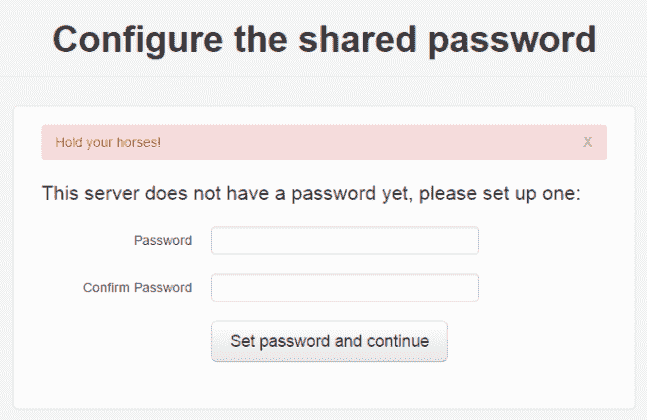

9.  我们将被重定向到仪表板：

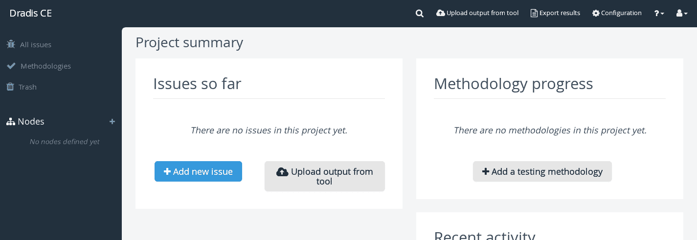

10.  Dradis 的免费版本支持各种工具的插件，如 Nmap、Acunetix 和 Nikto。

11.  Dradis 允许我们创建方法。可将其视为检查表，在为组织执行 pentest 活动时可使用该检查表：

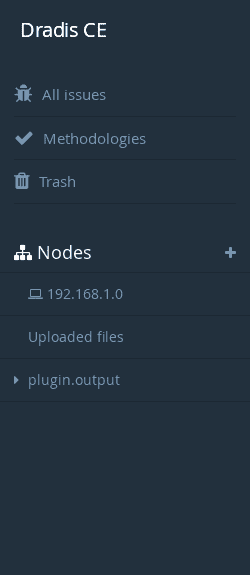

12.  要创建检查表，请转到“方法”并单击“添加新内容”：


13.  然后，我们指定一个名称并单击“添加到项目”：


14.  现在我们应该看到为我们创建的示例列表。我们可以通过单击右侧的编辑按钮进行编辑：

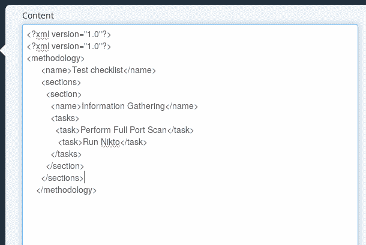

15.  这里，我们看到列表是用 XML 创建的。我们可以通过单击更新方法来编辑和保存它：


16.  现在让我们看看如何更好地组织扫描报告。我们转到左侧菜单上的节点选项并单击+符号；将打开一个弹出框，我们可以添加网络范围，然后单击添加：


17.  要添加新的子节点，我们从左侧窗格中选择节点，然后选择添加子节点选项。这可用于根据主机的 IP 地址组织基于网络的活动。

18.  接下来，我们可以添加注释和屏幕截图，作为我们发现的 bug 的 PoC：


19.  我们甚至可以将各种工具的结果导入 Dradis。这可以通过从顶部菜单中选择 Upload Output from tool（从工具上载输出）来完成：


20.  在这里，我们上传输出文件。Dradis 具有内置插件，可以解析不同工具的报告：

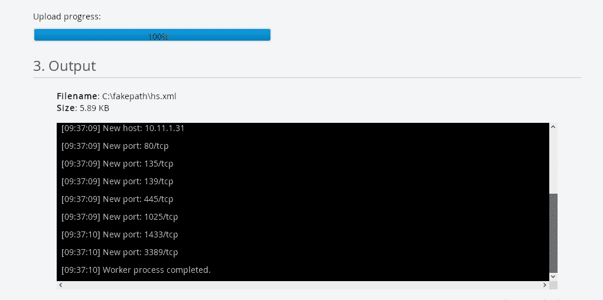

21.  导入完成后，我们将在左侧窗格的标题`plugin output`下看到结果：

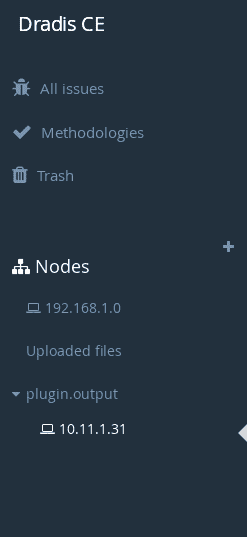

22.  我们可以看到刚刚导入的扫描结果的输出：

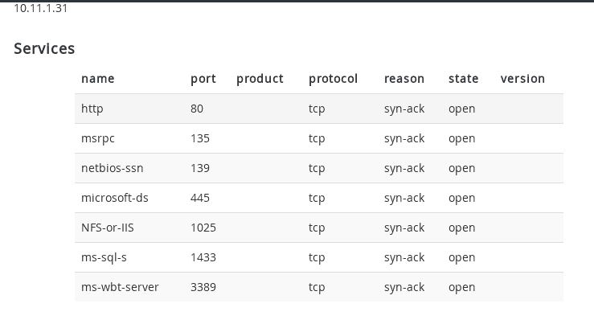

23.  类似地，不同的扫描可以导入并组合在一起，并且可以使用 Dradis 框架导出为单个报告：

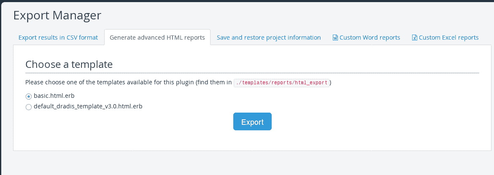

有关 Dradis 的更多信息，请访问官方网站[https://dradisframework.com/](https://dradisframework.com/) 。

# 使用 MagicTree

MagicTree 是一种类似于 Dradis 的数据管理和报告工具。它预先安装在 Linux 上，并使用树和节点结构组织所有内容。它还允许我们执行命令并将结果导出为报告。在本食谱中，我们将介绍使用 MagicTree 可以做的一些事情，以简化我们的 pentesting 任务。

# 怎么做。。。

以下是使用 MagicTree 的方法：

1.  我们可以从应用程序菜单运行它。
2.  我们接受条款，申请将开放：


3.  接下来，我们通过转到节点|自动创建来创建一个新节点：


4.  在打开的框中，我们键入要添加的主机的 IP 地址。
5.  添加节点后，它将显示在左侧窗格中：


6.  要在主机上运行扫描，我们转到表视图；在底部，我们将看到一个名为 Command 的输入框：

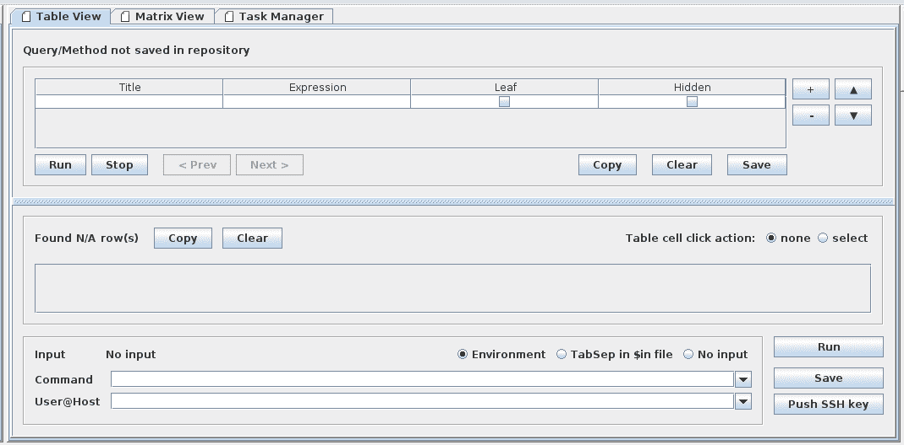

7.  我们将在刚才添加的主机上运行 Nmap 扫描。
8.  MagicTree 允许您查询数据并将其发送到 shell。我们点击 Q*按钮，它会自动为我们选择主机：

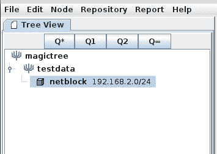

9.  现在我们只需要键入以下命令：

```
        nmap -v -Pn -A -oX $results.xml $host  
```

以下屏幕截图显示了前面命令的输出：


10.  由于主机已经被识别，我们不需要在这里提及它们。然后，单击运行：


11.  我们将看到一个窗口，显示正在执行的扫描以及输出。一旦扫描完成，我们可以点击导入，它将被导入到工具中。
12.  同样，我们可以运行任何其他工具并将其报告导入 MagicTree。我们可以通过导航到 report 生成报告|生成报告…：

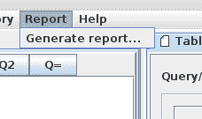

13.  在下一个窗口中，我们可以浏览要用于保存报告的模板列表：

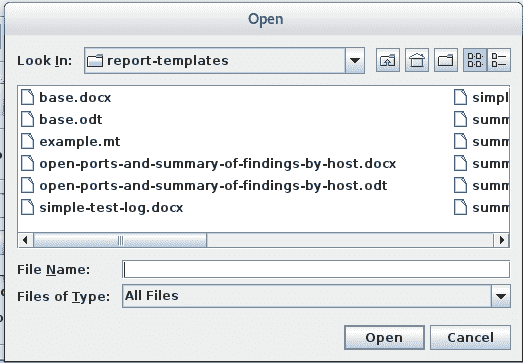

14.  然后，单击生成报告按钮，我们将看到正在生成的报告：


# 还有更多。。。

还有其他工具可用于生成报告，例如：

*   **塞尔皮科**：[https://github.com/SerpicoProject/Serpico](https://github.com/SerpicoProject/Serpico)
*   **Vulnreport**：[http://vulnreport.io/](http://vulnreport.io/)