# 三、网络漏洞评估

在本章中，我们将介绍以下配方：

*   使用 nmap 进行手动漏洞评估
*   将 nmap 与 Metasploit 集成
*   使用 Metasploit 演练 Metasploitable 评估
*   基于 OpenVAS 框架的漏洞评估

# 导言

之前，我们讨论了通过网络发现实时服务器以及服务枚举。在这里，我们将讨论什么是漏洞评估。漏洞评估是一个测试人员旨在确定端口上运行的服务并检查它们是否有漏洞的过程。漏洞被利用时可能导致未经验证的访问、拒绝服务或信息泄漏。漏洞评估非常重要，因为它为我们提供了被测试网络安全的整体画面。

在本章中，我们将检查在开放端口上运行的服务是否存在漏洞。了解服务运行的操作系统至关重要，因为它是涉及远程代码执行的漏洞发现侦察的关键因素之一。原因是，由于体系结构的不同，不同操作系统上的相同服务将具有不同的利用率。让我们谈谈一个漏洞：SMB 服务，根据 MS08-067 netapi 漏洞，该服务存在漏洞。此漏洞在旧的 Windows 系统上持续存在，但在新的 Windows 系统上则不存在。例如，Windows XP 易受此攻击；然而，WindowsVista 并不是因为它被修补了。因此，如果要发现任何漏洞，那么在开放端口上提供系统正在运行的操作系统和 service pack 版本以及服务的映射非常重要。在本章中，我们将学习检测目标 IP 漏洞的不同方法。

# 使用 nmap 进行手动漏洞评估

到目前为止，nmap 显然在 IP 发现中起着非常重要的作用。Nmap 还具有漏洞评估功能，该功能通过**Nmap 脚本引擎**（**NSE**实现。它允许用户运行漏洞检测脚本。NSE 包含一组非常大的脚本，范围从发现到利用。这些脚本可在`nmap`文件夹中找到，并按其类别进行分隔。通过阅读位于`nmap`文件夹中的`scripts.db`文件，可以更好地理解这些类别。但是，在本章中，我们将仅限于漏洞检测。

## 准备好了吗

为了开始本章，我们将使用 nmap 检查位于 nmap 中`scripts`文件夹下的 NSE 脚本。出于演示目的，我们将使用 Metasploitable 2 和 Windows XP SP1。

## 怎么做。。。

此配方的步骤如下所示：

1.  We should first see where the NSE scripts are located. Type the following command:

    ```
    ls /usr/share/nmap/scripts/

    ```

    输出将如以下屏幕截图所示：

    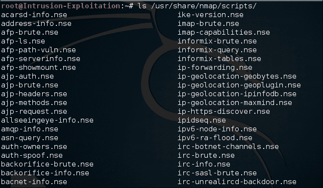

2.  In order to understand all the different categories that these scripts belong to, type:

    ```
    cat /usr/share/nmap/scripts/script.db | grep "vuln"

    ```

    输出将如以下屏幕截图所示：

    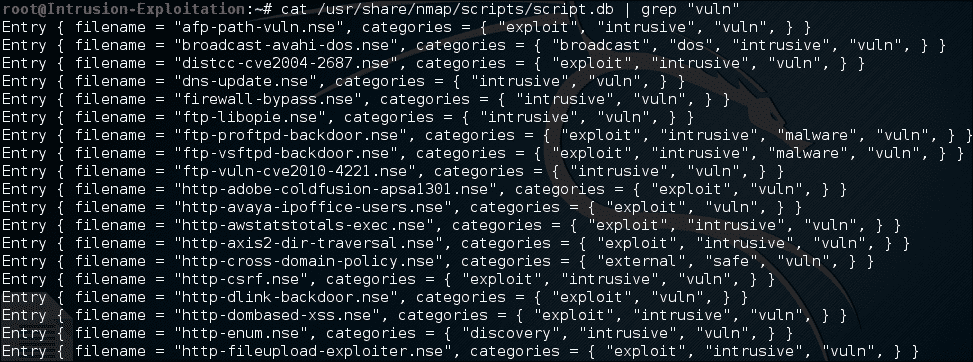

3.  您可能会从前面的屏幕截图中注意到有一个名为`vuln`的类别。我们将主要针对这一类别开展工作。要运行简单的`vuln`类别扫描，请在终端窗口上使用以下命令：

    ```
    nmap -sT --script vuln <IP Address> 

    ```

4.  Let's say we want a quick assessment of just a few sets of ports. We can run a port-based `vuln` assessment scan:

    ```
    nmap -sT -p <ports> --script vuln <IP Address>

    ```

    输出将如以下屏幕截图所示：

    

    我们可以看到，它揭示了很多信息，并向我们展示了许多可能的攻击载体；它甚至检测到 SQL 注入存在潜在的攻击：

    

5.  Let's say we want to know the detail of what the script category `vuln` does. We can simply check that by typing the following command in the terminal:

    ```
    nmap --script-help vuln

    ```

    输出将如以下屏幕截图所示：

    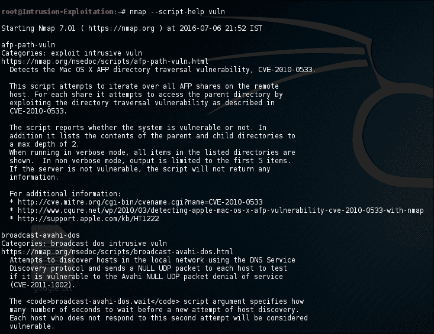

6.  Let's check whether the remote machine that is running is vulnerable to SMB. We first find out whether the SMB port is open:

    ```
    nmap -sT -p 139,445 <IP address>

    ```

    输出将如以下屏幕截图所示：

    

7.  Once we detect that the port is open, we run an `smb` vulnerability detection script, shown as follows:

    ```
    nmap -sT -p 139,445 --script smb-vuln-ms08-067 <IP address>

    ```

    输出将如以下屏幕截图所示：

    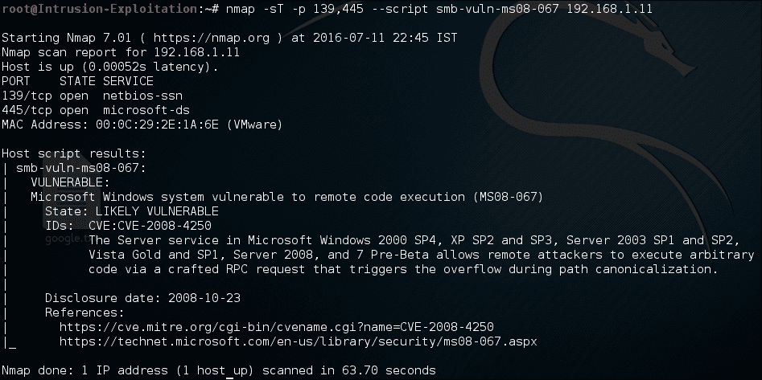

    因此，可以使用 nmap 中可用的各种脚本（类别为`vuln`）对目标 IP 进行评估，并根据运行的端口和服务发现漏洞。

## 它是如何工作的。。。

理解所有参数相当容易；我们一直在玩弄 NSE 引擎中可用的脚本。让我们了解此方法中使用的一些命令：

*   `scripts.db`文件包含所有 NSE 分类信息，用于指定哪些脚本可被视为特定类型的漏洞。有不同的类别，如`auth`、`broadcast`、`brute`、`default`、`dos`、`discovery`、`exploit`、`external`、`fuzzer`、`intrusive`、`malware`、`safe`、`version`和`vuln`。
*   在前面的示例中，我们为脚本运行了一个带有`vuln`参数的`nmap`命令。我们只是简单地指示 nmap 使用`vuln`类别并运行`vuln`下的所有脚本。

### 注

对此的扫描需要很长时间，因为它将在许多检测到的开放端口上运行许多漏洞评估。

*   有一次，我们为`vuln`类别扫描指定了一个额外的端口参数。这只是确保脚本只针对指定的端口而不是其他端口运行，从而节省了大量时间。
*   `--script-help <filename>|<category>|<directory>|<expression>|all[,...]`命令是 NSE 引擎的帮助功能。`help`命令应始终伴随 NSE 脚本的类别、特定文件名或表达式。例如，要检查所有与 SMB 相关的帮助，只需使用表达式`*smb*`。
*   在`--script-args=unsafe=1`命令中，`script-args`语法类似于要传递给我们刚刚选择的脚本的附加参数；在这个场景中，我们将传递一个附加的`unsafe`参数，该参数的值为`1`，表示脚本有权运行可能导致服务崩溃的危险脚本。

## 还有更多。。。

我们已经学会了如何使用 NSE 进行漏洞评估。`script-args`参数用于许多目的，例如提供用户名和密码文件，指定给定服务的凭据，以便 NSE 可以提取信息、后身份验证等。建议这样做，以便您对`script-args`功能有更深入的了解。

## 另见。。。

*   更多信息可在 NSE 文档[中找到 https://nmap.org/book/nse-usage.html](https://nmap.org/book/nse-usage.html) 。

# 将 nmap 与 Metasploit 集成

仅使用 nmap 执行漏洞评估是不够的，因为漏洞数量日复一日地不断增加。一个月内报告了许多漏洞，因此建议您使用多个漏洞扫描工具。在前一章中，我们了解了如何将 nmap 扫描的输出导出到 XML 文件；在这里，我们将学习如何将 nmap 输出与 Metasploit 集成以进行漏洞评估。

## 准备好了吗

我们必须首先在 Kali Linux 机器上设置和更新 Metasploit。

需要注意的一点是，出于演示目的，我们在 Windows 操作系统中添加了更多服务，以便更好地理解活动，因为默认情况下，只有少数端口显示为打开状态。为了准备该活动，我们在 Windows 计算机上执行扫描，并为该计算机保存 XML 输出。

## 怎么做。。。

1.  We will first save the nmap XML file for the Metasploitable 2 server using the following command:

    ```
    nmap -sT -oX Windows.xml <IP Address>

    ```

    该文件将保存在终端的当前工作目录中。

2.  In order to start Metasploit, we will start the services involved in the Metasploit program. We will start the Postgres SQL service and the Metasploit service. To do this, use the following command:

    ```
          service postgresql start
          service metasploit start

    ```

    输出将如以下屏幕截图所示：

    

3.  Once the service is started, we'll start Metasploit by entering the following in the command line:

    ```
    msfconsole

    ```

    输出将如以下屏幕截图所示：

    

4.  First, we will import the nmap scan into Metasploit. To do so, enter the following command:

    ```
          db_import /root/Windows.xml
          db_import <path to the file>

    ```

    该命令从指定路径导入文件。确保保留一个便笺，以便从读取器存储文件的路径导入。

    

5.  Once the import is successful, we will search for the IP running the SMB service, using the following command in Metasploit:

    ```
    Services -p 445 -R

    ```

    其输出如下所示：

    

6.  Now that we have found that there is a port of interest, we will try to dig deeper. Let's try to display the SMB shares. Enter the following in the Metasploit console:

    ```
    use auxiliary/scanner/smb/smb_enumshares

    ```

    输出将如以下屏幕截图所示：

    

7.  In order to list the available shares, we will run the scanner auxiliary module. Simply type `run` or `exploit` in the Metasploit console; both commands work for the job.

    输出将如以下屏幕截图所示：

    

8.  As we can see, we were able to receive the details of one IP address. Let's look a little closer at the live host. We will try to enumerate the type of pipe auditors available for this host. Type the following in the Metasploit console:

    ```
    use auxiliary/scanner/smb/pipe_auditor

    ```

    命名管道用作通信的端点；它是客户端和服务器之间的逻辑连接；`smb`名称管道与服务器消息 blog 的连接相关。如果我们幸运的话，我们可能能够检索到像可用的公共共享这样的信息。

    完成后，可以检查是否正确输入了所有参数。由于在检查攻击利用漏洞之前必须输入几个选项卡，因此可以使用以下命令：

    ```
          show options
          run

    ```

    应该是这样的：

    

9.  After checking online for any vulnerability on the given port, it was found that SMB shares are vulnerable to `ms08_067_netapi` attacks for all Windows versions earlier than Windows XP Service Pack 2\. Let's try and find out if our live host is vulnerable to this attack. Enter the following to load the `ms08_067_netapi` module in the Metasploit window:

    ```
    use exploit/windows/smb/ms08_067_netapi

    ```

    要检查 IP 是否易受攻击，请使用`check`命令，您将获得输出，说明它是否可以成为成功的攻击向量：

    

    正如您所看到的，目标是易受攻击的。

## 它是如何工作的。。。

如您所见，我们首先将 nmap 结果导入 Metasploit。当我们在 nmap 中有一个 IP 输出的批量列表时，这是非常方便的，因为我们可以导入所有输出，并在方便的时候执行漏洞评估阶段。让我们看一看我们对前面使用的所有命令的理解：

*   `service postgresql start`：这将启动 Postgres SQL 服务。
*   `service metasploit start`：这将启动 Metasploit 客户端服务
*   `msfconsole`：这将启动 Metasploit 控制台
*   `db_import`：此命令允许 Metasploit 从 XML 文件导入 nmap 结果，并将其添加到包含主机列表的数据库中，其中包含通过 nmap 可用的所有信息
*   `services -p ( port no) -R`：此命令显示在指定端口上运行的服务，如果存在满足条件的 IP，则会通过`-R`命令将其添加到 Metasploit 主机列表中
*   `use <scanning module>`：`use`命令选择要从 Metasploit 中选择的模块类型
*   `check`：在某些场景中，Metasploit 允许用户运行 check 命令，该命令反过来对服务进行指纹识别，并告诉我们该服务是否易受攻击。但是，它在 DDOS 模块的情况下不起作用。

## 还有更多。。。

*   Metasploit 中提供了更多选项，可以帮助您操作不同的辅助模块

# 使用 Metasploit 进行 Metasploit 评估演练

在本节中，我们将学习如何在名为 Metasploitable 2 的易受攻击服务器上执行评估。本节将介绍在漏洞评估环境中执行的一些评估测试。漏洞评估是一个非常广泛的阶段。我们需要执行许多任务，例如找出服务器上哪些端口是打开的，哪些服务在这些端口上运行，以及这些服务是否易受攻击。通过在线搜索已知的服务漏洞也可以做到这一点。所有信息收集和漏洞兼容性检查都可以在漏洞评估端完成。我们开始利用系统进行根攻击或外壳攻击的点可以称为渗透测试。

## 准备好了。。。

在本练习中，我们需要 Metasploitable 2，这是一个故意创建的易受攻击的虚拟机，其中包含许多包含漏洞的服务。可在（[下载该虚拟机 https://www.vulnhub.com/entry/metasploitable-2，29/](https://www.vulnhub.com/entry/metasploitable-2,29/)），以及我们已经拥有的 Kali Linux 机器。我们将首先了解如何安装和设置 Metasploitable 2 实验室，以便开始漏洞评估。

## 怎么做。。。

1.  Once the image has been downloaded, load it on the virtual machine. One can use either Virtual box or VMplayer; installation is as follows:

    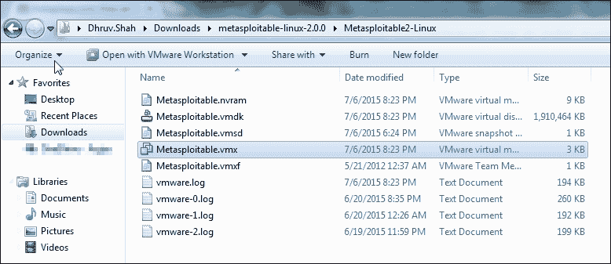

2.  Once loaded, it will be loaded into the virtual machine. It will show in the **Virtual** tab like this:

    

3.  Configure the **Network Adapter** device to **Bridge** mode so that it acquires a LAN IP. For VMware users, right click on the image, click on **Settings**, and select the network adapter options and select bridge mode. For VirtualBox users, right click on the Metasploitable image, select **Settings**, go to network and set the **Connect to** option to **Bridged**.

    您也可以选择将其设置为**NAT**或**仅主机**模式；确保两台机器位于相同的网络设置上；但在**仅主机**模式下，用户将无法访问互联网。由于此活动是在受控环境中进行的，因此允许将设置用于**桥接**网络。但是，作为读者，建议您将这些虚拟机保存在**NAT**环境或**纯主机**环境中：

    

4.  完成相同操作后，打开机器电源。由于我们已将连接设置为桥接，因此将自动为我们分配 IP。同样可以通过`ifconfig`命令进行检查。但是，如果我们没有分配一个，请在超级用户中运行`dhclient`。用户名为`msfadmin`，密码为`msfadmin`。
5.  We will now begin the vulnerability assessment on our Kali machine. First, we will perform an `nmap` scan to see the open ports on the Metasploitable 2 machine. Enter the following command in your Kali terminal:

    ```
    nmap -sT <IP address>

    ```

    输出将如以下屏幕截图所示：

    

6.  Once the port numbers are found, we will run the information gathering modules or the NSE scripts for more information. Enter the following command in the terminal:

    ```
    nmap -sT -T4 -A -sC <IP Address>

    ```

    输出为我们提供了大量信息。我们来看看,

    

    前面的屏幕截图显示服务器正在运行`ftp`、`openssh`、`telnet`、`smtp`、`domain`等等。已检索到更多信息。让我们看看下面的屏幕截图：

    

    我们还可以看到一个`mysql`服务、`postgresql`服务、`vnc`服务、`x11`和`IRC`服务在系统上运行。现在，让我们从 Metasploitable 2 服务器的漏洞评估开始。

7.  We will use Metasploit throughout this process. Let's analyze the `ftp` service to see if it is vulnerable to any known component. If the `Rhosts` option does not show our target IP address, we can fill it manually. Enter the following command in the Metasploit console:

    ```
          use auxiliary/scanner/ftp/anonymous
          show options
          set Rhosts <IP Address>
          exploit

    ```

    输出将如以下屏幕截图所示：

    

8.  We will try to use the authentication bypass for `mysql` and see if we are successful. Run the following command on the `msf` terminal:

    ```
          use auxiliary/scanner/mysql/mysql_authbypass_hashdump
          exploit

    ```

    输出将如以下屏幕截图所示：

    

9.  We also know that there was an `nfs` service running. Let's run the information gathering module `nfsmount`. Enter the following commands:

    ```
          use auxiliary/scanner/nfs/nfsmount
          show options
          exploit

    ```

    输出将如以下屏幕截图所示：

    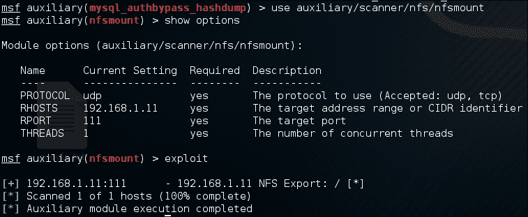

10.  We can even try a brute force attack on the `postgresql` service via the `metasploit` module. To do this, enter the following commands in the `mfs` terminal:

    ```
          use auxiliary/scanner/postgres/postgres_login
          exploit

    ```

    输出将如以下屏幕截图所示：

    

11.  There is an `smtp` service running as well. We can run the `smtp enumuser` script of Metasploit to list the available usernames. Run the following command in the `msf` terminal:

    ```
          use auxiliary/scanner/smtp/smtp_enum
          exploit

    ```

    输出将如以下屏幕截图所示：

    

12.  We performed an assessment on the VNC service as well. To do this, enter the following command in the `msf` terminal:

    ```
          use auxiliary/scanner/vnc/vnc_logins
          Show options
          exploit

    ```

    输出将如以下屏幕截图所示：

    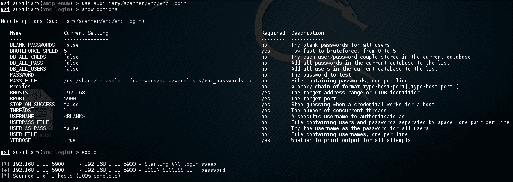

13.  There is an `x11` plugin to check for open `x11` connections. Let's test for an `x11` service running on the system. Type the following in the `msf` terminal:

    ```
          use auxiliary/scanner/x11/open_x11
          show options
    exploit 

    ```

    输出将如以下屏幕截图所示：

    

14.  There is also an IRC channel that is running on the server on port `6667`. The name of the IRC is `unreal IRC`. For verification, you can run a version detection scan on the given port using nmap. If we Google possible exploits for this service, we see the following:

    

    点击[https://www.exploit-db.com/exploits/16922/](https://www.exploit-db.com/exploits/16922/) 链接，我们看到如下内容：

    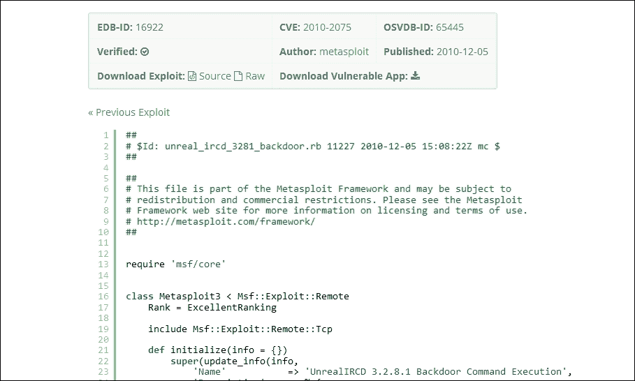

    这确认 IRC 服务可能容易受到后门命令执行的攻击。

## 它是如何工作的。。。

我们已经成功地评估了 Metasploitable 2 服务器。我们还没有完成所有的测试，但是我们已经涵盖了其中的一些。

我们使用了以下命令：

*   `use auxiliary/scanner/ftp/anonymous`：此命令加载匿名`ftp`评估脚本，帮助我们了解指定 IP 是否易受匿名 ftp 攻击。
*   `use auxiliary/scanner/mysql/mysql_authbypass_hashdump`：此命令加载`mysql`认证旁路`hashdump`检查是否可用。
*   `use auxiliary/scanner/nfs/nfsmount`：此命令加载`nfs`检查并显示服务器共享了哪些内容。
*   `use auxiliary/scanner/postgres/postgres_login`：此模块使用可用凭证列表强制执行。
*   `use auxiliary/scanner/smtp/smtp_enum`：此命令加载有助于列出 SMTP 服务上可用用户名的模块。
*   `use auxiliary/scanner/vnc/vnc_login`：此命令加载`vnc`凭证`bruteforce`脚本。
*   `use auxiliary/scanner/x11/open_x11`：此命令在 Metasploit 上加载`x11`打开终端枚举脚本。
*   `show options`：此命令显示执行脚本所需的参数。这里提到的所有脚本都符合此描述。
*   `exploit/run`：此命令执行脚本，并为各自的脚本运行提供输出。

## 还有更多。。。

更多扫描脚本可在`/usr/share/metasploit-framework/modules/auxiliary/scanner directory`中找到。

应该是这样的：


这些都是用于漏洞评估的可用脚本，只要我们找到在目标机器上运行的对应脚本。

## 另见。。。

*   欲了解更多信息，请访问[https://www.offensive-security.com/metasploit-unleashed/auxiliary-module-reference/](https://www.offensive-security.com/metasploit-unleashed/auxiliary-module-reference/) 。

# 基于 OpenVAS 框架的漏洞评估

我们已经了解了如何在`metasploit`、`nmap`脚本的帮助下进行手动漏洞评估测试。现在我们来看看如何使用自动扫描仪。OpenVAS 是一个由多个服务和工具组成的框架，具有全面而强大的漏洞扫描功能。OpenVAS 是 Kali Linux 操作系统的一部分。可在[下载 http://www.openvas.org/](http://www.openvas.org/) ，是开源软件。在本食谱中，我们将学习如何设置 OpenVAS。我们将安装、更新并开始使用这些服务。以下是了解扫描仪操作方式的体系结构：


### 注

有关 OpenVAS 的更多信息，请访问[http://www.openvas.org/](http://www.openvas.org/) 。

## 准备好了吗

首先，我们必须更新所有的包和库。OpenVAS 安装完成后，我们将更新插件并在 Metasploitable 2 机器上使用扫描仪。

## 怎么做。。。

1.  First, we will update and upgrade our OS to make sure our packages and libraries are up to date. To perform that, enter the following in the command line:

    ```
    apt-get update && apt-get upgrade

    ```

    输出将如以下屏幕截图所示：

    

2.  It will take quite some time to update and upgrade all your packages. Once this is done, browse to the following location and start the OpenVAS setup:

    

3.  The setup is self-explanatory, and you will come across the following screens. It updates the OpenVAS NVT Feed, as shown in the following screenshot:

    

4.  As the installation proceeds, it updates the CVE feeds. **CVE** stands for **Common Vulnerabilities and Exposures**.

    输出将如以下屏幕截图所示：

    

5.  Once the download completes, a user is created and the services are made available to us, as shown in the following screenshot:

    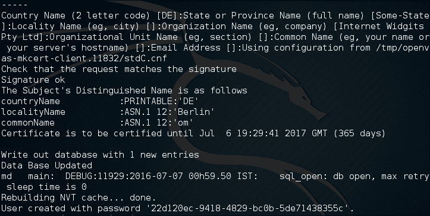

6.  We will now check if the installation has been done properly using the following command in the terminal:

    ```
    openvas-check-setup

    ```

    输出将如以下屏幕截图所示：

    

    成功安装后，我们将看到以下内容：

    

7.  This shows that our installation has been successful. We will restart the services at once:

    ```
          openvas-stop
          openvas-start

    ```

    输出将如以下屏幕截图所示：

    

8.  Let's also create a new password for the user, as well as a new user:

    ```
          openvasmd --user=admin --new-password=<Your password>
          openvasmd --create-user <Your Username>

    ```

    输出将如以下屏幕截图所示：

    

9.  Now that we know that the installation has been done successfully, we will access the Greenbone Security Assistant. Enter the `https://127.0.0.1:9392/login/login.html` URL in the Iceweasel browser and enter our credentials:

    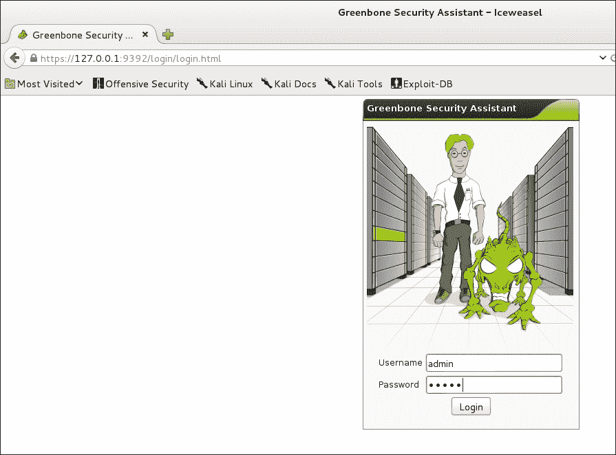

10.  Once logged in, this is how the screen will look. We will enter the target IP address as seen in the following screenshot:

    

11.  Once we hit the **Start Scan** option, the scanner uses its knowledge of all the plugins and checks for any known vulnerabilities on the application. It is a time-consuming process and totally depends on the number of ports open on the server. Once the scan completes, the total number of vulnerabilities detected is shown:

    

12.  As shown in the preceding screenshot, to view the reports we will click on the **Scan Management** tab and click on the **Reports** option, which takes us to the reporting page. Then, we will select the IP address that we scanned, which will show us all the vulnerabilities:

    

13.  We can export a PDF report with these details. Above the reports, as the mouse pointer indicates in the following screenshot, there will be a download option, and we can save it from there:

    

14.  The saved PDF file will look as shown in the following screenshot:

    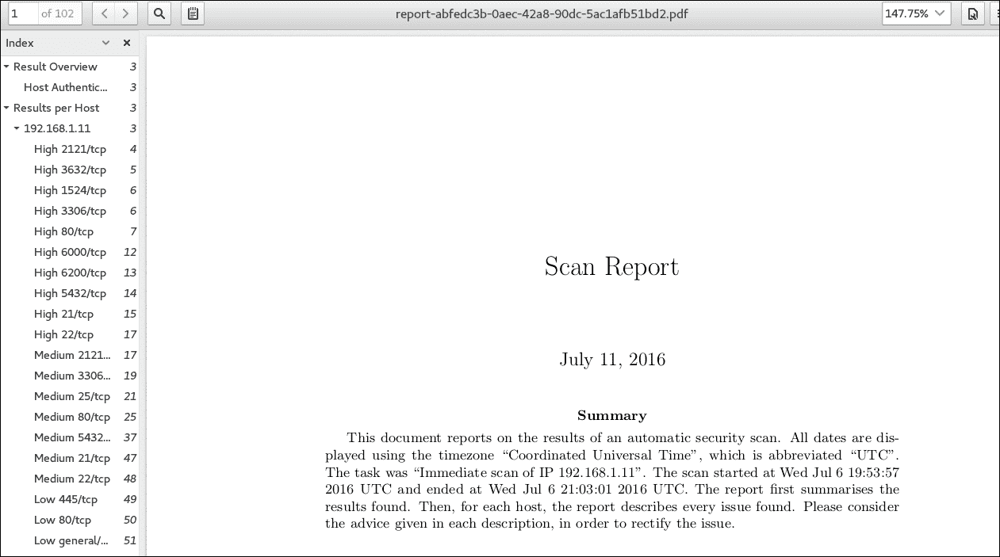

    然后可以使用该文件枚举不同类型的漏洞，然后我们可以检查漏洞列表中是否存在误报。

## 它是如何工作的。。。

如您所见，设置和操作 OpenVAS 漏洞扫描程序非常容易。让我们看看后端实际发生了什么，以及前面使用的几个命令的含义。

让我们先看一下命令：

*   `openvas-check-setup`：此命令验证 OpenVAS 安装程序是否正确安装，并警告我们文件安装不完整。它还建议进行任何必要的修复，以使软件启动并运行。
*   `openvas-stop`：此命令停止 OpenVAS 中涉及的服务，如 OpenVAS 扫描仪、manager 和 Greenbone 安全助手。
*   `openvas-start`：此命令启动 OpenVAS 中涉及的所有服务，如 OpenVAS 扫描仪、manager 和 Greenbone 安全助手。
*   `openvasmd --user=<Your Username> --new-password=<Your password>`：此命令有助于为您创建的用户设置新密码。
*   `openvasmd --create-user <Username>`：此命令使用指定的用户名创建用户。

当我们启动扫描时，扫描仪加载所有模块和插件，以对所有可用端口执行评估。程序如下：

*   扫描打开的端口
*   为所有开放端口及其服务运行插件
*   运行 CVE 数据库和 OpenVAS NVT 源中的已知漏洞
*   基于插件评估，我们获得了评估目标可能存在的积极漏洞的输出

## 还有更多。。。

我们甚至可以在 Greenbone Security Assistant 中的**配置**选项卡的帮助下，根据我们的方便配置扫描。我们还可以为系统配置审查设置系统凭据，并自定义要扫描的警报、筛选器和端口。

仅仅看几个例子就不容易理解“漏洞评估”一词。需要有一个可以遵循的标准来获得评估如何真正发生的基本概念。在本节中，我们将了解漏洞评估的含义。

漏洞评估有时与渗透测试混淆。贯穿整个过程的漏洞评估的核心目的是识别对系统、环境或组织的威胁。在漏洞评估过程中，主要目标是找到进入系统的入口点，并确定他们是否在使用易受攻击的服务或易受攻击的组件。然后进行严格的测试，以确定系统上是否存在各种类型的已知威胁。

然而，渗透测试不仅仅是鉴定。当您开始攻击系统以获取 shell 或使服务崩溃时，您就参与了渗透测试。为了有一个有组织的漏洞评估方法，可以参考开源。有一篇非常好的文章帮助理解 Daniel Meisler 编写的漏洞评估和渗透测试之间的一线希望。这里是文章的链接：[https://danielmiessler.com/study/vulnerability-assessment-penetration-test/](https://danielmiessler.com/study/vulnerability-assessment-penetration-test/) 。

测试方法的一些示例如下：

*   **渗透测试执行标准**（**PTES**）
*   **开放式 Web 应用安全项目**（**OWASP**）：Web 应用测试指南
*   **开源安全测试方法手册**（**OSSTMM**
*   Web 应用程序黑客方法（Web 应用程序黑客手册）

### 私人有限公司

渗透测试执行标准见[http://www.pentest-standard.org/index.php/Main_Page](http://www.pentest-standard.org/index.php/Main_Page) 由七个主要部分组成：

*   *婚前互动*
*   *情报搜集*
*   *威胁建模*
*   *漏洞分析*
*   *利用*
*   *后期利用*
*   *报告*

正如 PTE 总结的那样，“*漏洞测试是发现系统和应用程序中可能被攻击者利用的缺陷的过程。这些缺陷可能包括主机和服务错误配置或不安全的应用程序设计。尽管用于查找缺陷的过程各不相同，并且高度依赖于被测的特定组件，但 some 关键负责人适用于流程。*

PTES 是一系列非常详细的技术指南，可在[上找到 http://www.pentest-standard.org/index.php/PTES_Technical_Guidelines](http://www.pentest-standard.org/index.php/PTES_Technical_Guidelines) 。

### OWASP

开放式 Web 应用程序安全项目主要处理基于 Web 应用程序的安全评估。OWASP 是一个非营利性慈善组织，旨在提高软件的安全性。它是一个应用广泛的基于 web 的安全组织。OWASP 可在[找到 https://www.owasp.org/](https://www.owasp.org/) 。

OWASP 的目标最好由组织本身来概括：“*每个人都可以自由参与 OWASP，我们的所有资料都可以通过免费开放的软件许可证获得。您可以在我们的 wiki 上找到关于 OWASP 的所有信息，也可以在我们的 OWASP 博客上找到与 OWASP 相关的最新信息。OWASP 不支持或推荐商业产品或服务，允许我们的社区保持供应商中立凭借全球软件安全领域最优秀人才的集体智慧。*

*我们要求社区注意 OWASP 品牌的不当使用，包括使用我们的名称、徽标、项目名称和其他商标问题。*

OWASP 测试指南见[https://www.owasp.org/index.php/Web_Application_Penetration_Testing](https://www.owasp.org/index.php/Web_Application_Penetration_Testing) 。

### 网络应用黑客的方法论

这一方法在《Web 应用程序黑客手册：发现和利用安全漏洞》一书中有很好的定义，第 2 版。同样适用于[http://www.amazon.in/Web-Application-Hackers-Handbook-Exploiting/dp/8126533404/ &关键词=网络+应用程序+黑客+手册](http://www.amazon.in/Web-Application-Hackers-Handbook-Exploiting/dp/8126533404/&keywords=web+application+hackers+handbook)。

要总结该方法，请查看下图：


## 另见。。。

*   有关 OpenVAS 工作的更多信息，请参阅 NetSecNow 在[上的视频教程 https://www.youtube.com/watch?v=0b4SVyP0IqI](https://www.youtube.com/watch?v=0b4SVyP0IqI) 。